# 002：先验分析与后验测试 🔍

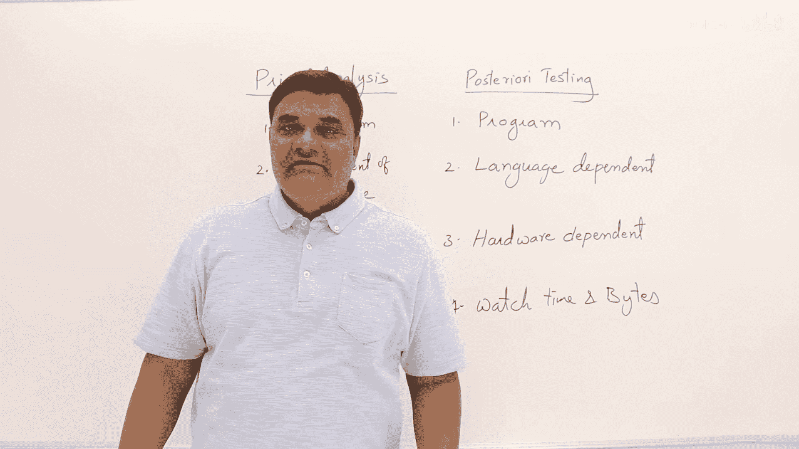

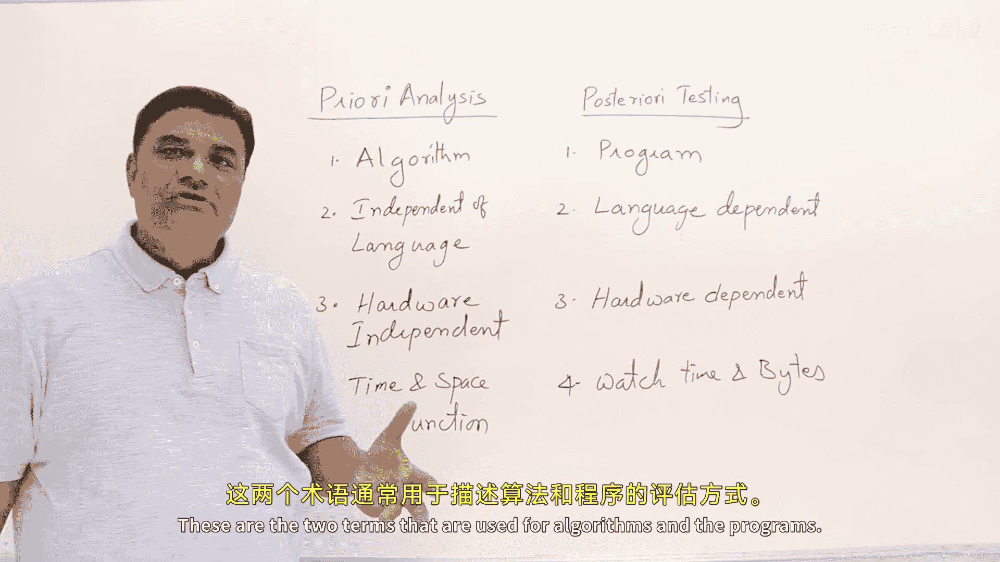

在本节课中，我们将学习算法分析中的两个核心概念：先验分析与后验测试。我们将探讨它们的定义、区别以及各自的应用场景。

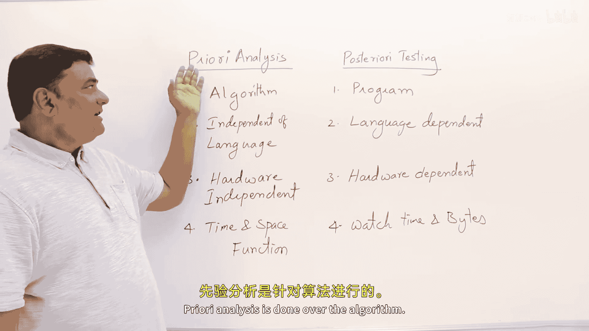

## 先验分析 📊

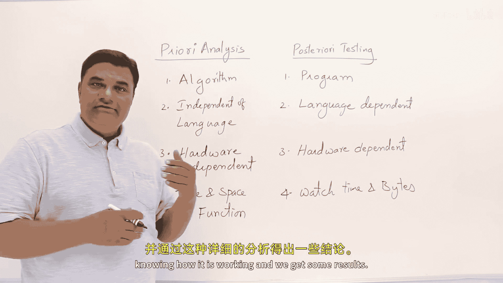

上一节我们介绍了算法分析的重要性，本节中我们来看看什么是先验分析。

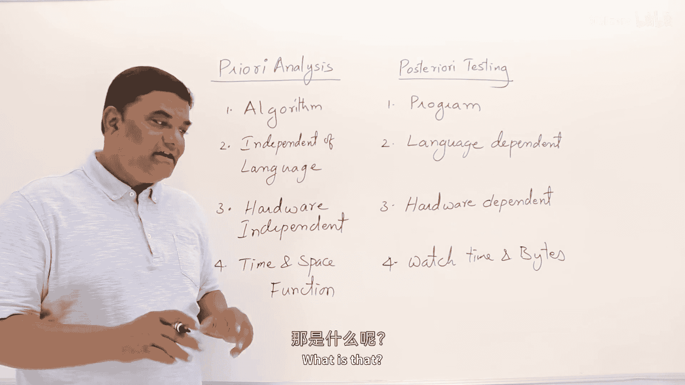

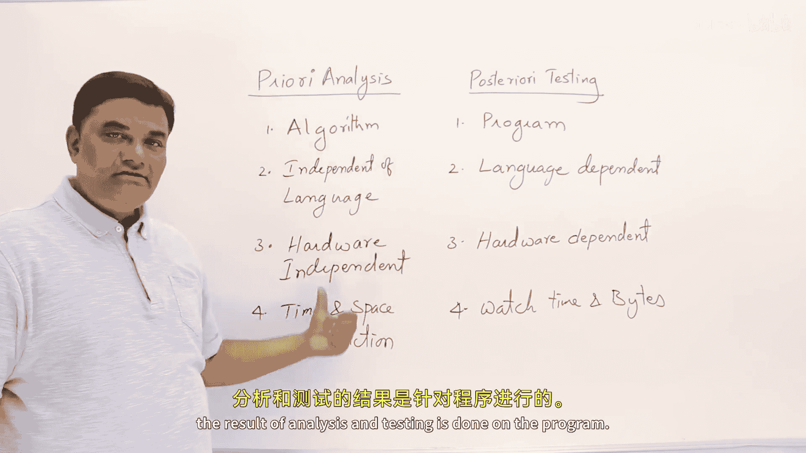

先验分析是针对算法本身进行的。这意味着我们将通过深入研究算法的工作原理来进行分析，并得出一些结果。

分析的结果是，我们可以找出算法所消耗的时间和空间。

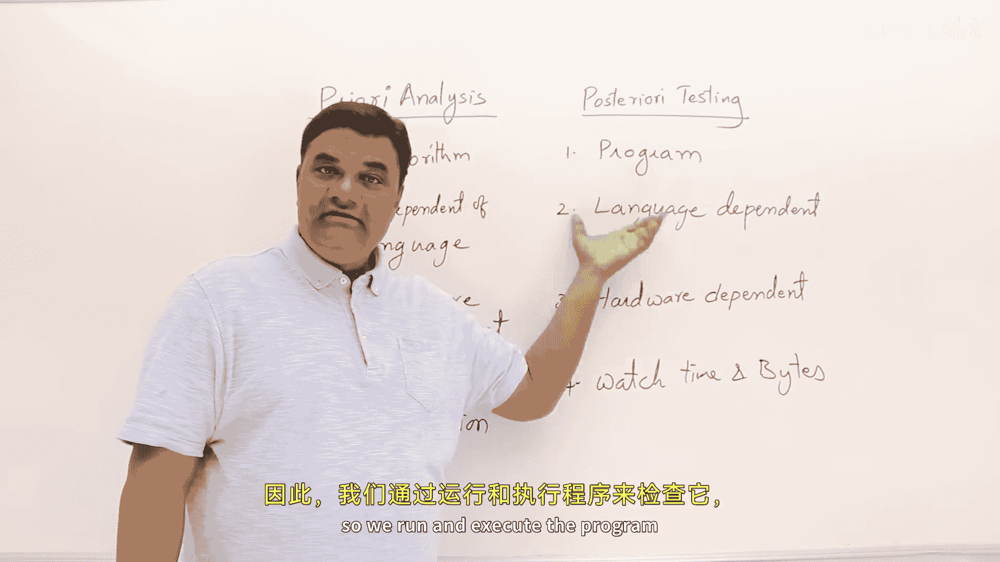

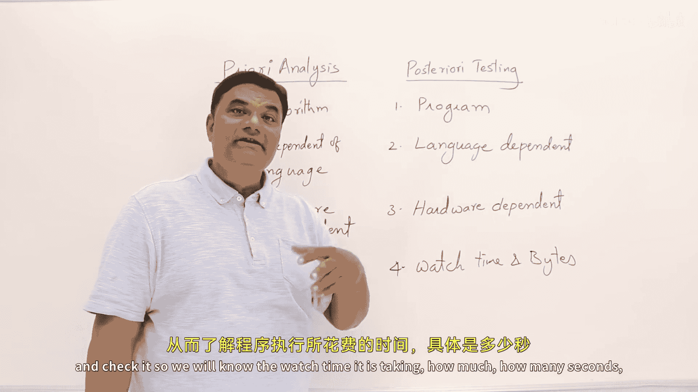

以下是先验分析的特点：
*   分析的对象是**算法**。
*   算法是**语言无关**的，不依赖于特定编程语言。
*   算法是**硬件无关**的，不针对特定硬件设计。
*   分析得出的结果不是具体的分钟或秒数，而是**时间函数**和**空间函数**。

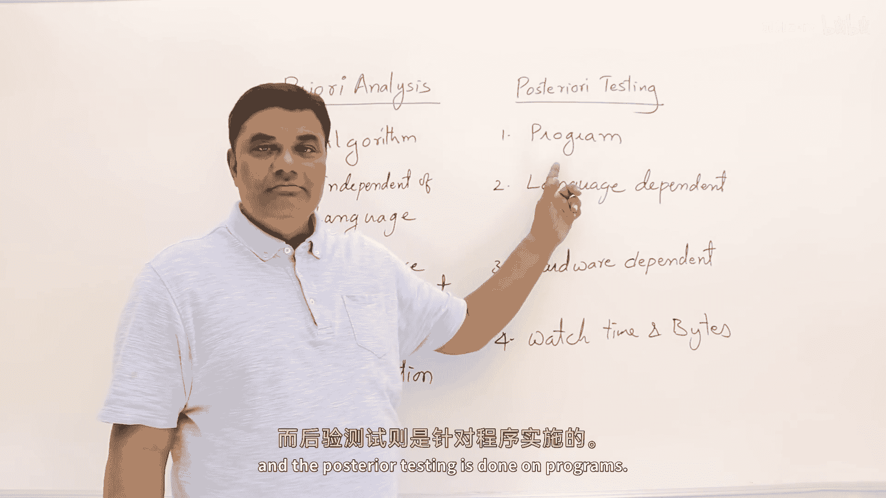

## 后验测试 ⚙️

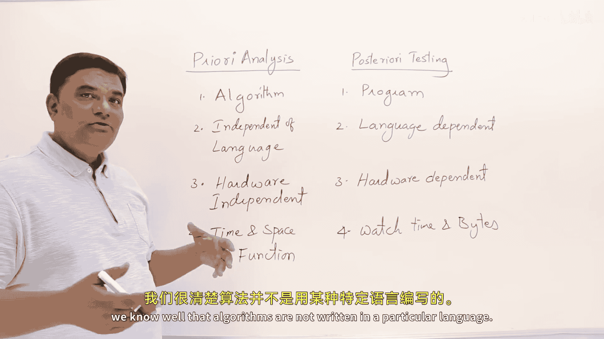

了解了理论上的先验分析后，我们来看看与之对应的实践方法——后验测试。

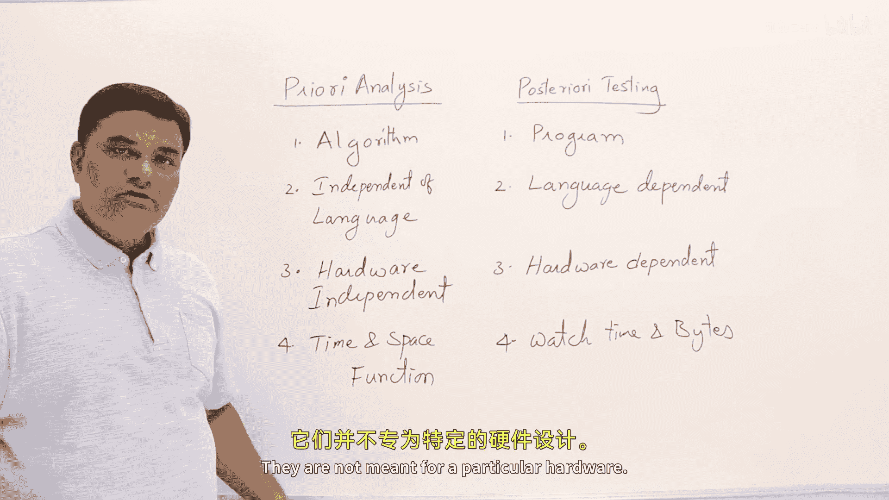

测试是针对程序进行的。我们运行并执行程序，通过检查来了解它实际花费了多少时间（例如多少秒、毫秒），以及消耗了多少内存（以字节为单位）。

以下是后验测试的特点：
*   测试的对象是**程序**。
*   程序是**高度特定**的，依赖于具体的编程语言。
*   程序也依赖于**硬件**、**操作系统**和**运行环境**。
*   测试得出的是程序在特定环境下运行所消耗的**具体时间**和**具体空间**。

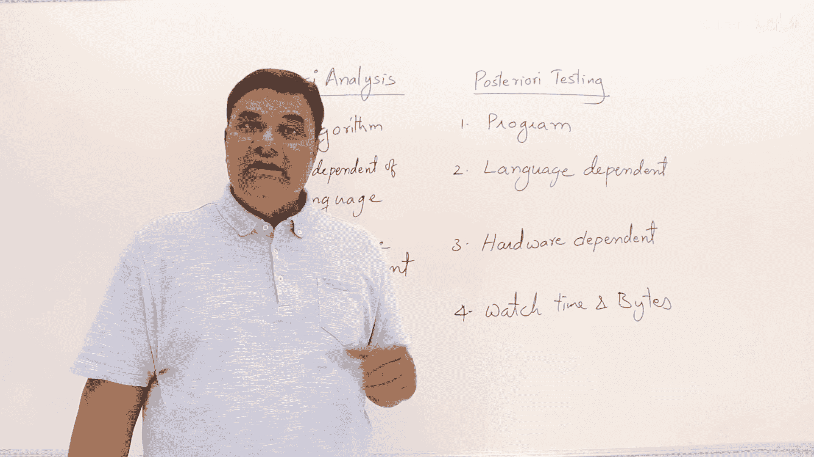

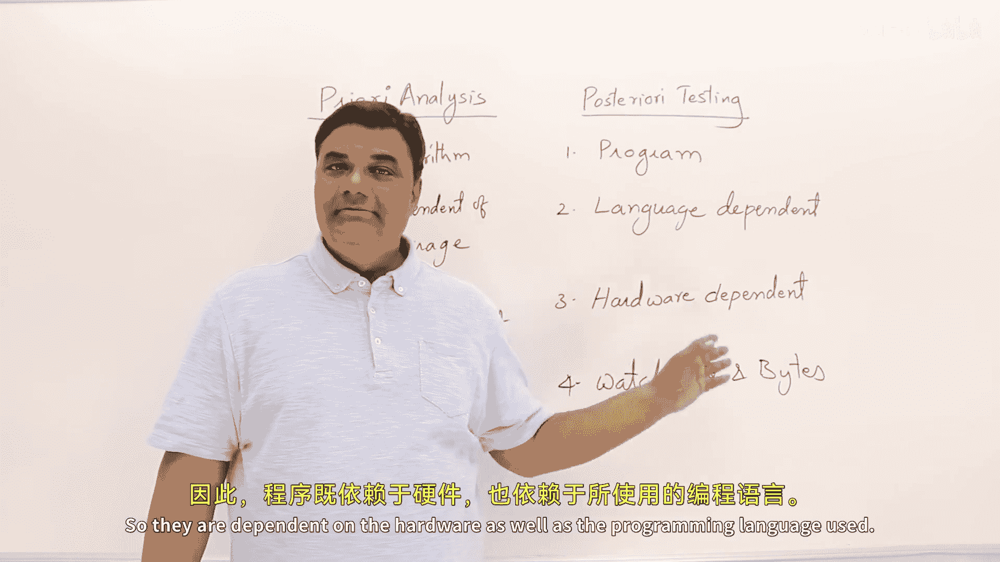

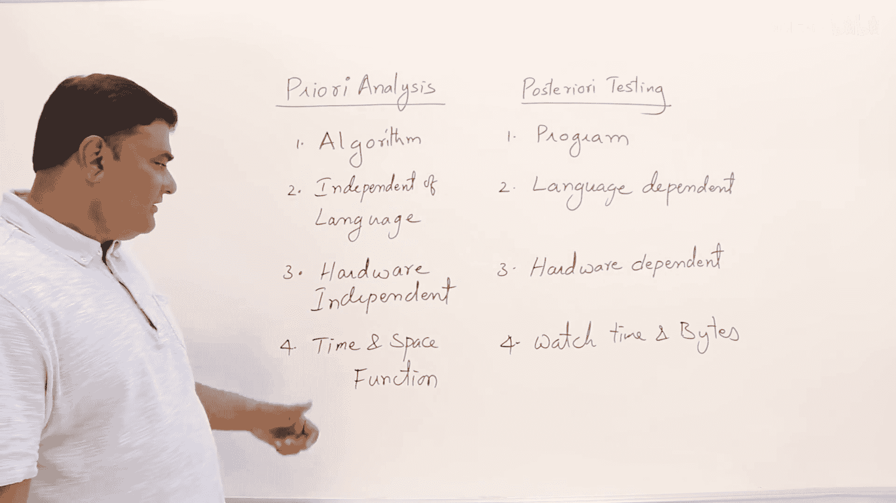

## 总结 📝

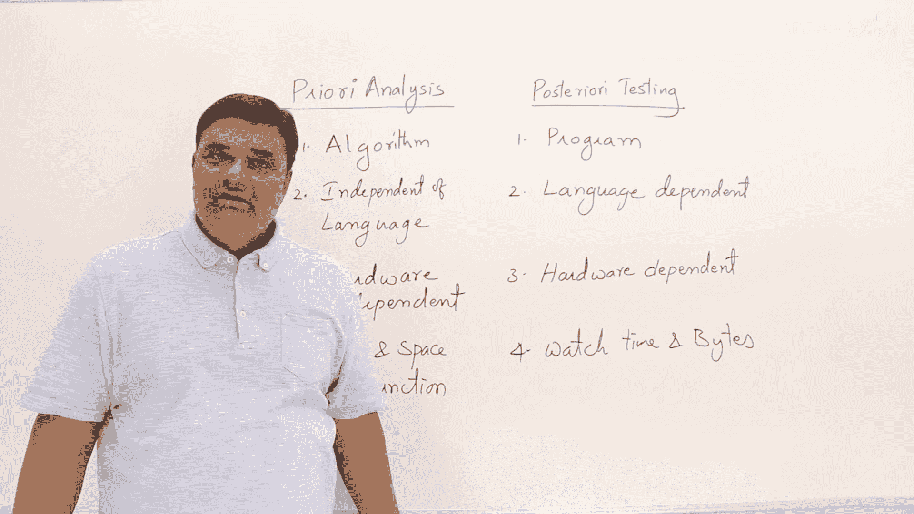

本节课中我们一起学习了算法分析的两个基本方法。

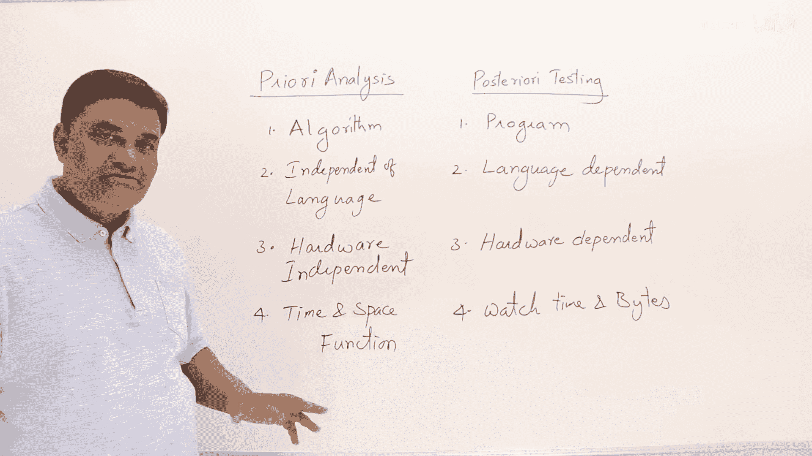

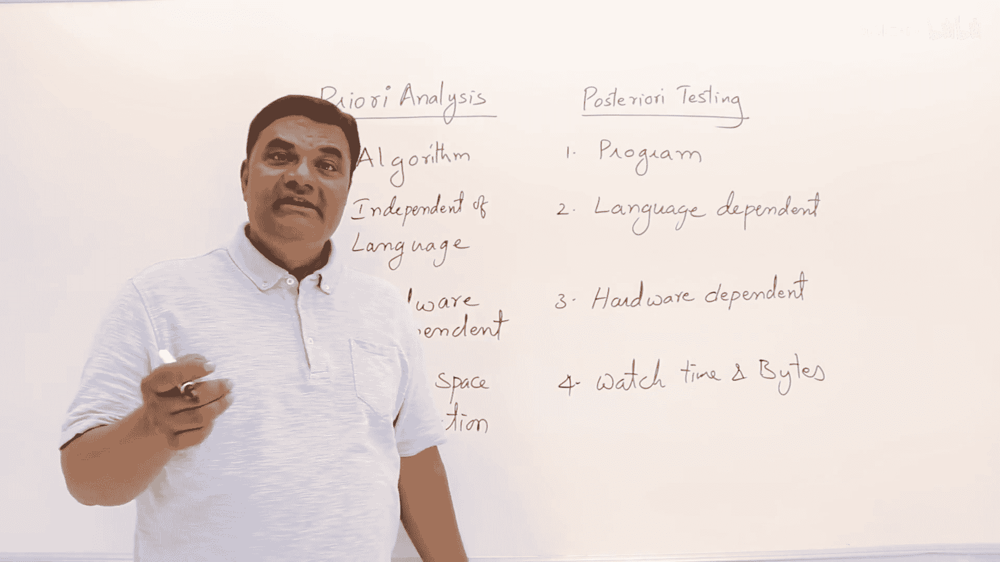

先验分析是在算法层面进行的、独立于语言和硬件的理论分析，其结果表示为时间与空间的函数。而后验测试是在程序层面进行的、依赖于具体语言和运行环境的实践测试，其结果表现为具体的运行时间和内存占用。理解这两者的区别是进行有效算法设计与评估的基础。