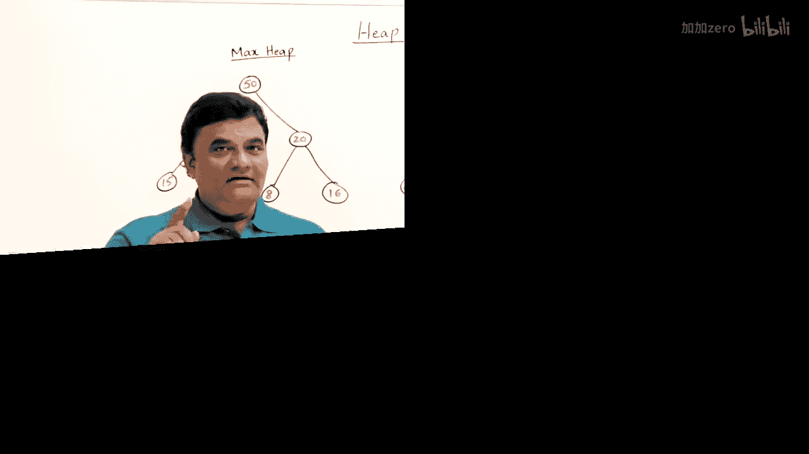
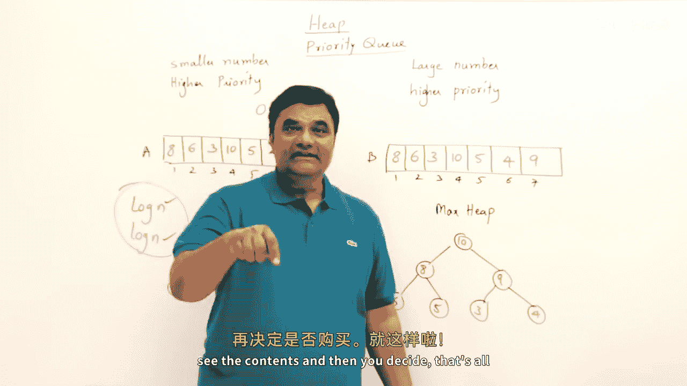

# 032：堆 📚

在本节课中，我们将要学习**堆**这一数据结构。堆是一种特殊的完全二叉树，常用于实现高效的排序算法（堆排序）和优先级队列。我们将从堆的基本表示方法开始，逐步学习堆的插入、删除操作，以及堆排序和堆化算法，最后了解堆在优先级队列中的应用。

---

## 堆的数组表示 🌳

上一节我们介绍了堆的基本概念，本节中我们来看看如何在计算机中表示堆。通常，我们使用数组来存储一个堆，因为这样可以高效地利用内存并快速访问父子节点。

对于一个存储在数组中的完全二叉树，如果任意节点的索引为 `i`，那么其父子节点的位置可以通过以下公式确定：
*   左子节点索引：`2 * i`
*   右子节点索引：`2 * i + 1`
*   父节点索引：`floor(i / 2)`

以下是使用数组表示二叉树的示例：
*   数组 `[A, B, C, D, E, F, G]` 对应一个完全二叉树。
*   节点 `B` 在索引 2，其左子节点 `D` 在索引 `2*2=4`，右子节点 `E` 在索引 `2*2+1=5`。
*   节点 `F` 在索引 6，其父节点索引为 `floor(6/2)=3`，即节点 `C`。

为了自动满足这些公式，我们在将二叉树存入数组时，必须**按层级顺序填充**。如果某个位置没有节点，则必须留空。例如，一个缺少左子节点的二叉树，在数组中对应的位置应为空。

---

## 完全二叉树与满二叉树 🌲

在深入学习堆之前，我们需要明确两种特殊的二叉树：满二叉树和完全二叉树。

*   **满二叉树**：一棵高度为 `h` 的二叉树，如果拥有最大可能数量的节点（即 `2^(h+1)-1` 个节点），则称为满二叉树。没有空间再添加任何新节点。
*   **完全二叉树**：一棵二叉树，如果其所有层级（除了最后一层）都被完全填满，并且最后一层的节点都尽可能靠左排列，则称为完全二叉树。**在数组表示中，这意味着从第一个元素到最后一个元素之间没有任何空位**。

重要结论：
1.  所有满二叉树都是完全二叉树。
2.  完全二叉树的高度是 `log n`，这是可能的最小高度。
3.  堆必须是一棵完全二叉树。

---

## 堆的定义与类型 ⛰️

现在，让我们正式定义堆。**堆是一种满足特定堆序性质的完全二叉树**。根据堆序性质的不同，堆分为两种：

*   **最大堆**：树中任意节点的值都**大于或等于**其所有后代节点的值。因此，根节点存储着最大值。
    *   示例：根节点为50，其子节点30和20均小于50；30的子节点15和10也小于30。
*   **最小堆**：树中任意节点的值都**小于或等于**其所有后代节点的值。因此，根节点存储着最小值。
    *   示例：根节点为10，其子节点30和20均大于10；30的子节点35和40也大于30。

在后续学习中，我们将以**最大堆**为例，其原理同样适用于最小堆。

---

## 堆的插入操作 ⬆️

上一节我们了解了堆的结构，本节中我们来看看如何向一个最大堆中插入新元素。插入操作的目标是在添加新元素后，仍然保持堆的性质。

插入步骤如下：
1.  将新元素添加到堆的**末尾**（即数组的下一个空闲位置）。这保证了树仍然是完全二叉树。
2.  由于新元素可能破坏堆序性质，需要将其与父节点进行比较。
3.  如果新元素大于其父节点，则交换它们的位置。
4.  重复步骤3，将新元素不断与新的父节点比较并上浮，直到它不大于其父节点，或者到达根节点。

**时间复杂度分析**：在最坏情况下，新元素需要从叶子节点一直上浮到根节点，移动次数等于树的高度。由于完全二叉树的高度为 `O(log n)`，因此插入操作的最坏时间复杂度为 `O(log n)`。最好情况下（新元素很小，无需上浮），时间复杂度为 `O(1)`。

**核心要点**：插入操作中，元素的调整方向是**自底向上**（从叶子到根）。

---

## 堆的删除操作 ⬇️

在堆中，我们通常只删除**根节点**的元素，因为根节点存储着最大（或最小）值，这是堆最有用的特性。

删除步骤如下：
1.  移除根节点元素。
2.  将堆中**最后一个元素**移动到根节点的位置。这保证了树仍然是完全二叉树。
3.  新的根元素可能破坏堆序性质，需要将其与子节点进行调整。
4.  将根节点与其**较大的子节点**进行比较。
5.  如果根节点小于该子节点，则交换它们的位置。
6.  重复步骤4和5，将元素不断下沉，直到它大于等于其所有子节点，或者到达叶子节点。

**时间复杂度分析**：在最坏情况下，元素需要从根节点一直下沉到叶子节点，移动次数等于树的高度，即 `O(log n)`。

**核心要点**：删除操作中，元素的调整方向是**自顶向下**（从根到叶子）。这与插入操作的方向相反。

---

## 堆排序算法 🔄

堆排序是一种基于堆数据结构的比较排序算法。它的思想非常巧妙：利用堆的根节点总是最大（或最小）值的特性，反复取出根节点，从而得到一个有序序列。

堆排序分为两个主要阶段：

**第一阶段：建堆**
将给定的无序数组构造成一个最大堆。
*   方法：可以视为从第一个元素开始，反复执行 `n-1` 次插入操作。
*   时间复杂度：每次插入是 `O(log n)`，`n` 次插入总时间为 `O(n log n)`。

**第二阶段：排序**
1.  此时，堆的根节点（数组第一个位置）是最大元素。
2.  将根节点与堆的最后一个元素交换。此时，最大元素被放到了数组末尾的正确位置，并且它不再属于堆（堆大小减1）。
3.  对新的根节点执行一次“删除调整”（即下沉操作），使剩余元素重新构成最大堆。
4.  重复步骤2和3，直到堆中只剩下一个元素。此时，数组已完全有序。

**整体时间复杂度**：建堆 `O(n log n)` + 排序 `O(n log n)` = **`O(n log n)`**。

**空间复杂度**：`O(1)`（原地排序）。

---

## 堆化算法 ⚡

上一节我们通过反复插入来建堆，时间复杂度是 `O(n log n)`。本节介绍一种更高效的建堆方法——**堆化**，它可以在 `O(n)` 时间内完成。

堆化算法的核心思想是“自底向上”地构建堆，但调整方向是“自顶向下”（下沉）。它从**最后一个非叶子节点**开始，向前遍历到根节点，对每个节点执行下沉操作，确保以该节点为根的子树满足堆性质。

以下是堆化步骤：
1.  找到最后一个非叶子节点的索引（对于大小为 `n` 的堆，索引为 `floor(n/2)`）。
2.  从该节点开始，递减索引直到根节点（索引1）：
    *   对当前节点调用“下沉”操作，确保以其为根的子树是堆。
3.  当遍历到根节点并完成下沉后，整个数组就构成了一个堆。

**为什么更快？** 堆化算法利用了子树高度较小的特点。大部分节点位于底层，它们下沉的代价很小。经过数学推导，其总时间复杂度为 `O(n)`，优于反复插入的 `O(n log n)`。

---

## 优先级队列 🎯

优先级队列是一种抽象数据类型，每个元素都有一个“优先级”。出队时，总是先删除优先级最高（或最低）的元素。堆是实现优先级队列的理想数据结构。

**堆如何实现优先级队列？**
*   **插入**：相当于堆的插入操作 (`O(log n)`）。
*   **删除最高优先级元素**：相当于删除堆的根节点 (`O(log n)`）。

**两种配置**：
*   若**数值越小优先级越高**，则使用**最小堆**。
*   若**数值越大优先级越高**，则使用**最大堆**。

与使用普通有序或无序数组实现相比，堆在插入和删除操作上都提供了更优的 `O(log n)` 时间复杂度，使其成为实现高效优先级队列的首选。

---

## 总结 📝

本节课中我们一起学习了堆这一重要的数据结构。
1.  我们首先学习了如何使用数组表示完全二叉树，以及满二叉树和完全二叉树的区别。
2.  接着，我们定义了最大堆和最小堆，并详细讲解了堆的**插入**（上浮）和**删除**（下沉）操作，其时间复杂度均为 `O(log n)`。
3.  基于删除操作总是取出最大元素的特性，我们推导出了**堆排序**算法，其时间复杂度为 `O(n log n)`。
4.  然后，我们介绍了更高效的 `O(n)` **堆化**建堆算法。
5.  最后，我们探讨了堆在实现**优先级队列**中的应用，展示了其在高频插入删除场景下的性能优势。

掌握堆及其相关操作，是理解许多高级算法（如图算法、调度算法）的基础。