# 048：多阶段图（程序实现）📊

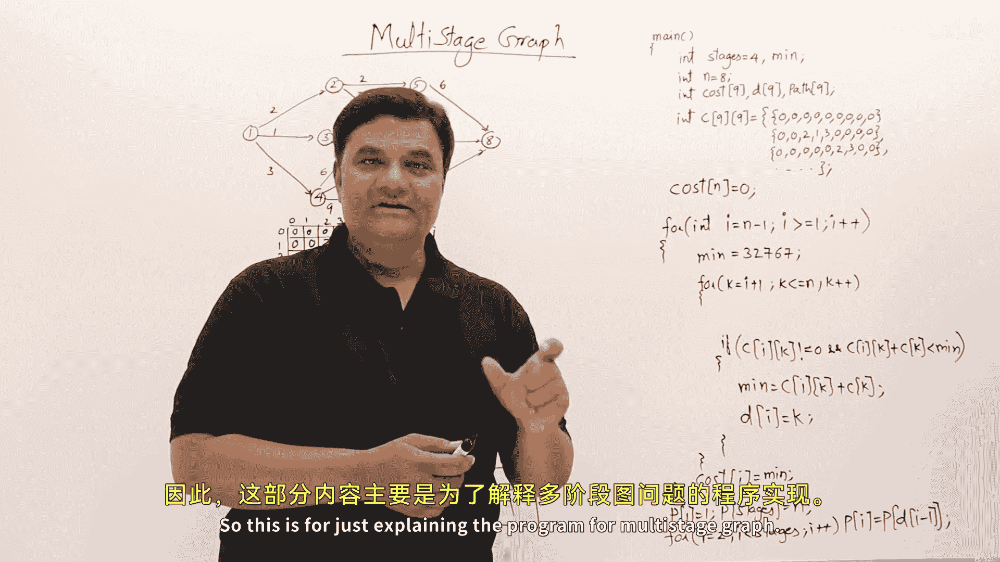

在本节课中，我们将学习如何使用动态规划解决多阶段图问题，并详细解释其C++程序实现。我们将从理解问题开始，逐步分析程序的数据结构、核心算法逻辑，并最终计算出最短路径及其时间复杂度。

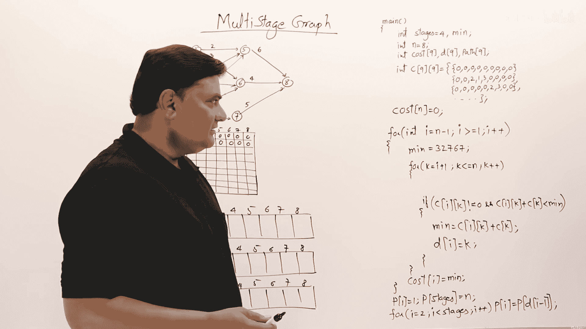

---

## 概述

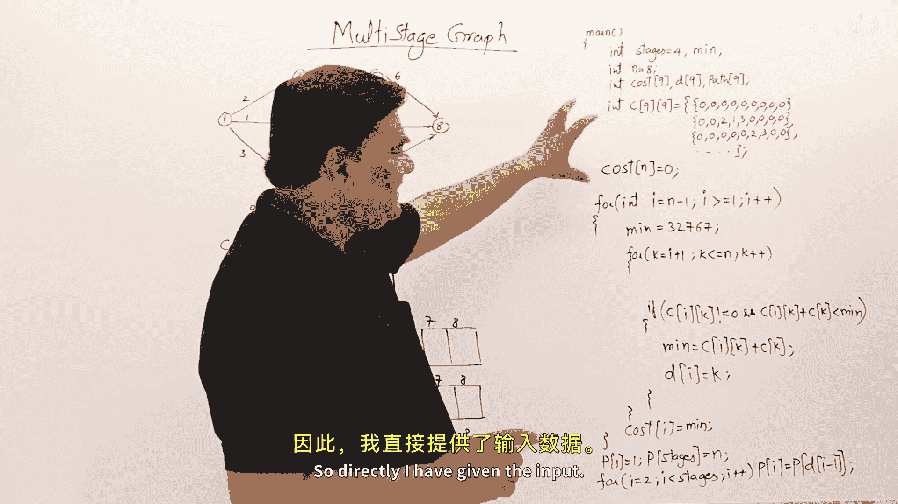

多阶段图问题旨在找到从源点到汇点的最短路径，其中图被划分为多个阶段，边仅从较早阶段指向较晚阶段。我们将使用动态规划中的**前向法**来解决此问题，并通过一个具体的C++程序示例来演示如何实现算法、追踪计算过程并找出最短路径。

---

## 数据结构与初始化

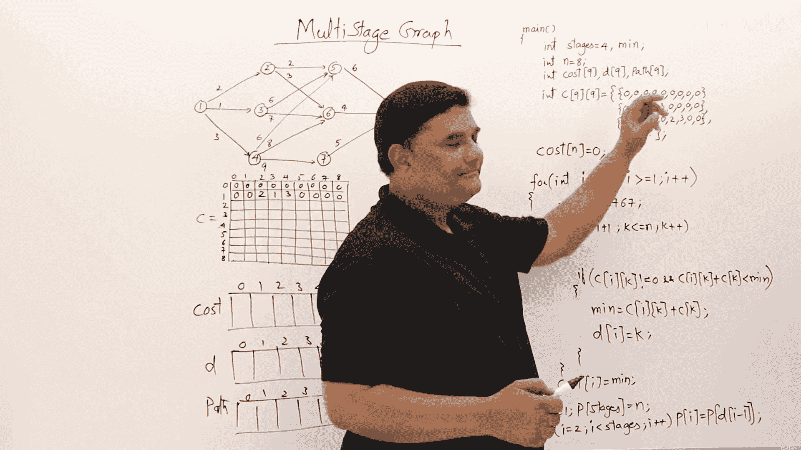

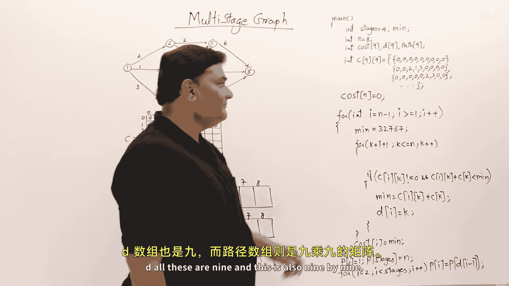

首先，我们需要定义合适的数据结构来表示图并存储计算过程中的中间结果。以下是程序中使用的主要数据结构：

*   **邻接矩阵 `c`**： 用于存储图中各边的权值（成本）。由于顶点编号从1开始，而数组索引从0开始，我们声明大小为9（索引0-8），并忽略0行和0列以方便使用。
*   **成本数组 `cost`**： 用于存储从每个顶点到汇点（顶点8）的最短成本。
*   **决策数组 `d`**： 用于记录在计算 `cost[i]` 时，使得总成本最小的下一个顶点 `k`。
*   **路径数组 `p`**： 用于最终重构从源点到汇点的最短路径。

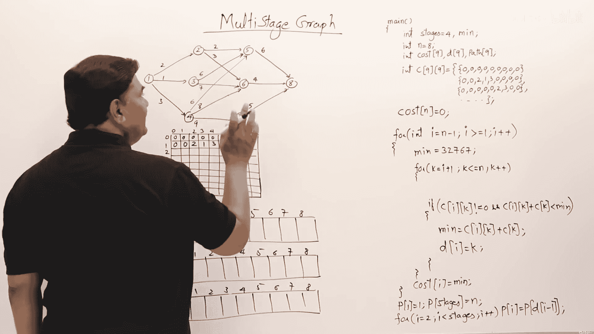

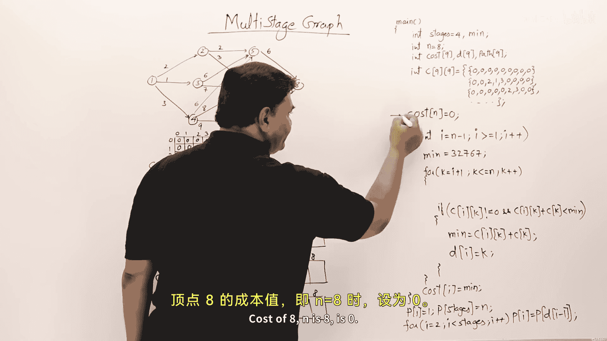

在程序中，图的邻接矩阵数据被直接初始化。例如，`c[1][2] = 2` 表示从顶点1到顶点2的边成本为2。

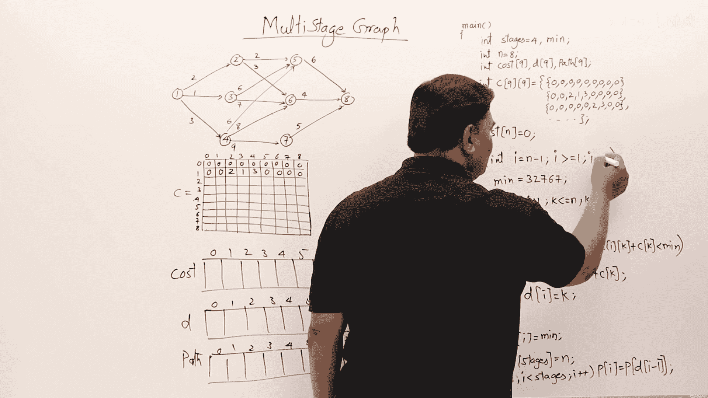

```cpp
// 示例：成本邻接矩阵的部分初始化
int c[9][9] = {
    {0, 0, 0, 0, 0, 0, 0, 0, 0},
    {0, 0, 2, 1, 3, 0, 0, 0, 0}, // 顶点1到2,3,4的成本
    {0, 0, 0, 0, 0, 2, 3, 0, 0}, // 顶点2到5,6的成本
    // ... 其他行以此类推
};
int cost[9], d[9], p[9];
int n = 8; // 顶点总数
int stages = 4; // 阶段总数
```

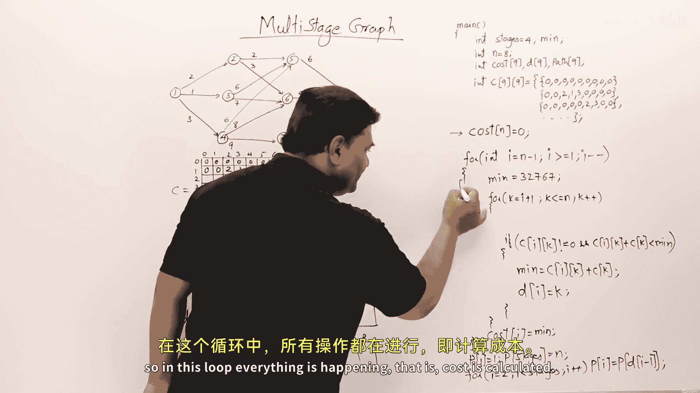

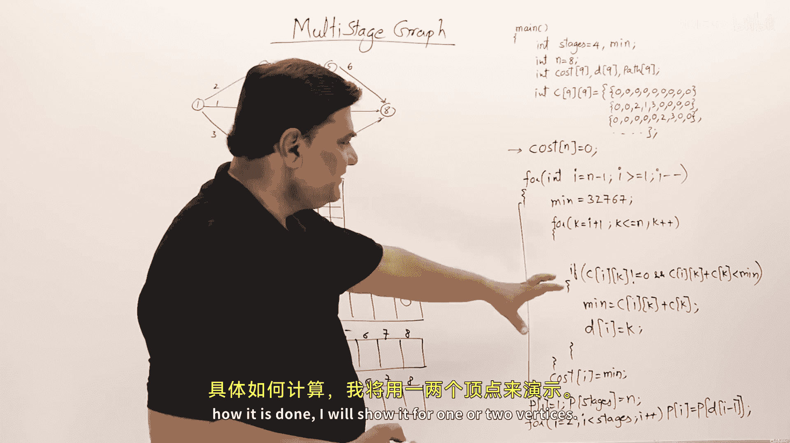

---

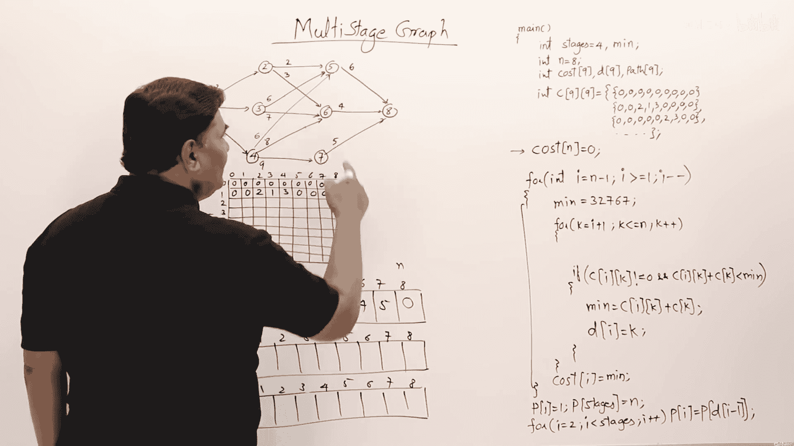

## 核心算法：动态规划计算

上一节我们介绍了所需的数据结构，本节中我们来看看动态规划的核心计算过程。算法从汇点开始，逆向计算每个顶点到汇点的最短成本。

**核心公式**如下，对于顶点 `i`，其到汇点的最小成本 `cost[i]` 是：

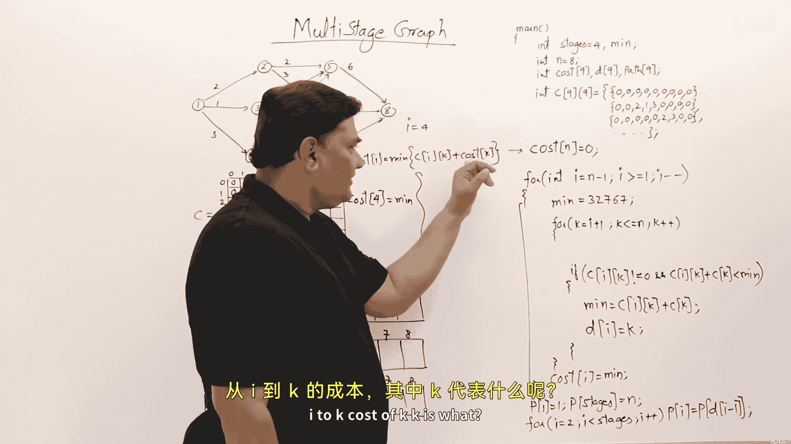

```
cost[i] = min { c[i][k] + cost[k] }， 其中 k 取遍 i 的所有后继顶点。
```


程序实现如下：

1.  **初始化**： 汇点（顶点n）的成本为0，即 `cost[n] = 0`。
2.  **逆向计算**： 使用一个循环，从顶点 `n-1` 递减到 `1`，计算每个顶点 `i` 的成本。
    *   对于每个顶点 `i`，遍历其所有可能的后继顶点 `k` (从 `i+1` 到 `n`)。
    *   如果存在边 `c[i][k]`（即权值不为0），则计算 `c[i][k] + cost[k]`。
    *   在所有计算结果中，取最小值作为 `cost[i]`，并将对应的 `k` 存入 `d[i]`。

以下是算法关键部分的代码逻辑：


```cpp
cost[n] = 0; // 汇点成本为0

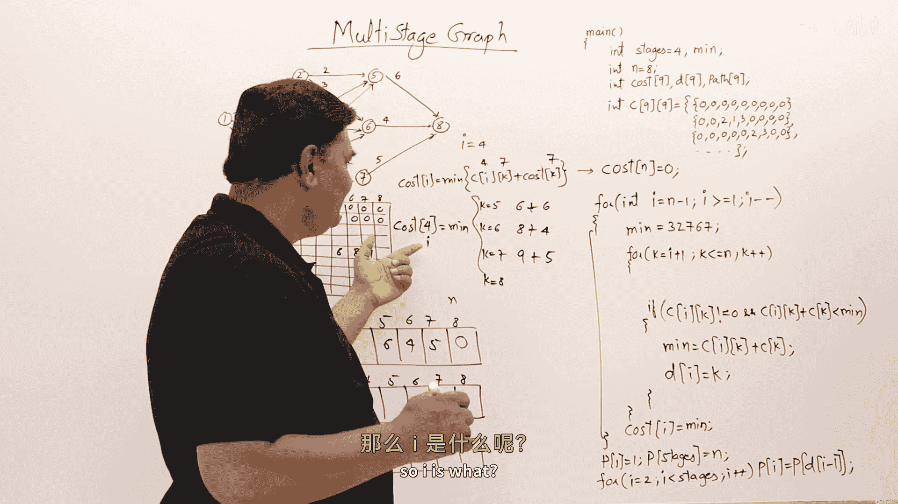

// 从顶点n-1逆向计算到顶点1
for (int i = n-1; i >= 1; i--) {
    int minCost = INT_MAX;
    int minVertex = -1;

    // 遍历顶点i的所有后继顶点
    for (int k = i+1; k <= n; k++) {
        if (c[i][k] != 0) {
            int currentCost = c[i][k] + cost[k];
            if (currentCost < minCost) {
                minCost = currentCost;
                minVertex = k;
            }
        }
    }
    cost[i] = minCost;
    d[i] = minVertex;
}
```

**计算过程示例**： 以顶点4为例。
*   其后继顶点有5、6、7、8（但4到8无边，故忽略）。
*   计算 `c[4][5] + cost[5] = 6 + 6 = 12`
*   计算 `c[4][6] + cost[6] = 8 + 4 = 12`
*   计算 `c[4][7] + cost[7] = 9 + 5 = 14`
*   最小值是12，因此 `cost[4] = 12`，`d[4] = 5`（假设第一次找到的最小值来自顶点5）。


按此方式完成所有计算后，我们得到 `cost[1] = 9`，即从源点1到汇点8的最短路径总成本为9。


---

## 重构最短路径


计算出成本数组 `cost` 和决策数组 `d` 后，我们需要找出具体的最短路径。路径将存储于数组 `p` 中。

重构路径的步骤如下：
1.  路径的起点是源点，终点是汇点。因此 `p[1] = 1`, `p[stages] = n`。
2.  对于中间阶段（第2阶段到第 `stages-1` 阶段），路径顶点由决策数组 `d` 递推得出：`p[i] = d[ p[i-1] ]`。

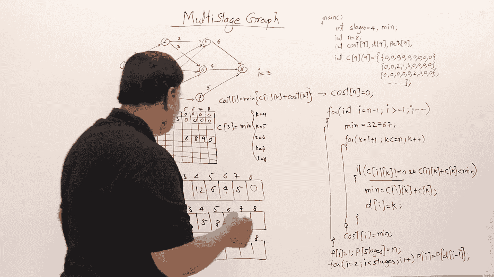

以下是路径重构的代码：

```cpp
p[1] = 1; // 起点
p[stages] = n; // 终点

// 填充中间阶段的顶点
for (int i = 2; i < stages; i++) {
    p[i] = d[ p[i-1] ];
}
```

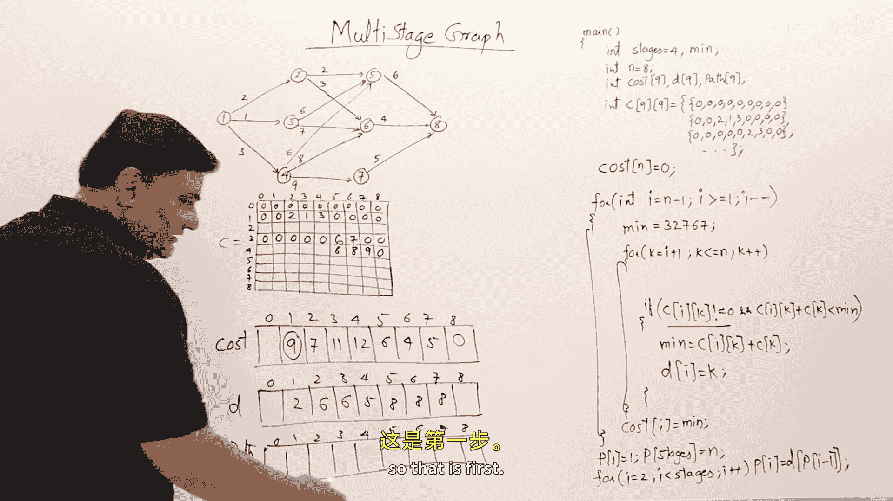

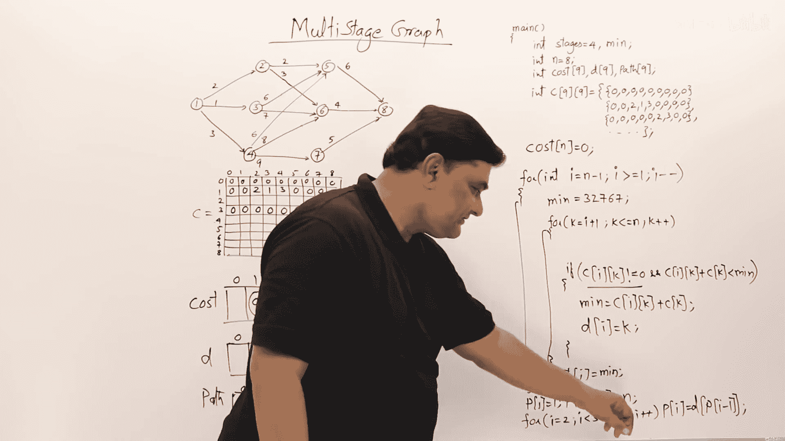

**路径重构示例**：
*   已知 `d[1] = 2`，所以 `p[2] = d[p[1]] = d[1] = 2`。
*   接着，`p[3] = d[p[2]] = d[2] = 6`。
*   最终路径为：1 → 2 → 6 → 8。

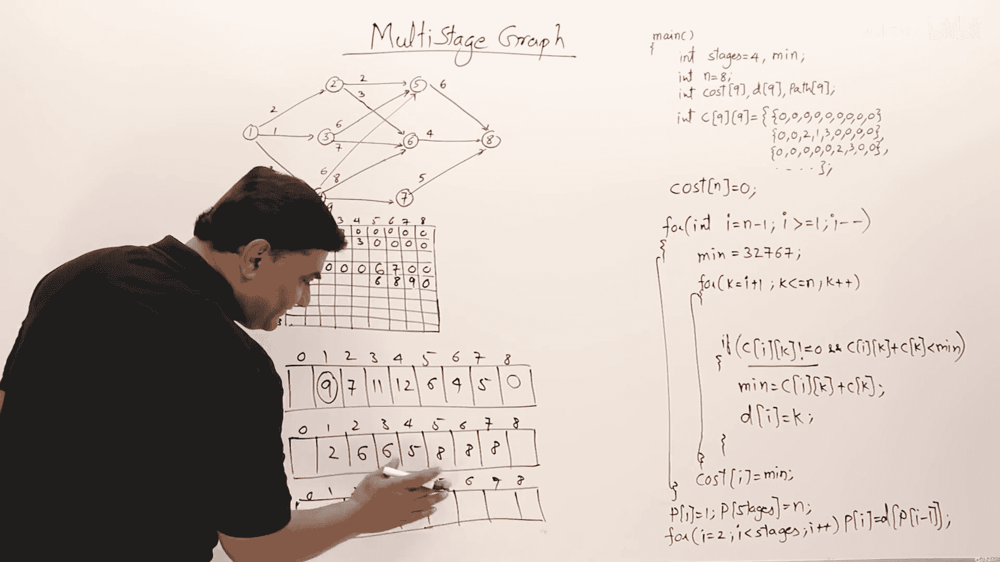

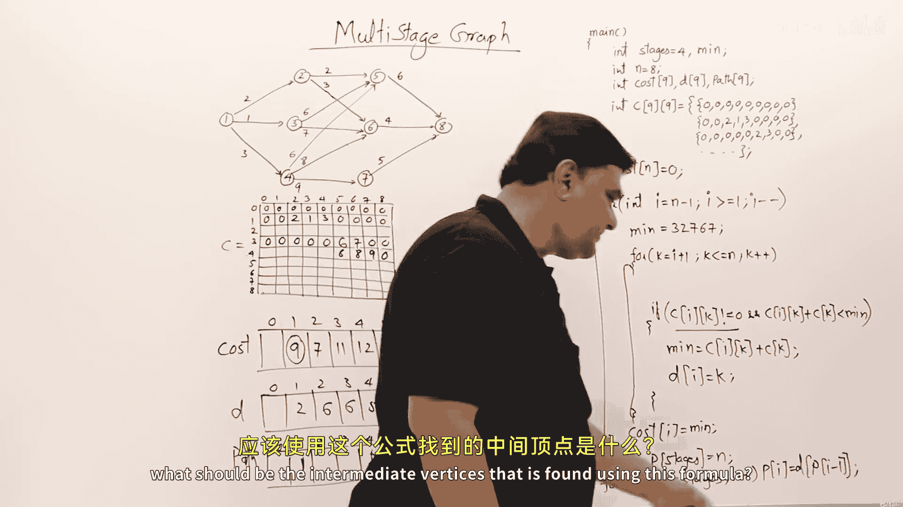

---

## 时间复杂度分析

现在我们已经理解了算法的计算和路径重构过程，最后来分析其效率。该算法的时间复杂度主要由嵌套循环决定。

*   外层循环运行 `n-1` 次（从n-1到1）。
*   内层循环的次数取决于当前顶点 `i`。当 `i` 较小时，内层循环需要检查的后继顶点较多。具体来说，对于顶点 `i`，内层循环大约运行 `n-i` 次。
*   因此，总操作次数大致为 `(n-1) + (n-2) + ... + 1 = n(n-1)/2`。

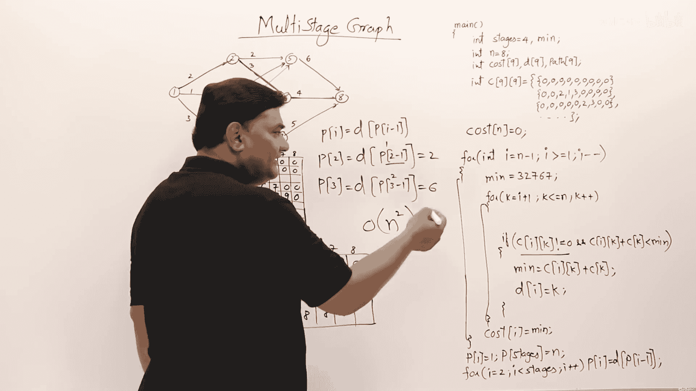

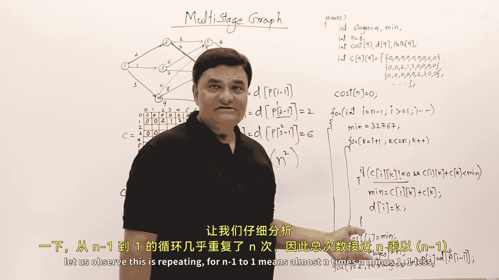

**结论**： 多阶段图动态规划算法的时间复杂度为 **O(n²)**，其中 `n` 是图的顶点数。

---

## 总结

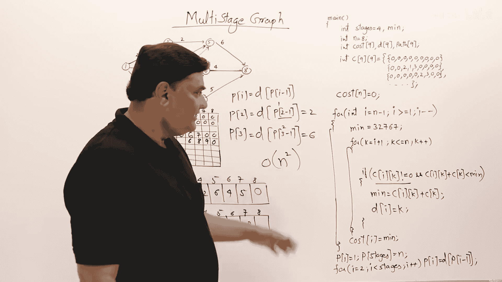

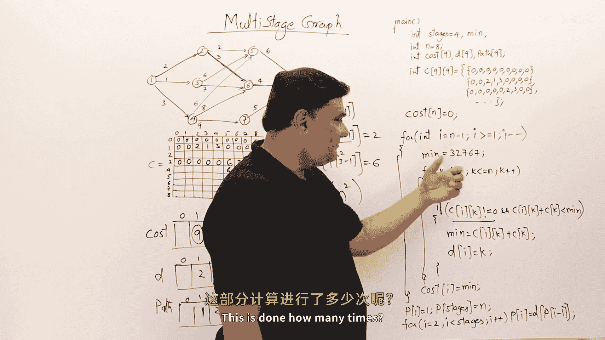

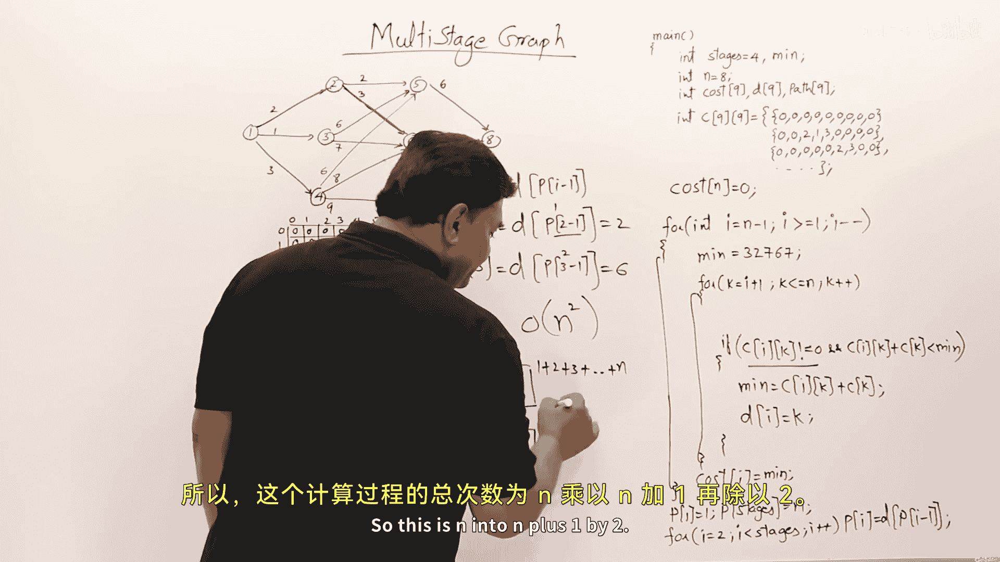

本节课中我们一起学习了多阶段图问题的动态规划解法及其程序实现。我们从定义数据结构开始，逐步分析了如何逆向计算每个顶点的最小成本，并利用决策数组重构出最终的最短路径。最后，我们分析了算法的时间复杂度为 O(n²)。通过这个具体的程序示例，我们不仅掌握了算法的理论公式，也了解了如何将其转化为实际的代码逻辑。