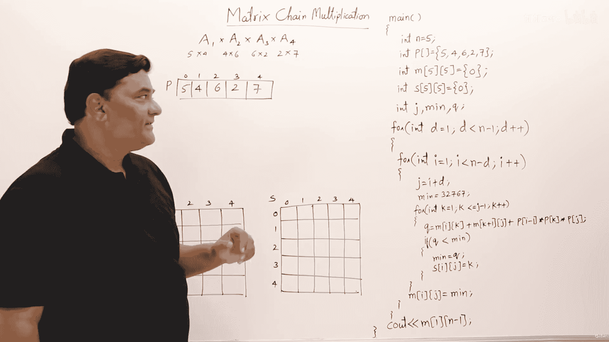
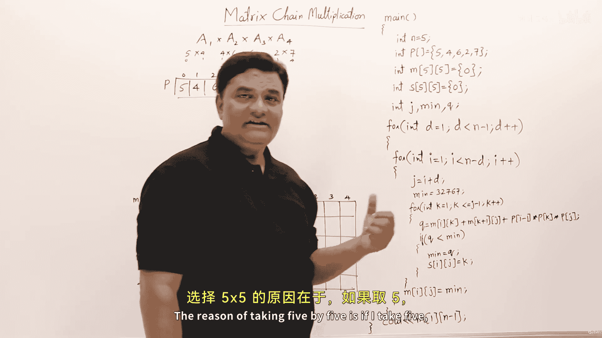
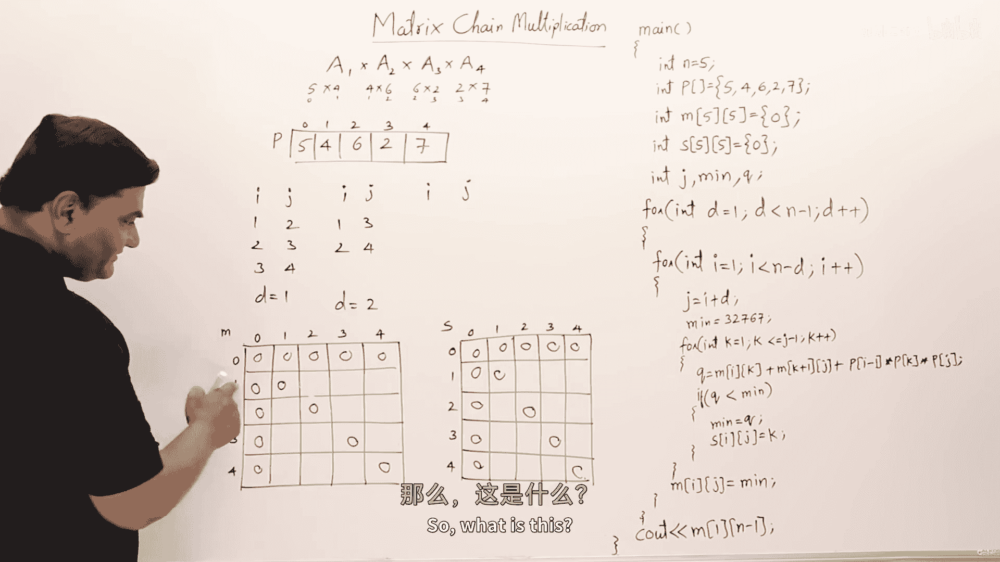
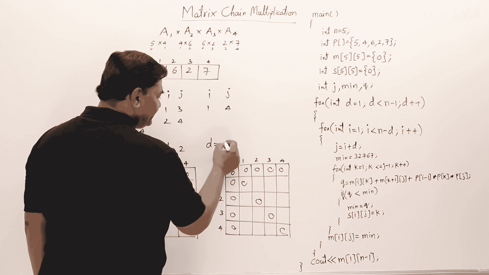
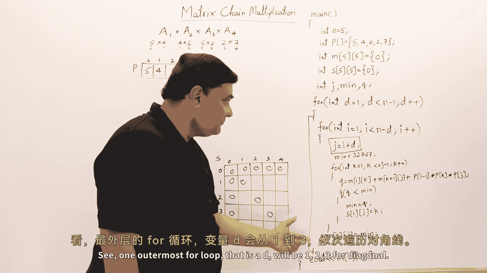
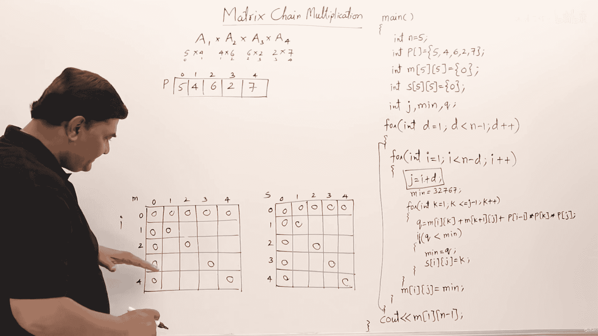
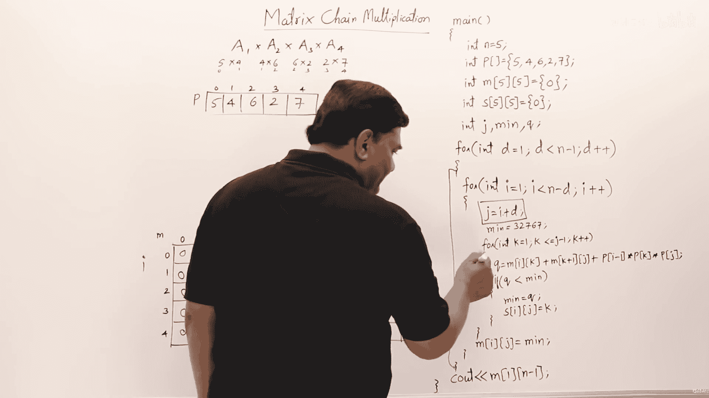

# 052：矩阵链乘法（程序实现）⚙️


在本节课中，我们将学习如何使用动态规划方法，通过编写程序来解决矩阵链乘法问题。我们将重点关注程序的实现逻辑，并逐步追踪其执行过程，以理解如何计算最小乘法成本并确定最优的括号化方案。

上一节我们介绍了矩阵链乘法的动态规划原理和公式推导，本节中我们来看看如何将这些理论转化为实际的程序代码。



## 程序结构与初始化

首先，让我们查看程序的基本结构。为了简化，所有逻辑都写在了 `main` 函数中。这足以展示算法的核心思想，未来可以将其封装成独立的函数。

以下是程序初始化的关键部分：



```c
int p[] = {5, 4, 6, 2, 7}; // 矩阵的维度数组
int n = 5; // 数组长度，代表有 n-1 个矩阵
int m[n][n]; // 存储最小代价的二维数组
int s[n][n]; // 存储最优分割点 k 的二维数组
```

我们有一个包含4个矩阵的实例，其维度分别为 `5x4`， `4x6`， `6x2`， `2x7`。数组 `p` 存储了这些维度。我们创建了两个 `n x n` 的二维数组 `m` 和 `s`，其中 `n` 为维度数组的长度。`m[i][j]` 用于存储计算矩阵 `A_i` 到 `A_j` 所需的最小标量乘法次数，`s[i][j]` 则记录达到该最小值时的最优分割点 `k`。

程序开始时，先将 `m` 数组的主对角线（即 `i == j` 的情况）初始化为0，因为单个矩阵无需乘法。





## 核心算法：填充动态规划表

程序的核心是三层嵌套循环，用于按对角线顺序填充 `m` 和 `s` 表。



上一节我们初始化了表格，本节中我们来看看填充表格的具体循环逻辑。





外层循环控制子链的长度 `L`（在代码中常表示为 `d` 或 `len`），它从 `2` 开始，直到 `n-1`（即矩阵个数）。对于长度为 `L` 的子链，中层循环确定子链的起始点 `i`，内层循环则遍历所有可能的分割点 `k`，并应用动态规划递推公式计算最小代价。

以下是填充表格的核心代码逻辑：

```c
for (int L = 2; L < n; L++) { // L是链的长度
    for (int i = 1; i < n - L + 1; i++) {
        int j = i + L - 1;
        m[i][j] = INT_MAX; // 初始化为一个很大的数
        for (int k = i; k <= j-1; k++) {
            // 应用递推公式
            int cost = m[i][k] + m[k+1][j] + p[i-1]*p[k]*p[j];
            if (cost < m[i][j]) {
                m[i][j] = cost;
                s[i][j] = k;
            }
        }
    }
}
```

**递推公式**如下：
`m[i][j] = min_{i≤k<j} ( m[i][k] + m[k+1][j] + p_{i-1} * p_k * p_j )`

这个公式的含义是：为了计算 `A_i` 到 `A_j` 的最小代价，我们尝试在所有可能的位置 `k` 将其分割成两部分 `(A_i ... A_k)` 和 `(A_{k+1} ... A_j)`。总代价等于左半部分的代价、右半部分的代价，以及合并这两部分结果矩阵的代价之和。我们选择所有 `k` 中总代价最小的那个。

## 实例追踪与计算

现在，我们以具体的矩阵链为例，手动追踪程序如何填充表格。

假设我们有四个矩阵，维度数组为 `p = {5, 4, 6, 2, 7}`。这意味着：
*   `A1`： 5 x 4
*   `A2`： 4 x 6
*   `A3`： 6 x 2
*   `A4`： 2 x 7

程序将按以下顺序计算：

1.  **长度为2的子链** (`L=2`)：
    以下是计算示例：
    *   `m[1][2]`：计算 `A1 * A2`。代价 = `5*4*6 = 120`。
    *   `m[2][3]`：计算 `A2 * A3`。代价 = `4*6*2 = 48`。
    *   `m[3][4]`：计算 `A3 * A4`。代价 = `6*2*7 = 84`。

2.  **长度为3的子链** (`L=3`)：
    以下是计算 `m[1][3]` 的过程，即计算 `A1 A2 A3` 的最小代价：
    *   分割点 `k=1`: `(A1)(A2 A3)`。代价 = `m[1][1] + m[2][3] + 5*4*2 = 0 + 48 + 40 = 88`。
    *   分割点 `k=2`: `(A1 A2)(A3)`。代价 = `m[1][2] + m[3][3] + 5*6*2 = 120 + 0 + 60 = 180`。
    *   最小值为 `88`，所以 `m[1][3] = 88`, `s[1][3] = 1`。
    同理可计算 `m[2][4]`。

3.  **长度为4的子链** (`L=4`)：
    以下是计算整个链 `m[1][4]` 的过程：
    *   尝试所有分割点 `k=1,2,3`，使用上述公式和已计算的 `m[][]` 值，找出最小代价。最终会得到 `m[1][4] = 158`，最优分割点 `s[1][4] = 3`。

通过这个过程，我们最终得到 `m[1][4] = 158`，这就是链乘的最小标量乘法次数。同时，`s` 表记录了每一步的最优分割点。

## 重构最优解

计算出最小代价后，我们需要根据 `s` 表重构出具体的括号化方案。

重构过程是一个递归或迭代的过程，根据 `s[i][j]` 记录的分割点 `k`，将问题分解为左子链 `(i, k)` 和右子链 `(k+1, j)`，然后分别对子链进行同样的操作，直到子链只包含一个矩阵。这本质上是在构建一棵最优二叉树，对其进行中序遍历即可得到带括号的表达式。

例如，根据我们追踪得到的 `s` 表：
*   `s[1][4] = 3`，表示在矩阵3和4之间分割：`(A1 A2 A3) (A4)`。
*   对于左子链 `(1,3)`，`s[1][3] = 1`，表示在矩阵1和2之间分割：`(A1) (A2 A3)`。
*   因此，最优的括号化顺序是：`((A1 (A2 A3)) A4)`。这个顺序对应的计算代价最小，为158。

## 总结

本节课中我们一起学习了矩阵链乘法问题的程序实现。我们首先了解了程序的数据结构初始化，然后深入分析了用于填充动态规划表的三层循环核心算法，并手动追踪了一个实例的计算过程。最后，我们学习了如何利用存储分割点的表格来重构出最优的括号化方案。


这个程序清晰地展示了如何将动态规划的递推公式转化为迭代代码，是理解动态规划“自底向上”求解思想的经典案例。你可以尝试修改矩阵的维度和数量，运行程序来验证不同情况下的结果。