# 053：贝尔曼-福特算法（单源最短路径 - 动态规划）🚀

在本节课中，我们将学习贝尔曼-福特算法。这是一个用于解决**单源最短路径问题**的算法，特别适用于图中包含负权边的情况。我们将了解算法的工作原理、步骤、时间复杂度，以及它的一个重要限制。

## 概述

单源最短路径问题是指：在一个**有向加权图**中，我们选择一个顶点作为**源点**，然后找出从该源点到图中所有其他顶点的最短路径。

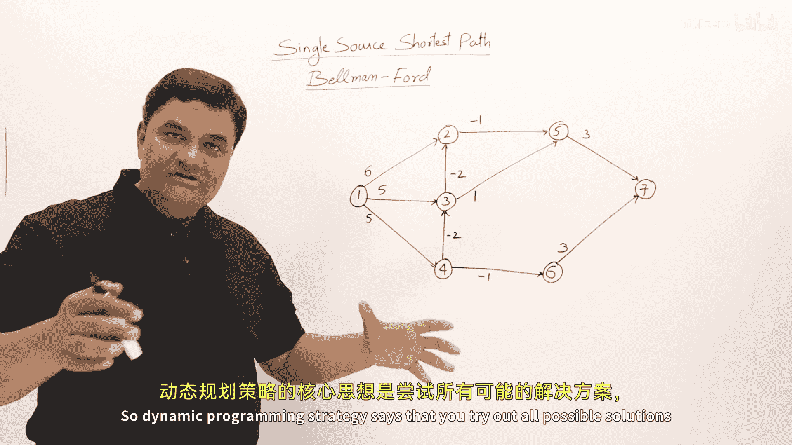

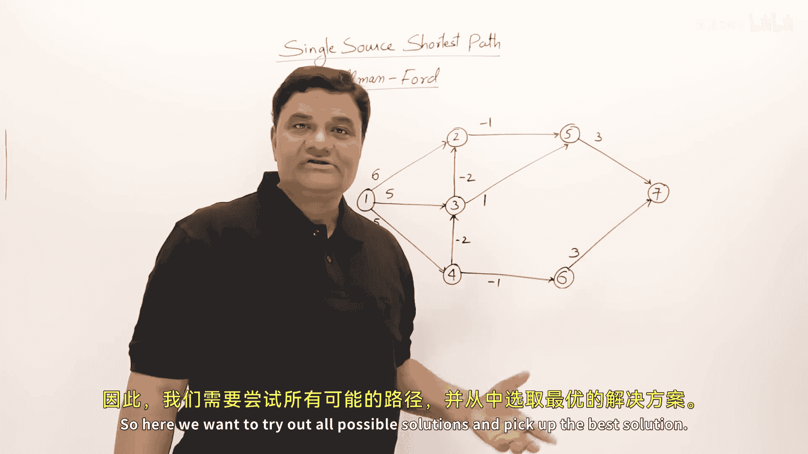

例如，如果我们选择顶点1作为源点，就需要找出从1到所有其他顶点的最短距离。

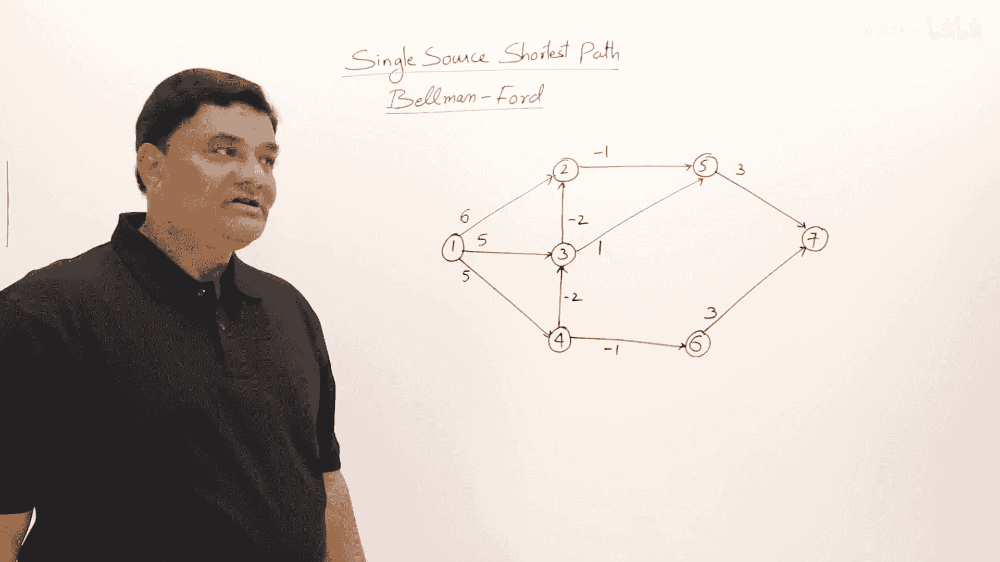

## 迪杰斯特拉算法的局限性

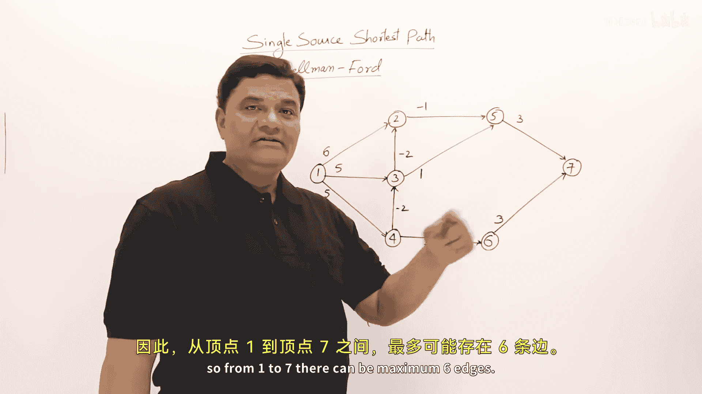

我们已经有一个算法可以解决最短路径问题，那就是**迪杰斯特拉算法**。但是，迪杰斯特拉算法在图中存在**负权边**时无法保证正确工作。它可能给出正确结果，也可能不会。因此，我们不能在有负权边的图中放心地使用迪杰斯特拉算法。

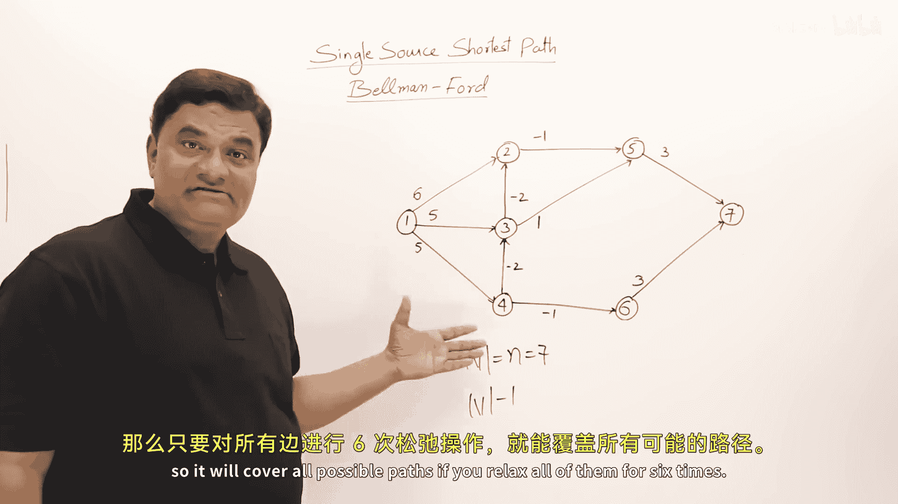

我们需要一个能确保答案正确的算法，这就是**贝尔曼-福特算法**。它遵循**动态规划**策略，即尝试所有可能的解决方案，并从中选出最优解。

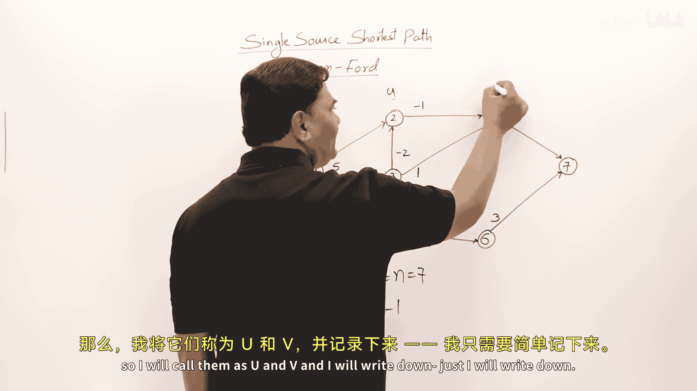

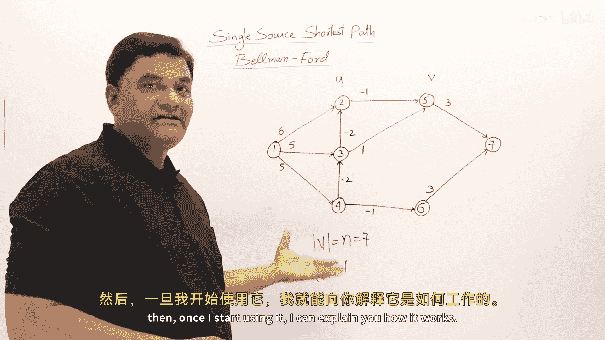

## 算法核心思想

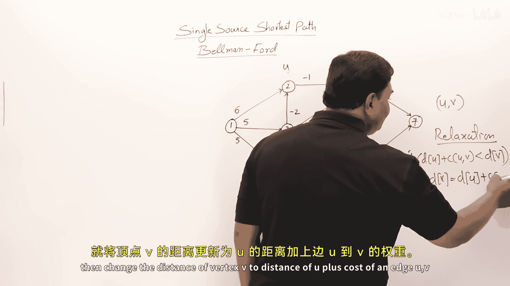

贝尔曼-福特算法的核心思想是：**反复松弛所有边**。

**松弛**是算法中的关键操作。对于任意两个顶点 `u` 和 `v`，如果存在一条从 `u` 到 `v` 的边，则检查：
如果 `distance[u] + cost(u, v) < distance[v]`，那么就将 `distance[v]` 更新为 `distance[u] + cost(u, v)`。

用公式表示就是：
```
if d[u] + w(u, v) < d[v]:
    d[v] = d[u] + w(u, v)
```

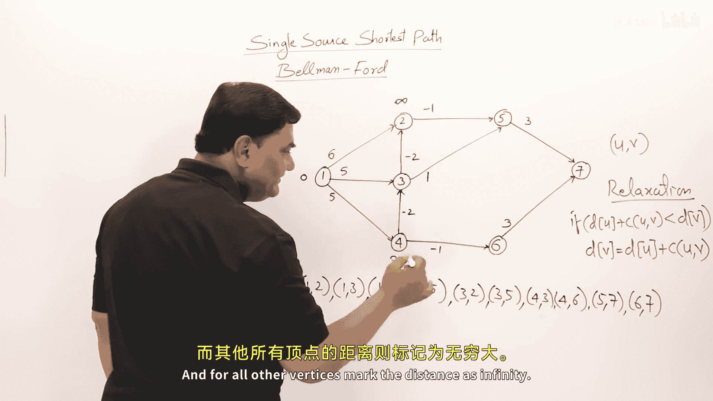

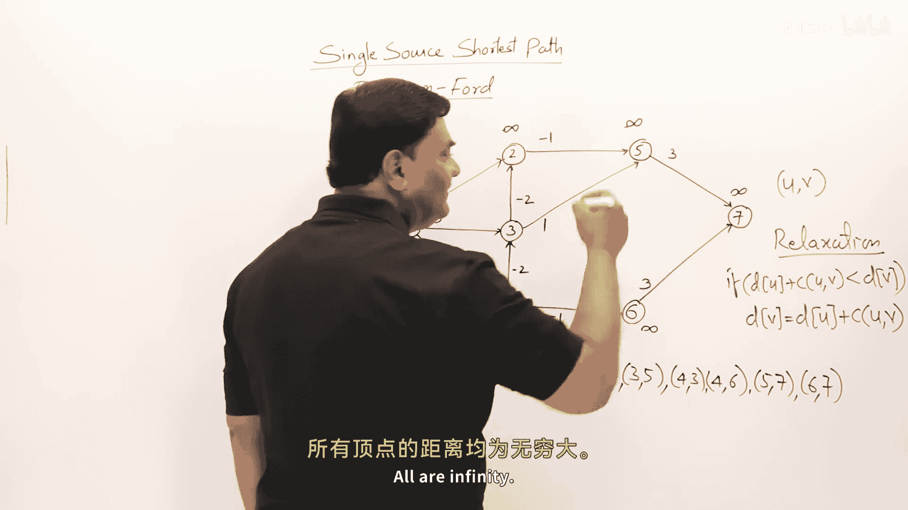

算法要求我们重复这个过程 **V-1 次**，其中 **V** 是图中顶点的数量。为什么是 V-1 次？因为从源点到任意顶点的最长简单路径最多包含 V-1 条边。通过 V-1 轮松弛，足以确保找到所有可能的最短路径。

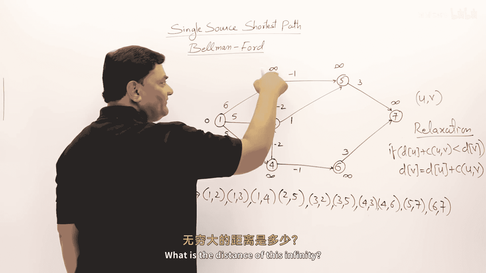

## 算法步骤详解

让我们通过一个例子来一步步理解算法。假设我们有以下有向加权图（图例见视频），选择顶点1为源点。

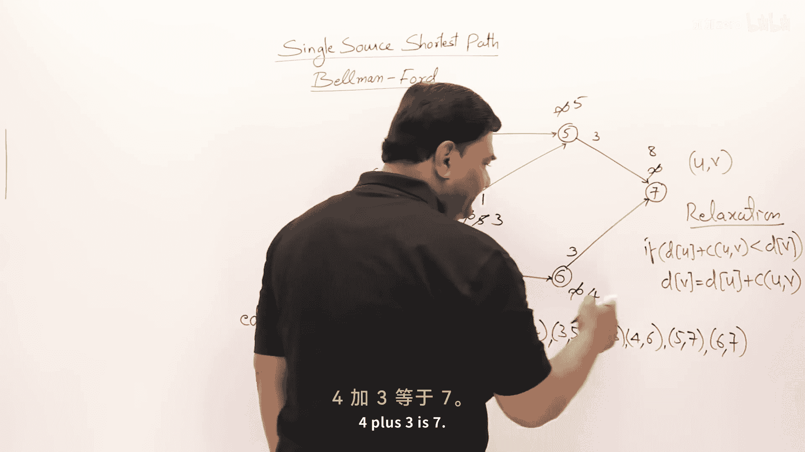

以下是算法的具体步骤：

1.  **初始化距离**：
    *   将源点（顶点1）的距离设为 `0`。
    *   将所有其他顶点的距离初始化为 `∞`（无穷大）。

2.  **进行 V-1 轮松弛**：
    *   对于图中的每一条边，按顺序应用松弛操作。
    *   重复此过程 **V-1** 轮。

### 第一轮松弛

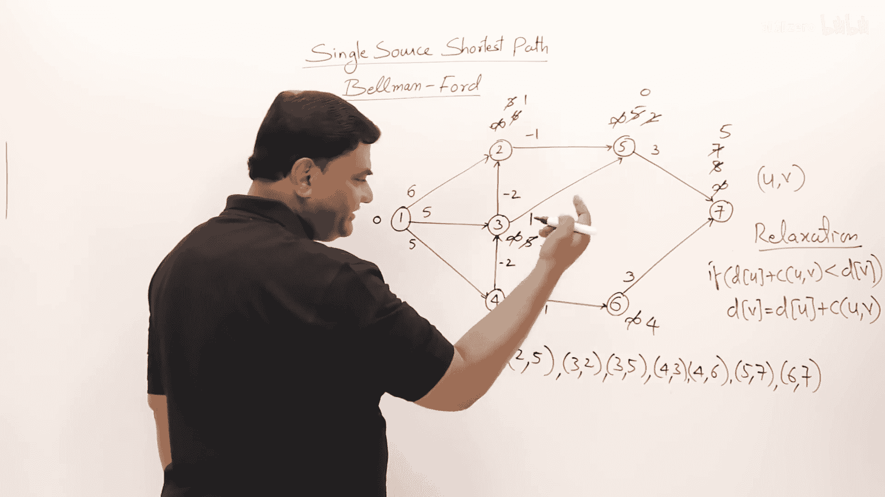

我们按顺序处理每条边，检查并更新距离：

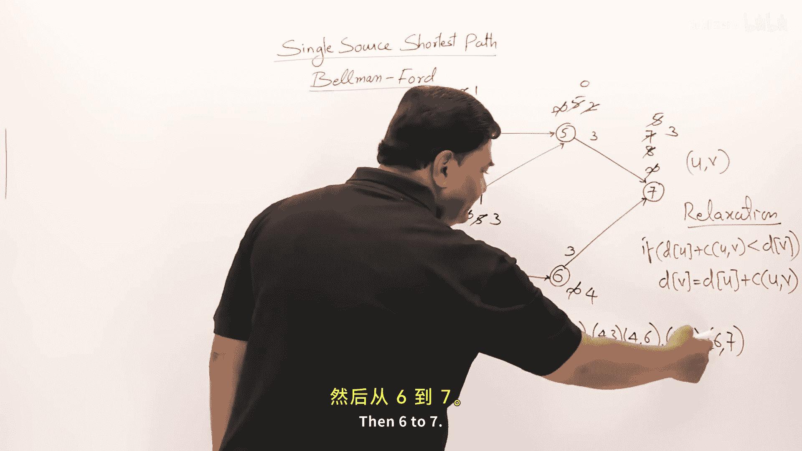

*   **边 (1,2)**：`d[1] + 6 = 0 + 6 = 6`，小于 `d[2] = ∞`。更新 `d[2] = 6`。
*   **边 (1,3)**：`0 + 5 = 5`，小于 `∞`。更新 `d[3] = 5`。
*   **边 (1,4)**：`0 + 5 = 5`，小于 `∞`。更新 `d[4] = 5`。
*   **边 (2,5)**：`d[2] + (-1) = 6 - 1 = 5`，小于 `d[5] = ∞`。更新 `d[5] = 5`。
*   **边 (3,2)**：`d[3] + (-2) = 5 - 2 = 3`，小于 `d[2] = 6`。更新 `d[2] = 3`。
*   **边 (3,5)**：`d[3] + 1 = 5 + 1 = 6`，不小于 `d[5] = 5`。不更新。
*   **边 (4,3)**：`d[4] + (-2) = 5 - 2 = 3`，小于 `d[3] = 5`。更新 `d[3] = 3`。
*   **边 (4,6)**：`d[4] + (-1) = 5 - 1 = 4`，小于 `∞`。更新 `d[6] = 4`。
*   **边 (5,7)**：`d[5] + 3 = 5 + 3 = 8`，小于 `∞`。更新 `d[7] = 8`。
*   **边 (6,7)**：`d[6] + 3 = 4 + 3 = 7`，小于 `d[7] = 8`。更新 `d[7] = 7`。

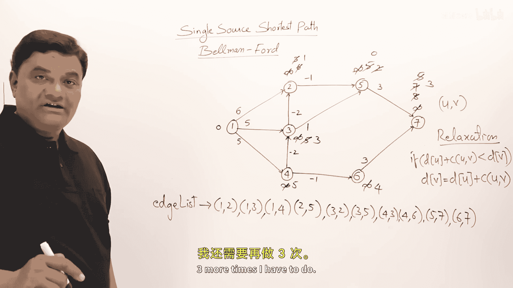

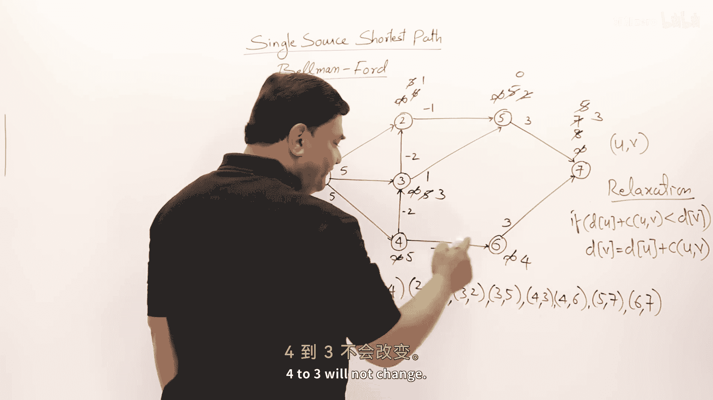

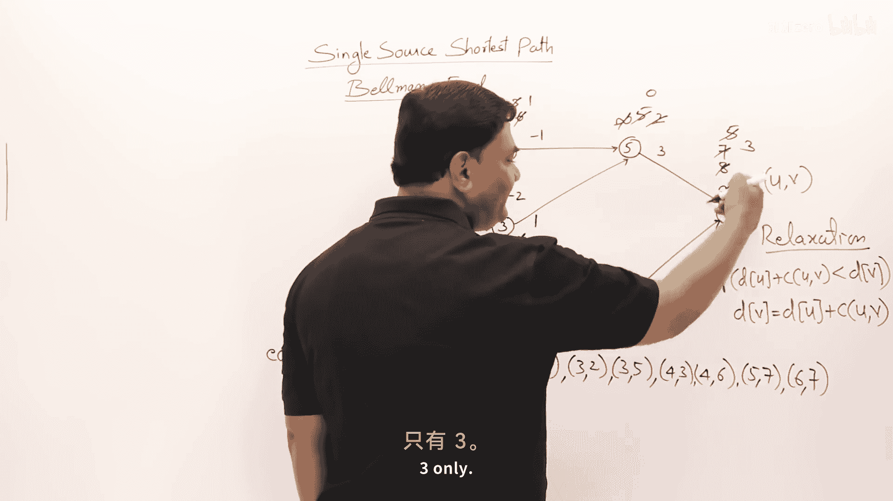

第一轮结束后，各点距离为：`d[1]=0, d[2]=3, d[3]=3, d[4]=5, d[5]=5, d[6]=4, d[7]=7`。

### 后续轮次松弛

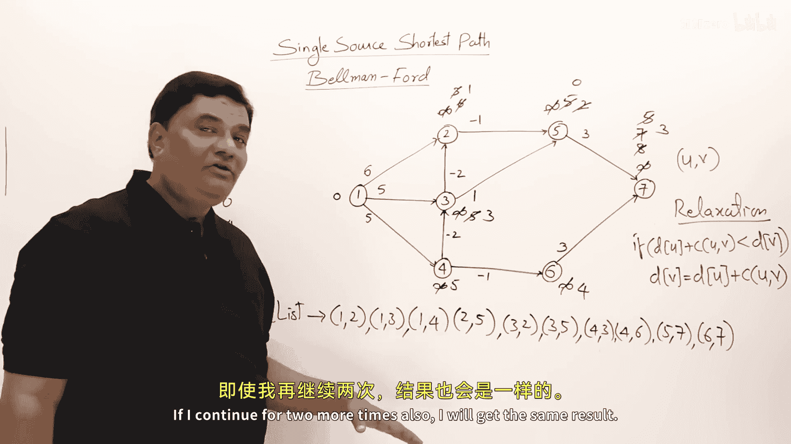

我们继续重复上述过程，进行第二轮、第三轮...直到完成 **V-1** 轮（本例中 V=7，所以需要6轮）。

在后续轮次中，我们继续对所有边进行松弛操作。你会发现，有些距离会进一步更新（例如 `d[5]` 从5变为0，`d[7]` 从7变为3），而有些则保持不变。

**关键点**：在第三轮松弛之后，本例中的所有距离值就不再发生变化了。这意味着我们已经找到了最短路径。但在编写算法时，它仍然会执行完 V-1 轮。有些图可能一轮就找到答案，有些图可能需要到最后一轮。

最终，我们得到从源点1到各点的最短距离为：
*   `d[1] = 0`
*   `d[2] = 1`
*   `d[3] = 3`
*   `d[4] = 5`
*   `d[5] = 0`
*   `d[6] = 4`
*   `d[7] = 3`

## 算法复杂度分析

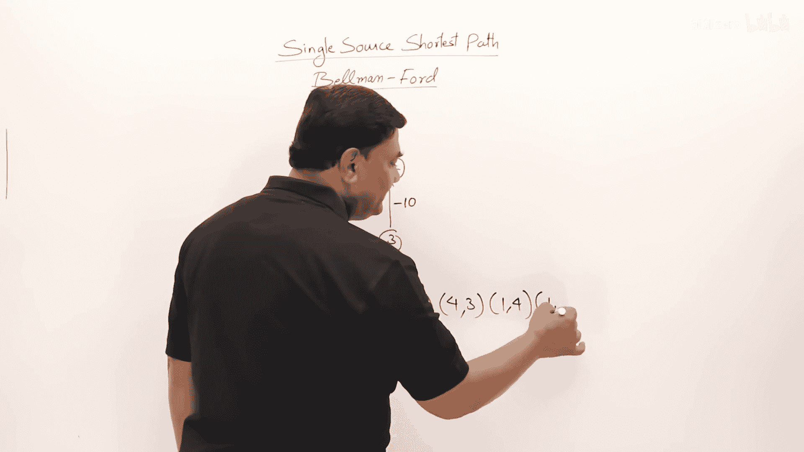

贝尔曼-福特算法的时间复杂度很容易计算：
*   我们需要进行 **V-1** 轮松弛。
*   在每一轮中，我们遍历所有的 **E** 条边。
*   因此，总时间复杂度为 **O(V * E)**。

在稠密图（完全图）中，边的数量 E 约为 V²，所以此时算法的时间复杂度接近 **O(V³)**。在稀疏图中，则接近 **O(V²)**。

## 处理负权边与负权环 🔄

上一节我们看到了贝尔曼-福特算法在普通含负权边图上的工作流程。现在，让我们通过另一个例子来展示它如何处理负权边，并揭示其最重要的限制。

考虑一个更小的图，我们同样使用贝尔曼-福特算法。经过 V-1 轮松弛后，算法成功计算出了包含负权边的最短路径，证明了它在负权边下的有效性。

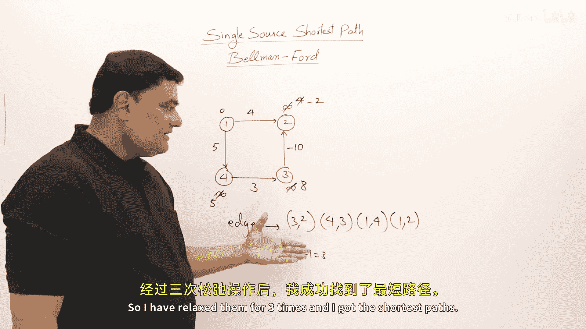

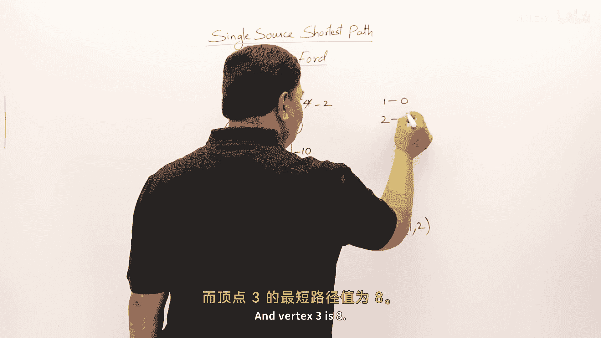

然而，贝尔曼-福特算法有一个致命的缺点：**它无法处理图中存在负权环的情况**。

**什么是负权环？**
负权环是指一个环路上所有边的权重之和为负数。例如，一个由边 `(2,4)=5`, `(4,3)=3`, `(3,2)=-10` 组成的环，总权重为 `5+3+(-10) = -2`。

### 负权环导致的问题

如果图中存在负权环，且该环可以从源点到达，那么“最短路径”的概念就失去了意义。因为你可以无限次地绕着这个负权环走，每走一圈路径总成本就会减少，从而不存在一个有限的“最短”路径。

在算法执行中，这意味着即使在完成规定的 V-1 轮松弛之后，如果我们再进行一轮额外的松弛检查，**某些顶点的距离值仍然会发生变化**。而这在不存在负权环的正常图中是不会发生的。

### 算法的额外功能：检测负权环

这正是贝尔曼-福特算法的一个强大之处：**它不仅可以求最短路径，还可以检测图中是否存在从源点可达的负权环**。

检测方法非常简单：
1.  正常执行 V-1 轮松弛。
2.  **再额外执行一轮松弛**。
3.  如果在这一轮中，有任何顶点的距离值被更新（变短），那么就说明图中存在从源点可达的**负权环**。

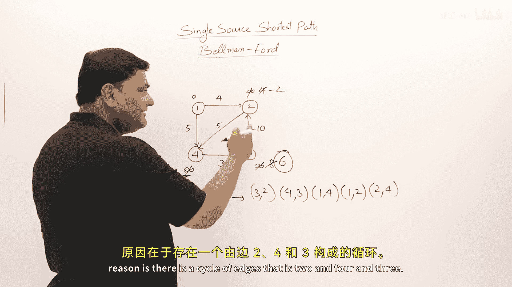

## 总结

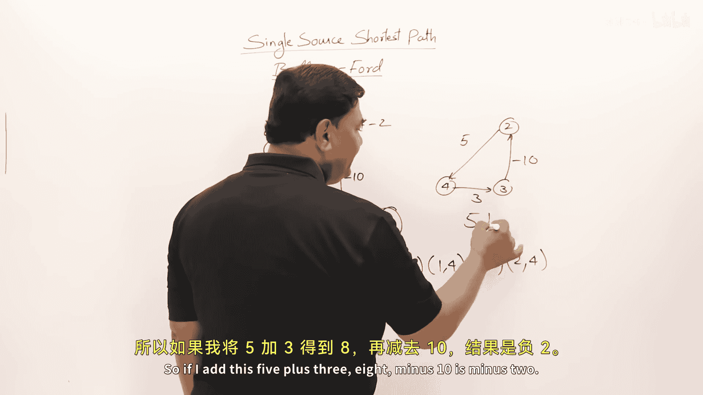

本节课我们一起学习了贝尔曼-福特算法。让我们回顾一下重点：

*   **目的**：解决有向加权图的单源最短路径问题，尤其适用于含有负权边的图。
*   **核心操作**：**松弛**。反复对图中所有边执行 V-1 轮松弛操作。
*   **时间复杂度**：**O(V * E)**，在稠密图中可能达到 O(V³)。
*   **与迪杰斯特拉算法的区别**：迪杰斯特拉不能处理负权边，而贝尔曼-福特可以。
*   **重要限制**：**无法处理存在从源点可达的负权环的图**。因为这种情况下最短路径可能不存在（无限递减）。
*   **额外功能**：通过执行第 V 轮松弛检查，可以**检测出图中是否存在负权环**。

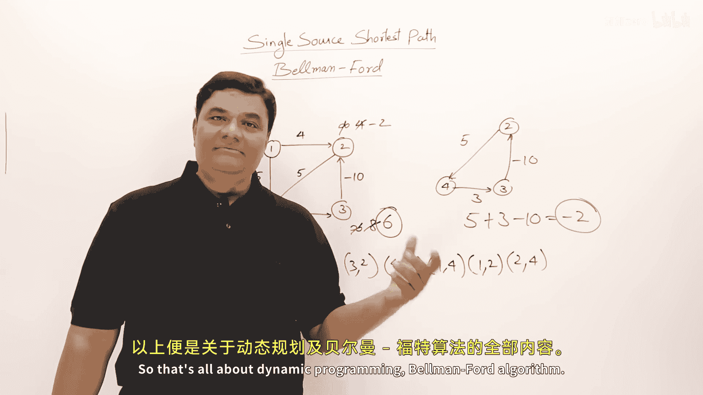

贝尔曼-福特算法虽然比迪杰斯特拉算法慢，但其对负权边的处理能力和负权环检测功能，使其在特定场景下是不可或缺的工具。