# 055：0/1背包问题（程序实现）⚙️


在本节课中，我们将学习如何使用动态规划方法解决0/1背包问题，并详细讲解其程序实现。我们将通过一个具体的例子，逐步追踪代码执行过程，以理解如何编写解决此类问题的程序。

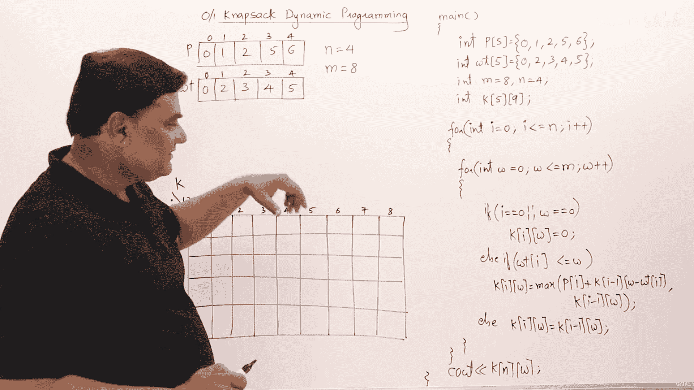

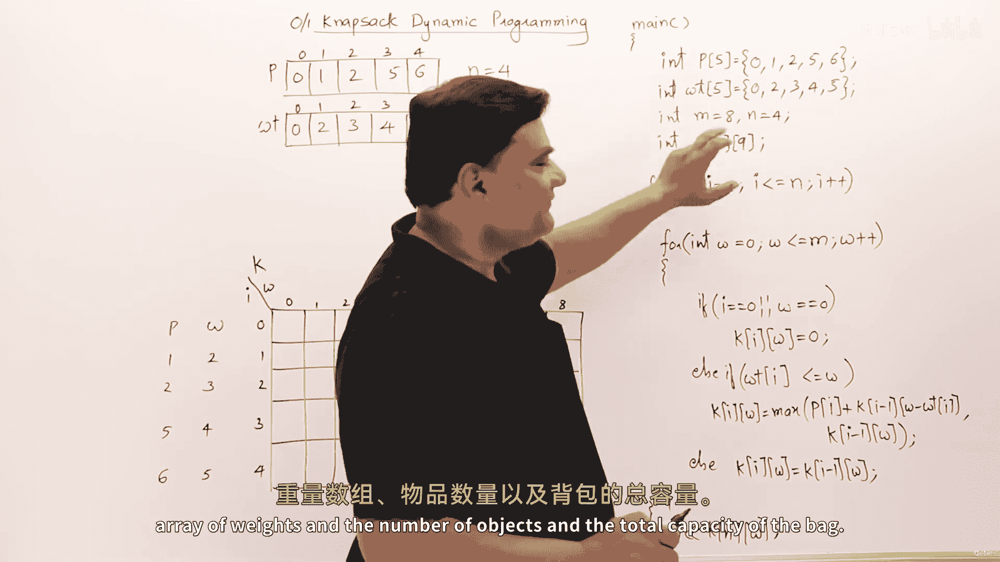

## 问题概述

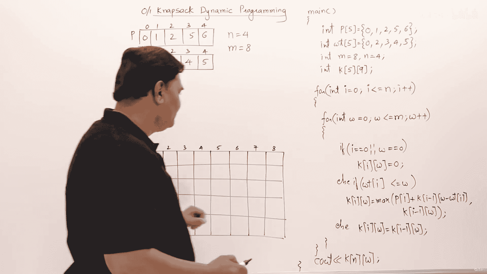

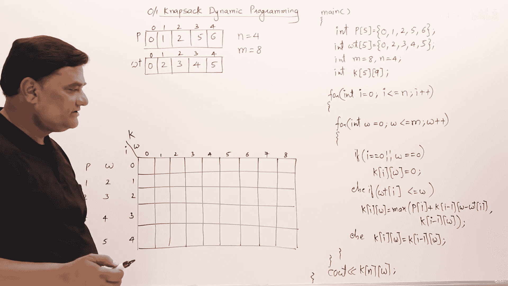

0/1背包问题描述如下：给定一个背包，其容量有限。我们需要选择一些物品放入背包中，使得在不超过背包容量的前提下，所获总价值最大。每个物品要么完整放入，要么不放入。

## 程序结构与数据

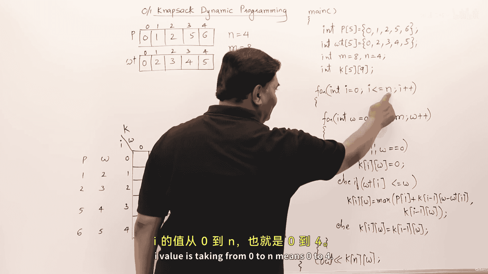

以下是解决该问题所需的初始数据。我们定义了一个利润数组、一个重量数组、物品数量以及背包的总容量。

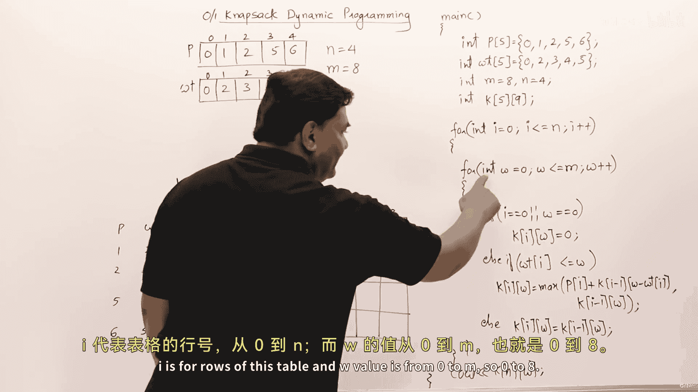

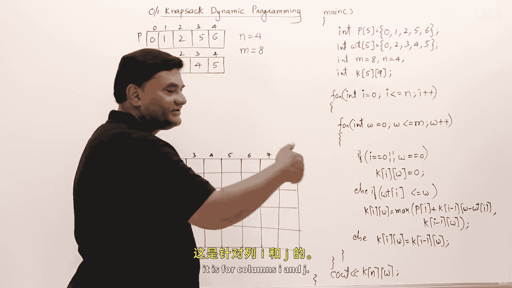

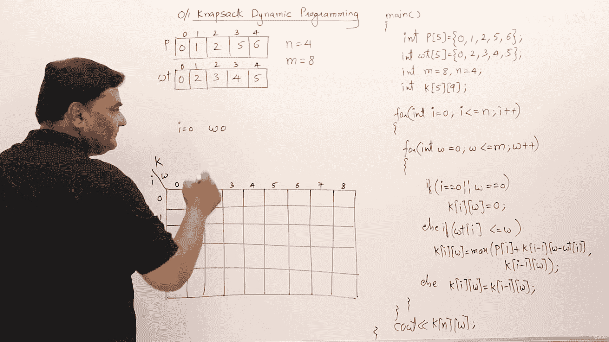

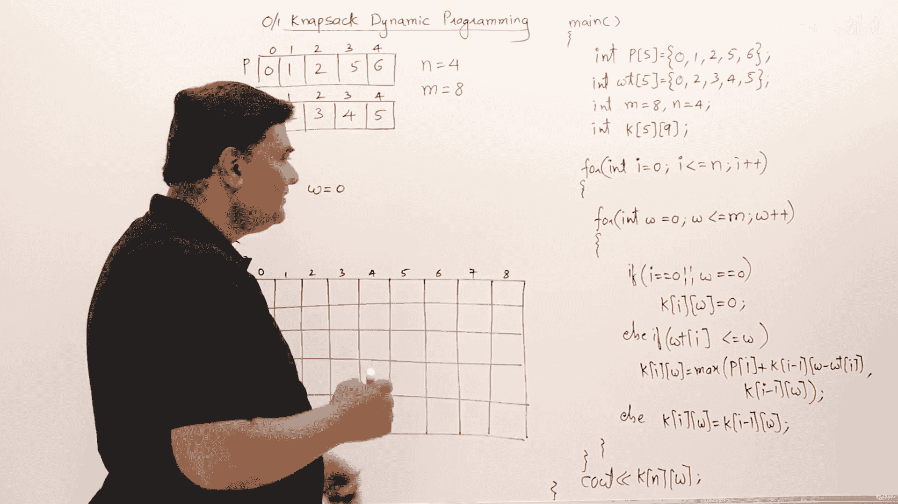

```cpp
int p[] = {0, 1, 2, 5, 6}; // 利润数组，索引0占位
int w[] = {0, 2, 3, 4, 5}; // 重量数组，索引0占位
int n = 4; // 物品数量
int m = 8; // 背包容量
```

注意，数组大小设为5（索引0到4），这是为了从索引1开始表示第一个物品，索引0留空以简化边界条件处理。

## 动态规划表

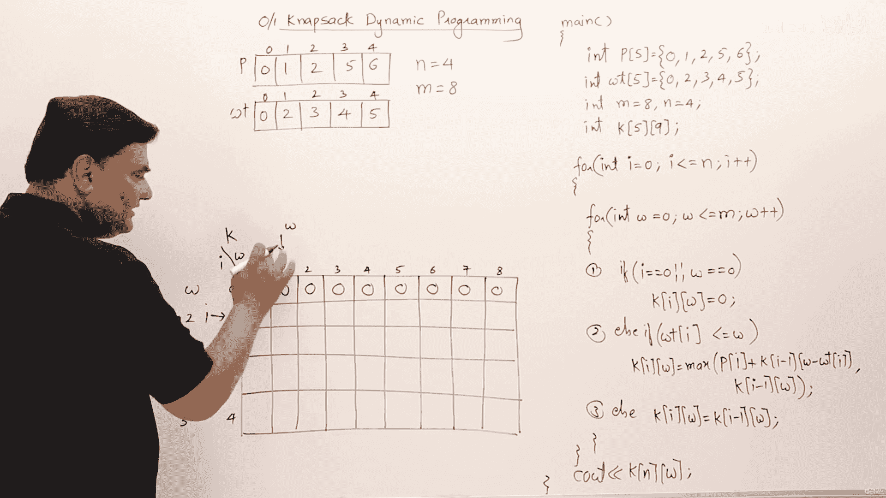

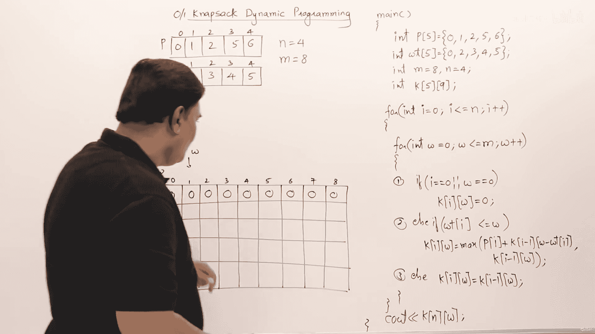

为了解决此问题，我们需要一个动态规划表。该表的大小应为 `(n+1) x (m+1)`，即5行（对应0到4号物品）和9列（对应0到8的容量）。

```cpp
int k[5][9]; // 动态规划表
```

## 核心算法逻辑

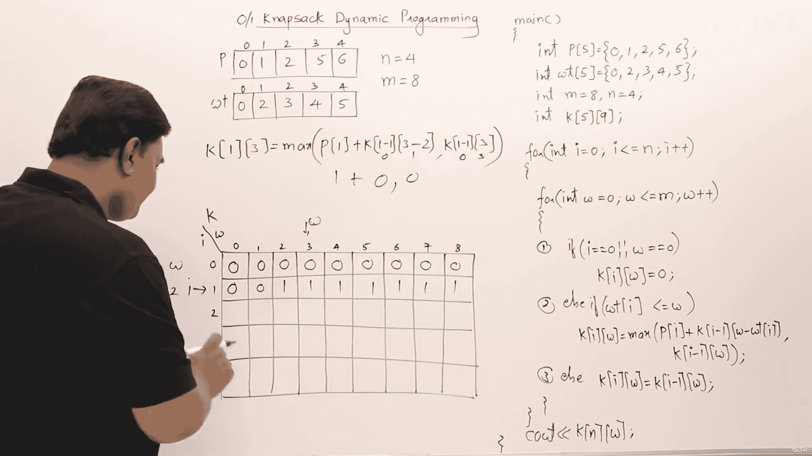

程序的核心逻辑是使用嵌套循环来填充动态规划表。外层循环 `i` 遍历物品（行），内层循环 `w` 遍历背包容量（列）。

```cpp
for(int i=0; i<=n; i++) {
    for(int w=0; w<=m; w++) {
        if(i==0 || w==0) {
            k[i][w] = 0;
        } else if(w[i] <= w) {
            k[i][w] = max(p[i] + k[i-1][w-w[i]], k[i-1][w]);
        } else {
            k[i][w] = k[i-1][w];
        }
    }
}
```

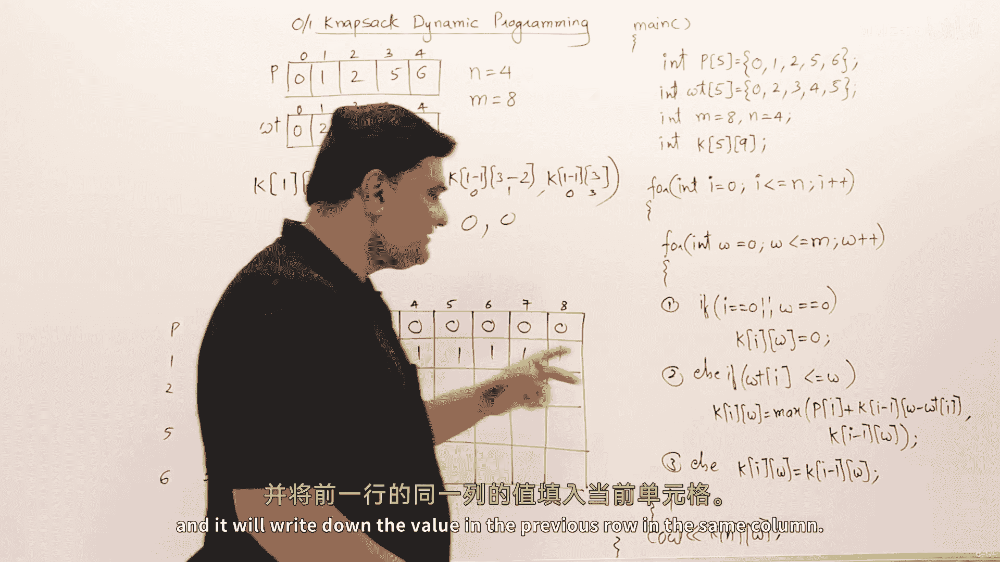

上一节我们介绍了程序的基本结构和动态规划表，本节中我们来看看这个核心逻辑是如何一步步执行的。

## 算法执行过程追踪

让我们逐步追踪代码，观察动态规划表是如何被填充的。

1.  **初始化阶段**：当 `i=0`（没有物品）或 `w=0`（容量为0）时，最大利润为0。因此，表的第一行和第一列全部填充为0。
2.  **处理第一个物品（i=1）**：
    *   当背包容量 `w` 小于物品1的重量（2）时，无法放入，最大利润继承自上一行相同列的值（即 `k[0][w]`）。
    *   当 `w >= 2` 时，我们有两种选择：放入物品1或不放。我们取两者中的最大值：
        *   放入：利润 = `p[1] + k[0][w-2]`
        *   不放入：利润 = `k[0][w]`
        例如，`k[1][2] = max(1 + k[0][0], k[0][2]) = max(1, 0) = 1`。
3.  **处理后续物品**：对于每个物品 `i` 和每个容量 `w`，决策逻辑相同：
    *   如果物品重量 `w[i]` 大于当前容量 `w`，则不能放入，`k[i][w] = k[i-1][w]`。
    *   否则，比较放入和不放入的利润：`k[i][w] = max(p[i] + k[i-1][w-w[i]], k[i-1][w])`。

通过这种方式，表格被逐行填充。最终，`k[4][8]` 的值就是背包容量为8时能获得的最大利润。

## 构造最优解

填充完动态规划表后，我们得到了最大利润。但我们也需要知道具体选择了哪些物品。以下是回溯找出最优解组成的逻辑：

```cpp
int i = n, j = m;
while(i > 0 && j > 0) {
    if(k[i][j] == k[i-1][j]) {
        // 物品i没有被选中
        i--;
    } else {
        // 物品i被选中
        cout << "物品 " << i << " 被选中" << endl;
        j = j - w[i]; // 减去物品i的重量
        i--;
    }
}
```

回溯从表的右下角 `k[n][m]` 开始：
*   如果 `k[i][j]` 的值等于 `k[i-1][j]`，说明物品 `i` 没有被放入最优解，我们只需向上移动一行（`i--`）。
*   如果不相等，说明物品 `i` 被放入了最优解。我们输出物品编号，然后向上移动一行（`i--`），同时向左移动 `w[i]` 列（`j = j - w[i]`），表示这部分容量已被占用。
*   重复此过程直到 `i` 或 `j` 为0。

## 总结

本节课中我们一起学习了0/1背包问题的动态规划程序实现。我们首先定义了问题所需的数据结构，然后详细讲解了填充动态规划表的核心算法逻辑，并通过追踪执行过程加深理解。最后，我们学习了如何通过回溯动态规划表来构造出获得最大利润的具体物品选择方案。这个程序框架清晰地展示了动态规划“填表”和“查表”的核心思想，是解决许多优化问题的基础。