# 070：使用分支限界法解决0/1背包问题 🎒

在本节课中，我们将学习如何使用分支限界法来解决经典的0/1背包问题。我们将通过一个具体的例子，一步步地构建状态空间树，计算每个节点的代价和上界，并利用最小代价优先的策略来高效地找到最优解。

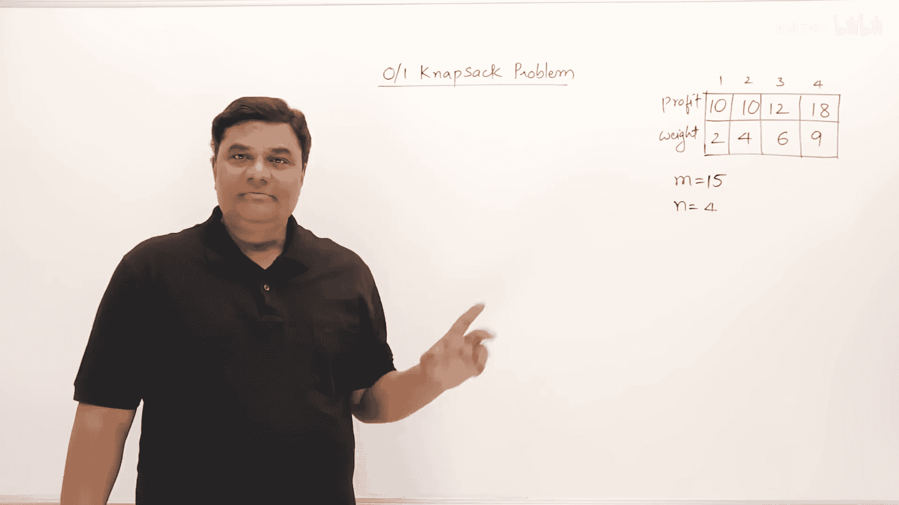

## 问题定义

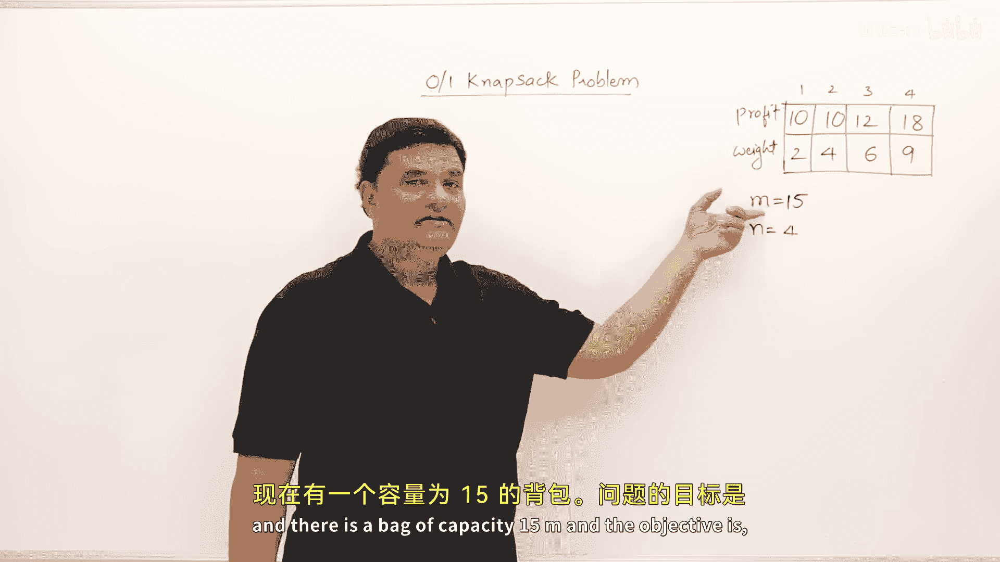

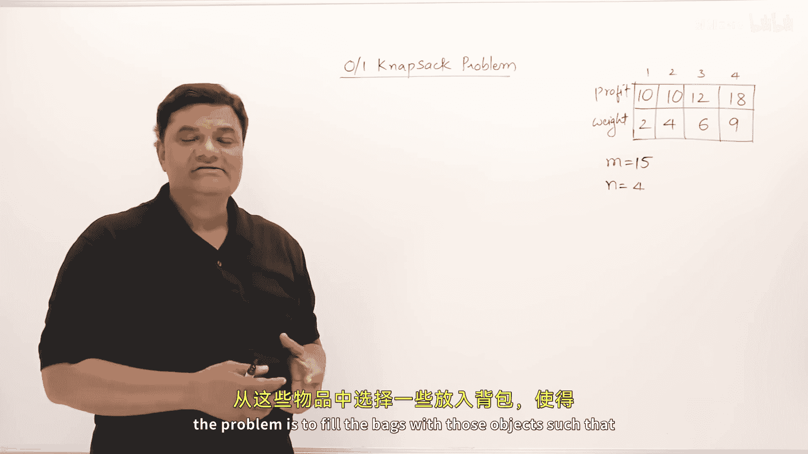

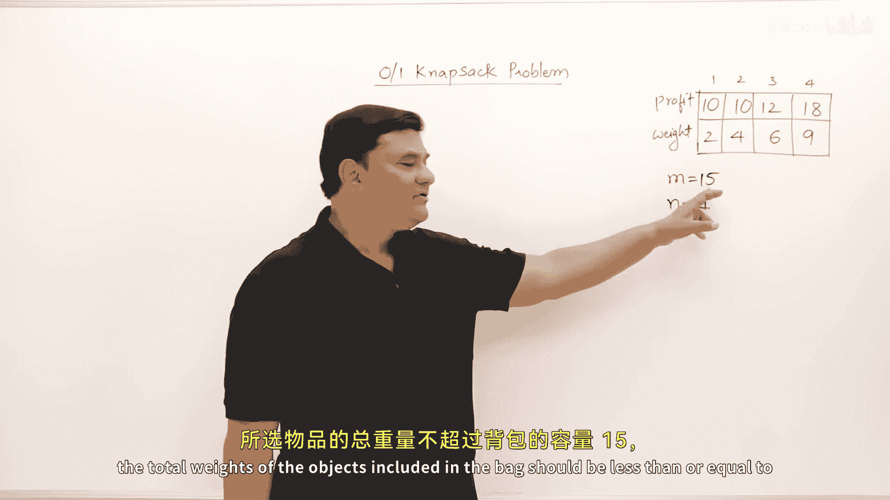

抽象问题描述如下：给定若干物品，每个物品有其利润和重量。同时，有一个容量为15的背包。问题的目标是将物品装入背包，使得装入物品的总重量不超过背包容量（即15），并且总利润最大化。

一个重要的约束是：对于任何物品，要么完整地放入背包，要么完全不放入。不能只放入物品的一部分（例如，不能从一个4公斤的物品中只取2公斤）。因此，这是一个**最大化问题**。

## 解决方法概述

此问题可以用贪心算法、动态规划甚至回溯法解决。但分支限界法通常用于解决**最小化**问题。为了应用分支限界法，我们可以将利润值取负，从而将最大化问题转化为最小化问题。求解后，再将结果转换回正值即可。

我们将使用**LC（最小代价）分支限界法**，这意味着在探索状态空间树时，总是优先探索代价最小的节点。

对于状态空间树中的每个节点，我们需要计算两个值：
*   **上界**：在不允许分割物品的情况下，从该节点出发可能获得的最大利润（取负值）。
*   **代价**：在允许分割物品（仅用于计算，最终解不允许分割）的情况下，从该节点出发可能获得的最大利润（取负值）。

**公式定义**：
设总利润为 `P`，总重量为 `W`，背包容量为 `C`。
*   **上界计算**：`上界 = - (已选物品利润和 + 后续物品在不超重情况下的完整利润和)`
*   **代价计算**：`代价 = - (已选物品利润和 + 后续物品在不超重情况下的最大利润和，允许取分数物品填满剩余容量)`

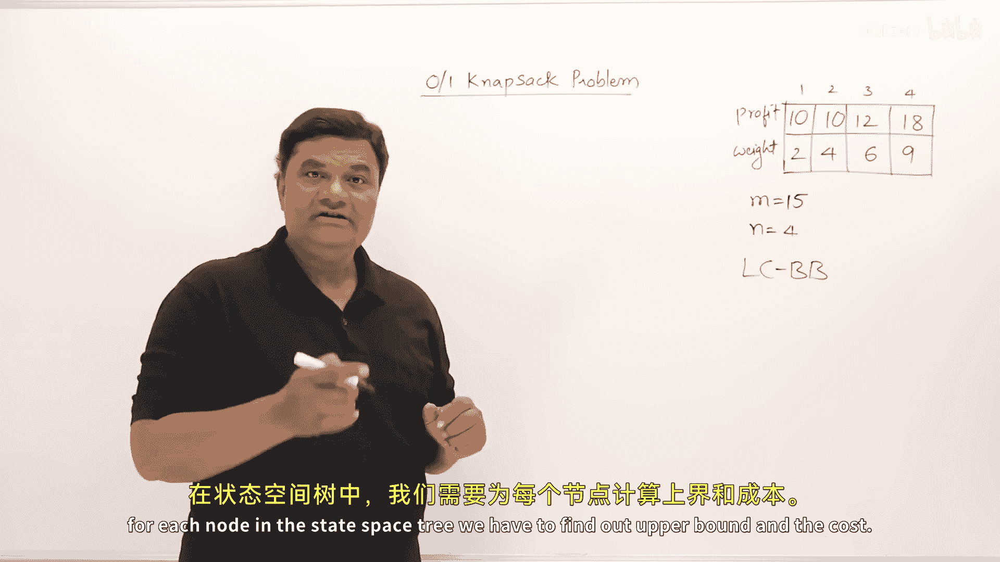

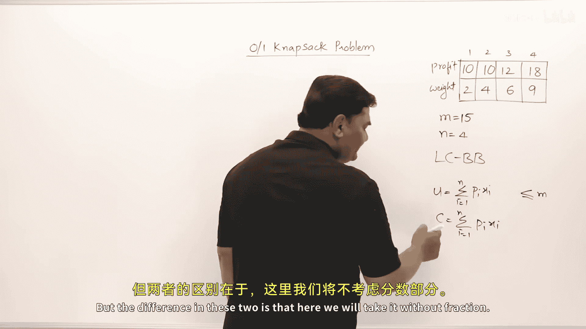

## 构建状态空间树

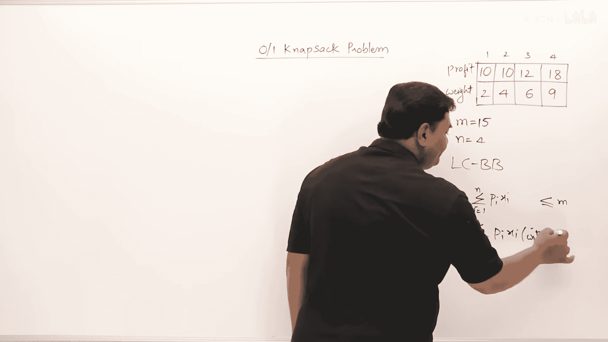

我们采用**定长解**来表示方案，即用一个长度为物品数量的0/1序列来表示每个物品是否被选中。例如，`[1, 0, 1, 0]` 表示第一个和第三个物品被选中。

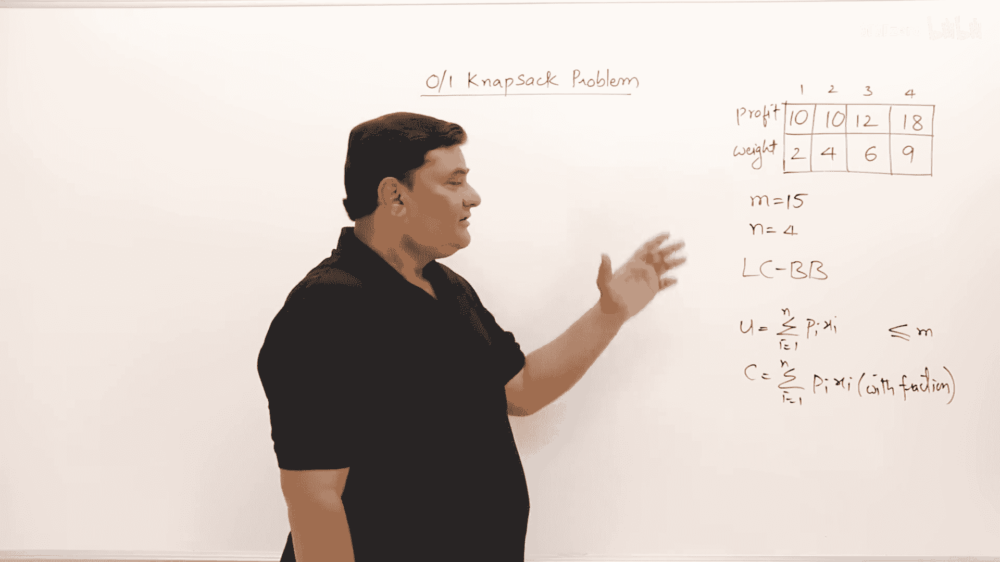

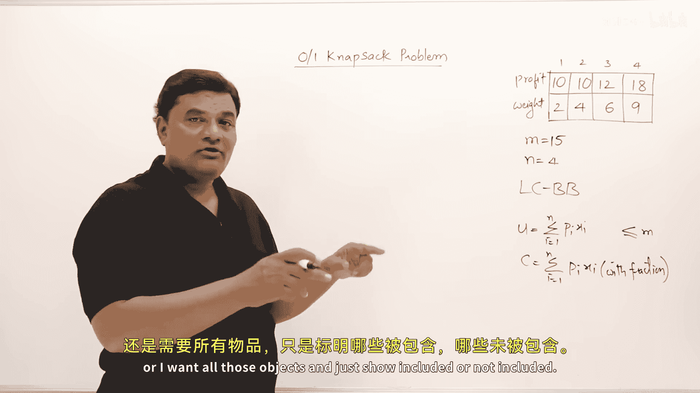

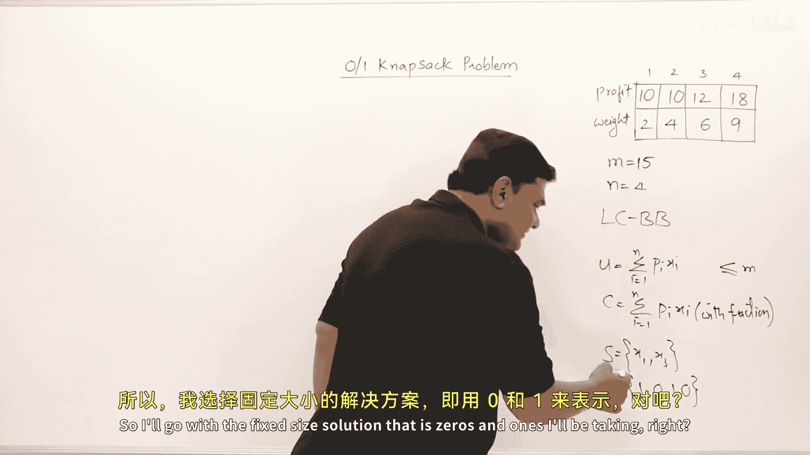

初始时，设置一个全局变量 `upper` 为 `-∞`（因为我们已经将利润取负，所以初始上界是负无穷大，代表最差情况）。

### 第一步：根节点

首先计算根节点的代价和上界。根节点代表尚未做出任何选择。

**计算代价**：
1.  按单位重量利润降序考虑物品（假设已排序）：物品4(18/9=2), 物品1(10/2=5), 物品2(10/4=2.5), 物品3(12/6=2)。
2.  先装物品1（利润10，重量2），剩余容量13。
3.  再装物品4（利润18，重量9），剩余容量4。
4.  接着装物品2（利润10，重量4），恰好装满，剩余容量0。
5.  因此，允许分割时的最大利润为 `10 + 18 + 10 = 38`。
6.  代价为 `-38`。

**计算上界**：
1.  同样顺序考虑物品，但不允许分割。
2.  装物品1（利润10，重量2），剩余容量13。
3.  装物品4（利润18，重量9），剩余容量4。
4.  尝试装物品2（重量4，可装入），利润10。
5.  因此，不允许分割时的最大利润为 `10 + 18 + 10 = 38`。
6.  上界为 `-38`。

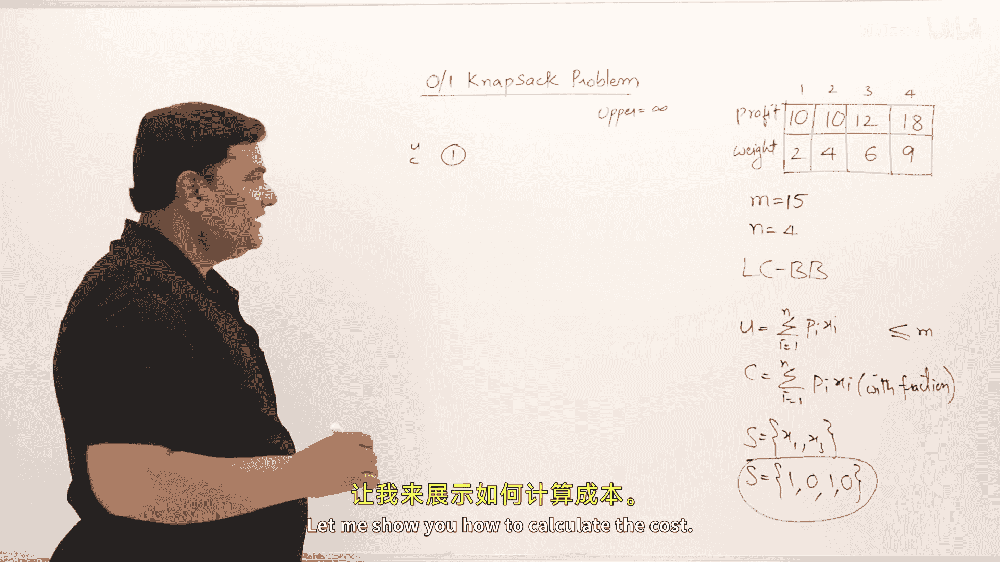

由于 `-38` 优于（小于）当前的 `upper`（-∞），我们更新 `upper = -38`。

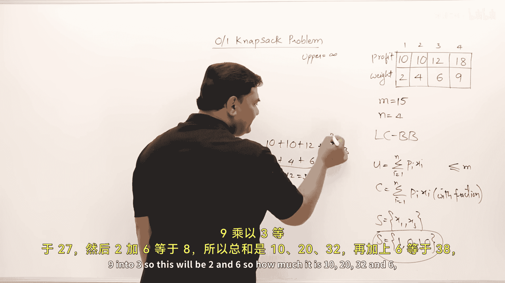

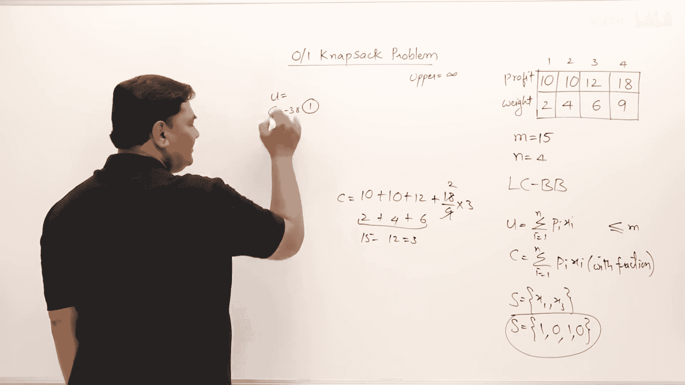

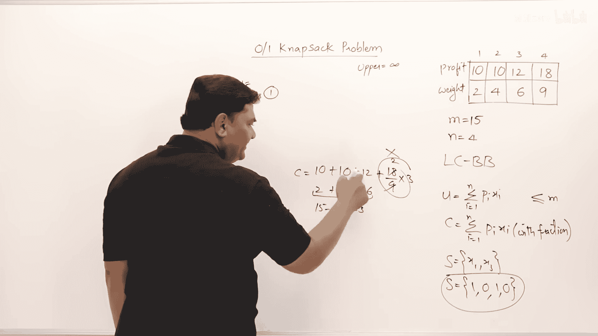

### 第二步：探索第一层节点

从根节点分支，产生两个子节点：包含物品1和不包含物品1。

**节点A：包含物品1**
*   已选利润：10，已用重量：2。
*   **代价**：`- (10 + 后续最大利润)`。后续过程类似根节点，从剩余物品中贪心选择（允许分割），最终代价为 `-38`。
*   **上界**：`- (10 + 后续最大利润)`。后续过程不允许分割，计算得上界为 `-38`。
*   该节点代价等于当前全局上界 `upper`（-38），保留。

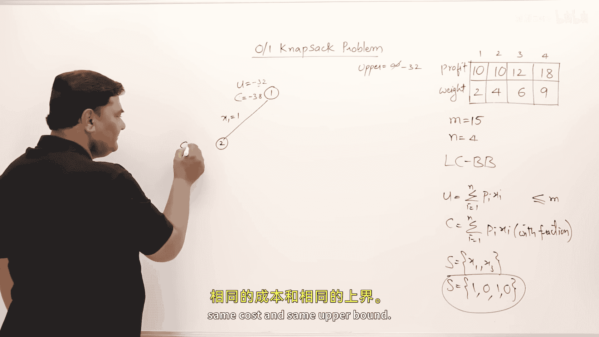

**节点B：不包含物品1**
*   已选利润：0，已用重量：0。
*   **代价**：从物品4开始贪心选择（允许分割）。装物品4（利润18，重9），剩余6；装物品2（利润10，重4），剩余2；剩余容量2可装物品3的1/3（利润 `12 * (2/6) = 4`）。总利润 `18+10+4=32`。代价为 `-32`。
*   **上界**：不允许分割。装物品4（利润18，重9），剩余6；装物品2（利润10，重4），剩余2；物品3重量6 > 2，无法完整装入。总利润 `18+10=28`。上界为 `-28`。
*   该节点代价 `-32` 大于当前全局上界 `upper`（-38）吗？`-32 > -38` 为 **False**（在负数比较中，-32 不比 -38 “大”，即其代表的利润32小于38），所以节点保留。注意：这里比较的是代价和上界，目的是剪枝。如果节点的代价已经比当前找到的最好上界“差”（即代价的绝对值更小，代表利润更小），则可以剪枝。`-32`（利润32）比 `-38`（利润38）差，但通常我们直接比较代价值，若 `cost > upper` 则剪枝。`-32 > -38` 成立，所以**理论上此节点可考虑剪枝，但教程中保留了它，可能是为了演示或计算细节有差异，我们遵循教程流程**。教程中表述为“is it greater than that no”，我们按此继续。

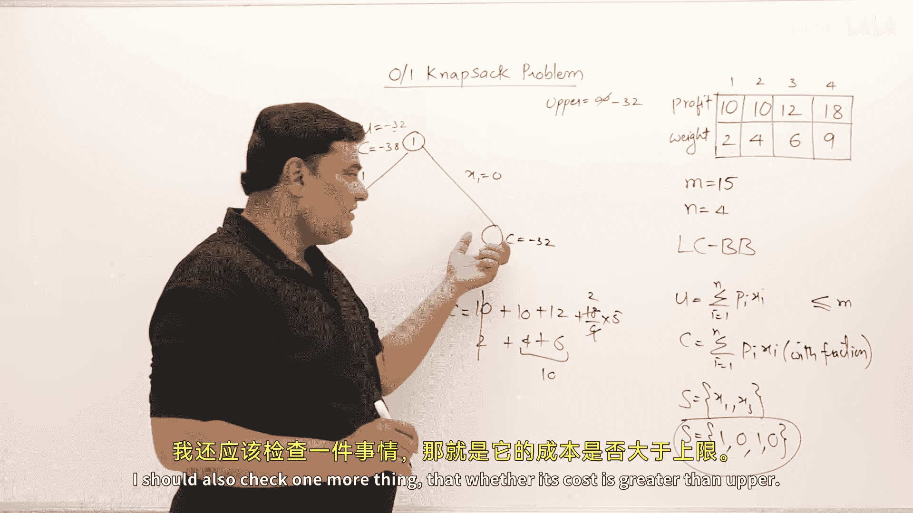

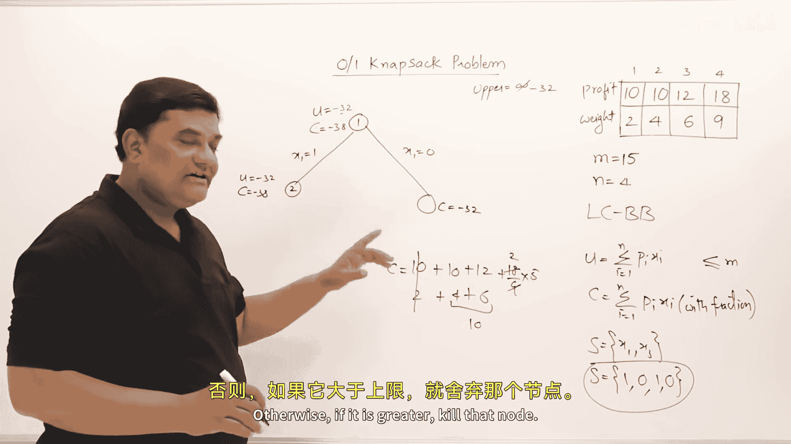

### 第三步：LC策略选择下一个节点

当前活节点有：节点A（代价-38）、节点B（代价-32）。
根据LC（最小代价优先）策略，选择代价最小的节点，即**节点A（代价-38）**进行扩展。

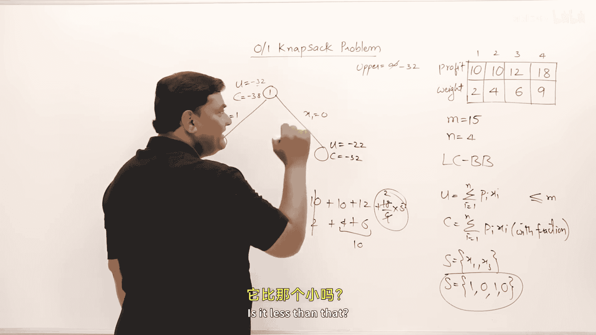

### 第四步：扩展节点A（包含物品1）

从节点A分支，产生两个子节点：在已包含物品1的基础上，选择包含或不包含物品2。

**节点A1：包含物品1和2**
*   已选利润：20，已用重量：6。
*   **代价**：剩余容量9。贪心加物品4（利润18，重9），恰好装满。代价 `- (20+18) = -38`。
*   **上界**：同样操作，上界 `-38`。
*   代价等于当前 `upper`（-38），保留。

**节点A2：包含物品1，不包含物品2**
*   已选利润：10，已用重量：2。
*   **代价**：剩余容量13。贪心加物品4（利润18，重9），剩余4；剩余容量4可加物品3的2/3（利润 `12*(4/6)=8`）。总利润 `10+18+8=36`。代价 `-36`。
*   **上界**：不允许分割。加物品4（利润18，重9），剩余4；物品3重6>4，无法完整装入；物品2被排除。总利润 `10+18=28`。上界 `-28`。
*   代价 `-36` 与当前 `upper`（-38）比较？`-36 > -38` 成立，但教程中再次选择保留。我们继续。

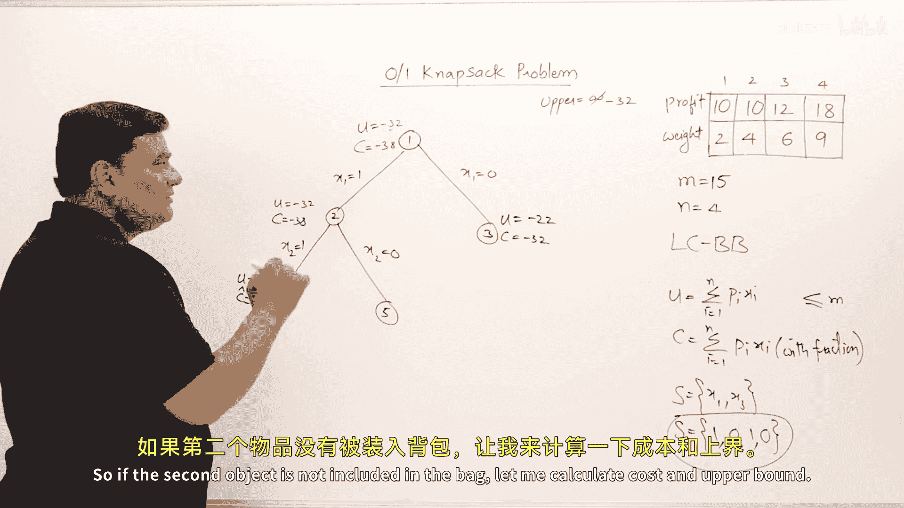

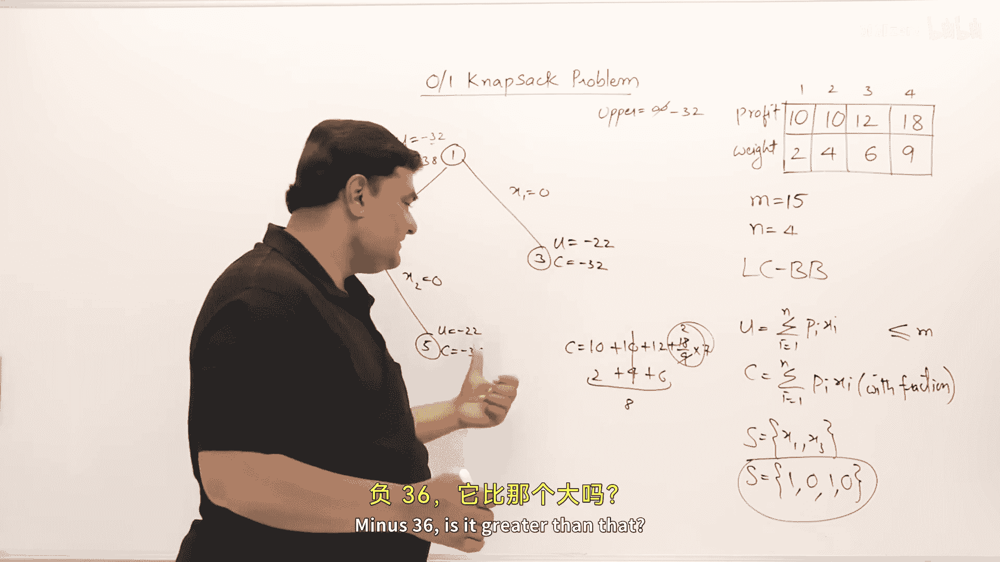

### 第五步：继续LC策略选择

当前活节点：节点B（-32）、节点A1（-38）、节点A2（-36）。
最小代价节点是**节点A1（-38）**。扩展它。

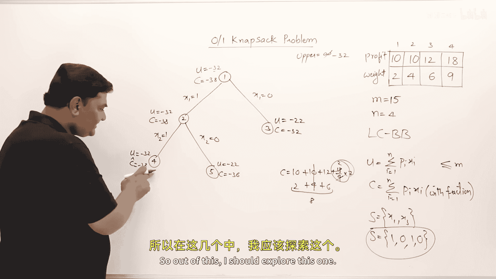

### 第六步：扩展节点A1（包含物品1和2）

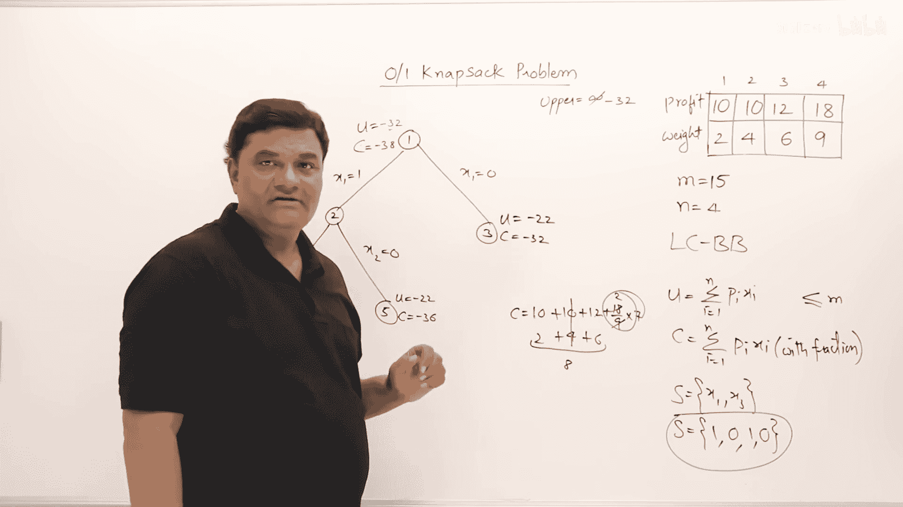

从节点A1分支，产生两个子节点：在已包含物品1和2的基础上，选择包含或不包含物品3。
*   已选利润：20，已用重量：6。

**节点A1a：包含物品1,2,3**
*   总重量：6+6=12，剩余容量3。
*   **代价**：剩余容量3无法完整装入物品4（重9）。可以装入物品4的 3/9（利润 `18*(3/9)=6`）。总利润 `20+12+6=38`。代价 `-38`。
*   **上界**：不允许分割。物品4无法完整装入，故总利润 `20+12=32`。上界 `-32`。
*   该节点代价 `-38`，等于当前 `upper`。

**节点A1b：包含物品1,2，不包含物品3**
*   总重量：6，剩余容量9。
*   **代价**：剩余容量9恰好完整装入物品4（利润18）。总利润 `20+18=38`。代价 `-38`。
*   **上界**：同样操作，上界 `-38`。
*   我们发现节点A1b的**上界是-38**，比当前全局上界 `upper`（-38）更优吗？相等。但注意，这是一个**可行解**（所有物品决策已定，且总重量15恰好装满）。我们将 `upper` 更新为这个更具体的上界值 `-38`。

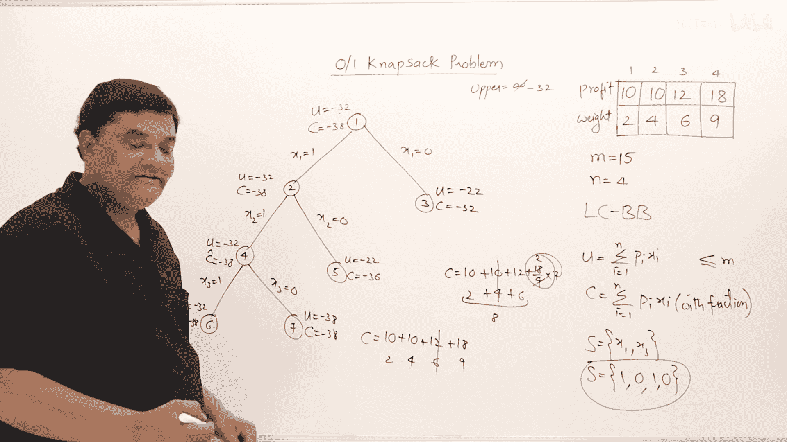

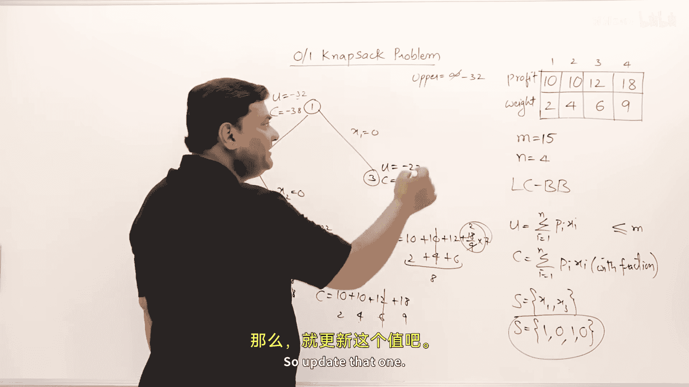

### 第七步：剪枝

更新全局上界 `upper` 为 `-38` 后，检查其他活节点：
*   节点B：代价 `-32`。比较 `-32 > upper (-38)`？`-32 > -38` 为 **True**。这意味着节点B所能达到的最好可能利润（32）已经低于当前找到的可行解利润（38）。因此，**剪枝**节点B。
*   节点A2：代价 `-36`。比较 `-36 > upper (-38)`？`-36 > -38` 为 **True**。同理，剪枝节点A2。
*   节点A1a：上界 `-32`，`-32 > -38` 为 **True**，剪枝。

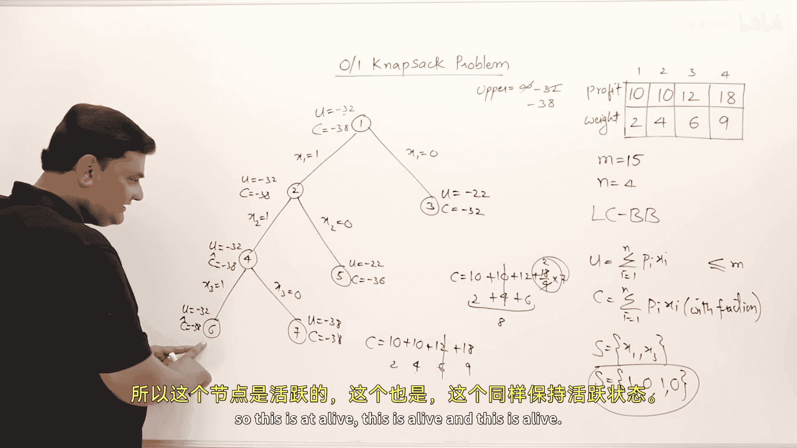

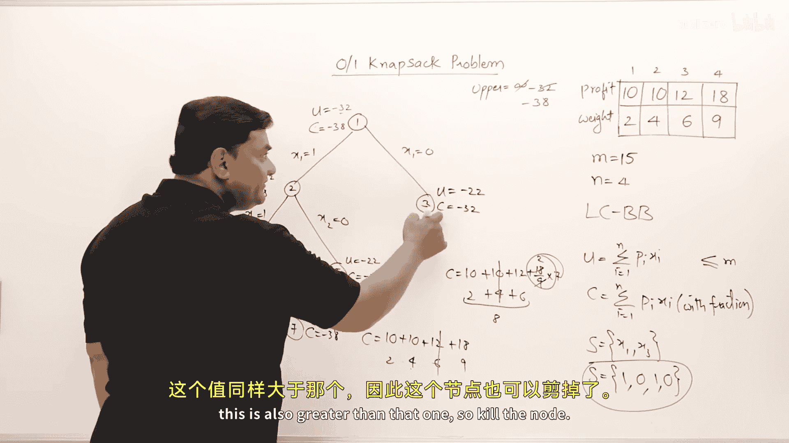

### 第八步：探索剩余节点并得出结论

现在剩下的活节点是 **节点A1b**。它已经是一个叶子节点（所有物品决策已定：物品1选，物品2选，物品3不选，物品4选）。我们将其标记为答案节点。

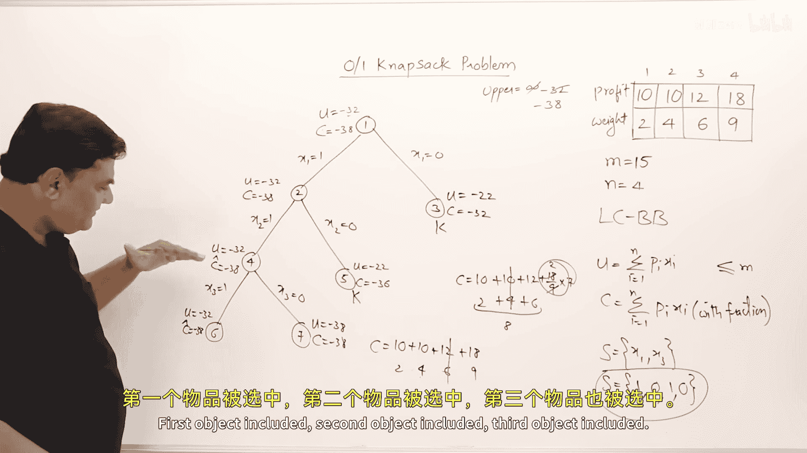

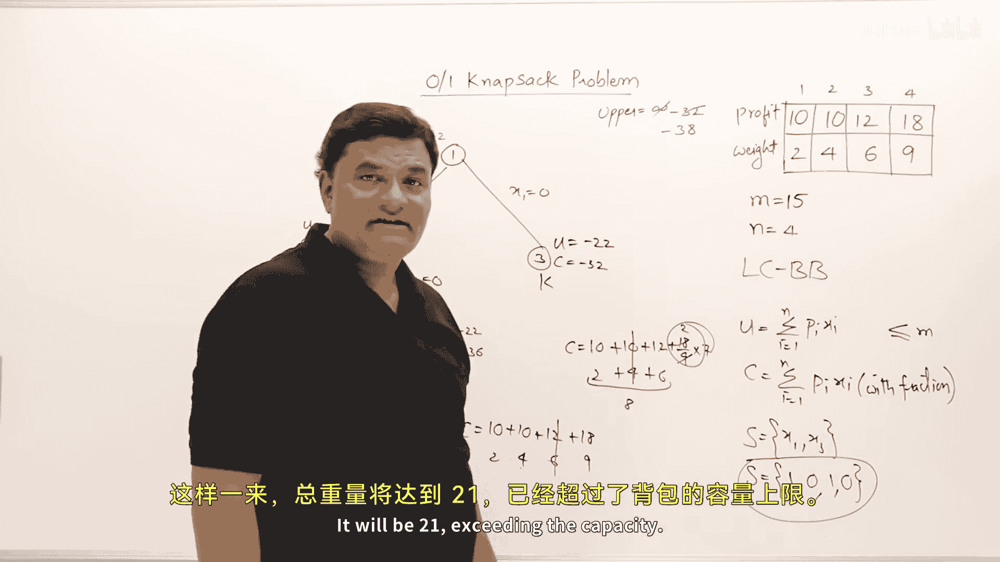

因此，最优解是：
*   物品1：放入（利润10，重量2）
*   物品2：放入（利润10，重量4）
*   物品3：不放入（利润0，重量0）
*   物品4：放入（利润18，重量9）

**总利润**：10 + 10 + 0 + 18 = **38**
**总重量**：2 + 4 + 0 + 9 = **15**（等于背包容量）

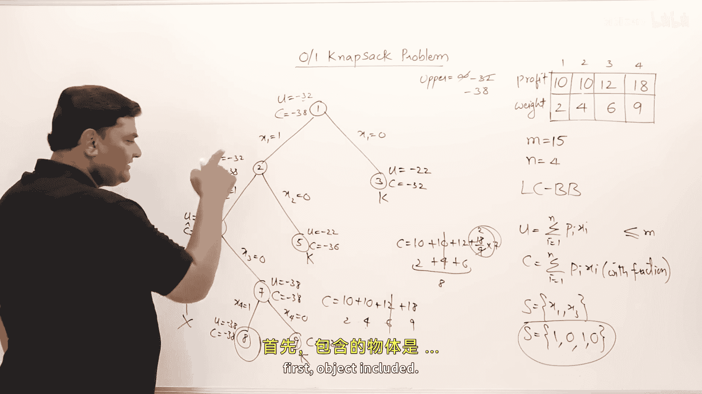

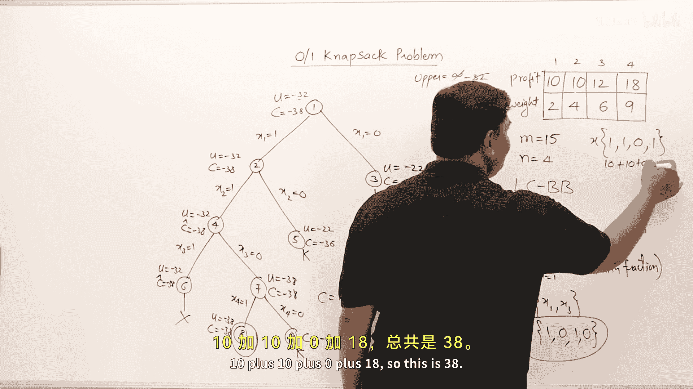

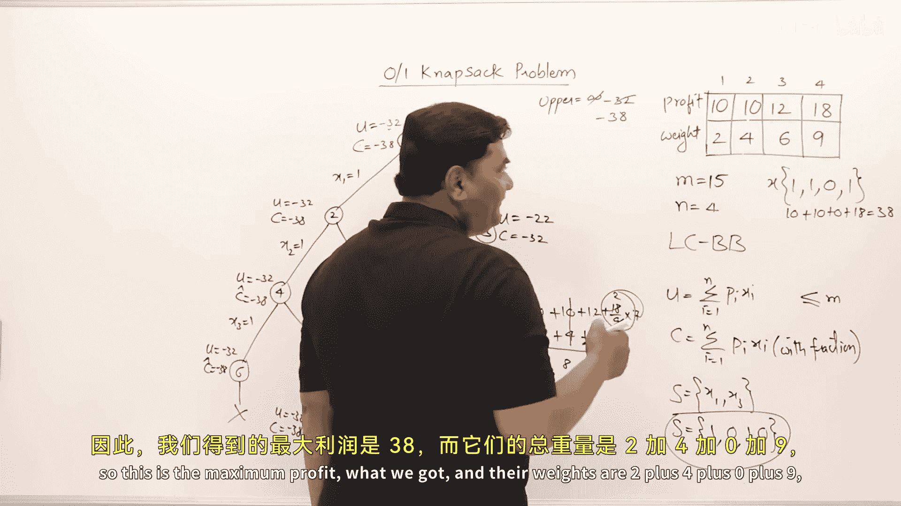

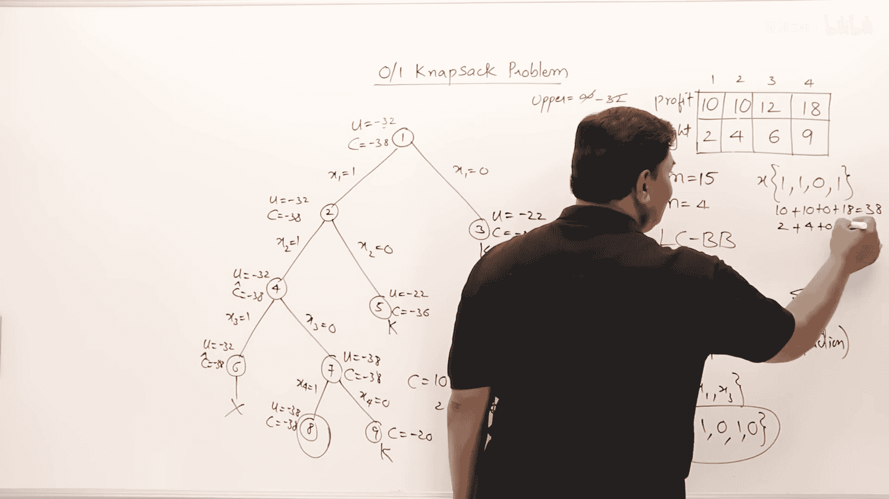

## 总结 📝

本节课中，我们一起学习了如何使用**LC（最小代价）分支限界法**来解决**0/1背包问题**。我们首先将最大化问题通过利润取负转化为最小化问题。然后，通过构建状态空间树，为每个节点计算**代价**（允许分数物品的乐观估计）和**上界**（不允许分数物品的乐观估计）。利用**全局上界**和**LC优先探索策略**，我们有效地剪去了大量不可能产生更优解的子树，最终找到了最优解：放入物品1、2和4，获得最大利润38。分支限界法通过智能的界限计算和搜索顺序，避免了穷举所有可能性，在解决组合优化问题时非常高效。

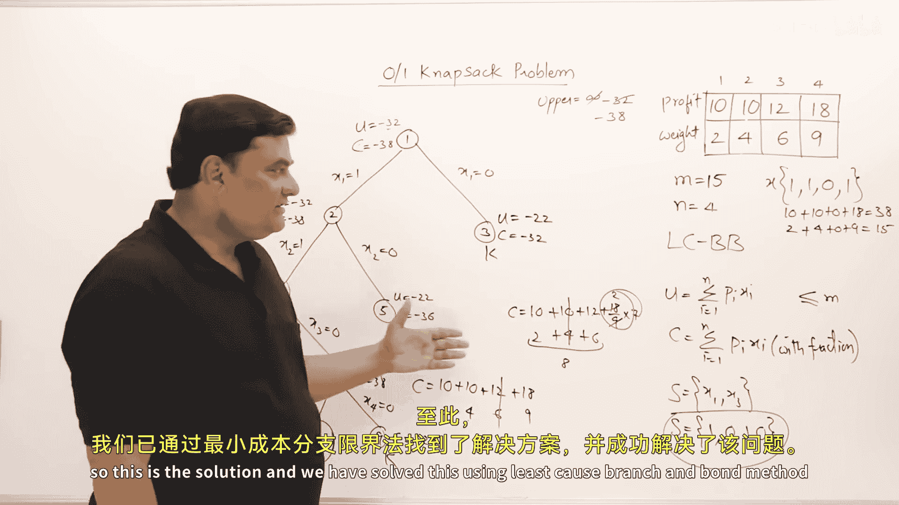

