# 077：B树与B+树详解 🗂️

在本节课中，我们将要学习B树和B+树。这是一个重要的主题，也是学生理解起来比较困难的主题。它们在数据库中非常有用。为了透彻理解B树和B+树，我们需要了解一系列相关概念。

以下是理解B树和B+树所需掌握的主题列表。如果你理解了所有这些内容，那么你就能明白B树和B+树是什么。很多人试图在不了解全部背景的情况下，仅仅学习插入和删除的操作步骤。因此，本教程将涵盖所有与B树和B+树相关的主题，帮助你完美地理解B树和B+树。

让我们从磁盘结构开始。

## 磁盘结构 💽

让我们看看磁盘结构。磁盘就像一个盘片，上面有同心圆，这些是逻辑上的圆圈，并非物理上的。

这些圆圈被称为磁道。假设这是磁道0、磁道1、磁道2和磁道3。这些被划分的部分被称为扇区。这是扇区0、扇区1、扇区2、扇区3、扇区4和扇区5。磁盘被划分为许多磁道和扇区。

磁道和扇区的交叉部分，例如这个或这个，所有这些交叉位置都被称为块。因此，磁盘上的任何位置都可以通过磁道号和扇区号来寻址。

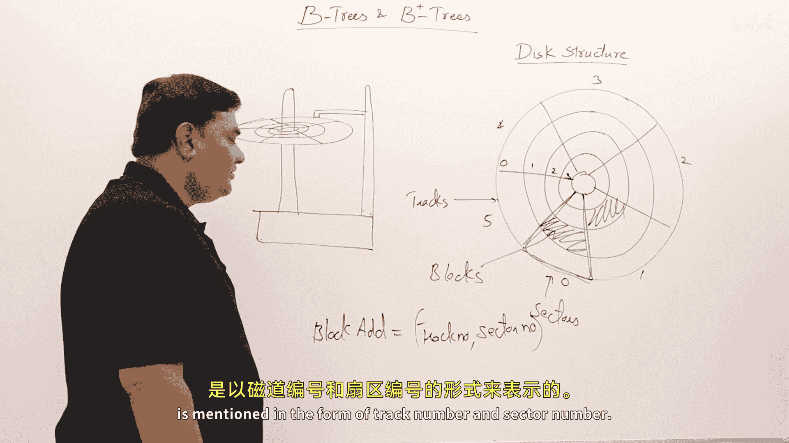

所以，磁盘上的地址，即块地址，是以磁道号和扇区号的形式表示的。例如，如果我取这个特定的块，那么它是磁道1，扇区0。这个块是磁道2，扇区1。因此，每个块都可以用磁道号和扇区号的形式表示其地址。

通常，块大小我们取为512字节。为了学习目的，我们假设它为512字节。它可以是任何大小，取决于磁盘制造商。我们假设每个块是512字节。当我们从磁盘读取或写入时，我们总是以块为单位进行读写。

现在，如果我取一个512字节的块，起始地址（第一个字节）是0，最后一个字节是511，那么每个字节都有自己的地址，这称为偏移量。让我们看这是第10个字节，我们可以通过块地址来引用磁盘上的任何一个字节，然后在那个块内，我们取偏移量。这就是该特定字节的地址。

我们假设每个块的地址从0开始，最后一个地址是511，因为总共512字节。任何字节我们都可以取其地址，这个地址被称为偏移量。要访问磁盘上的一个特定字节，我们需要知道磁道号、扇区号和偏移量。

假设在这个特定的块中，我想读取这个特定的点，这是一个字节。为了读取那个字节，我需要知道这三样东西。

然后，让我们再理解一件事。磁盘像这样安装在主轴上，也会有磁头臂。通过旋转，扇区会改变；通过磁头臂的移动，磁道会改变。因此，我们可以通过移动这个磁头臂（即读写数据的磁头）或旋转磁盘，将磁头定位在特定的磁道和特定的扇区。通过旋转改变扇区，通过移动磁头改变磁道。这就是关于磁盘的内容。

现在，磁盘上的数据是以块为单位存储的。还有一件事。

让我们把这个当作主内存。通常我们称之为RAM，RAM是一种技术，这种内存类型是主内存。我们在主内存中运行程序，程序会访问数据。假设它们从磁盘访问数据，那么数据必须从磁盘加载到主内存中，然后才能被访问。如果得到任何结果，结果会再次写回磁盘。

因此，数据不能直接在磁盘上处理，它必须被带入主内存然后访问。这是需要理解的一个重要点。

我再强调一次，在主内存内部组织数据，这些数据直接被程序使用，这就是数据结构。

而在磁盘上高效地组织数据，以便可以轻松利用，这就是数据库管理系统。

所以，研究或用于在磁盘上以高效方式存储数据的方法或途径，都是关于数据库管理系统的设计，组织一切。这里，研究数据结构。

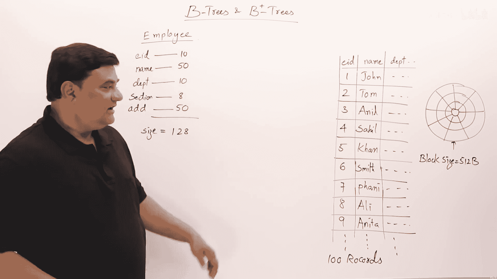

让我们继续下一件事：数据如何存储在磁盘上。

## 数据库中的数据组织 📊

现在，让我们了解数据如何以数据库的形式组织在磁盘上。我这里有一个示例数据库表，包含一些列和一些行。假设有100行。

数据如何以块的形式存储在磁盘上？我们已经研究过，并假设块大小为512字节。

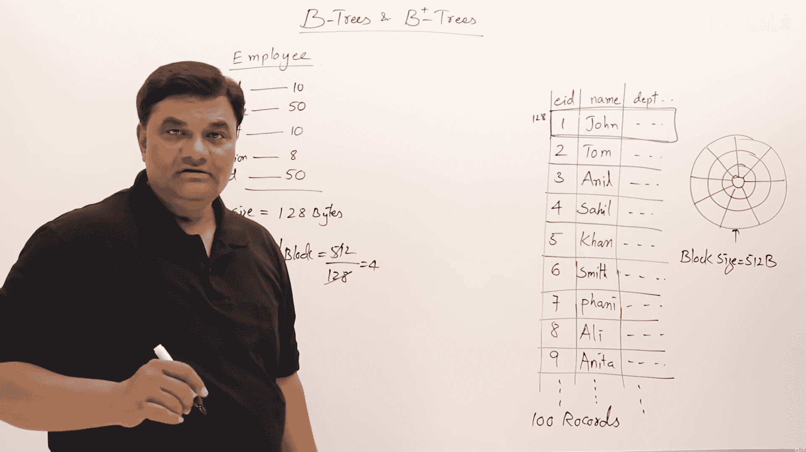

现在，这个表的结构在这里给出。有更多的字段，我没有全部显示，但这里我写下了所有。总共有五个字段，这些是它们的大小。员工ID大小为10字节，这个字段是50字节，部门是10字节，等等。所以总共占用128字节。

这意味着每行大小是128字节。每一行是128字节。

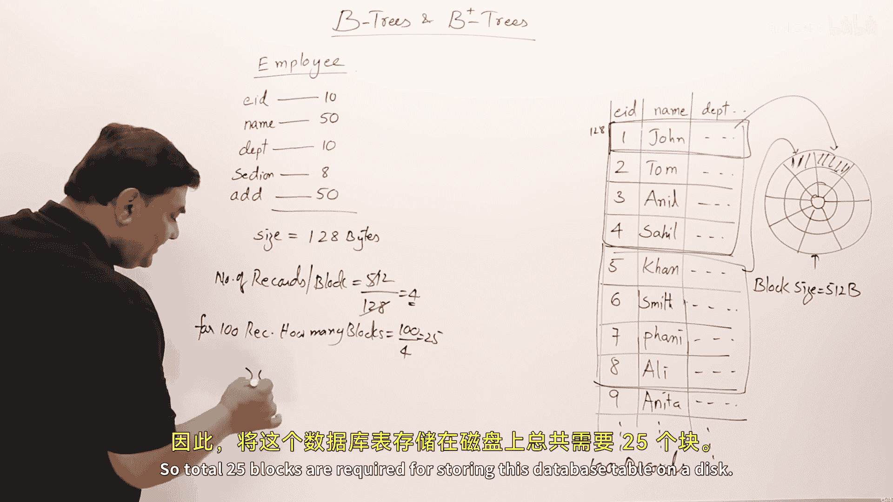

现在，当我们想将该表存储在数据库上时，在每个块中可以存储多少行？也就是可以存储多少条记录。所以，每个块的记录数。

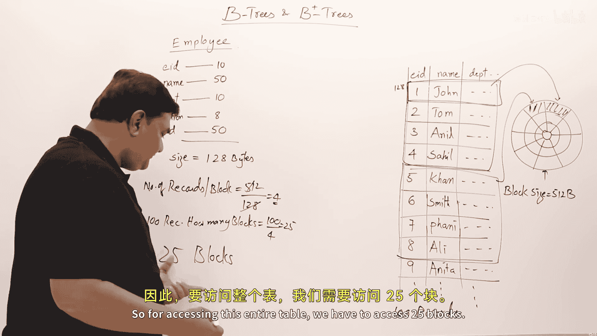

块大小是512，记录大小是128，所以是4。这意味着我们可以在一个块中存储这个表的四行。

这意味着这四行将进入一个块。而这四行将进入下一个块。

每四行存储在一个块中。所以一个块只能包含四行。因为我们这里有100行，也就是100条记录。那么需要多少个块？

然后，100条记录。每个块只能包含四条记录，所以是25。因此，存储这个数据库表总共需要25个块。

在磁盘上。现在，当这个表占用25个块时，想象一下，如果你想搜索任何特定的记录，你写了一个查询，例如从员工表中选择，我想找员工ID为5或员工名为Smith的记录。如果我进行搜索，那么需要多少时间？时间取决于你访问的块数。要访问整个表，我们必须访问25个块。

所以块访问次数是25。因为记录可能在任何地方，我们不知道记录在哪里。所以我们必须搜索整个表。为此，我们最多需要访问25个块。我们可以逐个块访问并检查我们正在寻找的特定记录。但最多需要访问25个块。我们能减少这个时间吗？可以。现在我们将为这个数据库表准备索引。

## 索引与密集索引 🔍

索引。在索引中，我们将存储什么？在索引中，我们将存储一个键，即员工ID，以及指向记录的指针。假设员工ID 1，它在这里。员工ID 2，它在这里。员工ID 3，它在这里。实际上，我们将有一个指向磁盘上块内表的指针。所以我们将有一个指向记录的指针。我们称之为记录指针。对于每条记录，我们将在索引中有一个条目。这被称为密集索引。

接下来，索引存储在哪里？我们也将索引存储在磁盘上。

假设在这个块中，我们存储一个索引。这是用于索引的。这是用于数据库表的，还有更多记录。因为有更多块，因为它占用了25个块。索引也保存在磁盘上。

现在的问题是，这个索引在磁盘上会占用多少空间？让我们分析一下，员工ID是10字节。那么这个记录指针呢，我们在这里取的指针？记录指针。我们假设它占用6字节。所以每个条目大小是多少字节？16字节。每个条目占用16字节。那么这里有多少个条目？有100个条目。

现在的问题是，这需要多少个块？条目大小是16字节，块大小是512，所以这将是32。这意味着我们可以在一个特定的块中拥有32个条目。那么总共有多少个条目？100个条目。所以对于100个条目，100除以32。所以大约是3.2。假设超过3。所以这意味着存储这个索引需要3个以上的块。假设存储这个索引需要4个块。

现在，每当我们想要搜索时，我们访问索引。所以最多需要多少个块？4个块。4个索引块，一旦我们得到一个特定的键，假设我正在寻找这个，使用那个地址我可以访问记录。所以为了访问记录，我必须访问一个块。1个块。所以最多4个索引块和一个数据库表块。首先在索引中搜索，最多需要多少时间？4个块。然后一旦你得到索引条目，就去那个特定的数据库块。那又是一个块。所以总共需要4加1个块来访问任何数据库记录。访问任何记录，我们必须访问4加1，也就是5个块，而不是25个块，因为我们不必查看整个表。这就是索引的好处。

接下来我将讨论多级索引。

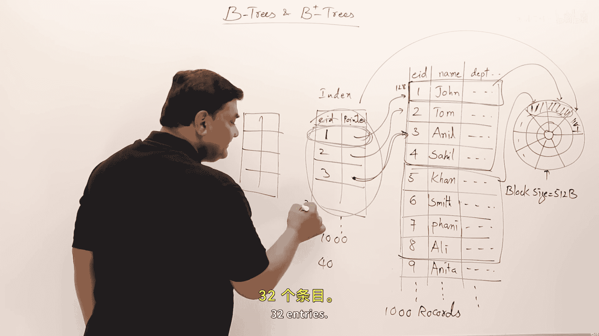

## 多级索引 📈

如果索引大小也在增长怎么办？现在我有1000条记录，1000条记录对应50个块。现在，这里我们需要4个块。现在我们需要40个块，因为会有1000个条目，我只是加了个0。当行数是100时，我们需要4个块。现在，1000条记录，假设需要40个块。只是假设，我不做所有计算。

那么在索引本身的搜索就变大了。我们可以在索引之上再有一个索引吗？可以。现在你如何为这里的每个条目准备这个索引？我们会在下一级索引、高级索引中为每个条目设置一个条目吗？不，是为每个块。所以在这个块中可能有多少个条目？32个条目。所以我们将有一个指向这个特定索引的32个条目的指针。

所以假设起始键是1，下一个键将是33，它将指向下一个块。所以这是一个稀疏索引。它不会为这里的每个条目都有一个条目。它不会拥有相同数量的条目。它将为索引的每个块设置一个条目。现在，正如我所说，有40个块。现在，同样，这个的大小是多少？只有16字节。所以一个块中可能有多少个？32个可能。那么对于这个特定的索引，需要多少个块？只需要一个多一点，假设两个。所以需要两个块。所以这个高级索引可以只存储在两个块中。因此，数据库表占50个块，第一级索引占40个块，然后下一个高级索引只占两个块。所以在两个块中搜索，一旦我们得到一个条目，访问这里的块。然后一旦我们得到一个条目，访问这里的块。所以总共多少个块？这边2个块，这边1个块，这边1个块。通过这种方式，通过增加一级索引，我们减少了块访问次数。

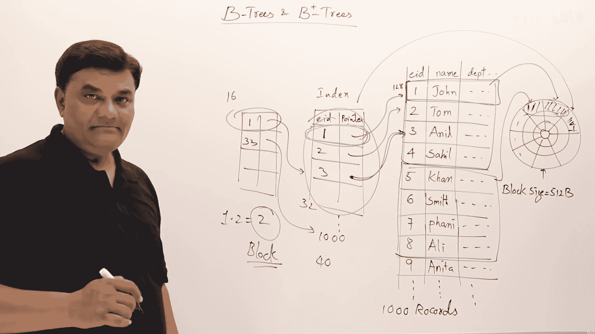

这就是B树和B+树的基本思想起源。我将绘制多级索引，然后向你展示它的样子。让我们再看一次多级索引。

假设这是主索引。

现在关于这个，我们需要一个更多的索引，假设这个太大了，那么它将有一个指向索引中一组条目的指针，然后一个指向索引中另一组条目的指针。我只是随机取，没有按计数绘制。所以这个有指向这些的指针。假设这个也很大。这个也很大，那么你可以再有一个索引，它将有一个指向一组条目的指针和一个指向另一组条目的指针。

这样我们可以继续添加多级索引，如果数据库表在增长。假设这里是一个数据库表。如果大小在增长，这个索引会增长，我们将添加一个更多的索引，再一个索引。添加多级索引将减少块访问次数。

所以如果我把它翻转过来看，像这样。

下一级索引。然后，再下一级索引。如果我翻转过来看这个，这个多级索引看起来像这样。现在，多级索引的要求是什么？我们应该手动添加索引吗？我们应该检查数据库大小是否在增长，然后我们应该逐个添加索引，即高级索引吗？不，我们希望高级索引能够自动添加和删除。如果这个在增加，表大小在增加，这个索引在增加，那么你添加一个更多的索引。如果你正在删除记录，那么索引大小会减少，然后你移除高级索引。我们希望自我管理的高级索引，即多级索引。

所以最终的事情是我们想要自我管理的多级索引。这就是B树和B+树的想法的来源。

现在你可以看到，这些多级索引看起来像一棵树。如果我把它们侧过来，那么它看起来像这样。B树和B+树实际上起源于M路搜索树。接下来我将讨论什么是M路搜索树。最后，我们将进入B树和B+树。

## M路搜索树 🌳

让我们谈谈M路搜索树。要了解M路搜索树，让我们回顾一下二叉搜索树，它用于搜索目的。为了搜索任何键值，我们从根开始。如果键值较小，我们走左边；如果键值较大，我们走右边。像这样的二叉搜索树。如果我搜索15，那么15大于这个，我走这边。15小于这个，所以我走这边，然后找到了。我们知道较小的键排列在左侧，较大的键排列在右侧。这就是二叉搜索树中所做的。

在二叉搜索树中，每个节点可以有多少个键？只有一个键。每个节点可以有多少个子节点？最多两个子节点。每个节点最多可以有两个子节点。所以这就是为什么它被称为二叉搜索树，两个子节点。

那么，我们能否有一棵拥有超过两个子节点或超过一个键的树？让我们检查20和50。这是两个键。现在这边我将有小于20的键，即10和15。这里我将有介于这两个键之间的键，即30、35。这里我将有大于这个的键，即60和90。所以这里我们也可以有一个像这样的搜索树。这是一个遵循与二叉搜索树相同思想的搜索树。

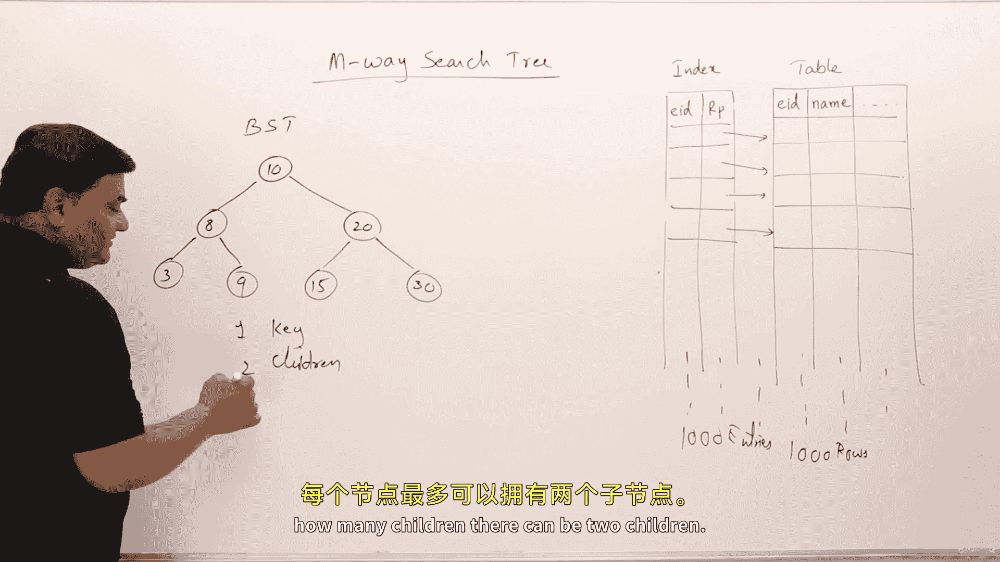

看，键的排列使得它们是递增顺序的。所以如果你看这里的键，第一个键小于第二个键，第二个键小于第三个键。如果你有更多的键，它们将像这样排列。如果我搜索30，那么我从这里开始。30大于20。30小于50，所以它必须在这个子节点中，来这里。30找到了。

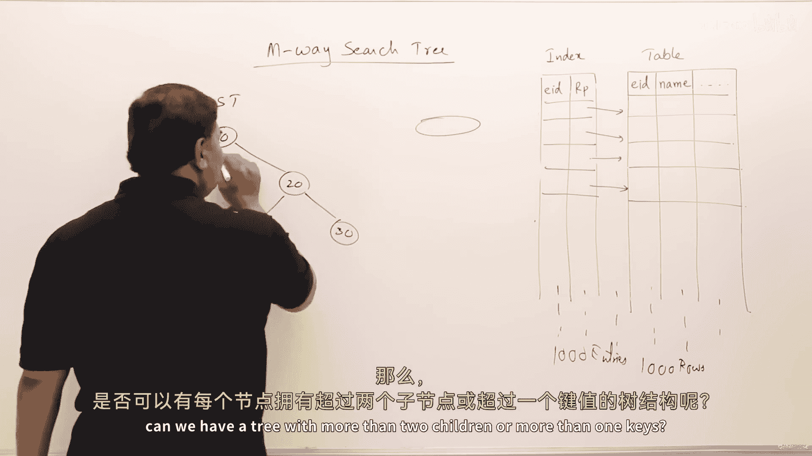

所以毫无疑问，搜索所花费的时间比二叉搜索树多一点，但搜索方法是相同的。所以这些树被称为M路搜索树。那么M是什么？看它有多少个键？在这个例子中，它有两个键。那么它有多少个子节点？每个节点最多可以有3个子节点。所以这是一个三路搜索树。这被称为三路搜索树。

这样，M路搜索树意味着每个节点最多可以有M个子节点的搜索树。所以每个节点最多可以有M个子节点。那么有多少个键？M-1个键。

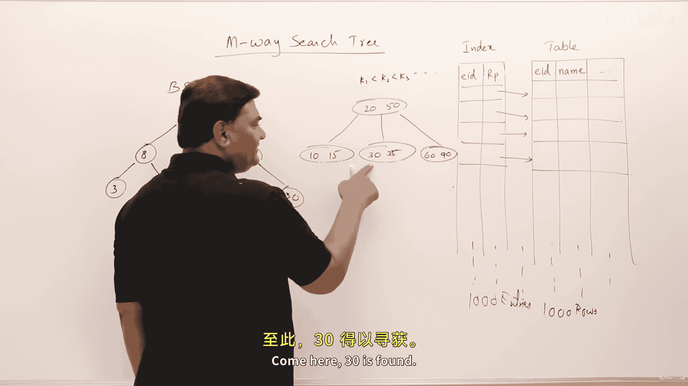

所以M基于子节点的数量，即节点的度。M路搜索树是二叉搜索树的扩展，或者你可以说二叉搜索树是度为2的M路搜索树的一种类型。

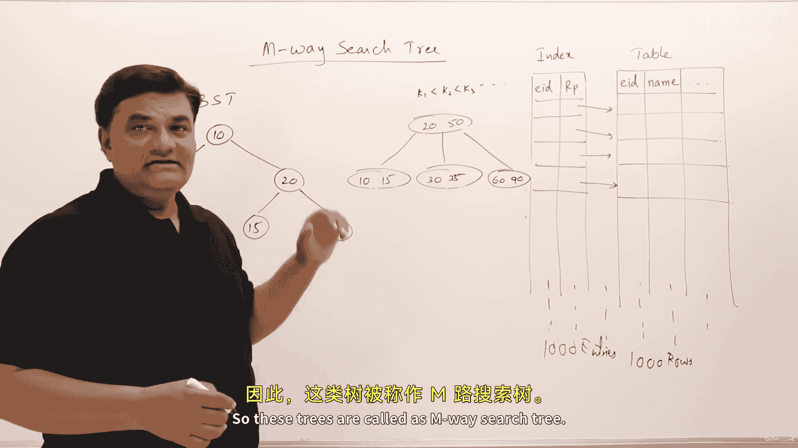

所以你也可以有度为3、度为5、度为10、度为1000的树。这意味着你可以有100个键在这里，每个节点可以有100个键和101个子节点。所以你可以有任何度的搜索树。这就是关于M路搜索树的内容。

让我们看看M路搜索树的节点。对于二叉搜索树，我们如何准备一个节点？我们将有数据在这里和两个子节点。这里你需要更多的子节点。让我为这个画一个节点结构。如果M路搜索树是四路搜索树，意味着每个节点可以有四个子节点和三个键。让我画一个节点结构。

这应该是一个子节点指针。指向子节点。这是键1。再次，这是指向一个子节点的指针。这是键2。这是指向一个子节点的指针。这是键3。这是指向一个子节点的指针。所以四个子节点指针。所以这是四路。当它是四路时，那么可以有三个键。

也就是说，一个节点可以有M-1个键。所以就像这样。这是一个图示表示。如果你正在制作一个数据结构，那么节点结构看起来像这样。所以如果有M个子节点，那么需要M-1个键空间。

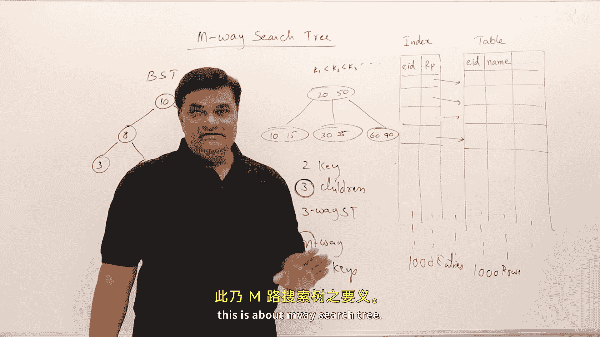

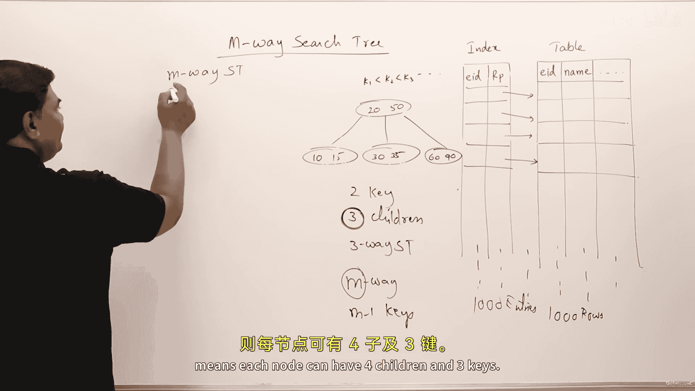

## 将M路搜索树用于索引

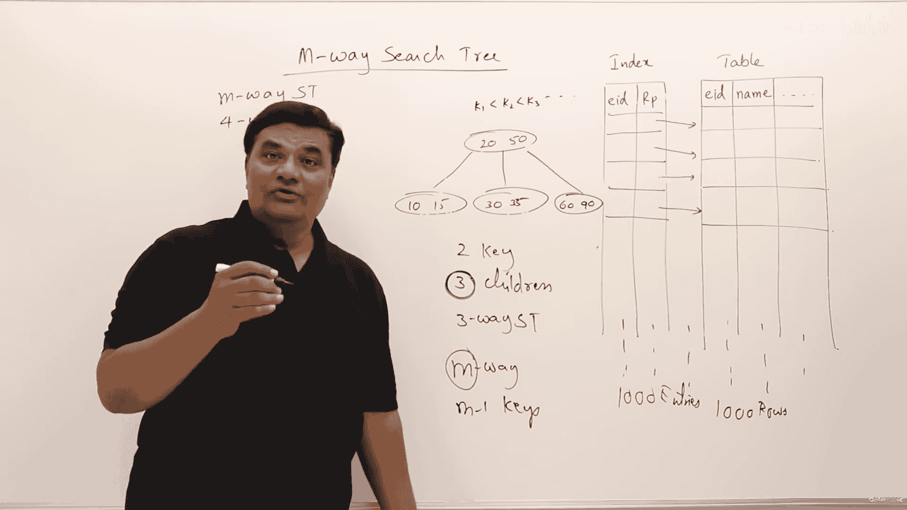

接下来，我们能否使用这些搜索树，这些节点结构来准备索引？让我们看看。所以我将尝试使用这个来制作索引。让我们检查一下我们如何为四路搜索树做到这一点。

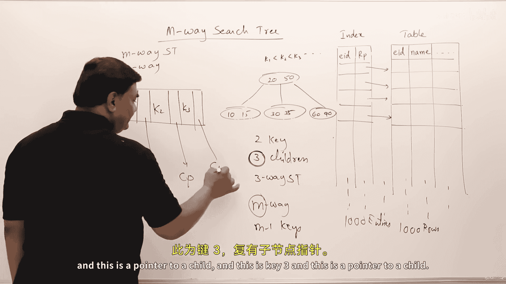

可以有四个子节点，所以这是一个子节点指针。好的，现在这是键1。这是下一个子节点指针。然后，这是键2。然后这是一个下一个子节点指针。然后这是键3，和第四个孩子指针，所以子指针1，2，3，4。然后这是什么？我在每个键之后添加了一个指针。这不过是，如果你这里有键，并且你利用M路搜索树作为索引的好处，那么除了子指针，你还应该有一个指向记录的指针。那就是记录指针。所以，是的，我们也会有一个记录指针。所以这是一个记录指针。

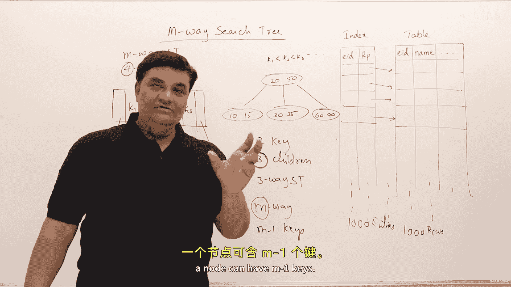

但是一个指针被指出了。所以我们可以利用M路搜索树作为索引，即多级索引，就像树会有多个级别一样。所以为了制作多级索引，我们可以利用M路搜索树，但节点结构应该像这样。所以记住这个节点结构：键在那里，子指针，所以度为4，所以四个子指针，三个键，所以三个记录指针，每个键都有一个指向数据库记录的指针。

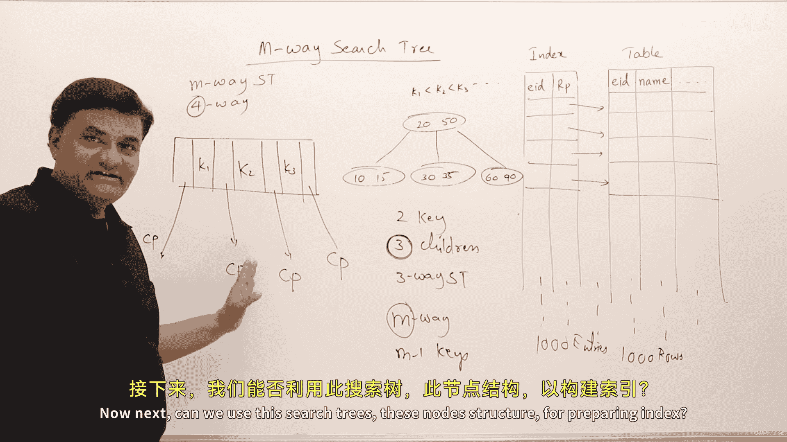

现在，如果我们简单地使用M路搜索树，会有什么问题？我们如何克服这个问题并引入B树？现在我们将走向B树。到目前为止，我们已经讨论了M路搜索树。现在我带你进入B树。在B树中，我们将使用相同的节点结构。再次记住这个。我可能不会向你展示。这是B树中遵循的节点结构。

但首先，让我们知道M路搜索树有什么问题，然后B树与M路搜索树有何不同。让我们看看在M路搜索树中如何完成插入，以及它的问题是什么。然后我们将转向B树。

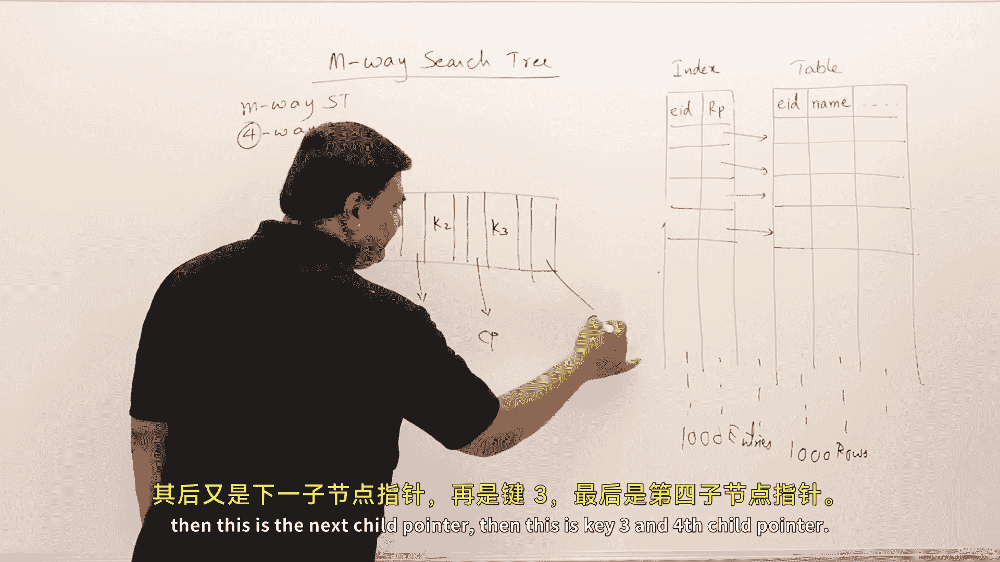

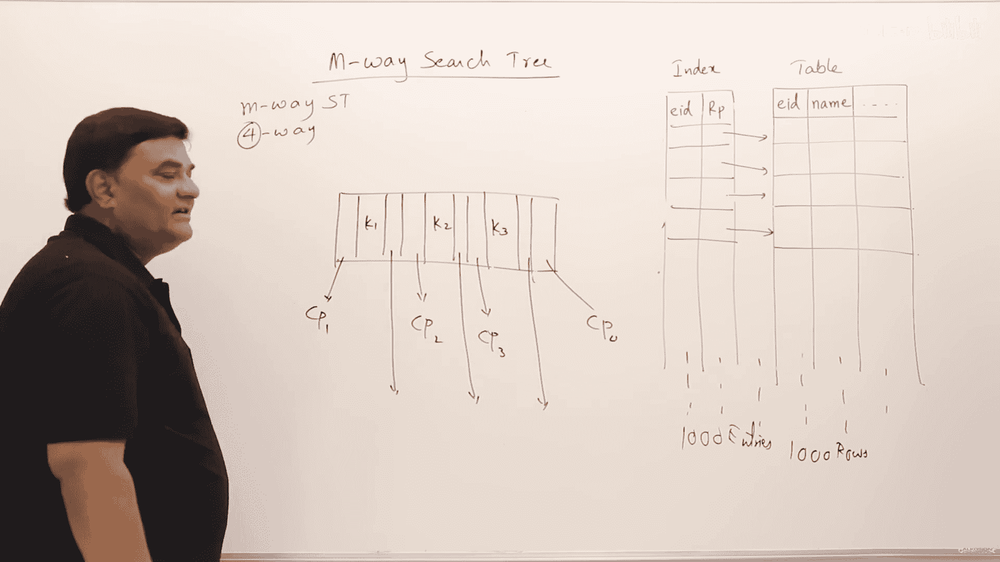

为了让你意识到这个问题，我取了一个10路搜索树。度为10意味着每个节点可以有10个子节点和九个键。假设我必须插入这些键，让我们看看如何插入。

最初，什么都没有。所以我会创建一个节点，并插入。我还能在这里插入多少个键？还能插入8个键。但是对于插入20，我将创建一个新节点作为子节点并插入20，然后插入30。30更大，所以30在右边。所以我不会插入这里，但我会来到这里。20和30大于这个？或者我会在这里插入30。

所以我可以像这样插入，但这是错误的。

我应该先填满这个节点，然后才考虑创建下一个节点，但在M路搜索树中没有控制。你可以随意插入。

所以这意味着如果我有任何键，那么M路搜索树的高度会是多少？这将消耗太多时间。它变得类似于线性搜索。

这就是M路搜索树的问题。所以M路搜索树的问题是什么？创建过程不受任何控制。对于创建过程没有指导原则，你可以随意创建。如果你像这样创建，那就是浪费时间。

搜索将花费大量时间。那么必须有一些规则或指导原则来创建M路搜索树。是的，那些指导原则被称为B树。

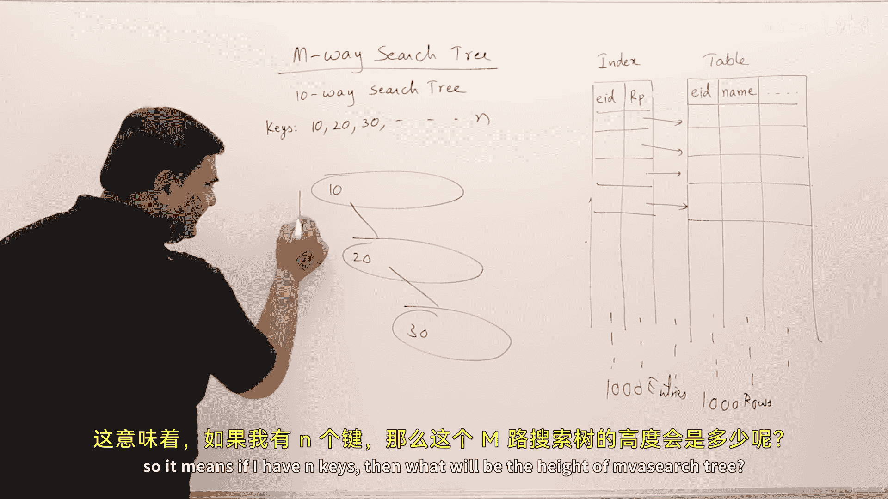

## B树规则与创建 🧮

所以B树无非是带有一些规则的M路搜索树。

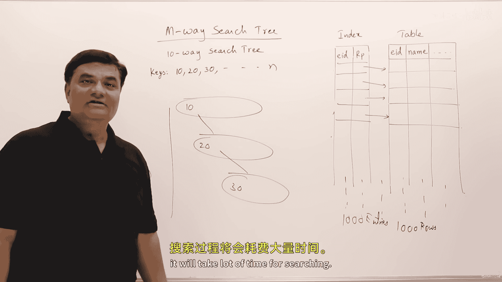

让我们看看那些规则是什么。让我解释一下，让我们看看什么是B树。B树无非是带有一些规则的M路搜索树。

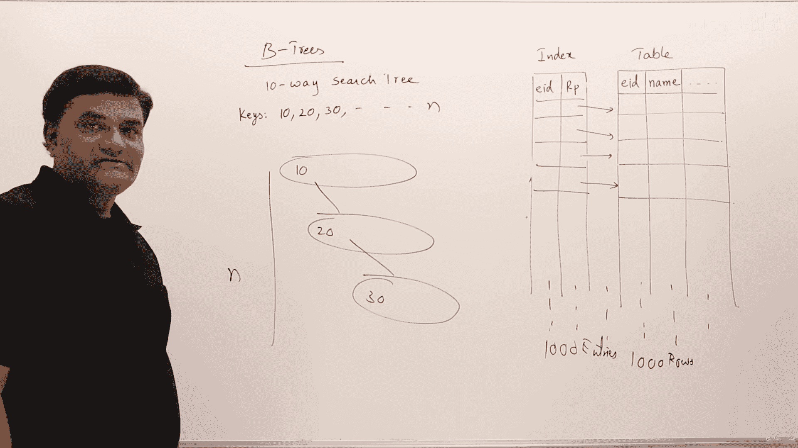

那么规则是什么？让我们看看前三条。

每个节点必须至少填充一半，一半什么？如果度是M，那么必须有M/2个子节点。所以取M/2的值，不是向下取整。M/2意味着如果度是10，那么一个节点必须有5个子节点。每个节点必须有五个子节点。只有这样你才能考虑创建新节点。这是为了控制M路搜索树的高度。这是一条规则。

你只有在当前节点至少填充了一半子节点时才能创建下一个节点。这是一条。并且必须有M/2个子节点。然后，第二件事。

我们如何对根节点施加这个条件？我们不能对根节点施加这个条件。如果我们施加，那么我们就不能插入第一个值。所以根节点可以有最少2个子节点。所以根节点意味着第一个节点，所以第一个节点最少可以有2个子节点，对吧？所以这意味着它也可以只有一个键。没问题。但是所有其他节点呢？它们必须至少有半数的子节点。这是条件，两个条件，不是第三个条件。然后第三条规则是所有叶节点必须在同一层，所有叶节点在同一层。就是这样。

如果你遵循这三条规则来创建M路搜索树，那么我们实际上是在创建B树。这里还有一件重要的事情是创建过程是自底向上的。

现在我将取一些键，并向你展示如何自底向上生成一个B树。为此，我不会取10路搜索树。我将取一个小的度，比如3，并向你展示如何创建B树，换句话说，如何插入。我们将创建一个度为4的B树，意味着每个节点可以有四个子节点和三个键。我在这里取了一些键。然后我将插入越来越多的节点。所以我之后会添加更多的键。让我们从第一个开始。

对于B树，最初没有节点，我正在插入10。第一个键，所以它可以有多少个子节点？两个子节点。根据多级索引，当我们说时，它可以有一个记录指针。下一个20。20将插入在这里。20更大，所以插入在这里。下一个是50。没有空间给50。所有三个键都在这里，度是4，所以我们不能插入50。没有空间。那么我们应该做什么？分裂这个节点并创建一个新节点。所以从10、20、40和50中，两个键，我将保留在这边，一个键，我将发送到根节点。那么这是左子节点。这是右子节点。就这样。

所以当节点被填满，没有空闲空间时，为了插入一个键，我们分裂了一个节点，并将其中一个键发送到了根节点。从4个键中，包括50，这边两个，那边一个，40上去。

这就是在创建B树时如何进行分裂。你可以看到树在向上生长。所以就是这样。它是自底向上创建的。

我告诉过你，B树对于实现多级索引很有用。那么如果你说这是一级索引，那么上面就是自动创建的第二级索引。如果你在这里添加键，这个会自动创建。

现在让我们看看，我将在这里添加更多的键，然后你可以再次看到这个在增长。所以，让我们继续。我将插入更多的键。假设60。所以60来到这里。然后70，70来到这里。然后80，80，这里没有空间了。80应该来这里。没有空间，那么再次分裂。

那么我应该做什么？包括80，50，60，70和80。所以80应该去这边，70应该在根节点。检查一下。现在，树看起来像这样。然后。接下来，我将插入30。30，30将来到这里。然后我将插入35。这里没有空间给35。那么分裂。所以因为没有空间，我将分裂这边。所以从10，20，30和35中，35，这个应该去根节点，10和20在这边，35在那边，右边，35在这边。那么谁将去根节点？30。所以我会重画它：30、40和70。我将移除这个。是的，看。这是子节点，这个子节点，这个子节点。这就是现在看起来的样子。看，每当节点被填满时，我们就分裂它，并将其中一个键发送到父节点。

现在尝试在这里填充更多的键，让我们看看。我想插入5。那么5会出现在哪里？5会出现在开头。所以5、10和20。现在，我想插入15，15，没有空间了。所以5、10、15和20，没有空间给15。然后按顺序排列它们。然后没有空间了，分裂它。所以为了分裂，我将在这边创建一个新节点，5和10在这边，20在那边。现在，15应该上去这里。这个应该上去。对，一个关键点。你可能会想为什么我要发送第三个键？我想发送第二个键。好的，那是你的选择。所以你可以让它要么左偏要么右偏。所以无论哪种方式，你都可以做到。左偏意味着左边有更多的键。所以无论你想要哪一个，你都可以取。所以15和20在那边，5和10在这边。现在，这里也没有空间了。所以这里，你也分裂它。所以从根节点的键中，15、30、40和70。所以15和30在这边，70在那边。并且40在父节点。所以这个将在这边。这个将在这边。现在，所有这些链接也会改变，因为我们在分裂它。所以这个在这边。这个在这边，这个，我会画得离这个远一点，70。然后70的左边和70的右边。

现在你可以看到有三个层级，1、2、3，所以创建了三级索引，这就是通过插入键生成B树的方式。

B树的高度在增加，这与多级索引相同。

所以这就是创建过程。所以它是在控制之下的。并且所有叶节点都在同一层。所以它们看起来更像索引。并且在同一层。这形成了索引，上面一层也是索引。所以我向你展示了如何插入以及如何创建B树。

## B树在数据库中的应用 🗃️

现在，让我们看看它如何对数据库有用。只是一些非常关键和重要的要点，我向你展示。

正如我们刚才讨论的，每个节点都将有一个指向子节点的指针以及一个记录指针。这个20将有一个记录指针，5将有一个记录指针，10将有一个指针，15将有一个记录指针，30将有一个记录指针。每个键都将有一个记录指针，也指向数据库。所以这对于实现多级索引很有用，除了子指针，还有一个记录指针。所以一个B树节点可以有什么？键、子指针（即块指针）和这个记录指针。就是这样。这就是关于B树的内容。

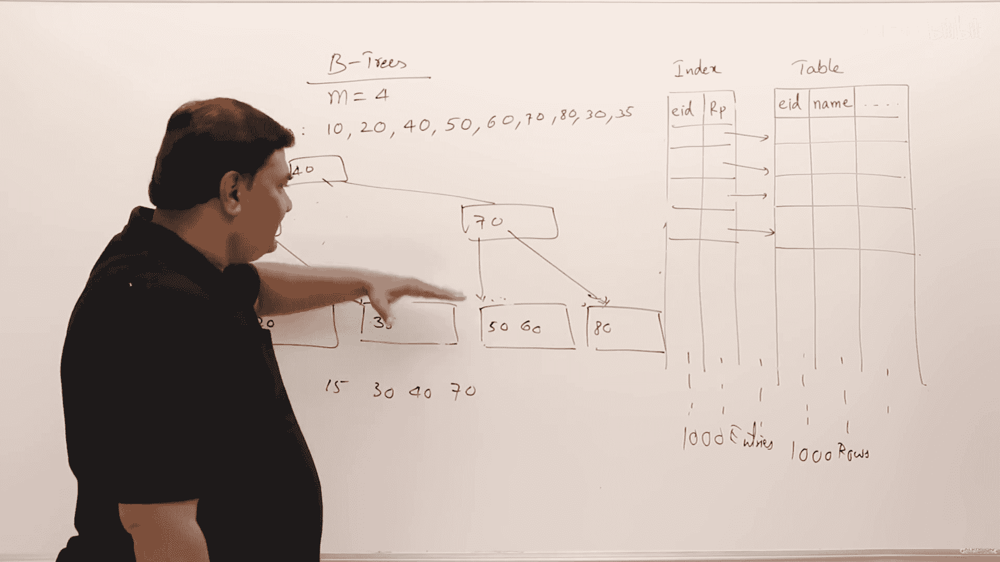

我没有展示删除。这取决于你从这个中学到了多少，你只需回复我，留下评论，如果需要，我也会准备删除的部分。

好的，实际上，我想向你展示B树和B+树的应用。所以我从索引开始我的主题，并带你走到这一点，以便你能理解与数据库和B树的关系。否则，大多数人只学习B树和B+树，而不了解索引和数据库。所以现在你可以将其与数据库联系起来。

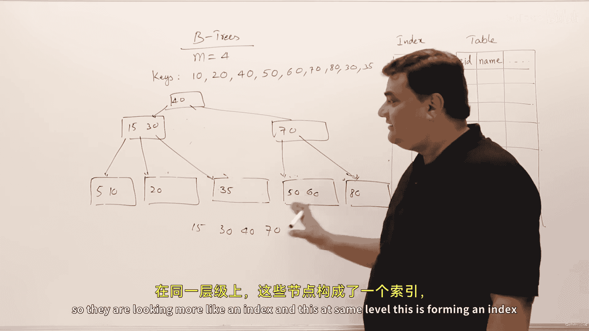

## B+树 🌲

现在最后一件事。什么是B+树？这是一个非常简单的事情，让我快速向你展示。我将修改这个。什么是B+树？在B+树中，我们不会从每个节点都有记录指针。我们只从叶节点有记录指针。只有叶节点我们有记录指针。那么这些键呢？每个键在叶节点中都会有一个副本。所以意味着这里谁缺失了？15这里缺失了。所以15也会在这里。20也会在这里。所以15也会在这里有一个副本。20也会在这里有一个副本。然后30这里也会有一个30的副本和35。那么40呢？40也会在这里有一个副本。所以40和50和60。所以三个记录指针。所以70也会出现在这个中。所以树中的每个键肯定都存在于叶节点中，并且这些叶节点像这样连接，像一个链表。

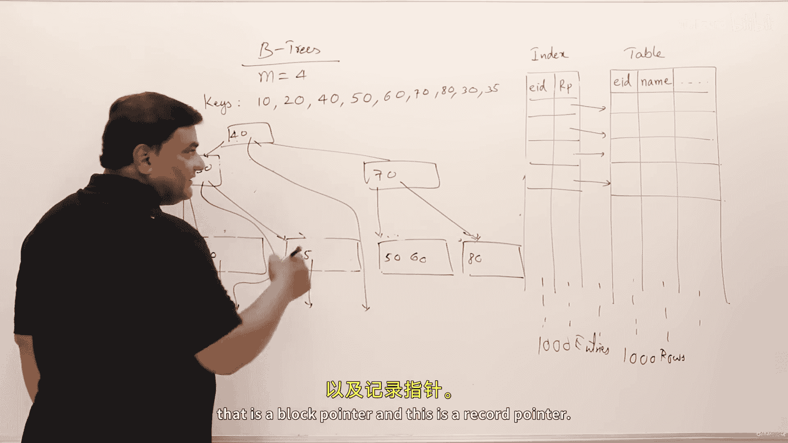

所以这变成了一个密集索引。现在，这完全像多级索引。所以这是B+树。

所以从B树到B+树的区别是什么，让我快速告诉你：所有的键都存在于叶节点中，在非叶节点中，可能存在它们的副本。

每个键必须存在于叶节点中，并且没有来自非叶节点的记录指针。记录指针将只来自叶节点。

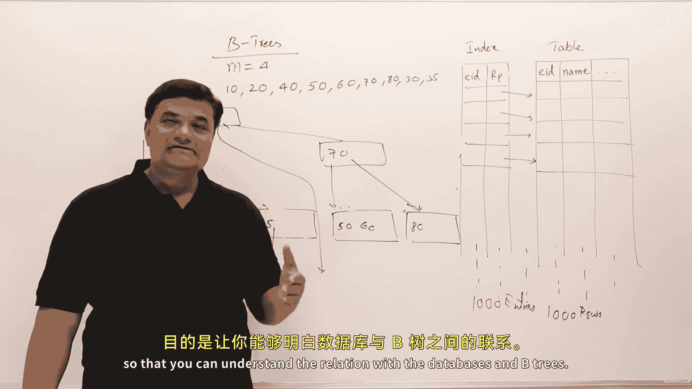

叶节点，所有叶节点都在同一层。它们将形成一个链表。这些是要点。然后这变成了一个密集索引。这变成了一个密集索引。然后这是一个稀疏索引，下一级是稀疏索引。所以与B树相比，B+树更像多级索引。

所以这个的“加”是什么，我已经向你展示了。所以如果你理解了B树，理解B+树并不困难。

## 总结 📝

本节课中，我们一起学习了B树和B+树。我们从磁盘结构和数据组织开始，了解了数据库表如何以块的形式存储在磁盘上，以及直接搜索的低效性。接着，我们引入了索引的概念，特别是密集索引，它通过存储键和记录指针来加速搜索。当索引本身变大时，我们引入了多级索引（稀疏索引）来进一步减少磁盘访问次数。

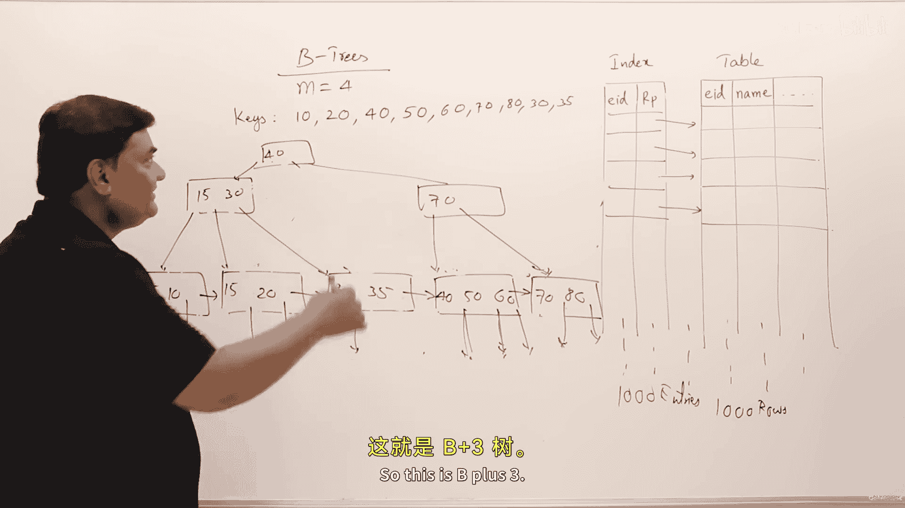

多级索引的自管理需求引出了M路搜索树的概念。我们回顾了二叉搜索树，并将其扩展到每个节点可拥有最多M个子节点和M-1个键的M路搜索树。然而，M路搜索树的创建缺乏控制，可能导致树过高，搜索效率低下。

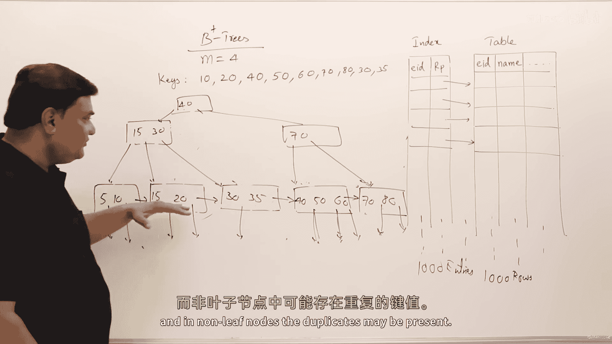

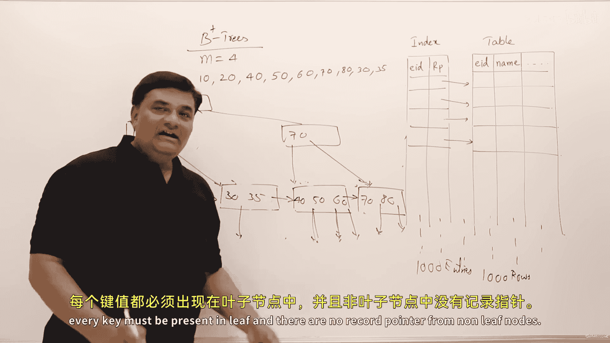

为了解决这个问题，我们引入了B树，它是对M路搜索树施加了三条规则的版本：
1.  除根节点外，每个节点必须至少有 `ceil(M/2)` 个子节点。
2.  所有叶节点必须位于同一层。
3.  树的生长是自底向上的，通过节点分裂来实现。

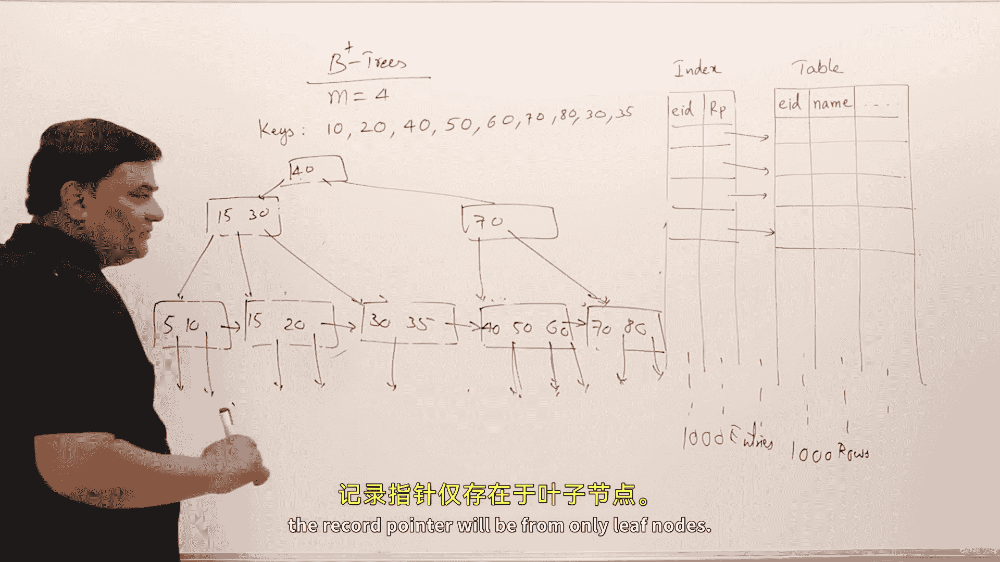

我们通过一个插入示例演示了B树的创建过程，并说明了其节点结构包含键、子节点指针和记录指针，非常适合实现数据库的多级索引。

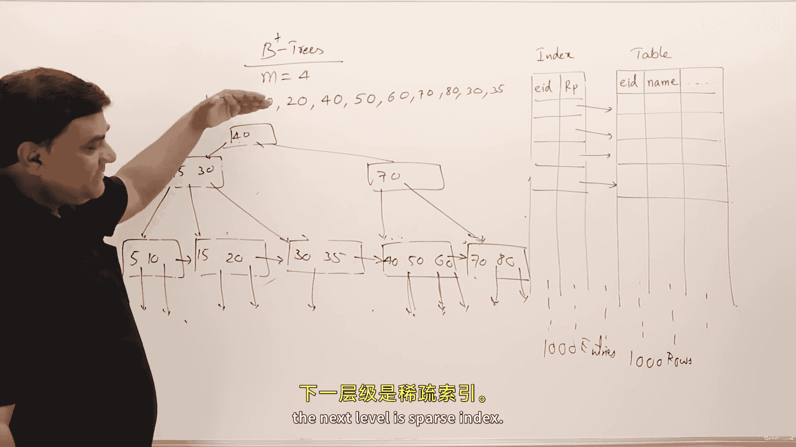

最后，我们介绍了B+树，它是B树的一种变体，主要区别在于：
*   所有键的副本都存在于叶节点中，并形成有序链表。
*   非叶节点仅包含键的副本用于路由，不包含记录指针。
*   记录指针仅存在于叶节点中。

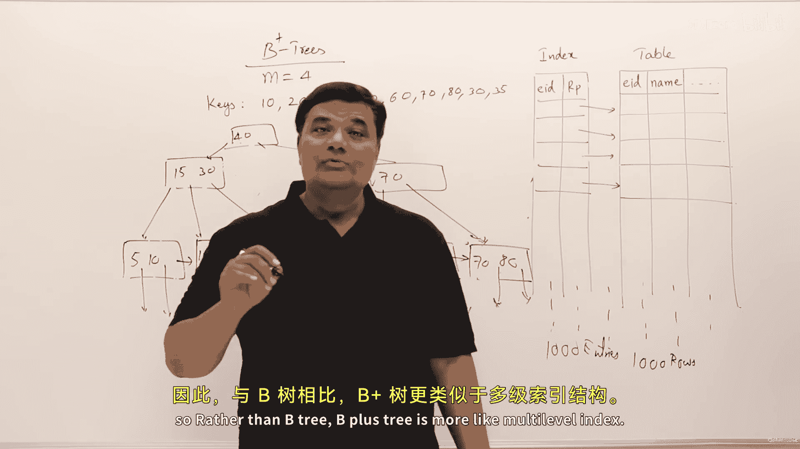

这使得B+树的叶节点层形成一个密集索引，而非叶节点层形成稀疏索引，更贴近于理想的多级索引结构，并且在范围查询等操作上更具优势。

通过本节课的学习，你应该能够理解B树和B+树不仅是重要的数据结构，更是数据库系统中实现高效索引的核心技术，它们的设计深刻地考虑了磁盘存储的特性（如块访问），以最小化I/O操作，提升数据库性能。