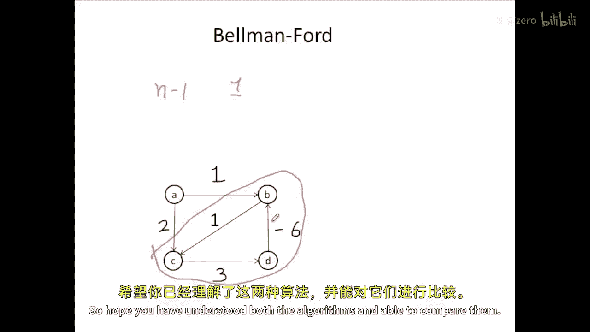

# 080：概述与问题定义 🗺️

在本节课中，我们将要学习两种重要的最短路径算法：**Dijkstra算法**和**Bellman-Ford算法**。最短路径问题是图论中的一个核心问题，目标是找到从一个指定的起点到图中所有其他顶点的最短路径。这些路径可能由单条边构成，也可能需要经过多个顶点。

---

## 最短路径算法：第2章：核心概念与松弛操作 ⚙️

上一节我们介绍了最短路径问题的基本定义，本节中我们来看看解决该问题的核心思想。

为了找到最短路径，我们需要一个关键的操作：**松弛**。松弛操作是检查并更新当前已知最短距离的过程。

假设我们有一个起点 `s`，对于图中的每个顶点 `v`，我们维护一个距离值 `dist[v]`，表示从 `s` 到 `v` 的当前已知最短距离。初始时，`dist[s] = 0`，对于其他所有顶点 `v`，`dist[v] = ∞`。

松弛操作针对图中的每一条边 `(u, v)` 进行，其权重为 `w`。操作如下：
**公式：** `if dist[u] + w < dist[v] then dist[v] = dist[u] + w`

这个操作的含义是：如果我们发现一条通过顶点 `u` 到达 `v` 的新路径，其总距离（`dist[u] + w`）比当前记录的 `dist[v]` 更短，那么我们就用这个更短的距离更新 `dist[v]`。

---

## 最短路径算法：第3章：Dijkstra算法详解 🎯

理解了松弛操作后，我们来看第一个算法：**Dijkstra算法**。该算法适用于所有边权重都为**非负值**的图。

Dijkstra算法采用**贪心策略**。它维护两个集合：已确定最短路径的顶点集合 `S` 和未确定的顶点集合。算法反复从未确定的集合中选取距离起点最近的顶点，将其加入 `S`，然后对其所有出边进行松弛操作。

以下是Dijkstra算法的步骤概述：

1.  初始化所有顶点的距离：起点为0，其他为无穷大（∞）。
2.  创建一个包含所有顶点的集合 `Q`。
3.  **当 `Q` 不为空时**：
    a. 从 `Q` 中取出距离值最小的顶点 `u`。
    b. 将 `u` 从 `Q` 中移除（意味着 `u` 的最短路径已确定）。
    c. 对于 `u` 的每个邻居顶点 `v`，进行松弛操作：如果 `dist[u] + weight(u, v) < dist[v]`，则更新 `dist[v]`。

让我们通过一个简单例子来理解这个过程。假设我们有下图，起点为 `P`：
（此处应有图，描述为：P到Q权重1，P到S权重6，P到E权重7；Q到R权重1，Q到S权重4；R到U权重1，R到S权重2；S到T权重3）

1.  初始化：`dist[P]=0`, `dist[Q]=1`, `dist[S]=6`, `dist[E]=7`, `dist[R]=∞`, `dist[U]=∞`, `dist[T]=∞`。
2.  选择最小距离顶点 `Q`（dist=1），松弛其边：
    *   `Q->R`: 1+1=2 < ∞，更新 `dist[R]=2`
    *   `Q->S`: 1+4=5 < 6，更新 `dist[S]=5`
3.  选择下一个最小距离顶点 `R`（dist=2），松弛其边：
    *   `R->U`: 2+1=3 < ∞，更新 `dist[U]=3`
    *   `R->S`: 2+2=4 < 5，更新 `dist[S]=4`
4.  继续此过程，依次选择 `U`(3), `S`(4), `E`(7), `T`(7)。最终得到从 `P` 到所有顶点的最短距离。

**时间复杂度分析：**
在最简单的实现中，每次需要遍历所有顶点来找到距离最小的那个，并对它的边进行松弛。对于有 `V` 个顶点的图，时间复杂度为 **O(V²)**。使用优先队列（如二叉堆）可以优化到 **O((V+E) log V)**，其中 `E` 是边数。

---

## 最短路径算法：第4章：负权边与Dijkstra的局限性 ⚠️

上一节我们介绍了Dijkstra算法，本节中我们来看看当图中存在**负权边**时会发生什么。

Dijkstra算法基于一个假设：一旦一个顶点被标记为“已确定”，从起点到它的最短距离就不会再被改变。这个假设在边权非负时成立，因为任何后续路径都会增加非负的权重，不可能更短。

然而，当存在负权边时，这个假设就被打破了。考虑下图：
（此处应有图，描述为：顶点1到4权重1，顶点4到3权重-6，顶点1到2权重2，顶点2到3权重3）

1.  起点为1，初始化：`dist[1]=0`, `dist[2]=2`, `dist[3]=∞`, `dist[4]=1`。
2.  选择最小距离顶点 `4`（dist=1），将其确定。根据Dijkstra，到顶点4的最短路径就是1。
3.  选择下一个最小距离顶点 `2`（dist=2），松弛 `2->3`：2+3=5，更新 `dist[3]=5`。
4.  选择下一个顶点 `3`（dist=5），松弛 `3->4`：5+(-6) = -1。这比当前 `dist[4]=1` 更短！

问题出现了：顶点 `4` 已经被“确定”并移出集合，但我们现在发现了一条更短的路径（1->2->3->4，总成本-1）。Dijkstra算法无法处理这种情况，因为它不会回头去更新已确定的顶点。因此，**Dijkstra算法不能用于包含负权边的图**。

---

## 最短路径算法：第5章：Bellman-Ford算法详解 🔄

由于Dijkstra算法无法处理负权边，我们需要一个更通用的算法：**Bellman-Ford算法**。该算法的核心思想是：**反复对所有边进行松弛操作，直到没有更新发生**。

与Dijkstra一次确定一个顶点不同，Bellman-Ford算法“暴力”地重复松弛过程。它不关心顶点被处理的顺序。

以下是Bellman-Ford算法的步骤：

1.  初始化：起点距离为0，其他所有顶点距离为∞。
2.  对图中的所有边，重复进行 **V-1 次**松弛操作（V是顶点数）。
3.  （可选）再额外进行一次全边松弛。如果这次还有距离被更新，则说明图中存在**负权环**。

为什么是 V-1 次？在一条没有环的最短路径上，最多包含 V-1 条边。经过 V-1 轮全局松弛，足以让最短路径信息从起点传播到任何可达的顶点。

让我们看一个包含负权边的例子：
（此处应有图，描述为：A到B权重1，A到C权重2，C到D权重3，D到B权重-6）

1.  初始化：`dist[A]=0`, `dist[B]=∞`, `dist[C]=∞`, `dist[D]=∞`。
2.  列出所有边：`(D,B,-6)`, `(C,D,3)`, `(A,C,2)`, `(A,B,1)`。
3.  进行第一轮松弛（按列表顺序）：
    *   `D->B`: ∞ -6 = ∞，无变化。
    *   `C->D`: ∞ +3 = ∞，无变化。
    *   `A->C`: 0+2=2 < ∞，更新 `dist[C]=2`。
    *   `A->B`: 0+1=1 < ∞，更新 `dist[B]=1`。
4.  进行第二轮松弛：
    *   `D->B`: ∞ -6 = ∞，无变化。
    *   `C->D`: 2+3=5 < ∞，更新 `dist[D]=5`。
    *   `A->C`, `A->B` 无变化。
5.  进行第三轮松弛（V-1=3次）：
    *   `D->B`: 5 + (-6) = -1 < 1，更新 `dist[B]=-1`。
    *   其他边无变化。
6.  最终得到正确的最短距离：A->B: -1, A->C: 2, A->D: 5。

**时间复杂度分析：**
算法需要进行 V-1 轮松弛，每轮需要遍历所有 E 条边。因此，时间复杂度为 **O(V * E)**。在稠密图（完全图）中，E ≈ V²，所以时间复杂度可达 **O(V³)**。

---

## 最短路径算法：第6章：负权环与算法总结 ⛔

上一节我们介绍了Bellman-Ford算法，本节中我们来看看它的局限性并总结两个算法。

Bellman-Ford算法能处理负权边，但它有一个无法逾越的障碍：**负权环**。负权环是指一个环上所有边的权重之和为负数。

为什么这是问题？因为如果存在一个从起点可达的负权环，你可以绕着这个环走无限多圈，每走一圈总路径成本就会减少，从而不存在“最短”路径（路径长度可以趋向负无穷）。

Bellman-Ford算法在完成 V-1 轮松弛后，如果再进行第 V 轮松弛，仍然有距离被更新，那么就可以断定图中存在负权环。**Bellman-Ford算法可以检测负权环，但无法给出包含负权环的图的最短路径**。

**算法对比总结：**

以下是两种算法的核心区别：

*   **适用条件**：
    *   Dijkstra：仅适用于**边权非负**的图。
    *   Bellman-Ford：适用于**所有图**（可含负权边），并能**检测负权环**。
*   **核心策略**：
    *   Dijkstra：**贪心算法**，每次处理当前距离最小的未确定顶点。
    *   Bellman-Ford：**动态规划思想**，反复对所有边进行松弛。
*   **时间复杂度**：
    *   Dijkstra（朴素）：O(V²)；使用优先队列：O((V+E) log V)。
    *   Bellman-Ford：O(V * E)。
*   **主要缺点**：
    *   Dijkstra：不能处理负权边。
    *   Bellman-Ford：时间效率通常低于Dijkstra；无法解决含负权环的图的最短路径问题。

---

本节课中我们一起学习了最短路径问题的两种经典解法：Dijkstra算法和Bellman-Ford算法。我们理解了松弛操作的核心作用，掌握了每个算法的步骤、原理、时间复杂度和各自的适用场景。记住关键点：**Dijkstra高效但怕负权边，Bellman-Ford通用但怕负权环**。在实际应用中，需要根据图的具体特性（边权是否可能为负）来选择合适的算法。