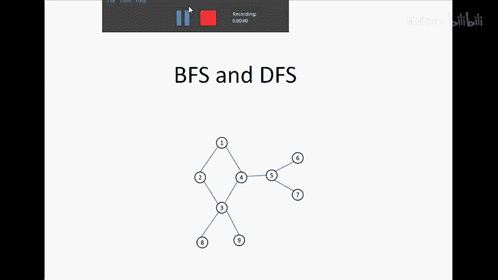
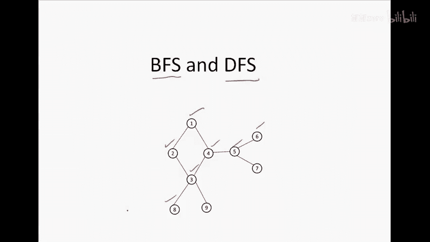
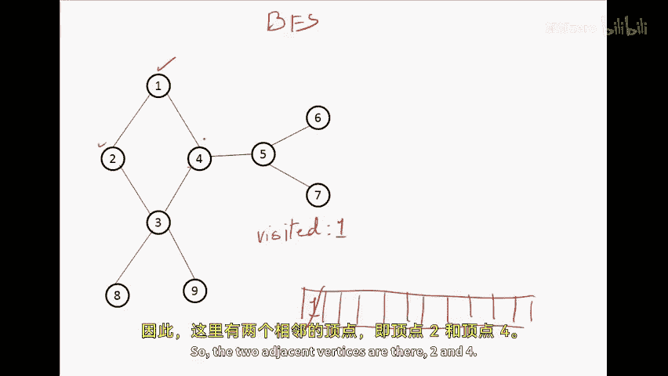
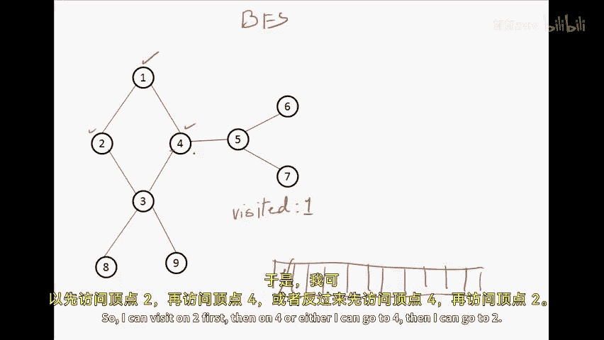
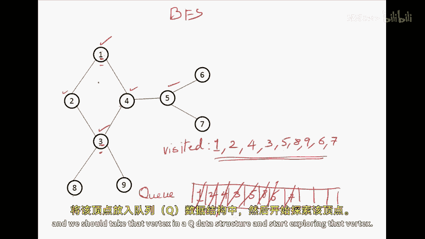
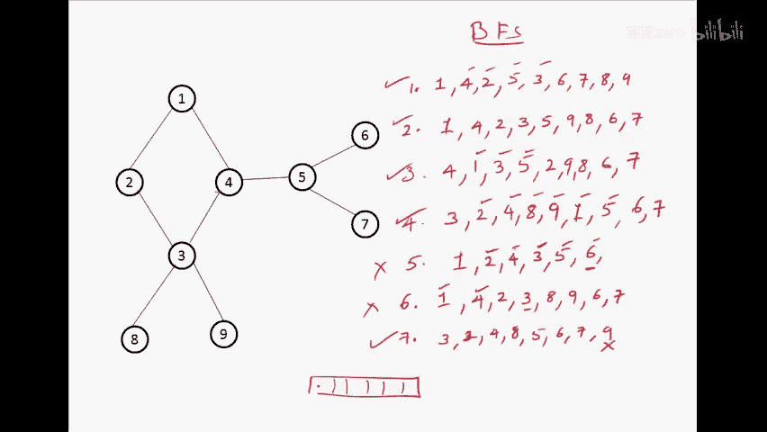
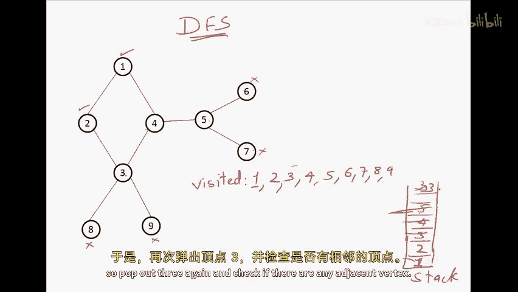
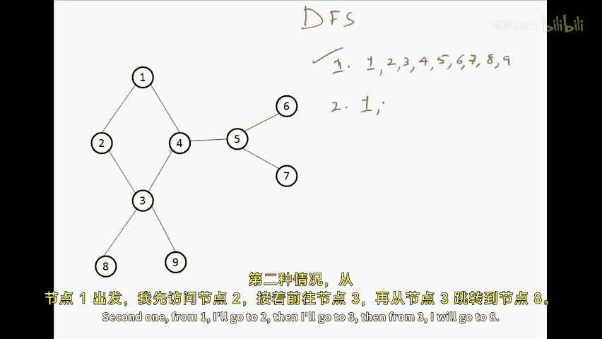
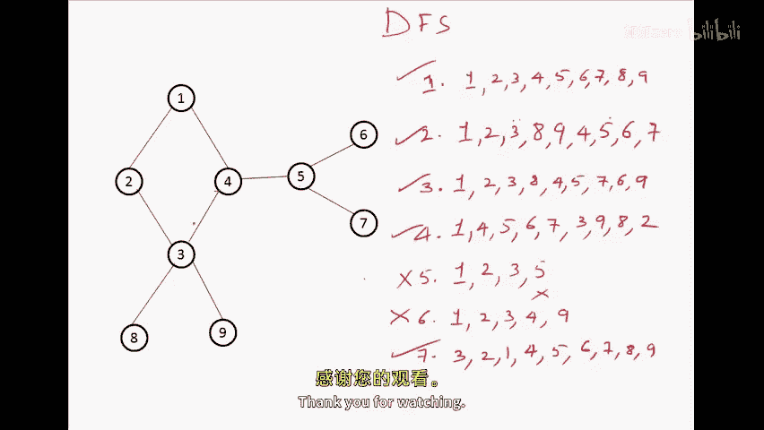

# 081：图的广度优先与深度优先搜索

在本节课中，我们将学习图的两种基本遍历方法：广度优先搜索和深度优先搜索。遍历意味着访问图中的所有顶点。我们将通过简单的例子和清晰的步骤来理解这两种方法的工作原理。

## 核心概念

在讨论遍历方法之前，需要明确两个术语：
*   **访问一个顶点**：意味着到达并处理该顶点。
*   **探索一个顶点**：意味着访问给定顶点的所有相邻顶点。例如，对于顶点4，其相邻顶点是1、3和5。探索顶点4就是去访问顶点1、3和5。

我们将使用这两个术语来研究广度优先搜索和深度优先搜索。

---

## 广度优先搜索

广度优先搜索按照“层次”的顺序访问顶点。它从一个起始顶点开始，先访问其所有相邻顶点，然后再访问这些相邻顶点的相邻顶点，依此类推。这个过程使用**队列**作为核心数据结构。

以下是BFS的工作流程：

1.  选择任意一个顶点作为起始顶点，访问它并将其放入队列。
2.  从队列前端取出一个顶点进行“探索”（即访问其所有未访问过的相邻顶点）。
3.  每访问一个新的相邻顶点，就将其放入队列末尾。
4.  重复步骤2和3，直到队列为空，这意味着所有可达顶点都已被访问。

让我们通过一个例子来演示。假设我们有下图（此处为逻辑描述，请参考视频中的图示）：
*   顶点1连接2和4。
*   顶点2连接1和3。
*   顶点3连接2、4、8、9。
*   顶点4连接1、3、5。
*   顶点5连接4、6、7。
*   顶点6连接5。
*   顶点7连接5。
*   顶点8连接3。
*   顶点9连接3。

从顶点1开始的BFS遍历顺序可能是：**1, 2, 4, 3, 5, 8, 9, 6, 7**。

**关键点**：
*   新访问的顶点总是加入**队列**。
*   下一个要探索的顶点总是从**队列前端**选取。
*   忽略已访问过的顶点，避免重复访问。
*   通过这种方式，BFS会生成图的一棵**广度优先搜索生成树**。

### 如何验证BFS序列

判断一个给定的顶点序列是否为有效的BFS结果，关键是检查它是否遵循“队列”的先进先出原则。例如，序列 `1, 4, 2, 3, 5, 8, 9, 6, 7` 是有效的，因为从队列中取顶点的顺序符合探索逻辑。而序列 `1, 2, 3, 4, 5, 6, 7, 8, 9` 可能是无效的，因为在探索顶点2之后，应该先探索顶点4（它与1相邻且已访问），然后才能探索顶点3的更深层邻居（如8、9），这个顺序违反了队列的规则。

---

上一节我们介绍了广度优先搜索，它像“层层推进”一样访问顶点。本节中我们来看看深度优先搜索，它的策略是“一条路走到黑，再回头”。

## 深度优先搜索

深度优先搜索会沿着一条路径尽可能深入地访问顶点，直到无法继续，然后回溯到上一个分叉点，选择另一条路径继续深入。这个过程使用**栈**（或递归）作为核心数据结构。

以下是DFS的工作流程：

1.  选择任意一个顶点作为起始顶点，访问它并将其放入栈。
2.  取出栈顶顶点进行“探索”。
3.  访问它的第一个未访问的相邻顶点，将这个新顶点放入栈，并立即暂停当前顶点的探索，转而开始探索这个新顶点（即“深入”）。
4.  重复步骤3，直到当前顶点没有未访问的相邻顶点（称为“死胡同”）。
5.  此时，从栈中弹出该顶点（回溯），回到上一个顶点，并继续探索该顶点剩下的未访问相邻顶点。
6.  重复步骤2-5，直到栈为空，这意味着所有可达顶点都已被访问。

使用同一个图，从顶点1开始的一个可能的DFS遍历顺序是：**1, 2, 3, 4, 5, 6, 7, 8, 9**。
*   路径可能是：1 -> 2 -> 3 -> 4 -> 5 -> 6 (回溯) -> 5 -> 7 (回溯) -> 5 -> 4 -> 3 -> 8 (回溯) -> 3 -> 9。

**关键点**：
*   新访问的顶点被压入**栈**，并立即成为新的当前探索顶点。
*   当一条路径走到尽头时，通过**弹出栈顶元素**进行回溯。
*   通过这种方式，DFS会生成图的一棵**深度优先搜索生成树**。

### 如何验证DFS序列

判断一个序列是否为有效的DFS结果，关键是检查它是否遵循“深度优先”和“回溯”的机制。一个有效的DFS序列中，当你访问一个新顶点时，接下来应该立即开始探索这个新顶点（即访问它的一个邻居），而不是回到之前某个顶点的其他邻居。例如，序列 `1, 2, 3, 8, 9, 4, 5, 6, 7` 是有效的。而序列 `1, 2, 3, 5, ...` 可能是无效的，因为从顶点3，你应该先去访问它的一个未访问邻居（如4、8、9），而不应该直接跳到并非其直接邻居的顶点5。

---

## 总结

本节课中我们一起学习了图的两种基础遍历算法：
*   **广度优先搜索**：使用**队列**数据结构，按照离起始点由近及远的顺序访问所有顶点。其核心模式是：`访问 -> 入队 -> 取队首探索`。
*   **深度优先搜索**：使用**栈**数据结构（或递归），沿着一条路径不断深入，直到尽头再回溯。其核心模式是：`访问 -> 压栈 -> 深入 -> 回溯弹栈`。

理解这两种方法对于解决许多图论问题至关重要，例如查找最短路径（BFS）、拓扑排序、检测环（DFS）等。通过练习识别有效的BFS/DFS序列，可以加深对它们核心机制的理解。