# 083：行优先与列优先映射 📚


在本节课中，我们将学习编译器如何将数组（无论是一维、二维还是三维）映射到内存中。我们将探讨行优先和列优先这两种主要的映射方式，并理解编译器如何生成访问数组元素的机器代码公式。

## 一维数组的地址计算

首先，我们来看一维数组。当我们在程序中声明一个数组时，例如 `int A[5]`，运行时会在内存中分配一块连续的空间。数组的起始地址称为**基地址**（Base Address），记作 **L₀**。

当我们在程序中访问数组元素，例如 `A[2] = 15` 时，编译器需要知道元素 `A[2]` 在内存中的确切地址。这个地址不是简单的数字2，而是通过一个公式计算出来的。

以下是计算一维数组元素地址的通用公式：

**地址(A[i]) = L₀ + i × w**

其中：
*   **L₀** 是数组的基地址。
*   **i** 是元素的索引。
*   **w** 是**字长**（Word Size），即数据类型的字节大小（例如，`int` 通常是2或4字节，`char` 是1字节）。

**示例**：假设 `L₀ = 100`，`w = 2`（整数大小），那么 `A[2]` 的地址就是 `100 + 2 × 2 = 104`。

### 不同起始索引的公式

在C语言之前，有些语言的数组索引可以从1开始。对于这种情况，地址计算公式需要调整：

**地址(A[i]) = L₀ + (i - 1) × w**

如果编译器允许索引从任意数字开始（例如 `A[-3..5]`），那么公式会变得更加通用：

**地址(A[i]) = L₀ + (i - 下界) × w**

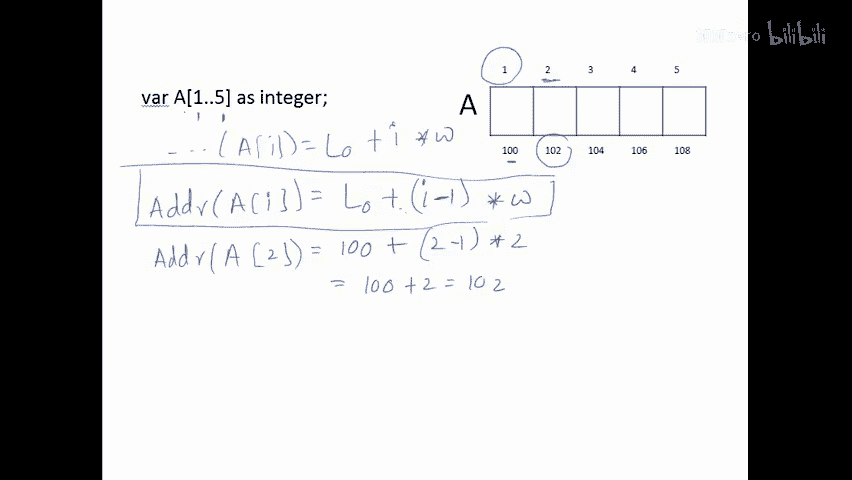

C语言及之后的大多数语言强制索引从0开始，就是为了消除公式中的减法操作，从而提高效率。

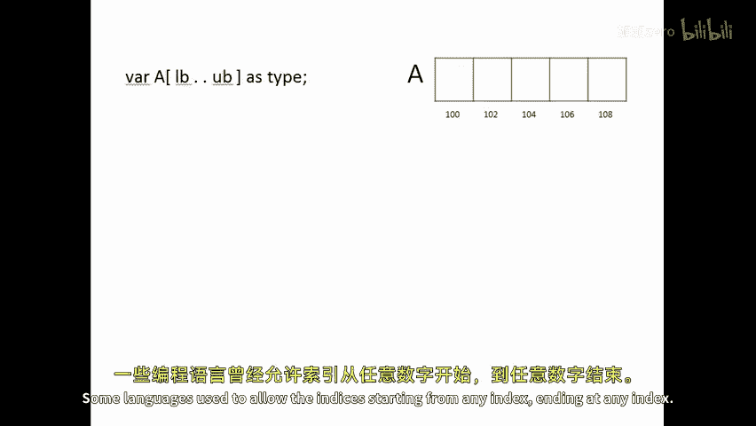

## 二维数组的内存布局

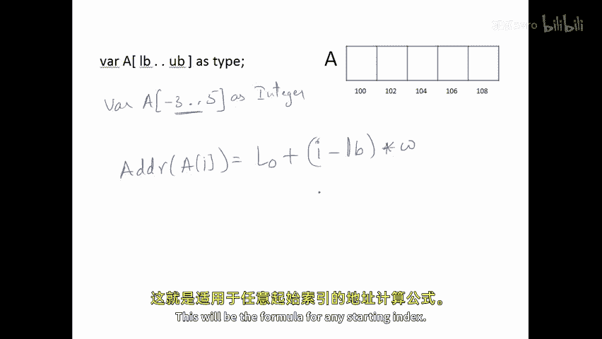

在内存中，所有数据都是线性存储的。因此，一个二维数组（例如 `int A[3][4]`）在物理内存中实际上被存储为一个一维的连续空间。

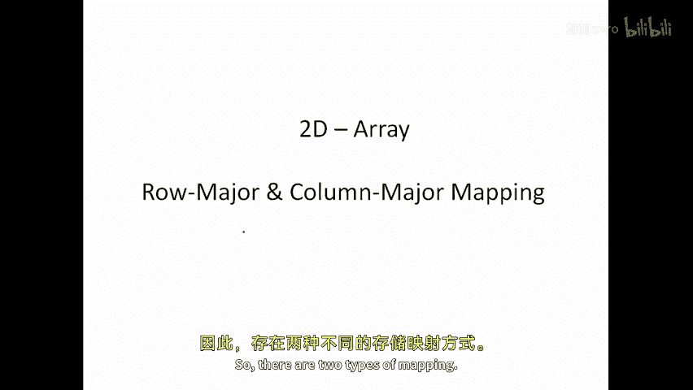

编译器为我们提供了以二维形式访问这个线性空间的接口。有两种主要方式将二维逻辑结构映射到一维物理内存：**行优先映射**和**列优先映射**。

## 行优先映射

在行优先映射中，数组元素按行存储。首先存储第一行的所有元素，接着是第二行，依此类推。

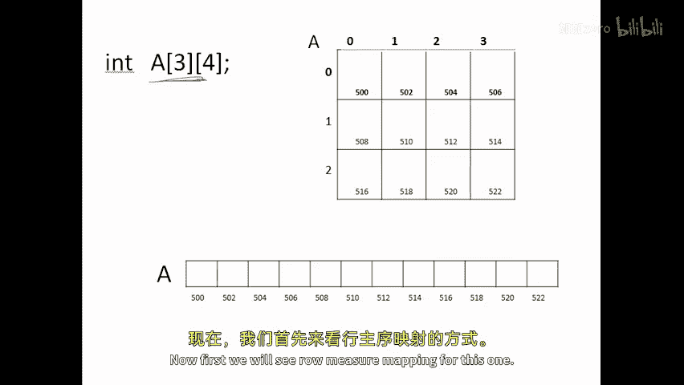

假设有一个 `3×4` 的数组 `A`，其行优先存储顺序如下：
```
A[0][0], A[0][1], A[0][2], A[0][3], A[1][0], A[1][1], A[1][2], A[1][3], A[2][0], A[2][1], A[2][2], A[2][3]
```

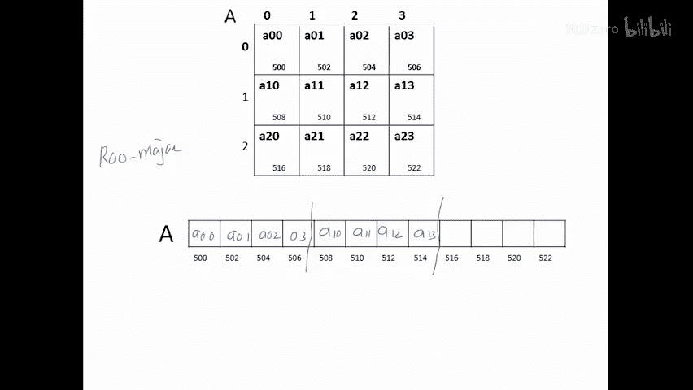

### 行优先地址计算公式

要访问元素 `A[i][j]`，编译器使用的公式是：

**地址(A[i][j]) = L₀ + (i × n + j) × w**

其中：
*   **L₀** 是基地址。
*   **i** 是行索引（从0开始）。
*   **j** 是列索引（从0开始）。
*   **n** 是数组的**列数**（即每行的元素个数）。
*   **w** 是字长。

**示例**：假设 `L₀ = 500`, `n = 4`, `w = 2`，计算 `A[2][1]` 的地址。
```
地址 = 500 + (2 × 4 + 1) × 2 = 500 + (8 + 1) × 2 = 500 + 18 = 518
```
公式 `(i × n)` 计算了跳过前 `i` 行所需跨越的元素总数，`+ j` 则是在当前行内再移动 `j` 个元素。

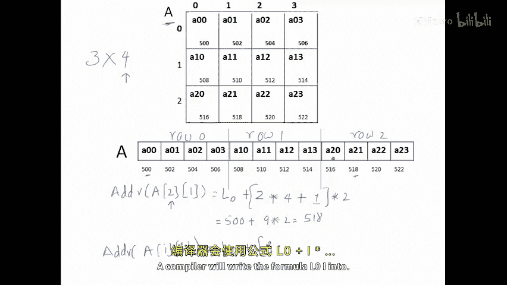

如果索引从1开始，公式则变为：
**地址(A[i][j]) = L₀ + [(i-1) × n + (j-1)] × w**

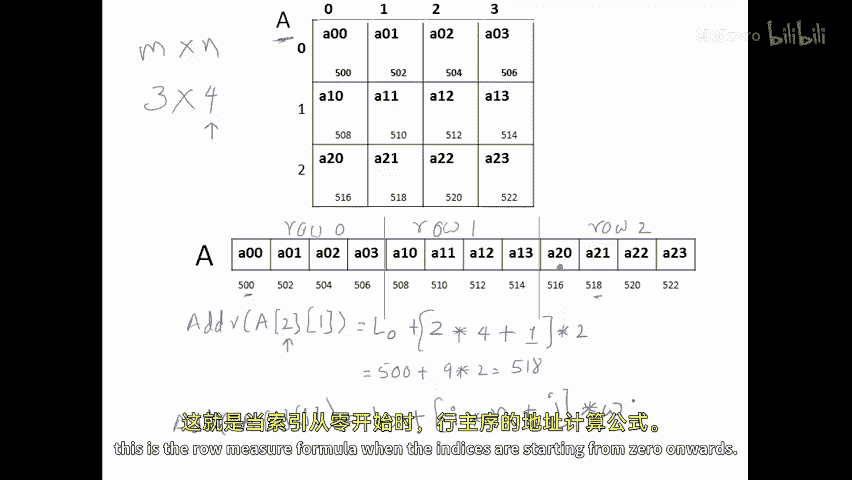

## 列优先映射

在列优先映射中，数组元素按列存储。首先存储第一列的所有元素，接着是第二列，依此类推。

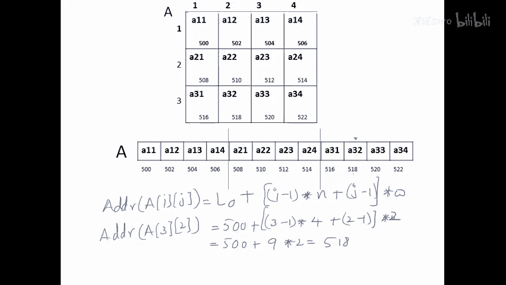

对于同一个 `3×4` 的数组 `A`，其列优先存储顺序如下：
```
A[0][0], A[1][0], A[2][0], A[0][1], A[1][1], A[2][1], A[0][2], A[1][2], A[2][2], A[0][3], A[1][3], A[2][3]
```

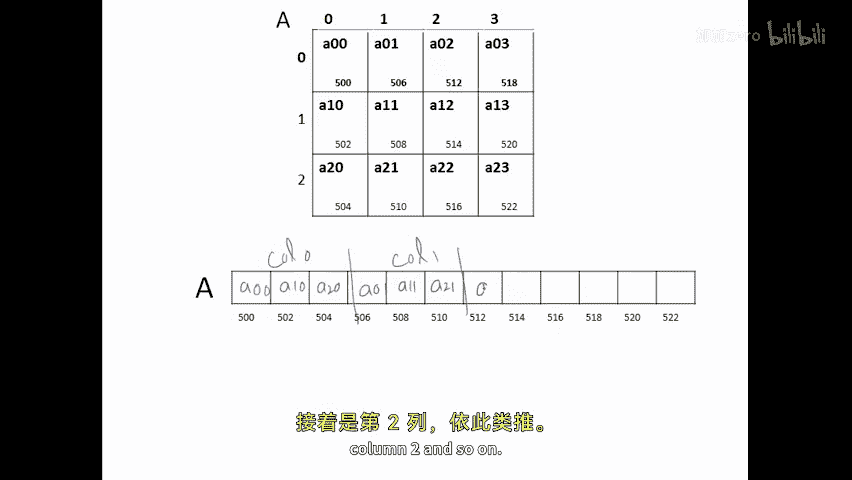

### 列优先地址计算公式

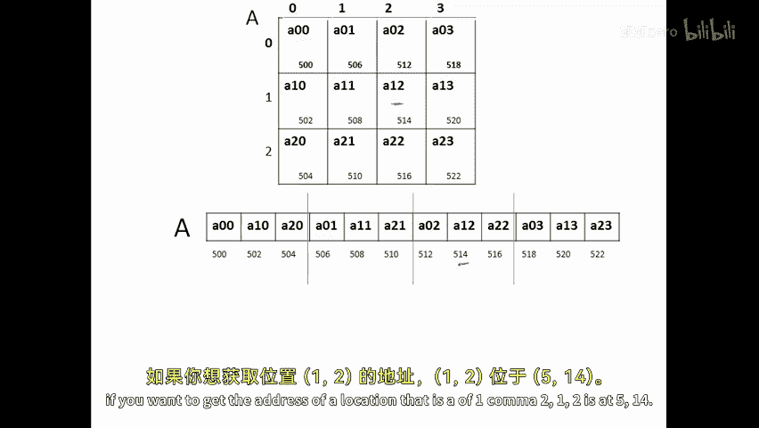

要访问元素 `A[i][j]`，编译器使用的公式是：

**地址(A[i][j]) = L₀ + (j × m + i) × w**

其中：
*   **L₀** 是基地址。
*   **j** 是列索引（从0开始）。
*   **i** 是行索引（从0开始）。
*   **m** 是数组的**行数**（即每列的元素个数）。
*   **w** 是字长。

**示例**：假设 `L₀ = 500`, `m = 3`, `w = 2`，计算 `A[1][2]` 的地址。
```
地址 = 500 + (2 × 3 + 1) × 2 = 500 + (6 + 1) × 2 = 500 + 14 = 514
```
公式 `(j × m)` 计算了跳过前 `j` 列所需跨越的元素总数，`+ i` 则是在当前列内再移动 `i` 个元素。

如果索引从1开始，公式则变为：
**地址(A[i][j]) = L₀ + [(j-1) × m + (i-1)] × w**

## 总结与比较

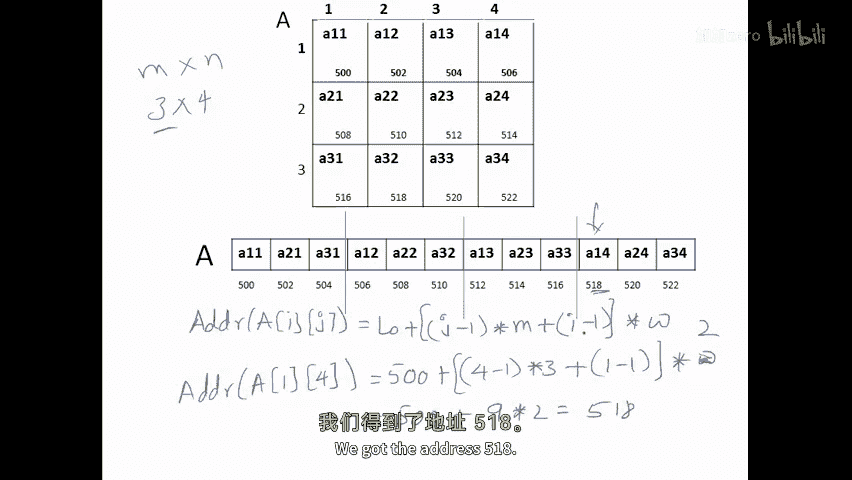

本节课我们一起学习了数组在内存中的映射方式。

*   对于**一维数组**，地址计算公式为 `L₀ + i × w`。索引从0开始可以优化计算效率。
*   对于**二维数组**，有两种映射方式：
    *   **行优先映射**：公式为 `L₀ + (i × n + j) × w`。元素按行存储。
    *   **列优先映射**：公式为 `L₀ + (j × m + i) × w`。元素按列存储。

从计算复杂度看，两种映射方式的公式都包含两次乘法和两次加法，效率是相等的。因此，设计编译器或新语言时可以选择任意一种。在C语言及其家族语言（如C++、Java、C#）中，默认采用的是**行优先映射**。

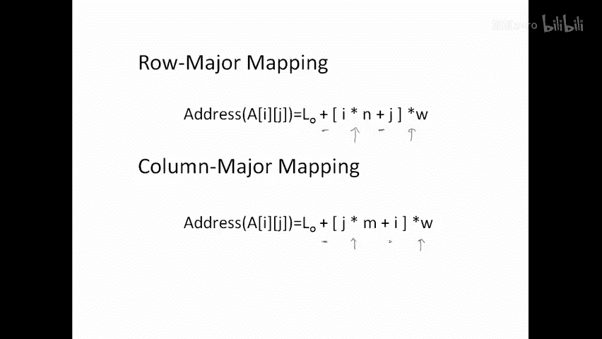

理解这些底层映射原理，有助于我们更好地理解程序的内存访问模式，并在某些情况下优化代码性能。