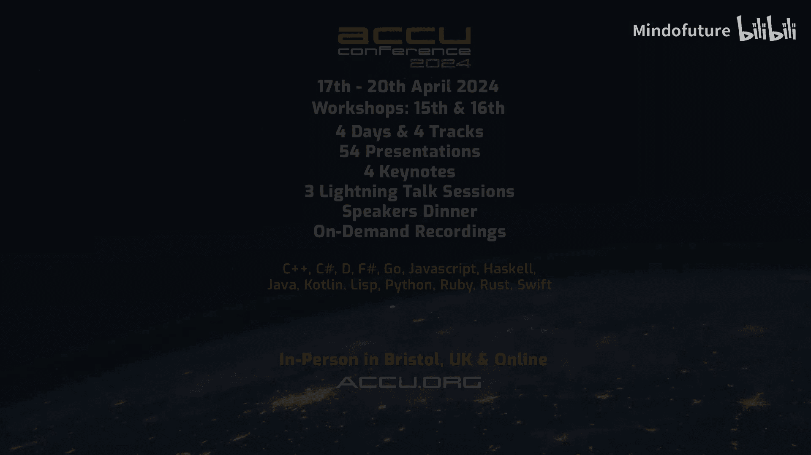

# 001：与 Björn Fahller 的访谈

在本节课中，我们将跟随 Kevin Carpenter 与资深开发者 Björn Fahller 的对话，了解 ACCU 2024 大会的亮点、Björn 的编程生涯以及他对团队协作的思考。我们将学习到一位 C++ 专家的成长路径、对多语言编程的看法，以及即将到来的主题演讲的核心思想。

---

早上好，晚上好。因为 Björn 在瑞典，而我在亚利桑那州，所以问候大家早晚安。欢迎各位，我是 Kevin Carpenter，算是一名职业志愿者。今天早上我们将与 Björn 聊聊 ACCU 大会和他的压轴主题演讲。Björn，欢迎你，你那边晚上过得怎么样？

非常感谢邀请我。我很好。我正在享受复活节假期，所以很棒。

这很有趣，因为开始前我问过，我知道你那边背景里有雪，而今天我这里的气温……我不太擅长华氏度转摄氏度，但凤凰城今天大约有 68 华氏度。我提到世界两端是为了引入话题，总之，很高兴和你聊天。

Björn，我想我们第一次见面是在 CppCon 的某张桌子旁。

是的，我想那是正确的。我们是在 CppCon 认识的。

对所有人来说，这是我第一次参加 ACCU 大会，所以我非常兴奋。但我从 2018 年开始在 CppCon 做志愿者，而你的第一次演讲是在 2017 年的 ACCU。

也许我不该查这个，但听起来合理，可能是对的。我想那次是关于你的模拟库，它叫什么名字？我可能发音不准，因为我不太说法语，是 “trompe l’oeil”。

好的，它的字面意思是“欺骗眼睛”，所以这是一种艺术形式，即创造一种让你相信它是别的东西的假象。我认为这对于一个模拟框架来说是个合适的名字。

确实，我不得不笑，因为我记得看到过这个名字，但我不想尝试发音，所以谢谢你帮我念出来。这很酷，你现在还积极维护它吗？我在日常工作中用得不多。

是的，我还在维护它。现在工作量不大了，因为它已经成熟了，只是偶尔有些更新。实际上，它的十周年纪念日快到了，我查看了 Git 仓库，第一次提交是在 2014 年 10 月。十周年纪念日即将到来。

恭喜，这真的很酷。我都没有那么老的项目。

那么，是什么让你进入计算机领域的？

我成长于 80 年代。是的，Commodore、Sinclair，我们还有一些没人知道的瑞典机器。我不知道，我的大多数朋友拿到它们只是为了玩游戏。我也玩过一些游戏，但主要是觉得让机器为我做事非常有趣。这很有趣。

这很有趣，因为我在想我刚开始的时候……你提到了 Commodore 64，我们学过一些汇编语言，当然还有 BASIC，但我最早接触的是 Turbo Pascal 和 CP/M 机器，后来是 Turbo C。这很有趣，因为我为了我们在 Meeting C++ 上的演讲，还特意打开了 Turbo C。我不怀念那个界面。

在我们都从事这行这么久之后，你已经在现在的公司工作了相当长一段时间，对吗？

是的，首先我得说，你提到 Turbo Pascal 和 CP/M 很有趣，你是我认识的除了我自己之外唯一用过它的人。哈哈，是的。

我讨厌这个问题，因为它有点奇怪。是的，我在 Net Insight 工作，正如你提到的，已经有一段时间了。我最初是在 1998 年春天加入的，所以那是很久以前了。但我实际上离开过公司两次，去做了别的事情，然后又决定回来。

我是在 LinkedIn 上看到你的信息才问的。我想引导到的另一个部分是，考虑到 Net Insight 的业务，你写的代码可能经常需要处理各种高延迟环境下的性能问题。或者你能谈谈你具体做什么工作吗？

我几乎参与了 Net Insight 研发部门的所有工作。我们制造自己的数据传输硬件，并且大部分处理都在 FPGA 上完成。所以大部分软件实际上只是用来配置 FPGA 开始工作。因此，大多数代码在带宽方面并不是性能关键的，尽管在某些事件的响应时间上可能是。但是，确实有一些情况性能至关重要，而且我们的一个产品系列是关于软件视频流的，我参与过这方面的工作，在那里，考虑内存布局以提高缓存效率等就超级重要了。所以这取决于你做什么。

是的，没错。我工作的领域是交易性的，信用卡处理，所以我只需要在刷卡的那个瞬间快速响应。但当每小时处理超过 10 万笔交易时，规模就成了问题。不过有趣的是，有些性能关键的代码理想情况下永远不应该运行，因为它是用来处理灾难性事件的，你需要迅速反应，但灾难性事件当然不应该发生。所以所有常规的性能调优建议都不适用了。

确实如此。然后它就成了你最需要高性能的代码，因为如果你做对了，它就永远不会发生，对吧？但它可能发生，因为完全超出你控制的事情，比如有人用挖掘机切断了光纤，你必须对此做出反应。

哦，天哪。这和我处理信用卡的层面不同，信用卡失败我会回复，有人可能会难过一天，但只需要快速处理。我们这边有其他人负责处理网络，如果他们挖断了电缆。

那么，说说 ACCU。我提起 Pascal 这些东西是因为我认为 ACCU 的不同之处在于……再次说明，我是在 CppCon 开始做志愿者的，之前没听说过 ACCU，毕竟我在世界的这一边。但 ACCU 已经举办很久了，我知道这个会议的历史肯定比 YouTube 早。你还记得你第一次去 ACCU 是什么时候吗？

我记得，但那不是很久以前。它当时还在牛津的老场地。现在它在布里斯托尔，已经好几年了。那是我第一次去，我恳求我的经理允许我去参加一个会议，我去了，被那么多事情淹没了。但之后隔了几年我才又能去，然后说，哦，看，Sean 也在那里。好吧，但我不太确定我是什么时候在那里的。只是谈谈这个机构，ACCU 会议一定是这样的，因为我可以告诉你，我去过 Defcon，我从 Defcon 7 开始去的，我最后一次去 Defcon 大概是 Defcon 13。所以看到会议如何塑造了我们的一些聚会很有趣，Defcon 当然是关于安全的，但 ACCU 如何塑造了它。我认为 ACCU 对我来说至少独特的一点是，我想说是语言无关的，但它不是只关于 C++ 的会议。

确实，这是 ACCU 我非常喜欢的一点。可以说，在所有我去过的会议中，我最喜欢的两个是 ACCU 和 NDC TechTown，它们的共同点是它们都不是语言特定的。它们往往有很多关于 C++ 及相邻问题领域的焦点，但它们不是关于那些语言的。所以你可以去听关于组织文化、如何用好 Git，或者关于 Python 的演讲。

这对我来说很有趣，因为就像我在目前公司有段时间连续一年写 C++，但现在我实际上在做 C++，同时我有个项目完全用 Go，除此之外，帮助会议志愿者的项目现在用 Python，我以前从没做过 Python。我在上次演讲中开玩笑说我不太确定这个 `self` 东西，但学习它很有趣，多亏了 Python，午餐订购问题解决了。

那么，除了 C++，你还有其他喜欢的语言吗？我很惭愧地说，C++ 真的是我唯一感到舒适的语言，因为这是我工作了很长时间的语言。所以我认为可以公平地说，我相当了解它，尽管它是一种相当奇特且难以完全掌握的语言。我 Python 足够好，可以完成工作，但不算精通。目前，我实际上正在一头扎进 TypeScript，我完全不懂，所以这会非常有趣。你在语言之间发现了很多可以互相学习的地方吗？比如开始学习 TypeScript 后，有没有学到什么让你觉得“我在 C++ 里不知道这个”的东西？

还没有。我问这个是因为 Go 语言，感觉很多东西都以元组形式返回，因为 Go 里很多函数会返回一个值和一个错误，或者其他值。这很有趣，因为我以前在 C++ 里不怎么用元组作为返回值，然后在 Go 里待了六个月，现在我开始用返回元组了。

你的主题演讲将为我们闭幕会议，这很酷。是的，我总是对做演讲感到紧张，所以当我做完演讲，我才能放松下来开始享受会议，但这在闭幕演讲那天不太行得通。哈哈。

学习、教学就是分享，我开玩笑地补充说这就是 Karma。你能给我们透露一些你主题演讲的亮点吗？

好的。标题是“如何共同改进”，我试图探讨我们如何与同事一起，作为一个团队或一个研发部门，改进工作方式。我认为其中一个关键是信息共享。你需要有想法和……尴尬经历的自由流动，因为我们都会犯错，当然，除了那些什么都不做的人，他们不会犯错。分享不好的信息对你来说很重要。但我也将用一个我目前不在其中工作的环境作为类比，那是一个……致命的、字面意义上致命的文化，因为那种文化真的导致了人员死亡。我还会用一个非常奇怪的例子，我将展示一点关于如何操作第一次世界大战战斗机引擎管理的知识。

好的。我开始感觉到……我看过你做的一个闪电演讲，我觉得很棒，因为我在凤凰城外，我非常喜欢它，这是我最喜欢的你做的演讲之一。我认为从 C++ 的角度来看也很有趣，因为深入一门语言的好处就是，你关于 C++ 的演讲总是让我学到新东西，所以我感谢你在所有演讲上投入的时间。我会很期待看到你在 ACCU 的闭幕主题演讲。但我确实为你感到有点紧张。

是的，我也思考了很多我想谈什么，因为对我来说，做主题演讲时一个意想不到的、有点奇怪的事情是，会议组织者说“嘿，你想做个主题演讲吗？”，然后你说“好的，我可以”，然后……就完了，得由我自己找话题。既然我们几分钟前谈到 ACCU 不是语言特定的，而且我几乎所有的演讲都非常技术性，我不想做一个 C++ 主题演讲，因为主题演讲是面向整个会议的。在其他分论坛，人们可以根据兴趣选择是否去听你的演讲，但主题演讲是面向所有与会者的，我不想只针对一部分听众，而忽略其他人，那感觉不公平。所以我想这就是为什么我经过思考后，决定分享一些关于我认为团队协作中哪些有效、哪些不那么有效的经验。

这很酷，也很有趣，因为……我喜欢用“有趣”这个词。当我做这些采访时，我觉得自己是个不错的开发者，我喜欢我的工作，但我总是喜欢做采访，因为这样我能更多地了解，尤其是与演讲者或培训师，了解他们生活中的那部分、个人部分。如果你想看一个具体介绍为什么应该使用某个 C++ 特性的视频，通常演讲就是关于这个的。我喜欢了解你从哪里开始编码，你第一次去 ACCU 是什么时候，因为这些部分……我希望人们来 ACCU 并享受它。这是一个很棒的会议。但我想让人们也感受到这部分。我有点跑题了，但我们有太多语言特定的东西了，所以把我们作为开发者的人性展现出来真的很好，我不知道我们是否经常展现这一点。Kate Gregory 在这方面做得很多，她做过一些非常好的相关演讲。

我必须大声感谢 Kate，因为她是我开始参加 CppCon 的原因，她说我需要去。我的第一次闪电演讲也是因为她，我们当时一起工作，她说“嘿，这里有个 bug，你得做个闪电演讲讲讲它”。我有几年没见到 Kate 了，今年需要见见。

是的，我去年去了 C++ on Sea，强烈推荐。但现在我们还在谈 ACCU。它于 4 月 15 日星期一开始，有会前课程，我知道 Matus 和 Nikco 在授课，Kate 实际上也在教两门课，所有这些都……我很兴奋，因为我喜欢看他的演讲。然后主会议在 17 日开始，一直持续到你的闭幕演讲。

你期待去那里吗？是的，绝对期待。这总是一个很棒的会议，有那么多有趣的演讲和那么多有趣的人。正如你所说，我去过 ACCU 很多次了。当你多次回到同一个会议，并且其他人也多次回到同一个会议时，会发生什么？我有一些可以算是“A 级朋友”的人，我只在那里见到他们，我期待着见到他们。

是的，我完全理解，因为在我做志愿者的会议上也是如此，这绝对是我们得以见面、叙旧、闲逛、聊点工作但更多聊生活的地方。所以，说到聊生活，感谢你今天早上抽出时间，希望你享受剩下的假期。

谢谢你，很荣幸来到这里。哦，绝对一样，我想我们不到三周后见。是的，想想有点吓人，我还没做完我的幻灯片呢。等等，那会……就像你说的，周一你可能还在赶工。这不是容易的部分，我得说。在 Meeting C++，我五年来的第一次演讲就被安排在了……Bjarne 的演讲之后，但这至少是第二次……第一次演讲就在 Bjarne 之后很吓人，因为就在 Bjarne 之后，但不管怎样，它总会被完成。我想我睡过了下一场，因为所有精力都用完了。哦，是的，就是这样。是的，演讲后的大脑不工作了。是的，它不工作了。

非常感谢，祝你下午/晚上愉快。会议上见。会议上见。

---

本节课中，我们一起学习了 ACCU 2024 大会的概况，了解了演讲者 Björn Fahller 的编程背景、他对 C++ 及其他语言的看法，以及他即将发表的关于团队协作与信息共享的主题演讲核心内容。我们看到了技术社区中个人成长与经验分享的重要性。