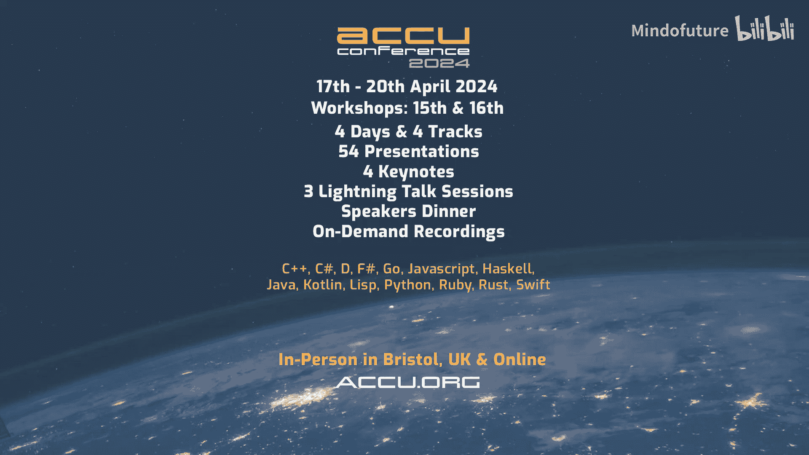

# 003：ACCU 2024会议前瞻 - 与Mike Shah的对话

## 概述
在本教程中，我们将跟随Kevin Carpenter与Mike Shah教授的对话，了解即将到来的ACCU 2024会议、现代C++教学理念、不同编程语言的比较以及软件开发的迭代本质。我们将学习如何通过图形化方式教授C++、性能的重要性，以及学习新语言如何改变我们的编程思维。

## 会议介绍与教学理念

欢迎各位，我是Kevin Carpenter。我是一名专业志愿者，因为我已为众多会议提供志愿服务。今天和我在一起的是Shaw教授。我记得是在你的YouTube频道上看到你的，Mike Shaw拥有自己的YouTube频道，订阅者超过16000人。我的视频只是为会议发布的。我们今天在这里讨论将于4月17日开始、持续到20日的ACCU 2024会议。会议有一些很棒的会前课程，我们稍后会讨论。Mike，欢迎你。

谢谢你，Kevin。我也很期待ACCU，期待我们的对话，很高兴来到这里。

说实话，我今早还在想。我不记得我们第一次见面是什么时候了，Mike，我只是感觉认识你很久了。是在CPP con还是Core C++大会？我想是Core C++。你今年没去Meeting C++大会？是的，去年没去，但以前去过。我想已经有好几年了，我们共同经历了几次冒险，所以和你交谈总是很棒。

是的，绝对如此。

那么，ACCU会议。我知道你去年也在那里，并且做了一个关于教授C++的演讲。Shaw教授，这算是你的主要工作，对吧？请谈谈这个，谈谈C++教学和你的主要工作。

是的，我在ACCU做了一个关于如何教授现代C++的演讲，名为“一次一个像素地教授现代C++”。这实际上是借鉴了Kate Gregory多年前在会议上的一次演讲，关于她如何教授C++。我基本上是从Kate这位出色的演讲者、程序员、培训师那里“偷”了许多技巧，并将它们融入我多年的课程中。通过加入图形元素，让C++编程变得真正有趣，学生们能理解他们所做事情的目的，我们使用C++提供的工具和抽象，保持他们的积极性，让C++编程变得有趣，并看到这门语言的力量。

这让我想起了Logo编程语言。我猜这比你开始教学时要早得多？是的，确实如此。我最初是从基础编程和Logo开始的。有趣的是，在我的演讲中，有人提出了关于如何将编程与Logo和图形学联系起来的问題。

好的，我喜欢从图形角度使用C++的想法。我的意思是，即使是今年的CPPcon大会，他们也将有一个大型游戏开发专题，我认为这真的很酷。说真的，可能没有一款游戏不……我知道有很多游戏不是用C++，但你明白我的意思。当涉及到性能时，我想我在你的一篇视频中读到，即使是像2D卷轴游戏这样的东西，从节省手机电池的角度来看，你最近做的关于轻量级模式的视频也提到了这一点。是的，就是那个。这是一个很好的观点，你在节省电池。无论如何，你仍然在处理有限的资源，虽然不像Z80的28K内存那么紧张。

没错。有一句很棒的名言，我第一次在2019年ACCU会议上做演讲时引用了，是关于性能和缓存无关算法的深入探讨。但其中一句名言来自Charles Leiserson教授，他是一位比我睿智得多的教授，他给出了这样的金句：**性能是一种货币**。所以，即使你不需要它，即使是一个简单的2D卷轴游戏，你也能获得更长的电池寿命、更流畅的体验，也许代码更正确，因为你没有走捷径。所以这总是值得思考的，这也是C++的一个优点，对吧？在性能方面没有任何限制，无论好坏。

确实如此。这很有趣，因为想到Kate Gregory，我第一次和她合作时，她正在帮助我当时的公司做承包商。她经常对我说的一句话是“能运行就是一个特性”，因为我写了一些东西，我会说“嗯，它能运行”，她就会说“是的，能运行就是一个特性”。即使在性能方面，你发现你写的代码有多少是迭代式的？你完成了那部分，然后你不断地改进它。你的经验也是如此吗？我认为随着我们经验的增长，你可以跳跃一两个层次，但一开始不总是这样吗？

我想至少在我的开发过程中，总是如此。也许我们有点偏见，你看像我这样的人做YouTube视频，因为我对一个问题思考了很长时间，足够让我舒服地录制并公开分享。但开发是如此迭代。我的意思是，很多时候，比如我需要一个排序算法，你直接去标准库里找，甚至有时我只是快速写一个暴力排序，因为我想看到它工作。但我们知道那性能不好。是的，开发是如此迭代，理解你为什么做某事的原因非常重要。我认为随着你在特定领域获得更多开发经验，情况会改变。因为即使领域变了，你为性能和架构代码所使用的技巧也会变，然后你转到其他东西，可能完全不同。这很有趣。

确实如此。因为我们刚举办了CPP在线会议，我 unfortunately 没看到你的演讲，因为我们的时间冲突了。是的，没错。我做完演讲后……我从未做过完全在线的演讲，所以我必须说，我比做其他任何事情都更紧张做完全在线的演讲。

抱歉，我不知道我刚才说到哪里了。但就像你准备演讲时，那和你平时解决问题是不同的。对于CPP在线会议，我的演讲是关于我们使用工具时的直觉。这是我第二次做这个演讲，第一次是在Meeting C++。但这次期间，我开始学习一点Python。我以前从未写过Python。我回顾了Basic、Turbo Pascal、PHP、Perl。我在演讲中开玩笑说，我仍然不太擅长`self`。但关键是，我感觉自己像个新手。当我谈论直觉时，演讲中有一部分提到，我做C++有一段时间了，所以当我第二次讲这个演讲时，我花时间学习了一套新工具、新布局，缩进实际上很重要，这带来了不同的感受。相比我用C++写代码，这是一种更迭代的方法。

100%同意。就像你说的，学习一门新语言是我鼓励每个人都做的事情，因为它会改变你的思维方式。正如你提到的，在Python或其他语言中，高效做事的方式可能非常不同。

## 教育、会议与职业发展

对于ACCU，我想问这个，因为Gail Ollis正在举办一个为期一天的早期职业日活动，针对初级开发者，在4月16日星期二。作为一名教师，你认为这对于……即使是学习一门新语言，即使我拥有关于算法如何工作的所有知识，我从一开始就感觉很原始。所以像Gail的会前研讨会这样的会议，对于学生，你认为怎么样？

非常棒，非常棒。如果学生能去，无论是作为会议志愿者还是刚刚开始职业生涯，这都非常棒。我能稍微谈谈Gail，因为我认识她，她非常友好，我在ACCU会议上见过她，也听过她的CppCast采访。所以了解她的一些背景，理解软件心理学——她曾作为一名经验丰富的软件工程师工作多年，然后回去研究我们如何构建软件、团队如何协作。所以听起来她是指导初级或刚起步的人获得这些建议的合适人选，这些建议可能会为你节省数年时间，或者也许只是……是的，或者也许能帮你通过第三次Facebook面试。我不是计算机科学专业的，我是自学成才的。所以经历编码面试，至少是在线的，而不是在白板上，说实话我宁愿是在线面试。100%同意。

但是，是的，如果你是新开发者或刚毕业，想提升自己的表达能力，你可能想看看Gail的会前研讨会。关于学习和不同语言的教育，你今年的演讲是关于D语言以及D如何帮助你理解C++。我很欣赏这一点，因为我现在用Go更多了，并且以一种以前从未有过的方式在C++中使用元组，因为Go每次都返回两三个值。请谈谈这个演讲，是什么启发了它？

是的，我大约两年前开始认真研究D编程语言，参加DConf并在那里演讲。但D本身是由Walter Bright创建的。对于那些不了解历史的人，我会在演讲中简要介绍。他是创建Zortech C和C++编译器的人之一，这些编译器在当时以高度优化而闻名。他基本上是一个单人团队，非常聪明。然后他还有与D编程语言相关的历史，与Andrei Alexandrescu和Dr. Dobb博士合作，后者在C++社区也非常受欢迎，仍然在做精彩的演讲，总是既有趣又有见地。无论如何，在整个历史中，他们某种程度上从C++的经验教训中学习。我认为是在90年代，现代C++之前。所以这是一条有点不同的道路。但人们认为它是C、C++，然后玩笑说D语言紧随其后。

但有趣的是，学习这门语言，就像你谈论Python一样，不同的语言让你以不同的方式思考，对吧？所以D让我思考它强调的不同范式。比如模板和元编程，它们在D中是有意义的，因为它们有时间向其他语言学习或尝试新事物。学习或进行模板元编程和内省编码，即在编译时做事，这些其他范式现在才真正成为C++的重点，但作为D语言成熟的一部分，学习这些东西非常有启发性。这几乎像一个游乐场，让我学习这些东西，然后将其转化到C++中，无论我工作的领域是什么。

## 编程语言比较：D、Rust与Go

我现在必须问一下。因为D是C++的内存安全版本吗？那Rust呢？它们如何比较？

这很有趣，我开始有一些见解。正如你在YouTube上提到的，如果有人感兴趣，可以深入研究。我一直在做一个“第一印象”系列，我花一小时研究一门语言，我研究了Rust和其他许多语言，现在大约有20种了。

但即使当我想到Rust，一旦我开始使用它，我必须立即思考所有权之类的事情，这是Rust著名的特性，借用检查器等等，具有各种编译时保证。所以对我来说，Rust几乎介于D和C++之间。现在你问，好吧，看看……不，不，是的。所以我不想让你为难，但更多的是因为我们最近都看到了那篇文章。有趣的是，我认为有趣的是，就像我说的，最近我一直在做一些Go，因为Go有一个很好的JWT接口，使用Jose，加密等都已经内置好了。而我发现没有那么多C++库能很好地处理JWT，而不必使用OpenSSL。但不管怎样，我被要求用Go写这个。我听另一个做Go示例的YouTube博主谈论Go的最新版本，他里面有一句话，基本上说，当你为HTTP写一个路由器时，它不会返回错误，这是一个问题。但让我印象深刻的一句话是，嗯，Go他们说他们不会这样做，因为他们想为之前每个版本的Go保持向后兼容性。这让我思考，因为……

好吧，Go现在大概10岁了？C++呢？快50了，我想是的，50或接近50。所以这让我对这个问题有了不同的看法。我想，好吧，所以你会有破坏性变更这一点。如果Go这门新语言都遇到这个问题，我知道Rust已经存在一段时间了，但这让我思考，每门语言在某种程度上都会遇到同样的问题吗？否则你就必须有破坏性变更。我的意思是，这就是为什么我们从Python2转到Python3，如果我理解正确的话。

是的，正确。这真的很有趣。这里面有几个要点。第一，我认为有趣的是，我们的计算机科学领域是多么年轻。是的，谈论C++，那快50年了，我想C可能超过50年了。但我们看看生物学、化学、数学等，它们有数千年的历史，那还只是有记录的历史，可能更多已经失传了。但正如你谈论Go和Python这些不同的语言，这很有趣。也许这是一个卖点，如果我能推销我的演讲让大家来听。

绝对应该来听演讲。这不是一个比较性的演讲，最后我不会说这门语言更好所以用它。但正如你在工作中谈到的，有时你用Go，有时用C++或Python或其他，为正确的工作选择正确的工具很重要。而且通常你在一门语言中体验不到不同的范式，所以你必须深入Rust，它强制安全，说好吧，这是关于所有权之类的。然后在C++中，那就是对所有东西都用`std::unique_ptr`，对吧？然后你写，好吧，在这一点上它是一门相当安全的语言，这很有趣。是的，我们获得了相同的保证。我的意思是，在某种意义上，如果你实际上在写现代代码的话。但当那篇文章出来时，我并不介意，因为这意味着就像COBOL程序员一样，我可以一直拿到更多报酬直到退休。

是的，直到ChatGPT能为我做所有优化，好吧，那我就坐着好了。所以，我必须深入问一下，从你写ASP.NET网页到今天，你的经验有多少？你这里做了一些很好的挖掘。我试了一点我能做的。

我想我第一个正式的实习，在纸上，是做了一些游戏写作和自由职业，但我想第一个正式的是做ASP.NET。我只能说，我写代码的方式和我学到的东西改变了很多。我认为这是一个有趣的事情，我们如何开始开发。也许知道我的旅程对其他人来说是一种安慰：看教程，看Stack Overflow，把东西粘在一起，尝试一点点迭代学习。我可能甚至没有在范式、最佳实践、不可变性这些层面上思考。参加不同的演讲可能会让人望而生畏，但同样，只是一次只取一小部分并尝试应用它们。

是的，所以在我做了一点游戏编程自由职业之后，我开始做网页开发，我很享受，快速的视觉反馈对我很有用。是的。

你知道，这很有趣，因为……我不想说这是年龄问题，但那就是……当我年轻的时候，一切都在焦点上。而当你最终获得那个弧线时，我记得当我第一次做C++时，大概前八年，模板就是一个禁区。我更像是一个应用程序开发者。当Kate和我在那个项目上工作时，我甚至没怎么使用标准库，因为我用的是MFC，那是一个小应用程序。但关键是，那些渐进的小片段，就像直觉演讲中我第二次讲的时候，我认为有趣的是，我们作为开发者学到的每一点，都增加了整体经验，然后只是让你成为更好的开发者。一些你认为最终与代码无关的小事。

## 软件开发的经验与迭代

甚至，作为一名教师，你可能……因为我注意到你大部分时间都在学术界。我做所有这些志愿者工作是因为我喜欢帮助别人，喜欢看到人们，尽我所能帮助人们成长。我没有像你一样获得博士学位，恭喜你，因为那需要很多学习和教育。但你知道我的意思，我们成长的部分，我认为这正是我试图引导人们参加会议、演讲的部分。你知道，努力研究那段代码，你正在学习一个教程并试图定制它，因为我不想要那个功能，我需要这个功能，然后你花一个半小时盯着SQLAlchemy，因为它有一些你不理解的自引用。

不，我不是在说个人经历，一点也不。好的。

是的，Mike。

不，抱歉，请继续。哦，我想说，我在想，换个角度，因为我在想在这种情况下问学生一个问题。你是这个理想的学生，这很好。不，我不这么认为，但请继续。

我在学校的那些年只是一场马拉松，那需要更长的采访时间。因为说起来话长。但我在想，关于这个话题，有没有ACCU或其他会议的演讲，你很多年前听过，实际上又重新回顾？有没有哪些演讲让你印象深刻，当你再次听时，你的视角改变了，或者你学到了全新的东西？我指出这一点是因为你从未……我不想开这个玩笑，但当我想到像你这样的人，还有Patrice Roy，你知道，那些真正经历过博士课程的人，他们是志愿者，和我合作很多，正在攻读博士课程。我哥哥也完成了博士课程，创作了新的艺术作品。我会说，你的论文和作品集，对我来说简直不可思议，让我震惊，因为我 literally 是从Commodore 64开始的学校，在CP/M机器上学习Turbo Pascal，就像我前几天谈论VR一样。

所以对我来说，我认为这指向你和Kate，回到基础的东西真的……那些是我最终更经常重温的演讲。我可能会说最近几年不那么多了，但当我们第一次推出那些演讲时，因为模板让我害怕，不仅仅是我。我工作的公司，当我刚开始在那里时，前四年我们有一些甚至更老的开发者，他们像我一样从Turbo C开始，模板——你最好不要在我们的东西里放任何模板代码。讽刺的是，我为一家信用卡处理器工作，美国运通、万事达、Visa、花旗、Eurocard之间没有太大区别，这非常适合模板，对吧？你知道，那是你想使用它的理想场所。但直到你能实现那个飞跃，我认为这是关键部分。

所以对我来说，回到基础的演讲，你的演讲，Klaus的演讲，我一直喜欢听Klaus的，他解释模式和东西做得很好。我也喜欢Kate的演讲，因为你提到了Kate，Kate提出了那些不只是……比如“命名很难”，那是我最喜欢的演讲之一，因为你真的……就像，哦，我只是随便起个名字，你不会多想。但是，是的，当你真正回过头思考我们如何试图编写自文档化代码时，命名真的很难。所以对我来说，那些就是……我仍然喜欢的演讲。但因为所有这些入门级、初级水平的演讲，你知道，同样，我没有在大学学习计算机科学，我学到的一切都是……拿起书，拿起教程，按照你的观点，让我们把算法写出来看看它是如何工作的。我知道它不如标准库里的好，但我理解了基础。再退一步，对于一个新人去找工作，当你必须坐下来，有人说，好吧，我想让你从头编写一个互斥锁。我为什么要从头编写互斥锁？我的意思是标准库里有一个，那不是他们想要的答案。我的意思是，你应该使用那个，但你最好还是能从头编写一个互斥锁，对吧？

都是为了积累知识。是的，是的。这真的很迷人，正如你所说，没有一种绝对正确的方法。因为经常重温，向他人学习，参加会议，你获得了很多这些知识。我作为教授尽力提供尽可能多的行业经验，但有时你只是必须深入体验一下，和这些能给你好建议的专家谈谈，轻轻推你一下，朝这个或那个方向。所以，Gail的研讨会听起来很棒，只是给出那些小小的建议金块。我在这里快速给你一个，Titus Winters总是给出关于软件工程的最伟大的建议。

他教了我一些我一直在更多思考的东西，这在我们行业确实需要更多思考人和他们如何协作。那就是思考当你写一段代码时，它预期存活多久。当然，他是从事标准库和这些伟大项目的人。这是我从未真正想过的事情。当我们谈论迭代代码和性能时，开始这个演讲时想，好吧，也许快速拼凑一些东西是可以的，但我最好在这里加个小注释，这只是暂时的，我们可能想重新审视这个，在git日志里创建一个小条目，以获得性能或切换到标准库或其他什么。所以这真的改变了我处理自己软件工程的方式，我花多少时间规划，这又是我们被教导要做的，但我觉得你必须亲身体验一下才能明白规划的重要性。

是的。所以我想用这个来结束，因为你提到关于东西存活多久很有趣。你知道，我在一次演讲中举了BCD（二进制编码的十进制）的例子，对吧？如果你不知道，查一下，你可以在一个字节里存储两个单数字。这仍然在ISO标准中，所有信用卡处理器都使用，因为在过去通过调制解调器拨号的时代，任何能节省字节的事情，包括二进制编码的十进制，你知道，16位卡号就变成了8个字节，在300波特率下，这很重要。但向后兼容性是Go、C++和所有其他语言在某个时候都必须处理的。我这么多年后仍然在处理BCD。太好了，我要剪辑这个给我的学生看，因为他们仍然在拖延。

给你。我很感谢你今天早上的时间，我期待在ACCU见到你。我从未去过，所以你知道，我们到那里后你可以给我指点指点，非常感谢。是的，非常感谢你的时间，Kevin，这很愉快，希望能在ACCU见到大家。到时候再聊，谢谢。

## 总结
在本教程中，我们一起学习了即将到来的ACCU 2024会议的亮点，探讨了Mike Shah教授通过图形化方式教授现代C++的理念。我们理解了性能作为一种货币的重要性，以及学习新编程语言（如D、Rust、Go）如何能拓宽我们的思维并影响我们在C++中的编码方式。我们还讨论了软件开发的迭代本质，从基础开始、逐步积累经验的价值，以及像Gail Ollis的研讨会这样的活动对初级开发者的重要性。最后，我们认识到向后兼容性和代码的长期维护是软件开发中持续存在的挑战。