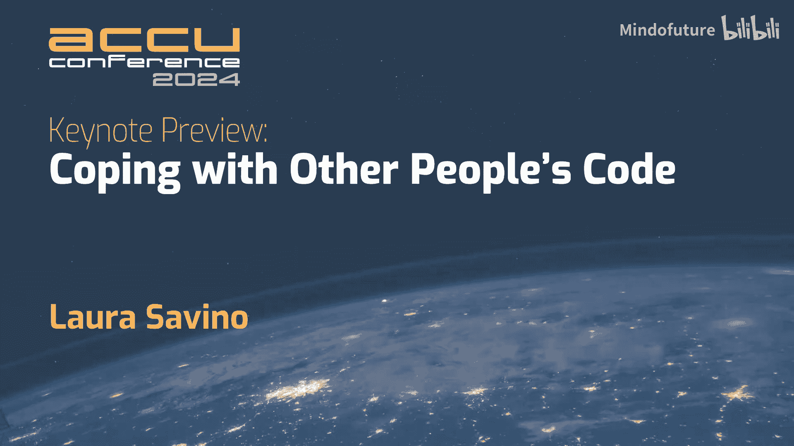
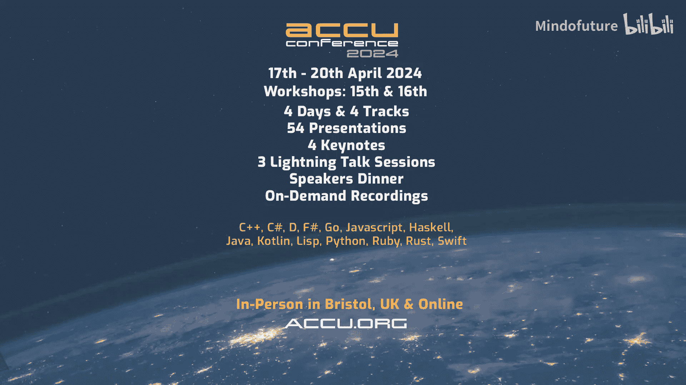

# 004：与 Laura Savino 的访谈

在本节访谈中，我们将与 Laura Savino 进行对话，了解她如何从语言专业背景转向编程领域，以及她对教学、编程和即将在 ACCU 大会上发表主题演讲的看法。

## 从写作到演讲 🎤

大家好，我是 Kevin Carpenter，CPPcon 和 ACCU 的志愿者。我很荣幸能与 Laura 在这里交谈，她似乎经常发表主题演讲。

我没有在现场看到你在 CppCon 的演讲，但你讲得非常好。这是如何做到的？你是如何走到今天这一步的？

实际上，我更像一个写作者，而不是演讲者。当我经历一些事情，尤其是艰难的经历，或者让我困惑、觉得自己搞砸了、或者觉得别人需要改进的事情时，我喜欢把它写成故事，然后整理成能让其他人理解的东西。

我的许多演讲，其未言明的副标题就像是“人们，请做得更好”。例如，关于本地化或教学的演讲，我很喜欢讲的一个主题是：朋友们，我们一直在试图向他人传授信息，而实际上，外面有一整个关于如何教学的行业和学科，让我们从中学习吧。

教学是困难的。疫情期间，当各大学校都在追赶进度时，我被邀请编写一门 Linux 课程。我虽然用过不少 Linux，但没有计算机科学学位，所以他们请我写课显得更奇怪。

我编写了这门课程，并且它被使用了相当长一段时间。但编写完课程后，他们又请我去教这门课。

我二十多岁时有些自负，认为没有接受过任何实际教学培训也能教课。现在年纪大了，有了智慧，我为当时的学生感到抱歉。教学是一项技能，它很难，我非常尊重那些会教学的人。当然，现在我能教的东西肯定更多了。

## 教学的挑战与实践 🧑‍🏫

教学绝对是一项技能，不是吗？是的，而且总是很神奇，当你第一次把东西教给一个真正的学生时，你会发现：“哦，不，这完全没讲明白。”

我有时间也喜欢做志愿者。我曾为“女孩编程营”做志愿者，该项目用一周时间教初中女生在 Xcode 中用 Objective-C 制作一个应用。光是打开 Xcode 可能就需要两周，更别说在一周内学会了。我们有一些脚手架，Swift Playgrounds 让事情变得好了一些。

有一次，我坐火车从西雅图去波特兰教课，路上我写好了如何向孩子们介绍这个 Swift Playground。我觉得准备得不错了。碰巧我旁边坐着一个大约 10 岁的女孩，我问她：“嘿，你想学用 Xcode 吗？”然后尝试教她这些东西。结果我发现她甚至不知道应该把光标放在哪里来在函数里输入代码。我写好了函数体，但她不知道代码应该放在大括号 `{}` 之间。当你第一次看到代码时，这并不直观。所以，是的，正是不断的试错让老师变得优秀。

确实，在你尝试把某件事教给别人之前，你永远不会真正知道自己对它的了解有多不足。

我另一个例子是关于“变化”的。你知道，从理智上你知道一切都在变化，但只有当你真正意识到随时间发生的变化时，才会有深刻的体会。我的另一个类比是试图教我十几岁的女儿开手动挡汽车，她为此很讨厌我。

作为技术人员，我一开始会说：你知道，你踩下离合器，这样做，那样做。但最后，这变成了更多是感觉上的东西：你需要感受这个过程，慢慢抬起脚，感受特定事情发生的时刻。当你看到某人真正掌握它时，那种感觉非常棒。我想，在规模上给予一辆车的感觉，这至少是你某次演讲的一部分内容，那也是一个很好的演讲。

## 工作的意义与动力 💼

那个演讲的灵感来源于我在可汗学院工作的时候。那是一个拥有巨大影响力的非营利组织。有时我会想：我真的必须修复这个 bug 吗？我们真的要第三次重写数据层吗？我该如何在一件从宏观层面（比如为所有人提供教育机会）对我很重要的事情上，保持投入和兴奋？

是的，1000%同意。但日常工作中，你并不总能感受到你所构建的东西的重要性。

我同意。我喜欢我的工作，我为一家信用卡处理商工作。我的客户是你在加油站或别处刷卡的终端。这确实让我感觉很好，是的，这是信用卡交易，但你能因此买到杂货或在餐厅付款。

但我确实也喜欢在工作之外做些其他事情，来填补我们谈话中提到的那些空白。

## 关于 ACCU 大会 🇬🇧

我们来谈谈 ACCU，我觉得这很有趣，因为你和我在同一个“泡泡”里——我们俩都没去过 ACCU。

你兴奋吗？你去过伦敦吗？当然，我去过伦敦。实际上，我和我丈夫的第一次约会就是在伦敦，当时我们参加一个合唱团旅行，我们的第一次约会恰好是去看音乐剧《吉屋出租》。

但我没去过 ACCU。当有人联系我关于演讲的事时，我想：这听起来不错。但我不知道 ACCU 是什么，不过我没告诉他。我实际上联系了 Adobe 的其他 CppCon 演讲者，比如 Dave Sanko、Abrahams 和 Sean Parent，问他们：“我应该去吗？”他们说：“是的，如果你有机会，一定要去。”

我有一位英国同事坐在我附近，我跟他提到我要去布里斯托尔参加一个会议。他查了一下说：“哦，ACCU，我90年代末还在英国时去过，很酷。”

我很兴奋能去了解一个拥有自己历史的、长期运行的会议。是的，很抱歉打断你，但这也是同样的感觉。我开始在 CppCon 做志愿者，我想我第一次去是2014年，那时你大概刚开始演讲，至少从你的演讲列表看是这样。

ACCU 以及它运行了这么久这件事，对我来说是不可思议的。对于任何正在观看的人，如果你还没有行动，会议于4月17日开始，快去订票吧，还有会前课程。

## 从语言到代码的转变 🔄

让我问一下，当我试图更多了解你时，你是如何从法语和宗教研究转到 C++ 的？

是的，我主修法语和宗教研究，辅修日语，我的论文是关于应用语言学的，也就是语言教学。

我最初是一名语言教师，在小学教法语，在法国和韩国教英语。然后我意识到我不想再站在教室前面了，因为那每天都需要耗费巨大的精力。如果你状态不好，你所有的学生状态也会不好，这很累。

于是我开始在一所学校办公室工作。这个办公室有一个系统，他们每两周打印一次报告，然后打印一份新的，再从旧报告上把重点内容抄到新报告上——是物理意义上的抄写。我当时想：天哪，我们可以做得比这更好。因为我的工作就是抄写重点，我觉得这不能再继续下去了。

我当时的男朋友，现在的丈夫，他是一名程序员，他总是说：“Laura，你应该试试学编程，你会喜欢的。”我总是说：“不，我太有创造力了，那不是我的事。”但后来在用 Excel 时，我注意到：哦，我在做这些非常重复的任务。我写了越来越复杂的公式，学会了制作按钮来自动完成我的大部分工作，并开始用 VBA 编程。

VBA 不是一门优美的语言，但它让我实现了目标。那是我工作中最有趣的时光，我想熬夜完成它，因为我投入其中。我想，也许我丈夫是对的，也许我应该看看编程这东西。于是他教我用 C++ 学习数据结构和算法。

哇，这真是个跳跃。我常谈论从 Basic 到 Pascal 再到 Turbo C++，而你直接从 VBA 跳到了算法和 C++。

我真的以为，如果我不能随手画出一棵红黑树，我就找不到工作。我以为那是成为程序员的入门标准。

嗯，这某种程度上也是真的，取决于不同的面试流程。我所在的地方不使用那种流程，但我确实被一两次 Bloomberg 的面试难住了。他们让我从头实现一个 `mutex`。显然，答案是：我手头就有 `mutex`，为什么要从头写一个？这不是他们想要的思路，但我理解了他们考察的重点。

## ACCU 主题演讲预告 🎯

我很兴奋能去 ACCU 见到你，你的主题演讲将关于什么？

演讲题目是“应对他人的代码”。我最初的标题是“处理你对他人的设计模式的感受”，然后我发现人们总是期待我真正深入讨论具体的设计模式。我说：不，重点不是代码本身，代码就是代码。但这是关于一个人类过程：看到一些你非常讨厌的代码和模式，你要求那个人改，他说不，然后你该怎么办？以及在你对代码应该是什么样子有了清晰认识之后，如何与不完美共存，或者与不符合你期望的代码共存？这很痛苦。

想到别人读我的代码时可能承受的所有痛苦……我肯定会去听你在 ACCU 的演讲，那是在周五。你是周五的开场主题演讲。所以，所有观看的人，你们应该来现场听 Laura 的演讲，在 ACCU 的大厅里和大家交流，来认识那些可能已经参会很久的人，我们会意识到我们错过了什么，或者认识那些新来的人，他们会想：哦，这就是这个机构的精髓所在。

我很兴奋能去那里，还有不到两周时间。是的，会很棒的。我很紧张，但我是一个截止日期驱动的开发者。

是的，即使是管理层规定的、比他们认为我们能做到的更快的截止日期。我很幸运，我的同事们非常通情达理。是的，我很期待。这也是给所有正在观看、但他们的同事不那么通情达理的人一个提示：去 Adobe 申请工作吧，Laura 可以帮你。

Adobe 确实是一个非常棒的地方，我已经在这里五年了。这与 ACCU 有一个有趣的相似之处：当我找工作时，我对人们在 Adobe 待的时间之长印象深刻。这种数据是无法粉饰的，你不能说“我们要加一张乒乓球桌”就了事。不，我们拥有待了10年、20年的熟练员工。这就是为什么我对去 ACCU 如此兴奋，因为一个会议能运行这么久绝非偶然，一定是某种极其有意、极其有价值的东西，让人们不断抽时间聚在一起。我迫不及待想成为其中一员。

## 总结 📝

在本节访谈中，我们一起了解了 Laura Savino 从语言教学到软件开发的独特职业路径，她对于教学作为一项技能的深刻见解，以及她对在 ACCU 2024 大会上发表主题演讲的期待。她的演讲“应对他人的代码”将探讨在协作开发中处理代码分歧和个人感受这一重要主题。我们期待在 ACCU 大会上与她相见。

