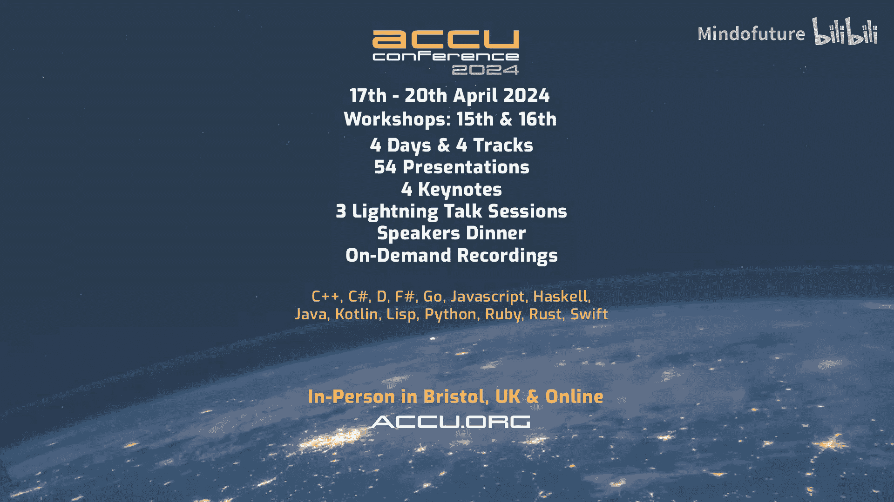

# 005：ACCU 2024会议前瞻 - 与Mike Shah的访谈

在本节课中，我们将一起回顾一段关于C++、编程教育以及ACCU 2024会议的访谈内容。我们将跟随Kevin Carpenter与Mike Shah教授的对话，探讨现代C++教学、不同编程语言的比较、开发者成长路径以及即将到来的ACCU会议亮点。课程将涵盖从初学者到资深开发者的多个视角，帮助你理解编程语言学习的迭代过程以及行业会议的价值。

## 概述：访谈背景与嘉宾介绍

Kevin Carpenter以专业志愿者的身份主持本次访谈。他提到自己为许多会议提供志愿服务。

他正在与Mike Shah教授交谈。Kevin是在Mike的YouTube频道上了解到他的，该频道拥有超过16000名订阅者。

他们此次对话的主题是即将于4月17日至20日举行的ACCU 2024会议。会议之前还有一些精彩的会前课程。

Kevin欢迎Mike的到来。Mike表示感谢，并表达了对ACCU会议的期待以及参与对话的愉快心情。

## 章节 1：相识与会议经历

Kevin表示感觉认识Mike很久了，但记不清初次见面的具体场合，可能是在CPP Con或C++ Now等会议上。

Mike确认他们几年前在C++ Now会议上见过，并且之后有过多次交流合作，每次交谈都很愉快。

Kevin提到Mike去年参加了ACCU会议并发表了演讲，主题是关于C++教学。他询问Mike作为教授，教学是否是其主要工作。

## 章节 2：现代C++教学理念与实践

Mike确认了去年ACCU演讲的主题是“如何教授现代C++：一次一个像素”。这个主题灵感来源于Kate Gregory多年前在ACCU会议上的一次演讲。

Mike坦言自己从Kate Gregory这位出色的演讲者、程序员和培训师那里借鉴了许多教学技巧，并将其融入自己的课程中。

他的教学核心是通过图形化元素让C++编程变得有趣。这能帮助学生理解他们所做事情的目的，使用C++提供的工具和抽象，保持学习动力，并看到这门语言的强大之处。

Kevin联想到Logo编程语言，猜测那可能是Mike更早的编程启蒙。Mike确认了这一点，并提到自己的编程起源确实是Basic和Logo，这个点在他的演讲中也曾被问及。

Kevin非常认同从图形化角度切入C++教学的理念。他提到今年CPPcon会议将有一个大型游戏开发专题，并指出几乎所有游戏都离不开C++，尤其是在追求性能的场景下。

Mike补充道，即使是简单的2D卷轴游戏，在手机等设备上运行也需要考虑节省电量，优化算法。他引用了一句名言：“性能是一种货币”，强调即使当前不需要极致性能，考虑性能也能带来更长的电池寿命、更流畅的体验和更正确的代码。他认为这是C++的一个优点，即不会在性能上设限。

## 章节 3：开发中的迭代与经验积累

Kevin联想到Kate Gregory常说的“能运行就是一个特性”，并询问Mike在开发中是否也经常经历代码的迭代改进过程。

Mike认为开发过程总是迭代的。即使是经验丰富的开发者，在录制教学视频前，也通常对问题进行了长时间的思考。在实际开发中，比如需要一个排序算法时，可能会先使用标准库中的现成方案，或者为了快速验证而编写一个简单的暴力排序，尽管知道其性能不佳。

他强调理解“为什么”要这样做非常重要。随着开发经验的增长和在不同领域（如图形学、编译器）的深入，所使用的性能技巧和代码架构方式都会发生变化，这非常有趣。

Kevin分享了自己为CPP Online准备演讲时的经历。他第二次讲授关于“工具使用直觉”的演讲时，中间学习了一些Python，这让他对编程有了新的感受。与C++相比，用Python编写代码时迭代速度更快，思维方式也不同。

Mike完全赞同，并鼓励大家学习新语言，因为这能改变思维方式。在不同语言中，实现高性能的方法可能截然不同。

## 章节 4：面向初学者的会议与职业建议

Kevin提到Gail Ollis将在ACCU会议前一天（4月16日）主持一个为期一天的“早期职业日”研讨会，面向初级开发者。他询问Mike，作为一名教师，认为这类活动对初学者有多重要。

Mike对此表示大力支持。他认为对于刚开始职业生涯或作为会议志愿者的学生来说，参加这类活动非常有价值。他特别提到Gail Ollis拥有多年的资深软件工程师经验，后来又研究了团队协作和软件构建心理学，是给初级开发者提供建议的绝佳人选，这些建议可能为他们节省数年时间。

Kevin以自己的经历补充道，对于非科班出身、自学成才的开发者，面对编码面试（尤其是白板编程）可能充满挑战。他建议新的开发者或应届生可以关注Gail的会前研讨会。

## 章节 5：从D语言看编程范式与语言演进

话题转到Mike今年在ACCU的演讲，主题是关于D语言如何帮助理解C++。Kevin表示理解，因为他自己使用Go语言后，也开始以新的方式在C++中使用元组。

Mike解释了他开始认真研究D语言大约是在两年前。D语言由Walter Bright等人创建，其设计借鉴了C++的经验教训，尤其是在90年代现代C++兴起之前。

学习D语言让他以不同的方式思考编程范式。D语言强调模板和元编程，编译时内省和编码等范式在D中已经成熟，而这些正是C++当前重点发展的领域。D语言就像一个游乐场，让他可以学习这些概念，然后将其理解转化到C++中。

Kevin询问D语言与同样注重内存安全的Rust语言相比如何。Mike分享了他对Rust的初步印象：Rust强制开发者思考所有权等问题，通过借用检查器在编译期提供保证。他认为Rust在某种程度上处于D和C++之间。

Kevin提到最近关于编程语言的一些讨论，并分享了Go语言在保持向后兼容性方面遇到的挑战。这引发了一个思考：是否所有语言最终都会面临类似“破坏性更新”的问题，就像Python 2到Python 3的过渡一样。

Mike同意这个观点，并指出计算机科学领域相对年轻。与数学、化学等拥有数千年历史的学科相比，编程语言几十年的发展史还很短暂。他再次强调，他的演讲不是要比较语言的优劣，而是像Kevin在工作中根据需求选择Go、C++或Python一样，重要的是为任务选择合适的工具。通常，单一语言无法让你体验所有范式，因此需要深入不同的语言去学习。

## 章节 6：开发者成长路径与知识回顾

Kevin询问Mike，从早期编写ASP.NET网页到今天的教授生涯，他的经验和代码风格发生了怎样的变化。

Mike承认自己的代码和所学知识已经发生了巨大变化。他回顾自己的起步阶段也是查看教程、浏览Stack Overflow、将代码拼凑起来，并尝试逐步学习更多。当时可能并没有深入思考范式、最佳实践、不可变性等如今在技术演讲中听起来可能令人生畏的概念。他只是每次汲取一点点知识并尝试应用。

Kevin深有同感，他分享了自己早期回避使用C++模板的经历，以及后来在项目中逐步学习和应用标准库的过程。他认为开发者积累的每一点经验，无论是否与代码直接相关，都会增加整体经验，从而使其成为更好的开发者。

## 章节 7：重温经典演讲与持续学习

Mike反问Kevin，是否有多年前听过、如今重温后又有新领悟的技术演讲。

Kevin坦言，由于自己非科班出身，是通过看书和教程自学，因此“回归基础”类的演讲他经常重温。特别是在职业生涯早期，模板等概念让他和团队中的一些老开发人员都感到畏惧。

他特别提到了Mike、Klaus Iglberger和Kate Gregory的“回归基础”演讲。这些演讲帮助他跨越了理解上的障碍。他也非常喜欢Kate关于“命名很难”的演讲，因为这提醒我们，编写自文档化代码时，命名至关重要。

Kevin认为，对于新手和准备面试的人来说，理解基础知识至关重要。例如，面试中可能要求徒手实现一个互斥锁，虽然实际开发中应该使用标准库的实现，但理解其原理是必要的。

Mike赞同这种持续学习和向他人学习的方式。他分享了一个从Titus Winters那里学到的重要观点：在编写代码时，需要考虑这段代码预期存活多久。这个观点改变了他对软件工程的看法，影响了他花在规划上的时间。他意识到，有时快速拼凑一个临时解决方案是可以的，但最好加上注释，标明未来可能需要重构或替换为标准库实现。

Kevin以一个生动的例子结束了这个话题：二进制编码十进制（BCD）。由于历史原因（如早期调制解调器传输需要节省字节），BCD格式至今仍在使用于信用卡处理等ISO标准中。这说明了向后兼容性是Go、C++等所有语言最终都必须面对的问题。

## 总结：会议展望与结束语

在本节课中，我们一起学习了Kevin Carpenter与Mike Shah教授的对话。我们探讨了Mike通过图形化教学让C++变得有趣的方法，理解了软件开发本质上是一个迭代和学习的过程。我们比较了C++、D和Rust等不同语言的设计哲学，认识到学习多种语言可以拓宽思维。我们还回顾了开发者从新手到专家的成长路径，以及重温基础知识和行业专家建议的重要性。最后，我们了解了ACCU 2024会议为初学者和资深开发者提供的丰富内容，包括Gail Ollis的会前研讨会和Mike关于D语言的演讲。

Kevin感谢Mike的时间，并期待在ACCU会议上见面。Mike也表示感谢，并希望能在ACCU见到大家。