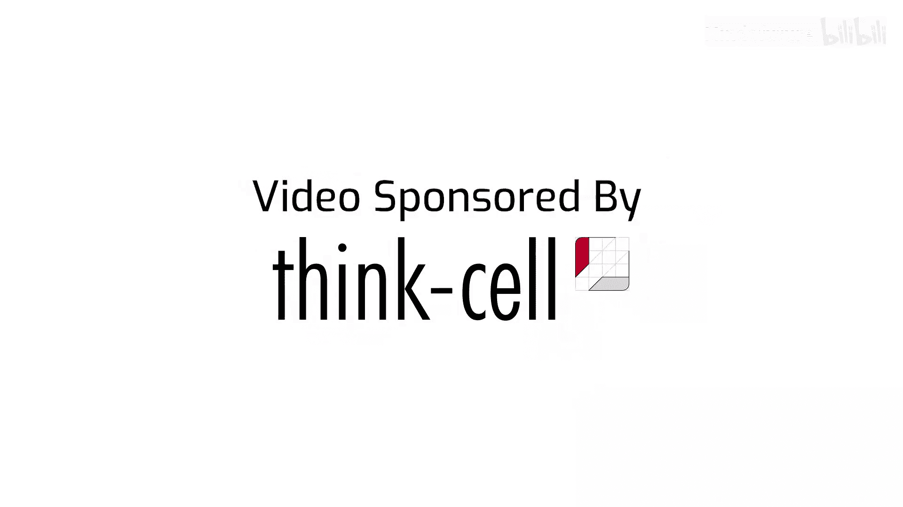
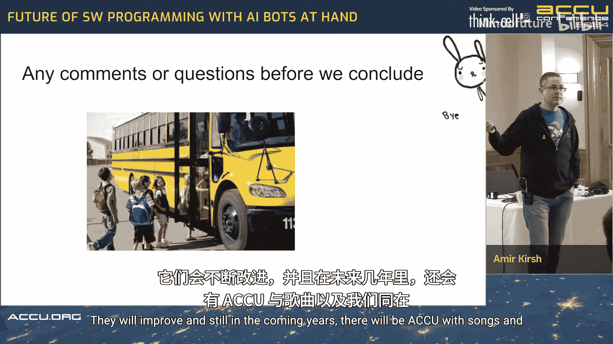

# 006：手握AI机器人进行编程

大家好，下午好。希望你们午餐愉快。

我是Amir Kirsh，我们将一起讨论手握AI机器人进行软件编程的未来。

首先简单介绍一下我自己。我是特拉维夫大学学术学院的讲师、培训师和顾问，也是特拉维夫核心C++会议和同名聚会小组的组织者。

本次演讲的目标是，正如我们所说，讨论AI机器人辅助编程的未来，进行一些实践，并共同思考如何为我们所处的这个新时代做好准备。

演讲分为七个章节。我不会在这里一一列举，我们将逐一探讨。在每个章节结束时，欢迎大家评论。我们将进行简短的讨论或问答。

在每个章节结束时进行。请大家做好准备。

让我们从引言开始。

## 引言：什么是大型语言模型？

我们正在谈论大型语言模型。它们是什么？

在一位朋友（ChatGPT）的帮助下，我得到了这个定义：我们谈论的是生成自然语言文本的人工智能系统。它们也许能够理解和生成类人语言文本，可以跟踪对话并考虑先前的互动，模拟真实的人类对话。

最终，它对于编程也很有用。

OpenAI的首席执行官Sam Altman认为，语言模型只是被编程来尝试预测下一个词，这是真的。是的，如果你听说过，它只是一台试图预测下一个词的机器。是的，这就是它的本质。

但不要仅仅把它看作只是那样。它比那要聪明得多。我的意思是，也许我们人类也是这样工作的。动物也可能是某种试图繁殖和生存的原始机器。

而Grady Booch则非常保守，对AI的真正力量持怀疑态度。他认为，将大型语言模型的简单性与具身感知生物的复杂性进行比较是相当可笑的。

Chris Dancy则说，我的配偶从我们结婚那天起就一直在预测我下一个要说什么。

所以，预测下一个词并不完全是这些机器正在做的事情。它们预测的是下一个标记（token），实际上，一个词可能会被拆分成几个标记。这很重要，因为如果你使用非免费模型，你需要按标记付费。所以，拥有更少的标记或返回更少的标记成本会更低。

无论如何，你可以看到左边的问题：“C++之后最好的软件编程语言是什么？”它被分成了11个标记。我想向你展示这个问题的结果。无论如何，这来自一个开源的标记器，你可以在链接上看到。在右边，你可以看到一个真实的C++程序。你会看到标记器将单词拆分的方式，很可能和编译器会做的方式类似。我的意思是，我看到了`in`、`main`、`pars`。是的，我的意思是，如果我必须为此付费，我可能会直接去掉`std::`。无论如何，这就是标记器读取标记，然后预测下一个标记。

它能思考吗？它能感受吗？Grady Booch说，不，除非一台机器能写一首十四行诗、创作一首协奏曲，或者也许写一首歌。

而Eric Niebler，也许你们从C++社区认识他，则争论道：你怎么知道我们的思想和情感不是由于符号的偶然排列而产生的呢？

所以这是一个相当哲学性的讨论。你知道吗，维基百科上97%的文章，如果你跟随第一个链接，经过一些步骤后，你都会到达“哲学”条目。所以最终一切都指向哲学。你可以阅读相关内容。

因此，LLM的用途相当广泛。我的意思是，我们可以用它来提问和回答，比如“什么是LLM？”我们可以用它来写文章、写带有押韵的歌曲、文本摘要和编码。

让我们短暂地偏离一下，写一首歌。

我有点好奇，也许想和大家分享一首歌。让我们在ChatGPT的帮助下完成。

我向ChatGPT提问：“我正在ACCU（一个C++会议，虽然它不限于单一语言，但主要关注C++）上做演讲。我想要一首与会议相关的短诗，押韵会更好。”你可以理解，我在这里不是按标记付费的，我使用的是免费版本。

我得到了这个回复，我真的很喜欢，第一次尝试就成功了。我不需要修改它。这就是我得到的：“这听起来像是一个有创意的想法。”它总是会给出好的反馈。“这是为你在ACCU演讲准备的短诗：在现实世界中，代码在ACCU相遇，思想在此竞争。从专家到新手，这是一个所有人闪耀的天堂。语言各异，但心之所向一致，在追求解决方案的道路上。以代码为画布，我们愉快地创作，白天创新，夜晚分享洞见。让我们聚集在一起，组成强大的社区，品尝我们共同归属的地方。在这学习和乐趣的旅程中，我们庆祝编码的核心，直到工作完成。”这太棒了。哇，相当有艺术感。顺便说一下，这张图片是真实的，不是AI生成的。我在来这里的路上拍的。在座的英国朋友能猜出这是哪里吗？

那么，有什么新东西呢？我的意思是，神经网络以前就有了，自然语言处理以前也有了。新的是什么？

新的东西是性能的提升、新型模型、更大更强大的模型、无需人工干预即可构建、对上下文有更好的理解以及多语言支持。所以最终，这里有一些新东西，那就是模型的能力，最终让我们得到了通过图灵测试的结果，即与我交谈的人类。

然而，我们目前必须考虑一些限制。首先是计算能力需求。我的意思是，NVIDIA没有足够的机器，或者台积电没有足够的能力来生产我们未来所需模型所需的硬件。所以这里存在某种计算能力的限制。它依赖于数据质量，这是一个问题。我的意思是，你怎么知道你给模型喂的是高质量数据而不是垃圾数据呢？垃圾进，垃圾出。对因果关系的理解有限，创造力也有限，尽管我会说我写不出这么好听的歌。理解情感的能力有限。产生幻觉。我们人类也会这样。但模型没有答案时，它会觉得有义务回答些什么。所以你会看到某种幻觉。你可以在提示词中说：“如果你不确定，就说无法完成。”然后你可能会得到更好的结果。它可能被诱导给出虚假或不道德、种族主义、非政治正确的答案。

它能取代程序员吗？我的意思是，我们都在这里寻找这个问题的答案。我认为问题不在于它能否在未来几年取代程序员，很可能不能。问题是，它能否让程序员更高效或显著提高效率？这就是我们想要回答的问题。如果它能让我们更高效，那就意味着我们中的一些人需要成长，因为其他人会借助LLM来完成工作。

在OpenAI或其它LLM出现之前，开发者编码两小时，然后调试六小时。有了ChatGPT，你编码五分钟，然后调试24小时，至少漫画里是这么说的。我的意思是，如果情况是这样，那我们就安全了，好吧，没什么可担心的。但很可能不是这样。我将和大家讨论一些例子，展示我们并非完全处于那种境地。

那么，让我们尝试探索一下。它是一个好工具还是坏工具？它会改变工作方式吗？我们如何利用它？这就是第一章的结束。如果有人有任何评论或问题。

是的，这里有一个。谢谢。非常有趣。我之前想过这个。其中一个限制是，AI会限制人类的创造力吗？例如，你甚至没有尝试去创作那首诗，它就已经完成了。所以它限制了你的创造力。这是一个好问题。结果会是人类的创造力受到影响、受到限制吗？因为，我的意思是，今天如果你开车去某个地方，即使是以前知道怎么去的地方，你还能做到吗？不是所有人都能。你还记得电话号码吗？我以前记得电话号码，今天不行了。所以，是的，它会改变我们的思维方式。我想，在某种程度上，是的，可能会。我们应该意识到，也许我们应该谨慎，不要走得太远。我的意思是，不要失去我们的创造力。这是一个很好的观点。还有其他评论吗？

是的，我想补充一点。在教学中，我教没有编程背景的商科学生编程。在ChatGPT出现之前的几年里，我布置给他们的任务效果很好。有了ChatGPT之后，他们基本上都失败了。不是课程不及格，而是他们被给的任务失败了，因为他们使用ChatGPT，并试图用ChatGPT来调试ChatGPT一开始就弄错的东西。所以从这个意义上说，是的，我们实际上面临着风险，即人们在学习初期就失去了学习的力量，因为他们可以轻易获得好工具。这是另一个非常好的观点，它既关系到教学，也关系到我们与初级开发者合作的方式，我们对使用这类工具的期望是什么。我会在后续章节中涉及其中一些要点。

我将继续我们的下一章，这一章将探讨：我们这里有一个银弹吗？

## 银弹是否存在？

Sautter刚刚提到了“银弹”这个词。我不知道你们是否知道这个术语。我指的是，可能你们处理过狼人，所以从那个神话中知道。但在软件工程领域，Fred Brooks在1986年的论文《没有银弹》中讨论过。他预测从1986年起的十年内，软件开发的生产力不会有数量级的显著变化。他阐述的原因是，当你观察软件开发所需的工作量时，你会发现工程师需要处理两个障碍：偶然性（accident）和本质性（essence）。偶然性部分就像是复杂的语法。好吧，也许我们可以用语法更简单的另一种语言。但本质性是将问题领域转化为形式化的东西。他的论点是，这种将问题领域转化为形式化语言的本质，在他论文发表后的未来十年内不会被解决或显著改进。

这张照片是2005年在奥斯陆拍的，他们当时在讨论同一篇论文。我们的现状如何？我当时在那里做了一个关于Java的演讲，请原谅我。开发的本质和偶然性仍然是讨论的话题。它仍然是一个问题：我们解决的是本质问题还是偶然问题？我们改变的是事物的核心还是外围？所以，是的，更好的质量和调试工具很重要。它们真的改变了我们的工作方式吗？能改变本质部分的东西可能需要一些外部技术。可能需要一些不仅仅是想法的东西。

其他可能改变但并未显著提高生产力的东西，比如新的范式。面向对象编程在当时正在发展，但它并没有显著改变生产力。新的软件语言和快速应用开发、更好的编译错误、互联网。互联网改变了其他行业，但对软件开发来说改变不大。我的意思是，我们可以更容易地获取示例和文档，但它并没有让我们高效得多。

在其他领域存在银弹。如果你想比较一下，银弹存在吗？是的，存在。火药是赢得战争的银弹。工业革命、机动运输、疫苗、计算机。互联网在某种程度上是其他领域的银弹。卫星。这个列表的共同点是什么？一些技术，因为通常如果没有技术，那么如果只是做事方式的改变，很可能已经有人做过了。门槛太低了。哦，我们刚刚做了。所以需要某种外部技术来改变事物。并不总是这样，并不总是。你可以想想那些没有外部技术却显著改变做事方式的东西，比如福步里跳（Fosbury Flop，背越式跳高）。没有任何外部技术，只是做事的方式，我们跳得更高了。写作、民主，也许。或者也许就像技术一样。社会发展有银弹吗？现在，这是一个问题。我的意思是，如果答案是肯定的，我们将在未来几年看到某种显著的生产力变化。我们仍然不知道。我不知道答案。我稍后会问你们，你们怎么想？

所以这是一个问题。我们到了第二章的结尾，也许你们可以分享你们的想法。你们认为我们拥有某种银弹吗？

我认为，在我看来，这是另一种语言。在某种程度上，这是另一个抽象层次。这是我认为的一种方式。这是另一种语言，这意味着又是另一种语言。是的，它需要你，就像任何技术一样，需要你多花一点精力去使用它。可能它太容易了，就像我们提到的那样，容易让人睡着。这意味着，就像面向对象编程出现时并没有显著改变我们的生产力一样。

哦，你说面向对象编程是一个重大变化。拥有……好吧，好吧，是的，我有想法。

是的，对我来说，测试驱动开发、有意识的单元测试和测试自动化是生产力的重大变化，不仅对我自己，对我教过的所有学生都是如此。关于面向对象编程的评论：面向对象编程是第一个让程序员能够编写自己的类型，并将他们想要的任何东西建模为实体的概念，而不仅仅是约定俗成。我认为这是一个大事。这不是小事，是大事。类型的建模。这是一个突破，掌握在更多人手中。

所以我们听到了两个观点：首先是广义上的测试，其次是拥有自己的类型，这是重要的。问题是，对于测试来说是一个点，对于另一个，它是否真的改变了行业的生产力？我们会保留这个问题。是的，我评论一下。谢谢。

我认为关键的一点是，AI能否识别出XY问题？有多少次你遇到过这样的情况：你和同事或朋友谈论，你试图用某种方式做某事。他们会想，你为什么用那种方式做？有更好的方法。这是一个很好的观点。我的意思是，它可能会让我们偏离方向。它关系到创造力和思考。如果它阻止我们思考，可能会解决我们要求它解决的问题，但这些可能不是我们代码中真正需要解决的问题，这就是XY问题。我们试图解决我们头脑中的问题，我们需要做的事情。但不，不，这不是做事的方式。应该有另一种方式。

是的，抱歉。我的观点是，另一个显著改变事物、可能促成我们今天所知的面向对象编程的东西，是Parnas等人的工作：模块化、信息隐藏。你知道，这为库、框架打开了大门，我们可以重用这些东西，而不必再次编写相同的代码。所以模块化、库，我认为它们都出现在Fred Brooks的论文之前。所以他指的不是那个时期。

第二个。计算能力。哦，说司。调查中反。都的话。好吧，那是个好观点。是的，我需要重读那本书，因为我认为他没有说十年。是的，他论证生产力仍然成立。我需要重读它。我们线下再讨论。我们会检查一下。我们会检查的。好的，我们回到我最初想看的：Brooks将其定义为10倍的改进。就我个人而言，我一直对这个10倍着迷。我尝试研究不同的东西，但我从未找到过10倍。我找到过1点几倍，好吧，2点几倍。你们认为LLM会是10倍吗？我不认为我们能达到那里，但这取决于我们如何衡量。我的意思是，一个使用LLM的程序员能取代十个不使用的吗？这就是问题。

好吧，让我们尝试探索一下。我的意思是，让我们尝试探索一下，因为接下来的问题是，我们如何利用大型语言模型来改善我们的生活和开发周期？这不仅仅是编程。

我会从需求开始。所以从需求开始，AI模型能验证需求吗？我会从验证需求开始，这非常重要。AI有能力处理相当多的标记，其中一个模型可以处理150万个标记，最终可能比我们能处理的上下文还要多。

让我们用非常小的例子来尝试一下。识别不一致性。我在这里用ChatGPT 3.5试过。稍后我会用更新的版本和其他东西再试。我会给你几个句子，你应该告诉我是否有不合理的地方或矛盾。“ACCU会议每年举行一次。”我认为它每年不止举行一次，也许现在是一年一次。无论如何，这是句子。你应该按原样理解。“今年，ACCU在四月举行。”“今年，ACCU在夏季举行。”LLM会怎么说？这是回复：“ACCU会议每年举行一次”是一个合理的陈述，表明会议每年举行。第二个也是合理的。然后第三个与前一个陈述矛盾，等等，因为四月不在夏季。这很好。我的意思是，它很小，但可以扩展。这是一个开始。我可以用更大的语料库来检查它。它会以某种方式改变。它会朝那个方向发展。在某种程度上，比我们做得更好。我想。

好吧，让我们尝试挑战它一下。让我们尝试挑战它。好吧，这次：“ACCU每年举行两次，在四月和夏季。”这听起来是可行的。我的意思是，那应该没问题。然后第三个句子说：“这个陈述仍然与前一个矛盾。”为什么？它每年举行两次。你没跟上吗？是两次，不是一次。不，它把我弄糊涂了。好吧，也许它把我弄糊涂了，因为先前的上下文还在。但不，你有了新的上下文。我不知道。它把我弄糊涂了。

所以我想，好吧，让我们用ChatGPT 4试试，它内置于Copilot中。所以我去了Copilot聊天。我们稍后会一起玩玩这个，然后把同样的东西给了Copilot，它运行的是GPT-4。这是同样的东西。然后Copilot给出了这个说法：“作为一个AI编程助手，我在这里帮助处理软件开发主题。恐怕我无法验证会议的日程安排。”其余合理。好吧，我必须换种方式。

好吧，我想在编写代码之前检查以下需求的有效性。这是一个编码作业，好吧。好吧，这是一个编码作业。我现在和你在一起了，作为一个AI编程助手。我没有实时数据或验证现实世界事件的能力，但因为它是一个编程作业，需求可以在编程上下文中解释。这里和那里。最后没有矛盾，因为没有矛盾，因为每年两次，GPT-4对我来说没问题。顺便说一下，问题在于，我是一个编码助手，因为我通过Copilot来做。如果我回到Copilot，用“一次”，它会弄错。我猜第一个需求和第二个、第三个之间似乎存在矛盾，即使我……哦，不，它弄对了。弄对了。有一次。是的。好吧，所以我们可以用这些工具进行需求验证。这是一个非常小的例子。但是，是的，我们会继续。

顺便说一下，Copilot提出了一个建议。你想让我引用什么吗？它非常积极。我说，它刚刚给了我这个。我说，是的，它说，你想问我如何用代码表示这个吗？我说，是的，让我们试试这个提示。然后它提出了我认为`pair`会很好。

好吧。我们也可以验证完整性。我会给你一组服务需求。告诉我它们是否合理和完整。“服务应获取城市符号。”“布里斯托尔，服务应返回该城市的天气。”一个不错的服务，对吧？不错，合理。去编程吧。然后，当然，要改变，因为需求不完整。我会说，所以提供的命令不完全清楚，可能需要一些额外的信息。现在，这很好，因为它帮助我创建了回复给发送这组需求的系统工程师的电子邮件。我的意思是，我需要打字。我做不到。我的意思是，需求太狭窄了。我准备好了电子邮件。我缺少什么？城市符号是什么？有城市符号列表吗？输入的格式是什么？输出的预期格式是什么？我的意思是，这里有很多问题。好问题。它提出了。它自己提出了。频率是多少？我没想到那个。但是，是的，这是一个频率问题。我们应该缓存它吗？我们应该每次都去天气服务吗？我不知道。总的来说，提供更详细的信息会很有帮助。我的意思是，这很完美。直接把它发回给项目经理，或者随便谁。

“我会给你一组服务需求。”另一个：“服务应该获取两个数字，表示速度和时间。服务应该返回给定速度和时间的行驶距离。”我会称这个服务为一个函数。但是，哦，你提供的需求是合理和完整的。它们指定了输入，等等，等等。我不认为它是完整的。所以我再次争论。假设他们希望需求非常严格。你会建议修改它们吗？如果是，哦，我的意思是，我在推动它。请让我知道那里是否缺少什么。好吧，如果你确实希望它非常严格，那么也许你应该指定测量单位，也许你应该指定输入值范围的任何限制。我没想到那个。但是，这是一个合理的补充。添加到需求中：特定的数据类型和格式，指定服务应处理的错误条件，等等。所以，是的，我认为它比我想得更好。我会使用它。

那么，AI模型能可视化需求吗？对于我使用的玩具示例，我会说是的。对于更大的需求文档，我也会说是的，但我们必须检查一下。我们必须做到那一点。而且，是的，我推测它会做到。

它能编写需求或设计吗？所以人们尝试过。Jonathan Müller，我不知道他今年是否在ACCU，但他让ChatGPT为`int`到`string`的转换创建了一个文档提案。我的意思是，C++缺少这个。有这个需求。ChatGPT提出了一个相当好的提案。他说也许我只需要稍微修改一下。是的，提案的格式是提案。他不是唯一尝试过同样事情的人。他们彼此不知道。Vittorio Romeo尝试了完全相同的事情。我的意思是，人们都缺少`int`到`string`的转换。所以他问了非常相似的事情，又得到了一个提案。是的，它可以通过非常简单的提示编写文档。

所以对于需求，我认为理由相当充分。你们怎么想？不是专门关于需求，而是当你说它能做或不能做的事情时，它的可重复性如何？如果我尝试同样的事情，我会得到相同的结果吗？它受上下文影响。所以它记住了当前讨论中先前讨论的上下文。你可能得到其他结果。我认为如果上下文清晰，提示相同，我们应该得到相同的结果，但可能取决于模型。我看到有人摇头说不。可能取决于其他因素，但我不认为可预测性或确定性的问题对于它有多高效的问题非常重要。我们不是确定性的。我倾向于认为我们偶尔也会有保护性。所以它应该是，即使它不是确定性的，也许甚至不具确定性是件好事。你可以再试一次，它会再思考一次。是的。

还有其他评论吗？Amir，是的，应该记录下来。谢谢。是的，所以我认为它是一个非常强大的工具，可以验证某些事情。但从你的例子来看，你不得不多次推动它才给出正确答案。所以我会说，也许它不是独立正确的。所以你必须持续监控。是的，我在工业界担任团队领导和开发经理时，也不得不推动我的员工。我的意思是，他们不会在第一次提示时就做对事情。所以我已经习惯了。我的意思是，这对我来说不是什么新鲜事。但是，是的，在某些情况下，你需要问不止一次。你有孩子吗？我的意思是，我们知道。好吧，这对我们人类来说并不是一个真正的挑战。如果我们没有得到我们想要的，我们只需要再问一次，通常用另一种语气、另一种措辞。

让我们继续下一章，关于编码和测试。我们将在这里花一些时间，因为这是核心。它真的能编码吗？它真的能帮助完成编码任务吗？

## 编码与测试

让我们从基于需求生成系统这个概念开始，这并不是什么新鲜事。Ville添加了一些关于这个主题的论文。他和他的团队创建了一个系统，可以以非常正式的方式处理需求，非常正式的需求，并生成一个系统。正式的需求。但这和我们在这里看到的不一样，因为根据相当模糊、不那么正式或不接近实际代码的需求来创建代码，这是一个挑战。所以，我不会把它当作“哦，事情已经做过了”的例子。是的，但方式不同。如果你有一种非常正式的需求语言，那么也许它本身就是一种软件编程语言。好吧，所以我不会深入讨论那个。我们想要更开放一点的东西。

然后Sheper写了关于人工智能和这些模型的文章。他试图基于GPT API创建ChatGPT。所以有GPT API，他想为它创建Web界面。他说他给自己设定了挑战：我能用10个提示完成吗？我会告诉你紧张感。他在10个提示内成功了。他有了一个基于GPT API模仿ChatGPT的Web应用程序。我的意思是，他还没有用1个提示创建GPT。但那个可以。所以，是的，它可以帮助我们创建实际的代码、实际的应用程序。我们稍后会玩一下GPT，然后玩一下Copilot。

让我们从GPT开始，计算距离。我们之前讨论过距离。所以，你能实现一个获取时间和速度并返回距离的函数吗？不需要主函数。因为如果我不说不需要主函数，我也会得到主函数，你知道，还有很多我不需要的东西。所以，是的，当然。在这里：`double time, double speed, time * speed`。但是这不是我想要的，因为我想要类型安全。我这里没有类型安全。我的意思是，测量单位是什么？我想使用测量单位。当然，添加类型安全的一种方法是有一个用于距离的结构体，包含三个`double`。不，我必须再问一次。这不是我想要的。我想要一些能容纳测量单位的东西。所以我回来了。不，不，不，你想要像Chrono库那样的类型安全。我的意思是，我就像在和一个人说话。如果我在和人说话，我会说，就像在chrono库中，你知道的。然后它提出了：“哦，我为误解道歉。如果你想要那样，也许我会添加chrono。”是的，有`timer`。对于公里，我会有`type def`。类型不是类型安全，`typedef`只是类型的另一个名字。我想要类型安全。`duration`是类型安全的。所以我有点担心公里每小时。我知道那听起来像，好吧，我需要那个作为公里每小时。但如果有人提供英里每小时，代码不会发现。所以我想要更强一点的东西。我被建议不要使用整个命名空间。我对ChatGPT说。这是一件事。我还希望`typedef`被替换成更类型安全的东西。

好吧，所以你是对的。考虑到这一点，这是更新后的示例。我得到了某种类，这不是我要求的。我不知道。不，不，你明白这是一次讨论。现在，可能更新的模型会更快速地理解我。但仍然，我很急切。我不会放弃。所以我想基于全局乘法函数计算距离。我的意思是，我没有要求一个类来改变整个东西。只是，你知道，一个全局函数。如果我需要类型安全，只需要维度单位的类型。然后它提出了，好吧，我明白了。距离，好吧，距离被模板化在类型上，可能是测量单位速度。我不知道。最终它提出了看起来相当符合我想要的东西。我想我仍然有一些保留意见。你看到我对代码中这些`T1`和`T2`的保留意见吗？它实例化`T1`和`T2`，它们可能没有默认构造函数。使用`declval`会更好。但我停在这里了。我说，好吧，听起来像是我想要的。让我们看另一个。这相当困难。我的意思是，我自己写可能更快，我不知道。也许不。

与0比较。我遇到了这个与0比较的问题，我需要一个效率函数来检查向量中的所有元素是否为0。该函数应该适用于任何可平凡比较的元素类型，这意味着它们可以按位比较。所以我得到了带有类型特征检查“可字面比较”的东西。语言中没有这样的类型特征。有一个提案，但没有。所以我不能用它。我的意思是，我可以试试。编译器不会接受。其余的也不是我想要的，因为其余的是一个循环。我的想法是我不想循环遍历元素。我的意思是，这不是按位比较的有效方式。好吧，所以我必须在提示中更有说服力，试图让它理解我想要什么。似乎与更大的块（例如64位，使用`memcmp`）进行比较，我只是在填充它，可能更高效。哦，是的，我可以做类似的事情。然后某处有一个比较调用。仍然，我认为夏天有`is_comparable`，但我没有。所以我告诉它`is_comparable`的使用不是标准的。你能用别的东西替换它吗？是的，也许可以用`is_copyable`。不，那不是一回事。它不会工作。我的意思是，它会检查一些东西。它会编译。这不是你需要检查的东西，好吧。它提供的代码并不差。我的意思是，分块的想法，使用了不存在的类型特征，还有一个注释，关于第一个元素在缓冲区上是否对齐的问题。如果不对齐，使用`memcmp`可能会有问题。也有关于这个的提案，我想是之前由Inbal Levi提出的。无论如何，无论如何，它有帮助。哦，我为什么到这里了？因为我按了什么。让我们回到这里，再做一次，好吧，从这里继续。我的意思是，你可以理解它并不总是有帮助，这需要努力。

可变参数包短路求值。我需要处理可变参数包但要短路求值。所以，如果函数调用包中的某个函数返回`true`，那么就在那里停止。好吧，相当简单的任务。但是，你知道，我宁愿让别人为我写。所以我得到了类似这样的东西，但最终没有工作。我的意思是，如果我们看代码，那里有些东西坏了。所以我回来说：“似乎停止条件`stop_condition_met`没有设置为`true`。”有一个标志，但没有任何东西把它设为`true`。所以它真的不工作。所以，你知道，我承担了审查代码的工作。我在和团队里的一个初级成员合作，如果你明白我的意思。所以在某种程度上，我可能放弃了一个初级成员，又找了另一个。我不知道他是否更好。所以我得到了别的东西。现在，`stop_condition_met`被设置为`true`了，但不是在它所在的上下文中，在它被访问的地方不可访问。我的意思是，代码不会编译。它会编译代码。它会看到错误。然后也许它可以获取错误并自我修正。我们会讨论那个。如果这能做到，我们将达到另一个阶段。我们已经在那里了，因为有工具正在做这件事。所以最终，它提出了一个可行的东西。然后我创建了，我问它，你能用C++17的折叠表达式做吗？因为它不是。它是C++14。我更喜欢C++17。我在用C++20。所以，哦，这是用C++17的，可以工作。那好吧。我不认为我需要那里的变量。但如果他喜欢，我可以接受变量，那可以工作。最终，好吧，这并不简单，我的意思是，如果需要写的话，有点复杂。我用它作为我在课堂上展示的一些例子。好吧，不完全一样，但现在我有了代码，我可以轻松使用它。

让我们谈谈解释代码。在某些情况下，我看到代码。也许我必须维护代码，但我不理解那里有什么，我需要解释代码。或者我得到一个任务，要对一段代码做些什么，调用它。但我首先需要理解那里有什么。所以我给了它一段代码，你看不懂。它相当小，但有些复杂，是一个基于算法创建算法的工厂代码。我不认为它以前见过这段代码。我不认为，你知道，哦，它知道它看到了什么，因为它以前在别处见过代码。不，那是新的。我得到了这个解释，相当好。我的意思是，当我读它时，我说，哦，你解释得比我好得多。除了一些错误。所以一个错误是，它错误地说那里有一个函数指针。那不是函数指针，我认为是一个函子，一个函数对象。好吧，在另一个地方，它说某种东西包含一个公共向量。那不是公共向量，是私有向量。好吧，每个人都会犯一些错误。我们不会仅仅因为这个就放弃它。就这样。最终，解释相当好。然后我继续另一个关于使用该代码的问题。我说，好吧，关于上面的代码，你能解释一下下面的吗？有一个带宏的函数。很复杂。好吧，我得到了相当好的解释。你会得到幻灯片，你可以读，不是现在，因为它相当长。所以最终，它不是废话。它不是，你知道，只是堆砌词语。你读它，它是有价值的。

所以让我们总结一下：为一个简短但相当复杂的代码片段提供解释相当好。有两个可以轻易发现和修复的小错误。这些错误没有改变事物的本质。所以我认为用它来解释代码是有价值的。我会使用它。

关于修复代码呢？在我将要展示的代码中，有一个故意的错误。好吧，这是一个故意的错误，因为我添加了这个错误。我修复了错误，然后我说，哦，让我们问问Jepity（可能指ChatGPT）看它是否能修复它。所以我不知道你是否会看到。也许我会，你知道，指给你看错误。你现在能看到错误吗？我正在为公共返回类型创建一个提取器。在里面，公共返回类型使用类型特征`std::common_reference<Ts...>`。它编译了。但这个类型实际上并不代表我想要的类型。它代表别的东西。它不代表公共类型，它代表改变公共类型的类型特征。我缺少的是`_t`调用。好吧，它编译是因为最终，这是一个类型，但不是我想要的基础类型，即类型特征内部容纳的类型。我的意思是，这是关于可以做到的。所以我把它给了ChatGPT。它给出了错误的解释。解释不是实际问题。一些，你知道，这个那个，一切都是错的，但是。它提出了新代码。在正确的地方改变或添加了两个字符`_t`。所以我得到了结果。我的意思是，我得到了应该修改的东西，但解释是错的。如果它能编译，我不在乎解释。我现在可以解释它。所以我猜，你知道，我不知道。我更喜欢能工作的代码。我会放弃解释。最终，它提供的代码修复了问题。我认为在某种程度上，它看到，哦，当我看到类似这样的东西时，当我看到，你知道，类似这样的东西时，通常会在那个地方加上`_t`。所以无论如何。

再次，我每次都在按错键。你看到同样事情的历史。所以让我们回去再按一次。好吧。让我们继续。

好吧，这里有什么问题？我问ChatGPT，你能检查下面的代码吗？这个山谷。他们有一个两个元素的向量，1和2。我压入3。然后我来到第三个元素。不，不是第三个元素。我把42放在那里。问题是越界，越界。我们讨论过那个，对吧？它要么被编译器越界检查，要么被ChatGPT检查。我的意思是，你应该选择其中一个或静态分析。所以我问ChatGPT，你看到这里有什么问题吗？它提出了，是的，你试图访问不存在的元素。那很好。它理解代码。在某种程度上，我会用它作为我的静态分析或代码审查过程的一部分。看看代码，你看到有什么不对劲的吗？它可能会指出一些没问题的地方。好吧，我会，你知道，加入我的逻辑，但是。那很好。

让我们总结一下：第一个案例的代码被完美修复了，但解释是错的。案例2，代码被完美修复了，解释也完美。我的意思是，它非常，你知道，你看到问题，但它也看到了。让我们想想，我们能有一个系统让代码自我修复吗？我的意思是，你有代码，你会问ChatGPT或LLM提供代码。然后它会编译代码，看到错误，反馈给模型，最终给你能编译甚至通过测试的代码。这是个好主意。人们已经开始这样做了。所以有一个Python项目，Bryce明天会在这里演讲。我想也许在C++ On Sea会议上，我是组织者之一，他在C++中创建了一个项目。所以，是的，它正在朝那个方向发展。也有商业项目在做类似的事情。是的，它将比仅仅获得未测试或未编译的代码强大得多。是的，如果你有某种插件或额外的系统，它可以编译代码。

关于测试呢？这次我用Java，使用BDD（行为驱动开发），我想，并尝试将一些需求转换为JBehave。这个例子归功于Ron Rosenman，他想出来的。哦，你看不懂。无论如何，它提出了一个非常好的测试例子。然后我说，哦，这不是我想要的，因为你没有参数化测试。然后它提出了你仍然看不懂的东西，但确实参数化了测试。最终，我有了一些可以使用的测试。我可以问，你能给我运行这个JBehave代码的Java代码吗？是的，它可以工作。所以它可以为你创建测试。

现在，让我们为GitHub Copilot做一个现场演示。对于Copilot，我们有两个不同的独立扩展。我将在Visual Studio中使用。一个是Copilot Chat，它的工作方式与ChatGPT非常相似。另一个是Copilot本身，它在IDE中。你只需输入，就像自动完成一样，它会建议代码。所以是时候进行现场演示了。让我们做一些。

我有一个预先准备好的项目，名字很花哨，Project 1。已经有一个`MyString`类，带有`pair`。好吧，甚至有一些移动语义。我这里还有。你看到了吗？也许你现在看到了。好吧，这是我的字符串类。我还有一个`main`。`main`是空的。

我们能对我们的空`main`做什么？开始输入`main`，对吧，这就是我要做的。我得到了些东西。出于某种原因，Copilot决定我的`main`需要包含几个`MyString`对象。我想这是因为它有`MyString`类的上下文，对吧。除此之外。所以，哦，你有一个`MyString`类。所以也许你想在`main`里放这些。是的，那会是使用`MyString`的好例子。好吧，那很好，但它不编译。既然它不编译，也许我可以按`Alt+/`。然后`salfix`。我认为问题是包含。好吧，所以。谢谢，是的，也许我可以让它编译。非常感谢。哦，是的，好吧，所以它说。我在`main`里。它给我看了一些东西。这不是我之前有的，因为我在这里看到它实际上把整个`MyString`类放到了`main`里面，这不是我之前尝试的，这是一件好事。你知道，现场演示总是会得到新东西。只是把整个`MyString`字符串类放进去。让我们接受它。这不是我想要的，但让我们接受它看看。好吧，现在在`main`里，我有`#include <iostream>`，`#include <utility>`和整个`MyString`字符串类。不，那不是我要的。现在我几乎可以肯定，当我之前尝试修复包含时，我的意思是，它不是确定性的。也许它记得我之前尝试过，然后我删除了包含。它记得它做错了什么。所以现在它试图取悦我，不，在演示期间，我会做别的事情。无论如何，哦。是吗？好吧，我确实想要`MyString`。我不认为我需要`utility`。现在我认为我们有了一个不错的`main`。通常给出的例子是`is_prime`函数。检查数字是否是质数，是的，正是我想要的。是的，这就是我想要的。所以我只是输入了注释，然后我得到了函数。我不喜欢它，因为它不是实现`is_prime`最有效的方式。但它是有效的。我的意思是，这是你会使用的代码。习惯它。好吧，你会在你的代码库中有机器注入的代码。它有效，但并不总是你会写的最佳代码。是的，它会随着时间的推移而改进。

我们还能有什么？哦，我们可以开始，你知道，用斐波那契写代码。是的，它知道他们想要斐波那契。我得到了斐波那契。好吧，这些很简单。但我用它来做更复杂的事情。比如，我需要翻转一个矩阵，我开始写函数，然后，我得到了代码。不是我想要的代码。然后我知道，我不想要这种折叠矩阵系统点的方式。然后我得到了修复，是的，它工作得很好。所以这是一个非常简短的例子。

让我们看看`MyString`。哈。这里缺少一些东西。我不知道你是否会注意到。我会快速过一遍。好吧，你必须非常敏锐。我快速过一遍。缺少什么？是的，析构函数，好吧。数你的点数，我会按回车。Copilot会同意。是的，你缺少一个析构函数。那很好。我有时会忘记这个。我现在有了。那很好。

我能做的其他事情，我可以按`Alt+/`，然后问它，文档。你能请为它写文档吗？我会得到什么吗？你不认为。我猜我会得到文档说“这是一个析构函数”。然后我可以取消接受，如果我接受，它会进入，哦，我们记录了整个类。好吧，另一件我不喜欢的事情是`size`是`int`。我会用`size_t`。所以这次让我们用Copilot。Copilot知道上下文。所以我可以在这里问Copilot。修复。我也可以问优化。你知道吗？我这里确实有一个优化。如果我要求优化，也许它会两者都做。你看到需要的优化了吗？或者`STL`的`n`不工作。让我们添加正确的包含。包含，是的，包含`iostream`。给我`iostream`。让我们和`sling`。是的，`cstring`是为了，好吧，所以。哦，我想让你看看是否有可以更高效的地方。你能在哪里看到它？你能在哪里看到它？这是委托。代码字体太大，跟不上，但某处我们会看到它。哦，是的，是的。这一行不是最有效的方式。因为我们已经知道大小了。如果你知道大小，你不需要寻找终止符。你可以直接内存复制，或者你可以调用`std::copy`，它可能做同样的事情