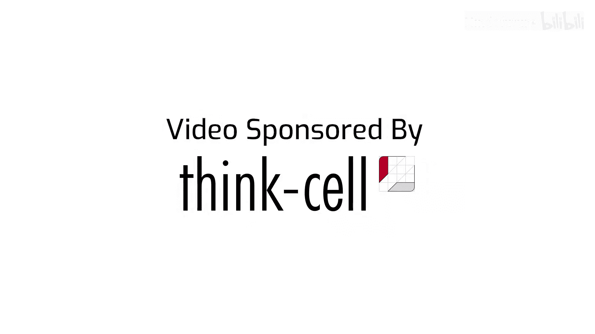
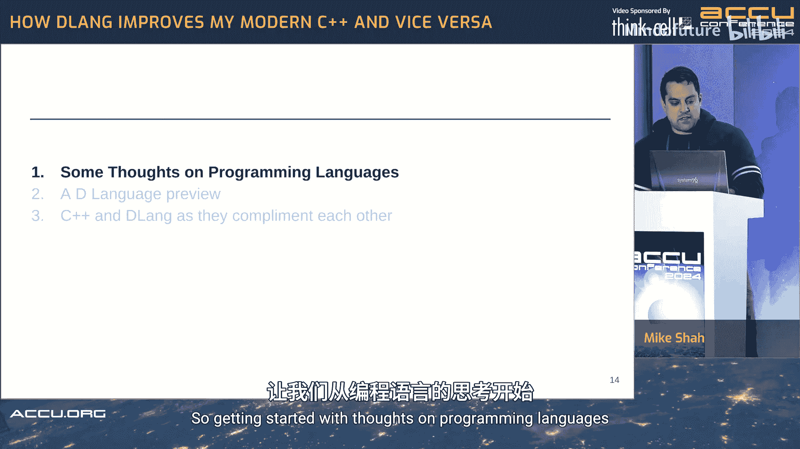
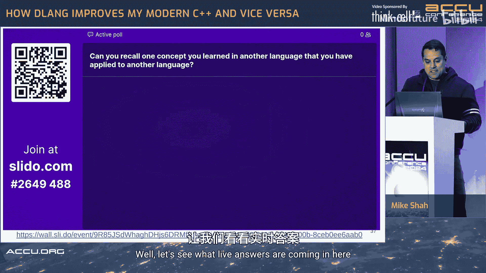
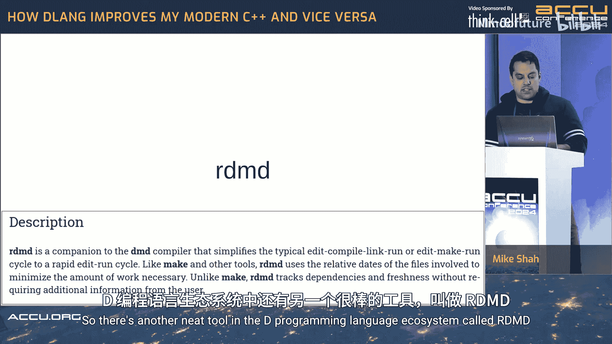
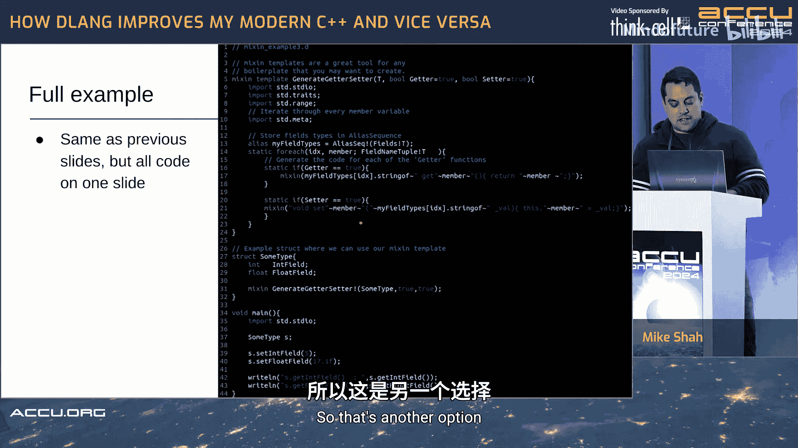
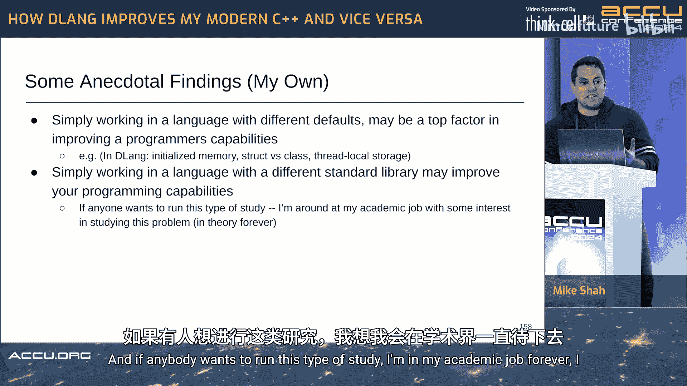
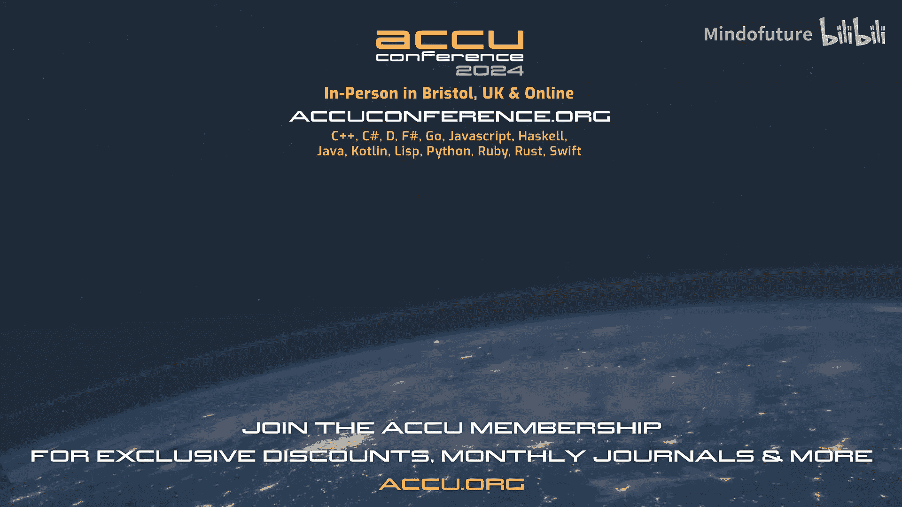

# 008：D语言如何改进我的现代C++编程，反之亦然




## 概述



在本教程中，我们将探讨D编程语言如何与现代C++相互借鉴和促进。我们将首先了解D语言的基本概念和特性，然后分析这两种语言在理念、语法和工具上的异同，最后总结学习多种编程语言对开发者思维和技能的提升作用。

## D语言与C++：P08：编程语言思考与D语言预览



### 编程语言的选择与学习价值

上一节我们概述了本课程的目标。本节中，我们来看看为何要学习多种编程语言。学习新语言能带来新视角、新范式，并帮助你更深入地理解原有语言的概念。例如，接触函数式编程可能让你在C++中更自然地使用算法和范围。

以下是学习新编程语言的一些常见原因：
*   **接触新范式**：例如函数式、逻辑式或并发编程模型。
*   **扩展视野**：理解不同语言如何解决同类问题。
*   **成为更好的程序员**：在新语言中学到的概念（如Rust的所有权模型）可以应用于主用语言。
*   **好奇心与乐趣**：探索本身就是一种动力。
*   **为工作选择合适工具**：不同领域（如游戏、数据科学、系统编程）有各自的主流语言。

### D语言初探

D语言是一种静态类型、拥有系统级访问能力且语法类似C的通用编程语言。它设计目标是让代码**写得快、读得快、运行快**。D语言由Walter Bright于1999年创建，后来Andrei Alexandrescu也加入了开发。它拥有多个编译器：参考编译器DMD（编译快），以及用于生成优化代码的GDC（GCC后端）和LDC（LLVM后端）。



D语言内置了丰富的工具链，包括包管理器`dub`、静态分析工具和代码格式化工具。它在游戏开发（如《量子破碎》的动画系统）、金融交易、科学计算等领域有实际应用。

一个简单的D语言“Hello, World!”程序如下：
```d
import std.stdio;

void main() {
    writeln("Hello, World!");
}
```
编译命令为：`dmd hello.d && ./hello`。

D语言的一个强大特性是**编译时函数执行（CTFE）**。许多计算可以在编译期完成，提升运行时性能。例如，以下代码在编译期对数组进行排序：
```d
import std.algorithm, std.stdio;

void main() {
    // 编译时排序
    immutable sorted = [5, 1, 4, 2, 3].sort;
    pragma(msg, "Finished compilation: ", sorted);
    writeln("Starting program.");
}
```
运行此程序只会输出“Starting program.”，因为排序和打印信息都在编译期完成。

## D语言与C++：P09：D语言核心特性及其与C++的互补

### D语言的核心特性

上一节我们预览了D语言。本节中，我们将深入探讨其核心特性，并对比C++中的相应概念。

**1. 内存安全与默认行为**
D语言在安全方面提供了良好的默认设置。变量默认被初始化，原始类型大小有明确定义（如`int`总是4字节）。它支持内存安全子集`@safe`，并可通过属性控制垃圾回收（GC）和内存管理。
```d
@safe void safeFunction() {
    int x; // 默认初始化为0
    // ... 安全操作
}

@system void unsafeButNeeded() {
    // 可能包含指针运算等“不安全”但必要的操作
}

@nogc void noGarbageCollectionHere() {
    // 此函数及其调用的函数不得分配GC内存
}
```
**2. 切片（Slices）**
切片是D语言中一个关键特性，它提供了一种不拥有数据的数组视图，类似于C++中的`std::span`或`std::string_view`。
```d
int[] arr = [0, 1, 2, 3, 4, 5];
int[] slice = arr[2..5]; // 包含元素 2, 3, 4
writeln(slice); // 输出 [2, 3, 4]
```
**3. 统一函数调用语法（UFCS）**
UFCS允许`a.fun(b)`被解释为`fun(a, b)`，使代码链式调用更清晰。
```d
import std.string, std.stdio;

void main() {
    string name = "  Mike  ";
    // 传统调用
    auto result1 = strip(strip(toUpper(name), " "), " ");
    // UFCS 调用 (更清晰)
    auto result2 = name.strip.toUpper.strip;
    writeln(result2);
}
```
**4. 纯函数（Purity）**
函数可被标记为`pure`，保证其没有可观察的副作用，这有助于优化和并发。
```d
pure int add(int x, int y) {
    return x + y; // 无副作用，易于在编译期求值
}
```
**5. 模板与编译时编程**
D语言的模板语法更简洁，使用`!`代替尖括号，并支持强大的编译时内省和代码生成。
```d
// 模板函数
T add(T)(T a, T b) {
    return a + b;
}
// 使用
auto result = add!int(5, 3);
// 或类型推导
auto result2 = add(5.0, 3.0);
```
**6. 混入（Mixins）**
混入允许在编译时将代码字面量插入到指定位置，是强大的元编程工具。
```d
// 定义一个包含代码的字符串
mixin(`int extraVariable = 42;`);
writeln(extraVariable); // 输出 42
```
**7. 范围（Ranges）**
D语言的标准库大量使用范围（Ranges）作为算法的基础，取代了传统的迭代器对。
```d
import std.algorithm, std.range, std.stdio;



void main() {
    auto numbers = [1, 2, 3, 4, 5];
    // 使用范围链式处理
    numbers.filter!(n => n % 2 == 0) // 过滤偶数
           .map!(n => n * 2)         // 每个元素乘2
           .writeln;                 // 输出 [4, 8]
}
```
**8. 结构体与类的明确区分**
在D语言中，`struct`是值类型（栈分配，无继承），`class`是引用类型（堆分配，有继承）。这比C++中仅默认访问权限不同更语义化。
```d
struct Point { // 值类型
    int x, y;
}

class Button { // 引用类型
    void draw() { /* ... */ }
}
```

### D与C++如何相互促进

**D语言如何改进我的C++编程：**
*   **更注重默认安全**：D默认初始化变量、强调不变性（`immutable`）等特性，促使我在C++中更关注资源管理和初始化。
*   **切片与视图**：熟练使用D的切片后，我能更自然地理解和使用C++的`span`和`string_view`。
*   **范围抽象**：D的范围模型更简单（只需`empty`、`front`、`popFront`），降低了理解C++迭代器类别和范围概念的难度。
*   **契约式设计**：D内置的`in`、`out`代码块用于前置/后置条件检查，启发了我在C++中更规范地使用断言或期待未来的契约特性。
*   **强大的编译时计算**：D默认积极的CTFE让我在C++中更积极地思考和使用`constexpr`。
*   **丰富的标准库**：D标准库包含JSON、Zip等处理模块，让我意识到C++生态中类似工具库的价值。

**C++如何改进我的D语言编程：**
*   **性能至上思维**：C++对零开销抽象和底层控制的强调，让我在D编程中也会关注汇编输出和性能分析。
*   **手动内存管理经验**：在C++中管理内存、资源生命周期的经验，让我能更好地在D中控制GC或使用`@nogc`。
*   **与C语言的互操作知识**：C++与C的紧密关系，帮助我理解并高效使用D语言内置的C编译器来集成现有C库。
*   **STL算法思想**：“信任标准算法”的C++哲学，让我能直接应用到D的丰富算法库中。
*   **庞大的生态系统经验**：配置构建系统（如CMake）、使用分析工具（如Valgrind）等C++生态技能，同样适用于D项目。

## 总结





本节课中，我们一起学习了D编程语言的核心特性，并探讨了它如何与现代C++相互补充和促进。关键要点在于，学习D语言能让你通过不同的“默认设置”和范式来思考问题，例如其强大的编译时功能、默认安全倾向和统一函数调用语法。反之，C++的底层控制能力、性能优化思维和庞大的生态系统知识也能提升你的D语言实践。掌握多种语言能让你成为一个更全面、更具适应性的开发者。鼓励你花一小时尝试D语言之旅，亲身体验这种跨语言学习带来的思维拓展。