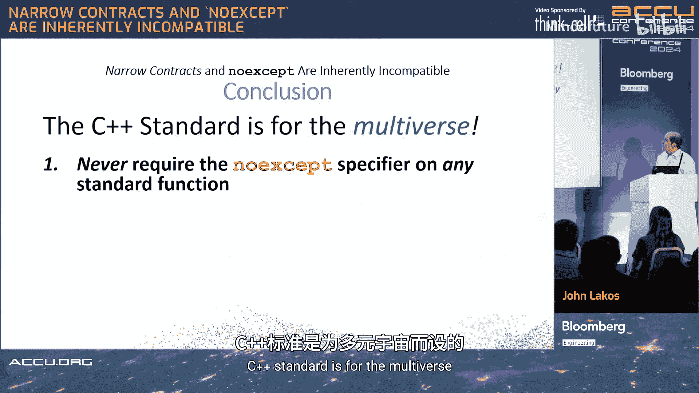

# 009：窄契约与 `noexcept` 在 C++ 中天生不兼容

欢迎来到 ACCU 大会。我是 John Lakos。我在 Bloomberg 工作。这是我首次在公开场合进行这个演讲。

这个演讲最初是在 C++ 标准委员会上，在 EWG 和库工作组的一次联合会议上提出的。它对于改变一些人对重要问题的看法起到了关键作用。我认为这是我在标准委员会上反响最好的演讲之一，即使是不太认同我观点的人也给予了肯定。你们即将听到的内容可能颇具争议，这很好。通常我会花很多时间展示幻灯片，但这次我会少讲一些，留出时间供我们讨论。我认为这很重要，但至少你们会先了解我要说的内容。

这是另一张幻灯片。这里有一条叫做 **Lakos 规则** 的准则。

有多少人听说过 Lakos 规则？前面有一些人知道。很好。

Lakos 规则不是我命名的。它是事实上的叫法，出现在马德里会议上。当时有人提出了一个叫做 `noexcept` 的“疯狂”操作符。它是在 2010 年的匹兹堡会议上提出的，因为没有它，移动语义就无法工作。

它的作用是允许我们在编译时修饰一个移动操作，并声明我们知道它不会抛出异常，这样你就可以编写更好的算法。仅此而已。

直到人们开始变得“聪明”，并注意到如果加上 `noexcept`，编译器生成的代码会少一点。当然，如果代码更小，它一定运行得更快。

于是，我们得到了一个神话：如果我给东西加上 `noexcept`，它们会运行得更快。在某些古老的异常机制上，这可能是真的。但在今天，这并不正确。事实上，零开销异常模型中的“零”，并不意味着小，而是意味着零开销。关键在于，在某个点上你必须进行分支，要么走这条路，要么走那条路。这就是那种“零”。当发生异常时，你分支到的代码在磁盘上；当没有异常时，你分支到的代码就在缓存里。所以没有额外的指令。我要直接告诉所有相信“`noexcept` 加得越多越好”的人：不。

这基本上就是整个演讲的内容。现在，我来解释为什么。

但我想让你们知道，我来这里是为了告诉你们：`noexcept` 不好，除非它能提高程序速度。如果它不能提高程序速度，那就不要用它。这就像你不会服用没有帮助的药物一样，因为它有副作用。这就是整个演讲。现在，我们将快速浏览其余部分，以便我们可以就这个话题进行辩论。

本次演示的目标是阐述 Lakos 规则。哦，我得告诉你们 Lakos 规则是什么。**Lakos 规则是：不要在窄契约上使用 `noexcept`。就这么简单，不要这样做，因为那会变得非常糟糕。**

除了移动操作，`noexcept` 在标准库规范中是不需要的。

这并不是说实现不能加上它。那是另一回事，有利有弊。

我们将讨论的是：对于标准库规范，我们想做什么？对于标准库的实现，我们想做什么？对于第三方库，我们想做什么？以及我们自己在什么时候想使用 `noexcept`？

在开始之前，我要说明，这个演讲有一半内容与异常无关。事实上，一半内容只涉及普通的语言契约。现在，我要提一下，如果你对 C++26 的契约感兴趣，我们的朋友 Timur 稍后会给你们做一个精彩的演讲，讲述我们过去六年所做的疯狂工作，甚至包括自 2012 年以来所做的工作。当时我首次为标准引入了基于宏的契约。我要告诉你们，我当时一直推进到了全体会议，然后它崩溃了，因为有人第一次听到了“宏”这个词。下一次我们尝试时，我们把它放入了语言，然后又引发了争议，因为我们想尝试做出改变，而一旦某样东西进入了语言，要改变就极其困难，于是又失败了。这都是在达成真正好东西的过程中发生的。John Spicer 和 Timur Doumler 两人共同主持了 SG21，并在管理一群非常聪明但并非总是意见一致的人方面做得非常出色。这很有趣。

另外，在契约讨论期间出现的一个直接结果是，我们一直在尝试解释的“原则设计”。这是对另外两篇论文 P3004 和 P3005 的宣传。它们解释了“原则设计”这一概念如何用于解决工程问题和其他问题，以及在 LWG 中制定策略。你可能会觉得这很复杂。是的，但如果你试图与 500 条反射器评论争论，那也很复杂。所以在某个时候，你必须撕开创可贴，真正分析它。但这次演讲不是关于原则设计的，然而，我认为原则设计对于解决涉及许多有强烈意见的人和众多解决方案的难题至关重要。

现在，我们来讨论适用于所有软件工程的东西。

## 什么是函数契约？

函数契约是一种双边协议。它通常用简单的自然语言书写。它代表了在满足前提条件的情况下所承诺的前提条件和基本行为。

现在，我想问一个问题。我会比平时讲得快一点。对于真正的初学者，我们可以把整个时间花在演讲的前半部分。前半部分相对简单明了。后半部分则一点也不简单明了。事实上，我昨天在 Bloomberg 内部讲的时候，自从写完这些材料后就没再看过。我站在 Bloomberg 的人面前，心想：我得读幻灯片了，因为我记不起为什么把这段放这里。所以昨晚，我花了大约六个小时复习那些我从未讲到的幻灯片，并添加了一些内容。哦，是的，看吧。所以这些东西很难。但都是真的。当我们讲到那些难的部分时，我会说，所有这些难的东西都是为了向你们证明这一点。如果你们想休息一下，在我用大约 20 张幻灯片来证明我刚才说的话时看看手机，请便。但请在最后我讲到真正要点时回来，然后我们会有时间辩论，这会很有趣。

## 函数契约示例

我将通过一个函数契约的例子来说明，例如 `half`。这是一个声明，这是一个契约：“返回数值上为指定 `x` 值一半的值，向零舍入。”

这是 `sqrt` 的契约：“返回一个值，其表示在数值上尽可能接近指定 `x` 的正平方根。”

这里有两个英文契约。你不知道它是如何实现的，这没关系。如果它不这样做，我们就有问题。然而，第二个有一个前提条件。它说：“除非 `0 <= x`，否则行为未定义。” 我说“行为未定义，除非”并非偶然。如果你说“行为已定义，如果”，你就是在把自己置于风险之中，因为当你说“除非”时，它可能仍然因为其他原因是未定义的，你只是说这绝对是坏的。另一种方式你说这绝对是好的。几乎总是，你会是错的。我向你保证，这非常微妙。所以请注意，“行为未定义，除非”是有目的的，并且能保护你。

## 基本行为

基本行为是什么？它必须符合明示的后置条件，但涉及更多。它涉及结果。它还遵守任何承诺的行为。例如，函数隐式地以 O(1) 时间运行，或者函数是线程安全的。所以，如果你没有说一个函数在多线程下不工作，如果出于某种原因它不工作，你其实不必说；如果它工作，你也不必说。因为某些事情错得太离谱，你必须告诉我们它是否那么“坏”。所以某些事情是隐含的。

## 实现定义的行为

实现定义的行为是指在有效域内未指定或未强烈暗示为基本的行为。那么，它的例子是什么？这里我们有一个 `point` 和一个 `sort`。契约是：“对从指定起始地址开始、长度至少为指定对象数量的连续 `point` 对象范围进行排序，使其 `X` 坐标值的表示按非递减顺序排列。”

在这个契约中，是否有实现定义行为的空间？我看到有人在点头，很好。我们会快一点。是的，这里有一个例子。在我们调用这个之后，这是一种可能的解决方案。这是另一种。

这两种都是完全符合要求的有效结果。这对大家来说有意义吗？好的，这部分我会加快速度。似乎大家都明白了。如果这对你来说很困惑，那么你可能需要回去看视频，放慢速度看。但我确实想快一点，因为我说过，我想在最后辩论。

那么这个呢？在 `half` 中是否有实现定义行为的空间？快速看一下，然后告诉我有没有空间。有人举手吗？我看到没有手。如果认为没有空间，请举手。好的，我看到后面有一些人举手，让我们看看我们是否正确。不，没有空间，好的。

那么 `sqrt` 函数呢？是否有实现定义行为的空间？好的，我看到后面有人。他的名字是 Kevlin Henney，如果他说有，那一定有。我说“不”，但带了一个星号。

那么为什么我们会这么想呢，Kevlin？哦，好的，赌注是什么？这与 `double` 的预期精度有关，“在数值上尽可能接近”可能相当模糊。好的，“在数值上尽可能接近”意味着你有一个 `double` 的离散表示，它们是量化的。如果你在一侧或另一侧，换句话说，哪个数字最接近或同样接近。这就是我们的意思。所以我要说的是，你可能在它的任一侧。至少在有些情况下，你会发现有两个同样接近的数字。我要说它们是相等的。有两个是相等的，但你必须证明这一点，而我实际上可以证明相反的情况。等等。

它可能返回正零或负零。所以你是对的。那是关于……是的，你已经赢了。你已经赢了。但我要证明这不是你想的那样。相信我。但是你没有涵盖 `double` 中一些有趣的情况。好吧，让我，让我讲到这个。我会让你知道的，但结果会出来。永远不要打断别人正在做错事的时候。好的，很好。Kevlin，如果我能同意你，我会立刻向你承认我错了。

让我们看看这个，注意 `float` 和 `long double`。这是一个略有不同的签名。我们假设 `float` 比 `double` 短，`long double` 比 `double` 长。我们就做这个假设。如果这是真的，那么绝对有空间，因为我们可以证明这是可能的，这是证明。

换句话说，我们可以选择最大的 `Z`，其平方可以精确表示为 `float`。`long double` 可以精确表示 `9 * Z * Z`，但 `float` 只能表示 `2 * Z` 或 `4 * Z`。所以我们有一个例子，它们距离相等。所以如果我们选择正确的签名，是的，但是 `double` 对 `double`，没有。我可以证明，我确实证明了。但你是对的，因为 `-0.0`。我被抓住了。

这是另一个。如果你传入 `inf` 会发生什么？如果没有指定会发生什么，对吧？`inf` 是一个数字，而 `NaN` 不是。`NaN` 会失败。所以变得非常复杂。你明白我的意思吗？我在这上面错了很多次，昨天还被指出来，因为我从未想过 `NaN`。但 `NaN` 不是问题。你赢了。现在你赢了。但我想指出，这很微妙。就在边缘，对吧。

## 观察

函数的声明告知了契约，这确实是重点。而且，Kevlin 又赢了。

关于这一点，稍后还有更多内容。

## 前提条件

前提条件必须为真：任何输入、任何相关对象或程序状态。否则，调用该函数的行为是未定义的。

未定义行为是指没有要求的行为。现在，请记住我即将谈到的矛盾之处在于：未定义行为没有要求。我们不想做的是，有一个不允许的域，然后对其施加要求，导致我们以后无法更改。记住这一点。

继续。

关于 `vector` 的前提条件。`vector` 的构造函数有任何前提条件吗？Kevlin，让你先说。`vector` 的构造函数，默认构造函数，有任何前提条件吗？我想不出。宇宙在运转，宇宙在按预期运转，你懂的，你懂的。我不再为难你了，但我必须给你这个，因为当有人说，等等，如果它分配内存怎么办？让我们希望它能。即使它分配了，它仍然是已定义的，因为如果它分配内存但失败了，它必须抛出一个 `bad_alloc` 异常。所以标准已经涵盖了这一点。这不可能发生。

`vector` 的 `capacity` 呢？有任何前提条件吗？答案是没有。它是一个 `const` 函数。

`push_back` 呢？这个难一点。`push_back` 有任何前提条件吗？你们怎么想？谁认为它有前提条件，是什么？没有吗？有人吗？前提条件，有。唉。

我能想到的一个前提条件是，如果 `vector` 达到了其理论上的最大容量，你就不能添加另一个元素。所以如果 `vector` 达到了最大理论容量……我不太确定那具体是什么意思。嗯，我是说，假设 `vector` 由两个元素组成，比如 `point` 或两个 `int`，其大小受其类型限制，比如 `uint64_t`，所以不能超过……我不熟悉如何告诉 `vector` 它的最大大小是这个。

不，我不是说你能告诉它，而是它受其实现限制。无论如何，因为 `vector` 必须存储其大小计数。`vector` 可以自发增长。无论如何，这个问题的答案是，要么 `vector` 会做，要么它会和原来完全一样，因为我们有强异常安全保证的属性，并且会抛出 `bad_alloc`。就是这样。所以答案是没有。但我想向你们展示，事情并不像看起来那么容易。

`front` 呢？`front` 是一个 `const` 函数，对吧？它做什么？返回对第一个元素的引用。那么前提条件是什么？好的，所以必须有一个第一个元素。所以答案是肯定的。

这个呢，`operator[]`？它有任何前提条件吗？是的，显然，索引必须小于 `size`。

最后，这个呢，我最不喜欢的函数 `operator at`？它有任何前提条件吗？有人认为它有前提条件吗？好的，答案是没有。它是完全定义的。没有留下任何空间。你对它做的任何事情，它都会给你一些东西。如果你越界了，它会抛出异常。

所以这些是宽契约。

猜猜是谁命名了“宽”和“窄”契约？有人知道是谁吗？是我。在 2012 年，我被告知：“John，没人会使用这些术语。” 嗯。对吧？

有人听说过“层级化”吗？猜猜是谁命名的？好吧。

## 显式前提条件

它有显式前提条件吗？有，没有。没有。那么 `sqrt` 呢？它有显式前提条件吗？看看颜色。有。

你们怎么想？这里我们不能做什么？如果我们传入 `NaN` 会怎样？如果我们检查 `x` 是否小于等于 `0` 会怎样？我们会返回 `false`。有趣的是，我们写这个的时候没想到 `NaN`，但它对我们有利，因为如果我们用另一种方式说，如果它不是……那么我们就失败了。所以总是用双重否定的方式写你的代码。

这个呢？它有隐式前提条件吗？我不会伤害你。有。有人能猜到是什么吗？这很愚蠢，甚至没人会谈论这个，但是……如果你传入一个不确定的值呢？哦，不能这样做。所以这很糟糕。我们不谈论这个，但它是一个前提条件，你不能这样做。这是未定义行为。事实上，即使函数根本没有使用它，仅仅是尝试传递它的努力，也是未定义行为。我们现在说这个吗？

所以这里有一堆我甚至不会讨论的事情。我只是把它们放在幻灯片上，不要做这些事，因为它们很愚蠢。

## 隐式前提条件

并非我们可能陈述的所有事情都必须明确陈述。要写入的参数必须处于已构造状态，要读取的参数必须处于已初始化状态。我们知道这一点，所以我们不用再谈论它了。

## 声明

好的，接下来。声明是否影响契约？显然，当你看到不同长度的东西时，你看到它会影响契约，对吧？`double sqrt` 与 `float long double sqrt` 是不同的。

声明提供了许多快速方便的信息，这就是为什么人们想把 `noexcept`、`[[noreturn]]` 之类的东西放在签名中，以便快速获取信息。问题是，有时这行得通，有时行不通；有时这太多了，所以我们将看到什么时候可以，什么时候不行。

每个参数、返回类型都是显而易见的。所以看看这个，看到所有这些噪音了吗？它们可以消失，显然这样更好。因为我们在签名中看到的任何东西，都是一个事实。那是契约的每一个部分。先写英文契约没有错，但我总是把它写在签名下面。所以那是标题，这里是文章故事的第一段。不幸的是，由于工具的原因，我们必须这样做。这对工具更好。但你必须记住，你在这里读到的内容在逻辑上遵循签名。所以你顺着 `///` 的列表往下看，你会发现 `///` 指的是什么。这是我们在 Bloomberg 的新编码标准。我不高兴，但我必须接受我不高兴的事情，因为大多数人都高兴。好吧。

继续。

## 契约式设计

有人听说过“契约式设计”吗？好的。有人听说过“里氏替换原则”吗？有没有非常、非常、非常勇敢的人想告诉我它们有什么相似或不同之处？啊哈。好的举动。

顺便说一下，维基百科帮不了你。它会对你撒谎。我不是在开玩笑，我有证据。我稍后再告诉你们。

契约式设计是一种理论。它通常应用于虚函数。它说，派生类型中的函数应该具有……不更窄的域，并且范围应该不更宽。对吧？这是基本思想。他用不同的词说过，但就是这个意思。现在，作为一个启发式方法，这通常是正确的。但它绝对不总是正确的。我们可以轻易证明。我可以给你一个类比。例如，我可以有一个在基类中具有窄契约的东西。基类函数 `f` 只对非负数有定义。并且函数的名字是返回其参数。所以函数的范围只有非负值。现在，我从中派生一个函数，其域定义在整个整数范围内。因此，其范围定义在整个整数范围内。这完全没问题。然而，有些人会说，等等，这不符合契约式设计，因为范围比域大。这就是事情出错的地方。

我再给你一个例子。假设我有一个基类，叫做 `Car`。现在，如果我从中派生 `ToyCar`，`Car` 可以从 0 加速到 60，`ToyCar` 不能从 0 加速到 60。所以人们会说这是一个糟糕的设计。我倾向于同意。但在实践中，我们一直这样做，而且有充分的理由。我可以派生 `RaceCar`，速度可以达到 180。所以显然它可以达到 60。没问题。但是如果我派生 `ElectricCar` 呢？我们有很多从 `Car` 派生的电动汽车。例如，因为我有一些东西，在我打开数据库并读入数据之前它不工作。这就像给电动汽车充电。所以我们发现，层次结构在程序的整个生命周期内并不总是有效的。但这没关系，因为有一个初始化阶段，我们给汽车充电，获取数据，然后释放线程。所以在程序的大部分时间里，它完全没问题，但在启动时不行。但编译时包括启动，所以这是无稽之谈。

所以不要相信这是一个绝对规则。把它当作你教高中生思考的东西。记住这一点。

事实证明，如果你有一个深的继承层次结构，中间可能有各种各样的混乱，但你有调用接口。假设我们有 A、B、C、D 和 E，每一个都派生自前一个。调用接口可能是 B，而实现可能是 D，派生类 D。这就是实际实现 B 的东西。无论 A、C 和 E 用英文说什么都不重要，因为它们的代码都没有被合并。所以忽略它们。只关心这两件事，然后在调用发生时在运行时执行检查。这就是 C++26 契约最终会做的，尽管我还没有说服小组里的每个人他们会这样做。那将是他们会做的，因为没有其他答案。再说一遍，这是预测，尚未达成一致。但它会发生，因为没有其他答案有意义。

好吧，我跑题了。

## 关键点

有没有人相信，如果我从一个抽象基类派生两个不同的类，那么这两个类中的函数必须表现相同？必须？不，绝对不。

那这是怎么回事？Bertrand Meyer 谈论的，实际上只是关于虚函数。当我们谈论非虚函数时，它们遵循不同的规则。在给定域内，行为必须相同。

所以虚函数是关于行为变化的。我们通常说超集，但通常当你派生一个类时，域是相同的，除非出于某种原因，你计划直接调用那个派生类，那样的话它可以有一个更宽的域，完全没问题。在基类可调用的域之外，任何事情都可能发生。

所以我想强调一下。派生类从调用者的角度来看，就像一个宽实现。就像传统的头文件和 CPP 文件一样。头文件告诉你契约是什么，而实现可以做更多。这没问题。如果一个实现在其域之外工作，这没有任何问题。它只是没有承诺它会这样做。当它没有承诺它会这样做时，不要依赖它，即使它可能救了你的命。把它想象成一个马戏团的网。你不知道网在不在那里。所以相应地行动。但如果你掉下去了，你可能还活着。这就是你应该对待契约的方式。

所以在实践中，这通常是相同的，我们很快就会讨论宽实现。

## 契约式设计的实际应用

如果你应用契约式设计，你谈论的是虚函数。你不是在谈论我们所说的结构继承。你能用它做什么？当 Stroustrup 在学校教契约时，他不能使用条件编译，因为那很糟糕，很难解释。所以他没有一个合适的契约设施。他做的是派生一个检查索引值的类，它只是隐藏了另一个类。我稍后会展示。这实际上给了你一个穷人的契约检查，但你会遇到切片问题。在这种情况下，我们谈论的是契约式设计，我们有三个不同的形状，它们计算顶点数量的方式将根据派生类型而不同。所以简单的函数 `num_vertices` 会给你不同的值。这有意义吗？

显然，当有人说 LSP，并开始谈论这些东西时，他们不知道自己在说什么，因为这不是 LSP。这是契约式设计。非常清楚，它有什么用？它是一个很好的启发式方法。它用于行为变化。这早就为人所知了。契约设施是否应该在编译时自然支持这个？答案当然是“不”，因为我们有一个多元宇宙。多元宇宙说，如果你想严格遵循契约式设计，那就去做。但如果你需要做一些不同的事情，你也可以这样做，对吧？标准必须支持多元宇宙。所以即使有人想写非常糟糕的代码，并且我知道如果他们有采用这种风格的遗留代码库并且需要继续使用它，这很糟糕，我们必须允许他们继续，并且我们必须确保契约能在上面工作，这样他们才能将糟糕的代码库迁移到更好的代码库。如果我们说，在你的代码库看起来像我的代码库之前，你不能使用契约，那我们就错过了重点。契约既是一种安全工具和正确性工具，也是一种进化工具。所以我们必须始终考虑多元宇宙。

我提到契约式设计的唯一原因是为了与我要真正谈论的内容进行对比。

我建议我们看看 Cargill，他在 90 年代初就谈到了这个。这是他在他的书中多次说过的话，他是对的。他说：“继承是为了行为的变化，数据成员是为了值的变化。” 这就是可替换性。现在，有没有人想告诉我，里氏可替换性可能与契约式设计有什么不同？没有。

好吧，我告诉你们。任何子类型 D 的对象，作为其超类型 B 的子类型，可以在任何可以使用 B 的上下文中使用，甚至更多。这是简短版本。D 在 B 的域中的行为是相同的。不是相似，不是做那种相同的事情。相同，是的，相同。所以，如果你曾经使用过 LSP 并说，嗯，行为是兼容的，不。它不是相同的。它根本不满足里氏替换原则。

所以，如果我有一个基类，我只是派生一个派生类并隐藏基类函数，就像我刚才说的，只要它们在基类的域内做同样的事情，就没有问题。

所以，如果里氏替换原则适用于任何东西，它将适用于非虚函数，而不是虚函数。我希望这很清楚。

现在，我不是在编造这些东西。就像他们说的，我有证据。

## Stroustrup 的教学方法

这是 Stroustrup 教它的方式。他创建了一个 `checked_vector`。他从中派生。他隐藏了 `operator[]`，用另一个实际上是 `at` 的 `operator[]` 来隐藏。他就是这样做的。这些是非虚函数，`checked_vector` 会捕获意外的错误。让我们看看会发生什么。

这是这里发生的情况。出了什么问题？什么？没什么，因为我还没有展示错误。现在问同样的问题，这里会出什么问题？我排序了。现在我试图打印出这些值。会打印出什么？好吧，我给你们看这个，这是打印出来的内容。咩。这是未定义的，绝对是。它并不总是打印这个，但对我来说是这样。为什么？为什么它是未定义的？我……

好吧，那是。所以这是越界，这是未定义行为。为什么是未定义行为？因为人们会犯错，我也犯过这个错误。这就是为什么我每次都使用 `for (int i = 0; i < size; ++i)` 这个习惯用法。我甚至从不想把它改成 `<=`，除非有五个人审查它。无论如何，如果我那样做了，那么会发生什么？`checked_vector` 会这样做。

所以如果我放入 `checked_vector`，它会发现这个错误。我可以修复它。问题是，如果你总是检查，你会在不需要的时候消耗 CPU 周期。所以你在测试版本中使用 `checked_vector`，然后在生产版本中把它去掉，因为一旦错误被修复，事情往往会继续工作。这不是最好的答案。最好的答案不是使用 `checked_vector`，而是使用一个采用 C++26 契约的标准 `vector` 实现。那样就好了。但无论如何，那是真正的答案。

## 为什么关心里氏替换原则？

我们为什么关心里氏替换原则？这与我们关心与 C++ 标准的向后兼容性的原因相同，对吧？我们的目标一直是让 C++03 中正确的程序在 11 中工作，11 的在 14 中工作，14 的在 17 中工作。在这个意义上，标准 11 是 03 的里氏可替换。这有意义吗？意味着每一个用 03 编写的程序表面上都将在 C++11 中运行。这是真的吗？不。但这是目标。我们同意这是目标吗？显然，这是目标。

事实上，在原则设计中，有两个原则是最重要的。第一，当我们转向新版本的标准时，我们不会改变已定义代码的运行时行为。这是不允许的。另一个是，如果我们在以前的版本中有已定义的行为，现在我们让它无法编译，这也是不允许的。为什么？因为有人会采用新标准，非常兴奋，把它放在他们的代码库上，然后他们完全正确的代码停止编译了。他们会说，见鬼，我们不采用这个了。然后你就与新版本不同步了，等等。所以这些原则就像是强制性的，并且优先级非常高。有时我们不得不这样做，但我们尽量避免，如果你明白我的意思。

## 实际的里氏替换原则

实际的里氏替换原则是什么？我打算稍微重写它，并将其应用于程序的版本，因为这是最容易理解的方式，否则当我们进入语言时，会变得很奇怪。所以，如果对于所有当前正确编写的、针对库 L 的当前版本 V 的程序 P，用 L 的 V+1 版本替换 V 不会导致任何 P 的可观察行为发生变化，那么 V+1 是 V 的可替换版本。这有意义吗？换句话说，我们说的是，如果我升级我的版本，所有旧程序都能编译并做完全相同的事情，完全相同的事情。那么新版本是旧版本的里氏可替换。我们可以做一些其他的事情，因为可以编译更多的东西。

我真的希望你们理解，这就是里氏替换。在先前版本的域内，没有行为变化的余地，一点都没有。这是 80 年代基本的软件工程。没什么花哨的，但你需要知道这些东西。

问题。你能在这里引用任何参考资料吗？我不熟悉这个定义。我有证据。是的，嗯，那不是……我有证据证明我是对的，但我现在还不打算透露。你承认这是对这个概念非常激进的重新表述吗？Barbara Liskov 在 1987 年有一篇论文，她说得非常清楚。一旦你读了 20 遍，好吧，谢谢。我确实读了 20 遍。但就像我说的，我有证据。我会讲这个故事，但我想等到辩论环节再讲。

谢谢，好的。

## 两种里氏替换

我们有两种里氏替换，我们有马基雅维利式的里氏替换，就像我要想办法，我要用人工智能，找到一种方法来证明这两件事不是你想的那样。然后还有一种，我们说，如果有人用 C++03 写一个程序，然后用 C++11 写另一个程序，并且含义不同，那将是病态的。你可以这样做，但你必须非常努力地工作才能做到，以至于在实践中永远不会发生。所以我说有理论上的里氏替换，连马基雅维利都无法获胜，然后有实践中的里氏替换，我们关心的是墨菲法则。所以如果你只是无能，不，我们需要的是有能力的人。为了原谅那一点点，必须是故意的。如果有意义的话。

无论如何，让我们看看这个。这是一个句柄。我只想说，这是一个窄契约。这是另一个不那么窄的窄契约。这是另一个宽契约。注意，我只是在契约的基础上不断构建。我没有破坏过去的任何东西。这些是里氏可替换的添加。可替换地累积使用。

所以这里有一些适用于 A1 的用法。这里有一些适用于 A2 的用法。这里有一些适用于 A3 的用法。注意，我们使用得越来越多，这是我昨晚添加的，因为我想不出我试图用这张幻灯片解释什么。每次我们使用多一点功能，契约就宽一点，你看到了吗？

看看这张幻灯片。了解一下大意。你明白了。现在这并不意味着什么。这只是我写的代码。重点是，那些红色的东西随着时间推移，使用了句柄越来越多的功能。

这是软件工程。这就是我们所做的。这是里氏替换。这不是契约式设计。

## `[[noreturn]]` 属性

现在我们有了这个美妙的 `[[noreturn]]` 属性。`[[noreturn]]` 属性是否影响函数的类型？不。

所以我要做同样的事情。看看我们这里有什么。我不能放 `[[noreturn]]`，因为在这第三个中，我决定我想返回。所以我必须去掉 `[[noreturn]]`。现在，`[[noreturn]]` 是一个优化。`[[noreturn]]` 对人们如何查询代码没有任何影响。你不能在代码中问这个东西是否从不返回。你不能问那个问题。这很好。所以这就像一个优化提示，仅此而已。所以我们把它去掉。它只是一个优化提示。你可以看到我们稳定地累积东西。

我希望我们能这样做。我们不能。但如果我们能这样做，那会更好，说：我在一个不返回的上下文中使用这个句柄。我在一个不返回的上下文中使用这个句柄。我在一个返回的上下文中使用这个句柄。就这样。这也是我昨天添加的，以便解释。这是它变得困难的地方。所以如果你们觉得这很难，我昨天也觉得很难。我也在倒时差，我的包丢了四天，前一天不得不出去更换我所有的药。别提了。但无论如何，这很有压力。丢东西。

## 考虑这两个契约

现在考虑这两个契约。哪个是另一个的里氏可替换？这不是一个陷阱问题。哪个是另一个的里氏可替换？你说都不是，那将是一个陷阱问题。是第一个还是第二个可替换另一个？Guy。

答案是第二个，因为这个唯一给你的是可能稍微好一点的代码生成。就这样。对此有什么问题吗，有？为什么？是的。它是书面的。它是契约的一部分。这里没有什么新东西。这里没什么可看的。它们是同一个函数。一个为看不到实现的人稍微优化了一下。如果编译器能看到这个的实现，它可以写出完全相同的代码。这是针对另一个翻译单元的。它只是一个优化提示。好的，好的。我只是想确保每个人，我必须为难你。我想感谢你。当然，我很乐意之后请你喝一杯，作为你在观众中的“托儿”。我需要辩论。我想念它。我真的很想念它。

稍微好一点的代码生成。

## 实现的契约

我撒谎了。实现的契约。公共契约的符合实现。这些是我们要讨论的东西，宽实现。

那么，让我们谈谈这些东西。实现的隐含契约是什么？基本上，它说的是，我看实现，弄清楚它会保证什么，然后写下来。我们不那样做。这是实现，隐含契约是什么？好的，这是一个实现。隐含契约是什么？你明白了，对吧？你看实现，写下一些东西。根据实现，你写下其他一些东西。这不是我们编码的方式，我们走另一条路，以防有人关心。

接下来我需要做什么？接口的符合实现。这是什么意思？实现实现了接口。任何可以进入接口的东西，实现都会处理。所以我把它放在那里，你们可以读，而我休息一下，喝点水。有人对这些直接的东西有什么问题吗？这是暴风雨前的平静。

这是一个符合的实现吗？我知道 Kevlin 想评论这个。我知道他想。他们会看着它说，但你可以说，那是一个符合的实现吗？谢谢。为什么不？溢出，溢出。绝对地。很多人会写这个，如果 C++29 在语言中内置了一种在运行时检查溢出的方法，那不是很棒吗？也许基于语言中的契约。是的，那将是一个好主意。也许我们可以用一个叫做标签的东西来打开它，这个标签是众所周知的，并且对所有人发布，这样任何想在不做任何工作的情况下检查他们遗留代码中这个问题的人，只需用不同的标签集重新编译他们的代码，就可以知道他们的程序中有整数溢出。我们为什么不这样做呢，Timur？我们为什么不这样做？我们为什么不继续把契约放进语言里？你会主持并让那发生吗？这样我们就可以捕获这个溢出。

这个呢？是的，好的。这个呢？这是符合的吗？这取决于舍入。如果 `a > b` 呢？你的观点很好，我们会讲到你的。这个呢？很难。我必须写一个严肃的测试驱动程序，查看从 -2 到 +2 的低范围、重叠范围和高范围，直到某个值，并确保它对每一个都有效。然后我才确定，但只有那时。但话又说回来，我已经做了几年了。所以，是的，那很快就能工作。这个对吗？是或否。是的，这个呢？是的。这个呢？所以仅仅因为它存在于库中，如果你不读契约，你可能不会成功。所以记住这一点，重用是好的，但你必须 RTFM，意思是读手册。

## 窄契约的宽实现

窄契约的宽实现是什么？宽实现说，我已经满足了契约，如果我们要在未来的语言版本中扩展契约，我也会满足那个。也许。所以你可以有一个预见未来变化的宽契约。你可以使用契约来轻松进入那些事情，就像你可以通过一个肯定的声明来缩小或扩大契约。今天你不能开这辆车超过每小时 80 英里，但我要警告你，过一会儿你不能开超过 60，这样我们就可以开始在派生类型中实现更高效的汽车。

想想看，契约可以很好地用于进化代码，这是我们的一位好朋友 Vlad 一直在使用的，这是一个重要的功能，我们不能以只遵循一个人用例的方式来限制契约。

这个呢？是的。它是。这个呢？顺便说一下，这是 C++20 契约的旧括号表示法。它现在不是这样了，但我把它留在这里，因为它非常清楚地展示了那里发生了什么。那是为什么？它是一样的。

顺便说一下，标准库函数，如果你在契约外调用一个标准库函数，这意味着你违反了前提条件，它不必调用 `std::terminate`。它实际上可以假设这永远不会被调用，并优化你的代码，进行时间旅行，并导致坏事发生。一般来说，没人在乎这个。我们一直这样做。这很好。但一旦有人开始说，等等，你要把它放在用户函数上。哦，我的天哪。然后头发就着火了。

嗯，你不会一开始就那样做。你从使用检查契约开始，强制执行。实际上，你从观察开始。如果你把它放入旧代码中，然后你发现一切都在工作，然后你把它改为强制执行。在那之后，你把它改为忽略，因为它正在工作。最后，你可以说假设，并真正从契约中获得加速。这不在 26 中，但应该是。我们还有一个叫做优化屏障的东西。一旦我们有了优化屏障，所有害怕用户代码会被时间旅行吞噬的人就能放松了。

所以就是这样。无论如何。

这是另一个。这是另一个，只是为了给你一个概念。有许多不同的可能的符合宽实现。好的是，只要它满足要求，你可以以任何你想要的方式加宽它。这就是拥有窄契约的美妙之处。

你可以等到以后的版本，当你知道应该是什么时再加宽它们。我们在契约中确定的一个原则是，如果我们到达一个点，我们同意了，然后我们想更进一步，房间里一半的人坚持必须是这种方式，另一半人坚持必须是那种方式，我们就在这里停止，说这个版本不适合，等我们有更多信息后再争论。这个原则已被证明可以解决最困难的问题，并使 MVP 得以发布，因为如果我们没有这个，我们就会停滞不前。对吧，Timur。好的，Tim。

记住，Timur 在这次演讲之后会讲 C++26 的这些内容。所以现在你有了所有的背景，并且你理解了我们是如何做出这些决定的，你实际上可以听到这些决定是什么。所以我强烈建议你留下来听接下来的演讲。

所以，再次，这是契约属性表示法。我想我之前的表示法是错的。但别担心。这已经不在里面了。我昨天放了这张幻灯片。不是这张。这是契约中的新内容，你可以把表示法放在签名上，函数上。与人们可能认为的相反，哦，是的，我们可以以不同的方式使用相同的旧契约。不，这些契约允许多元宇宙工作，因为处理契约违反有许多不同的方式。我们稍后会更多地讨论这些。以及为什么我们可能需要以不同的方式恢复。以及为什么我们可能根本不想恢复，而是立即退出。所有这些都是有效的。

是的。这就是它看起来的样子。这是今天的正确表示法吗？好的，这就是今天在 C++26 中的样子。我只是想展示一下。我昨天也放了这个。幸好我看了我的代码。所以这就是今天在 C++26 中的样子。我想每个人都能读懂。很容易写。看起来不像外星 C++，只是东西。然而，这段代码。与其它代码不同。绿色的代码不在那里。如果你在调用这个函数，你不必看那个，因为从契约中你知道我最好不要调用这个东西。

这是为了检查契约是否正确。所以你可以放在这里的所有东西通常是契约本身的一个子集，通常是一个真子集。契约管辖着 `noexcept` 说明符，这是本次演讲的一部分。

我们需要确保函数不抛出异常，这就是这个的作用，或者确保函数不抛出异常。它通常意味着函数也不会失败。但那是另一个话题，一个我不想涉及的麻烦事。我要提一下，实际上，它叫什么，你不记得我的书名了吗？是什么，现代 C++？第一个是什么？拥抱。谢谢。哦，我的脑袋满了。

所以在《安全地拥抱现代 C++》中，我们有三个章节，`noexcept` 说明符是一个第 3 章的特性，这意味着它