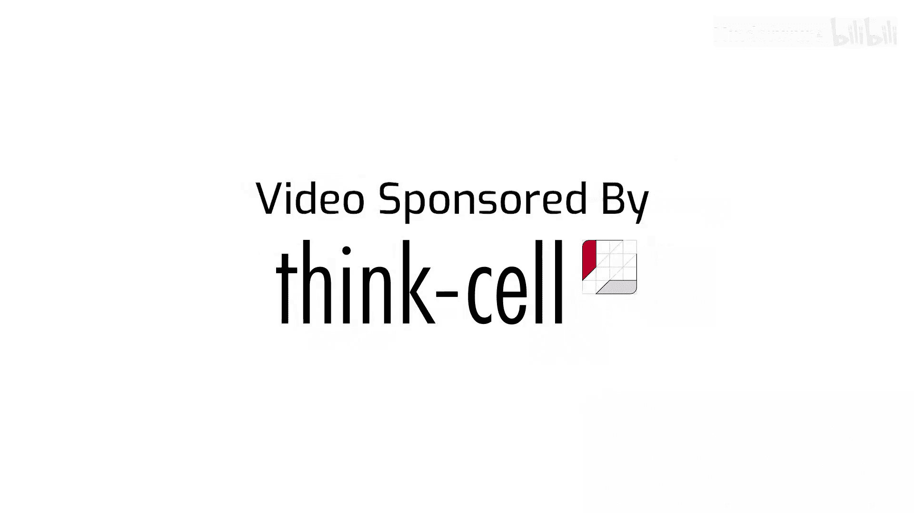
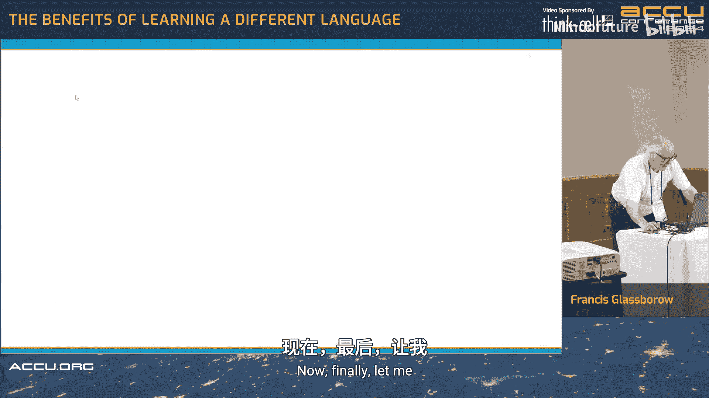
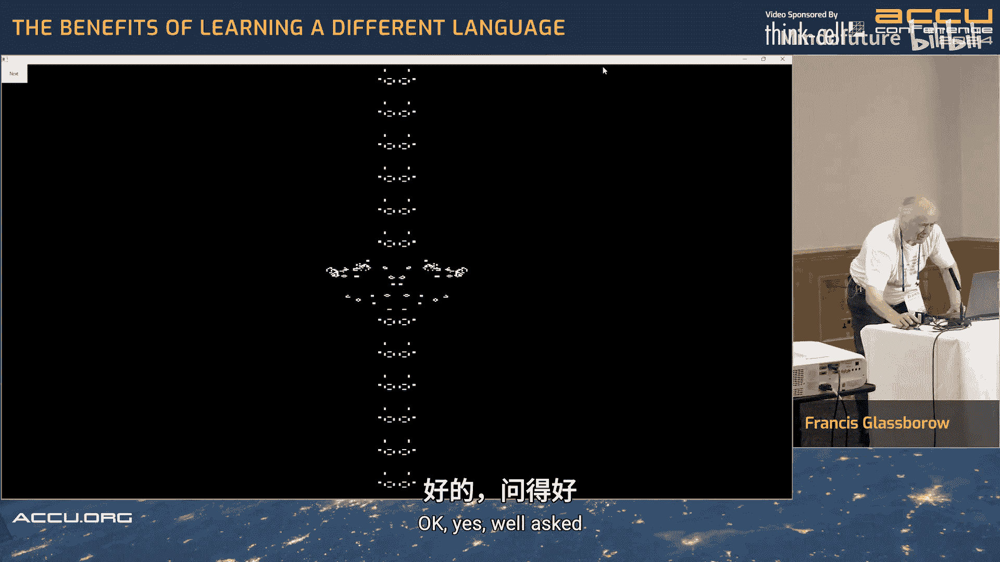
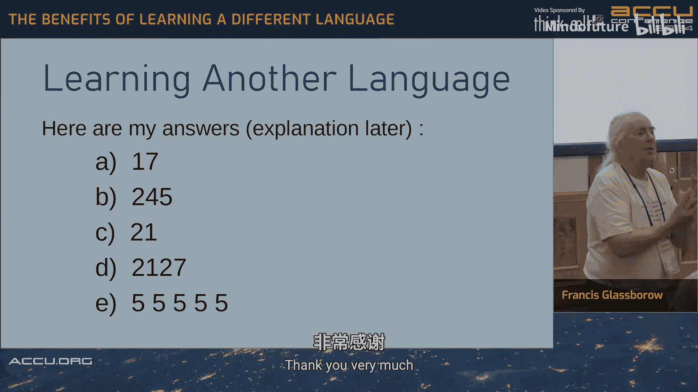
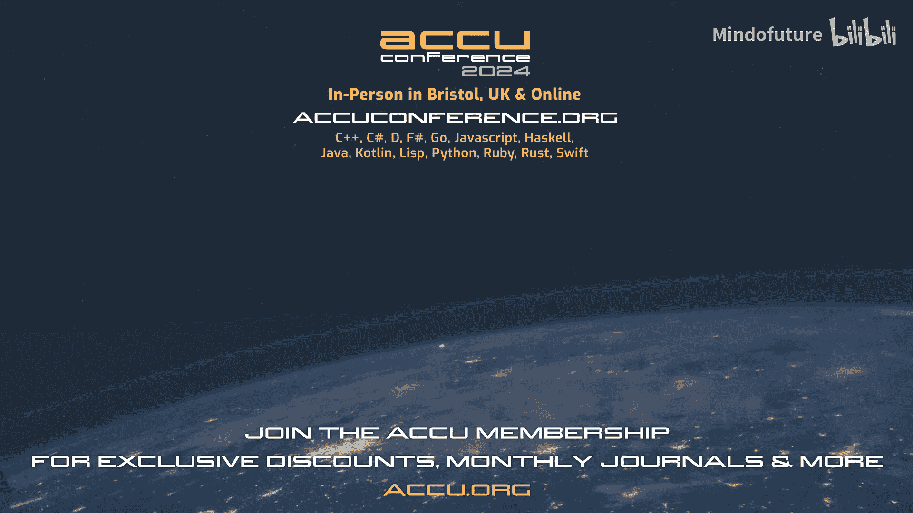

# 010：学习不同编程语言的好处




在本节课中，我们将跟随 Francis Glassborow 的演讲，探讨学习不同编程语言（包括人类语言和计算机语言）所带来的深刻见解和实际好处。我们将从人类语言学习的经验出发，逐步过渡到计算机语言，并最终通过一个具体的 APL 语言实例来展示不同编程范式如何影响问题解决的方式。

## 概述：为何学习新语言？

学习一门新语言，无论是人类语言还是计算机语言，其动机多种多样。可能是工作需要、个人兴趣、提升技能，或是为了改善解决问题的方式。不同的语言会塑造我们不同的思维方式，而接触多种语言能极大地拓宽我们的视野和理解能力。

## 从人类语言中学习

在深入计算机语言之前，让我们先看看从学习不同人类语言中能获得什么。每一种语言都教会了我一些独特的东西。

### 阿拉伯语：发音与语义结构
阿拉伯语让我理解了发音的困难。它是一种闪米特语，其音节结构（辅音-元音或辅音-元音-辅音）与印欧语系不同。更重要的是，在阿拉伯语中，**辅音承载核心含义**，元音更多是修饰。这揭示了语言如何通过不同的结构来表达意义。

### 意大利语：使用与遗忘
意大利语的经验表明，如果**没有使用的动机，语言很容易被遗忘**。这强调了在实践中巩固学习的重要性。

### 法语：语序与记忆
法语和英语虽然同属印欧语系，但基本句子的语序不同（英语是主谓宾，而法语是主宾谓）。这让我意识到语言结构的多样性。多年后，在比利时的一次迷路经历中，残存的学校法语知识帮助了我，这说明了在极端情况下，**记忆可以成为救星**。

### 拉丁语与希腊语：词汇焦点与语法结构
拉丁语中有大量关于战斗的词汇，而阿拉伯语则有至少七个表示“花园”的词。这表明**某些语言会对特定生活领域有丰富的词汇聚焦**。古典希腊语则引入了“双数”的概念（介于单数和复数之间），并使用了不同的字母表，这展示了语法和书写系统的多样性。

### 中文（汉字）：非字母文字的优势
虽然我不会说中文，但为了阅读围棋文献，我需要认识汉字。这让我认识到**基于字符的语言不依赖于发音**，其符号与声音没有直接联系。不同方言的人可以通过文字沟通。此外，中文词典通过**笔画数和主笔形**来组织，证明了非字母文字也可以有效索引。中文有限的音节也使其成为双关语的沃土，而机器翻译很难处理双关语。

### 日语：注音与表达
日语文本有时会在汉字上方标注假名（注音）。这启发了我，在文字处理中，或许可以**将两种可能的表达上下并列**，让读者自行选择，为表达提供了新的可能性。

### Pirahã 语：语言与思维
Pirahã 语（亚马逊部落语言）没有表达**第三方经验**的机制，你只能陈述自己的直接经历。这意味着这种语言无法讲述历史。这强烈地证明了**语言结构会限制所能表达的思想范畴**。

### 世界语与逻辑语：人工语言的局限
世界语基于印欧语系，并未真正全球化。逻辑语（Lojban）旨在测试“语言决定思维”的假说，但它最初十年都缺乏描述基本人类功能的词汇，这显示了设计者可能脱离日常需求。此外，认为逻辑语不能说谎也是误解，**逻辑正确不等于诚实**。

### 手语：被忽视的通用技能
手语应该成为每个人的第二语言。在嘈杂环境、工程场合或聚会中，它能实现无声的有效沟通。推广手语能带来巨大的社会效益。

上一节我们从人类语言的多样性中看到了思维如何被塑造。接下来，我们将把视角转向计算机语言，看看不同的编程范式如何影响我们解决问题的方式。

## 计算机语言类型与经验

计算机语言大致可分为低级和高级语言，但这只是一个连续的频谱。我曾用多种语言编写过程序，每种都带来了独特的教训。

### 低级语言：贴近硬件
我学习的第一种低级语言是 IBM 1130 汇编器。在仅有 8K 16位字内存、输出只能靠行式打印机的条件下，编程是巨大的挑战。我通过阅读控制台指示灯来调试占满 99.99% 资源的程序。这次经历教会我：**低级语言编程艰难，容易出错，需要极大的毅力和强烈的动机**。

### Cecil 语言：教育的启示
Cecil 是一种用于学校计算机教育的入门语言，极其简单（只有 IN， OUT， LINE， PRINT 等指令）。然而，当我让学生用 Cecil 解决一个“反转相加”回文数问题时，一位学生出色地完成了。这证明了：**解决问题的最大限制往往不是语言本身，而是程序员自身的洞察力和规划能力**。

### Plan 语言：理解系统细节
为了给 Cecil 制作一个交互式前端，我学习了 ICL 1900 的 Plan 汇编语言。我的第一个版本产生了海量的错误，因为我没理解该机器**前四个和后四个累加器的指令集是不同的**。这次教训是：**必须深入理解目标系统的架构细节**。

### Forth 语言：逆波兰表示法
Forth 使用逆波兰表示法（RPN），没有括号和运算符优先级。许多同事认为这很疯狂，但我发现，**对于年轻人（20岁以下）来说，这根本不是问题**。这挑战了“可读性纯粹是语言问题”的观念。我用 Forth 实现了一个教育程序，学生们选择了“引擎”、“活塞前进”这样的函数名，使得代码像故事一样可读。Forth 还引入了“不可命名”的概念（如用空格命名的变量），这是系统保护机制的一部分。

### 高级语言的经验教训
*   **FORTRAN**：我吃过“编译器扩展”的亏。一个使用了 IBM 扩展字符处理功能的程序在另一台“标准”FORTRAN 机器上完全无法运行。教训是：**如果希望代码可移植，请避免使用编译器特定扩展**。
*   **BASIC**：它有无数方言。我曾用一系列小型 BASIC 程序操作一个共享数据结构，成功管理了赛艇比赛结果。这展示了**简单语言结合清晰架构的威力**。SuperBASIC 则是一个被误认为不能编译的有趣变体。
*   **Pascal**：它旨在通过严格限制来防止错误。但这产生了两种程序员：一种是盲目信任编译器的人；另一种是想方设法“破解”限制的人（例如著名的“崩溃开关”）。这导致许多 Pascal 程序员转向 C 时，写出了糟糕的代码，因为他们**不了解底层、不熟悉工具、不理解“未定义行为”和“实现定义行为”**。
*   **Haskell**：它教会我**纯函数**和避免副作用的重要性。虽然副作用（如I/O）是必要的，但能区分纯函数是巨大的优势。
*   **Prolog**：它要求你彻底**扭转思维方式**，从命令式转向声明式和逻辑编程。
*   **Logo / Scratch**：Logo 的“海龟绘图”很棒，但教学常常止步于此。Scratch 则是一个杰出例子，它展示了**教师应该设定基础规则，然后让学生自由探索**。过度教学会扼杀创造力。
*   **C++**：它融合了多种范式（过程式、面向对象、泛型、函数式），这使得它强大但也复杂。在早期，许多 C 背景的“专家”并不真正理解 C++，造成了社区隔阂。**将不同范式优雅地结合起来是一项挑战**。

上一节我们回顾了各种编程语言的特点与教训。现在，让我们聚焦于本次演讲的起点——APL 语言，看看一种截然不同的编程范式如何优雅地解决特定问题。

## APL 语言：以数组为中心的思想

APL（A Programming Language）诞生于 1960 年代，使用独特的符号系统。它打破了我们惯常的循环思维。

### APL 的核心特点
*   **无显式循环**：熟练的 APL 程序员不写显式循环，操作直接作用于整个数组。
*   **两种数据类型**：只有**标量**和**数组**（数组可以有零维，即空）。
*   **右结合，无优先级**：表达式从右向左计算，运算符没有优先级。
*   **丰富的符号**：使用许多数学符号和图形符号，每个符号对应一个操作，意图明确。

### 实例：康威生命游戏的 APL 实现
生命游戏本质上是基于二维数组的演化。APL 的数组操作特性与之完美匹配。以下是生成下一代的核心逻辑（已翻译为中文注释）：

```apl
生成 ← {              ⍝ 定义‘生成’函数
    局部 上移 下移 左移 右移 计数 存活
    上移 ← 宇宙 + 1 ⌽ 宇宙    ⍝ 将宇宙数组向上旋转一行并相加
    下移 ← 上移 + ¯1 ⌽ 宇宙   ⍝ 将宇宙数组向下旋转一行并加到‘上移’结果上
    左移 ← 宇宙 + 1 ⊖ 宇宙    ⍝ 向左旋转一列并相加
    右移 ← 左移 + ¯1 ⊖ 宇宙   ⍝ 向右旋转一列并相加
    计数 ← 上移 + 下移 + 左移 + 右移  ⍝ 计算每个细胞的总邻居数
    存活 ← (宇宙 ∧ 计数=3) ∨ (计数=4) ⍝ 应用生命游戏规则：存活= (原存活且邻居为3) 或 (邻居为4)
    宇宙 ← 存活                   ⍝ 更新宇宙为新一代
    显示 宇宙                    ⍝ 调用显示函数
}
```

**代码解读**：
1.  通过旋转数组并相加，巧妙地计算出每个细胞的八个邻居之和（`计数`）。
2.  生命游戏规则被浓缩为一行布尔逻辑。
3.  **没有出现一个显式的循环**。

**优势**：
*   **简洁**：核心逻辑只有几行。
*   **易于修改规则**：例如，如果想增加“有8个邻居也能存活”的规则，只需添加一行代码。
*   **匹配问题域**：用数组操作直接模拟了基于网格的细胞自动机。

这个程序运行在一个约 1000x1000 的“环绕”宇宙中，通过鼠标移动或按钮点击来步进一代，性能表现良好。

## 总结与核心启示



本节课我们一起探讨了学习不同编程语言的深远价值。



1.  **突破思维定式**：无论是人类语言的 Pirahã 语，还是计算机语言的 Prolog 或 APL，学习它们能强迫我们**用全新的方式思考世界和问题**。
2.  **理解抽象与细节**：低级语言（如汇编）教会我们计算机的实际工作方式和对细节的苛求；高级语言让我们专注于抽象和逻辑。
3.  **工具服务于思想**：Cecil 和 Scratch 的例子表明，**语言的限制不等于程序员能力的限制**。强大的思想能在简单的工具上创造奇迹。
4.  **语境至关重要**：演讲开头的 APL 小测验警示我们，**永远不要假设你理解了一段代码**，尤其是在切换语言环境时。运算符含义、求值顺序、优先级都可能完全不同。
5.  **选择适合的工具**：APL 生命游戏的例子完美展示了**当编程范式与问题域高度契合时，解决方案会变得异常优雅和简单**。

最后，Francis Glassborow 用他向 ChatGPT 发起挑战的经历提醒我们：对于生成式 AI 提供的代码，必须保持警惕——**看起来合理并不意味着它正确或高效**。深入理解编程语言和问题本身，始终是程序员不可替代的核心能力。





---
**附：开场测验答案与解析**
1.  `5 × 3 + 1` → `5 × (3 + 1)` → `20` （APL 右结合，无优先级）
2.  `3 * 5` → `3^5` → `243` （`*` 在 APL 中是幂运算）
3.  `3 × 5 + 2` → `3 × (5 + 2)` → `21` （无优先级，右结合）
4.  `2 + 5 × 3 * 7` → `2 + (5 × (3^7))` → `2 + (5 × 2187)` → `10937`
5.  `3 + 2 ÷ 5` → `3 + (2,2,2,2,2)` → `(5,5,5,5,5)` （`÷` 在此上下文是“复制”操作符，`2 ÷ 5` 生成5个2的数组，然后标量3与数组相加）