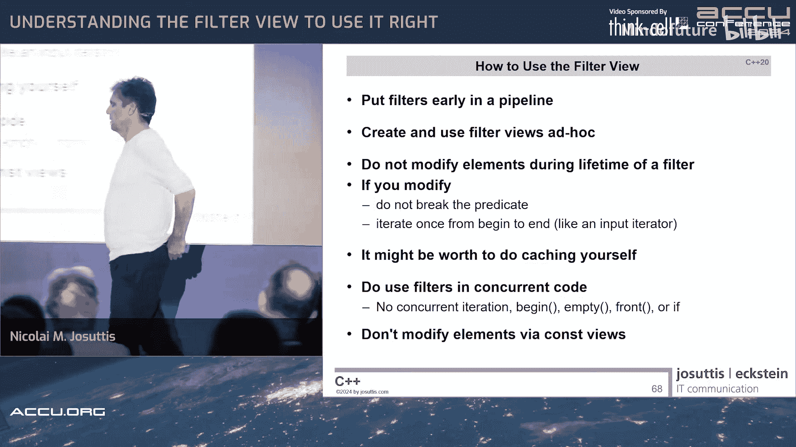

# 012：正确理解与使用过滤器视图


在本教程中，我们将深入探讨 C++20 中引入的过滤器视图。我们将了解其内部工作原理、性能特性以及在使用时必须注意的陷阱，特别是由缓存行为引发的问题。通过本教程，你将学会如何安全、高效地使用过滤器视图。

## 第12章：视图与过滤器视图简介

上一节我们介绍了本教程的主题。本节中，我们来看看 C++20 中引入的视图和过滤器视图的基本概念。

视图是一种轻量级的适配器，它允许你以不同的方式处理一个数据范围，而无需创建新的临时容器。它们遵循“惰性求值”原则，只在需要时才计算值。

一个简单的视图示例是 `take_view`，它只处理前 N 个元素。

```cpp
std::vector<int> vec{1, 2, 3, 4, 5};
auto v = vec | std::views::take(3); // 创建一个只包含前3个元素的视图
print(v); // 输出：1 2 3
```

视图可以使用管道操作符 `|` 进行链式组合，这类似于 Unix 管道，但底层模型不同。

```cpp
auto result = vec | std::views::take(3) | std::views::transform([](int i){ return std::to_string(i) + "s"; });
print(result); // 输出：1s 2s 3s
```

过滤器视图 `filter_view` 是其中一种强大的视图，它只允许满足特定谓词的元素通过。

以下是使用过滤器视图的一个例子：

```cpp
std::map<std::string, int> composers{{"Bach", 1685}, {"Mozart", 1756}, {"Beethoven", 1770}};
// 过滤出出生年份大于 1700 的作曲家，取前三个，然后只取名字（键）
for (const auto& name : composers | std::views::filter([](const auto& p){ return p.second > 1700; })
                                  | std::views::take(3)
                                  | std::views::keys) {
    std::cout << name << '\n';
}
// 输出：Mozart Beethoven
```

视图也可以是生成的，例如 `iota_view` 可以生成一个无限的整数序列。

```cpp
// 生成从1开始的整数，过滤出3的倍数，丢弃前3个，再取8个，转换为字符串
for (auto s : std::views::iota(1)
            | std::views::filter([](int i){ return i % 3 == 0; })
            | std::views::drop(3)
            | std::views::take(8)
            | std::views::transform([](int i){ return std::to_string(i) + "s"; })) {
    std::cout << s << ' ';
}
// 输出：12s 15s 18s ...
```

视图的设计目标是轻量且可廉价复制。然而，正如我们将在后面看到的，过滤器视图的一些设计决策带来了复杂性和潜在陷阱。

## 第13章：视图的内部工作原理与性能考量

上一节我们介绍了视图的基本用法。本节中我们来看看视图，特别是过滤器视图的内部“拉取模型”及其性能影响。

### 拉取模型

与 Unix 管道不同，C++ 视图采用“拉取模型”。当你创建一个视图链时，你只是声明了一系列包装器。计算只发生在你真正请求元素时（例如，在迭代循环中）。

考虑以下视图链：
```cpp
std::vector<int> vec{42, 8, 15, 23, 16};
auto v = vec | std::views::filter([](int i){ return i < 20; })
             | std::views::transform([](int i){ return -i; });
```

当 `print(v)` 开始迭代时，会发生以下步骤：
1.  调用 `v.begin()`。这个调用经过 `transform_view` -> `filter_view` -> 原始向量。
2.  `filter_view` 需要找到第一个满足谓词 `i < 20` 的元素。它从向量的迭代器开始，检查值（调用 `*it`），发现 42 不满足，于是递增迭代器（`++it`），再检查 8，满足条件。
3.  这个位置被传递给 `transform_view`，`transform_view` 只是简单地传递它（此时尚未计算变换值）。
4.  外层循环现在有了一个迭代器。当它解引用该迭代器以获取值（`*it`）时，调用再次经过链：`transform_view` 收到请求，它需要值，于是向 `filter_view` 请求，`filter_view` 向向量请求，得到值 8。然后 `transform_view` 对这个值应用变换（取负），返回 -8。
5.  循环递增迭代器时，`filter_view` 会继续寻找下一个满足谓词的元素。

**关键点**：过滤器为了找到第一个元素，可能需要对多个元素调用 `*`（解引用）和 `++`（递增）。更重要的是，**同一个元素的值可能被查看多次**：一次由过滤器用于判断是否让其通过，另一次由最终用户（或 `transform_view`）用于获取值。

如果 `transform` 在 `filter` 之前，情况会更复杂：
```cpp
auto v = vec | std::views::transform([](int i){ return -i; })
             | std::views::filter([](int i){ return i < 20; });
```
在这种情况下，为了判断元素是否通过过滤器，`filter_view` 需要值，这会触发 `transform_view` 提前计算变换值。然后，当外层循环最终要打印值时，`transform_view` **可能不得不再次计算同一个变换**。对于昂贵的变换操作，这是一个性能问题。

**性能启示**：
*   将昂贵的操作（如复杂变换）放在过滤器之后可能更高效。
*   如果过滤器前的变换成本很高，并且过滤掉很多元素，考虑先将变换结果存入临时容器，再过滤。

### 操作的复杂度

对于标准容器，`begin()`、`end()`、`size()`、`empty()` 通常是常数时间操作。但对于 `filter_view`，情况并非如此。

假设有一个向量 `vec` 和一个过滤器 `filter_view(v, pred)`。
*   **`begin()`**：必须线性搜索，直到找到第一个满足谓词的元素。**复杂度：O(N)**。
*   **`end()`**：通常只是传递底层范围的 `end()`。**复杂度：O(1)**。
*   **`size()`**：需要遍历整个范围并计数满足谓词的元素。**复杂度：O(N)**。因此，`filter_view` **不提供 `size()` 成员函数**。
*   **`empty()`**：需要调用 `begin()` 并检查是否等于 `end()`。**复杂度：O(N)**。
*   **`front()`**：需要调用 `begin()` 并解引用。**复杂度：O(N)**。
*   **`back()`**：需要从末尾反向搜索找到最后一个满足谓词的元素。**复杂度：O(N)**。

为了优化，`filter_view` 采用了**缓存**策略：第一次调用 `begin()`（或 `empty()`、`front()`，因为它们内部调用 `begin()`）后，它会将找到的起始位置缓存起来。后续调用 `begin()` 将直接返回缓存值，变为常数时间。

这被称为**均摊常数**复杂度。就像 `std::vector::push_back` 的扩容成本被均摊一样。然而，对于视图，一个常见的模式是只调用一次 `begin()`（例如在范围 for 循环中），因此这种缓存带来的好处可能不如预期。

## 第14章：过滤器视图的陷阱与正确使用指南

上一节我们分析了过滤器视图的性能特征。本节中我们来看看由其缓存等行为导致的具体陷阱和必须遵守的使用指南。

### 陷阱一：常量性与编译错误

由于 `filter_view` 会在第一次调用 `begin()` 时修改其内部缓存状态，因此调用 `begin()` 是一个**非 const 成员函数**。

这会导致一个令人困惑的编译错误：

```cpp
void print(const auto& coll) { // 参数是 const 引用
    for (const auto& elem : coll) { // 这里需要调用 coll.begin()
        std::cout << elem << ' ';
    }
}

std::vector<int> vec{1, 2, 3, 4};
auto v = vec | std::views::filter([](int i){ return i > 9; });
print(v); // 编译错误！不能在 const 对象上调用非 const 的 begin()
```
但是，直接在范围 for 循环中使用却能编译：
```cpp
for (const auto& elem : v) { ... } // 可以编译，因为 `v` 不是 const
```
**原因**：在泛型函数 `print` 中，`coll` 被声明为 `const auto&`，因此尝试在其上调用非 const 的 `begin()` 会失败。

**解决方案**：
1.  **使用 `std::ranges::subrange`**：在构造时即计算起止迭代器。
    ```cpp
    #include <ranges>
    auto sv = std::ranges::subrange(v.begin(), v.end()); // 注意：这里已经触发了 begin() 调用
    print(sv); // 现在可以工作，因为 subrange 的迭代器是值，其 begin() 是 const
    ```
2.  **使用转发引用（万能引用）**：使函数同时接受左值和右值，并避免添加 const 限定。
    ```cpp
    void print(auto&& coll) { // 转发引用
        for (const auto& elem : coll) {
            std::cout << elem << ' ';
        }
    }
    ```
3.  **按值传递视图**：因为视图设计为廉价拷贝。但需注意，这会对大型容器产生拷贝成本。可以通过约束和重载来区分视图和容器。

### 陷阱二：修改元素与未定义行为

通过过滤器视图的迭代器修改元素是危险的。标准规定：**如果修改导致元素不再满足过滤谓词，则行为未定义**。

```cpp
std::vector<int> vec{1, 2, 3, 4};
auto is_even = [](int i){ return i % 2 == 0; };
auto v = vec | std::views::filter(is_even);

// 第一次使用：找到偶数 2, 4 并修改
for (auto& elem : v) {
    elem += 2; // 2->4 (仍为偶数), 4->6 (仍为偶数)
}
// vec 变为 {1, 4, 3, 6}

// 第二次使用：缓存了 begin() 指向 4
for (auto& elem : v) {
    elem += 2; // 4->6 (仍为偶数), 然后... 缓存的下一个位置是原vec[3]即6？逻辑混乱！
}
// 结果不可预测，未定义行为！
```
第一次迭代后，元素值变了，但缓存的迭代器位置可能不再指向“下一个满足谓词的元素”。第二次迭代会产生错误结果。

**核心建议**：**不要通过过滤器视图修改元素**，除非你能确保修改后元素依然满足谓词，并且**只对视图进行一次从头到尾的遍历**。

### 陷阱三：缓存与程序状态

由于缓存依赖于首次 `begin()` 调用的时机，读取操作也可能意外地改变程序状态。

```cpp
std::list<int> lst{1, 2, 3, 4};
auto v = lst | std::views::drop(2); // drop_view 在某些情况下也会缓存

// 一个看似无关的只读操作
std::cout << "Is empty? " << std::ranges::empty(v) << '\n'; // 这里调用了 begin()，触发了缓存！

lst.push_front(0); // 修改底层容器

// 现在迭代视图，结果取决于缓存是否在 push_front 之前发生
for (auto i : v) { std::cout << i << ' '; }
```
`empty(v)` 的调用改变了 `v` 的内部缓存状态，从而影响了后续迭代的结果。这使得程序行为难以推理。

### 陷阱四：常量性传播不一致

视图的常量性语义不一致。对于引用底层容器的视图（如通过左值创建的 `filter_view`），视图本身的 const 不会传播到底层元素（你仍然可以修改元素）。但对于拥有数据的视图（如通过右值创建的，会使用 `owning_view`），const 会传播，使得元素变为 const。

```cpp
std::vector<int> vec1{1,2,3};
auto v1 = vec1 | std::views::filter(is_even); // v1 引用 vec1
const auto cv1 = v1;
// 可以通过 cv1 的迭代器修改 vec1 的元素吗？实现定义/未指定，通常可以。

auto v2 = std::vector{1,2,3} | std::views::filter(is_even); // v2 拥有数据（通过 owning_view）
const auto cv2 = v2;
// 不能通过 cv2 的迭代器修改元素，因为 owning_view 传播了 const。
```
这破坏了容器中“const 容器不提供非 const 迭代器”的常规模式。

### 使用指南总结

1.  **将过滤器置于管道早期**：尽可能先过滤，减少后续昂贵操作的计算量。
2.  **即用即创建**：避免保存过滤器视图对象并重复使用。每次需要时重新创建视图链。
3.  **避免修改元素**：不要通过过滤器视图修改元素。如果必须修改，确保不违反谓词，并且仅进行一次遍历。
4.  **注意性能特征**：了解 `begin()`、`empty()` 等操作可能是线性复杂度。在性能关键处，考虑手动缓存起止迭代器（例如使用 `subrange`）。
5.  **避免在并发中使用**：绝对不要在多个线程中同时调用同一个过滤器视图的 `begin()`、`empty()`、`front()`，因为缓存修改不是线程安全的。
6.  **小心常量性**：意识到 const 视图的语义可能不一致，依赖于视图的创建方式。
7.  **理解编译错误**：遇到关于 const 和 `begin()` 的编译错误时，知道是因为缓存机制，并采用上述解决方案之一。

**结论**：过滤器视图是一个强大的工具，但它的设计（特别是缓存）引入了显著的复杂性、非常规的语义和潜在陷阱。在使用时，必须充分了解其机制，并严格遵守上述指南，以避免运行时错误和未定义行为。对于团队项目，需要评估是否将这些知识普及给所有开发者，或者限制其使用范围。

---
**本节课中我们一起学习了**：
1.  C++20 视图和过滤器视图的基本概念与语法。
2.  视图内部使用的“拉取模型”及其性能影响，特别是元素可能被多次求值。
3.  过滤器视图各项操作的时间复杂度，以及缓存带来的“均摊常数”复杂度。
4.  使用过滤器视图时的主要陷阱：由缓存导致的常量性问题、修改元素引发的未定义行为、缓存对程序状态的意外影响，以及常量性传播的不一致性。
5.  安全高效使用过滤器视图的一系列具体指南和最佳实践。




通过理解这些底层原理和约束，你将能够更好地驾驭 C++ 标准库视图，编写出既强大又健壮的代码。