# 013：C++合约提案详解


## 概述

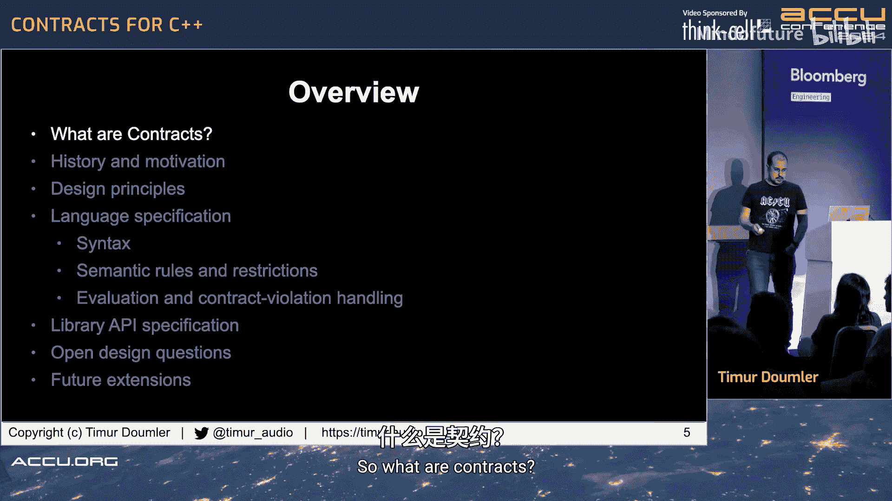

在本教程中，我们将学习C++合约（Contracts）的概念、历史、设计原则以及当前提案（P2900R6）的具体内容。合约是一种用于指定软件组件接口的正式、精确且可验证的规范，主要包括前置条件、后置条件和不变式。本教程将详细介绍如何通过语言特性在C++代码中表达这些合约断言，并探讨其运行时检查机制、设计考量以及当前委员会讨论中的开放性问题。

---

## 什么是合约？

合约是软件设计中的一个概念，由Bertrand Meyer在80年代提出。它允许为软件组件的接口指定正式、精确且可验证的规范。这些规范主要包括前置条件、后置条件和不变式，它们共同构成了“合约”，类似于商业合同中的条件和义务。

合约是一组表达对正确程序期望的条件。如果合约未被满足，则程序不正确。

函数合约是函数调用的一种合约，分为两部分：前置条件和后置条件。

*   **前置条件**：是合约中调用者一侧的部分。调用者必须满足这些条件，程序才是正确的。这些条件是对传入参数或函数调用时可见的其他状态的要求。
*   **后置条件**：是函数实现本身负责满足的合约部分。它规定了函数保证的内容，可能是返回值或函数返回后可观察到的其他状态。

还有其他类型的合约，如类不变式和循环不变式，但本提案目前不包含它们，因此我们将重点讨论函数合约。

### 术语

*   **宽合约**：函数没有前置条件。
*   **窄合约**：函数有前置条件。
*   **合约内调用**：满足前置条件的调用。
*   **合约外调用**：不满足前置条件的调用。合约外调用是一个错误，也称为**合约违规**。

### 合约违规与错误处理

合约违规不是错误。错误是来自外部的、不依赖于代码的问题，如数据损坏或内存不足。合约违规是代码中的错误，是程序中的缺陷。因此，必须将错误处理与合约违规处理分开，它们是完全不同的事情。

### 谁对合约违规负责？

*   如果是前置条件违规，责任在于函数的**调用者**。
*   如果是后置条件违规，责任在于函数的**实现者**。
*   对于类不变式，责任在于类的实现。
*   对于循环不变式，责任在于循环体的实现。

### C++标准库中的合约违规

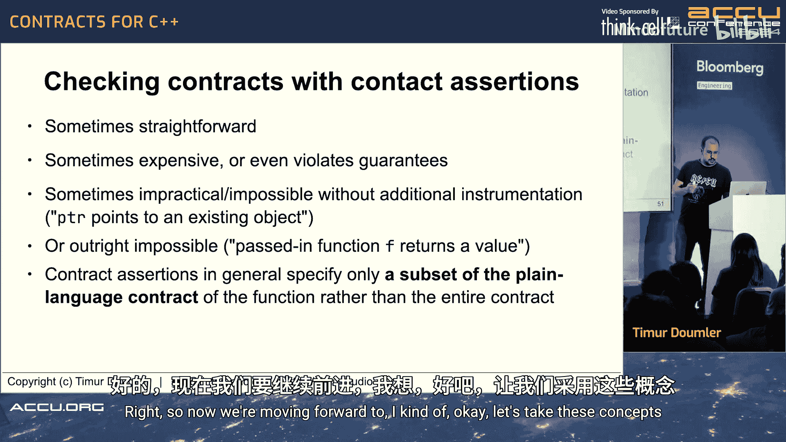

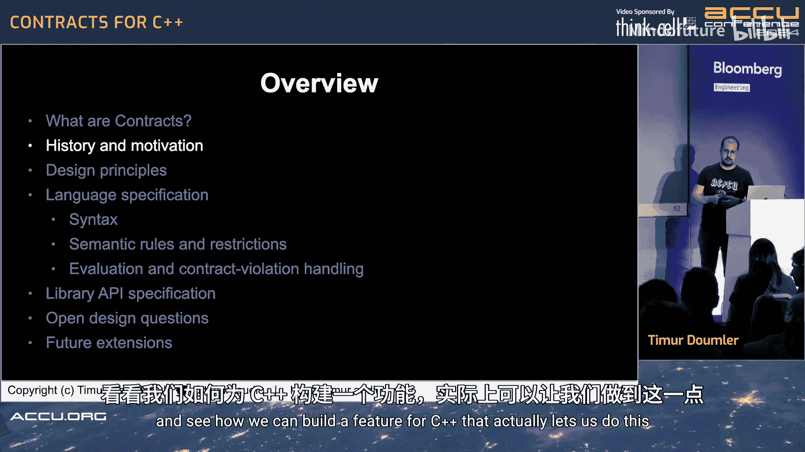

在C++标准库中，违反前置条件会导致**未定义行为**。标准不区分库的未定义行为和语言的未定义行为，都是未定义行为。例如，使用越界索引调用 `vector::operator[]` 会导致未定义行为。对于后置条件违规，那是标准库实现中的错误，超出了标准文档的范围。

---

## 如何指定合约？

### 纯语言合约

通常，合约在文档或函数规范中以纯语言形式指定。常见方式包括源代码注释、单独的规范文档，或隐含的约定（如线程安全）。我们称之为**纯语言合约**。

### 合约断言

另一种方式是在代码中指定合约。当使用某种语法将合约的一部分在代码中表达出来时，我们称之为**合约断言**。

区分“合约”（泛指）、“纯语言合约”和“合约断言”非常重要。合约断言是使用编程语言特性在代码中表达的合约规范。支持这种功能的语言或库特性称为**合约设施**。

当前提案（P2900R6）的目标是为C++添加一个作为语言特性的合约设施，允许在代码中表达合约断言。

### 合约断言与纯语言合约的关系

合约断言通常**并不**表达函数的全部纯语言合约，这在一般情况下是不可能的。合约断言表达的是纯语言合约中特定条款的一个子集。

我们通过一个算法来验证合约的某个条款是否被遵守或违反，这称为**合约检查**。在当前提案中，表达这个算法的方式是一个布尔表达式，它评估为真或假，我们称之为**合约谓词**。

有时，检查合约在计算上非常昂贵，或者检查行为本身会违反合约的其他部分（例如，检查二分查找的输入是否已排序是O(n)操作，违反了函数的对数复杂度保证）。有时，检查甚至不可能（例如，验证指针是否指向有效对象，或验证函数是否会停止）。

因此，合约断言通常只指定纯语言合约的一个子集，这一点非常重要。

---

## C++为何需要合约设施？

C语言已经有一个合约设施：`assert` 宏。它可以表达前置条件、后置条件断言并在代码中检查它们。但它非常有限：

*   无法在函数声明（接口）上放置前置条件检查。
*   无法自定义检测到违规时的行为。
*   没有关于违规的程序化信息。
*   它是宏，存在诸多问题（如宏展开、ODR违规等）。

因此，C++需要一个作为语言特性的合约设施，而不是基于宏的库特性。这样我们可以：
*   在声明上放置前置/后置条件。
*   实现跨代码库、跨API的可移植使用。
*   自定义行为而不违反ODR。
*   避免宏忽略代码导致的位腐烂问题。
*   获取程序化的违规信息。
*   让工具（如IDE、静态分析器）能够识别和处理它们。

---

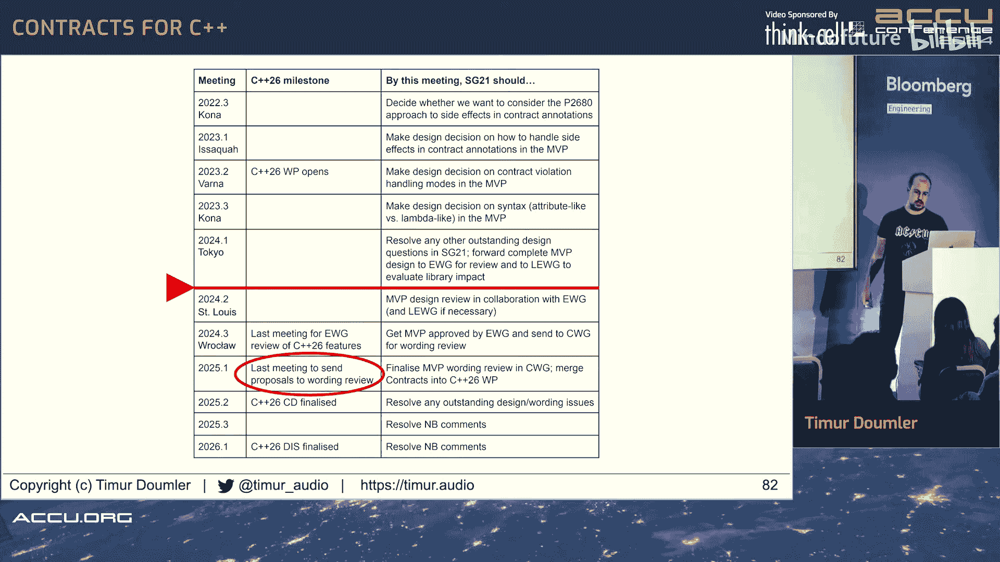

## 历史与动机

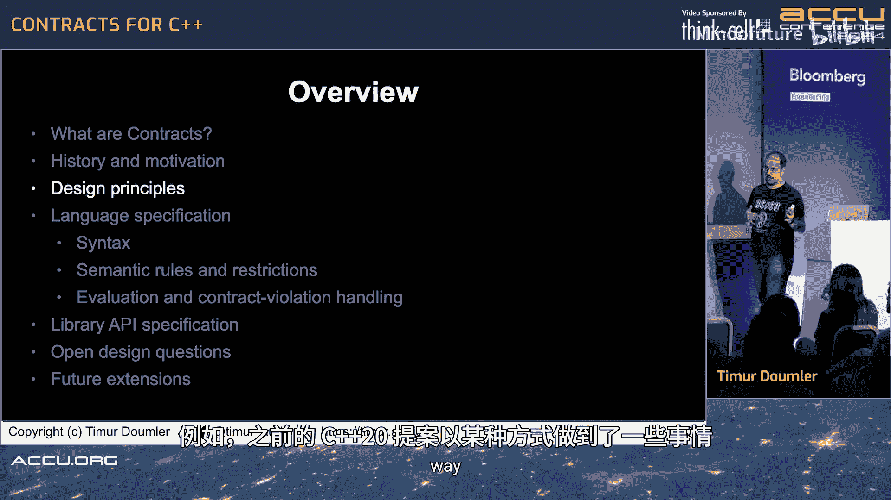

将完整的合约设施作为语言特性引入C++的努力已有约20年历史：

1.  **第一阶段（约2004年）**：由Torsten Ahlers首次提出，灵感来自D语言，但最终未能推进。
2.  **第二阶段**：由John Lakos等人推动，尝试标准化类似其BDE库中的宏/宏类实体，但最终因委员会不希望标准库中出现类似宏的东西而失败。
3.  **第三阶段（至2019年）**：多方合作，提出了使用 `[[expects]]`、`[[ensures]]`、`[[assert]]` 等属性的语法。该特性曾进入C++20工作草案，但在科隆会议上因一些问题被激烈争论后，最终被整体移除。
4.  **第四阶段（当前）**：即“合约MVP”（最小可行产品）提案。在科隆会议后，委员会成立了专门研究合约的研究组SG21。SG21首先收集了196个合约用例，并将其归纳为五大类：
    *   **代码自文档化**：在代码而非纯语言中记录合约。
    *   **运行时检查**：像 `assert` 一样在运行时检查。
    *   **静态分析**：供静态分析工具使用。
    *   **形式化验证**：用于形式化证明。
    *   **优化假设**：告诉编译器假设条件为真以进行优化。

委员会意识到无法一次性满足所有需求（“下金蛋的羊毛猪”问题），也需避免各方意见不一导致无法前进（“天鹅、梭子鱼和虾”的寓言）。因此，决定先推出一个**最小可行产品（MVP）**，它不满足所有用例，但为可扩展性而设计，为足够多的人提供直接价值，其余功能可在后续版本（如C++29）中添加。

当前提案的最新公开版本是P2900R6（截至2024年4月）。SG21已同意该设计，并已提交给更高级别的演进工作组（EWG/LEWG）审议。目标是在C++26中纳入此特性。

---

## 设计原则

合约MVP的设计遵循以下核心原则：

### 1. 合约断言用于发现现有程序中的错误
添加合约断言不应改变程序的编译时语义，否则你检查的将是另一个程序。具体包括：
*   **合约注解不应被概念看到**：不应影响概念是否满足。
*   **不应影响重载决议**：添加断言不应导致选择不同的重载。
*   **不应影响 `noexcept` 运算符的结果**。
*   **零开销原则**：被忽略的合约断言不应导致额外的对象拷贝/析构或其他代码执行。
*   **语义独立性**：标准中不应提供在编译时检测检查是否开启的设施（反射除外，但C++26的反射不计划包含此功能）。

### 2. 与现有代码兼容
*   **不引入新的未定义行为**：添加合约不应引入原本不存在的UB。
*   **不破坏ABI**：在函数声明中添加前置/后置条件不应改变其ABI。

### 3. 合约断言与纯语言合约的关系
*   前置/后置条件说明符指定的是该函数纯语言合约的一个子集，而非其他函数的合约。
*   对于模板特化，不会自动继承主模板的合约断言。
*   合约断言既不是接口的一部分，也不是实现的一部分，而是连接两者的桥梁。
*   **合约断言不用于控制程序流**：它们用于发现错误，而非进行错误处理或输入验证。如果需要总是执行的操作，请使用 `if` 语句。合约断言的关键区别在于，是否关闭检查的决定是在编译程序时做出的，而不是在代码中。

### 4. 为可扩展性而设计
当遇到不确定如何实现或可能耗费大量时间的功能时，提案选择暂时不包含它，但保持设计开放，以便未来添加。当无法在两种方案中做出选择时，则将其定为**病式**，而非未指定或未定义行为。

---

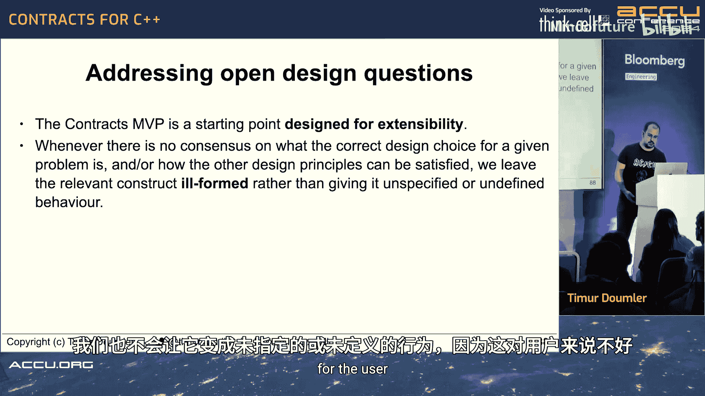

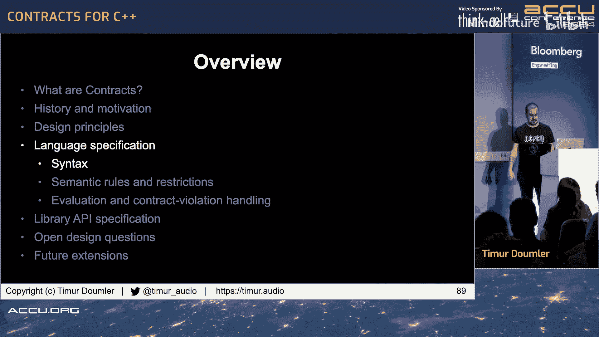

## 提案详述：语法与语义

### 合约断言种类

提案引入了三种合约断言：

1.  **前置条件断言**：使用 `pre` 关键字。
    ```cpp
    void f(int x) pre(x > 0);
    ```
2.  **后置条件断言**：使用 `post` 关键字。可以可选地为返回值命名（如 `r`），以便在表达式中引用。
    ```cpp
    int g() post(r: r >= 0); // ‘r’ 指代返回值
    bool empty() post(size() == 0); // 不涉及返回值
    ```
3.  **断言语句**：使用 `contract_assert` 关键字。它是一个语句，不能用作表达式。
    ```cpp
    void h(int* p) {
        contract_assert(p != nullptr);
        // ...
    }
    ```

`pre` 和 `post` 是**上下文关键字**，仅在特定语法位置被识别为合约断言，不会破坏现有代码。`contract_assert` 是一个**完整关键字**。

**术语**：
*   前置条件断言和后置条件断言统称为**函数合约断言**。
*   所有三种统称为**合约断言**。

### 函数合约断言详解

**前置条件**和**后置条件**是概念性的纯语言合约。
**前置条件断言**和**后置条件断言**是代码实体。
它们的区别在于评估时机和责任方。有时可能用后置条件断言来检查概念上的前置条件（如果事后检查更便宜），这是允许的。

**放置位置**：
*   可以放在函数和函数模板上。
*   必须放在函数的**首次声明**上。如果已有声明，后续定义上可以放置，但可选。
*   如果返回类型是 `auto`，则必须放在首次声明（也必须是定义）上。
*   可以放在lambda表达式上，应用于其闭包类型的 `operator()`。
*   **不能**放在 `=delete` 的函数、首次声明即 `=default` 的函数、虚函数、函数指针或协程上。（虚函数支持是当前开放问题）。

### 语义细节

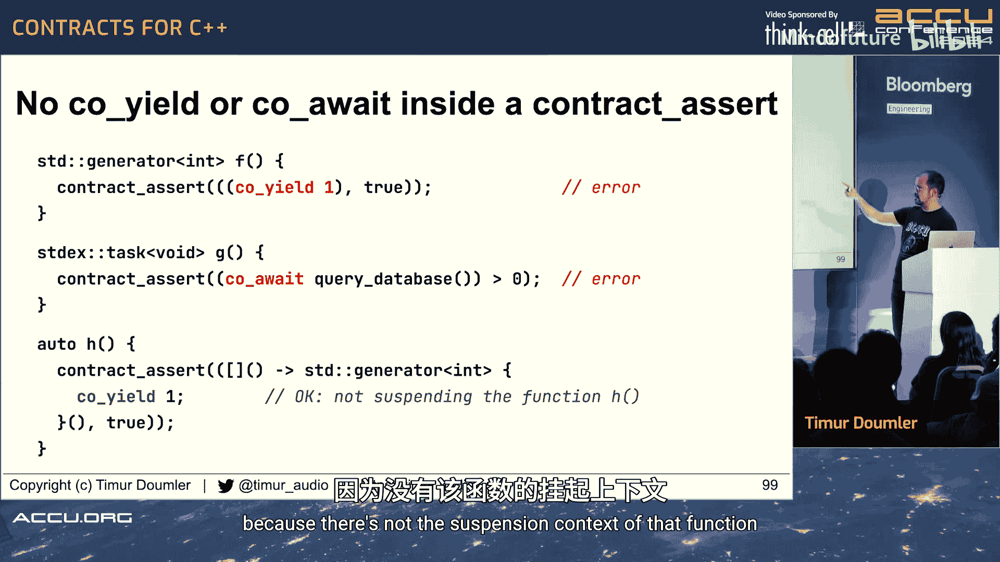

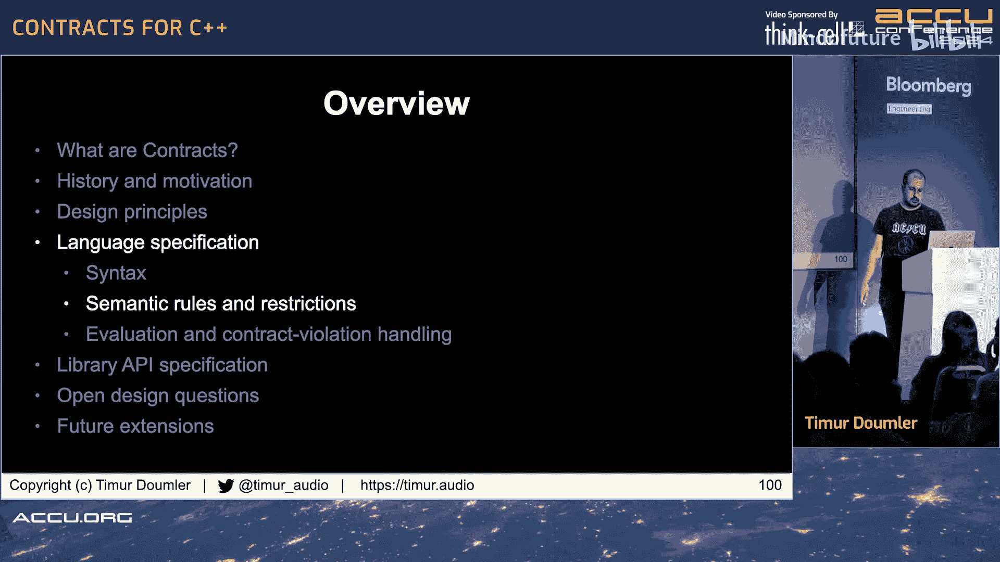

*   **名称查找和访问控制**：对于 `pre` 和 `post`，名称查找和访问控制如同它们是函数体的第一条语句。因此，可以访问私有成员。
*   **局部变量隐式为 `const`**：在合约断言谓词中，局部变量被视为 `const`，不能修改。
*   **后置条件中引用返回值**：使用 `post(r: ...)` 中的 `r`。它类似于结构化绑定中的名称，是返回对象的另一个名称。它也是隐式 `const` 的。
*   **后置条件中引用参数**：任何在后置条件中引用的参数必须声明为 `const`，以防止函数体修改参数值使得后置条件无意义。
*   **Lambda捕获**：如果合约断言中的名称会触发lambda的隐式捕获，则该程序是**病式**的。这是为了防止添加未检查的断言也改变lambda类型（如使其非可平凡复制）或引入额外拷贝。显式捕获或引用静态变量是允许的。

### 评估时机

*   **前置条件断言**：在函数调用时，参数初始化之后，函数体执行之前评估。
*   **后置条件断言**：在函数返回时，返回值初始化之后，局部变量析构之后，参数析构之前评估。
*   **断言语句**：在程序执行到该语句时评估。

### 评估语义

每个合约断言可以具有以下四种评估语义之一：

1.  **忽略**：不执行任何操作。
2.  **观察**：检查布尔表达式，如果失败，调用**合约违规处理程序**，然后**继续执行**。
3.  **强制**：检查布尔表达式，如果失败，调用**合约违规处理程序**，然后**终止程序**。
4.  **快速强制**：检查布尔表达式，如果失败，**立即终止程序**，不调用处理程序。

**忽略**语义是不检查的语义。**观察**、**强制**和**快速强制**是检查的语义。**强制**和**快速强制**是强制执行的语义。

选择哪种语义是**实现定义**的。标准不规定构建模式或标志。但提供了**推荐实践**：实现应提供一种所有合约断言都被忽略的模式，一种所有断言都被强制执行的模式，并且强制模式应为默认模式（类似于 `assert` 在调试构建中的行为）。

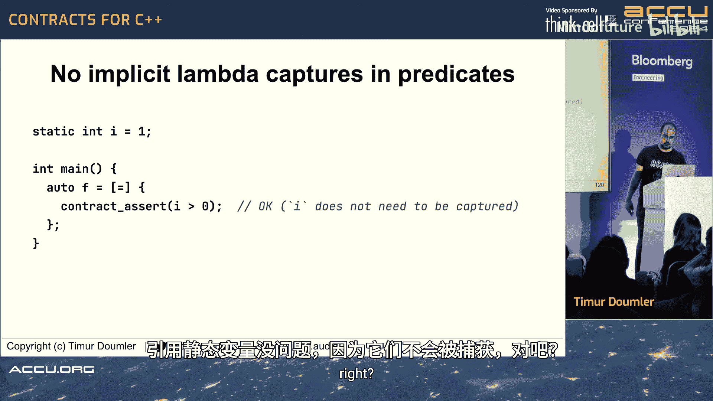

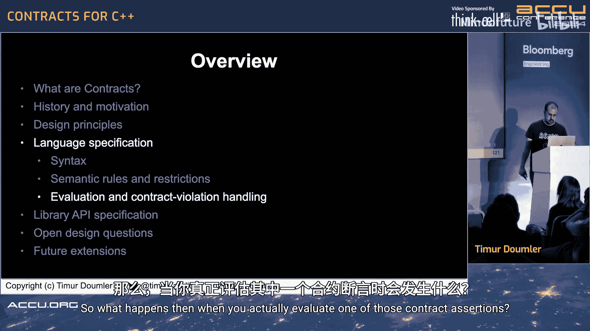

### 谓词评估结果

评估合约谓词时，可能发生四种情况：
1.  **谓词评估为 `true`**：无违规。
2.  **谓词评估为 `false`**：发生合约违规。
3.  **谓词评估抛出异常**：评估未完成。这被视为合约违规（调用相同的处理程序）。
4.  **控制流离开**（如 `longjmp`）：程序行为随之而定。

### 合约违规处理程序

当在**观察**或**强制**语义下检测到违规时，会调用**合约违规处理程序**。

处理程序是一个名为 `handle_contract_violation` 的全局函数，接受一个 `const std::contract_violation&` 参数，返回 `void`。标准库不提供声明，但有默认实现（推荐实践是打印信息到标准错误）。该函数是**可替换的**（类似于 `operator new`），用户可以在链接时提供自己的定义。

用户自定义的处理程序可以记录违规、上报、设置断点、抛出异常（需注意 `noexcept` 边界）等。也可以选择调用默认处理程序。

### 常量求值中的合约断言

如果函数在常量求值上下文中被调用，合约断言也会在编译时检查。如果谓词不是常量表达式，断言本身仍是常量表达式，但违规会导致程序**病式**。有一系列规则确保添加合约断言不会改变某个初始化是在编译时还是运行时发生。

### 递归合约违规

提案选择**不阻止**递归违规。如果处理程序中的代码触发了另一个合约违规，将递归调用处理程序。这比在违规处理期间禁用所有检查更安全（后者会使处理代码在无检查状态下运行）。

---

## 库API

提案包含一个最小的库API，主要用于实现自定义违规处理程序。

所有内容位于命名空间 `std` 中（是否使用嵌套命名空间 `contracts` 尚有争议）。

核心类是 `std::contract_violation`，其API包括：
*   `source_location location()`：违规发生的位置。
*   `string_view comment()`：违规谓词的文本表示。
*   `contract_violation_detection detection()`：违规是如何检测的（谓词为假？抛出异常？）。
*   `contract_semantic semantic()`：断言语义（观察或强制）。
*   `contract_kind kind()`：断言种类（前置、后置、断言语句）。

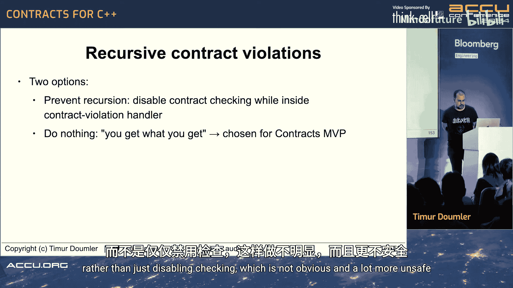

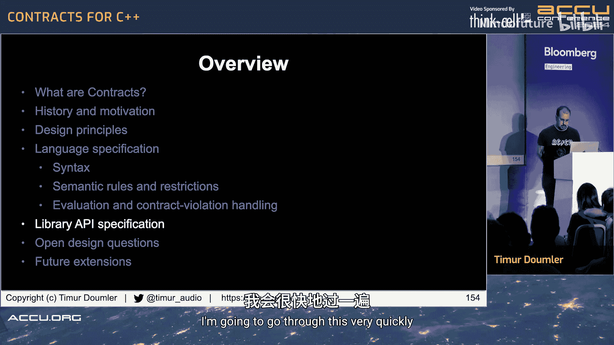

此外，还有函数 `std::default_contract_violation_handler()` 供自定义处理程序调用默认实现。

标准库本身**不要求**使用合约断言，但允许实现内部使用。

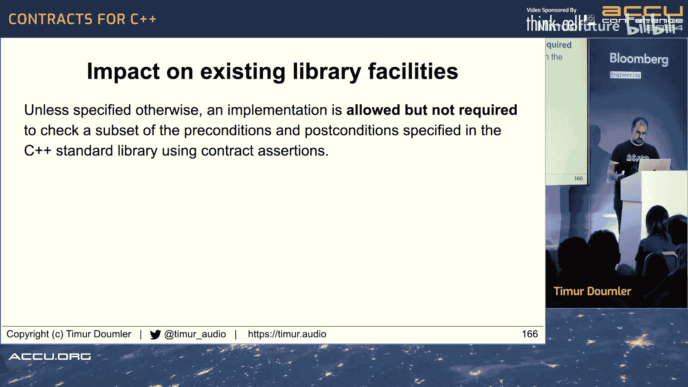

---

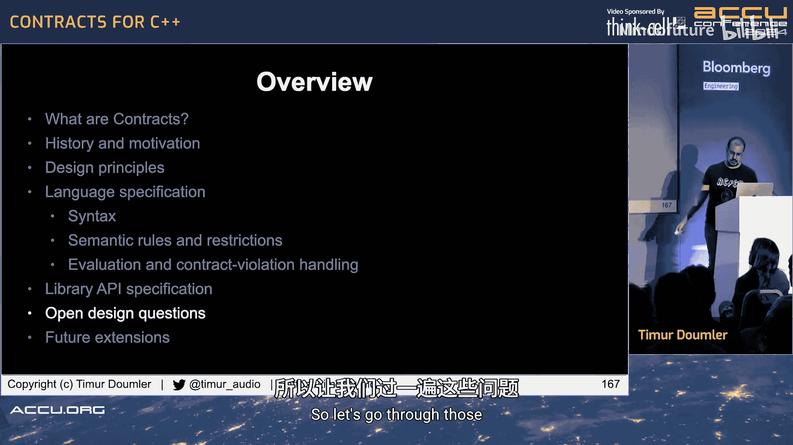

## 当前开放设计问题

SG21同意当前设计，但演进工作组（EWG）提出了一些需重新讨论的关切点：

1.  **未定义行为（UB）与合约**：
    *   **情况A**：函数体有UB（如解引用空指针）。如果使用**观察**语义，编译器可能基于“UB不会发生”的假设，将包括前置条件检查在内的所有代码优化掉。
    *   **情况B**：谓词本身包含UB（如整数溢出）。编译器可能基于UB假设，推断谓词永远为真，从而消除检查。
    *   **问题**：是否及如何缓解？可能引入“优化屏障”概念，或限制谓词为无UB的子集。

2.  **是否允许省略或重复断言评估**：
    *   当前提案允许编译器在能证明结果时省略谓词评估，并且评估可能发生多次（例如，调用方和被调用方都检查）。
    *   **反对理由**：如果谓词有副作用（如递增计数器），行为将不可预测，无法从现有断言宏迁移。
    *   **支持理由**：允许重复评估是实现跨二进制兼容性所必需的，且能阻止依赖副作用的谓词。

3.  **是否允许违规处理程序抛出异常**：
    *   **支持理由**：某些场景（如金融交易）不能直接终止，抛出异常是唯一可移植的恢复方式。
    *   **反对理由**：任何断言都可能抛出，且与现有 `noexcept` 代码不兼容。

4.  **是否允许在编译时观察或忽略合约违规**：
    *   如果编译时已知违规，是否应总是报错？关闭编译时检查可能需要宏，但开启可能增加编译时间。

5.  **虚函数支持**：
    *   当前MVP不支持虚函数。EWG认为没有虚函数支持可能不够“可行”。解决方案复杂，但正在讨论中，可能加入MVP。

---

## 未来扩展

以下功能明确不在当前MVP中，但计划未来添加：
*   类不变式。
*   循环不变式。
*   按断言种类、来源文件等细粒度控制语义。
*   编译时断言（`static_assert` 风格）。
*   假设模式（用于优化）。
*   条件谓词中的 `requires` 子句。
*   更多自定义选项。

---

## 总结

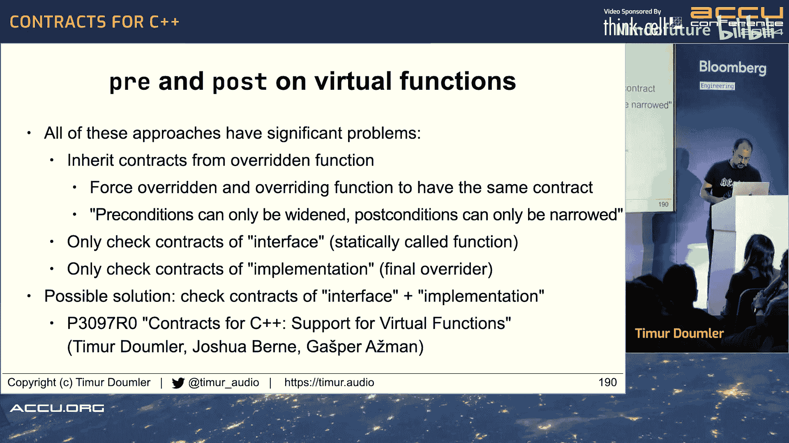

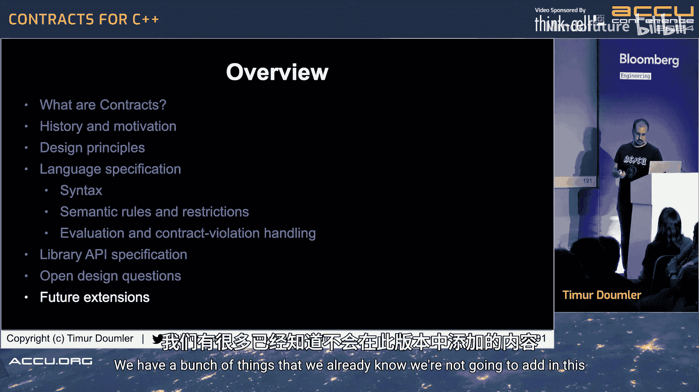


本节课我们一起学习了C++合约提案的核心内容。我们了解了合约的基本概念、历史背景以及当前MVP提案的设计原则和具体规范。提案旨在提供一种强大的语言特性来替代传统的 `assert` 宏，支持前置条件、后置条件和断言语句，并允许自定义违规处理。虽然还有一些开放问题需要委员会进一步讨论，但该特性有望为C++程序员提供更佳的错误检测和代码文档化工具，并可能成为C++26标准的一部分。