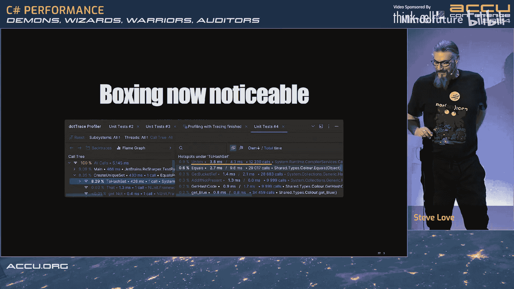

# 014：性能恶魔、巫师、战士与审计员


在本节课中，我们将学习C#性能优化的核心概念，特别是关于值类型、哈希码和集合性能的关键知识。我们将通过实际示例，对比不同实现方式的性能差异，并理解如何避免常见的性能陷阱。

## 概述：性能优化的挑战与误区

优化代码性能是一项困难的任务。过早优化是万恶之源，这句话常被误解。其本意是警告我们，在编写代码初期就试图写出最优化的代码，往往会导致代码复杂且未必更快。相反，我们应该先编写清晰、可读的代码，然后通过测量和分析来识别真正的瓶颈。

与“优化”相对的是“劣化”，即无意中编写了性能低下的代码。我们将探讨C#中一个典型的劣化案例，并学习如何避免它。

## C#的起源与性能批评

C#在设计上更像是Java的继承者，而非C++的替代品。它和Java都源于C++被认为过于复杂和难以学习的观点。C#旨在提供比Java更复杂的类型安全性。

C# 2引入泛型后，情况变得有趣起来。C#对泛型的处理方式与C++和Java都不同，旨在让程序员更容易理解和学习，并试图消除当时C++中一些明显的缺陷。

然而，C#（以及Java）常受到来自C/C++程序员的批评，认为有四个主要因素阻碍了高性能计算：
1.  **垃圾回收**：C#运行在托管内存环境中，自动垃圾回收器在程序之外运行，其触发时间不可预测。
2.  **装箱**：C#在值类型和引用类型之间有严格区分。将值类型赋值给引用类型变量（如`object`）会导致“装箱”，即值被复制到托管堆上，成为垃圾回收的对象。
3.  **反射**：C#从开始就支持反射，允许在运行时内省和修改代码行为，但这通常与高性能无关。
4.  **缺乏确定性析构**：与C++的RAII模式不同，C#对象的生命周期由垃圾回收器管理。

随着.NET的发展，这些批评的影响已经减弱。垃圾回收器经过高度优化，采用了分代回收等策略来减少停顿时间和对程序流的干扰。

## 值类型：性能优化的关键

值类型是C#类型系统中最有趣的部分。它们不单独受垃圾回收管理，这是减少垃圾回收器压力、提升效率的重要机制。

微软文档长期建议在以下情况定义`struct`（值类型）：
*   类型的实例较小（通常建议在24-32字节以内）。
*   实例通常是短命的。
*   实例通常嵌入在其他对象中。

这样建议的原因是值类型按值复制。如果类型很大，频繁复制会导致性能和内存开销。让值类型保持小巧、短命并嵌入集合中，有助于减轻垃圾回收器的负担。

然而，许多C#程序员对值类型的语义理解不深，从而错过了利用它们优化性能的机会。

## 字符串：一个特殊的“值类型”

C#中的`string`是引用类型，但具有“值语义”。字符串是不可变的，复制字符串变量只是复制引用，而不是内容。然而，比较字符串时（使用`Equals`方法），比较的是内容而非引用地址，这使得字符串在行为上像一个值类型。

理解这种“按引用复制，按值比较”的语义，对于理解后续的哈希和集合性能至关重要。

## 装箱的成本与可读性权衡

装箱发生在需要将值类型视为引用类型时。例如，将值类型传递给接受`object`参数的方法。

```csharp
// 示例：导致装箱
Guid id = Guid.NewGuid();
Console.WriteLine($"ID: {id}"); // `id` 被装箱

// 示例：避免装箱
Console.WriteLine($"ID: {id.ToString()}"); // 提前调用ToString，避免装箱
```

第一个例子会导致装箱，在堆上创建一个副本。第二个例子避免了装箱，但代码稍显冗长。在这个特定场景中，由于控制台输出的开销远大于装箱成本，性能差异可以忽略不计。因此，有时代码清晰度比微小的性能提升更重要。性能优化需要考虑多方面因素，包括可读性、可测试性和内存使用。

## 一个性能“劣化”的典型案例

让我们通过一个具体例子来探讨性能陷阱。假设我们有一个表示颜色的结构体：

```csharp
public readonly struct Colour
{
    public int Red { get; }
    public int Green { get; }
    public int Blue { get; }
    // ... 构造函数 ...
}
```

我们创建10，000个随机颜色对象，并将它们放入一个`HashSet<Colour>`中。测试耗时约15毫秒。

现在，有人建议为了节省内存，将`int`类型的属性改为`byte`类型，因为每个颜色分量范围是0-255。

```csharp
public readonly struct Colour
{
    public byte Red { get; }
    public byte Green { get; }
    public byte Blue { get; }
    // ... 构造函数 ...
}
```

重新运行相同的测试，耗时激增至约577毫秒！性能下降了近两个数量级。

## 探究性能下降的根源

通过性能分析工具（如JetBrains dotTrace）进行追踪分析，我们发现时间主要消耗在`HashSet`的创建上，尤其是`Equals`和`GetHashCode`方法被调用了惊人的次数。

对于使用`byte`属性的版本，`Equals`方法被调用了近5000万次！而对于10，000个对象，这显然极不正常。

问题根源在于默认的结构体行为。所有结构体都隐式继承自`ValueType`类，该类提供了默认的`Equals`和`GetHashCode`实现。

*   对于包含`int`字段的结构体，.NET运行时使用一种优化算法来生成哈希码。
*   对于包含`byte`字段的结构体，默认的`GetHashCode`实现**只考虑第一个非静态字段**（即`Red`属性）。由于`Red`是`byte`，其值范围是0-255，因此最多只能生成256个不同的哈希码。

哈希表的工作原理是将对象根据哈希码分配到不同的“桶”中。如果10，000个对象只有最多256个不同的哈希码，就会导致大量对象被塞进少数几个桶里。

## 哈希冲突的灾难性后果

考虑最坏情况：所有对象哈希码相同，落入同一个桶。哈希表需要保证元素的唯一性，因此在插入新元素时，需要与桶内现有元素逐一比较（调用`Equals`）。

*   插入第1个元素：比较0次。
*   插入第2个元素：需要与第1个元素比较1次。总比较次数=1。
*   插入第3个元素：需要与前2个元素比较2次。总比较次数=1+2=3。
*   插入第4个元素：需要与前3个元素比较3次。总比较次数=1+2+3=6。
*   ...
*   插入第n个元素：总比较次数约为 n²/2。

这就是为什么插入10，000个元素需要大约5000万次比较（10000² / 2 ≈ 50，000，000）。算法复杂度从预期的接近O(n)退化到了O(n²)。

## 解决方案：正确实现 GetHashCode 和 Equals

我们需要为结构体提供自定义的、分布良好的哈希码实现。哈希码的规则是：
1.  如果两个对象相等（`Equals`返回`true`），它们必须具有相同的哈希码。
2.  哈希码在对象的生命周期内应保持不变。

对于我们的`Colour`结构体，可以利用构造时的位运算来生成一个完美的、唯一的哈希码：

```csharp
public override int GetHashCode()
{
    // 将RGB分量组合回一个整数
    return (Red << 16) | (Green << 8) | Blue;
}
```

同时，我们也需要重写`Equals`方法：

```csharp
public override bool Equals(object obj)
{
    return obj is Colour other && Red == other.Red && Green == other.Green && Blue == other.Blue;
}
```

实现自定义哈希码后，性能立即恢复到正常水平。.NET也提供了`HashCode.Combine`方法来帮助生成组合哈希码，但在本例中，我们的自定义方法更简单高效。

## 进阶优化：实现 IEquatable<T> 避免装箱

即使重写了`Equals(object)`，在哈希表比较时，作为参数传入的`object obj`仍会导致值类型的装箱。为了解决这个问题，我们可以实现`IEquatable<T>`接口：

```csharp
public readonly struct Colour : IEquatable<Colour>
{
    // ... 属性 ...

    public bool Equals(Colour other) // 类型安全，无装箱
    {
        return Red == other.Red && Green == other.Green && Blue == other.Blue;
    }

    public override bool Equals(object obj) { ... } // 保留重写
    public override int GetHashCode() { ... } // 保留重写
}
```

.NET集合类很智能，如果发现类型实现了`IEquatable<T>`，会优先调用类型安全的`Equals(T)`方法，从而完全避免装箱开销。

## 现代C#语法：Record 和 Record Struct

从C# 9/.NET 5开始，我们可以使用`record`（引用类型）和C# 10/.NET 6引入的`record struct`（值类型）来进一步简化代码。

```csharp
// C# 10: record struct (值类型)
public readonly record struct Colour(byte Red, byte Green, byte Blue);

// C# 9: record (引用类型)
public record Colour(byte Red, byte Green, byte Blue);
```

编译器会自动为`record`/`record struct`生成包括`Equals`、`GetHashCode`在内的样板代码。这些生成的实现通常非常高效，类似于我们手写的优化版本，同时极大提升了开发效率。

## 基准测试对比

使用`BenchmarkDotNet`库对不同实现进行基准测试（针对10，000个对象创建HashSet）：
*   **`IEquatable<T>` 结构体**：性能最佳，无装箱开销。
*   **仅重写 `Equals(object)` 的结构体**：性能次之，存在装箱开销但影响比预期小。
*   **`record struct`**：性能与手写`IEquatable<T>`的结构体相当甚至略好，代码最简洁。
*   **`record` (引用类型)** / **实现 `IEquatable<T>` 的类**：由于涉及堆内存分配和垃圾回收，性能明显慢于值类型版本。

基准测试证实，通过正确实现值类型的相等性比较，可以避免严重的性能劣化，而`record struct`是现代C#中兼顾性能与代码简洁性的优秀选择。

## 趣味对比：C++ 版本的性能

出于兴趣，我们使用C++实现了类似的功能（使用`std::unordered_set`和自定义哈希函数）。在特定测试场景（构建集合）下，优化后的C#版本（值类型）甚至可能比朴素的C++版本表现更好。

这说明了几个重要观点：
1.  **不要盲目相信“C++总是比C#快”**：具体性能高度依赖于算法、数据结构和实现细节。
2.  **测量是关键**：必须通过实际测量来验证性能假设，而不是依赖直觉或道听途说。
3.  **运行时优化的力量**：.NET的即时编译（JIT）可以在运行时进行深度优化，有时能产生意想不到的好结果。

当然，在查找等操作上，经过高度优化的C++标准库容器通常仍有优势。但这个对比旨在打破成见，强调具体分析的重要性。

## 总结与核心建议

本节课我们一起学习了C#性能优化中的重要一课：

1.  **理解值类型**：善用`struct`可以减少垃圾回收压力，是性能优化的关键工具。
2.  **警惕默认行为**：依赖结构体默认的`Equals`和`GetHashCode`实现可能导致严重的性能“劣化”，尤其是在用于集合键时。
3.  **正确实现哈希**：为用作哈希键的类型提供分布良好的自定义`GetHashCode`实现至关重要。
4.  **使用 `IEquatable<T>`**：对于值类型，实现此接口可以消除集合操作中的装箱开销。
5.  **拥抱现代语法**：`record struct`能自动生成高效、正确的相等性实现，是值得推荐的现代实践。
6.  **始终测量**：性能优化必须建立在准确的测量之上。使用单元测试计时、性能分析器（如dotTrace、PerfView）和基准测试框架（如BenchmarkDotNet）来识别瓶颈和验证改进。
7.  **避免劣化**：与其追求“过早优化”，不如先确保不引入已知的、严重的性能陷阱。正确实现值类型的相等性比较就属于此类。

记住，最大的性能瓶颈往往来自于程序员的错误假设。通过理解语言和运行时的特性，并借助工具进行实证分析，我们可以有效地编写出既清晰又高性能的C#代码。




**工具链接**：
*   [BenchmarkDotNet](https://benchmarkdotnet.org/)
*   [Google Benchmark](https://github.com/google/benchmark)