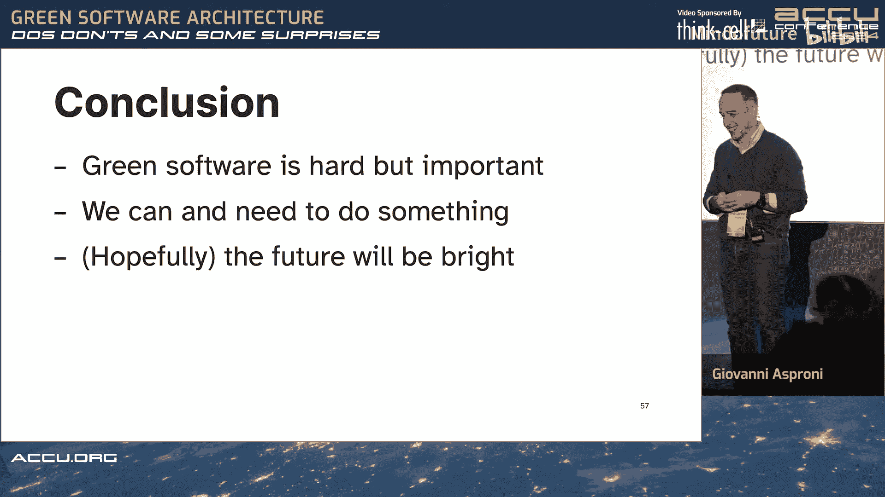

# 016：原则、误区与意外发现

在本节课中，我们将要学习绿色软件架构的核心概念、实践中的注意事项以及一些可能令人意外的发现。我们将探讨如何通过软件设计和开发实践来减少碳排放和能源消耗。

## 概述

绿色软件是指能够减少温室气体排放和降低能耗的软件。当前，信息技术行业消耗了全球约10%的电力，预计到2030年将增至20%。其二氧化碳排放量与航空业相当，约为2-3%，预计到2040年可能增至14%。因此，开发更环保的软件至关重要，这不仅有益于环境，也能为公司节省运营成本，并为开发者带来有趣的工程挑战。

## 绿色软件的定义与分类

上一节我们介绍了绿色软件的重要性，本节中我们来看看如何定义和分类绿色软件。

绿色软件的核心目标是减少温室气体排放和降低能耗。需要注意的是，能耗减少与碳排放减少并非完全等同。如果软件运行在使用可再生能源的数据中心，即使能耗较高，其碳排放也可能很低。然而，在当前能源结构下，能耗是衡量碳排放的一个有效代理指标。

绿色软件基金会将绿色软件分为两类，这两类并非互斥：
*   **碳效率**：指软件本身更高效，从而排放更少的碳。这可以通过提高能源效率（使用更少电力）或硬件效率（需要更小的硬件，从而减少生产碳排放）来实现。
*   **碳感知**：指软件在运行时考虑碳排放因素。例如，选择部署在使用可再生能源的数据中心，或者根据电网的碳强度调整运行模式。

此外，从更广义的“绿色IT”角度来看，还可以分为：
*   **绿色在IT中**：指让IT本身变得更环保，例如制造更节能的硬件、开发更高效的软件。
*   **绿色通过IT**：指利用IT技术帮助其他系统减少碳排放，例如汽车中的节能控制系统。

## 核心概念：绿色能力与可持续性

在理解了绿色软件的分类后，我们需要引入两个核心概念：绿色能力和可持续性。

**绿色能力** 是一种软件质量属性，用于衡量应用程序的环保程度，类似于安全性、可扩展性等质量属性。提高绿色能力意味着让软件更环保，消耗更少的能源和碳排放。

**可持续性** 则是一个需要权衡的方面，包含多个维度：
*   **经济可持续性**：软件项目需要在成本效益上可行。
*   **社会可持续性**：软件应具有包容性，例如确保残障人士的可访问性。有时为了可访问性可能需要在能效上做出妥协，但这对于构建一个公平、可持续的社会至关重要。
*   **环境可持续性**：这正是“绿色在软件中”所关注的核心，即软件本身对环境的影响。

## 当前可采取的行动：需求阶段

了解了基本概念后，我们来看看在软件开发的各个阶段可以采取哪些具体行动。首先从需求阶段开始。

在需求阶段，我们可以通过明确和精简需求来为绿色软件奠定基础。以下是具体建议：

*   **将绿色能力作为一等需求**：像对待性能、安全性一样，明确将降低能耗和碳排放作为系统需求。
*   **只做必要之事**：严格管理需求，只实现绝对必要的功能。编写更少的代码意味着更少的编译、测试和运行能耗。
*   **协商合理的服务等级协议**：例如，是否真的需要“五个九”（99.999%）的可用性？降低可用性要求可以显著减少为冗余所付出的资源和能源。
*   **避免过度指定的目标**：不要盲目追求谷歌级别的可扩展性。允许服务在资源紧张时适度降级（如视频会议降低画质），或根据能源的绿色程度调整服务质量。
*   **减少数据保留时间**：缩短日志等数据的保留期限，可以节省存储和处理这些数据所需的能源。

然而，定义绿色需求面临一个挑战：我们缺乏参考基准。我们知道如何衡量每秒处理多少用户请求，但不知道完成某个操作“只应消耗10千瓦时”是否合理，因为我们过去很少测量这些指标。

## 当前可采取的行动：设计与工程阶段

明确了需求后，接下来我们进入设计与工程阶段。这个阶段的核心是提高能源效率，但需要注意，追求高效率可能带来成本、可维护性和弹性方面的挑战。

在软件设计层面，绿色能力必须是有意为之的，不能指望事后补救。设计时需要根据权衡，决定是侧重碳感知、能源效率还是硬件效率。以下是一些设计考量：

*   **减少数据传输**：使用高效的协议（如Protocol Buffers替代REST/JSON），避免过于“健谈”的交互，只发送必要数据。
*   **将计算推送到客户端**：利用智能手机等设备进行计算，可以减轻服务器负载，并可能利用夜间充电时更绿色的能源。但需注意确保软件能向后兼容，避免迫使用户升级设备。
*   **优化数据库**：合理使用索引等基础优化手段，常常能大幅提升效率，避免不必要的缓存层。
*   **减少空闲时间**：处于空闲状态的服务器可能仍消耗高达60%的峰值功率。因此，应尽量提高硬件利用率，例如通过多租户方式让硬件保持忙碌。
*   **实施节俭的数据存储策略**：只存储必要的数据。
*   **需求塑形**：根据本地电网的碳强度调整服务功能（如之前提到的视频画质调整）。

在实现层面，编程语言的选择是一个常见话题。研究表明，不同语言在执行相同算法时的能耗差异很大（例如C语言通常比Python更高效）。但必须谨慎看待这类研究：
*   结果高度依赖于具体任务类型。
*   语言速度与能耗并非总是直接正相关。
*   选择最高效的语言不一定是实现绿色软件的最佳途径。开发效率、团队技能和业务可持续性同样重要。

其他实现建议包括：
*   **清理未使用的代码和数据**：避免编译、测试和加载永远不会执行的代码。
*   **优化常驻任务**：对于持续运行的任务，应优先考虑其效率。
*   **权衡技术栈迁移**：将系统从低效语言迁移到高效语言可能带来能效提升，但需要评估其时间成本和对业务可持续性的影响。

一个反直觉的事实是：**低效的代码仍然可以变“绿”**。例如，可以将其部署在使用可再生能源的数据中心。

## 当前可采取的行动：测试与运维阶段

完成了设计与实现，我们需要通过测试来验证，并通过运维来维持绿色状态。目前，测试阶段缺乏直接测量软件能耗的实时工具，这是一大挑战。

在测试阶段，我们主要能让测试活动本身变得更环保：
*   **只运行相关的测试**：当代码变更时，只执行受影响的测试用例。
*   **限制测试环境数量**：避免为每个功能分支都创建完整的测试环境。
*   **优化流水线**：设置流水线在代码无变化时不触发测试。
*   **利用绿色能源运行自动化测试**：如果可能，安排在能源更绿色的时段运行测试。

**运维阶段是当前实现碳减排最大收益的领域**。提高运营效率可以削减5到10倍的碳排放，且通常不需要特殊工具，利用现有的监控和部署工具即可。以下是一些有效的运维策略：

*   **关闭未使用的服务**：在非工作时间或周末关闭测试环境。
*   **清理闲置应用**：定期检查并删除云平台上无人使用的部署实例。
*   **提高机器利用率**：通过使用更小的实例规格、实现多租户，让服务器保持高负载运行，减少空闲能耗。
*   **使用托管服务和云平台**：云服务商通常能更好地实现动态扩展和资源优化。
*   **时间转移**：将批处理作业安排在电网碳强度较低的时间段运行。
*   **位置转移**：将工作负载部署在使用可再生能源的数据中心（对于大型云平台用户，这通常是一个可选项）。

## 机器学习模型的特殊考量

最后，我们简要探讨一个日益重要的领域：机器学习。训练和运行机器学习模型，特别是大型生成式AI模型，能耗极高。

一些研究发现：
*   训练一个大型模型的能耗可能相当于五辆美国汽车整个生命周期的能耗。
*   生成式AI（如图像生成）比判别式AI（如图像分类）能耗高得多。
*   模型训练比单次推理能耗高，但如果模型被海量调用，总推理能耗会非常可观。
*   专用模型比通用大模型更环保。
*   **准确性与能耗之间存在权衡**：略微降低模型准确度（例如1%），有时能大幅降低能耗（例如77%）。因此，需要根据应用场景（如电影推荐 vs. 医疗诊断）来决定可接受的准确度水平。

## 未来展望与总结

本节课中我们一起学习了绿色软件架构的各个方面。尽管面临工具缺失、实践矛盾等挑战，但采取行动至关重要。

展望未来，我们期待以下改进：
*   **实时能耗测量工具**的出现，使开发者能够精确评估和优化代码。
*   **绿色开源库和框架**的普及。
*   **编译器和语言的持续改进**，自动生成更高效的代码。
*   **更环保的机器学习模型**。
*   **软件工程原则与实践的更新**，将绿色能力纳入核心考量。

**总结**：构建绿色软件虽然困难但意义重大。在当前工具和模型尚不完善的情况下，我们依然可以利用现有知识和近似方法采取行动。通过在设计、实现、测试和运维各阶段有意识地关注能效与碳排放，我们能为建设一个更可持续的数字未来做出贡献。