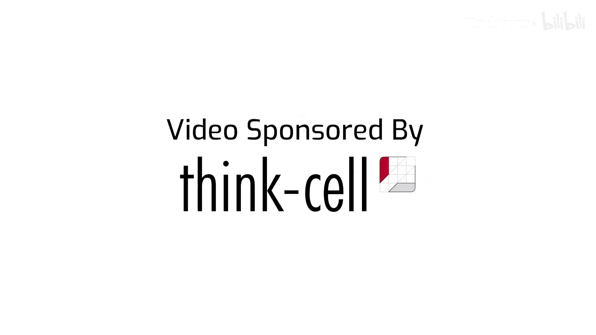
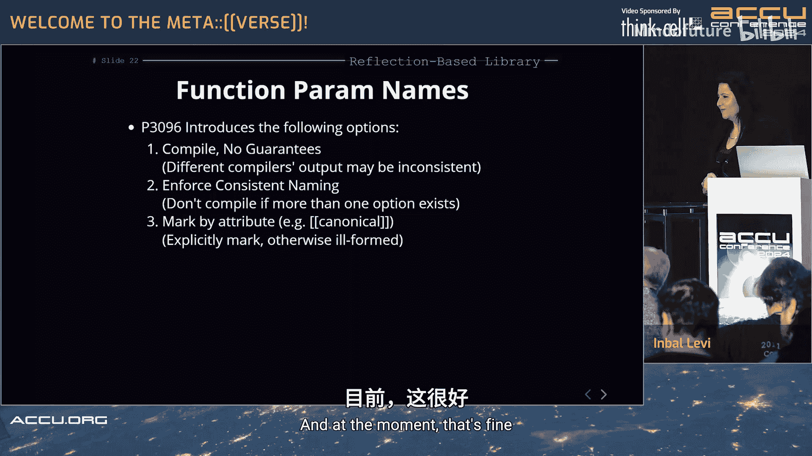
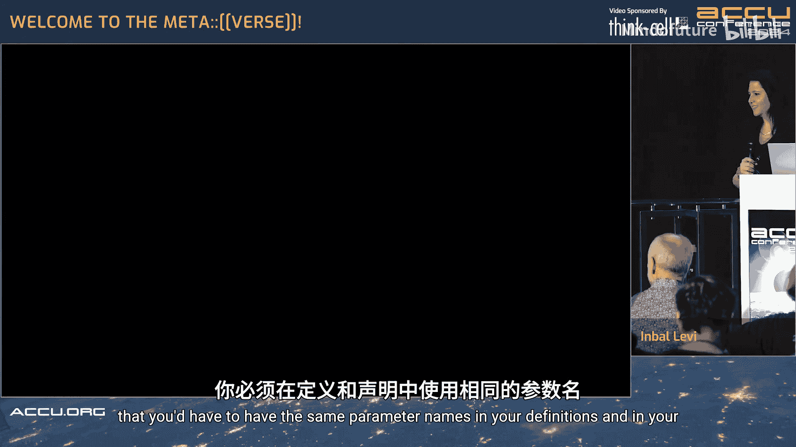
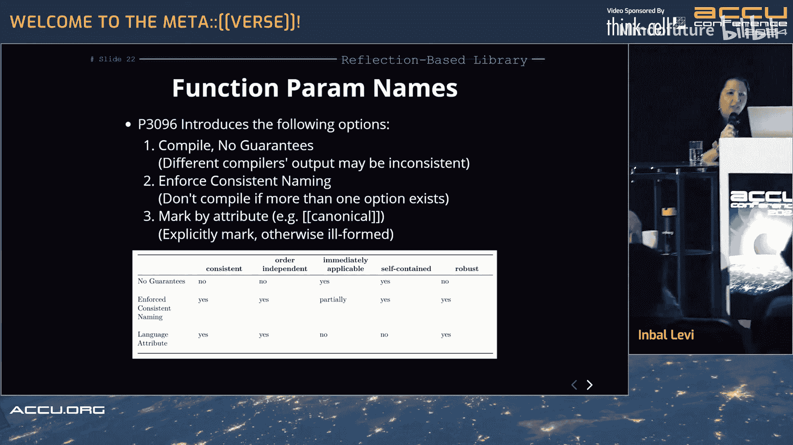
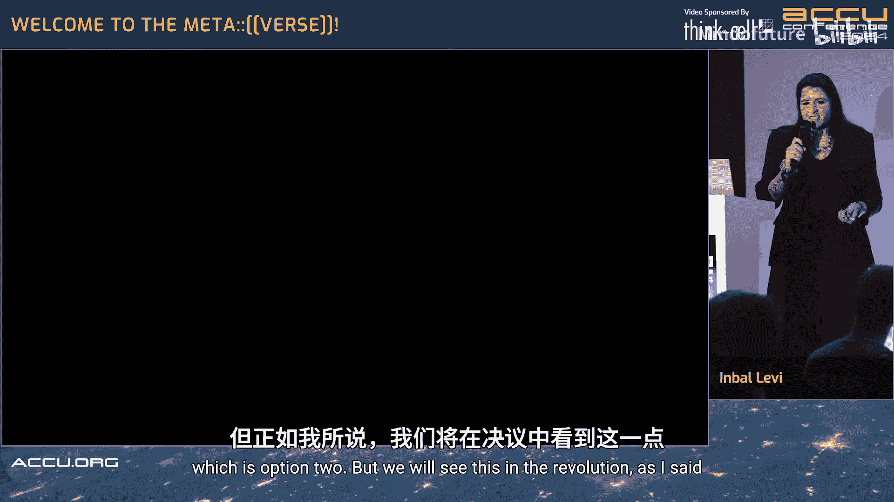
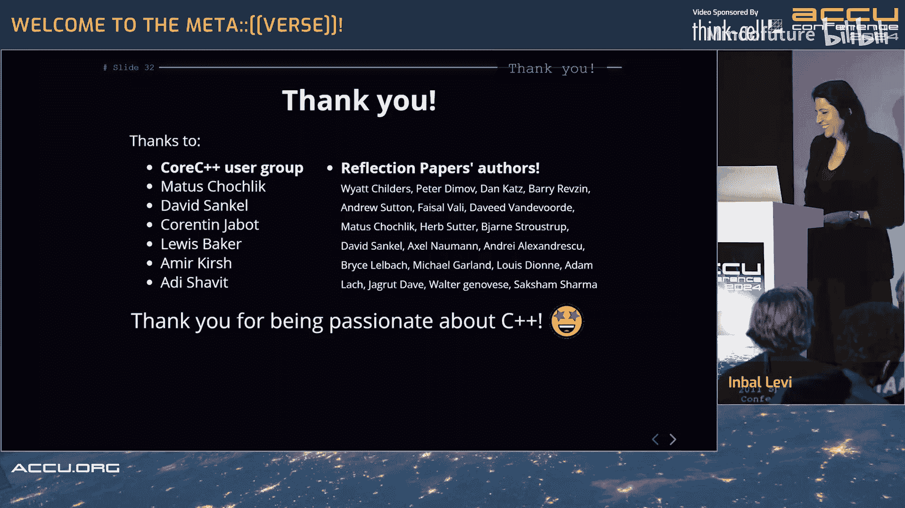

# 018：欢迎来到元世界v0.1 🚀




在本节课中，我们将要学习C++26中备受期待的静态反射特性。我们将探讨反射的基本概念、其历史发展、核心语法，并通过实际例子展示其强大功能。最后，我们将讨论反射对现有代码库和库设计带来的挑战与思考。

## 什么是反射？🤔

反射是软件暴露其内部结构的能力。我们希望通过这种能力，基于现有代码（无论是他人还是自己的代码）来构建新功能。本节课讨论的是**静态反射**，即在编译时暴露代码结构。

需要明确的是，虽然技术上可以将编译时信息保留到运行时，但这可能带来性能、安全等问题。目前针对C++26的反射提案**完全不涉及运行时**，仅专注于静态反射。

## 课程结构 📚

本节课分为两部分：
1.  **反射入门**：我们将回顾反射的历史，深入了解C++26的反射提案P2996，并查看一些使用示例，特别是从库设计的角度。
2.  **对代码库的影响**：我们将讨论反射如何作为一种定制点机制，如何融入我们的开发流程，并进行总结。

本教程的所有示例均来自反射提案P2996、关于函数参数名的提案P3096，以及已在Compiler Explorer上实现的EDG编译器。

## 反射简史 📜

以下是反射在C++社区发展过程中的关键节点：

*   **2006年**：首次出现通过模板元编程实现反射的库（由Matthias Troyer编写）。
*   **后续发展**：Mike Spertus等人提出了反射的用例。随后出现了基于“Mirror”反射库的提案，这些提案主要关注类型特征。
*   **2015年**：Louis Dionne发布了**Brigand**库，它重度依赖模板元编程，但也让人们意识到模板元编程在编译时开销较大。
*   **2017年**：提案激增，引入了**元对象**的概念，即保存代码信息的对象。
*   **2018年**：出现了“基于值的反射”、“T4和单态类型”等术语，最终导向使用单一类型（`std::meta::info`）来表示反射信息。同年，David Sankel提出了反射技术规范（TS）。
*   **2023年10月**：提出了**P2996提案**，这是目前针对C++26的主要反射提案。此后，又出现了许多基于反射的提案（如Python/JS绑定），显示了社区对反射特性的广泛兴趣。

## C++26反射提案核心 🎯

P2996提案包含几个核心支柱：

1.  **反射运算符（Reflection Operator）**：曾用名“lift”。它的作用是将代码从**C++领域**“提升”到**反射领域**，以便进行元编程操作。
    ```cpp
    // 示例：将类型`int`提升到反射领域
    std::meta::info refl_int = ^int;
    ```
2.  **拼接器（Splicer）**：作用与反射运算符相反，将信息从**反射领域**“拼接”回**C++领域**。
    ```cpp
    // 示例：将反射信息拼接回代码，定义一个值为42的int变量a
    std::meta::info r = ^int;
    typename(r) a = 42; // 等价于 `int a = 42;`
    ```
    注意：`typename(...)`是一种**占位符语法**，用于提示编译器我们希望将反射信息解释为一个类型。
3.  **元信息对象（`std::meta::info`）**：这是一个单态类型，用于保存所有被反射实体的信息。可以将其理解为编译器抽象语法树（AST）节点的一个句柄。
4.  **元函数（Meta Functions）**：一系列用于查询和操作`std::meta::info`对象的函数，功能类似于现有的类型特征（type traits），但更强大。
    *   **查询类**：例如获取名称、位置、父类型、判断是否为私有成员等。
    *   **结构类**：例如获取类的成员列表、模板参数、函数调用信息等。
    *   **定义类**：一个非常有趣的功能，允许在反射领域中动态构建新的类或类型（也称为“生成式反射”）。

需要注意的是，**修改类型的元函数**（例如，直接通过反射注入代码）目前不在提案中，因为实现复杂且可能干扰编译器模型。

## 反射示例 ✨

让我们通过几个简单例子看看反射的实际应用。

### 示例1：反射日志库

这是一个基于反射的日志库，可以自动打印任意结构体的成员。

以下是库代码的实现思路：
```cpp
// 库函数：打印对象的成员
template<typename T>
void log_members(const T& obj) {
    // 1. 将类型T提升到反射领域
    std::meta::info type_info = ^T;
    // 2. 获取所有非静态数据成员
    auto members = std::meta::nonstatic_data_members_of(type_info);
    // 3. 遍历并打印成员名和值
    for (auto member : members) {
        std::cout << std::meta::name_of(member) << ": " << /* 获取成员值 */ << std::endl;
    }
}
```
用户代码可以这样使用：
```cpp
struct Student {
    std::string name;
    int id;
};

Student s{"Alice", 123};
log_members(s); // 输出：name: Alice, id: 123
```
库函数通过反射运算符`^T`获取了`Student`类型的元信息，进而遍历其成员，无需用户手动指定要打印哪些字段。

### 示例2：命令行参数解析

这个例子展示了编译时反射与运行时行为的结合。用户可以通过定义结构体来声明期望的命令行参数。

用户代码：
```cpp
struct Args : Clap { // 继承自某个反射库提供的基类
    Option<std::string> name{*this, ‘n’, “name”}; // 短选项-n，长选项--name
    Option<int> count{*this, ‘c’, “count”, 1}; // 短选项-c，长选项--count，默认值1
};

int main(int argc, char* argv[]) {
    Args args;
    args.parse(argc, argv);
    std::cout << args.name << “, “ << args.count << std::endl;
}
```
库（`Clap`）在内部使用反射来解析用户定义的`Args`结构体，自动将命令行参数与对应的成员绑定。





### 示例3：函数参数名反射

这个例子揭示了反射带来的一个新挑战。反射允许获取函数参数的名称，但如果函数的声明和定义中的参数名不一致怎么办？

考虑以下代码：
```cpp
// 声明
void func(int first, int last);
// 定义
void func(int n, int l) { ... }

// 反射库函数：打印参数名
print_parameters(^func);
```
如果反射发生在声明之后，可能得到`[“first”, “last”]`；如果发生在定义之后，可能得到`[“n”, “l”]`。这带来了**一致性问题**。

提案P3096讨论了三种解决方案：
1.  **无保证**：编译器可以自由选择打印哪个名字，不同编译器或不同位置可能结果不同。
2.  **强制一致**：如果声明和定义的参数名不一致，则程序编译失败。
3.  **使用属性标记**：使用类似`[[canonical]]`的属性指定哪个声明是“规范”的，未标记的则视为非法。





每种方案都有其优缺点，涉及到对现有代码的兼容性、库的易用性等。这体现了反射特性在引入强大功能的同时，也需要仔细考虑其语义和边界。

## 反射作为定制点机制 ⚙️

定制点是指库暴露给用户、让用户能够根据自己类型定制库行为的机制。传统机制包括虚函数重写、模板特化、依赖参数依赖查找（ADL）等。

反射提供了另一种强大的定制点机制。库作者可以通过反射来“探查”用户类型的结构，并自动生成相应的行为，而无需用户显式特化模板或定义特定函数。这更加灵活，但也更“魔法”，需要清晰定义反射操作的保证和限制。

## 反射的集成与挑战 🧩

反射库的集成与传统库不同，带来新的挑战：

*   **编译与链接的分离**：一个反射库可能独立编译成功，但在链接使用了特定用户代码时才会因反射语义问题（如参数名不一致）而失败。这与传统库基于标准版本或特性测试宏的兼容性不同。
*   **保证与兼容性**：我们需要决定为反射操作提供何种程度的保证：
    *   不同标准库版本之间是否需要保证反射行为的兼容性？
    *   对现有源代码是否需要保证反射能正常工作？
    *   当反射操作“失败”时（如上述参数名不一致），程序是编译失败、未定义行为，还是抛出编译期异常？
*   **错误与警告**：反射发生在编译的早期阶段。如何提供清晰易懂的错误信息？是否应该提供警告来提示用户代码中可能导致反射问题的模式（如参数名不一致）？这几乎相当于在C++编译器之上又构建了一层“元编译器”。

## 总结 🎓

本节课我们一起学习了C++26中即将到来的静态反射特性。

我们首先了解了反射的基本概念——在编译时暴露和操作代码结构的能力。接着回顾了其漫长而丰富的发展历史。然后，我们深入探讨了当前提案P2996的核心：**反射运算符**和**拼接器**用于在代码领域和反射领域间转换；**`std::meta::info`** 作为承载元信息的统一对象；丰富的**元函数**用于查询和操作。

通过日志库、命令行解析和函数参数名反射等示例，我们看到了反射如何简化代码、实现强大功能，同时也暴露了如**一致性问题**等新的挑战。最后，我们从库作者的角度探讨了反射作为定制点机制的潜力，以及它给**构建工具链、错误处理和向后兼容性**带来的深刻影响。




反射是C++迈向更高层次元编程的关键一步，它功能强大，但也需要社区仔细考量其设计细节，以确保它能稳健地融入C++生态系统。