# 019：安全、安全性与C++演进


## 概述

在本节课中，我们将学习C++语言在安全性和安全性方面的现状、挑战以及未来的演进方向。我们将探讨编程语言安全、软件安全与软件安全性之间的区别，分析C++当前面临的主要内存安全问题，并了解旨在通过“安全配置文件”等机制来默认提升C++代码安全性的社区努力。课程内容基于Herb Sutter在ACCU 2024大会上的主题演讲。

---

## 什么是安全、安全性与安全性？

首先，我们需要明确几个关键术语。这些并非随意定义，而是有ISO标准参考的行业术语。

**软件安全** 或 **网络安全** 是指保护我们的软件免受攻击，以保护我们的资产、秘密和机密信息。

**软件安全性** 则关乎确保软件不会造成意外的伤害。我们希望医院的设备正常工作，自动驾驶汽车不会撞到人。其目标是使软件免于因缺陷导致不可接受的风险。

**编程语言安全** 可能是我们提到“安全”时首先想到的。它指的是语言如何帮助保证程序的正确性。内存安全是其中的一部分。当我们不加修饰地说“安全”时，通常指的就是编程语言安全。

这三者之间的关系至关重要：**编程语言安全有助于提升软件安全和软件安全性**。它不仅能保护软件免受入侵，还能提高程序员的生产力，使程序更健壮、缺陷更少。因此，编程语言安全是达到目的的手段，而非目的本身。我们关心它，是为了获得更安全的软件、更可靠的系统以及更高的开发效率。

---

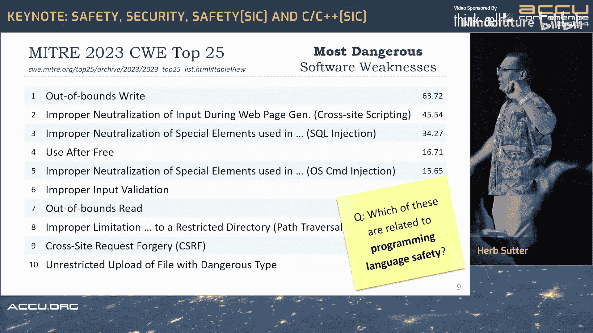

## C++面临的核心安全问题

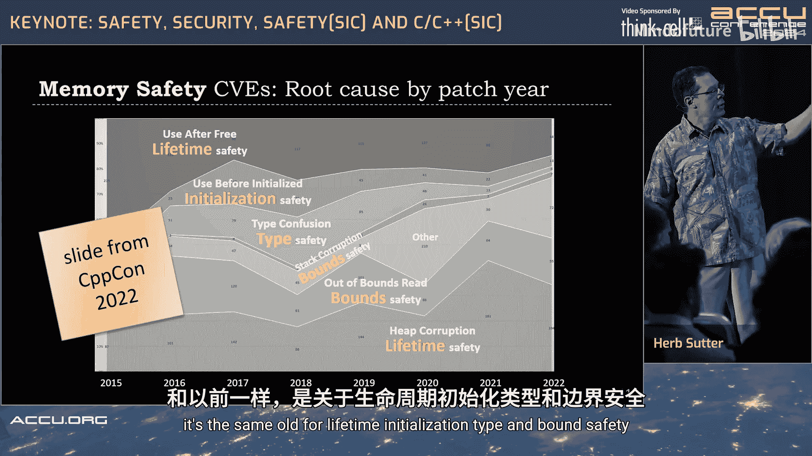

上一节我们介绍了不同类型的安全概念，本节中我们来看看C++语言当前面临的具体安全问题。

我的论点是，问题不在于追求完美，不在于实现100%可证明的形式化正确类型系统。问题在于我们需要达到与C#、Rust、Go、Python等其他内存安全语言同等的水平。

我们可以通过改进四个方面来实现这一目标：**类型安全**、**边界安全**、**初始化安全**和**生命周期安全**。

目前正在进行的一项努力（我希望它能成功，并愿意帮助其在WG21中取得成功）是建立一个**安全配置文件框架**。这个框架可以帮助我们在编译时默认强制执行这些规则。由于需要向后兼容，默认设置可能是关闭的，但我们希望让启用变得容易。在启用的代码区域内，安全将成为默认设置，只有在需要时我们才选择退出。

---

## 数据揭示的问题

为了理解问题的严重性，我们可以参考一些数据来源，例如MITRE的CWE列表。

以下是2023年排名最严重的十大常见弱点枚举。其中哪些与编程语言安全相关？

答案是：**CWE-119（缓冲区溢出）**、**CWE-125（越界读取）** 和 **CWE-787（越界写入）**。注意，其中两个是关于边界安全的。我们之前提到的四个需要改进的安全领域中，**边界安全是首要问题，是低垂的果实**。

下图展示了一年半前我在CPPCon上展示过的幻灯片，它再次说明了内存安全漏洞的细分情况（暂时排除其他类型）。问题依旧是老生常谈的：生命周期、初始化、类型和边界安全。


我们当前最直接的问题是：在C/C++代码中，太容易在这四个领域意外地写出bug，因为默认情况下代码会编译通过，并且看起来能工作（就像竞态条件一样）。这并不理想。

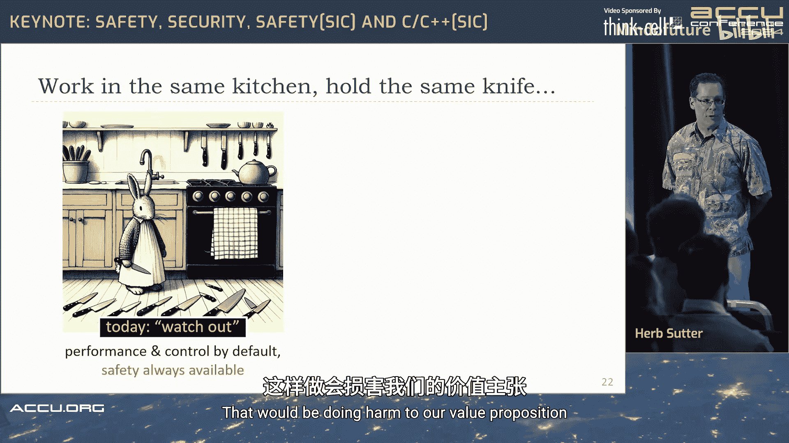

---

## 安全执行时机的重要性

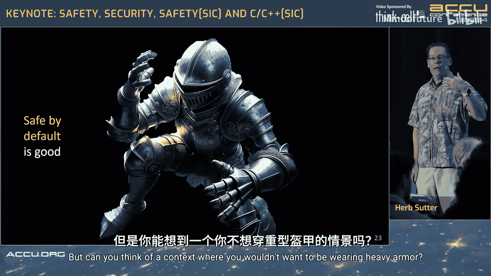

上一节我们明确了C++需要改进的四个安全领域，本节中我们来看看如何以及何时执行安全规则。

强制执行安全规则的时机至关重要。今天，我们可能有一个静态分析工具，但也许它太昂贵，无法在开发者的本地机器上每次构建时都运行。因此，它可能在CI流水线后期才运行。这样，就会有更多缺陷溜进来。我们知道我们需要“左移”，即尽可能早地发现错误。在构建时发现错误是理想的。

我想引用David Chisnall（来自微软研究院）的话。大约三个月前，他在FreeBSD黑客论坛上回应了一个关于将Rust作为系统语言或采用Rust的讨论。他是微软内部一份推荐默认使用Rust的战略论文的合著者之一。他根据在那里的经验提供了背景。

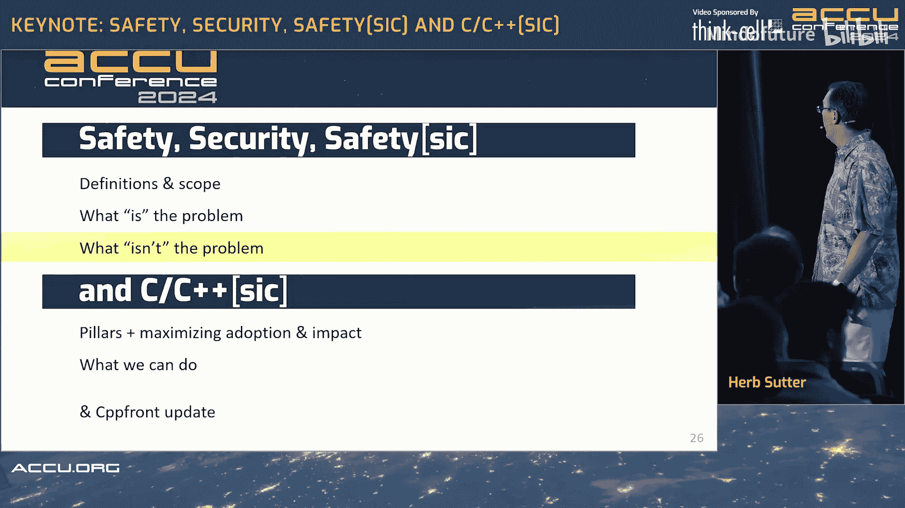

以下是David的原话（已公开）：
> “在现代C++（配合静态分析器）和Rust之间，就微软内部的评估而言，安全性差距很小。然而，推荐仍然倾向于在新代码中使用Rust。这主要是基于人为因素的决策：防止人们提交无法编译的代码要容易得多。”

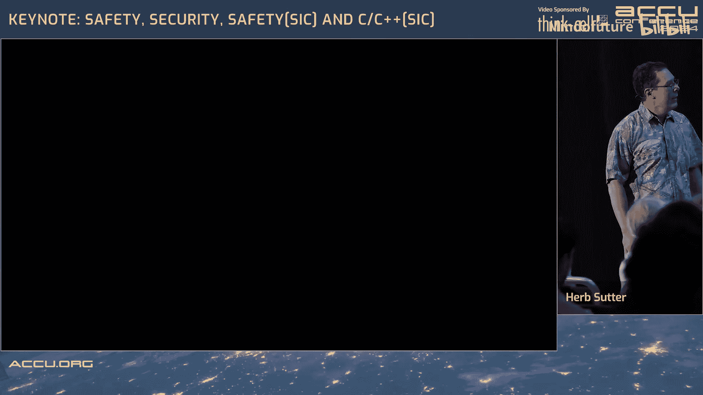

所以，**尽早进行安全检查很重要，在构建时进行是最理想的**。

他还指出，即使只是使用现代C++的智能指针和范围，与C语言相比也存在巨大的安全性差距。

因此，我们应该做的第一步是：**将我们已经拥有的、存在于现代C++和其他工具中的检查，移到构建时进行**。

---

## 默认安全的重要性

上一节我们讨论了安全检查的时机，本节中我们探讨另一个关键概念：默认安全。

今天，C++（以及过去30年）的构建哲学是：**默认追求性能，安全始终可用**。默认是什么？是性能。你想从C++程序员冰冷的手中夺走那些性能“利器”吗？我们想要所有这些利器。

但我们也必须承认，如果一个语言能早期拒绝错误并早期提供内存安全保证，总体上我们将拥有更少的bug。这不仅关乎安全和安全性，也关乎生产力。

那么，在不拿走“利器”的情况下，我们能做什么？我们可以说：**以默认安全为目标**。找到一种方法，在编译时默认强制执行这些已知规则，但仍然提供退出机制。你仍然可以拿到所有“利器”，不仅仅是像Rust的`unsafe`那样只给你五六把。我们想要所有“利器”，我们想要时间旅行、未定义行为，但请不要默认提供。我们根本不想要未定义行为的时间旅行。但如果我们能看到它何时发生，那么我们就知道我们为此付出了什么代价。是我们主动选择这样做，并会格外小心。

我想用一个比喻来说明。下图展示了两种厨房：


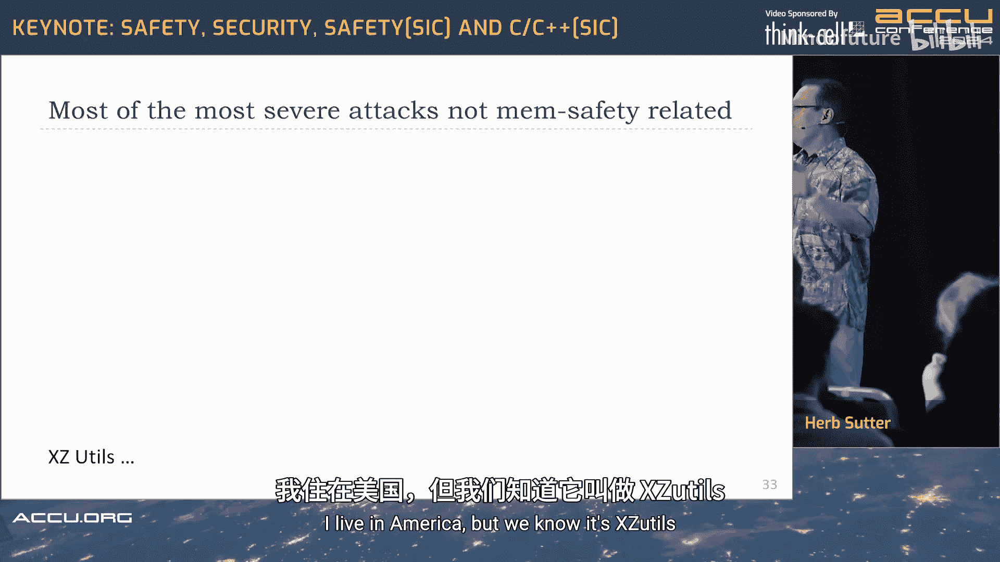

左边的图片代表 **“默认性能，安全始终可用”**。小心脚下。
右边的图片是同一个厨房，同一位厨师，同样的刀具，但刀具放在了抽屉里。这代表 **“默认安全，性能和控制始终可用”**。

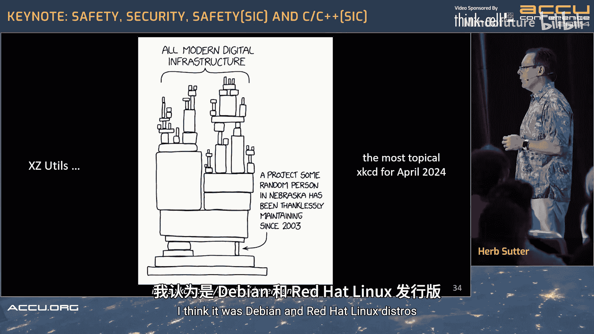

很多厨师手指都不全，你知道，这确实会发生。所以，我认为的一种思考方式是：你穿着盔甲。你想要默认安全。一个在战斗中的人当然想一直穿着盔甲。但上下文很重要。默认安全是好的，但你能想到一个你不想穿着重盔甲的场景吗？


是的，如果你在水下正在下沉，你想做的第一件事就是说：“我爱这盔甲，但现在我真的想快点脱掉它。”这个想法灵感来源于电影《明日边缘》中的机甲场景。即使是汤姆·克鲁斯，有时也需要退出安全模式。

---

## 关于安全性的常见误解

在深入探讨解决方案之前，我们需要澄清一些关于C++安全性的常见误解。

**误解一：问题不在于定义什么是安全。**
我们应该首先瞄准哪些安全领域？类型、边界、初始化、生命周期安全。这是低垂的果实，是我们当前的痛点，也是其他语言取得主要优势的地方。

**误解二：问题不在于C++不是形式化可证明类型安全的。**
令各地的语言设计者懊恼的是，目前还没有一个商业上成功的编程语言是形式化可证明的。有些语言仍在尝试。但这既非必要也非充分条件。不必要，因为我们的内存安全语言已经在不完美的情况下设定了相当高的标准。不充分，因为有很多漏洞与内存安全无关，我们也必须解决它们。

所有设计都关乎权衡。这里我想称赞一下Rust。Rust的安全代码专门使用基于树的数据结构（是的，你有`Rc`和其他方式来做非树状数据结构）。这赋予了它一个超能力：它是迄今为止唯一一个具有强大并发安全、线程安全保证的主要商业语言（尽管我知道Swift等语言也在紧追不舍）。这值得称赞。
但这也带来了成本：在Rust中，你比其他语言更频繁地需要使用`unsafe`。因为在其他语言如C#中，你可以在完全安全的代码中拥有循环数据结构，而在Rust中不行。你需要使用底层用`unsafe`实现的`Rc`，或者使用索引作为反向指针等。这不是批评。请注意，我把对勾和美元符号都标成了绿色，因为这是一个工程和设计的权衡。现实世界就是如此，我们接受权衡。

**误解三：没有我认识的安全专家相信，如果我们能挥舞魔杖，让世界上每一行C/C++代码一夜之间变成内存安全语言，就意味着我们将减少70%的漏洞。**
例如，我们已经看到十大CWE中有三个是关于内存安全的。所以，即使一夜之间我们让这三个都消失，我们就完成了吗？我们是否应该期望我们已经减少或消除了世界上70%的漏洞？远非如此。不要误解我的意思，摆脱那三个会很棒，我们应该尝试。但不要目光短浅。当我们想要应对软件面临的所有威胁时，不要过于关注一个问题。

为什么你家的前门不像下图这样？（我很喜欢“Fort Knox”这个制造商标签。）这会是相当好的前门，相当安全。是的，总存在可用性权衡，你自己进出可能不方便。但是，为什么我们不把所有的家庭安全预算都花在前门上呢？因为窃贼会寻找下一个最薄弱的入口点。如果你有一扇没有栏杆的不安全窗户，就在前门旁边或房子后面，他们可以安静地进去而不被邻居听到。你花了很多钱在前门上，但并没有保护好你的房子。

所以，我们想要保护所有的攻击点。攻击者会攻击兽群中最慢的动物。如果我们加固了一个地方，他们会转向下一个地方。我们已经看到攻击者从恶意软件转向其他载体，因为端点安全是有效的。我们还有很长的路要走，但我们已经看到攻击者的转移。他们会寻找你的窗户，即使我们忽略了它，他们也会寻找。

是的，过去几年绝对存在与内存安全相关的严重攻击。但许多最严重的攻击（并非全部）与内存安全无关。
*   SolarWinds 是关于劫持更新系统来传递恶意软件。
*   Log4J 是用安全语言（Java）编写的。它是关于清理输入。
*   2023年的Kiwii Security（一款家长控制应用）暴露了敏感信息，因为他们没有为Elasticsearch启用身份验证，留下了3亿条记录，包括成千上万的电话号码和电子邮件。
*   DarkBeam（一个数据泄露警报数据库）也通过（鼓点）没有为Elasticsearch启用身份验证而暴露了其记录。

所以，我想说的是，就像Rust一样，给我们的C++用户一个默认提升安全性的模式**不会拯救我们**。这不会解决世界上所有威胁行为者的问题。但**它绝对会帮助我们，我们最好去做**。

**误解四：我听过一些人说：“这是你的错，C++程序员，因为你应该使用我们一直在给你的工具，你们这些不知感恩的懒骨头。”**
这可能会激起你的愤怒，尤其是如果你曾尝试使用那些工具，知道它们有多难获取和使用。

我不会通读这张幻灯片，但我在我写的关于C++安全的文章中讨论过这一点。今天我们在交付这些已知的好规则方面存在真正的缺陷。因此，开发者需要的是**低误报的检查**，最好能**随编译器一起提供**，在**构建时、提交前运行**，并且是**确定性的、易于采用的**。这应该是我们努力的目标。

---

## C/C++的现状与挑战

现在，让我们坦诚地看看C/C++作为一个安全问题的现实情况，它是真实存在的。

C++的两个支柱，简而言之：
1.  **强大的抽象能力，且除非使用否则无需付出代价。** 一个好的简称是什么？**零开销抽象原则**。我们大体上遵循这一点（异常和RTTI除外），这是C++的超能力之一。
2.  **与旧版C++和C近乎完美的向后兼容性。** 你可以在同一个C++项目中混合使用C、旧版C++和现代C++，而且它能正常工作。一个好的简称是什么？**遗产**。

现实是，我们大多数C++项目中的代码（即使因为第三方依赖），都是一个**光荣的、模糊的风格混合体**。这包括了所有的C/C++。

我知道有人认为“C/C++”这个术语很糟糕。我认为这是一个非常好的术语，用来描述我们作为C++标准委员会成员负责的代码集合。显然，能同时作为C和C++编译的代码显然属于交集。

但这里有一个小测验：以下哪一个是C程序？哪一个是C++程序？
```c
// 代码A
#include <stdio.h>
int main() {
    printf("Hello\n");
    return 0;
}
```
```cpp
// 代码B
#include <iostream>
int main() {
    std::cout << "Hello\n";
    return 0;
}
```
正确答案是：**它们都是C++程序**。如果你怀疑，ISO/IEC 14882（C++标准）说这两者都是合法的。这不是C和C++交集的准确描述。更接近的描述是，C/C++是C++的C子集，这个名称是合适的。

我们有各种各样的风格，甚至还没有包括内部风格和使用C++的方式。它们都是有效C++项目的一部分。是的，我们有现代、良好的C++（如果你能找到它的定义的话）。我想指出的一个点是：所有这些风格都“超出了标准范围”。
*   左边，有标准C的部分（如`restrict`、VLA）还不是标准C++的一部分。
*   如果你使用没有RTTI的C++，那么你就在使用自己的扩展来代替`dynamic_cast`。
*   如果你使用没有异常处理的C++，那么你就在使用其他非标准的东西。
*   即使你是C++核心指南的作者，告诉人们使用良好的现代C++，你仍然会说并使用GSL `span`，因为`std::span`还没有边界检查。

我们都或多或少地超出了标准范围。但我感兴趣的是，我们能为圆圈内的所有代码做些什么？因为如果它是合法的C++，它就是我们的问题，我们有责任去解决和改进，包括当我们谈论安全配置文件时。

---

## 安全配置文件的采用与影响

上一节我们探讨了C++代码的多样性，本节中我们来看看安全配置文件如何能够被广泛采用并产生最大影响。

我老板的老板（大致如此），John Cunningham（微软负责所有编程语言工程的公司副总裁），他是这样对我说的（他允许我引用）：
> “我们的C++安全改进工作不能是我们挂在墙上欣赏的艺术品。我们是工程师。我们制造的东西可以是美丽的，但我们不想设计一些挂在博物馆里的东西。我们希望人们四处走动并使用它。”

这是在讨论如何使安全配置文件具有可采纳性的背景下。所以我真的想多谈谈这一点。

我想**最大化适应性**。我们如何交付它们，以便它们能够大规模采用？我也想**最大化影响力**。我有良好的代码和“狡猾”的代码（指风格老旧或复杂的代码）。安全配置文件能为我做什么，也能为那些“狡猾”的代码做什么吗？还是我们就把它抛在后面？因为有很多“狡猾”的代码，如果我们能改进它，我们将为我们的文明做一件好事，因为我们的文明也依赖于那些“狡猾”的代码。

假设我们有了这些配置文件，它们定义了众所周知的、可静态执行的、确定性的、低误报的规则。

一个选择是简单地拒绝不遵循这些规则的代码。例如，如果你使用`reinterpret_cast`，它会被标记，你必须选择退出才能使用`reinterpret_cast`。问题是这需要你更改代码，所以至少存在一些摩擦。你们中有多少人在职业生涯中艰难地认识到更改代码是昂贵的？更改代码即使是为了消除bug，也会在某个百分比（希望较低）上引入新的bug。这是不可避免的。

那么我们能做得更好吗？因为有时答案就是必须更改代码。有时你不得不说：“对不起，把那个`reinterpret_cast`改掉以符合配置文件。”

但我假设，并且我已经在cppfront中实现了这些（以我简化的语法），但你也可以在标准C++中做同样的事情：当配置文件被强制执行时，类型安全被强制执行。如果我们能让不安全的代码做正确的事情，那就直接做，**而不需要代码更改**。

例如，如果我有一个`static_cast`指针向下转型，我知道他们本意是想写`dynamic_cast`。只要RTTI启用并且基类中有虚函数表，我就可以直接为他们生成`dynamic_cast`代码（如果他们选择了安全配置文件）。

我们为什么要这样做？因为这样做有缺点。代码现在可以说是在“撒谎”，因为它写着`static_cast`，而我们实际上在做`dynamic_cast`。但首先，如果我们走这条路，我们会记录安全配置文件会这样做。其次，现在我们做了一件非常重要的事情：**我们改进了现有代码**。所有那些在20世纪90年代编写的、我们无法更改的代码，我们至少修复了其中一部分。通过使用配置文件而无需代码更改，这是关于适应性和影响力，甚至是对旧代码的影响力。

另一件我们可以做的事情是**插入运行时检查以捕获动态错误**。边界检查就是一个很好的例子。如果我的边界安全配置文件是开启的（这是cppfront已经做的，并且它已经多次捕获了我自己的边界错误），当你看到`a[b]`这种形式的表达式，并且`std::size(a)`可用时（包括对C数组、`vector`、`span`等），只需在调用点插入 `0 <= b && b < std::size(a)` 的检查。突然之间，从那行代码开始（就像今天在cppfront中一样，也包括未来用边界安全配置文件编写的代码），你所有现有的标准库（无需任何ABI破坏，无需任何更新）都进行了边界检查。我不必在`vector`和`span`中放入检测代码，而且它对C数组也有效。

然后，所有这三种选项（修复、检查、现代化）也可以提供我称之为 **“现代化”** 的功能，即提供一个“修复建议”。你希望我把那个`static_cast`改成`dynamic_cast`吗？你仍然需要程序员说“是”。但超能力仍然是：这不是手动代码更改。如果你能提供开发者可以信赖的可靠修复建议，这就是我们推动代码向前发展的方式。

所以，在一个轴上，从C到闪亮的C++，我们能帮助多少这样的代码？在另一个轴上，从最顶端全新的、没有依赖和互操作性的项目，一直到不能更改的第三方库（没人理解且不敢碰，因为它是关键的），如果我们所做的只是部署静态分析规则说“我要拒绝你的代码”，我们能帮助多少？我们可以帮助其中一部分。代码越现代，需要的更改就越少，因此可采纳性就越高。但随着你接触到更旧的代码，基本上就像是说“好吧，用`std::span`重写它”之类的。那么，为了可采纳性，我们将主要关注易于更新的、没有很多相互依赖或全新的项目。

我的希望是，通过**修复、检查和现代化**，我们可以将一些安全改进应用于所有我们用安全配置文件重新编译的C和C++代码。当然，我们不会获得全部好处。我们无法摆脱你的`reinterpret_cast`，我不知道用什么替换它们。但我们将能够做一些事情，比如**边界安全**，这很重要。

请记住，我们的竞争对手在上面。如果我们所做的只是“拒绝”并且已经要求代码更改，你首先会得到的一个问题是：“好吧，如果我要更改我的代码，特别是如果我无论如何都要重写它，为什么我不直接用Rust或C#或Python或其他语言重写它呢？你告诉我我已经得去重写我的代码了。”

以下是一个我最近向某人展示的关于我在cppfront中所做事情的例子：
```cpp
// 使用C数组
int a[3] = {1, 2, 3};
// 或者使用 std::array
std::array<int, 3> a = {1, 2, 3};

// 下面的三行代码如果作为cpp2代码编译（我们也可以为未来的ISO C++做同样的事情，在调用点注入边界检查）
// 你会得到错误，告诉你bug的确切行号、最小/最大值以及你试图访问的内容。
std::cout << a[0] << "\n";
std::cout << a[1] << "\n";
std::cout << a[2] << "\n"; // 如果数组只有2个元素，这里会报错
std::cout << a[3] << "\n"; // 明显的越界访问
```
仅仅通过重新编译。所以这不是要求边界检查开销。你希望在紧循环中有办法退出，你想要所有这些。但我希望默认边界安全。这个功能已经保护了我，因为我写了一个非常像这样的例子，我实际上把索引搞对了（0,1,2），因为我做过一两次了。但我犯的错误是：在我的第一个例子中，我有三个元素。然后我决定，你知道这是一个例子，我去掉其中一个。我没有更新循环，没有更新其余部分。然后它说：“你试图访问第三个元素，没有第三个元素。” 好吧，谢谢，你抓住我了。这可能发生在我们所有人身上。

顺便说一下，我展示Visual C++和GCC的原因是因为这已经通过cppfront在所有主流编译器上工作了。所以这是我们也可以在C++编译器中做的事情。

---

## 行动呼吁

无论你使用什么语言，请使用你的消毒剂。Rust支持消毒剂，它们很棒。Go支持消毒剂，它们很棒。使用它们。总有一些安全检查因为太昂贵而无法在构建时运行，消毒剂可以在这方面提供帮助。

请保持所有工具的更新。例如，我希望你已经安装了Rust 1.77.2（几天前发布的），因为那个补丁修复了一个关键漏洞（仅当你的目标是Windows系统，并且你使用`command`库来调用批处理文件，并且你有不受信任的输入时，你才可能在那里有漏洞）。再次强调，这个漏洞也适用于许多其他语言，不仅仅是Rust。Rust在报告和修复方面很主动，这值得称赞。

请保护你的软件供应链。为你的库依赖使用包管理，以便你能获得修复和更新。
请跟踪SBOM（软件物料清单）。是的，这是管理上的痛苦，有很多文书工作。但所有知道XZ Utils是他们系统一部分的人，都会因为做了保持SBOM最新的工作而感到庆幸，这样他们就能立刻知道：“好吧，我需要回退到XZ Utils的先前版本，或者至少不使用那个tarball（它实际上与提交到GitHub的源代码不同）。”

看在上帝的份上，**不要将秘密存储在代码中**，更不要存储在公共的GitHub仓库中。
**启用身份验证**，更改默认密码。我很抱歉这需要说出来，但DarkBeam、Kiwii Security...
通过教育来开启。
**加密静态和传输中的数据**，并保持你的威胁建模与时俱进，因为攻击者会在你加固一个区域时改变方向。

这些都是对我们时间的“征税”。我理解。它们并不便宜，当我们本可以编写新功能时，它们却是无聊的管理细节。但为了我们明年还有工作，我们的公司还能存在，**这是必要的卫生习惯**。

请记住，我们需要加固所有这些。是的，让我们从4号和7号木头（比喻弱点）开始，但我们需要加固所有它们。

---

## 关于cppfront的更新与实验

让我用剩余的时间来更新一下cppfront以及与之相关的事情（我的个人项目）。

首先，再次感谢所有提交issue或PR的人（名单越来越长，字体越来越小）。还有更多人评论和潜水等等。但感谢所有这些积极贡献了超过1000个issue和PR、超过160位贡献者的人。我真的很感激，这确实帮助项目变得更好。

在CPPCon 2023上，有一个小组讨论，他们压倒性地投票让我去写文档。所以我基本上“消失”了两个半月，学习了MkDocs和Material主题（很棒的东西）。总是要学习新技术，对吧？我们有时必须这样做，然后写文档。他们还促使我开始正式的版本发布。所以现在有了编号版本，因为我觉得初始功能集已经完成（包括文档），可以放心地加上版本号了。这将继续下去。目前它们仍在非商业使用许可下，因为目前这仍然是一个实验。

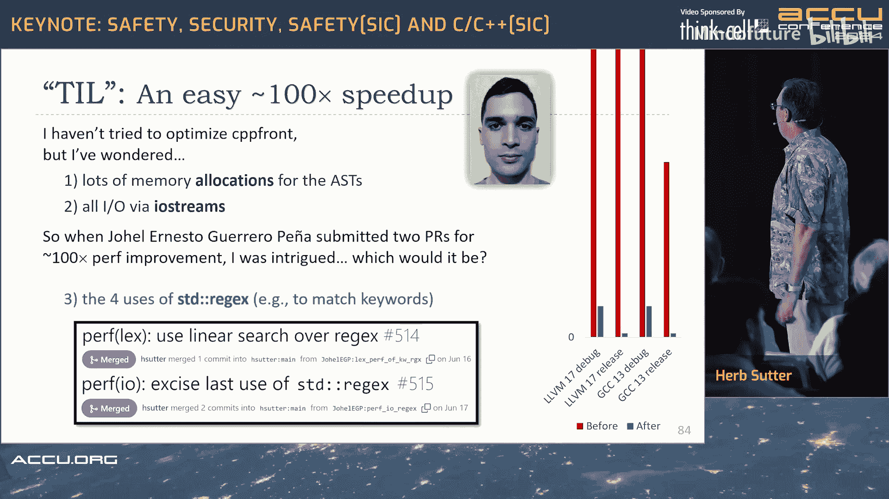

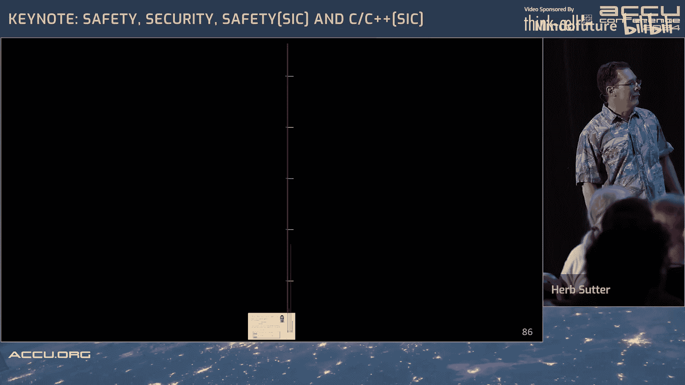

但让我告诉你我学到的一些东西。有一系列关于我学到的东西的幻灯片，但这里有一个可以过渡到接下来几个月将要发生的事情。

我还没有尝试优化cppfront，因为在我自己的使用中，它已经足够快了。大多数时候，大部分时间花在C++编译器上。所以我一直没觉得需要优化它。但我总是有点好奇。我使用I/O流处理所有I/O。我很懒，我知道以后可以用`stdio`代替。我用大量指针追逐的数据结构构建AST。一个表达式可能像10或50个节点，取决于它在表达式语法树中的深度。这些都是小内存分配，我们知道分配是昂贵的。

所以当Yoel Peña提交了两个PR，提供了50到120倍的性能提升（取决于用例，整体上cppfront快了两个数量级）时，我想：好吧，我想知道是哪一个（我提到的两个可能原因）起了作用，因为他觉得有必要做这个。

以下是差异看起来的样子。如果你看不到那些小的绿色条，让我稍微扩展一下，这样你就能看到那里确实有绿色。这是“之后”的图。它比我写的代码快一点。那么你认为是什么原因？我给了你一点提示。你认为这两个中的哪一个？答案是：**都不是**。他移除了我代码中四处使用`std::regex`的地方。因为我不常用`std::regex`。我想，我应该树立一个榜样，让我使用标准库，而且我不希望cppfront有非标准库依赖。所以我用了`std::regex`。我真傻。我没有意识到，现在我明白这意味着什么了：那四处使用正则表达式的地方（例如，为了匹配下一个东西是不是关键字，相当短、简单的正则表达式），你知道，也许我用错了。比如，我不知道，也许我只创建了一个`regex`对象并重用了它，但我不确定。也许我做错了。那四处使用主导了整个运行时的I/O、内存分配、整个编译过程的一切。

所以，谢谢你，Yoel。


为了说明背景，我们失去了图像。能恢复图像吗？哦，回来了，好。那些红色的条一直延伸到流的顶部。


所以谢谢你，Yoel。但也要谢谢你，Hana。Hana今天不能来，她要在接下来两周参加另外三个会议。但非常感谢你，Hana，感谢你在过去七年左右在编译时正则表达式方面所做的所有工作，它使用`constexpr`函数和模板来解析正则表达式（如果你在编译时知道它），然后在编译时解析它。你知道运行时工作有多少，然后就会少很多，对吧？然后它有编译时和运行时匹配，并输出非常高效的汇编代码。而且它有效。C、CTRE和Rust在图的左侧并驾齐驱，例如。C++和PHP则远远在右边。我相信C++是`std::regex`。

所以谢谢你，Hana。

这与cppfront的关系是：来自德国的Max Sagebaum正在研究，既然在cppfront（CPP2）中我们有反射和源代码生成，我们能否在不使用太多模板和模板元编程`constexpr`函数的情况下，做Hana正在做的事情？我不认为Hana做了很多TMP。但想法是：我们使用模板做了太多编译时工作，这是为什么C++编译时间随着我们试图改进标准而变得越来越慢的一个主要原因。但我们正在将更多花哨的工作移到一个从未设计用于计算的模板实例化引擎中。你不应该在那里写逻辑。但结果证明它太不完整了，所以你可以，所以每个人都这样做，对吧？但这是一种非常低效的运行方式。顺便说一下，那些已经使用过`constexpr`函数（就像在编译时运行的常规函数）的人，是的，它本质上需要在编译器中有一个C++解释器。你会想：哦，不，我在我的编译器里添加了第二个编译器。是的，你是。而且它几乎总是比TMP等价物快得多。因为你是在声明你的意图，你的编译器会回报你，而不是滥用模板实例化机制（它必须做很多其他事情，并且从未为通用计算而设计）。

所以Max所做的是（至少最初是为了解析），他用反射和代码生成替换了模板栈，因为CPP2有这些东西，所以你可以反射代码，并且可以生成更多的源代码，这些源代码会被flex解析并添加到你的项目中。

所以调用代码的源代码看起来与CTRE（左侧）和cppfront（右侧）非常相似。主要区别在于，代替CTRE的`consteval`和模板代码，很多变成了一个编译时元函数，他称之为`regex`，当你在编写类型时应用它。这是他选择的方式，其中`x`是类型的一个成员。但有不同的方法可以做到这一点，这是他选择的方式。

示例运行时结果表明，这仍然不完整，还不能从中得出结论。但它似乎与CTRE相当。在这个特定的运行中，它快了一点，但不要下结论。我们还不能说它更快。测试仍在进行中。Max的版本还不支持Unicode，例如，所以CTRE比Max的版本做了更多工作，因为它支持更多功能。但这仍然是一个初步的、有希望的结果，表明我们处于同一个水平，而不是那个水平。

那么编译时间呢？这是编译428个正则表达式，这是Haskell正则表达式一致性测试套件。再次强调，现在下性能结论还为时过早。但我没必要用对数刻度。在编译时间方面，它处于同一个水平。

现在请注意，然后让我说明一点。首先，我们正在探索是否可以使用反射和生成来获得相同的编译时好处，但代码更清晰，甚至可能编译时间更少，并且仍然获得相同的运行时好处。所以，以Hana的工作为基础并继续推进，说如果我们越来越多地使用反射和代码生成而不是模板会怎样？早期结果是有希望的，我们可以学习这一点，并将同样的东西用于ISO C++的演进。这并不依赖于CPP2和cppfront。我只是碰巧写了那个实现作为一个测试平台和实验，在这里效果很好。

但我想指出一些事情，因为我经常听到这个。很多人会对我说：是的，但cppfront很棒。但你在运行另一个完整的编译器。而我的C++编译器已经太慢了。所以我完全理解。我的编译器已经很慢了，而你告诉我甚至在我到达我的编译器之前还要运行另一个编译器。嗯。但你必须计算正确的东西。在这个特定的例子中，那个小条（CTRE当然没有CPP2步骤，所以条是0）。但这是整个条，它更像是一条线，表示cppfront编译器生成正则表达式的速度有多快。大部分工作是在中间的C++编译器中。但看看我们交换了什么，至少到目前为止：我们获得了这么多的改进，减少了C++编译器的运行时间，代价是这么多。所以当你说“是的，我正在做以前没有做的额外工作”时，**它花费的成本必须包括它为你节省了你原本必须做的工作**。这意味着做额外的工作可能更快。我们所有人都学过缓存、缓存结果。比如当你做重复查找时。你们中有多少人在过去一个月里写过“我要缓存你的结果”？所以你做了更多工作，你使用了更多空间。但因为你没有做它替换的工作，你的程序运行得更快。`constexpr`代码现在本质上是在你的C++编译器中运行一个完整的C++解释器。所以你会想，嗯，那更慢。是的，它增加了成本，但它取代了更大的成本，因为用模板元编程表达相同的东西甚至更慢。所以那是净速度提升。

所以我认为这是一个很好的思考方式。这里的经验是：是的，你在运行另一个编译器。但它是一个简单得多的编译器，即使你在做很多元函数工作，比如正则表达式所做的源代码生成和反射。

所以Max在未来几个月的目标（也许我今年晚些时候会有更新）是进一步推进这一点，使用反射和代码生成，不仅用于解析，也用于引擎，并在实际生成的代码中使用更少的模板来进行正则表达式匹配，因为我们可以生成代码，我们可以用更少的可重用模板制作普通代码。

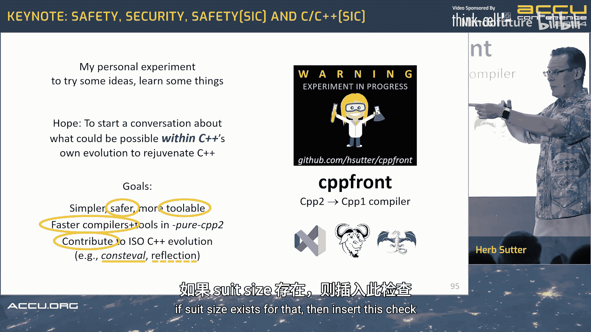

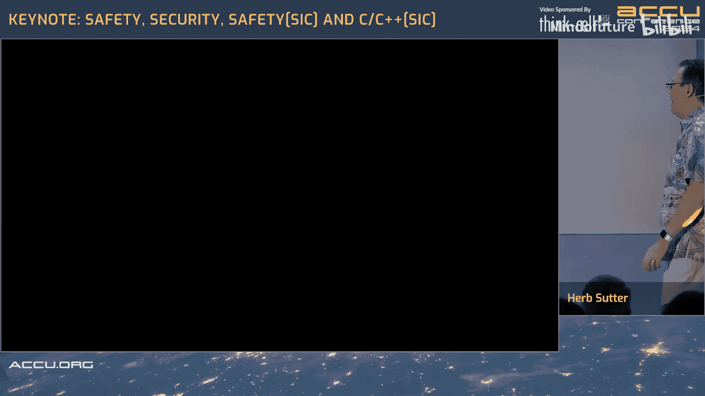

这将是一个有趣的实验。我认为圣杯，就像Hana，我知道，同意这一点。圣杯是语言内置的正则表达式，编译器可以直接为你优化所有这些。但我是一个大粉丝，特别是现在我们即将拥有反射和编译时代码生成，并且至少已经有了一些工作原型。我们能在多大程度上使用这个通用功能，而不是将又一个功能硬编码到一门大语言中？我们能否将其表达为一个使用反射和生成的编译时普通`constexpr`函数？这将很好理解。如果我们能通过反射和源代码生成获得相同的可用性，甚至可能更好的编译时间，那将比等待我们所有的编译器供应商去实现C++29的内置正则表达式功能更可取。顺便说一下，目前还没有这样的提案。但你知道，如果我们没有即将到来的反射和生成，可能会有。

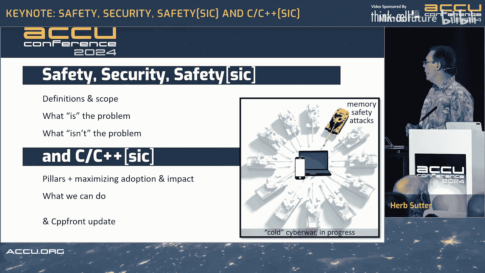

所以这仍然是我的个人实验，用来尝试一些东西。我很高兴看到其他人也在用它来尝试一些东西。

目标是你今天听到很多的内容。所以这大致是我以前展示过的一张幻灯片。但我们今天讨论了很多关于安全的内容。我们讨论了很多关于改进我们的工具以使安全在编译时成为默认设置。但我们也讨论了工具性，就编译时间而言。我们如何解决编译器慢的问题？我已经知道如何用一种更简单的语言做到这一点，但我也想为ISO标准C++做出贡献，特别是当我们正在生成现在已经很深入（甚至可能用于C++26，祈祷吧）的提案时，用于反射和一些代码生成。

我之前提到过，我在CPP2中所做的工作（甚至在cppfront这个特定编译器存在之前），我大约从2015年就开始做了，并向标准贡献东西。所以第一件事是`operator<=>`（三路比较运算符），它来自那项工作，已经被标准化，现在在C++20中。我没有告诉人们（有几个人知道，但我没有告诉人们它来自CPP2）。我只是说，嗯，我口袋里有一个设计，要我写一个提案吗？所以我写了，委员会喜欢它，然后修复了它。谢谢。但紧接着`consteval`就来了。所以`consteval`在C++20中。它来自CPP2工作，因为Lock3（Andrew Sutton和他的团队）正在构建一个CPX编译器（当时还不叫CPP2），并看到了对`consteval`的需求。所以去提议了它。所以我们已经在标准中拥有`consteval`的原因（甚至在我们拥有反射之前两个标准）是因为我们将其用于反射。Andrew意识到在C++中，你需要一种方式来说这个函数在编译时运行。在CPP2中，你放一个`@`，所以你已经可以分辨出来。但在今天的C++中，等价物还不存在，所以我们需要`consteval`。即使是C++26的反射提案（有两个主要的，Andrew Sutton的Lock3和David Vandevoorde在EDG实现中做了很多工作，谢谢你，David），Lock3来自CPP2。它是为了开发CPP2而获得资助的。所以我致力于以合作的方式将这些贡献回ISO C++演进。我对分裂和拥有一个分支语言或竞争性的后继语言不感兴趣。这些词从未出现在我的脑海中。但是，我们可以合作做些什么来推动C++向前发展？所以我最后在这里谈到了反射。但边界检查、自动边界检查已经在cppfront中实现了。我可以实现它，我相信一个真正的C++编译器实现者可以实现它。我知道这并不难。因为你需要做的就是看到一个下标表达式（你在解析树中很容易知道它就在那里），然后你就可以直接发出代码。如果你愿意，你可以从cppfront的支持库中获取它，它说：如果`std::size`对该类型存在，则插入此检查。这很容易做到。

---

## 总结

在本节课中，我们一起学习了C++在安全领域面临的挑战与机遇。

我们明确了**软件安全**、**软件安全性**和**编程语言安全**的区别与联系，认识到提升语言安全是获得更安全软件和更高生产力的重要手段。

我们分析了C++当前在**类型安全**、**边界安全**、**初始化安全**和**生命周期安全**这四个核心领域存在的缺陷，这些是导致大量内存安全漏洞的根源，也是其他内存安全语言的主要优势所在。

我们探讨了通过**安全配置文件**框架来默认强制执行已知安全规则的愿景，强调了**在构建时检查**和**默认安全**的重要性。同时，我们也必须清醒地认识到，内存安全只是软件安全全景图中的一部分，绝不能忽视凭证管理、供应链安全、社会工程学等其他攻击向量。

最后，我们了解了cppfront项目作为实验平台，在探索边界检查、反射与代码生成以改善安全性和编译时性能方面的努力。这些实验旨在为ISO C++标准的未来演进提供可行的思路和贡献。


记住，攻击者无处不在，他们正在给我们造成巨大的痛苦。在讨论C++及其他语言的安全性和其他安全方式时，让我们时刻关注所有这些威胁。