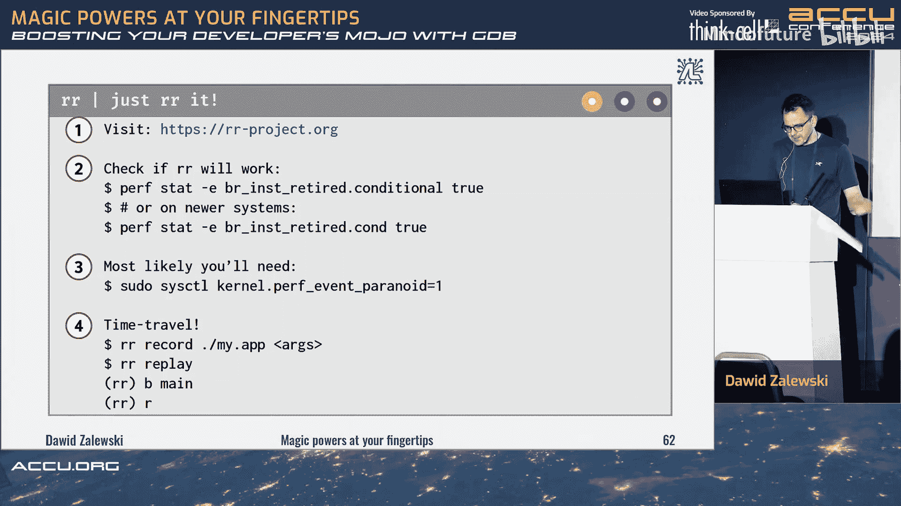

# 020：使用GDB提升C/C++开发者的调试能力


## 概述

在本教程中，我们将跟随Dawid Zalewski的演讲，学习如何使用GDB（GNU调试器）来提升C/C++程序的调试能力。我们将从调试的基本概念开始，逐步深入到更高级的功能，如断点管理、栈帧导航、核心转储分析以及时间旅行调试。本教程旨在让初学者也能轻松理解并掌握这些强大的调试技巧。

---

## 什么是调试？🤔

上一节我们介绍了本课程的目标，本节中我们来看看调试的核心定义。

调试不仅仅是“识别和移除计算机硬件或软件中的错误”。对于程序员而言，调试是一种“涌现性活动”。它发生在程序的**心智模型**（我们预期程序如何运行）与**观察到的运行时行为**不一致，并且这种不一致的原因无法轻易被发现时。

例如，考虑以下简单程序：
```c
int numbers[] = {017, 025, 1764};
int result = numbers[2] / (numbers[0] + numbers[1]);
return result; // 预期返回42
```
我们的心智模型是 `1764 / (17+25) = 42`。但程序实际返回49。仅通过 `printf` 打印结果无法找到原因，这时就需要启动调试器。

---

## GDB入门：编译与启动 🚀

上一节我们了解了调试的时机，本节中我们来看看如何为调试准备程序并启动GDB。

为了有效调试，我们需要在编译时包含调试符号。使用 `-g` 标志告诉编译器生成这些符号。为了获得最佳GDB体验，建议使用 `-g3` 并保留帧指针。

以下是编译调试版本程序的命令：
```bash
g++ -g3 -fno-omit-frame-pointer -O0 -o my_program my_program.cpp
```

编译完成后，我们可以启动GDB：
```bash
gdb ./my_program
```
在GDB中，使用 `start` 命令（它会在 `main` 函数入口处设置一个临时断点并开始运行）比直接使用 `run` 命令更便于开始调试。

启动后，GDB会显示即将执行的下一行代码。你可以使用以下基本命令控制执行：
*   `next` (`n`): 执行下一行代码（不进入函数内部）。
*   `step` (`s`): 执行下一行代码（会进入函数内部）。
*   `print` (`p`): 打印变量或表达式的值。
*   `list` (`l`): 显示当前位置附近的源代码。

---

## 控制执行流与栈帧导航 🧭

上一节我们学会了如何开始调试和执行下一步，本节中我们来看看如何在函数调用间穿梭并理解调用栈。

当程序调用多个函数时，`next` 和 `step` 的区别至关重要。`step` 会进入被调用的函数内部，而 `next` 则将其作为一个整体执行。

在函数内部，你还可以：
*   `finish`: 继续执行，直到当前函数返回。
*   `return <value>`: 强制当前函数立即返回指定值（用于修改程序行为进行测试）。

程序运行时，每个函数调用都会在调用栈上创建一个**栈帧**。GDB允许你查看和导航这些栈帧。

以下是相关的命令：
*   `backtrace` (`bt`): 显示完整的调用栈（所有活动的栈帧）。
*   `frame <n>`: 切换到编号为 `n` 的栈帧。
*   `up`/`down`: 在调用栈中向上或向下移动一层。
*   `info args`: 显示当前栈帧的函数参数。
*   `info locals`: 显示当前栈帧的局部变量。

当程序崩溃（如段错误）时，`backtrace` 命令是定位问题发生位置的首要工具。

---

## 高级断点与观察点 🎯

上一节我们学习了如何在崩溃后分析现场，本节中我们来看看如何主动设置断点来捕获特定事件。

除了在函数入口设置断点 (`break function_name`)，GDB还支持更精细的控制：

以下是设置和管理断点的方法：
*   `break file.c:line_number`: 在特定文件的特定行设置断点。
*   `tbreak`: 设置临时断点（只触发一次）。
*   `condition <breakpoint_id> <condition>`: 为断点设置触发条件（例如 `condition 1 x > 100`）。
*   `ignore <breakpoint_id> <count>`: 忽略断点前 `count` 次触发。
*   `enable`/`disable`/`delete`: 启用、禁用或删除断点。
*   `info breakpoints`: 列出所有断点。

GDB还可以设置特殊的**捕获点**来拦截异常：
```bash
catch throw std::logic_error # 当抛出 std::logic_error 时中断
catch catch std::logic_error # 当捕获 std::logic_error 时中断
```

---

## 数据检查与“打印调试” 📊

上一节我们掌握了控制程序执行的方法，本节中我们来看看如何有效地检查和输出数据。

`print` 命令功能强大，GDB内置了“漂亮打印”功能来优雅地显示复杂数据结构（如STL容器）。

除了简单的 `print`，还有更强大的数据输出方式：
*   打印数组的多个元素：`print *array@10` （打印数组的前10个元素）。
*   `display <expression>`: 每次程序暂停时自动打印指定表达式的值。
*   `printf “格式字符串”, 表达式1, 表达式2, …`: 像C语言的 `printf` 一样格式化输出。
*   `dprintf <location>, “格式字符串”, 表达式…`: 在指定位置（如函数入口）动态注入一个 `printf` 语句，无需修改源代码即可进行“打印调试”。例如：
    ```bash
    dprintf add_deposit, “size is %d, deposits are %v\n”, size, deposits
    ```

你甚至可以在调试会话中调用程序中的函数来测试逻辑：
```bash
call to_lower(some_string)
```
**注意**：调用函数时需确保参数类型完全匹配，因为不会发生运行时转换。

---

## 分析核心转储文件 💾

上一节我们学习了实时检查数据，本节中我们来看看如何分析程序崩溃后生成的内存转储文件。

核心转储是程序崩溃时内存状态的快照。首先，需要确保系统允许生成核心转储：
```bash
ulimit -c unlimited
```
程序崩溃后，核心文件（如 `core` 或 `core.<pid>`）会被生成。你可以用GDB加载它进行分析：
```bash
gdb ./my_program core
```
加载后，GDB会停在程序崩溃的位置。此时，你可以像调试活进程一样使用 `backtrace`、`print`、`frame` 等命令来调查崩溃原因，例如空指针解引用、数组越界等。

---

## 时间旅行调试 ⏳

上一节我们分析了静态的崩溃现场，本节中我们来看看如何动态地回放程序执行历史。

GDB内置了**反向调试**功能，允许你“倒带”执行历史。这对于理解导致崩溃的一系列事件特别有用。

基本工作流程如下：
1.  在可能发生问题的地方设置断点。
2.  开始记录执行轨迹：`record`。
3.  继续执行直到崩溃：`continue`。
4.  使用反向命令回溯：
    *   `reverse-next` (`rn`): 反向执行一行（不进入函数）。
    *   `reverse-step` (`rs`): 反向执行一行（会进入函数）。
    *   `reverse-continue` (`rc`): 反向继续执行直到上一个断点。
    *   `reverse-finish`: 反向执行直到当前函数被调用时。

**注意**：GDB的 `record` 功能可能对使用了特定CPU指令（如SSE）的程序支持不佳。一个更强大的替代工具是Mozilla的 **RR**，它提供了更稳定和易用的录制与回放功能。

使用RR的基本步骤：
```bash
rr record ./my_program # 录制执行
rr replay # 回放并进入GDB调试会话，之后可以使用所有正向和反向调试命令
```

---

## 总结



在本教程中，我们一起学习了GDB调试器的强大功能。我们从调试的基本概念和GDB入门开始，逐步掌握了控制执行流、导航栈帧、设置高级断点、检查数据、分析核心转储文件，最后甚至体验了“时间旅行调试”——反向执行程序。


记住，GDB不仅仅是一个简单的步进工具。通过条件断点、命令脚本、`dprintf`、反向调试以及像RR这样的外部工具，你可以系统地调查和解决复杂的软件缺陷。将这些技巧融入你的工作流程，将极大地提升你诊断和修复C/C++程序问题的能力。