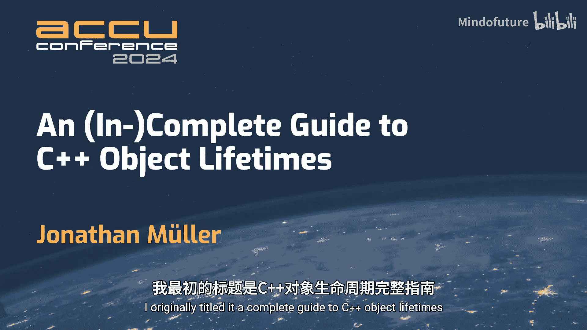

# 022：一份（不）完整的指南

## 概述

在本教程中，我们将学习C++中对象生命周期的核心概念。我们将从最基础的定义开始，逐步深入到存储、类型、值、初始化、销毁以及一些高级话题，如临时对象、placement new、隐式对象创建、指针来源（provenance）和类型双关（type punning）。理解这些概念对于编写正确、高效的C++代码至关重要。

## 什么是对象和生命周期？

在C++标准中，“对象”是一个基础术语，与面向对象编程无关。程序中的所有操作本质上都是在创建、销毁、引用、访问和操作对象。

一个对象包含三个核心属性：
1.  **存储**：对象在内存中占据的一块连续字节区域。
2.  **类型**：规定了如何解释存储中的比特序列，从而得到一个有意义的**值**。类型本质上是一个从数据（比特序列）到值的映射函数。
3.  **值**：对象在某个时间点所代表的数学意义上的值。值本身是恒定的（例如数字42），但对象存储的值可以改变（除非对象是常量）。

**生命周期**是对象的一个时间属性。只有在对象的生命周期内，我们才能安全地访问和操作它。在生命周期开始前或结束后访问对象，会受到严格限制，通常会导致未定义行为。

对象生命周期的宏观流程如下：
1.  为对象**分配存储**。
2.  **初始化**对象，这**开始**其生命周期。
3.  在生命周期内**使用**对象（读取、修改其值）。
4.  **销毁**对象，这**结束**其生命周期。
5.  （可选）在之后的某个时刻**释放**对象的存储。

需要注意的是，“创建”对象在标准中仅意味着我们有了一个可以讨论的抽象实体，而“销毁”则是一个实际结束生命周期的操作。生命周期是C++标准为了描述程序语义而发明的概念，与实际物理机器的执行没有直接关系。

## 第0级：变量声明

对象可以通过定义来创建。例如，一个`int`变量的定义会创建对象、分配存储并开始其生命周期。

要理解存储分配和生命周期开始的精确时机，我们需要查看对象的**存储期**。存储期定义了包含对象的存储的最小潜在生存时间，由创建对象的构造方式决定。

以下是三种常见的存储期：

*   **自动存储期**：适用于在块（或函数）作用域内定义且没有特殊关键字（如`static`）的变量。
    *   **存储分配**：当程序执行流遇到变量定义时分配存储。
    *   **生命周期开始**：对于自动存储期，分配存储的同时也完成了初始化，生命周期随即开始。
    *   **生命周期结束/存储释放**：当变量所在的块退出时，对象被销毁，存储被释放。

*   **静态存储期**：适用于命名空间作用域的变量（全局变量）或使用`static`关键字声明的变量。
    *   **存储分配**：在程序启动时分配存储。
    *   **生命周期开始**：初始化可能发生在不同时间（常量初始化、动态初始化），这很复杂。生命周期在初始化完成时才开始。
    *   **生命周期结束/存储释放**：在程序终止时释放存储。

*   **线程存储期**：适用于使用`thread_local`关键字声明的变量。
    *   **存储分配**：当线程启动时为该线程分配存储。
    *   **生命周期开始**：初始化完成后开始。
    *   **生命周期结束/存储释放**：在线程终止时释放存储。

对于自动存储期变量，初始化是可选的。如果不进行初始化，对象将拥有一个**不确定的值**。在赋予它一个确定值之前读取该对象会导致未定义行为（在C++26中将是“错误行为”）。但是，可以为其赋值。

## 第1级：new 和 delete

对象也可以通过`new`表达式创建，并通过`delete`表达式销毁。

`new`表达式会分配存储、创建对象并开始其生命周期。`delete`表达式会销毁对象、结束其生命周期并释放存储。与变量声明类似，也可以创建具有不确定值的堆对象。

## 临时对象

当需要一个对象，但手头只有一个纯右值（prvalue，例如字面量`42`或返回值的函数调用）时，编译器会创建一个**临时对象**。这个过程称为**临时物化**。

需要创建临时对象的常见情况包括：
*   将纯右值绑定到引用（非常量左值引用除外）。
*   对纯右值进行成员访问（例如`getString().size()`）。
*   使用`auto`声明变量（因为`auto`需要推导类型）。
*   丢弃一个返回纯右值的函数的结果（为了调用析构函数）。

临时对象的生命周期在其被创建的完整表达式结束时结束。但是有两个重要的例外，称为**临时对象生命周期延长**：

1.  **直接绑定到引用**：当一个引用直接绑定到一个临时对象时，该临时对象的生命周期被延长到与引用相同。
2.  **基于范围的for循环**：在C++23及以后，在基于范围的`for`循环的“范围表达式”中创建的临时对象，其生命周期会持续整个循环。

使用临时对象生命周期延长需要非常小心，因为它只在引用**直接**绑定到临时对象时触发，而不是绑定到临时对象内部的子对象时。

## Placement New

`placement new`是一种特殊的`new`表达式，它不分配内存，只显式地在给定的内存地址上调用构造函数来创建对象。这允许我们手动控制对象的创建。

要使用`placement new`，首先需要获得一块内存（例如通过`malloc`、`operator new`或字符数组）。然后，使用`placement new`在该内存上构造对象。要手动销毁对象，需要显式调用析构函数（例如`obj.~T();`或`std::destroy_at(&obj)`）。

`placement new`允许我们重用对象的内存。销毁旧对象后，可以在同一块内存上构造一个新对象。如果新旧对象满足**透明可替换**的条件，那么指向旧对象的指针、引用甚至变量名都会自动指向新对象，可以继续使用。

透明可替换的条件是：
1.  新旧对象占据相同的存储位置。
2.  新旧对象具有相同的类型（忽略顶层cv限定符）。
3.  不属于以下例外情况：常量对象（非堆分配）、基类子对象、具有`[[no_unique_address]]`属性的成员。

如果替换不是透明的（例如，改变了类型，或替换了堆上的常量对象），则必须使用`std::launder`来“清洗”指针，以更新其**来源**信息，然后才能安全地解引用。

## 隐式对象创建

为了兼容C语言代码（如`malloc`后直接使用），C++20引入了**隐式对象创建**。对于**隐式生命周期类型**（其构造函数和析构函数是平凡/无操作的），某些操作（如`malloc`、`operator new`、`memcpy`）会隐式地创建并开始对象的生命周期，以防止未定义行为。

这意味着，像`int* p = (int*)malloc(sizeof(int)); *p = 42;`这样的代码在C++20后是定义良好的，因为`malloc`被指定为可以隐式创建`int`对象。

## std::start_lifetime_as

有时我们需要显式地“开始”一个对象的生命周期，但不希望改变底层字节（即不进行初始化）。`std::start_lifetime_as`函数正是用于此目的。它接受一个指向内存的指针和一个类型，并返回一个指向该类型对象的指针，该对象的生命周期被视为已经开始，其值就是该内存字节的位表示。

这对于处理来自网络、文件映射等的外部数据非常有用，可以安全地将字节序列解释为特定类型的对象。

## 指针来源

一个指针包含两部分信息：**地址**和**来源**。来源标识了指针最初指向的是哪个对象或分配区域。

**关键点**：即使两个指针的地址值相同，如果它们的来源不同，它们也不指向同一个东西，不能互换使用。指针算术不会改变指针的来源。

`std::launder`的作用就是接受一个指针，返回一个具有相同地址但更新为当前有效来源的新指针。这在非透明对象替换后需要继续使用旧指针时是必要的。

来源是C++标准为了优化（如别名分析）而引入的语义概念，并非硬件特性。

## 类型双关与严格别名

**严格别名规则**指出：程序试图通过一个与对象类型不相似（不兼容）的类型的左值来访问对象，是未定义行为。

**重要澄清**：你可以随意进行`reinterpret_cast`转换指针类型。未定义行为发生在你通过转换后的指针**解引用并访问对象**时，而不是在转换指针本身时。

因此，类型双关（用一种类型的视角访问另一种类型对象的内存）必须小心处理。以下是几种可能有效的方法：

1.  **通过`std::start_lifetime_as`**：结束旧对象的生命周期，开始新类型对象的生命周期。之后不能再用旧类型的名称/指针访问。
2.  **通过`memcpy`**：将字节从一个对象复制到另一个对象。这是定义良好的。
3.  **通过`std::bit_cast`**（C++20）：一种类型安全的`memcpy`。
4.  **通过联合体**：在C++中，更改联合体的活跃成员会销毁旧对象并创建新对象，因此通过旧成员访问是未定义行为。但有一个例外：如果两个标准布局结构体拥有共同的初始序列，则可以通过任一成员访问该共同部分。
5.  **通过指针可互转换**：如果两个对象是指针可互转换的（例如，标准布局对象与其第一个非静态数据成员），则可以通过`reinterpret_cast`在指向它们的指针之间转换并访问。

## 无效指针和“僵尸”指针

在对象的生命周期结束后、其存储被释放前，指向该对象的指针被称为“僵尸指针”。对僵尸指针的使用受到限制：
*   **允许**：复制指针、比较指针、转换为`void*`、用于`delete`表达式（如果指针指向堆对象且未被释放）。
*   **不允许（未定义行为）**：解引用指针读取或修改值、调用非静态成员函数、进行涉及虚基类或`dynamic_cast`的操作。

当对象的存储被释放后，所有指向该存储内部的指针都变成**无效指针值**。解引用无效指针是未定义行为，其他操作（如比较）是**实现定义**的。这允许实现进行一些安全措施（如将`delete`后的指针设为`nullptr`）或优化。

在多线程无锁数据结构中，无效指针的语义可能导致微妙的问题，因为标准当前的规定可能使一些常见的模式（如使用比较交换的栈）出现实现定义甚至问题行为。这是标准中一个活跃的研究领域。

## 总结与实用指南

本节课我们一起深入探讨了C++对象生命周期的复杂世界。我们从对象的基本定义出发，逐步学习了存储期、临时对象、手动内存管理、隐式创建、指针来源和类型双关等高级主题。

作为开发者，以下是一些实用建议：
*   **不要依赖隐式对象创建**：语义复杂且不直观。使用`placement new`来显式创建对象。
*   **关心原有数据时使用`std::start_lifetime_as`**：当你需要将一片内存解释为某个类型的对象而不改变其字节时。
*   **优先使用`placement new`或`start_lifetime_as`返回的指针**：它们保证具有正确的来源。
*   **必要时使用`std::launder`**：在非透明替换后需要继续使用旧指针时。
*   **避免字符缓冲区，使用联合体**：在实现类似`std::optional`的类时，使用联合体比字符数组更简单，能避免一些标准漏洞。
*   **理解规则但优先使用清晰、明确的代码**：C++的这些规则很复杂，但编写清晰、意图明确的代码通常比依赖隐晦的语言机制更安全、更易维护。