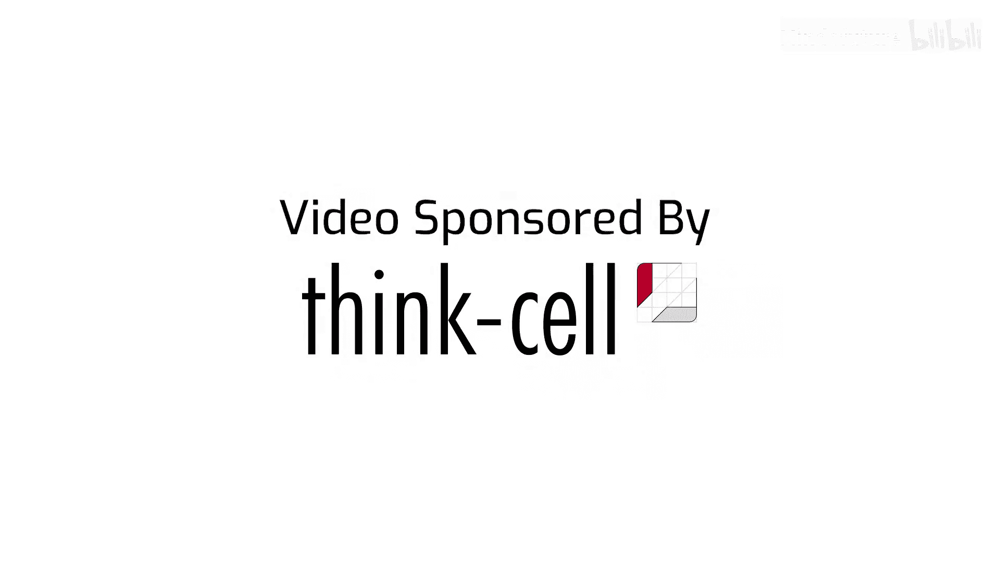
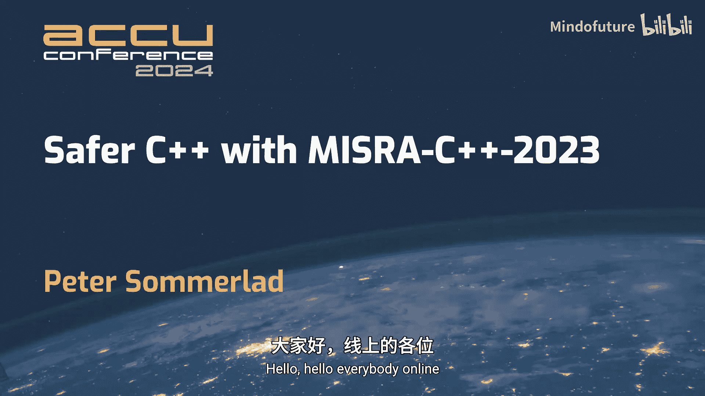
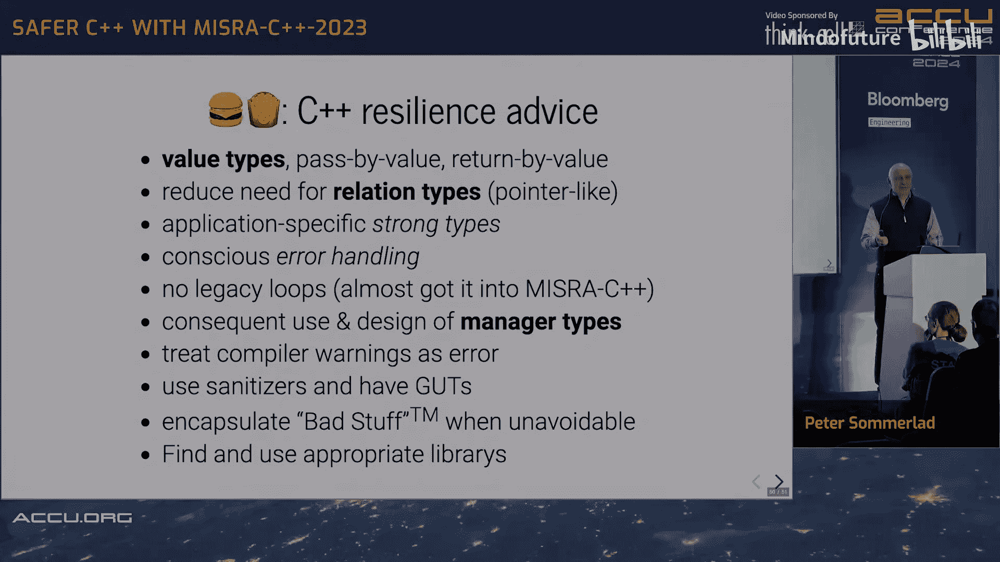

# 023：使用MISRA C++ 2023编写更安全的C++代码





## 概述

在本教程中，我们将学习如何利用MISRA C++ 2023指南来编写更安全的C++代码。MISRA指南最初源于汽车行业，旨在通过一系列规则和最佳实践，减少软件中的未定义行为、实现定义行为和未指定行为，从而提升关键安全系统（如汽车、医疗设备）的软件质量。我们将探讨其核心理念、常见误区，并通过具体示例理解如何在实际编码中应用这些原则。

---

## 课程内容

### 1. 动机与背景

上一节我们概述了本课程的目标。本节中，我们来看看MISRA指南诞生的背景和核心动机。

MISRA（汽车工业软件可靠性协会）指南的制定，源于对安全关键系统中软件质量日益增长的需求。当软件故障可能导致人身伤害、重大财产损失或环境危害时，就需要更严格的编码标准。

MISRA C++ 2023版主要针对C++17标准，其核心目标是：
*   **消除未定义行为**：这是C++中最危险的一类问题，程序行为完全无法预测。
*   **限制实现定义和未指定行为**：使代码在不同平台和编译器上的行为更可预测。
*   **充当安全护栏**：通过静态分析等工具，在编码阶段及早发现潜在问题。

与早期版本相比，MISRA C++ 2023试图在禁止危险操作和允许现代、良好的C++实践之间取得平衡。

---

### 2. 安全编程的核心挑战

理解了MISRA的动机后，我们需要明确C++编程中面临哪些具体的安全挑战。

C++继承了C语言的强大与灵活，但也继承了其复杂性，这带来了几类主要问题：

1.  **未定义行为**：标准未规定行为，结果完全不可预测。这是安全性的最大敌人。
    *   **示例**：有符号整数溢出、解引用空指针、数组越界访问。
2.  **实现定义行为**：标准允许编译器或硬件平台自行定义的行为。
    *   **核心示例**：`int`类型的大小和范围。`int`的溢出也是未定义行为。
    *   **公式**：对于有符号整数类型`T`，`T_MAX + 1` 是**未定义行为**。
3.  **未指定行为**：标准规定了必须达到的效果，但未规定具体实现细节。
4.  **误解与固有观念**：程序员对语言特性的误解可能导致错误。
5.  **代码演化问题**：代码编写时的假设在未来（如移植到新平台时）可能不再成立。

---

### 3. 基础防御措施

面对这些挑战，在深入具体规则前，我们首先应建立一些基础的、有效的防御措施。

以下是每个C++项目都应采用的基础安全实践：

*   **开启并严苛对待编译器警告**：这是第一道也是最重要的防线。
    *   **代码示例**：在编译命令中使用 `-Wall -Wextra -Wpedantic -Werror`（GCC/Clang）或对应MSVC选项。
*   **采用测试驱动开发**：良好的单元测试能提供即时反馈，改善设计，并支持重构。
*   **使用动态分析工具**：如AddressSanitizer、UndefinedBehaviorSanitizer等，在运行时检测问题。
*   **利用C++类型系统和标准库**：这是与C语言相比的巨大优势。
*   **利用确定性的对象生命周期**：这是C++的“杀手级特性”。对象的析构在作用域结束时确定发生，结合RAII（资源获取即初始化）模式，可以安全地管理资源。
    *   **核心概念**：右花括号 `}` 标志着对象生命周期的结束和资源的自动释放。

---

### 4. 关于MISRA指南的常见误解

在应用指南之前，澄清一些常见的误解至关重要，这有助于我们更正确地使用它。

以下是关于MISRA指南的几个常见误解及其澄清：

*   **误解**：项目完成后才处理MISRA违规。
    *   **澄清**：错误做法。应从项目第一天起就启用静态分析工具，以获得即时反馈并养成良好习惯。
*   **误解**：100% MISRA合规等于100%安全。
    *   **澄清**：错误。合规只能避免语言层面的特定风险，无法保证软件逻辑正确（例如，刹车时代码却加速）。
*   **误解**：MISRA禁止编写“好”的代码。
    *   **澄清**：错误。MISRA指南**旨在被违反**——但必须是**有理由、有记录**的违反。这通过“偏差记录”来实现。
*   **误解**：标准库违反MISRA，所以我们不能使用。
    *   **澄清**：错误。标准库实现本身可能需要违反某些规则才能工作。编译器供应商会对其实现进行“鉴定”或“确认”，使其可用于安全关键系统。自己实现类似功能的库反而风险更高。
*   **误解**：MISRA规则冗余且令人困惑。
    *   **澄清**：冗余是**有意设计**，提供多层防御。有些规则（可判定）工具能精确检查，有些（不可判定或指令）则需要人工确保。

---

### 5. 规则体系与偏差处理

既然指南允许偏差，那么了解其规则体系和如何处理偏差就非常重要。

MISRA C++ 2023的规则体系结构如下：

*   **规则**：通常可由工具检查的条款。
*   **指令**：通常无法由工具自动检查，需要人工确保的条款。
*   **强制程度**：
    *   **必须**：强制性要求。
    *   **应**：强烈推荐，除非有充分理由。
    *   **宜**：建议性指导。
*   **可判定性**：
    *   **可判定**：工具可理论上完全判断。
    *   **不可判定**：工具只能尽力而为，无法保证100%覆盖。

**偏差处理**：当需要违反一条“必须”或“应”的规则时，必须创建**偏差记录**。记录需包含：
1.  对规则的引用。
2.  违反该规则的理由（技术性理由，而非个人偏好）。
3.  证明风险已得到缓解的论据。
4.  偏差的范围（应尽可能小，最好封装起来，避免重复偏差）。

---

### 6. 整数运算安全

现在，让我们看一个具体且危险的安全领域：整数运算。这是未定义行为的重灾区。

C++内置的整数类型，特别是`int`，存在诸多问题：
*   `int`的大小是**实现定义**的。
*   有符号整数（包括`int`）溢出是**未定义行为**。

**未定义行为概率示例**：
*   `x / 0`：100%（除零）。
*   `x / y`：接近0%，但需注意 `INT_MIN / -1` 也是未定义行为（结果无法表示）。
*   `x + y`（有符号）：约25%的随机值组合会导致溢出（未定义行为）。
*   `x * y`（有符号，32位）：对于随机值，溢出概率高达 **99.9999999%**（约7个9）。这意味着乘法几乎必然溢出！

**解决方案**：使用安全的整数类型库。
*   **目标**：消除隐式提升和未定义溢出。
*   **示例方法**：使用枚举类包装整数，并重载运算符。
    ```cpp
    // 概念性示例：一个简单的安全整数包装器
    enum class safe_int : int {}; // 基础类型
    // 需重载 +, -, *, / 等运算符，在运算中进行边界检查
    ```

MISRA相关规则：
*   **规则10.3**：不应使用标准整数类型，而应使用明确指定宽度的类型（如`int32_t`）。
*   **规则10.5**：不应使用隐式改变符号的表达式。

---

### 7. 类型系统与强类型

整数安全问题的根源之一在于C++类型系统（继承自C）过于“弱”。本节我们探讨如何通过“强类型”来提升安全性。

**弱类型系统**：允许大量隐式转换，容易掩盖错误。
**强类型系统**：限制隐式转换，使类型更贴合语义。

**强类型的意义**：`42` 在程序中代表什么？是年龄、重量、还是页码？使用`int`无法区分。强类型通过创建具有语义意义的类型来防止误用。

**如何创建强类型**：
```cpp
struct Age {
    int years;
    explicit Age(int y) : years(y) {}
    // 可添加验证逻辑
};
struct Weight {
    int grams;
    explicit Weight(int g) : grams(g) {}
};
// 现在，Age和Weight不能隐式转换，避免了 `Age a = Weight{70000};` 这样的错误。
```

**MISRA指南鼓励**：
*   使用明确的类型，避免隐式转换。
*   任何你觉得自己需要**强制转换**的地方，都可能是设计需要改进的信号。

---

### 8. 类设计安全

对于C++的核心特性——类，MISRA也提供了一系列安全指导原则。

以下是关于类设计的一些关键规则和理念：

*   **位域**：应避免使用C风格的位域，因其行为在很大程度上是实现定义的。如果需要位级操作，应考虑使用专门的库（如作者提供的`bitfield`库）或编译器扩展（并明确记录偏差）。
*   **联合体**：应避免使用C风格的`union`进行类型双关（例如，用一个`int`成员写，再用一个`struct`成员读），这是**未定义行为**。应使用`std::variant`（C++17）进行类型安全的联合。
*   **成员访问控制**：倾向于使所有成员为`public`（聚合类）或所有成员为`private`（封装类）。`protected`继承被认为风险较高，应谨慎使用。
*   **引用限定成员函数**：对于返回对象内部引用或指针的成员函数（如`.front()`， `.begin()`），应使用**左值引用限定符** (`&`)，防止在临时对象上调用它们而导致悬空引用。
    ```cpp
    class MyContainer {
        int* data_;
    public:
        int& front() & { return data_[0]; } // 只能在左值对象上调用
        // int& front() { return data_[0]; } // 危险：可在临时对象上调用
    };
    ```

---

### 9. 总结与核心建议

本节课中，我们一起学习了MISRA C++ 2023指南的背景、核心挑战、具体规则示例以及如何利用它编写更安全的代码。

作为总结，以下是一些核心建议，无论你是否需要严格遵循MISRA，都能极大提升代码安全性和质量：

1.  **立即启用严格编译警告**：`-Wall -Wextra -Werror` 是你的朋友。
2.  **重视测试**：建立良好的单元测试文化。
3.  **优先使用值语义**：传递和返回对象的值，避免不必要的引用/指针。
4.  **减少“关系类型”的使用**：谨慎使用引用、指针、迭代器、视图等，它们容易悬空。尽量缩小其生命周期和传播范围。
5.  **应用强类型**：为领域概念创建具体类型，而非滥用内置类型。
6.  **使用管理器类型**：利用RAII自动管理资源（内存、文件、锁等）。
7.  **避免原始循环**：优先使用算法和范围`for`循环。
8.  **封装“脏”代码**：如果必须使用不安全操作（如特定转换），将其封装在函数或类中，并集中记录偏差。
9.  **持续学习**：编程是一项需要持续精进的技能。




MISRA C++ 2023是一套详细的实践指南，虽然主要针对安全关键领域，但其蕴含的谨慎、明确和防御性编程思想，对所有C++开发者都有宝贵的借鉴意义。记住，目标不是盲目合规，而是编写出更健壮、更易维护的代码。