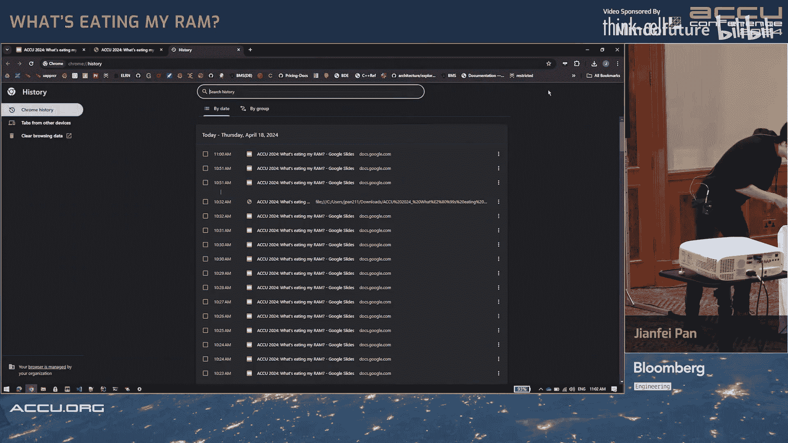

# 024：是什么在消耗我的内存——C++中的内存利用率分析

## 概述
在本节课中，我们将跟随演讲者张飞（音译）的亲身经历，学习如何分析和解决C++长运行服务中内存使用率持续升高的问题。我们将从收到内存告警开始，逐步深入到内存分配的基础原理、常见问题（如内存泄漏和内存碎片）的诊断方法，以及相应的解决策略。课程内容旨在为初学者提供一个清晰、实用的内存问题排查框架。

---

## 章节 1：问题起源——内存告警

我的故事始于一个告警。告警提示，某台机器的内存使用率达到了90%，需要立即处理。

我首先需要理解这个告警为何如此重要。在Bloomberg，我们有不同级别的告警，而这是最高级别，意味着必须停止服务并进行修复。

我询问了如果不采取行动的后果。答案很明确：首先，系统会进行更多的交换（Swap），操作系统会将不活跃的数据从内存移动到磁盘以腾出空间，这会导致性能下降。其次，操作系统不会允许单个服务占用所有内存，在Linux中，存在一个内存杀手（OOM Killer），它会终止你的服务，导致服务中断。最后，由于我们处于多租户环境，机器上的资源由所有进程共享，因此性能影响不仅限于你的服务，还可能波及到其他更关键、对性能更敏感的服务。这非常糟糕，是我们不希望发生的。

这就是为什么处理这个告警至关重要。

---

## 章节 2：定位问题进程

我需要找出是哪个进程导致了这个问题，因为告警是在机器级别（90%内存使用率）。我登录到那台机器并使用 `top` 命令，它给了我一个内存使用大户的候选列表。

从无告警到有告警，肯定发生了某些变化。我检查了过去几天这些进程的内存使用情况仪表盘，发现了问题。

你可以看到内存使用量从周一的1GB增长到了周五的7GB。这对于一个C++应用程序来说太多了，而且不正常。考虑到我的请求流量是稳定的，在周末并没有异常的请求推高内存使用量，所以问题出在我的代码上，它来自于最近的一次发布。

我的下一个问题是：我的代码是如何导致这个问题的？为什么会发生这种情况？

---

## 章节 3：回顾基础——代码如何影响内存使用

我回到基础知识，试图找出原因。本质上，我们需要理解在运行代码和内存使用率达到90%之间发生了什么。这是一个漫长的过程，但许多任务是由两个部分完成的：操作系统和内存分配库（malloc）。

首先，我们不需要直接处理硬件。操作系统会将所有物理内存、磁盘或其他设备映射到一个虚拟地址空间。从进程的角度看，我们使用的是虚拟内存，无需关心数据究竟在磁盘上还是在内存中，操作系统足够智能来移动数据。

其次是 `malloc`。`malloc` 是连接C++代码和虚拟内存的桥梁。这里我以Glibc的 `malloc` 实现为例。它看起来像这样：`malloc` 会从内核获取一些区域用于数据和文本段，以及一些区域用于堆和栈。

基本上，我的进程的内存使用量应该是这些区域的总和。我知道内核数据段和文本段很小且是静态的，不可能增长到几GB。栈是有限制的，这就是为什么会有栈溢出。唯一可能大量增长的就是堆。我想弄清楚堆为什么在增长。

让我们深入 `malloc` 看看它是如何工作的。

首先，堆只是一个连续的内存区域，被细分为块（chunk）。块是分配或释放的基本单位。当你调用 `malloc` 时，你分配一个块；当你 `free` 时，你释放一个块。

然后是多线程。在多线程环境中，我们需要允许多个活跃的内存区域。为此，我们有了竞技场（arena）。这个竞技场并不是实际的内存区域，而是一个结构体。这个结构体有一些指针指向它将要使用的堆。

例如，我们有一个主线程，主线程会使用这个主竞技场（main arena）。主竞技场告诉线程：“这是你要使用的堆，这是主堆。” 对于其他线程，会有其他竞技场。一个竞技场可以指向一个或多个堆。在这种情况下，这些堆与主堆不同，它们位于虚拟地址空间的其他地方，`malloc` 会使用系统调用 `mmap` 来为这些堆分配区域。

我们还有另一个系统调用 `brk`，这是用于扩展主堆的系统调用。当这两个系统调用被调用时，内存使用量就会上升，因为我们在向操作系统请求更多内存。

基本上，线程访问竞技场，竞技场指向堆，而堆被细分为块。

那么块是什么样子的？这是一个块。一个块可以被分配，成为一个使用中（in-use）的块。在使用中的块里，最重要的部分是有效载荷（payload），它正是 `malloc` 函数返回的地址。除此之外，还有一些元数据，如大小、前一个块的大小、所属竞技场、是否为 `mmap` 分配、前一个块是否在使用中等。所有这些元数据都是为了管理这些块。

块也可以被释放。当你释放一个块时，它并不会消失或被销毁，它仍然在那里。唯一的区别是，我们在有效载荷中有了更多的元数据，包括前向（forward）和后向（back）指针，使它看起来像一个链表。一个空闲块还可以与相邻的空闲块合并，形成更大的空闲块。

那么，当我们释放内存时发生了什么？`free` 只是标记该块为空闲以供重用，并没有销毁任何东西。从操作系统的角度来看，这块内存仍然属于 `malloc` 和该进程。这就是为什么在大多数C++应用程序的内存使用仪表盘上，你看到的内存使用曲线是上升的，保持平坦，有时会下降，但并不是每次调用 `free` 都会下降。

所有空闲块都在箱（bin）中管理。箱是另一种结构，它不是额外的内存，我们并没有移动任何东西，它只是一个带有索引和几个链表的结构体。这些空闲块根据它们的大小在不同的箱中管理。你可以看到，前向和后向指针被用于箱中的链表。

---

## 章节 4：内存分配与释放的全景图

现在我们把所有部分放在一起，看看当我们进行 `malloc` 和 `free` 时发生了什么。

例如，我有一个堆，有两个使用中的块（黄色）和两个空闲块（蓝色），这两个空闲块在箱中，有一个指针指向它们。

如果我发送一个分配请求，并且合适的箱中有那个块，我就直接使用它，将那个空闲块变为使用中的块，它就从箱中移除了。现在箱里只剩下一个空闲块。

如果我要释放那个块，我们只是把它放回去，将其变回空闲块。如果我要释放这个块，并且相邻的块也是空闲的，我们可以合并它们，变成一个更大的块。

如果我在我的箱里找不到任何合适的块，我需要一个更大的块，例如，在这种情况下，我会先调用 `brk` 来扩展我的堆，然后在顶部创建一个新的块。当那个块被释放时，它会回到箱中。

有一个例外情况：当你请求的内存太大时，`malloc` 会很聪明地忽略所有箱，它会直接使用 `mmap` 在虚拟地址空间的某个地方为你分配一块内存。当你释放那块内存时，我们会使用 `munmap` 直接将其返还给操作系统。这就是为什么有时你仍然会看到内存使用量下降，背后可能发生了 `munmap` 操作。

这是一个非常简化的版本，还有很多其他内容，比如线程缓存（tcache），在访问箱之前我们会先查看线程缓存，也许在那里已经找到了一个空闲块。最顶部的块管理方式略有不同，以便为下一次分配做准备。有时，你还可以看到堆会根据某些条件进行收缩。所有这些机制都是为了高效地重用空闲块。

回到我们的地图，可以说 `malloc` 很聪明，做了很多努力来重用空闲块，操作系统也很聪明，能在内存和磁盘之间移动数据以腾出空间。那么，问题可能出在哪里呢？

---

## 章节 5：第一个怀疑对象——内存泄漏

我开始检查。首先，我猜测：我是否有内存泄漏？内存泄漏的定义是：不再需要的内存没有被释放。这看起来完全符合我的情况：内存使用量随着流量持续上升。

以下是几个内存泄漏的例子：
1.  **`new` 了但忘了它**：这就是为什么我们更喜欢现代C++并强调RAII（资源获取即初始化），因为有了RAII，就没有对象泄漏，也就没有资源泄漏，因为每个对象背后都是一种资源，比如线程或内存。
2.  **即使使用STL容器**：例如，如果你的容器中保留了不再需要的条目。是的，最终当容器销毁时它们会被销毁，但这仍然是一种泄漏，因为你不再需要它们了，却还保留着。
3.  **缺少虚析构函数**：这是我们在代码中可能犯的错误。当对象被销毁时，基类中的资源将会泄漏。
4.  **循环引用**：想象在一个到处使用 `shared_ptr` 的世界里，它就变成了一个垃圾收集器。而这个基于引用计数的垃圾收集器的基本问题就是循环引用。没有人放手，你就得到了泄漏。

这些是我想到的四个例子。如果你有其他例子，请告诉我。

现在的问题是：我是否有这些问题？如何发现它们？你可以检查代码中是否有这些情况，但这工作量太大了。所以我们需要工具。我尝试了一些。

---

## 章节 6：诊断工具（一）——代码级与库级检测

我首先尝试了测试分配器（test allocator）。

对于那些不熟悉分配器的人：分配器为给定容器处理所有内存分配和释放的请求。在标准讨论的早期，人们就认为分配器是个好东西，因为我们应该让容器独立于内存模型。但受限于语言，我们无法拥有它，这就是为什么所有的STL容器都被重写以接受这些分配器。后来在C++98中，我们有了无状态分配器，这意味着第一次分配和第一千次分配不应该有区别，它是无状态的。再后来，在C++03中，人们移除了这个假设，说分配器实际上可以有状态。这允许了很多自定义分配器的用法。在C++17中甚至更好，我们有了PMR（多态内存资源），它提供了运行时的灵活性。

回到测试分配器，如何使用它？它是什么？如果你查看 `vector` 的模板，第一个参数是类型，第二个参数是分配器，默认是 `std::allocator`。你可以在实例化时注入任何你想要的分配器。这个测试分配器就像一个包装器，覆盖了真正的分配器。在我们进行真正的分配工作之前，它会用一个“魔法数字”做一个记录。当我们释放它时，我们尝试匹配那个记录。如果不匹配，就意味着有泄漏或其他内存问题。

可以说，测试分配器的好处是：它速度快，开销小，你可以将它注入到代码的特定部分，因此它也可以是作用域内的。

缺点是：我需要更改我的代码，需要编译和链接。而且我并不知道我的服务中哪部分代码在泄漏，所以这相当困难。

我还能尝试其他方法吗？我找到了地址消毒器（AddressSanitizer）。

它是谷歌提供的一个内存错误检测器。基本上，它是一个编译器插桩模块加上一个运行时库，它会替换掉 `malloc`。这次我们不需要更改代码，只需要用这个选项编译链接即可。地址消毒器会替换掉 `malloc` 的实现并做一些事情，我猜它做的事情类似，尝试匹配分配和释放。如果不匹配，就说明有内存泄漏之类的问题。

好处是：这次我不需要更改我的代码，它很快（比什么都不用慢50%到1倍，但相比其他工具仍然很快）。

缺点是：我仍然需要编译和链接，并且有额外的内存成本。我想要一些可以立即使用的东西，不想编译和链接。

于是我找到了Valgrind。Valgrind是一个工具集，包括内存检查器（Memcheck，一个内存错误检测器）、Massif（一个堆分析器）以及其他工具如DHAT等。

这次使用Valgrind，我们不需要更改代码或编译链接，我们只需要在Valgrind命令下运行那个程序。Valgrind会将应用程序运行在沙盒中，在那个沙盒里，Valgrind有权力进行调试和分析工作。

好处是：我的可执行文件没有任何改变，可以直接运行。

缺点是：它很慢，比什么都不用慢10到30倍，并且会占用大量额外内存。

---

## 章节 7：诊断工具（二）——堆剖析与问题分类

回到我们的地图，你可以看到这些工具试图在不同的地方捕捉问题。测试分配器是在代码级别，地址消毒器更多是在 `malloc` 库级别，而Valgrind则说：让我们把所有东西放在沙盒里，在那里捕捉问题。

就结果而言，它们可以分为两类。

第一类是针对前三种工具，如测试分配器、地址消毒器和Memcheck。它们最终能提供的是分析结束时的一个快照。它看起来像这样：你有一个泄漏摘要，包括哪些块在泄漏、大小是多少以及它们的调用栈。你可以根据这些调用栈来调查为什么它们没有被释放。

这是一个快照。我得到了它。但在现实世界中，有一个问题：我们的服务器有很多外部库和遗留代码。我们有静态泄漏。当我说的“静态”是指，在我的服务启动时就泄漏了1MB内存，在运行了成千上万个请求后仍然是1MB。这些问题已经存在，我对它们不感兴趣。但它们对我来说变成了噪音，因为在这个报告中，想象一下你有成千上万个调用栈和内存泄漏，你无法真正分辨出哪一个随着流量在增长，你不知道应该修复哪一个。

这就是Massif可以帮到我们的地方。Massif基本上是一个随时间变化的快照。通过可视化工具，你可以轻松地看出不同调用栈的内存使用量如何随时间变化。你可以轻松分辨出哪些是静态的，哪些是在增长的。对于那些增长的部分，我们很感兴趣。

关于使用这些工具的一些建议：
1.  是的，静态泄漏可能会掩盖真正的问题，所以你需要足够的流量来触发它，并使它在你的结果中变得显著，以便找出它们。
2.  它们都是好工具，但适用于不同的用例。如果你知道代码的哪部分可能泄漏，并且你有一个好的单元测试用例，你可以在本地修复它，不需要等待客户端环境。例如，我们希望更早地捕捉问题，一个好的做法是将地址消毒器集成到你的CI（持续集成）中。如果你有好的单元测试集，它会捕捉到大部分问题。
3.  如果你做不到，你的测试覆盖率不好，仍然有一些客户端流量可能触发问题，最好在这些环境中提前设置好Valgrind。这样当问题出现时，你不需要等待，直接开始分析并找到问题。
4.  最后一点，也是最重要的：作为开发者，我们应该关心我们分配的对象的生命周期和所有权。当你使用 `shared_ptr` 时，你只是让它飞走，我们不知道谁会释放它。所以除非必须，否则不要使用它。

后续工作就简单了：你找到一个调用栈，找出哪个对象在泄漏，追踪它，尝试找出为什么它没有被释放，然后修复它。

内存使用情况好多了，但我并不满意，因为它仍然在增长，仍然使用很多内存。那么我还能有什么问题呢？

---

## 章节 8：第二个怀疑对象——内存碎片

我猜测也许是内存碎片。碎片化是指你试图分配一个大块，但无法分配，即使你看起来有足够的空闲内存。

第一种情况就像你玩俄罗斯方块。如果那些方块被很好地放置在正确的位置，你仍然有空间给新来的方块。然而，如果你随机放置它们，你就在这些方块之间浪费了空间，你可能没有空间给新的方块了。

第二种情况就像停车。我们遇到过，一辆车占了四个车位。这是另一种浪费空间的方式。

第一种情况我们称之为外部碎片。例如，你有一块空闲空间，你做了一些分配，做了一些释放。现在我需要为4个单元分配空间。我有4个单元，我有足够的空间给4个单元，但我放不下。所以我需要扩展我的堆并创建一个新的块，因为我在这些块之间浪费了空间。

第二种情况就像这样：我只需要2个单元，但我分配了4个。所以我在内部浪费了空间。这是内部碎片。

下一个问题是：我是否有这个问题？如何判断我是否有这个问题？可以说，碎片化是一个程度问题，而不是一个是否问题。所以问题与内存泄漏不同，你可以说我有或没有。但对于碎片化，问题是：我们有多糟糕？我们无法避免它，我们有多糟糕？所以我需要一种方法来评估我的服务有多糟糕。

我找到了这个公式。

对于外部碎片，其思想是：如果你的大部分分配都可以用你的箱来完成，你就不需要向操作系统请求更多内存。那就很好，那就是没有碎片化。

这个公式是：`1 - (最大可分配块的大小 / 总空闲空间)`。想象一下，你有2GB的空闲空间，但你的最大可分配块只有1KB。那么任何大于1KB的请求，你都需要请求更多内存。这就是严重碎片化，该值接近1。但如果你只有一个空闲空间，该值为0，你就没有碎片化。

对于内部碎片，更直接。你分配了一些东西，你使用了一些东西。所以我们用 `1 - (已访问字节数 / 总分配字节数)` 来计算。你可以大致了解你使用了多少百分比。如果该值是0.1，意味着巨大的浪费。如果你分配了东西但从未使用它，该值为1。如果你分配了东西并使用了整个块的大小，那就是0，没有碎片化。

下一个问题是：如何获取这些值？对于外部碎片，我找到了 `malloc_info`。它是一个安全函数，我们可以在代码中调用它来从 `malloc` 获取一些信息。基本上，它会告诉我：总分配字节数是多少，空闲空间是多少，正在使用的空间是多少。并且有一种方法可以找出最大可分配块的大小。你可以在这个例子中看到，我使用了大约30MB，但我有200MB的空闲空间。这是一种浪费。最大的块只有60KB。所以非常、非常严重的碎片化，你可以说该值非常接近1。

当我看到这个数字时，我在想：我仍然不知道我们有多糟糕，我知道它很糟糕，但到底有多糟糕？所以我拿了另一个服务来比较。服务B的业务逻辑和流量非常相似。我得到的结果是：总的使用中分配量是相似的，每个都是30MB左右。但第二个服务的空闲空间只有2MB，而且最大块是前者的两倍。所以，这个数字仍然接近1，是0.95左右，而之前那个是0.997。但如果你放大到更高层次，你会发现：如果我的服务运行一天，它占用400MB。而第二个服务，我可以让它运行七天，最后它只占用200MB，并且在周末几乎持平，不再增长。所以我会说这是一种进行评估的方法，但我建议你建立自己的基准，因为如果你换到另一个上下文，那个数字真的没有任何意义。

对于内部碎片，我们将使用Valgrind的DHAT工具。我认为它很有用。它会提供一份关于所有分配使用情况的报告。例如，第一个例子：我分配了很多，但从未读取和写入。这是一个零访问块，我们在浪费空间。第二个例子：我有这个调用栈，分配了这个大小，但我只使用了一部分，写入了一部分，读取了一点点。这就是我们识别这些块的方式。你可以进一步调查：我为什么要这样做？为什么我分配了东西却从不使用它们？

---

## 章节 9：解决策略——减少内存碎片

问题是如何减少碎片？我们有了碎片，如何减少它？对于内部碎片，正如我所说，你可以检查那些调用栈，那是你的代码，你在做那些事，你应该理解为什么你在浪费空间。但对于外部碎片，它不那么明显。

人们做了很多努力来减少碎片化。`Memshrink` 是我从另一个会议上听到的想法。其思想是：我将位于物理内存和操作系统之间。我有两个内存页，它们都严重碎片化。你可以看到绿色的数据点和黄色的数据点。我发现，我可以合并它们。当我把第一页上的所有黄色数据移走时，就没有冲突了。所以我可以释放，我可以释放整个页面。从操作系统的角度来看，它仍然是两页，但合并后释放了一页，所以我们节省了空间，我们进行了压缩。

对于操作系统，人们在做伙伴系统（buddy system），基本上每次分配的大小都是2的幂。我看到了这个，但我认为我们把问题从外部碎片转移到了内部碎片，因为这种方式可以避免外部碎片，但你的内部碎片会浪费更多空间。

在 `malloc` 级别，`malloc` 允许你调整一些参数，你可以尝试调整竞技场的数量，你可以尝试调整线程缓存收缩堆的阈值。此外，`jemalloc` 是 `malloc` 的另一个实现，它专注于避免碎片化。你可以看到很多想法来更有效地重用那些空闲块。

所以你可以看到我们做了很多努力。但如果我们回到碎片化的来源：如果你进行分配、分配、分配、释放、释放、释放，这与你进行分配、释放、分配、释放、分配、释放是不同的。

我认为根源来自于内存使用模式。所以我认为我们能做的最有效的努力是在代码层面，使内存使用的局部性更好。

局部分配器（local allocator）的想法来自John Lakos在2017年的另一个演讲。在他的演讲中，他专注于使用局部分配器来提高内存使用的局部性，以加速内存访问。但我认为这个想法也可以减少碎片化。以下是我的思考：

以我的例子为例。我有一个长运行的服务，并且是无状态的。所以我处理一个请求，我应该释放与该请求相关的一切，然后处理下一个请求。对于这样的系统，实际上我们可以尝试将它们放入子系统中。例如，我有一些用于日志的代码，一些用于解码请求的代码，一些用于TCP连接的代码，以及一些用于处理该请求的业务逻辑的其他代码。

这些子系统应该有不同的内存使用模式。对于日志和TCP连接，它们会分配一些东西并持有它们，用于缓冲区或转储等。而解码器和处理请求，这些子系统只会在处理请求时分配内存。所以在处理完请求后，它们不会留下任何东西。

你可以看到内存分配的生命周期是不同的。如果你使用全局分配器，意味着我们在同一个内存区域分配所有东西，结果就是：如果你处理第一个请求，不同的子系统会分配一些东西（用不同颜色表示），都在同一个内存范围内。在第一个请求被处理后，所有的短期分配都消失了。所以解码器和处理请求释放了所有内存，剩下的就是其他子系统持有的内存和碎片。

局部分配器的想法与对象池或内存池非常相似。你知道，我的短期子系统将使用一些内存，并且我知道它们会在请求处理完毕后释放它。所以我能做的是：我将它分成两个子系统，一个是短期的，一个是长期的，然后我创建两个局部分配器。这个局部分配器会预先分配一个内存范围，所有对它的分配只会使用那个区域。所以我们将它们分开了。

这次，如果我处理第一个请求，解码器和处理请求（短期系统）会在这里分配一些东西，而长期系统会在这里分配。当第一个请求结束时，分配器1中的所有东西都应该被释放。我们在分配器2中没有碎片。所以我认为，与全局分配器相比，我们可以通过这种方式减少碎片。

在John Lakos的原始演讲中，它是关于局部性的。你可以看到，通过局部分配器，我们可以提高内存访问的局部性，包括物理上的和临时性的。在两个维度上，我们都可以提高局部性。你可以看到蓝色代表快，红色代表慢。我们可以看到，随着局部性在这两个维度上的改善，我们的性能得到了提升。而且，我认为它也可以减少内存碎片。

---

## 章节 10：总结与资源

以上就是我故事的全部内容。再次强调，正如我所说，如果你对可能面临哪种内存问题没有头绪，我希望听完这个故事后你能有所了解。如果你是专家，我非常乐意听取任何建议和想法。

如果你有任何问题、想法、评论、建议，或者只是想聊聊，谢谢。

**补充资源**：大部分内容来自Glibc的 `malloc` Wiki页面和其他技术讲座，如果你感兴趣的话可以查阅。

---

## 本节课总结
在本节课中，我们一起学习了如何系统性地分析和解决C++服务中的内存问题。我们从理解内存告警的重要性开始，学习了如何定位问题进程，并回顾了操作系统和 `malloc` 在内存管理中的基础角色。我们深入探讨了两种常见的内存问题：**内存泄漏**和**内存碎片**，并介绍了多种诊断工具，包括测试分配器、地址消毒器、Valgrind（Memcheck, Massif, DHAT）。最后，我们探讨了通过改进内存使用模式（如使用局部分配器）来减少碎片化的策略。希望这些知识能帮助你更好地理解和处理自己项目中的内存挑战。