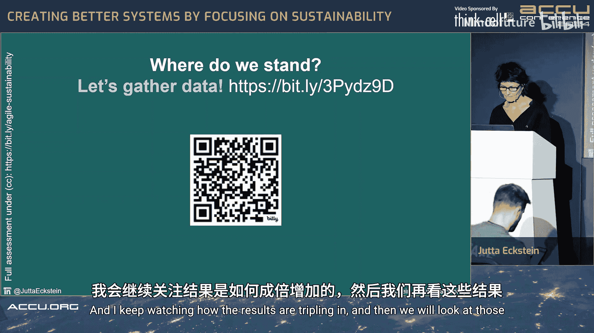
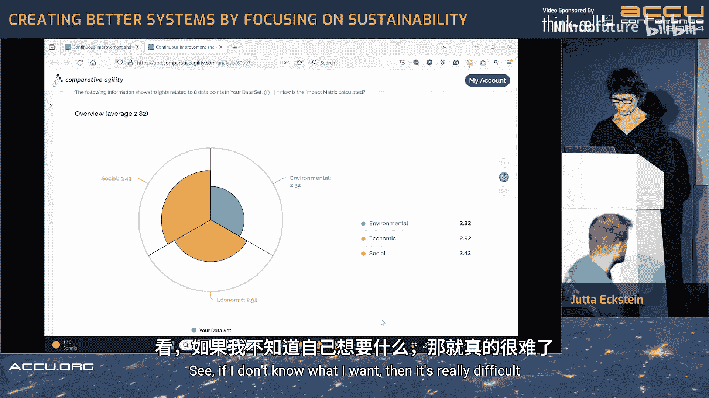
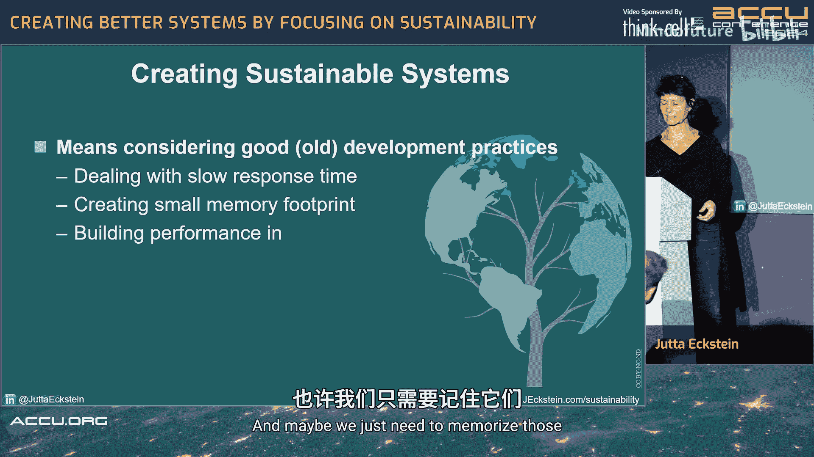
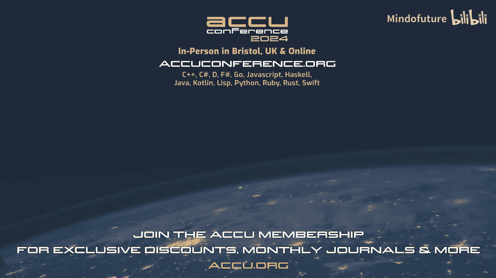

# 025：聚焦可持续性，构建更好的计算机系统 🍃

在本节课中，我们将一起探讨如何将可持续性理念融入软件开发过程。我们将了解可持续性的定义、它在软件开发中的具体体现，以及开发者可以采取哪些实际措施来构建更环保、更公平、更经济的软件系统。

## 欢迎与介绍 👋

欢迎参加本次关于可持续发展的会议。这应该是我在ACCU大会上第三次就此主题进行分享。

首先，我想了解一下，在座有多少人参加过我之前关于此主题的会议？看起来只有少数几位。这意味着对于大多数朋友来说，我需要从基础定义开始讲解。不过，可持续性发展是一个快速发展的领域，我本人也在不断学习，因此本次分享的内容与以往会有所不同。

我的名字是Jutta Eckstein。我的背景是软件开发，但更侧重于“敏捷”实践领域。我与人合著过一本关于“公司级敏捷”的书。我们在书中探讨了一个观点：当一家公司宣称自己全面拥抱敏捷时，它同时也承担起了一份责任。这份责任意味着，公司需要将其所处的经济、生态、社会等整个生态系统也视为“客户”来对待。

这种思考方式引导我开始关注我职业背景下的可持续性问题。如今，我将其总结为：**我们应该将地球视为我们开发任何产品时的一个利益相关者**。

## 建立联系：可持续性与软件开发 🔗

在深入之前，我想先听听大家的看法：**对你而言，可持续性和软件开发之间有什么联系？**

*   **能源消耗**：尤其是当前人工智能系统消耗的能源量惊人，这个问题日益重要。
*   **硬件与电子垃圾**：我们家中可能都有“电子垃圾箱”，里面是废弃的硬件。电池技术、稀有金属的开采和耗竭，以及电子垃圾的处理都是大问题。
*   **产品生命周期与电子垃圾**：在消费电子领域，我们需要思考设备的生命周期，能否通过软件更新支持旧设备，否则用户会将其丢弃，增加电子垃圾。
*   **软件对消费的影响**：软件在某种程度上影响了社会的消费狂热，引导人们做出购买决策。
*   **数字鸿沟与可访问性**：某些国家或群体可能因经济原因无法购买高端产品，导致非故意的排斥，这关乎系统的包容性和可访问性。

大家提到了很多关键点。需要强调的是，**软件开发也能助力可持续性，让世界变得更美好**。但它也伴随着威胁，主要包括：**能源排放、电子垃圾和数字鸿沟**。

## 核心定义：什么是可持续性？ 📖

为了确保我们在同一层面讨论，首先需要明确“可持续性”的定义。目前存在多种定义：

1.  **布伦特兰报告定义（联合国）**：核心思想是“**满足当代人需求的同时，不损害后代人满足其需求的能力**”。这是一个非常宏观且有益的指导原则。

2.  **联合国17个可持续发展目标**：这是一个更细化的框架，涵盖了消除贫困、优质教育、经济适用的清洁能源、水下生物保护等具体领域。许多公司被要求依据这些目标报告其可持续性进展。然而，对于软件开发从业者而言，有时很难直接将自己的工作与“零饥饿”等目标联系起来。

3.  **三支柱模型**：这个模型将上述17个目标归纳为三个支柱，是我个人更倾向于使用的定义，它更贴近我们的专业领域。
    *   **社会支柱**：关注公平、健康、福祉。在软件开发中，这可以转化为对**多样性、安全、安保、隐私和可访问性**的重视。
    *   **环境支柱**：关注保护地球。这通常意味着**减少碳足迹、绿色软件/IT、能源效率**。
    *   **经济支柱**：关注改善世界各地每个人的生活和前景。这涉及**可持续经济和负责任的产品**。

这个模型也被称为“三重底线”或“人、地球、繁荣”模型。它为我们提供了一个更易于在软件项目中理解和应用的框架。

## 现状洞察：不可持续的反面案例 ⚠️

了解了定义后，我们来看看现实中IT领域一些**未能**践行这些原则的例子。

*   **社会支柱反例**：机场的全身扫描仪软件要求用户在“男性”或“女性”之间做二元选择，这给跨性别者或非二元性别者带来了糟糕的体验。从软件角度看，这并非必需，但却造成了真实的社会排斥。
*   **环境支柱反例**：IT行业的碳足迹已在去年超过了航空业。我们常被问及是否还在乘坐飞机，却很少被问及是否还在使用电脑或手机。安德烈的研究预测，到2030年，在最坏情况下IT能耗可能占全球总能耗的21%。
*   **经济支柱反例**：社交媒体（如Facebook、Instagram）的算法和软件，有时非但没有改善人们的生活和前景，反而可能产生负面影响。这提醒我们，软件具有强大的影响力。

这些例子表明，我们本可以做得更好，这也是我们需要讨论这个主题的原因。

## 我们能做什么：从理念到实践 🛠️

上一节我们看到了问题，本节中我们来看看作为开发者，可以采取哪些具体行动。

### 1. 在需求讨论中引入可持续性评估

无论你称之为用户故事、需求还是需求，其核心通常包含：**谁需要、需要什么、为什么需要**。我们应该在此基础上，增加对**可持续性影响**的讨论。

就像我们会评估一个需求的成本一样，我们也可以评估它对碳足迹、可访问性或社会公平的影响。这能促成与客户或产品负责人的重要对话。

**示例**：`作为设计师，我希望减少页面使用的字体种类，以提升页面性能和对用户的可读性，其影响是减少因数据传输而产生的碳排放。`

**小知识**：字体选择对性能有影响。有研究对比了谷歌字体、系统字体和自托管字体的碳排放差异。虽然单个网站影响微小，但全球有超过10亿个网站，累积效应不容忽视。

### 2. 审视与优化基础设施

我们应反思对基础设施“总想要最大、最好”的习惯。无论是开发、测试还是生产环境，都应问自己：**我们真的需要这么多吗？**

*   **按需索取**：根据实际需要选择资源规模。
*   **共享基础设施**：考虑在不同项目甚至公司间共享资源的可能性。
*   **成本与环保双赢**：这样做不仅能减少能源消耗，也能节约成本，从而更容易获得公司的支持。

### 3. 运用人物角色与人物角色光谱

人物角色帮助我们定义目标用户，避免试图满足所有人却最终谁也满足不好的情况。

*   **思考对立面**：定期思考，如果与目标用户截然相反的人尝试使用我们的系统，会发生什么？这有助于发现潜在的排斥问题。
*   **引入“人物角色光谱”**：可访问性不仅关乎永久性残疾（如失明），也包括**临时性**（如耳部感染）和**情境性**（如在嘈杂酒吧）障碍。考虑到这些，能使系统对所有人都更友好、更包容。**让系统更易于访问，受益的是所有人。**

### 4. 支持旧硬件，减少电子垃圾

软件常常迫使用户升级硬件，从而产生大量电子垃圾。数据显示，平均每个英国公民一生会使用160部手机。

**我们可以这样做**：
*   **可持续性功能开关**：类似于权限开关，我们可以根据客户端硬件能力动态启用或禁用某些功能，以支持旧设备。
*   **响应式设计**：根据客户端能力调整软件行为。

### 5. 利用能源数据优化运行

我们可以利用现有数据让软件运行更环保。

*   **电力地图**：此类工具展示了不同地区、不同时间的能源结构（可再生能源 vs 化石能源比例）。
*   **智能调度**：了解何时何地有低碳电力后，可以将可异步运行的、耗能高的任务（如重型算法计算）安排在这些时段运行。这类似于过去在夜间用电低谷时使用洗衣机的做法，但如今的目标是**在可再生能源充足时运行**。
*   **云服务区域选择**：谷歌、AWS、Azure等云提供商已开始提供工具，帮助用户根据碳足迹、价格和延迟来选择部署区域。

### 6. 聚焦价值，消除冗余

*   **构建更少**：每一次构建都消耗能源。应聚焦于真正需要的功能，警惕功能蔓延。
*   **监控使用，勇于删除**：建立机制监控功能的使用情况，并勇敢地删除那些无人使用的功能。这需要不同的监控视角和测试思路。

### 7. 重视代码质量与可维护性

技术债不仅拖慢开发速度，其持续的构建、测试和维护也消耗能源。保持代码整洁、可维护，不仅是为了未来的开发者（可能就是我们自己），也是为了系统整体的可持续性。

## 实践评估：可持续软件开发调查 📊

为了帮助团队了解现状并开启讨论，我与同事共同开发了一份调查问卷。它包含一系列关于社会、环境、经济三个支柱的陈述，供团队评估自身实践。

**示例结果分析**（基于一次现场调查）：
*   **社会支柱得分最高（3.43）**，特别是在防止恶意访问用户数据、让用户选择共享哪些数据方面做得较好。
*   **可访问性方面得分较低（约2.0）**，说明这是需要改进的领域。讨论指出，如果开发团队本身更多元化，将有助于构建更具包容性的产品。
*   **环境支柱得分最低（2.32）**。在“监控产品硬件利用率”方面尚可，但在“为使用旧设备的用户提供支持”、“告知用户后台任务启动”等方面有很大提升空间。有从业者分享，在消费电子领域，由于硬件快速迭代，公司常会停止对旧设备的软件支持，这迫使用户升级，是一个需要平衡的难题。
*   **经济支柱得分（2.9）**。在“及时响应安全漏洞”方面较好，但在“了解功能是否被实际使用”方面较弱。这里也出现了矛盾点：监控功能使用情况可能与用户隐私产生冲突；支持旧硬件会增加代码维护负担，与保持软件轻量化的目标相悖。

**这份调查的目的不是提供答案，而是帮助团队提出更好的问题，并找到启动改进的杠杆点。**

## 总结与展望 🌟

本节课中，我们一起学习了可持续软件开发的核心理念与实践。

**核心在于，我们需要重新记起那些早已熟知但可能已被遗忘的原则**：在网络缓慢、内存有限的年代，我们曾精打细算地构建系统。如今，在资源看似无限的环境下，我们应停止一味追求极限，转而致力于让软件变得更小、更高效。

践行可持续软件开发不仅能保护环境、促进社会公平，也能带来**市场优势**（开拓新市场）、**人才优势**（吸引并留住重视可持续性的年轻人才）和**成本优势**。

最后，我推荐一些资源供大家深入探索：
*   **敏捷可持续性宣言**
*   **本次使用的调查问卷**（包含44个陈述，基于知识共享许可发布）
*   **相关书籍与链接**

希望本次分享能为大家开启可持续软件开发之旅提供一些启发和实用的起点。感谢大家的参与！