# 026：在嵌入式系统中使用C++异常减少固件代码大小 🚀

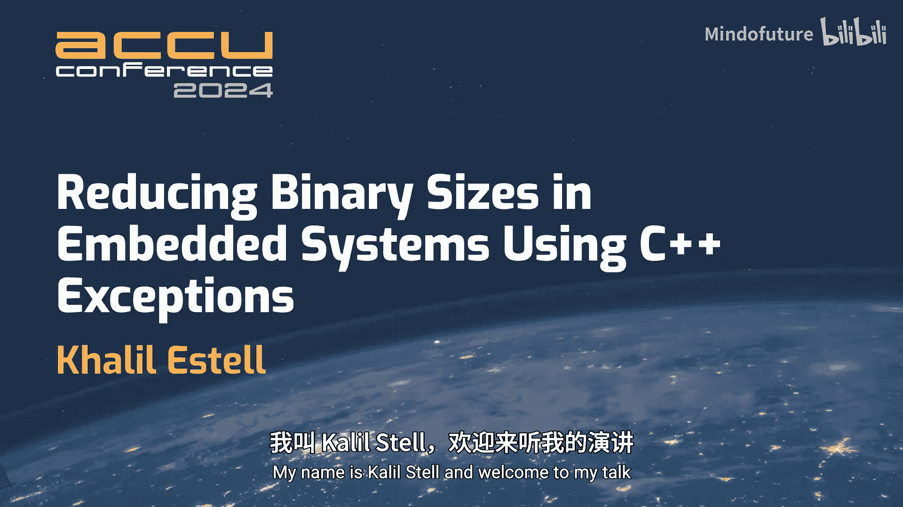

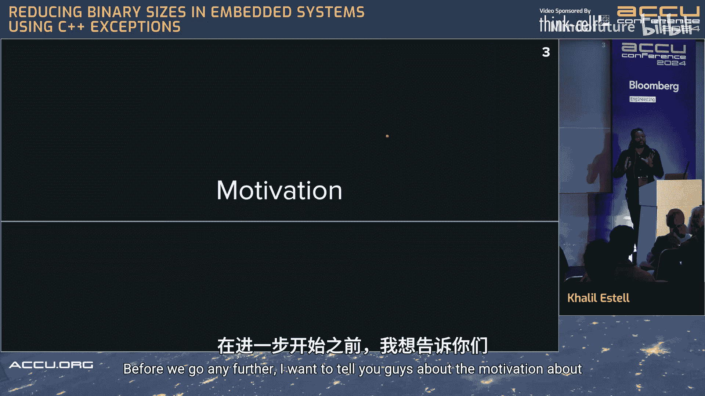

## 概述

在本教程中，我们将探讨如何在嵌入式系统中使用C++异常处理机制，并分析其如何影响最终的二进制文件大小。我们将从嵌入式系统的约束开始，逐步深入到异常处理的工作原理、内存开销分析，并与传统的错误返回码机制进行对比，最终理解为何在某些场景下，异常处理反而能生成更小的代码。

---

## 嵌入式系统的约束 🧩

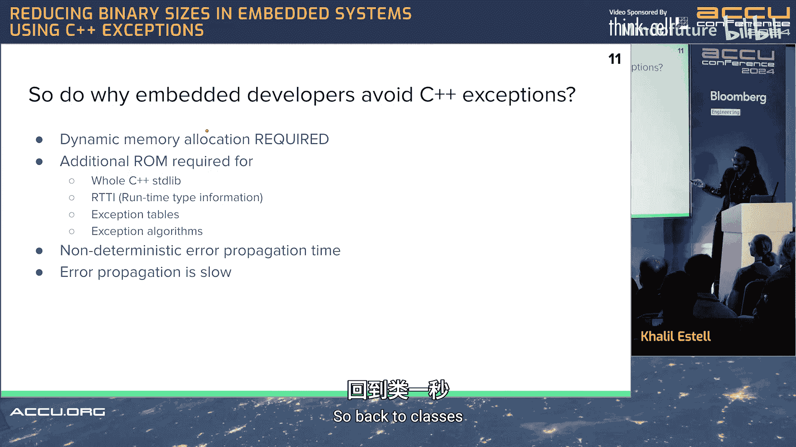

在深入探讨异常处理之前，我们首先需要理解嵌入式系统开发所面临的独特约束。这与在操作系统或笔记本电脑上开发软件截然不同。

嵌入式设备通常存储和内存有限。我们的设备通常只有少量的只读存储器（ROM）和随机存取存储器（RAM），例如8KB到32KB的Flash和8KB到5KB的SRAM。

以下是两个常见微控制器的例子：
*   **STM32F103**：拥有约64KB的Flash（用于存储代码、字符串和常量）和约20KB的SRAM。
*   **LPC4078**：拥有512KB的Flash和约96KB的SRAM。

嵌入式系统没有操作系统级别的构造。你无法打开文件（设备上甚至没有“文件”的概念），也没有时间或网络服务。这些功能需要通过可用的硬件自行创建或寻找支持特定目标架构的库来实现。

由于内存如此之少，如何防止内存耗尽或内存碎片化？答案是：**避免动态内存分配**。这意味着在整个代码库中省略 `new`、`delete`、`malloc`、`free`、`realloc` 等操作。

正因为这些操作不存在，我们也无法使用 `std::string`、`std::vector`、`std::unique_ptr`、`std::unordered_map`、`std::shared_ptr` 等标准库容器。如果你确实需要类似功能，可以使用嵌入式模板库（ETL），它提供了许多常用容器，但要求你静态地指定其大小。

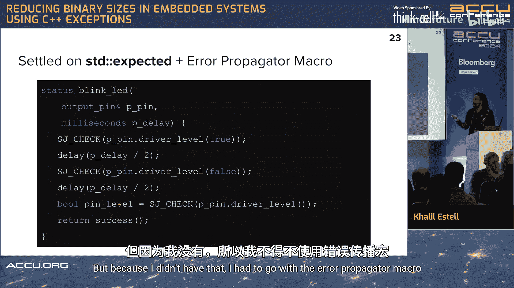

所有这些因素共同解释了为什么嵌入式开发者通常远离C++异常。以下是常见的反对理由：
1.  **需要动态内存分配**：这是硬性要求，无法避免。
2.  **需要额外的ROM**：会引入整个标准库。
3.  **需要运行时类型信息（RTTI）**：系统需要能够识别抛出类型与捕获类型。
4.  **异常表占用大量内存**。
5.  **异常处理算法占用大量内存**。
6.  **传播时间不确定且速度慢**：即使你不知道具体时间，也知道它会很糟糕。

---

## 从错误返回码到异常的思考历程 🔄

上一节我们介绍了嵌入式系统为何排斥异常。本节中，我们通过一个具体的教学案例，来看看在实际开发中，错误处理机制是如何演变的。

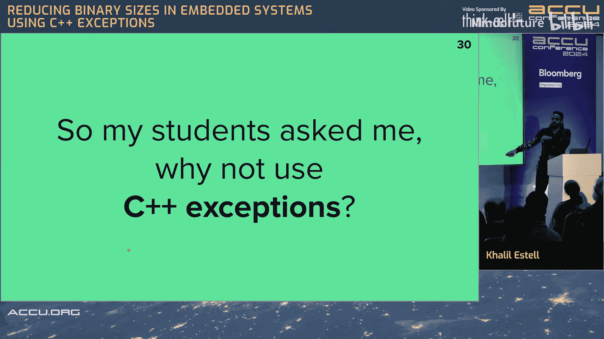

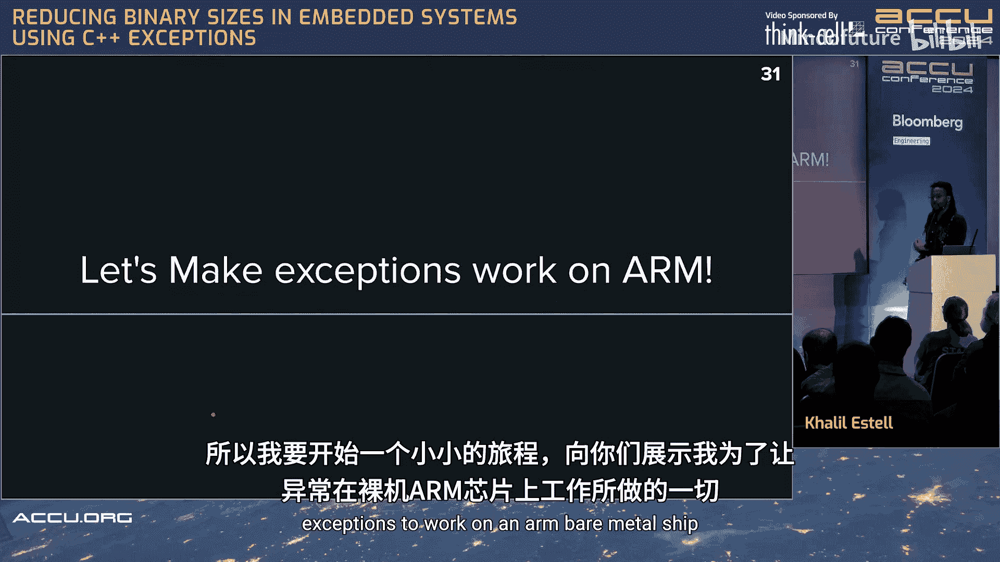

在为学生的嵌入式系统课程开发SDK时，我设计了一组接口供学生构建。其中一个接口是 `OutputPin`（输出引脚）。微控制器上有许多引脚，你可以将这些引脚的电压从低电平设置为高电平。`OutputPin` 接口有一个 `Set` 函数，用于设置状态。

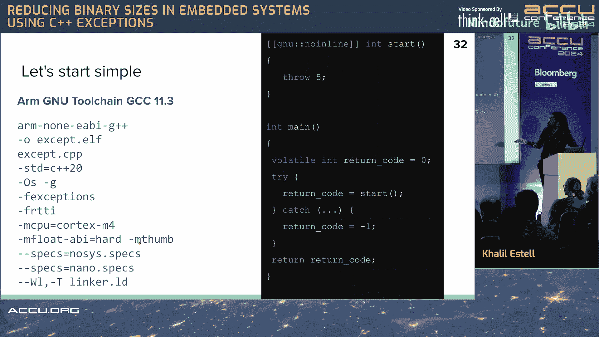

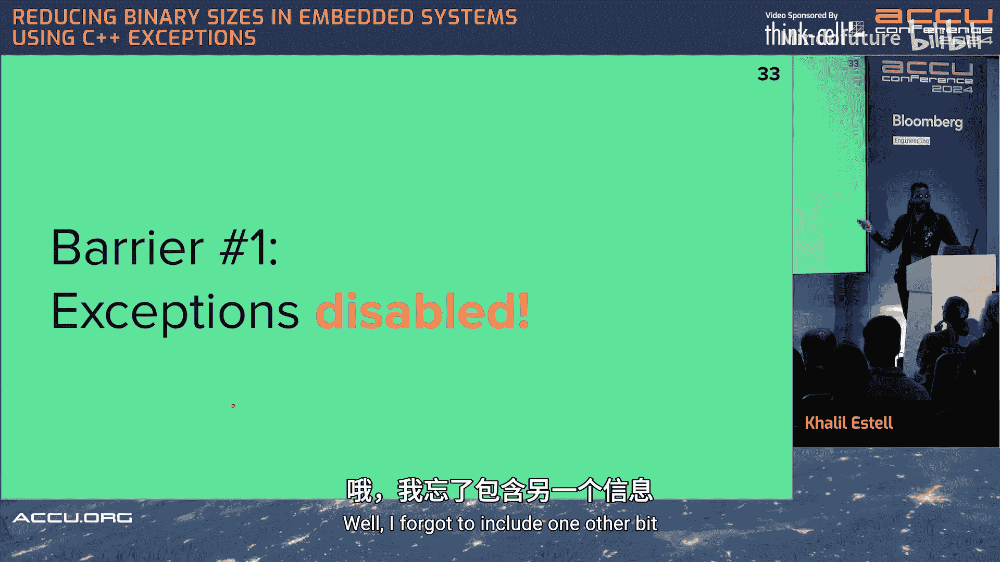

最初我考虑 `Set` 函数返回 `void`，但后来我开始思考其他使用场景。例如，在I²C通信协议中，控制器通过两根线（SCL时钟线和SDA数据线）与多个设备（通常是传感器）通信。通信过程中可能发生错误，例如地址无应答（设备不存在）或IO错误（硬件故障）。

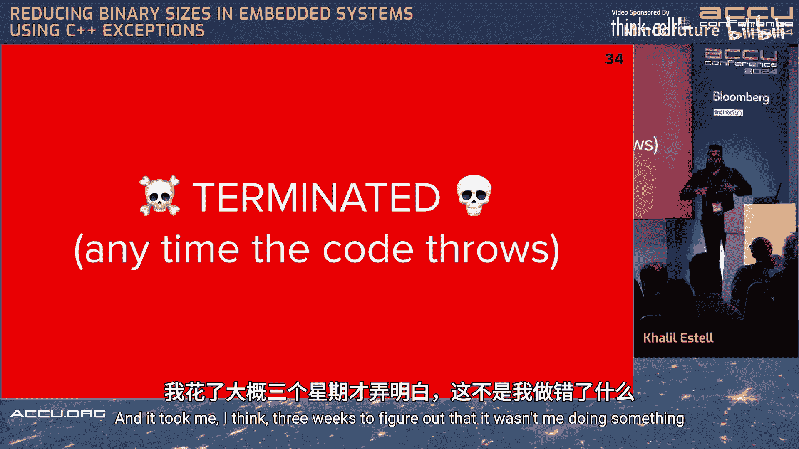

`OutputPin` 抽象不仅可用于微控制器引脚，还可用于任何能代表输出引脚的事物，例如通过I²C控制的输出引脚（用于LED、按钮等）。这时我意识到，除非使用异常，否则无法传递这些I²C错误，或者我必须改变返回类型。

考虑到学生代码的未知用途（可能用于不严重的LED，也可能用于紧急切断继电器），我需要提供错误信息。因此，我决定改变设计。

我使用了 `tl::expected`（后来改用 `std::expected`），创建了 `Result` 和 `Status` 类型。`Status` 基本上是将 `T` 设为 `void` 的 `Result`。当我需要返回值时，我添加了另一个名为 `GetLevel` 的API来读取。

从用户角度看代码，使用异常是最简单的例子。例如，让LED闪烁：打开LED，等待，关闭LED，再等待。

如果使用 `std::expected`，我们必须检查所有返回值：获取状态，检查是否有错误，如果有错误则返回 `std::unexpected`。

如果我们有错误传播操作符（P2561提案），整个讨论可能就不存在了，因为语法会简单得多。但由于没有，我使用了错误传播宏。GCC支持语句表达式，允许宏返回值（MSVC不支持）。

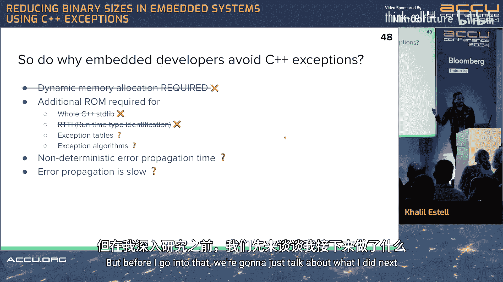

现在，我需要考虑哪些API需要返回错误。问题是，几乎所有的API都需要。只有少数基于中断的API永远不会返回错误，其他所有API基本上都是可能失败的。例如，通过I²C控制的通用电机接口、通过I²C控制的显示器等。我无法逃避，几乎所有东西底层都可能用I²C实现，从而传播那两种错误。

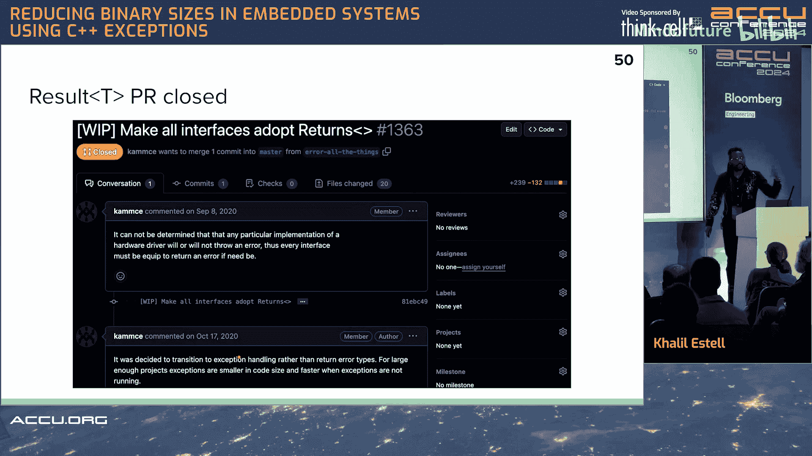

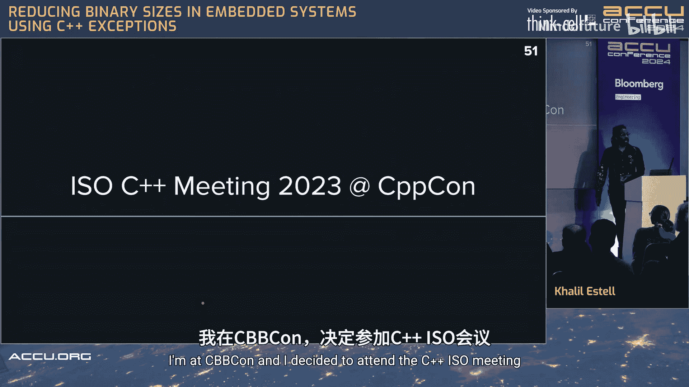

因此，我将所有东西都迁移到了 `std::expected`。在2.5年的教学实践中，我从学生那里得到了反馈：
*   起初使用 `if-else` 语句（没有给他们宏时），他们讨厌它，不使用它，而是用 `void` 强制转换来绕过错误检查。
*   一旦我给了他们宏，他们更愿意使用，但觉得它嘈杂且复杂。
*   学生们对基于API的错误处理感到恼火，因为它是“病毒式”的，几乎所有的返回类型都是 `Result` 或 `Status`。
*   当他们查看复杂代码时，必须在大脑中删除所有宏才能理解正常的代码路径。

每个学期都有学生问我：“为什么不直接使用C++异常？它们是语言内置的。” 我会给出那些常见的反对理由，并展示文章链接。因为他们信任我，通常会接受。但随着时间的推移，我开始注意到一些问题：
1.  我开始讨厌自己的代码，讨厌在复杂的代码中透过宏看逻辑。
2.  我意识到我其实并不真正了解异常的内部机制，我只是引用了别人的文章。

这促使我开始研究如何在裸机ARM芯片上实际让异常工作，至少为了有一个演示来展示为什么不应该使用它。

---

## 在裸机ARM系统上启用异常 🛠️

上一节我们看到了教学中的困境。本节中，我们来看看为了让C++异常在嵌入式系统上运行，需要克服哪些实际障碍。

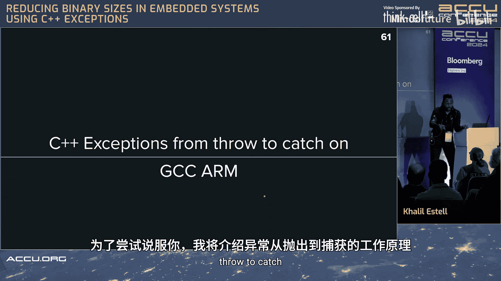

首先，对于几乎所有嵌入式系统设计和工具链，异常默认是禁用的。当你尝试抛出异常时，代码会直接终止。我花了大约三周时间才发现这不是我的错，而是编译器本身的问题。

唯一合理的做法是重新编译工具链。你需要搜索、下载、解压，遵循PDF指南（ARM的指南非常直接好用），安装先决条件，然后将构建脚本中的 `-fno-exceptions` 改为 `-fexceptions`，然后编译。

由于异常使用动态内存，你需要提供一个内存分配函数。有一个函数叫做 `__cxa_allocate_exception`，你需要实现它（或重写其弱符号定义）来提供内存。在我的实现中，我使用了静态存储，这样就不会干扰那些想使用动态内存分配的学生。

完成这些后，异常可以工作了，但遇到了另一个障碍：**巨大的二进制文件大小**。基线代码（无异常）是2KB，启用异常后变成了150KB，增长了56倍，占用了30%的Flash空间，仅仅为了抛出和捕获一个异常。

为了找出膨胀的来源，我反汇编了二进制文件。我发现了一些奇怪的东西：`std::string`、`io stream`、`locale` 等。回溯代码，最终都指向了 `terminate` 处理程序。

解决方案是：**省略终止处理程序**。`terminate` 是一个弱符号，你可以实现自己的版本来覆盖编译器提供的版本。这样做之后，代码大小减少了91%，降到13KB。这可以接受，只比之前多了11KB。

那么，为什么 `terminate` 如此庞大？当你在电脑上抛出未捕获的异常时，通常会得到核心转储和一条错误信息。`terminate` 会打印信息，这涉及到IO流。即使你只是包含了相关头文件而没使用，由于静态初始化的方式，也会自动招致约120KB的空间开销。消除这个，就消除了异常带来的大部分膨胀。

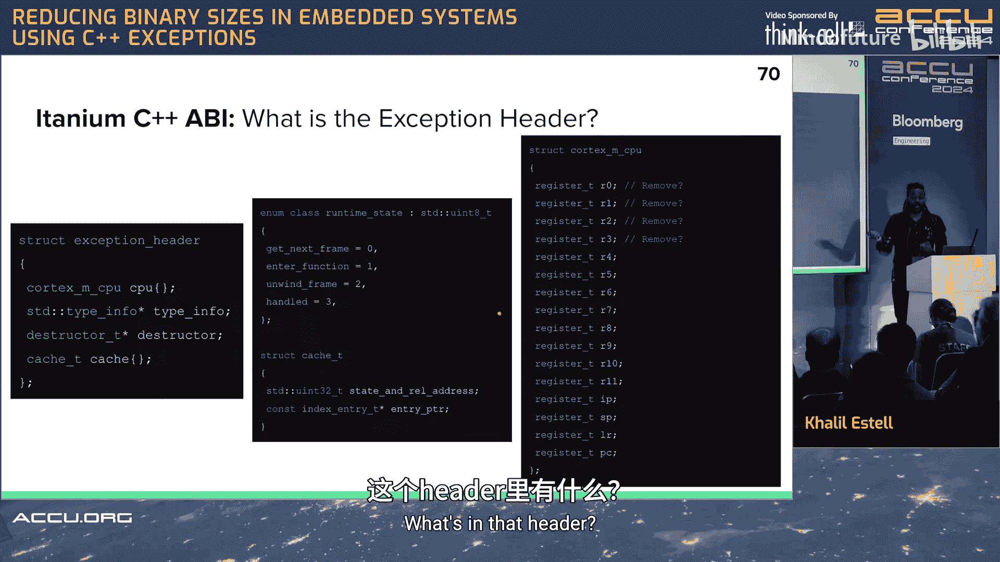

还有一个问题是RTTI。目前我的代码很小，类型很少。但随着程序增长，创建更多用户定义类型和抽象，RTTI会成为问题并开始增长。我想禁用它。

那么，禁用RTTI (`-fno-rtti`) 后，编译器会怎么做？
1.  告诉你不能在使用异常时禁用RTTI。
2.  剥离所有与异常处理无关的RTTI信息。
3.  静默移除RTTI信息，使用C++抛出任何东西都变成未定义行为。

正确答案是 **选项2**。GCC会为你清理，只保留代码中实际抛出的类型的RTTI信息，其他一切都可以被剥离。

至此，我意识到我可以控制异常的内存分配，可以静态分配代码中需要使用的异常对象数量。而标准库的 `terminate` 问题实际上与异常无关。RTTI方面，我愿意为少数抛出的类型支付代价。剩下的问题是异常表和处理算法。

在将代码库迁移到异常处理的过程中，我的学生们很喜欢它，他们喜欢不必担心宏和其他东西的体验。

同时，我也在并行地将代码迁移到结果类型，因为我不确定哪个会胜出。直到发生了一件事：我决定对于足够大的项目，过渡到异常处理而不是返回类型，因为异常在代码大小上更小，并且在异常未被抛出时更快。

我重构并测试了我的代码。像闪烁LED和控制舵机这样的小演示，代码大小如预期般增长了。但当我测试一个更复杂的项目（包含SD卡驱动、显示驱动等）时，我发现代码大小**比使用结果类型之前更小**。我从未期望异常能使代码更小，这促使我必须找出原因。

---

## 异常处理的工作原理（从抛出到捕获） ⚙️

上一节我们看到了异常可能带来代码大小优势的迹象。为了理解这一点，本节我们将深入探讨C++异常从抛出到捕获的完整工作原理。我们将专注于基于表的异常处理，并介绍几个关键概念。

首先，根据异常处理的需求，我们可以将函数分为三类：
1.  **叶子函数**：不调用任何其他函数，自身也不抛出。它们没有异常元数据。
2.  **平凡函数**：调用其他函数，但不需要任何清理（例如没有局部对象需要析构），也没有 `try-catch` 块。展开器知道遇到这类函数时，只需要无条件展开。
3.  **动态函数**：包含需要清理的内容（有析构函数），和/或有 `try-catch` 块。

对于ARM架构，我们需要了解其调用约定和寄存器：
*   `R0`-`R3`：用于传递参数和返回值。
*   `R4`-`R11`：被调用者保存寄存器。
*   `R13` (SP)：栈指针。
*   `R14` (LR)：链接寄存器（用于优化叶子函数返回）。
*   `R15` (PC)：程序计数器。

**抛出异常时**，代码会转换为对 `__cxa_allocate_exception` 的调用，分配内存并构造异常对象。然后调用 `__cxa_throw`，传入异常对象指针、类型信息指针和析构函数。

`__cxa_allocate_exception` 不仅分配异常对象本身，还在其后附加了一个**异常头**。这样设计是为了ABI兼容性和灵活性。异常头包含了展开过程所需的状态信息（如虚拟CPU寄存器、类型信息、析构函数、缓存等）。运行时可以通过从传递的指针向后偏移来访问异常头中的字段。

**异常索引和表**：每个非叶子函数在异常表中都有一个条目。这些条目相对于函数在代码段（.text）中的位置进行排序。每个条目包含一个32位偏移量，指向该函数的异常数据所在位置。

**展开指令**：这些指令模拟了函数的尾声（epilogue），但省略了返回值部分。它们只有三个目的：从栈中减去分配的空间、弹出寄存器、处理任何特殊的协处理器状态。展开指令是8位编码的，非常紧凑，因为大多数函数只需要很少的指令来展开。

**描述符**：这些结构指定了当程序计数器在某个范围内时应该执行的操作。例如：
*   **清理描述符**：当需要调用局部对象的析构函数时，跳转到“着陆垫”代码。
*   **捕获描述符**：包含捕获着陆垫和类型信息指针，用于匹配抛出的异常类型。

**语言特定数据区（LSDA）**：GCC使用LSDA来压缩异常数据。它使用可变长度编码（ULEB128）来表示整数，以节省空间。LSDA包含：
*   头部信息（格式、编码方式、偏移量）。
*   调用站点表：描述函数内可能抛出或需要清理的代码范围。
*   动作表：描述 `catch` 语句和清理区域的顺序。
*   类型表：列出函数中捕获的所有唯一类型。

当异常抛出时，运行时库（如 `libunwind`）会执行以下流程：
1.  根据当前程序计数器，在异常索引中进行二分查找，找到对应的函数条目。
2.  检查是否需要拒绝展开（如 `noexcept` 函数）。
3.  检查是否有LSDA。
4.  评估个性例程（personality routine），判断程序计数器是否在某个清理或捕获范围内。
5.  如果在清理范围，则调用析构函数并继续展开。
6.  如果在捕获范围，则检查类型是否匹配。如果匹配，则跳转到捕获块代码，并将异常状态标记为“已处理”。
7.  对于平凡可展开函数，直接解码并应用展开指令。
8.  重复此过程，直到异常被捕获，或者到达顶层调用 `terminate`。

捕获块在编译后通常会变成一个 `switch-case` 语句。着陆垫代码会比较过滤器编号（来自动作表）以决定跳转到哪个 `catch` 块。然后会调用 `__cxa_begin_catch` 和 `__cxa_end_catch` 来管理异常对象的生命周期。

---

## 异常处理的数据结构大小分析 📊

上一节我们详细了解了异常处理的工作流程。本节中，我们将量化分析异常处理机制中各个数据结构的内存开销，并将其与基于返回值的错误处理进行对比。

我们基于以下假设进行分析：
*   代码以最小大小为目标进行编译。
*   所有函数长度小于16KB（基于对Firefox等大型项目的分析，绝大多数函数满足此条件）。
*   没有函数拥有超过63个不同的“析构路径”或 `catch` 块组合。
*   使用ULEB128编码。

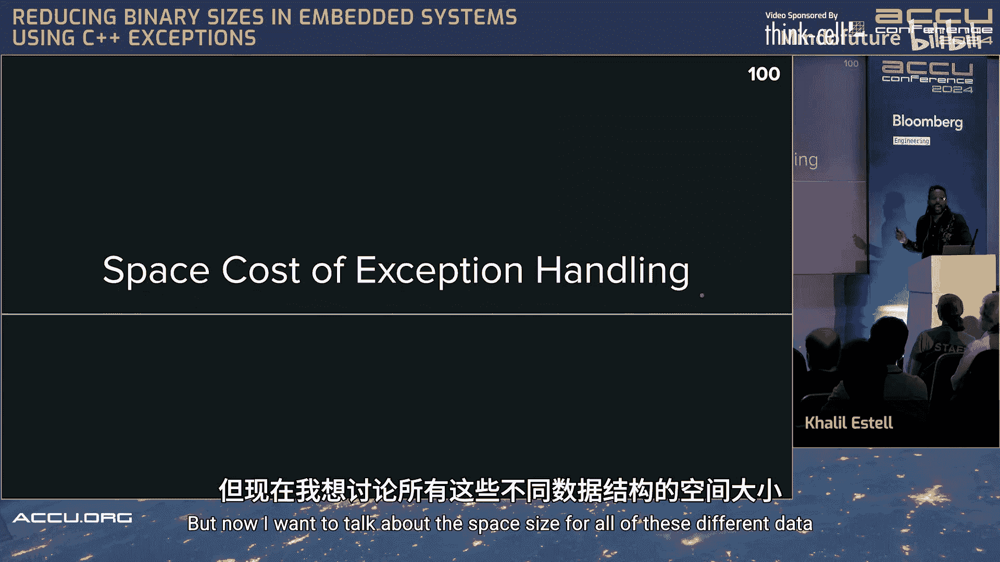

以下是关键数据结构的大小估算：

**异常索引条目**：8字节（由ABI定义）。
**短个性数据（SU16）**：4字节。
**长个性数据（LU16/32）**：最坏情况12字节。
**清理描述符**：8字节。
**捕获块代码**：约12字节（包含比较、分支、`begin_catch` 和 `end_catch` 调用）。
**动作表条目**：每个条目约2字节（使用ULEB128编码，范围受限）。
**类型表条目**：每个唯一类型4字节（指针大小）。
**调用站点表条目**：每个范围约4-7字节（使用ULEB128编码偏移和长度）。
**LSDA头部**：5到7字节。

**举例说明**：
*   **平凡可展开函数**：只需要异常索引条目（8字节）。
*   **带一个互斥锁（需要析构）的函数**：需要索引条目（8字节）、SU16个性数据（4字节）、清理描述符（8字节）、描述符结束标记（4字节），总计24字节。如果栈空间更大或增加更多对象，大小会增加。
*   **带一个 `try-catch` 的函数**：大小约45-47字节。每增加一个 `catch` 块，大约增加18字节（捕获块代码12字节 + 动作表2字节 + 类型表4字节）。增加新的 `try-catch` 范围会增加调用站点表大小。

现在，让我们与使用返回类型的错误处理进行对比。

考虑一个调用三个可能失败函数并求和的情景。使用 `std::expected` 时，每个函数调用后都需要检查返回值。汇编代码显示，每次检查的成本约为6字节（加载、比较、条件分支）。使用 `bool` 返回类型时，成本可能降至4字节。Rust的 `Result` 类型检查成本也约为4-6字节。

**核心观点**：基于返回值的错误处理，其检查代码的成本与**函数调用次数**线性相关。而异常处理的元数据（异常表、LSDA等）的成本与**函数数量**相关，并且很多函数是“平凡可展开”的，成本很低。

---

## 集中式 vs. 分布式错误处理 🏗️

上一节我们对比了两种机制的数据开销。本节中，我们引入两个概念来总结它们的本质区别，并解释为何异常处理在某些情况下更具优势。

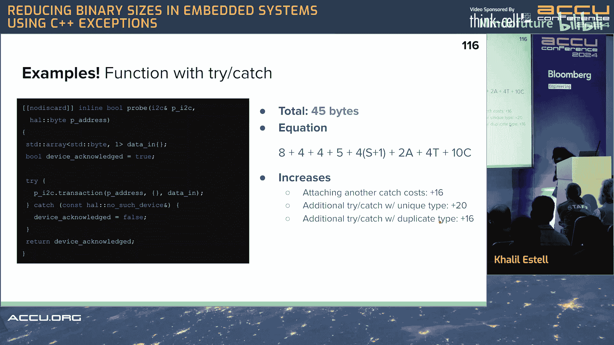

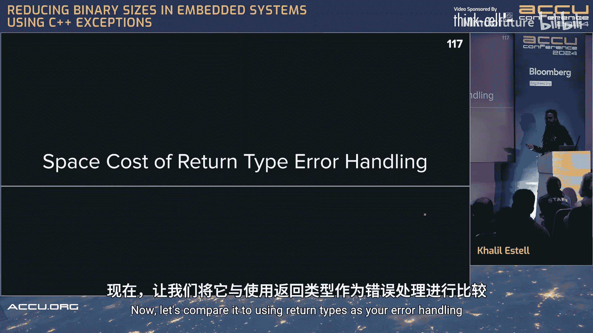

*   **分布式错误处理**：强制代码在整个代码库中进行错误处理。每个函数都负责接收错误并将其传递给上层。每当调用一个可能发出错误的函数时，它要么处理错误，要么传播它。使用返回值、输出参数等都属于此类。
*   **集中式错误处理**：拥有一个专门的机制（如邮政系统）来传递错误信息。你只为这个机制支付一次成本，它负责在整个代码中传播错误。C++异常处理就是一种集中式错误处理机制。

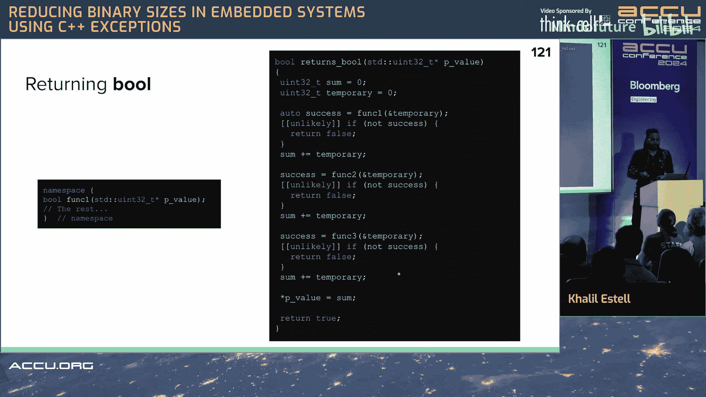

**我的主张是：集中式错误处理方案在代码大小方面比分布式处理更有优势。**

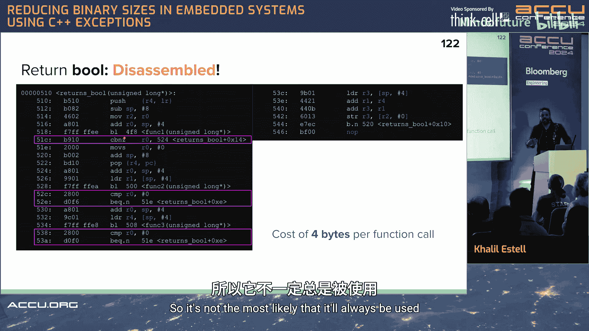

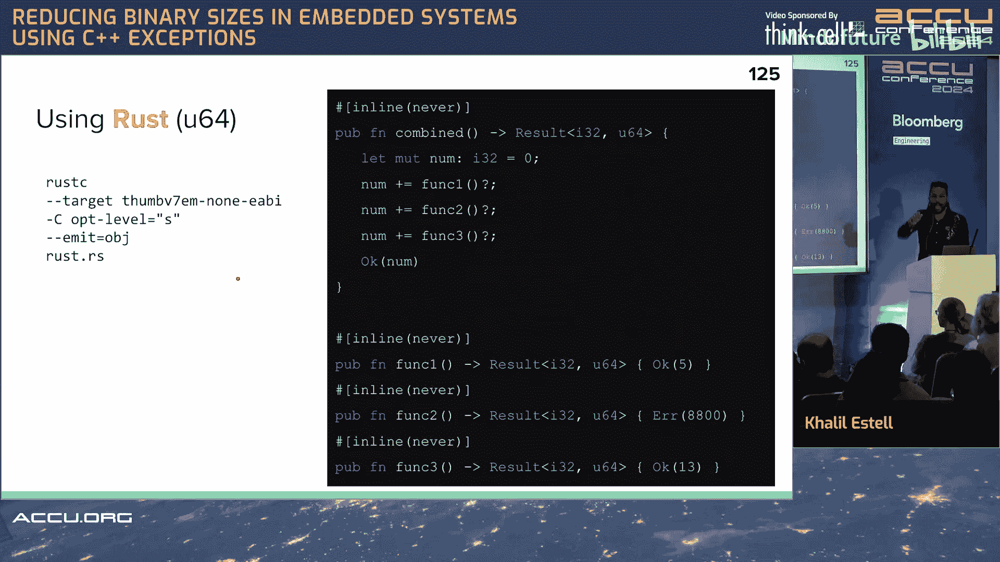

原因如下：
1.  **分支并非免费**：每次错误检查都需要比较和分支指令，这会产生代码大小开销。对于可能失败的函数调用序列，这种开销是累积的。而对于异常，平凡函数只需要固定的元数据开销（如8字节），无论它内部调用了多少其他函数。
2.  **大多数函数是平凡可展开的**：考虑一下你编写的函数类型。在嵌入式领域，或者即使是非嵌入式领域，有多少函数真正需要处理错误而不是仅仅传播它们？有多少函数拥有非平凡的析构函数（需要 `std::string` 等）？在许多代码库中，大部分函数只是传递错误。

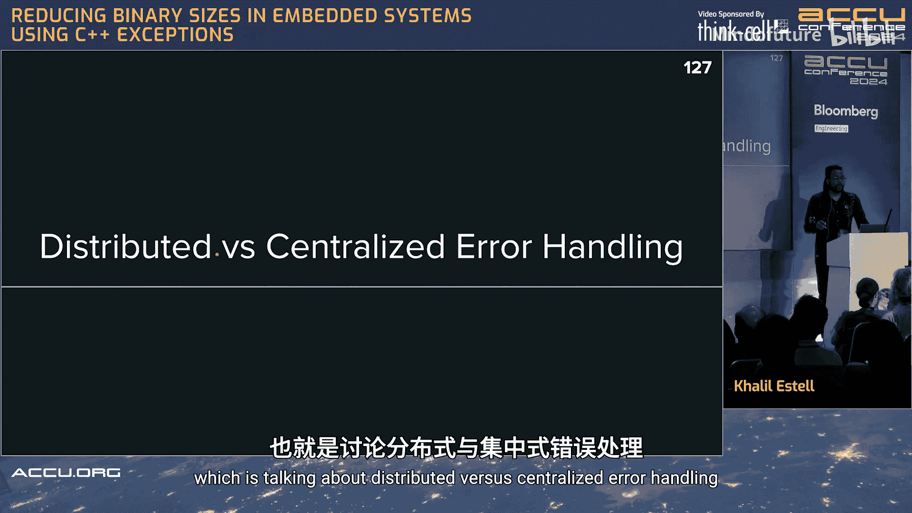

让我们做一个思想实验：假设一个代码库有1000个函数。
*   5% 的函数实际捕获错误（远高于Audacity的实测比例）。
*   25% 的函数分配对象且非平凡。
*   超过一半的函数是平凡可展开的。
*   10% 是叶子函数。
*   C代码函数总是叶子或平凡的。

估算异常处理的总开销：`try-catch` 函数开销 + 清理函数开销 + 平凡函数开销 ≈ 15KB。这包括了 `libunwind` 的实现（约8KB）。如果使用我优化的实现（约2.5KB），开销更低。

对于分布式错误处理（基于返回值），每个函数允许的检查次数有限制。在上述假设下，每个函数平均只能进行约4到6次检查调用，超过这个次数，异常处理在代码大小上就会更优。

**结论：为什么C++异常能产生更小的二进制文件？**
1.  **减少调用可能失败函数时的代码生成**：无需在每个调用点插入检查代码。
2.  **展开信息随函数数量缩放，而非函数调用次数**。
3.  **消除了额外的返回路径代码**：错误返回路径的代码被集中化的展开机制替代。
4.  **展开指令是正常代码的压缩表示**：它们只做三件事（减栈、弹寄存器），非常紧凑。
5.  **传播代码只需支付一次**：`libunwind` 等运行时库不随应用程序规模扩大而线性增长。

---

## 优化潜力与未来展望 🚀

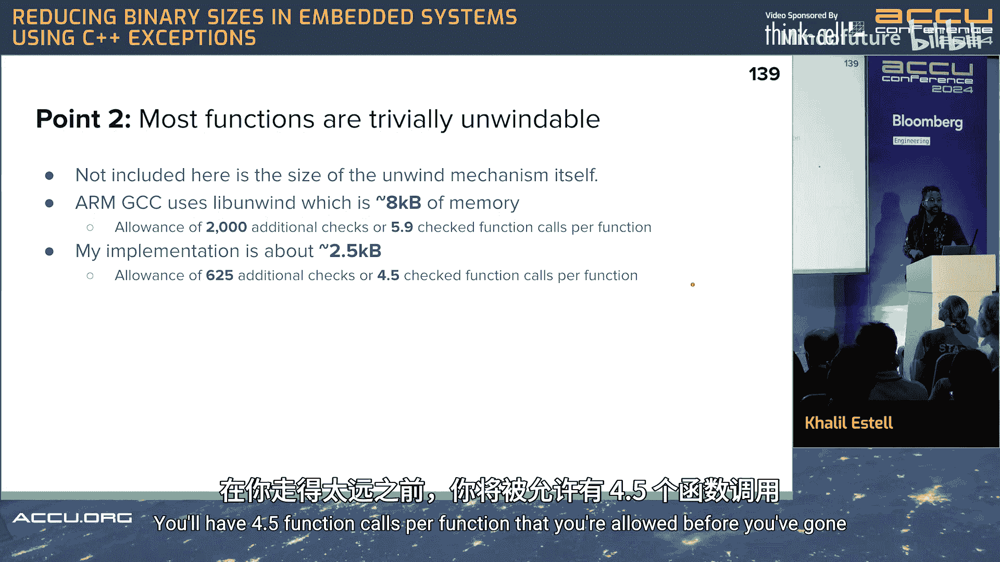

上一节我们得出了异常处理可能更优的结论。本节我们来看看当前的异常实现还有哪些巨大的优化空间，以及未来的可能性。

异常处理机制**还有很大的优化潜力**，我们尚未对其进行充分的优化。例如：
*   **`__cxa_begin/end_catch`**：为什么每个 `catch` 块都需要单独的函数调用？可以合并并在末尾分支。
*   **`libunwind`**：可以针对纯C++环境进行精简，移除对Java等其他语言的支持。
*   **个性数据格式**：可以设计更紧凑的编码格式，移除向后兼容的冗余信息。
*   **动作表**：或许可以重新设计，用更少的字节描述动作序列。

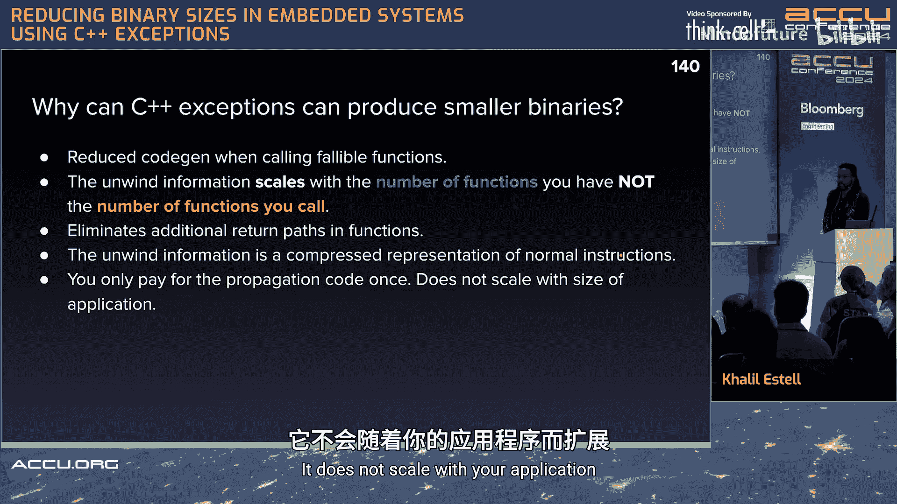

**性能方面**：虽然本教程聚焦代码大小，但异常在“悲伤路径”（异常抛出时）的性能也很重要。初步测试显示，自定义的展开实现可以将展开时间显著降低（例如从15000个周期降到3660个周期），目标是降到接近简单返回传播的水平（约1000个周期）。

**扩展性**：由于完全控制了异常实现，我们可以添加新功能：
*   **异常堆栈跟踪**：在异常头中记录展开过程中经过的函数，提供堆栈跟踪。
*   **更好的异常控制**：实现单阶段展开以提升速度。
*   **异常工具化**：静态分析或运行时工具，用于报告哪些异常类型可能导致程序终止。

---

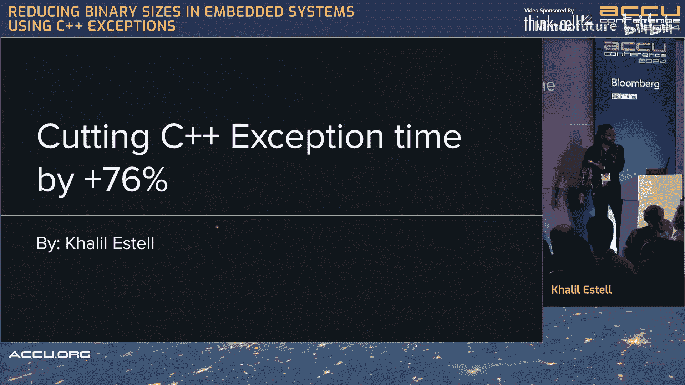

## 总结 📝

在本教程中，我们一起学习了：
1.  **嵌入式系统的约束**：资源有限，传统上避免使用异常。
2.  **错误处理机制的演进**：从返回值到异常的实践与思考。
3.  **启用异常的技术挑战**：重新编译工具链、处理 `terminate`、管理内存分配和RTTI。
4.  **C++异常的工作原理**：从抛出、分配、展开到捕获的完整流程，涉及异常头、索引表、展开指令、LSDA等关键概念。
5.  **内存开销分析**：量化了异常处理数据结构的大小，并与返回值检查的成本进行对比。
6.  **集中式 vs. 分布式错误处理**：从代码大小角度分析了异常处理的优势，指出其成本与函数数量相关，而非调用次数。
7.  **优化前景**：认识到当前异常实现并非最优，存在巨大的代码大小和性能优化空间。

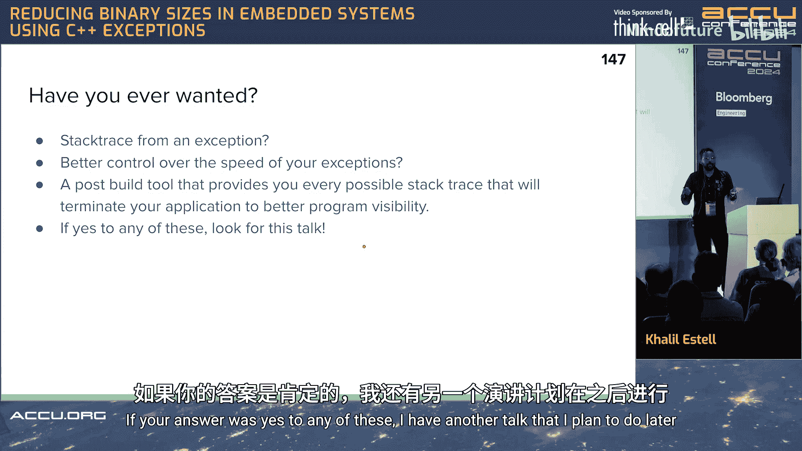

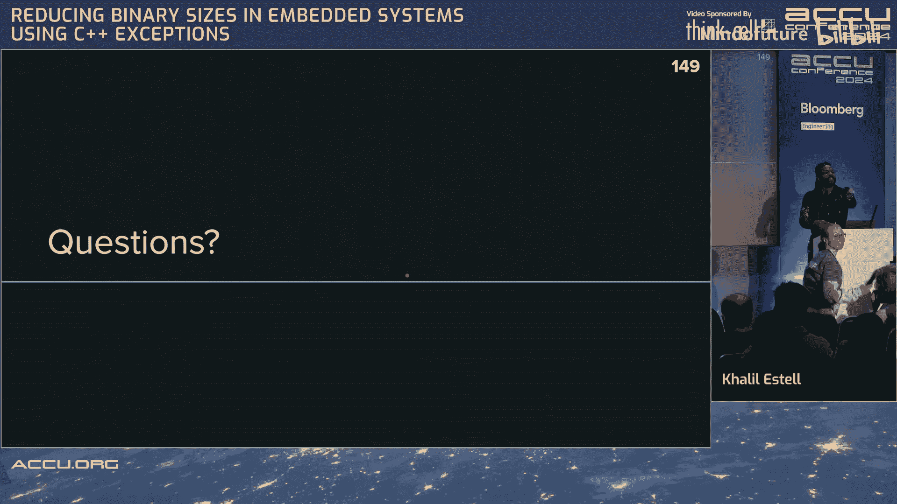

最终结论是：对于具有一定复杂度的嵌入式项目，尤其是在错误传播路径较长、大多数函数无需资源清理的场景下，使用C++异常处理机制**有可能**生成比传统基于返回值的错误处理更小的二进制文件，同时提供更清晰的错误处理逻辑。这打破了“异常必然导致代码膨胀”的固有观念，为嵌入式C++开发提供了新的思路。当然，是否采用需要根据具体项目约束（如实时性要求、工具链支持、团队习惯等）进行权衡。