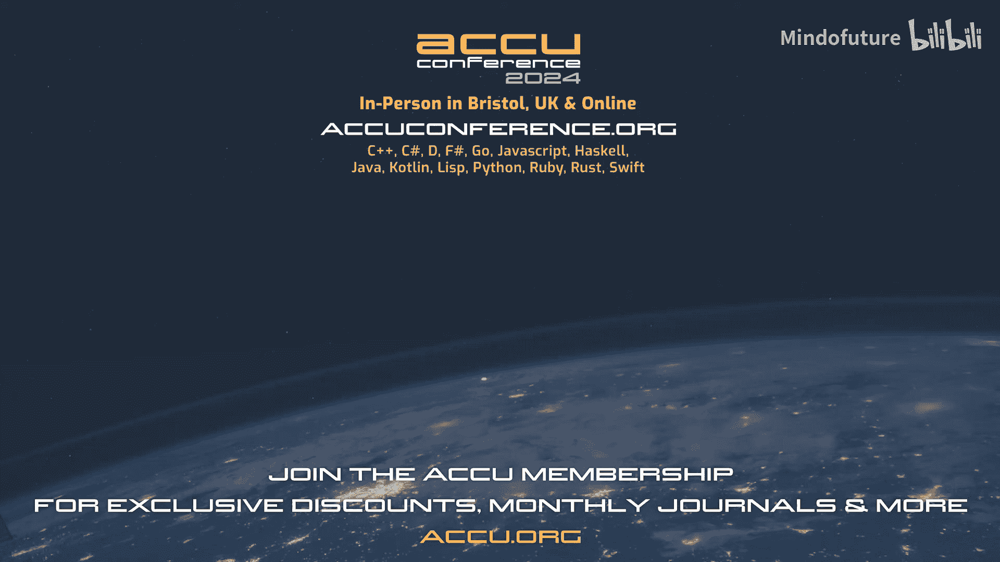

# 027：脚本化与自动化——本可以成为脚本的手动任务

在本教程中，我们将探讨一个核心问题：何时值得投入时间去自动化一项任务，何时我们只是在偏离正轨。我们将通过一个生动的个人故事引入，并系统性地分析自动化的收益与成本，最终提供一些实用的决策框架和策略。

我叫 Fred Tangro。目前我在一家从事静态代码分析的公司工作。我最初的专业是生物信息学。

我曾在一个15人的班级里。其中14人对生物学充满热情。

他们听说编程可能是一个有趣的工具。而我则对编程充满热情。

我很享受编程。我认为生物学可能是一个有趣的应用领域。有些时候，我和同事之间的这种差异很明显。

例如，我记得有一次，老师给了我们一份电子表格，并指导我们进行一些实验。

在某个时刻，老师说，好的，你们有1100条数据。在这份电子表格里，数一数有多少条数据的“无人机年龄”值高于80。

我周围的14个人指着屏幕。开始一行一行地手动计数。我当时想，不应该这样做。你应该写一个公式。

然后自动得到结果。当时，我觉得我知道正确的方法，而他们是错的。

但回想起来，我不认为他们完全错了。因为我总是会写公式来计数。

但如果不知道如何写公式，而老师正等着你回答问题，并且你只有100条数据，这并不算多，那么手动计数确实有道理。

所以这可能是我第一次遇到是否自动化，这取决于你的知识和具体情境。如今，我在一家做静态分析的公司工作。

我们在CI和IDE中尝试检测不良模式并发出警告。我们尝试制定C++中不应做的规则，并尝试用模式匹配来检测它们。

C++非常复杂。我们有一个元规则。我们尝试用大量C++代码来测试它。

这些代码可能以不同方式犯同样的错误。C++非常复杂，我们有海量的C++测试代码。

我们最终得到这样的测试：你有一大堆C++代码，以及我们期望在其中找到的内容。这很难阅读。

所以我想要在我的IDE中创建一种插件，它能显示更改将在哪里发生。我称之为“装饰器”。

我和一个同事一起开发了它。它运行得很好，好到我们开始添加更多功能。

因为我们有很多功能，我们开始需要测试。为了测试装饰器，我们添加了测试。

因为我们有了测试，我们在上面建立了CI。因为我们有了CI和测试，我写了一个GitHub Action。

我有很多改进这个Action的想法。但我停下来了，因为我们在开发的GitHub Action自动化了CI，CI又自动运行测试，测试自动测试那个我将放入IDE以装饰测试的插件，而这个插件又是为了让你能把它放到你自己代码的CI测试中。

这是层层嵌套的自动化。无论你看向哪里，你下面都有自动化，而你上面又有新的自动化想法。

有些自动化创造了真正的价值。通过自动化，你改善了每个人的生活。

但有时，我只是在偏离正轨。有时自动化某件事很有趣，但它没有带来任何价值。

这里的“价值”取决于你对价值的定义。这就是我今天的问题：何时值得花时间去自动化某事，何时我们只是在偏离正轨，做了不该做的事。

技术演示的好处是，总有一张HTC图表来回答问题或支持你的观点。

请看HTC 1，2，0，5。你看不清。我快速描述一下。一个轴是：你执行同一任务的频率。另一个轴是：通过自动化，你能从这项任务中节省多少时间。

每个单元格里是，在接下来的五年里（我认为这是一个合理的考虑范围），你在自动化上可以花费多少时间，才不会超过你将要节省的时间。

这张图实际上只是在说：当且仅当我们节省的时间多于我们编写自动化所花费的时间时，自动化才是值得的。

这是一个简洁、简单的表述方式。这也是一个我完全不同意的公式。

如果我不同意一张HTC图表，那没关系，但我们行业中的许多人似乎都这么想。比如，如果你节省的时间没有超过自动化所花的时间，那就不值得。

我认为真正的公式是：当你的收益高于成本时，就值得去做。

感谢来到我的演讲。好的，问题是，通过回答这个具体问题，我们并没有真正解答什么。

我想听听你们是否有关于收益和成本的想法，而不仅仅是花费的时间和节省的时间，这些当然是重要的收益和成本。你们有其他想法吗？不要忘记一些事情。是的，请说。复杂性。

你的意思是自动化比手动操作更容易，还是相反？因为太复杂而变得棘手。复杂。所以你会提高这个门槛，也许。不，如果你有很多不同的事情……好的，所以如果……是的，好的。所以如果太复杂而无法自动化，而你开始自动化一切，那就……请说。嗯。

精神压力，是的。是的，所以必须计算手动错误。我喜欢这个，因为我的整个演讲将要围绕它展开，是的。自动化是可扩展的。好的，是的，所以你可以将相同的自动化复用于其他事情，如果……是的，这是一次性的场景吗？

抱歉镜头问题。可能不理想。下次需要我给你麦克风吗？好的。

我重复了它们。无论如何，现在我要展示我的观点，我认为你们提到的所有点都在幻灯片上。我很高兴。

我从收益开始，因为我是一个乐观的人。是的，我认为房间里的大象之一是：通过自动化，你避免了手动错误。

我故事开头的同学们在屏幕上数了100行。我确信他们中有人漏数了一行或重复数了同一行。如果你自动化，这不会发生。

我在CI/CD领域工作。我知道复制粘贴就足够了，但如果你写足够多的代码，拼写错误就会发生。

顺便说一句，如果你不同意某张幻灯片，或者想补充什么，请随时举手。我打算让这次演讲具有互动性。我知道有些观点可能有点……有争议。所以，没有手动错误。

另外，你可以免费重新运行。我们之前提到过，无论它是运行一次还是测试需要多次进行。

即使测试是带引号的“一次性”。过去我遇到过很多次这样的情况，我以为我在做一次性的更改，把A改成B。

我做了。然后第二天，我意识到实际上我不应该把所有A都改成B，因为有些A应该改成C。

如果我手动操作，这意味着我需要回滚一切，并手动重新执行任务，因为我对要做什么略有误解。有了自动化，我只需回滚。我们运行脚本，稍微修改，将部分A的用法改为C。

对于这次“一次性”更改的再次尝试，这几乎是免费的。所以我认为即使是“一次性”任务，我们仍然获得了能够重新运行一次的好处。

也可能发生这种情况：你将每个场景都更改到主分支。而某个用户正在他们那边工作，还没有这些更改，并且他们到处都在使用旧方式。我们也可以给他们脚本，他们也能在他们那边进行更改。手动操作的话，他们需要做和你一样的工作。

关于分支，这引出了我的下一个观点：追赶移动的目标。

我有一个大型代码库。我想把所有A的用法改为B的用法。所以我创建了一个分支。我工作了一整周。将A的用法改为B的用法。

周末时，我尝试将分支变基到项目的主分支上，而在我工作期间，每个人都引入了新的A用法，因为世界在继续运转。

现在我有了需要解决的冲突。如果我运气好，最终会收敛。在某个时刻，我解决的A到B的更改会多于人们新引入的A用法。

所以如果我去度假，希望最终能收敛。如果团队非常大，并且引入了大量更改，我们可能会陷入实际发散的情况，他们引入的问题比我一次性能解决的还多。

有了自动化，这完全不存在。你花任意长的时间编写自动化。一旦完成，你按下一个按钮。它几乎是瞬间完成的，你为整个世界进行了更改。所以你没有那种试图用小勺子舀空一艘正在下沉的船的感觉。

理解用户流程。如果我的任务很复杂，需要多天执行多个步骤。

通过自动化，我被迫获得对整个流程的高级视野。我被迫看到全局，也迫使自己明确列出每一个例外情况。

这个过程除了给你自动化本身，还给了你一些知识，这是极其宝贵的。这些极其宝贵的知识，你还可以与同事分享。

开头的HTC图表只基于你一个人执行任务的假设，这可能不是事实。如果你的团队有新成员，他们需要学习如何执行任务。手动操作，对他们来说可能非常漫长和复杂。

有了自动化，你给他们可以立即运行的脚本。它完美运行。如果他们需要理解背后的原理，这个自动化很可能是一些他们可以查看并理解的代码。

代码本身就是很好的文档，你不应该只写文档而不写代码。这是一个了解事物的有趣起点。

这个之前提到过，关于可修改性。你考虑编写非常干净的代码，这很好。我的做法略有不同。我有一个大项目，我们在里面放了很多文件和文本文件。

我们试图保持整洁，但后来我在上面添加了一些东西。在某个时刻，我们想要更改格式。所以我写了一个非常粗糙的Python脚本来自动完成。

也许我写这个脚本花的时间比手动操作还多。但我想这么做。我的Python很糟糕。所以这是一个学习的机会，等等。它成功了。

两周后，我需要再次更改格式。我找到这个本应是一次性的Python脚本，修改了五行。重新运行，它完成了我需要做的新格式更改。

所以，通过拥有一个我为一次性任务编写的自动化，我实际上拥有了一个可以复用的东西，而不是一个库。这大大减少了我在这项任务上必须花费的时间。

我也许对Python变得稍微不那么生疏了，但不多。

我认为这个是最重要的收益，在我看来，如果你有一项不是超级重要、不是超级紧急的任务。

它可能是学习新技术的最佳沙盒。你尝试做一个只使用一次的微小脚本。脚本非常小。

所以它是学习新技术的好机会。风险非常有限。如果没成功，你仍然可以手动执行任务。你仍然可以回退到你知道的方法来再次自动化它。

我认为承诺有限。我的意思是，即使你没有遵循最佳实践，因为你在学习这项新技术，没关系。最坏的情况，你扔掉代码，下次用另一种方式重写。最好的情况，它成功了，你做得很好。所以这真的是一个非常好的学习沙盒，用于这种小型的一次性更改链。

学习新技术的另一种方式是玩具项目，但我认为自动化是更好的沙盒。首先，很难随时进行。告诉你的老板，是的，我今天下午没做任何有用的事，但我在学习新技术，这可能不太受欢迎。

通常当我做一个玩具项目但没成功时，比如这项技术没有真正实现我想要的，我总是留下疑问：是因为技术不好，还是因为我想做的事情不是真实场景，反正没人会这么做？我不知道。

而对于玩具项目，你最终，如我所说，只是一堆没有产出的代码。而对于自动化，你最终得到了一些有用的东西，同时解决了实际问题。

所以我真的很喜欢将自动化作为学习新技术的一种方式。

另一个我喜欢的是改变行为，这在某种程度上是光谱的另一端。它不是完全无用的东西。

但是，当古腾堡发明印刷机时，他并没有从一个僧侣的工作时间中节省出一年。它彻底改变了社会。是的，可能我的自动化不会改变社会，但我见过，例如，一些团队。

我见过一个团队。他们有非常非常复杂的发布流程。每个季度发布产品需要两天时间。这非常痛苦。所以每次他们都会换人来做，因为大家都讨厌做。

在某个时刻，David受够了这个问题，说，好吧，我们要自动化。整个团队致力于自动化。

可能花了相当长的时间，直到他们最终得到一行命令。这并没有为他们每个季度节省两天的工作，因为有了这一行命令，他们把它放入了CI，并开始了持续交付。

现在他们几乎能立即获得用户对他们所做的任何场景的反馈。所以通过自动化一项不常做的事情，他们彻底改变了整个团队的行为方式和工作方式，变得更好。

这在你自动化时不会每天都发生，但我认为这是我们偶尔会中一次的彩票大奖。这真的值得在自动化上投入。

所有这些对你的团队和公司都非常有趣。但有时你也必须自私一点，手动执行大量重复性工作可能极其无聊。如果你总是反复按相同的键，你甚至可能患上重复性劳损。

就我个人而言，即使自动化比手动操作多花一点时间，并且最终可能导致受伤，我也会选择自动化。这是一个有趣的问题需要解决，你有一项即将学习的新技术。

有时你在日常工作中做着相当困难的事情，你需要改变节奏，切换到像这样的事情上。这很有趣。你做两个小时，然后回到你的任务上，你会感觉精神焕发一些。所以，它在这方面也很有用。

我是一名C++开发者。当我开发一个小功能时，需要三天。有了自动化，我可以在早上产生想法。到午餐时间，我就完成了自动化。我可以与同事分享，他们很高兴，因为我为他们解决了问题。所以他们很感激。

我的同事很高兴，我很高兴，因为我用很短的时间完成了一些事情。大家都高兴，我们都喜欢自动化。你们看到我遗漏的其他好处了吗？现在说坏的部分，成本。

显然，有了自动化，你不再做任何手动操作了。恭喜。现在你可以犯错误了。而且你可以大规模地犯错误。有两种方式。你可以创建100万个文件，每个文件有100万个错误，这很糟糕。或者你可以创建100万个文件，其中一个文件有一个错误。这更糟糕。

这是自动化的真正陷阱。在100万个文件中有一个错误，因为你的审阅者必须抽样审查这100万个文件。而如果你不……我不会选择那个有错误的文件。顺便说一句，我列出所有自动化成本，但不提供任何解决方案。

那个由你负责。更高的不确定性。一项经常重复的手动任务，在花费时间上是非常可预测的。而编写自动化，特别是如果你不了解技术，则不然。

我们都知道，我们应该将我们认为会发生的时间乘以二，这样我们仍然会错一半。是的。这次演示不是一张HTC图表，而是两张。

所以HTC 1，3，1，9展示了自动化过程，如你预期会发生和实际发生的情况。你期望更改你的任务，你花一点精力自动化它，然后你拥有所有这些空闲时间，因为你不再需要手动操作。而在现实中，你开始写一些代码，当你开始运行时，你发现有一个错误，所以你调试它。

然后你发现这个错误是因为你没有考虑周全，所以你重新思考并实现这个新解决方案，调试新解决方案，等等，最终你根本没有时间实际执行手动任务。当然，这是一个图表。当然，我们不这样做。

谁了解沉没成本谬误？这是我们大脑的一个广泛问题，它让你觉得，如果你不承认某事失败，它就没有真正失败。如果你不承认失败，就没有失败。所以对公司来说，就像，是的，我们在这个项目上投资了数十亿，还没完成。我们现在不会放弃，那将意味着数十亿损失了。我们要投入更多资金。这次，可能就会成功。对你来说，这意味着说，哦，我已经投入了一周时间来节省我两个小时的时间。如果我现在停止，一切都白费了。如果我继续，也许它会成功。不，它不会。

所以在某个时刻，你必须放手，说，好吧。我在这项自动化上花了太多时间。它超级令人兴奋。我没有得到结果，但我现在要停止了。另外，为什么我们保留HTC图表。

自动化非常擅长一遍又一遍地做完全相同的事情。这意味着你在引入刚性到你正在自动化的事情中。

你在任务本身中引入刚性。你也在整个阶段增加了一些刚性。例如，如果你想从Linux迁移到macOS，也许你必须重写所有自动执行操作的脚本。

我们手动做的事情完美地工作。你还在那些偶尔发生一次的例外情况中增加了刚性。

如果你花很多时间自动化你的A流程。你可能会想，好吧，每两周，我们对我们花费的冲刺等进行回顾。可能很好，但也许在十二月，当你的团队四分之三的人休假时，你想做一个为期三周的冲刺。现在你的自动化使得在每个人都不在的情况下进行三周冲刺变得超级困难。

所以因为你自动化了，你让其他一切都变得有点更痛苦。工具策略。嗯。

这与复杂性和一切有关，我想。或者至少我是这样理解的。如果你开始拥有多个自动化工具，并且给你周围的每个人所有这些做这做那的自动化工具，在某个时刻，就太多了。人们有太多工具。他们忘记了一半。他们不太清楚如何使用他们知道的那个。

你只是在浪费每个人的时间。我说多个工具，但我也曾在公司里，你有一个工具，有20个标签页，每个标签页有四个按钮，做完全不同的事情。这完全一样。人们不知道所有功能。他们不使用它们。

所以当你想自动化时，你必须自动化你认为对每个人真正有用的东西。其余的你可以为自己自动化，但可能不要分享它。机会成本。

现在花一些时间来节省五年后的一些时间，就像HTC图表里说的那样，这很好。但也许两周后你有一件非常重要的事情发生。对你的初创公司来说是一个非常大的演示。一个产品即将发布。在这种情况下，投资一些精力来节省五年后的时间，如果你甚至不知道初创公司是否还会存在，这不是对你时间的良好利用。

所以你应该始终考虑当时是否可以做更有用的事情。在我看来，我们应该始终考虑是否可以做更有用的事情。这是否意味着我们应该总是做更有用的事情？花时间考虑它。然后如果你决定仍然想要自动化，好的，因为例如，在初创公司，也许你总是处于某种紧急状态。

你仍然需要在某个时刻拥有一些自动化。所以你将不得不支付这个机会成本。只是在你支付时要意识到它。维护被提到过，这是一个真实的问题。

对我来说，就像，恭喜。你现在处于最糟糕的境地。你的项目非常成功。如果你超级成功，整个公司现在都依赖于你的工具，因为你自动化得非常好。你将不得不支付这个新的机会成本，每次项目、产品不工作时，每次自动化不工作时，因为存在安全问题，因为无论你使用什么服务宕机了，等等，你将不得不停止你正在做的事情来修复自动化。

有时团队会接手这个新自动化的所有权。但我见过这样的情况，是的，你最终成为负责那个人。我提到了刚性。

刚性是坏的，但它可能产生更坏的影响，那就是人们说，好吧，它是刚性的。所以我不会改进这个任务。因为那会很痛苦。我需要去找Fred，请他更改自动化，或者更糟，我需要学习这门语言来更改脚本。所以我就不改进它了。

我说它有益，因为有时是多人都有小的改进想法，这些想法单独不值得完全改变自动化。但如果你意识到所有这些改进想法，你可能会决定，实际上，改造自动化并编写一个包含所有改进的新自动化是极其有价值的。

再次强调，我没有解决方案，但把它记在心里是好的。

我不喜欢这种节省时间与花费时间的想法的一点是，并非所有时间都是平等的。昨天有一个关于神经多样性的演讲，提到有些人患有ADHD，当你患有ADHD时，有些日子，你会高度专注于某事并超级高效。有些日子你完全无法集中注意力。你尝试做你能做的任何事情。一项手动重复性任务不需要任何专注力。如果你累了，你可以做。如果你大脑状态不佳，你可以做。如果是周五，你即将离开，你只有20分钟。你可以做20分钟的手动测试。编写自动化需要你高度集中注意力，持续相同的时间。所以我们节省的是“低专注力时间”，而使用的是“高专注力时间”。这可能并不总是最好的交换。

这有道理吗？再次强调，如果你有任何不同意我说的，请随时举手。稍后会看到很多这些每月出现的幻灯片。

如果你意志足够坚强，能够避免沉没成本谬误并接受你失败了。现在，你必须处理失败。这可能对你的士气不利，就像快速完成某事对你的士气非常有利一样。失败对你的士气不利。如果你花了太多时间追逐自动化，你现在可能没有备用计划。你试图自动化项目的发布。发布必须在周五。现在是周五早上。你没有成功。你通常不按时完成。这很糟糕。所以你应该总是，如果你开始进行内部自动化，并且不确定是否能成功，你必须考虑备用计划。同样的方法。如果你情绪非常低落，无法承受失败，就不要做。这个可能有争议，取决于你。

但我总是说，你不应该在你不想成为你工作的领域表现得太出色。我是为我自己说的。在我的简历中不再出现的公司里，是的，这正是发生的情况。比如，我在一些我不想做的事情上非常出色。因为我是最擅长的人，我负责它们。是的，如果你开始自动化你的工作，人们会来找你说，嘿，Fred，我有一个自动化的想法。你能做吗？如果你喜欢，那很好。这是一个好处。如果你不喜欢，这是一个你应该考虑的成本。这就是我的成本列表。我遗漏了什么吗？

如果人们开始依赖自动化，也可能导致他们失去最初如何做那件事的知识，这可能很重要。是的，确实，它可能在使行为僵化方面起了一点作用，比如我不理解背后发生了什么，所以他们不再有改进的想法。但是的，这是一个很好的点。

所以我提出了很多自动化的理由，很多不自动化的理由。我们仍然有这个问题：这次我应该为这个问题自动化吗？嗯。

我能告诉你的就是，是的，如果你自动化，你将不再做任何手动操作，但你会犯错误。是的，你可以免费多次重新运行相同的脚本，但你会引入关于是否能完成的不确定性。你可能能追赶移动目标，但你必须小心沉没成本。结果可以分享，但如果你分享太多，你将不得不维护它。你会更好地理解流程，但在这个过程中你会让它更僵化。它可以是未来自动化的良好基础，但你现在在为未来的空闲时间付费。你正在学习新技术，但也给自己增加了维护负担。你正在改变行为，但也许你也在使行为僵化。你将减少重复和大脑测试，但会有一些精神成本。它会很有趣，但可能会失败。它是一个很好的士气提升器，但你成为了房间里的自动化专家。那么现在我们该怎么做？起初，我想写下一个非常复杂的公式，大致包含我在这里放的所有内容。

但我们没有时间做那件事。但是，是的，所以公式超级复杂。我认为我们仍然可以提取一些见解。这是我期望你们在某些点上不同意我的地方。但我认为我们仍然可以提取一些我们应该考虑的参数。

第一个是：我们试图自动化的任务有多稳定？所以我做了这个小图表，不要只看机器人。一边是完全不稳定，一直在变化。另一边是完美稳定。这里写着不要自动化。这里写着是的，自动化。那么你期望什么？像这样。所以第一个真的很容易。

在我看来，自动化的唯一理由是如果它完全稳定。但有一个转折点：什么是稳定或不稳定，实际上取决于你如何看待问题。

如果你每天需要将你的所有值和年龄与不同的数字进行比较。一方面，它不稳定，每天都在变化。另一方面，如果你放一个参数代表你要比较的数字，你现在就拥有了一个完全稳定的自动化，带有一个参数。

所以有时你有一个不稳定的问题，但你可以提取一些稍微更小的问题，这些问题完全稳定。那是我们必须追逐并自动化掉的问题。同样，如果你的流程有10个步骤，其中8个很容易自动化，2个非常困难，你只需自动化那8个可以自动化的步骤。技巧是。

你是否试图解决一个紧急问题？我把紧急视为一次性的，比如，周末有一个演示。不是每周都有演示，我们总是处于紧急状态。嗯。所以，一边是，我们很无聊，完全没有紧急情况。另一边是我的CEO站在我身后大喊。

那么你会怎么做？你看你。在我看来，是后者。如果完全没有紧急情况，你自动化。越紧急，我越不想自动化，因为我担心我不确定需要多长时间。所以它可能会失败。我将不得不寻找备用方案。而且因为它紧急，我没有那么多时间备用。所以这是我的第一反应，至少。但后来同事建议更改。像这样。在某个时刻，事情如此紧急，以至于实际上，他们绝望了。

你意识到你无法手动按时完成。那是你想要尝试自动化的时候，因为如果它失败，情况就和之前完全一样。如果成功，你就得救了。所以。在某个时刻，图表可能有点反弹。你同意吗？或者你，你没有，好的。

我想也许如果完全不紧急，可能甚至不值得自动化。所以也许左边也很低。是的，这些图表很多是根据我认为有趣的事情绘制的。所以当我不负责时，我想，好吧，我不妨自动化。那会很有趣。如果你不觉得有趣。左边也确实很低。现在相反，例如，我正在发布产品。我想绝对确定每次发布时，我们都通过测试，当然。并且我们上传了经过正确剥离的正确版本，已经通过了防病毒软件等。

所以如果你想确保某事是可重复的，我认为对每个人来说都有道理，如果它非常重要，我们想要自动化它。因为手动操作会出错，你重复任务的次数越多，你犯手动错误的机会就越多，可能会发布一些你不应该发布的东西，这对公司来说可能是灾难性的。嗯。

我也曾在一家公司工作，在那里，如果你为你的CI请求10台机器，它们本应完全相同。手动一台一台配置，请求10台机器所需的时间是请求一台的10倍。这意味着你请求了10台机器，其中8台严格相同，一台根本启动不了，还有一台只是路径中有一个拼写错误，以至于每五年，测试才会在这台机器上开始失败。你必须意识到，哦，这不是不稳定的测试，这是池中不稳定的机器。同样的事情，在这种情况下，想要每次都完全相同的东西却不自动化，是没有道理的。

似乎没有人不同意。是的，我说我的图表在开始时有一个小反弹。同样，自动化很有趣。如果没人在乎结果，就自动化。啊。好的，所以如果你需要经常重复它，但它完全不重要，人们会忘记怎么做。所以拥有你的自动化也会……如果你不重复它，好的，但是……是的。这个之前是……好的，因为这个是当你重复时。但确实，如果你不重复它，它是……不要破坏下一个图表。在那之前，熟悉度。

我只放了一个词，所以它可能是对你试图自动化的任务的熟悉度，或者是对你将用于自动化的技术的熟悉度。一边是我对它一无所知，另一边我是专家。嗯。我会画两个完全不同的草图。一个是，如果有高压，出于某种原因需要做得非常好，我只在我确切知道我在做什么时才自动化。另一方面，如果压力非常低。那是我想要自动化以学习新技术的时候。学习流程并拥有这个自动化。现在我们知道了怎么做，因为在我学习的过程中，我写下了这些确切描述正在发生的事情的脚本。实际上，我认为我画的所有图表都应该包含所有参数，因为它们都相互作用。但对于这个，我认为它真的完全改变了含义。

所以这就是你刚才说的。我们是在谈论一项很少发生的大型任务，还是很多经常发生的小任务？那么你会在那里画什么？食物？我个人知道像这样的东西。手绘的是。最左边正是这个人所说的，就像，如果你不经常做它。你想要自动化它，因为如果你不经常做，你想要自动化它，因为这是一种了解它如何工作、获得全局视野、保存全局视野的方式。因为三个月后，当其他人需要做它时，我不需要重新学习关于这项任务的一切。这也是你可以改变行为的地方。也许这项庞大的任务很少做，因为它非常漫长和庞大。也许如果它现在是一行命令，我每天都会使用它。

光谱的另一端是超级重复的小任务，这是你患上重复性劳损的地方。这是你因为重复某事太多而犯手动错误的地方。而且，这样做会很有趣。在中间，你有这些中等任务，你重复中等次数，可能自动化的价值较低。

有多少人在重复这项相同的任务？只是你自己吗？是一个披萨团队（小团队）还是一个4到8人的团队，我想，取决于你对披萨有多生气。在最后，是整个公司，可能是谷歌或某个巨头。我会在这里画两个草图。如果你热爱自动化。你选择绿色的。因为最终你会得到一些可以与越来越多人分享的东西。这很有价值。你改善了每个人的生活。每个人都感激你。如果你不想成为自动化专家，如果你不想最终负责维护和了解这项完全被诅咒但只有你知道的测试，因为你写了自动化，你选择红色的。我认为在团队中总是有用的。因为中立男性，等等。之后，你把自己置于一个你可能不喜欢的新位置。同样取决于。也许在你的公司，你可以之后把所有权交给别人然后继续前进。

这些是几个坐标轴。但我尝试在考虑是否有用时将它们纳入考虑。但有很多事情无法真正预测，比如。我们将看到。当然，会不会有任何错误？不，我不写错误，但是。我需要重新运行我认为是一次性的东西吗？同样，当然不，因为我不犯错误，但是。它确实发生在最好的人身上。

经理们有这些统计工具。可以说用来表示，好吧，在公司层面，在所有员工之上，每个人都会以这个百分比犯错，等等，所以他们可以预测。在大数字上，将会发生什么。就像我知道如果我抛一枚硬币，一半结果在一面，一半在另一面。如果我即将抛一枚硬币，这仍然没有给我任何信息。这里也一样，面对自动化，某事失败的概率等等，并不能真正帮助你做决定。

还有一些我没有提到的参数。一个是办公室政治，我没有提到，因为它取决于你的办公室。但在某些地方，为每个人自动化是个坏主意，因为没人关心。你花了很多精力，没人喝彩。在其他一些地方，情况相反，人们对你自动化任何事情都如此高兴，以至于你会开始毫无理由地自动化任何事情。希望你不是在任何一个这样的地方，你不必考虑它。

还有一个是道德。我没有把它放在收益或成本中，我认为道德压倒一切。如果你试图自动化掉某人的工作，可能不要做。不在乎你节省了多少时间。如果你试图自动化，以便残疾人能够做他们原本无法做的测试，那就做。我不在乎它是否比手动操作花更多时间。所以我认为如果涉及道德，在公式中它应该压倒所有其他因素，但这不常发生。

现在我们知道我们无法真正知道它是否有价值，我将提出一些方法。你无法教授。一个是，如果你有这个流程，你训练工具自动化，这只是一系列要点。你应该从完美地记录用户流程开始。我们在每一步做什么，等等。有哪些例外？这份文档已经是一种算法。当你有时间自动化一个要点时，你可以开始自动化。然后你继续观察。当你有空闲时间时，你开始处理另一个要点。当你自动化了两个连续的要点时，你可以将两个脚本合并为一个。现在你自动化了前两个。随着时间的推移，你最终会得到一行命令。希望它不会。你总是在有时间的时候做。所以你有空闲时间，不会损害业务或任何东西。所以你最终会得到好东西，经过很长时间。

我将采取的另一种方法是，例如，我试图自动化发布流程。我们发布需要两天艰苦工作。我们需要在周五发布。今天是周一。我不能只是说，好吧。我要花三天时间尝试自动化。三天后，我们将看到进展。如果我们自动化了每一个，我们很好。我们完成了。如果我们没有。也许我们有一个自动化了部分工作的小脚本。也许我们除了对问题是什么有了新的认识之外什么都没有，我们可以写下来。但无论发生什么，我们都有足够的时间回退到手动方法并按时发布。所以与其思考，我需要多少时间来自动化，不如思考，在不成为问题的情况下，我能花多少时间？然后你尝试，看看是否足够自动化掉一个流程。是的，我的几点只是你和你自己问自己，我想成为自动化专家吗？我想做这个看起来有趣的自动化吗？等等。我认为你应该考虑这一点。衣服。

如果是一项你考虑自己自动化的任务，当然，如果你的经理要求你自动化它，那是另一回事，但如果你自己在思考这个问题。你想或不想，跟随你的心。大多数时候，这可能是最好的解决方案。或者至少倾听你的心。如果你想自动化，而人们，比如你的经理，想微观管理你，不希望你自动化，也许你可以给他们看这个演示来说服他们，是的，它会多花一点时间，但这是值得的。这就是我的列表。

---

**总结**

在本节课中，我们一起学习了关于自动化决策的全面思考。我们从个人故事出发，探讨了自动化的众多收益（如避免手动错误、可重复性、理解流程、学习新技术、改变行为、提升士气等）和成本（如引入错误、不确定性、沉没成本、刚性、维护负担、机会成本等）。我们认识到，简单的“节省时间 > 花费时间”公式过于片面，真正的决策需要考虑任务稳定性、紧急性、重要性、熟悉度、影响范围以及个人意愿等多维因素。最后，我们介绍了一些实用策略，如渐进式自动化、设定安全的时间预算进行尝试，以及最重要的——倾听你内心的声音。自动化是一把强大的双刃剑，明智地使用它，可以极大地提升效率和工作幸福感；盲目地追求，则可能陷入徒劳和负担。希望本教程能帮助你在未来面对“是否要自动化”这个问题时，做出更平衡、更明智的选择。