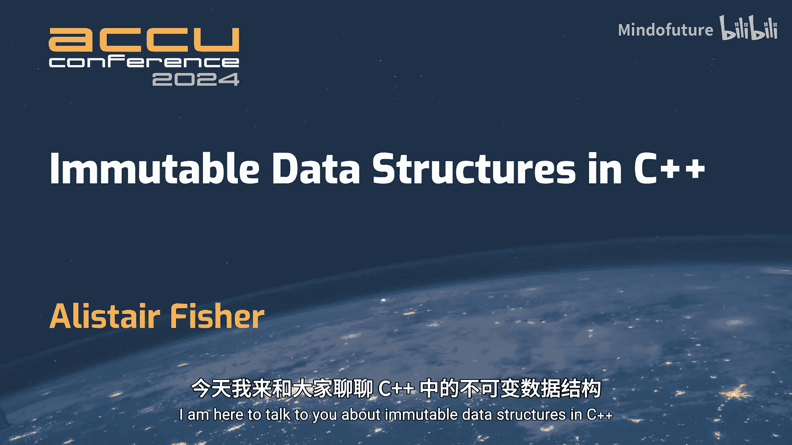
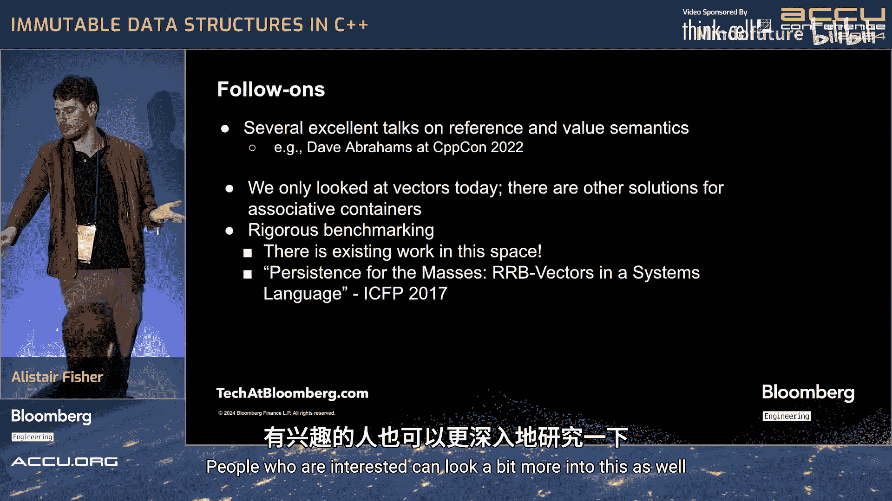

# 029：Alistair Fisher 演讲内容整理




在本教程中，我们将学习C++中不可变数据结构的概念。我们将探讨值语义与引用语义的区别，分析可变性带来的问题，并了解来自函数式编程世界的解决方案——持久化向量。本教程旨在让初学者理解这些核心概念及其在现代C++开发中的潜在应用。

## 值语义与引用语义

上一节我们概述了本教程的主题。本节中，我们来看看编程中两个核心概念：值语义和引用语义。

根据Dave Abrahams在CppCon 2022演讲中的定义，值语义基于两个属性：
1.  写入一个变量不会影响其他变量。
2.  一个变量不会被其他变量的写入所影响。

简单来说，如果一个变量像整数（`int`）一样工作——独立且不受外界影响——那么它就具有值语义。

以下是两种语义的代码示例对比：

```cpp
// 值语义示例：按值传递
int increment(int i) {
    return ++i; // 操作局部副本
}

// 引用语义示例：按引用传递
int increment(int& i) {
    return ++i; // 操作原始数据，可能产生远程影响
}
```

值语义的代码更易于理解和推理，因为其影响是局部的。引用语义则可能导致“远程作用”，即修改一处代码可能意外影响程序的其他部分，增加了理解和调试的复杂度。

引用语义还会引入其他问题：

*   **生命周期问题**：函数可能接收到无效的（如空悬的）引用。
*   **别名问题**：多个引用指向同一数据，修改时可能产生意想不到的交互。
*   **竞态条件**：在多线程环境中，共享的可变数据极易导致数据竞争。

以下是一个由引用语义引发的实际生产问题的简化示例：

```cpp
// 一个看似无害的函数
int count_evens(const std::vector<int>& vec) {
    int count = 0;
    for (auto it = vec.begin(); it != vec.end(); ++it) { // 迭代器可能失效
        if (*it % 2 == 0) ++count;
    }
    return count;
}

// 另一个线程可能同时执行
void another_thread(std::vector<int>& shared_vec) {
    shared_vec.push_back(42); // 导致 vec 重新分配，使迭代器失效
}
```

当`count_evens`和`another_thread`并发操作同一个向量时，就会发生迭代器失效，导致程序崩溃。这种竞态条件在单元测试中难以发现。

一个直观的解决方案是使用值语义，即按值传递向量：

```cpp
int count_evens(std::vector<int> vec) { // 按值传递，获得私有副本
    int count = 0;
    for (int value : vec) { // 安全，操作的是本地副本
        if (value % 2 == 0) ++count;
    }
    return count;
}
```

这解决了竞态条件和别名问题，因为每个函数都拥有自己独立的数据副本。然而，对于大型对象（如巨大的`std::vector`），频繁复制会带来巨大的性能开销，这违背了使用C++追求效率的初衷。

因此，我们面临一个困境：引用语义易出错，而纯粹的值语义又可能性能低下。我们需要寻找一种兼具安全性和效率的解决方案。

## 不可变性与常量

上一节我们看到了值语义与引用语义的权衡。本节中，我们从不可变性的角度来重新审视这个问题。

在C++中，我们通常使用`const`来定义常量。一个`const`对象在其生命周期内不能被修改。如果我们创建一个`const std::vector`，并只通过`const`引用来传递它，那么从效果上看，这些引用就具有了值语义：它们既不影响其他变量，也不受其他变量影响。

我们可以更进一步，定义一个删除了所有非`const`操作的`const_vector`类：

```cpp
class const_vector {
    // 删除所有非const成员函数，如 push_back, operator[], (非const版本)等
    // 只保留 const 成员函数，如 size(), begin() const, end() const
public:
    // 无法修改内容
    // 只能读取
};
```

这个类本质上是不可变的。然而，一个真正有用的数据结构需要支持“更新”操作，只是方式不同。在函数式编程中，“更新”一个不可变结构意味着创建一个包含新元素的新结构，而原结构保持不变。

例如，一个不可变向量的`push_back`操作：

```cpp
const_vector new_vec = old_vec.push_back(new_value); // old_vec 保持不变
```

这种操作的朴素实现需要复制整个原向量，时间复杂度为**O(N)**，对于大型数据集来说代价太高。

## 函数式语言的启示：结构共享

上一节我们遇到了不可变数据结构性能瓶颈的问题。本节中，我们来看看函数式语言（如OCaml、Haskell）是如何高效处理这个问题的。

在这些语言中，所有数据默认都是不可变且具有值语义的。它们采用一种称为**结构共享**的优化技术。当从一个现有列表创建新列表（例如在头部添加元素）时，新列表可以直接复用原列表的尾部，而不是复制它。

```
原列表 A: [1, 2, 3]
新列表 B: 0 :: A (在头部添加0)
内存布局：
B -> [0] -> 指向 A 的头部
A -> [1] -> [2] -> [3]
```

这样，`push_front`（头部添加）操作的时间复杂度是**O(1)**，空间开销也很小。然而，标准的单向链表有其固有缺点：元素访问是**O(N)**的，并且缓存局部性差，在性能上无法与C++的`std::vector`竞争。

因此，我们需要一种既能利用结构共享进行高效“更新”，又能提供接近数组性能的不可变数据结构。

## 持久化向量：一种折衷方案

上一节我们看到链表结构无法满足性能需求。本节中，我们介绍一种更先进的数据结构——**持久化向量**，它在函数式社区（如Clojure、Scala）中广泛应用，试图在不可变性和性能间取得平衡。

持久化向量本质上是一个**前缀树**。假设分支因子为4，一个存储7个元素的持久化向量可能看起来像这样：

```
        [根数组]
     /     |     \
 [子数组] [子数组] ...
  / | \ \
 0  1  2  3 ... (叶节点数组，存储实际元素)
```

**查找元素**：要找到第i个元素，将索引i转换为基数为分支因子（例如4）的数，然后使用每一位数字作为路径，逐层向下遍历树。查找时间复杂度为**O(log₄ N)**。由于分支因子较大（通常为32），这个对数很小，对于极大数量级（如万亿）的元素，深度也只有6-8层，因此在实际中常被视为近似**O(1)**。

**更新元素（添加）**：当需要添加新元素时，我们并不复制整棵树。相反，我们只复制从根节点到新元素插入路径上的节点，而共享所有其他未受影响的节点。

```
更新前（蓝色）和更新后（红色）共享未改变的节点（绿色）。
只有路径上的节点被复制和修改。
```

这种“路径复制”策略使得`push_back`操作的时间复杂度也是**O(log₃₂ N)**，同样可以视为近似**O(1)**，并且空间开销与树高成正比，远小于完整复制。

虽然持久化向量在绝对性能上可能仍无法击败高度优化的、可变的`std::vector`（后者具有完美的缓存局部性和真正的O(1)摊销访问），但它为不可变数据结构提供了巨大的性能提升。它使得在需要值语义（避免竞态条件、简化推理）的场景下，使用功能丰富、支持高效“更新”的向量结构成为可能。

## 总结与展望

本节课中，我们一起学习了C++中不可变数据结构的相关知识。

我们首先分析了在多线程时代，传统的引用语义带来的竞态条件、别名和生命周期等问题。值语义是解决这些问题的理想方案，但对于重型对象，直接复制会导致性能不可接受。

接着，我们探讨了通过`const`实现不可变性的局限，以及朴素不可变数据结构（如复制整个向量）的性能缺陷。

然后，我们借鉴函数式编程的经验，了解了**结构共享**这一关键优化技术。以链表为例，我们看到其更新效率高但访问效率低。

最后，我们介绍了**持久化向量**这一折衷方案。它利用树形结构和路径复制，在保持不可变性和值语义的同时，提供了对数时间复杂度的查找和更新操作。通过选择较大的分支因子（如32），这些操作在实际应用中接近常数时间，从而在安全性和性能之间取得了有价值的平衡。

核心要点总结：
*   **安全与性能的权衡**：在并发编程中，值语义更安全，但需警惕复制开销。
*   **不可变性的价值**：不可变数据天然避免了一类并发错误，并简化了程序推理。
*   **借鉴他山之石**：函数式语言在不可变数据结构的性能优化上已有成熟方案（如持久化向量）。
*   **实际考量**：虽然持久化向量等结构性能可观，但在极致性能要求的场景，可变的`std::vector`可能仍是首选。开发者需要根据具体需求（安全性、并发性、性能）来选择合适的数据模型。




未来的C++可能会从函数式编程中吸收更多思想，进一步发展原生支持高效值语义和不可变数据结构的工具和库，以更好地应对现代并发编程的挑战。