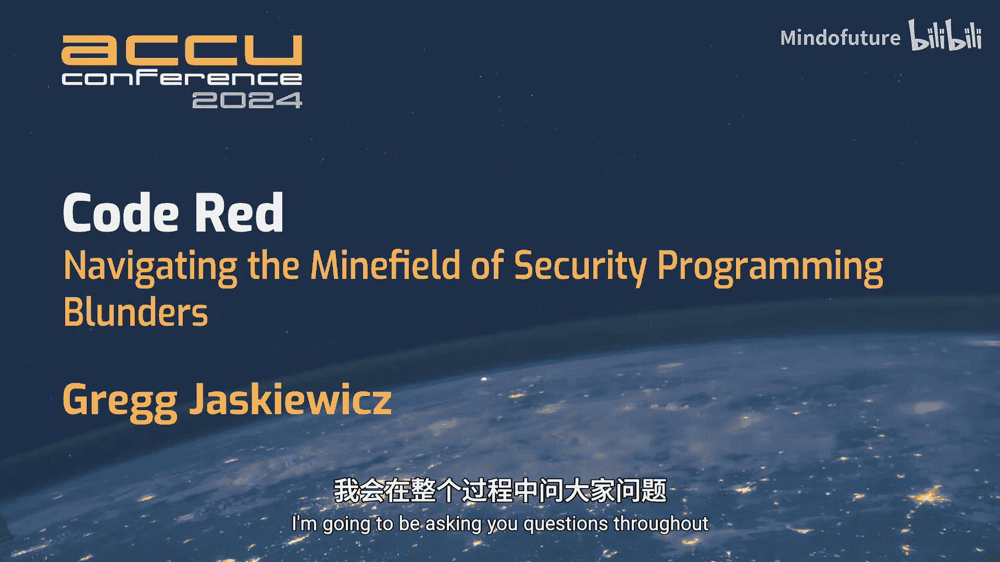
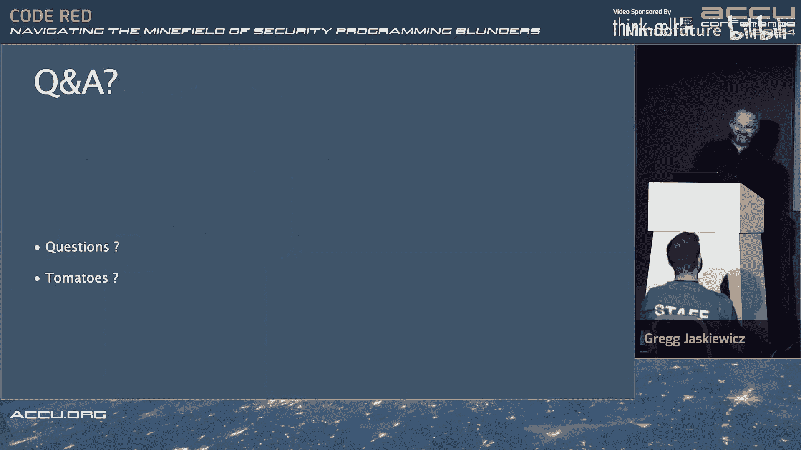

# 030：代码红色——穿越安全编程雷区

## 概述

在本教程中，我们将跟随Gregg的演讲，一起探讨安全编程中的常见陷阱和最佳实践。我们将了解安全漏洞的历史演变、现代威胁的复杂性，以及如何在软件开发中建立“安全第一”的思维模式。课程将涵盖从基础概念到高级策略的多个方面，旨在帮助初学者理解安全的重要性并掌握基本的防护方法。

## 章节 1：引言与背景

大家好。在演讲过程中，我会向你们提问，所以请准备好举手回答问题。

请举起手。这应该是每个人。很好，我看不到后面的人。反正后面人也不多。顺便说一句，这个灯很刺眼。所以如果我看向别处，不是因为我想避开你们，只是因为我如果看灯太久就什么都看不见了。

我的名字是Greg。我的姓氏你们可以随意发音。这取决于你们来自哪里。我妻子可以教你们如何正确发音，我也可以。

演讲的题目显然是“代码红色”，即穿越安全编程错误的雷区。这次演讲中不会有任何代码示例或演示。我特意保持了它的通用性。我总是有点恼火，这些会议上对安全不够重视。我被特别要求创建一个演讲，引导大家了解安全。

想象一下，你醒来，或者没醒，除非你喝醉了什么的，离盛大的派对还有半小时。你接到老板的电话，说发生了安全漏洞，需要修复。

这显然是一个极端的例子。但这种电话总是在错误的时间打来。你在半夜接到电话，或者更糟的是，它出现在电视上，你必须向一个随机记者解释为什么会出现大量的投诉，或者公司的秘密数据或客户数据被泄露了。这很有趣。我个人没有经历过这些，但我见过太多次了。我想通过展示当这种情况发生时会发生什么来开始这次演讲。

当客户数据丢失时，相信我，人们会发疯的。

让我们先倒带。我将给你们做一个介绍，关于我为什么在这里以及我将要谈论什么，还有一点关于我自己的信息。

如果你因为这次演讲的启发而打算研究安全，请先获得许可。我必须这么说。不要破坏你无权访问的随机东西。这不好玩。

我特意加上了另一条。观点是我个人的。我为安全公司、安全供应商工作。但我绝不以任何方式将这次演讲或任何内容与他们联系起来。只是为了法律原因必须澄清。

我今年大约45、46岁。我从8岁开始接触计算机编程，始于一种叫做Atari 65 XE的机器。你们有些人可能知道这是什么。有些人可能觉得它像博物馆里的东西。这是80年代末90年代初的8位计算机，当你打开它时，你可以直接编程，并将程序保存到磁带录音机或磁盘上，看看会发生什么。可以说，它对黑客很友好。作为一个有电子学经验的人，这对我非常有吸引力。所以当我得到一台电脑作为生日礼物时，我很快就对BASIC感到厌倦，并开始研究汇编语言。6502是一个非常友好的处理器，我稍后会提到它。谁用过6502？这里有人用过吗？我不想引发争论。

我本应该让这些内容逐一出现。抱歉。

那么，我为什么要做这个演讲？在某个时候，我放弃了Atari，给自己买了一台PC。我有朋友在所谓的“演示场景”里。我不知道你们是否知道演示场景是什么，但基本上，至少在我年轻时的90年代，那是一群人聚在一起在计算机上搞创作，通常是图形方面的，只是为了将硬件推向极限。现在仍然有人这么做。我自己从未写过演示程序。我写过3D引擎和486汇编代码。那是另一种类型的演讲。但这需要你非常了解底层硬件和汇编语言才能优化。

作为一种乐趣和游戏，我们过去常常为软件编写注册机。同样，这发生在我以前居住的国家。在那个年代，这实际上是非法的。我来自一个贫穷的家庭，我们每个月会得到一本PC杂志，里面会有一张CD，上面有很多共享软件，我因为没钱买而不能用。但我有很多时间，也有很多技能，而且妈妈会给我做饭。所以一切都好。我那时大概15、16岁。

有一天，演示场景的一个人给我看了一个叫做SoftICE的软件。我不知道人们是否知道SoftICE是什么。它代表“在线仿真器”。基本上，当你在测试硬件时，你想在非常低的级别调试你的处理器，你取出你的CPU或其他东西，然后插入一个由另一台计算机支持的设备，这允许你仿真或逐步仿真CPU或其他硬件。如今，这要花哨得多，因为仿真器实际上内置在微控制器里了。这没关系。有一个软件，或者曾经有一个，叫做SoftICE。它基本上允许你在任何点停止Windows并进行调试。这对于设备驱动程序非常有用。如果你想调试你的网卡或其他设备驱动程序，并且想逐步调试它，或者想在操作系统完全启动前加载的驱动程序，比如显卡驱动程序，你想能够逐步调试其中的问题，SoftICE是一个允许你这样做的软件。我与他们无关。我当时使用的是正确版本。那是35年前，或者30年前的事了。

我们需要在计算机里插另一张卡，叫做Hercules卡。我不知道是否有人记得Hercules卡是什么。它是一种不同的显示器，是黑白的图形卡。你会在那个显示器上看到调试控制台，有点像之前演讲中的GDB，但更简化。你可以逐步执行所有操作。所以即使软件试图规避调试，你实际上只是停止了整个系统。整个操作系统都会停止，这允许你做有趣的事情，破解那些本来不容易破解的软件。

我为什么要告诉你们这些？因为我对安全的迷恋可以追溯到我15岁的时候。我至今仍然对安全非常热衷。

如今，显然我们很容易做到。我们可以直接拿一个软件，使用像Ghidra这样的软件进行反汇编，这些软件允许非常容易的反编译和内省，所以你可以实际看到发生了什么。

我这里有个笔记写着“不要过多谈论自己”。但我刚刚就说了。抱歉。

我为什么要做这个演讲？就像我说的，这是我的历史，但我开始作为一名软件工程师工作，我的背景重点始终是安全。当我开发功能或其他东西时，人们不认真对待安全问题，这总是让我感到痛苦。因为在安全领域，有一种说法是，你可以失误很多次，但黑客或入侵者只需要幸运一次。所以你必须时刻保持警惕，不能只是说“好吧，我们引入了这个bug，但我们会在下一个版本中修复它。谁在乎1.5亿用户数据被窃取或泄露了？”这显然对任何人都不好。

我不会给出任何代码示例，就像我说的，因为你们已经看过很多了。我想讲得更宽泛一些。但如果你们在整个过程中有任何问题，如果我说了什么，你们感兴趣，就喊出来，我会让你们知道答案。我可能会说“去谷歌一下”，因为所有这些事情，就像我刚才和Tim说的，顺便说一下，Tim就在前排。我总是觉得安全像是一个神秘的东西，这很烦人。其实不是。安全领域有很多本身很有趣的小东西。但我认为，如果你阅读并思考它，这个领域实际上相当容易接近。就像你在开发软件时一样。

我会给出一些我将要谈论的内容的链接。之后我会把幻灯片发到Discord上。所以你们不必截图或做其他事情。所有这些都可以在谷歌上搜索到。就像我刚才说的，我谷歌了所有这些，因为我不记得全部。

## 章节 2：安全漏洞的历史与演变

那么历史，对吧？这又要回到80年代。像病毒或漏洞这样的东西，在过去你运行DOS的PC上，人们……这对我来说很有趣。我不知道其他人怎么想，但病毒过去常常是人们作为挑战而做的事情。在DOS或Unix或OS/2或其他系统上，你找到了一种方法，当你的朋友放入磁盘时捉弄他们。它会加载第一个扇区，实际上会将一个程序或软件加载到内存中。屏幕上会出现一条消息，或者屏幕上的一切都会反转。这一切都是为了乐趣、兴奋，典型的工程挑战。

我实际上不得不谷歌这个。也许有更早的版本，但我一直记得的一个例子是有一个叫做“Brain”的病毒。我不知道是否有人记得那是什么。但显然它起源于1986年。它是一个IBM PC DOS病毒，会用病毒副本替换软盘上的引导扇区。整个目的只是为了展示可能性。这是我们可以捉弄人的方式，我们可以玩得开心。实际上，它是由巴基斯坦的两兄弟创建的。屏幕上的消息，我想，只会说“这只是一个演示。哈哈。如果你想让我们删除这个或帮助你，请告诉我们。”我不知道怎么操作，因为那是1986年。人们没有电子邮件，或者有些人有，但我不知道，我不知道它是怎么运作的。

所以，你知道，它曾经很有趣。它曾经很令人兴奋。它曾经只是工程师们的恶作剧。或者，你知道，这一切都很友好。

## 章节 3：现代安全威胁的严峻现实

随着我们进入现在，这就没那么有趣了。这是一个严肃的、价值数十亿美元的产业。它是可怕的。这里有一个家伙。他的名字在边上，如果你们想读的话。Maxim Victorovich Yakubets，我不知道他目前的下落。但他显然被FBI通缉。这是他在莫斯科某处跑来跑去，只是傻傻的，你知道，只是……警察在这个国家会用什么词来形容这种行为？反社会行为，对吧。当然。我确信以这家伙拥有的钱，他能做到这一点。但这只是众多例子中的一个。当然，你知道，俄罗斯等国的腐败如此猖獗，以至于他就这样逃脱了。

这段视频在国家犯罪局的YouTube频道上有一个更长的版本，如果你们想看的话。但为什么要看呢？不过我想给他们点赞，因为我几年前看过那个视频，我记得。我需要提一下。但重点是，如今，如果你有钱并且想作恶，你实际上可以付钱让别人去攻击某人，而你甚至不需要任何技能。这家伙实际上是一个出色的软件工程师，但结果证明他脑子里有点古怪，决定用它来做坏事，而不是做好事。他实际上出生在乌克兰，但显然是俄罗斯居民。同样，我不知道他目前的下落。这些人犯罪后能逍遥法外很长时间，因为他们生活在无法被绳之以法的国家，或者他们与政府关系密切。我不想深入讨论这个，但你知道，如今这是一个非常严重的事情，可悲的是，这就是为什么我们必须关心这个，因为再次强调，那些将目标对准你的系统或你雇主系统的人，大多数时候不会为了好玩而做这些。

## 章节 4：加密货币与安全

只是为了进一步说明，我不太确定这在房间里或YouTube上的人看来会怎样，但我必须说出来，否则我会感觉不好，因为这就像房间里的大象——加密货币，对吧？这是一项严肃的业务，因为人们可以通过加密货币支付和转移资金来逃脱惩罚。本质上就是这样。就像交易市场一样，公司价值根据现实生活中的各种情况增值或贬值。可悲的是，在我看来，加密货币在很大程度上是由许多 shady 的东西支撑起来的。黑客攻击就是其中之一。如果你被黑客攻击，有人试图勒索你，他们会要求你用比特币或其他加密货币支付，而不会要求支票或代金券，对吧？

有什么问题吗？我的意思是，我不是想让大家扫兴。只是必须提一下。

## 章节 5：案例分析：Equifax 数据泄露

我将给你们两个例子，实际上我放在了演讲描述中。每个人都应该知道它们，如果你在软件行业，除非你与世隔绝，否则不可能不知道。它们将作为稍后的例子。

在讲了这些可怕的事情之后，我只想说，安全仍然很有趣。作为一名工程师，你可以通过玩安全、测试东西获得很多乐趣。再次强调，我不会带来任何代码示例，因为我认为它们很容易谷歌到。实际上，我笔记里没有这个。但如果你去……我试图为这次演讲准备很多东西。没有一种简单的方法可以谷歌一个CVE然后说“好吧，给我一个会导致这个的代码示例”，因为太多了。如果你试图查看开源产品中安全漏洞的开源示例，显然你可以查看Git日志，因为现在通常在GitHub上。那将是一段相当复杂的代码，最终归结为几行，但它们会分散在各处。这不是一个简单的演示。这是我的观点。所以我想饶过你们。但这仍然很有趣。无论如何，给自己一个挑战，查找一个CVE和一个开源产品，看看发生了什么，因为你会惊讶于它是多么简单，却能造成多大的破坏。

谁知道Equifax？有人听说过或记得吗？我无法凭记忆说出具体日期，所以我做了一些笔记并写在这里。希望它们没错。同样，有数百万个数据来源。但这个很有趣，因为这个事件发生在2017年3月。有一个Apache Struts Java Web框架的漏洞，我稍后会详细讨论，同样没有代码示例。

这是一家美国的大型银行。他们忽略了CERT的建议，没有修补它，不管出于什么原因。也许他们修补了。也许IT安全人员不在，也许他们没有相应的程序。谁知道呢，我相信某个地方有报告详细说明了情况。再次强调，如果你经营一家大企业或为大企业工作，我敦促你查看这些事情，并把这些事情提给你的老板，看看是否能改善你的安全状况，因为这非常重要。这是一个很好的例子。

那么，发生了什么？基本上，在Apache Struts中发现了漏洞。三天后，有人决定扫描整个网络，看看谁在运行Apache Struts，以及他们的服务上是否有那个漏洞。这些人显然有。所以有人发现了。有人设法利用了它。如果你不及时修补，这就是你可能成为目标的方式之一。黑客设法获得了三台服务器的登录凭证。技术细节会有，如果我想深入探讨，这本身就是一个单独的演讲。他们获得了一个立足点，可以这么说。他们能够浏览内部网络。这一切都是通过一个门户服务完成的，如果你想投诉，基本上就是向你的银行投诉，显然他们有这个服务。我不知道，我从未为银行工作过。所以我不知道，我不知道正常的方式是什么。但这里关键的学习点是，仅仅……实际上，我稍后会再谈另一点。

第二个问题。内部流量是加密的，但用于验证加密证书有效性的证书过期了。所以对它们的验证基本上被禁用了。我不知道具体发生了什么。但重点是，他们能够对自己进行中间人攻击，解密更多流量或拦截更多流量，发现更多内部登录信息，或者侵入更多服务器。结果，他们从中获取了大量数据。

实际上，我没有在前一张幻灯片上写。是的，我把这些幻灯片分得有点乱。他们能够获取1.4亿用户数据、用户账户信息。这显然让他们付出了沉重的代价，每人高达2万美元，所以你可以想象。这是一次昂贵的经历。可能被某些保险公司低估了。所以，你知道，他们不必付钱。银行通常能逃脱这些事。或者也许美国纳税人为之买单了。谁知道呢。但重点是，这不仅仅是一次入侵。他们忽略且未修补的初始漏洞只是进入整个组织的一个小立足点。他们还有其他巨大的问题，安全程序上的失误。谁知道呢。再次强调，银行很复杂。数据丢失了，你知道，我确信造成了大量的金钱和时间损失。这是一个例子，说明人们常常忘记，即使你在外部有防火墙或其他东西，我稍后会再谈这一点。如果你允许内部事物不受任何限制地流动，仅仅因为有一个裂缝，你可能仍然会有大问题。再次回到之前的说法，他们只需要幸运一次。而他们这次就做到了。

## 章节 6：案例分析：SolarWinds 供应链攻击

我发现这很有趣，以一种技术性的最佳方式来说，因为最初的漏洞实际上并不在验证输入的代码中。他们正确地完成了所有的输入验证和清理。但如果出了问题，如果他们发现某些东西不符合要求，捕获异常的代码（因为这是Java）是有漏洞的。这恰恰表明，你必须非常认真地对待如何处理异常，而不仅仅是检查和清理输入，你会惊讶于有多少网络服务和其他软件不这样做。在这种情况下，这是一个相当复杂的用于大文件上传的HTTP标准，我自己也不完全理解。它相当复杂。基本上有很多事情在进行。有很多机制允许你分块发送文件。

重点是，在处理数据时要小心，如果数据不匹配该怎么办，对吧？通常的安全指南是，除非服务器处于调试模式（如开发模式），否则就禁用它。要么不返回任何东西，让TCP连接超时，要么就说……我记不清HTTP返回代码了，大概是403安全或未授权之类的，4xx系列中的一个，不是404，因为那是未找到，但你可以……这是另一件事。当出现问题时，你不必说实话，有时最好只是说“不行”，就这样。

另一个例子，可以说是在不同光谱上的，是SolarWinds攻击。我不知道是否有人记得。这发生得更近，在2019年末9月。一个为SolarWinds工作的第三方供应商向他们提供了一些……具体是什么不重要，因为这是闭源软件。所以，你知道，我们不会找到代码示例中实际出了什么问题。但这是所谓的供应链攻击。有人植入了一段恶意代码。SolarWinds可能改进了。我可以想象，这些是为政府机构工作的大型组织，他们在可追溯性和代码批准方面有标准，一切都必须经过多个流程，但不知何故它溜进去了。

实际上，我有点跳过了。在这之前，一家叫做CrowdStrike的公司，他们服务器上运行着所谓的Falcon传感器，不知何故他们设法发现了一个奇怪的活动，并将其标记为一个问题。这实际上相当聪明，你知道。因为这显然不是……不，这穿过了这么多层网。然而，软件能够发现一种异常行为。所以我认为这非常出色。

那么，基本上发生了什么？这个Orion平台上有一个后门，是由黑客创建的，能够访问并冒充受害组织内的用户，基本上可以随意窥探。我不会深入讨论例子。这本身就是一个演讲，关于如何在网络上检测异常行为，以及恶意行为者通常如何通过命令和控制中心等做到这一点。可以说，软件能够发现它，我认为这非常出色。

所以，他们显然……我确信他们能够追溯。但你如何改进呢？我认为几乎不可能保护自己免受这种攻击。

主要攻击目的显然是获得系统的多个入口点，并能够改变行为或窥探，或者只是在网络中的某个地方获得root shell。据信又是俄罗斯干的。我不知道为什么我总是挑俄罗斯的毛病，这次不是故意的。在安全领域，人们喜欢给敌对机构或敌对国家起有趣的名字。这次叫做Noble Bear，AKA APT29，在我的祖国人们会这么叫。我不知道他们是怎么发现的，但他们设法发现了。目标显然是在内部有眼线。

如果有人两年后看这个视频，他们会想“什么？”。但如今，每个人都必须谈论X。我不知道人们是否听说过最近发生了什么。但当我准备这次演讲时，显然这是在X发生之前。当我编辑这个并为今天做准备时，我想我必须提到，不仅仅是开源软件容易受到供应链攻击，闭源软件也一样。我没有任何例子，因为我无法证明或给你可靠的URL，所以这可能有点道听途说。但业内都知道，我该怎么说呢？如果你开发一个可能供应给大型行业（如银行业）的软件，或者你将控制供水或政府，可能会有一些感兴趣的团体为上述供应商工作，来自美国人喜欢称之为“三字母机构”或敌对的外国机构。所以，俄罗斯对外情报局（SVR）可能会在软件中添加东西。你可能永远发现不了，因为他们显然知道如何规避程序，就像X是加密库（不是压缩库）的一个好例子，说明如何规避并悄悄进行。一旦事情平息下来，我很乐意就此做一个演讲，因为这本身也很吸引人。

到目前为止没有问题。没有人无聊，没有人睡觉。很好。

## 章节 7：常见安全漏洞类型

所以，再次强调，这个列表本身就需要90分钟才能详细讲完，如果我要详细说明并给你们演示如何做这些事或展示代码示例的话。但凭记忆，这确实是前5或6件事。

*   **内存问题**：是的，它们在C++中是可能的。正如你在之前的演讲和今天及昨天的许多其他演讲中看到的，C++在内存问题上并非无懈可击。很抱歉。坦率地说，没有语言是，因为只需要人为错误。
*   **缓冲区溢出**：同样，在C++等语言中非常可能。
*   **资源泄漏**：无论这意味着什么，这是一个广泛的统称。你基本上只是打印出你不应该的信息，或者记录你不应该的信息，或者你忘了放空指针检查，然后它逃逸了，不管是什么。这是一个统称。
*   **释放后使用**：不幸的是，这是一个闭源应用程序或软件。这就是我所说的安全对人们来说有点晦涩难懂的意思，比如CVE-2019-0001。所以显然是2019年报告的第一个。这是一个……我要读一下这里实际写的内容，因为我记不清了，因为又是一个性感的名字。“在具有动态VLAN配置的MX服务设备上的畸形数据包可能触发不受控制的递归循环。”显然是由释放后使用引起的，代码可能是用C++写的。或者delete会是，但你知道，在CVE中他们不会说delete，只会说free。
*   **整数下溢和溢出**：所以再次，我回到今天和其他C++演讲中看到的例子。但有时很容易只是将一个整数传递给一个期望字符的函数，由于某种原因，你关闭了编译器警告，这在现实生活中会发生。或者你基本上有一个从JSON或XML等获取的字符串，你没有检查整数类型，然后将其从字符串转换为整数的函数有bug，这一切就发生了。
*   **不安全的内存使用后**：这实际上发生在一个开源项目中，在Ghostscript PDF解析中，信不信由你。这是现实世界中的一个例子。PDF是一种相当复杂的文件格式。或者说PostScript，技术上是一种编程语言，也许可以这么说，但我不确定，我不是专家。但PDF，你知道，另一个例子可能是解析HTML、Unicode字符串等，如今这些都是复杂的代码片段。在这种情况下，是试图引用一个错误的点。我认为Ghostscript是用C写的。所以，也许是用C++写的，谁知道呢，我不知道。
*   **格式化字符串漏洞**：最后一个就像回到安全的历史早期，你知道，在过去，代码大多是用C写的，有人用了像sprintf这样的代码，或者他们试图打印你作为值传递给他们的字符串，他们期望的是不同长度的字符串，或者他们有一个256字节的静态数组，而你给了512字节，很容易覆盖你不应该覆盖的内存，通常是栈或另一个变量，导致奇怪的事情发生。如今，要使问题可被利用，通常必须在代码中找到多个问题，但人们确实会找。那些有很多时间、动机和资金支持的人会这么做，而且常常住在像俄罗斯这样的地方，他们显然没有别的事可做。再次强调，不是特别针对俄罗斯。你知道我的意思。

## 章节 8：如何避免安全漏洞

那么如何避免这些呢？再次，我会来回讨论这些事。但首先，SA是所谓的软件成分分析。我不知道人们是否知道那是什么。但那基本上意味着，你查看你的代码所依赖的东西。所以你使用什么库，使用什么第三方代码，使用什么系统API。仅仅知道这些事，有时把它们写下来实际上非常有帮助，尤其是当老板后来打电话告诉你发生了入侵，或者你必须分析你的代码，因为生产中出现了导致重大损失的问题时。

这实际上很有趣。我没有这个……我偏离了我要说的。但只是我想到的一个随机想法，人们常常在代码中发现漏洞，却不知道那是漏洞。基本上，软件随机为客户崩溃。从技术上讲，这是一个漏洞。有人可能利用了它，但客户只是误用了它，对吧？但这种事确实会发生。老实说，我见过不止一次，当人们说“哦，这只是用户错误”时，我笑了。我说“哦，老兄，你的代码里有漏洞，你只是不知道而已。”

另一个我多次提到的是渗透测试。我不知道人们是否知道渗透测试是什么，但用外行的话说，你找公司里的几个人或一个人（我过去做过很多次），找一个从未见过你的代码、不了解你的文化、不了解你的首席开发人员及其方式或怪癖的人，以全新的眼光看待代码，并提出所有问题，告诉你“好吧，你可以在这方面改进。这些事本可以做得更好，这太糟糕了”，不管怎样，最后给你一份报告。这些事通常需要几周时间，因为这个人毕竟是新手，他们需要被引导了解代码。但这非常非常有帮助。像我，我为客户做过几次渗透测试。但有些人以此为生。他们通常在安全方面比我聪明得多，见过更多事情。所以我强烈建议每个企业，如果你认真对待你的代码，并且你希望你的代码更安全，能够承受任何潜在的问题，无论是客户中断还是漏洞，就给自己找一个渗透测试员。这可能会在未来为你节省大量资金，而且如果人们愿意，也能从中学到很多东西，改善你的组织。

威胁建模是另一个。如果你供应给受监管的更严肃的企业，或者在你的特定市场或ISO标准或你必须遵守的任何规定下，可能需要你进行渗透测试和威胁建模。它基本上就是，你要坐下来，说“我认为如果发生这个，可能会造成破坏，这个可能会让我半夜被叫醒，我的老板可能会出现在电视上，最坏的情况，对吧？”为什么这有帮助？显然，你可以由此向下推导，说“好吧，嗯，你为此做了些什么。”渗透测试常常会提出你可能没有想到的威胁。

单元测试。Phil（可能指演讲者认识的人）如果我不提TDD会失望的。但在安全方面，实际上以自己的方式编写代码，并进行大量测试，非常非常关键。我不会说出我过去为之工作的人的名字，但我曾经受雇于一家公司，开发一个当时世界上几乎每个财富100强公司都使用的代码，用于他们的董事会会议，记录未来的讨论或其他什么，相当重要。如果数据泄露，你可以预测公司未来几年的价值。这家公司已经不存在了，所以我可以随意谈论他们。安全层加密简直糟透了。它是一个单独的文件，但我记得大约有20000行代码，用Objective C写的。全是静态函数。这是一团糟。我的工作是解开这个，把它变成许多类并结构化，并进行大量测试。这是一个例子，如果没有TDD我无法做到这一点，因为我必须将测试引入这团混乱中，然后解开混乱，并确保测试仍然通过。在这个过程中我发现了许多问题。这很有趣。

模糊测试是另一个我稍后会再谈到的。谁知道模糊测试是什么？有人不知道模糊测试是什么吗？好吧，朋友们，模糊测试简单来说就是模糊你的输入。所以你有一个开放的监听端口，比如SSH，你只是向它发送随机数据。这些数据看起来应该没问题，但你改变了内容。所以你在某个地方放1，其他地方放2，不管怎样，然后你看它是否崩溃。因为计算机很便宜，你可以在周末运行服务。你可以以随机方式循环地向它扔东西，看看什么有效，什么无效，或者什么会破坏它。你知道我的意思。静态代码分析是另一个。我对人们误用、不使用或忽略静态代码分析的方式有很大的意见。可悲的是，因为这是计算机在分析你的代码。它可能会遗漏一些东西。静态代码分析在计算上相当昂贵。如果你想想它必须生成的所有依赖项和可能性的树，这是一个它必须生成的庞大结构。显然，计算机随着时间的推移变得更好。但它可能会产生很多误报。这实际上导致人们忽略它的输出。我认为你不应该。我有很多轶事。我将在接下来的几张幻灯片中回到它们，但我有一些关于公司的轶事，在那里我被告知忽略静态分析，然后我会接到电话，或者只是遇到过去一起工作过的人，他们会说“哦，是的，你留下的评论，你知道，像这样的GJ。将来看看这个。是的，我们因为那导致问题而中断了一周。”我会说“耶”。但有时，有时只是业务程序如此。所以你必须进行成本分析，看看是否值得重写一段代码。

运行时内存和线程分析。有人用过Valgrind吗？或者Valgrind，不管正确的发音是什么。有人不知道它是什么吗？基本上，如果你使用Linux，或者我不知道它是否在Windows上工作。它是一个代码片段，我认为它本质上模拟你的CPU，并在API调用中放入许多钩子，所以一切运行得更慢。但它能够发现你的代码中的许多问题，可能是像内存问题这样的，你的编译器、静态分析工具等可能会遗漏的问题。它是无价的。我不知道现在是否还这样，但在我还是个小伙子的时候，当我最初使用它时，计算机更慢，像缓存未命中这样的事情非常重要。所以它会告诉你，实际上，你使用这种数据结构的方式很慢。将会有很多L3缓存未命中。再次，我不会深入讨论，我将在几张幻灯片后有一张关于CPU的幻灯片，因为我也有话要说，这很有趣。但Valgrind，如果有人没用过，我强烈建议你试试。运行Valgrind会显示你代码中的许多问题，相信我。根据我的经验，这从不出错。

回到我工作的公司，我留下了很多评论，静态分析和Valgrind将是这些工具，实际上指出了许多潜在问题。突然，由于各种原因，我不被允许修复所有问题。我能做的只是为未来的员工和管理层留下一些代码注释，说“嘿，是我。我曾在这里工作过。”

红队演习。这是针对大企业的。有人知道红队蓝队是什么吗？基本上，对于那些不知道的人，这通常不会发生在小企业。但如果你是一家高风险企业，即使你是一个小团队，也值得让某人尝试侵入你的代码或做一些有趣的事，当然是在老板知情的情况下，这样你知道存在一些风险，是别人造成的。通常当你作为技术人员在办公桌前工作时，他们会看着你出汗，而你试图找出问题所在。这很有趣。如果你经营一个大型组织，我强烈建议你研究一下红队演习。感谢为此付出的人，因为再次，你可能会对你的业务了解很多。

## 章节 9：模糊测试实践

那么模糊测试。就是我提到的那家我留下代码注释的组织。再次，我不会提名字。但当我加入时，他们实际上……这家公司正在研究DVB编码。所以基本上是处理最终出现在机顶盒上的视频信号。机顶盒，我不知道。人们现在不像以前那样多用机顶盒了，因为有流媒体等。所以这可能又是一个老话题。但机顶盒是运行在你客厅或电视下面（现在通常在电视里面）的计算机。就安全威胁分析建模而言，你的家是一个敌对环境。为什么？因为你可以打开它并摆弄它。所以，你知道，像“敌对环境”这样的术语实际上很有趣，因为它听起来很可怕，但只是意味着有人可以搞乱东西。在后端方面，这很有趣。它的架构相当出色。做得很好。

他们有软件运行，在Linux服务器上运行的小软件，因为它可以扩展。中间是一个通用的……那个软件叫什么来着？我们姑且称之为路由器。它是一个应该与所有组件通信的软件。如果其中一个死了，或者我们需要生成另一个，它会做这些事。为了与所有组件通信，它使用二进制协议，因为有很多数据交换，很多密钥等。基本上更高效。它有一个端口开放。端口号，再次，不重要。但重点是那个端口是开放的，你可以摆弄它。这是因为它可以有一个网络接口服务器，不管怎样。这没关系。

当我加入时，我最初在做一些其他事情。实际上，我当时是作为SQL专家被引进的。我过去做过很多PostgreSQL合同。但因为我的简历上有安全背景，他们觉得“Gregs，对吧？”我在摆弄东西。有一天我决定做这个。有人不知道这是什么吗？`nc`（netcat）基本上就像……它接收标准输入管道上的输入，在Unix系统上，在那个IP上打开端口，并将该数据作为二进制数据发送到那个特定端口。你可以拦截它的输出。这是一个相当有趣的工具。当然，如果你输入垃圾，它就会把垃圾发送到网络。如果你循环这样做，有趣的事情就会发生。这是当人们问我模糊测试是什么时，我总是给出的例子，因为这是最基本的模糊测试。这实际上发现了许多解析结构时的问题。代码写得很好。有很多检查等。你总会遗漏一些东西，就是这样。几分钟的模糊测试，我们就发现了许多可能导致问题的漏洞。为什么这很重要？因为管理层可能会问我“我们为什么要关心这个？这是一个服务器机架。它将放在客户的数据中心里。没有人会摆弄这个。是的，他们会有网络服务，不管怎样，但如果有人把错误的以太网电缆插到错误的插座，另一个软件使用端口，比如说66000，并向我们的服务发送一些随机数据，导致它宕机，然后你就接到了第一张幻灯片中的电话，对吧？”这又回到了原点，你知道，这整个安全事物就像一个快乐的大家庭。所以我想提一下，如果你想找点乐子，并且有许可，如果你的组织因为某些原因仍在使用二进制协议，就用`nc`玩玩吧。如今，实际上有模糊测试框架，因为显然模糊测试不仅适用于二进制协议。这只是一个粗糙的例子。但你可以拿一些XML、HTML等，然后对模糊测试框架说“在这些字段上找点乐子”，你可以有一些正则表达式等。有很多人写了非常酷的模糊测试框架。事实上，如果有人看过，有很多HTML渲染问题是通过模糊测试发现的。所以，模糊测试。我强烈推荐。它很有趣。

## 章节 10：现代威胁与攻击面

那么，现代威胁。我不知道为什么我看着那里。我能在这里看到这个。不管怎样，灯光。再次，这是那些如果我不提就会被指责的幻灯片之一。我将提到我之前提到的公司CrowdStrike。我在博客上找到了这个。我认为这看起来可信。

他们基本上说，大约55%的已识别内部威胁事件涉及未经授权使用或试图使用特权升级漏洞。所以有人带来了他们的iPod或Android手机或iPhone，不管是什么，插入了工作计算机，然后一段软件被执行了，对吧？45%的内部威胁事件是由无意中引入风险的人造成的。我不知道这里有什么区别。哦，抱歉，第一个是55%的人实际上主动尝试了。所以他们知道自己在做什么。45%的事件是那些插入iPod等的人。这，你知道，不好玩，但这表明，在一个大型组织中，我们常常是最薄弱的环节。我打算点名，但你知道，这就是人们发现你为谁工作、你使用什么、他们如何可能利用你的组织或获得立足点，然后在内部发现其他问题，突然之间，这就成了现实。我接受过很多钓鱼培训。当他们试图钓我时，我总是暗笑，因为你知道，当你知道你将被骗一次时，你就会非常认真。但我们必须注意这一点，尤其是如果你有非技术人员，他们不容易发现。你知道，从本性上讲，我们都想乐于助人。尤其是当你做生意时，你想帮助你的客户。但有时这些事情最终会出错，你必须在内部建立层次来防止这种情况，对吧？我们必须有另一层保护，比如银行里的Bob不能仅仅因为有人打电话告诉他们丢了手机，急需帮助，就从某人的账户里取钱。或者，我不知道我是否该谈政治，但NHS（英国国家医疗服务体系）在凌晨3点打电话给你，告诉你有人威胁他们，需要5000英镑。你必须注意这些。

开源情报。我喜欢这个，因为它基本上就是谷歌搜索，只是在互联网上找东西。你知道，如今我们能找到多少信息是相当可怕的。你可以在社交媒体平台上对商业账户进行社会工程学攻击。你可以谷歌搜索。你可以在谷歌地图上找到东西，等等。是的，抱歉，威胁。有趣的事情。不涉及技术，但我认为记住这一点很重要。

## 章节 11：高级攻击技术

那么，让我们看看另一个有趣的，再次，这让我发笑，你知道，我内心的6502男孩。如果我告诉你，如今有人基本上可以查看你的RAM内容？我稍后会再次提到这个，但可以通过测量时间、定时攻击来发现关于安全、加密、密码等的信息。再次，像所有这些事情，我可能可以做一个演讲。虽然我不是其中任何一项的专家，但如果我想再花一个小时谈论这个，我可以给你们带来例子并展示一些例子，因为定时攻击。我不知道人们是否知道定时攻击是什么，但你基本上测量时间。所以你运行一个例程，测量时间，调用一个API，不管怎样，你改变输入，然后看时间差异，你可以根据内部行为发现一些信息，这显然取决于代码是如何构建的。

在嵌入式系统上，还有功耗分析攻击，这有点类似，但你只是分析某物使用了多少功率。在嵌入式系统上，你还可以通过 starving 或 brownout（电压降低）来玩微控制器，这本身又是另一个演讲，需要很多演示。但你基本上如果微控制器需要5伏，你给它4.5伏，看看它如何应对，基本上，它会做奇怪的事情，尤其是当你想访问硬件中加密的数据，而你没有密钥，或者安全性有点可笑时。所以你想访问的数据实际上没有加密，但受到一些代码层的保护，而你无法真正替换那些代码。

缓存投毒。不知道是否有人知道投毒是什么，但基本上，如今的CPU很复杂。有人听说过Spectre攻击吗？这又是一个话题。我不是专家。我从过去写演示程序时就知道缓存是如何工作的。但如今的计算机CPU更加复杂，你知道，内存访问和缓存等方面有很多层抽象，以及预测分支等。这很复杂。这一切，你知道，都是为了在相同的CPU时钟速度下让它更快，但这很可怕。复杂，显然，这导致了安全问题，令人惊讶。

所以，是的，CPU漏洞。像6502这样的东西，我认为是由一个人设计的。也许他有一个团队和他一起工作。但它是一个……也许是一个小团队，但如今你或许可以下载它的原理图，然后看着它说“哦，是的，我理解这个。我理解这个。”你无法对现代CPU做到这一点。这根本不可能。所以显然，你知道，复杂性，当你增加复杂性时，你就增加了出错的可能性。这是自然法则。

## 章节 12：内存安全与白盒密码学

所以，是的，这引出了另一个有趣又可怕的幻灯片，再次，这对我来说……当我15岁时，我会说“真的吗，老兄？”但是的。你手中真实的东西并不像看起来那么安全，我想。同样适用于你的交换空间。抱歉，如今交换空间通常是加密的。并且有层次来确保它们的安全，但RAM，就其本质而言，必须对软件可访问。所以它不会被加密。再次，这个的变体。但对于一台运行Windows的普通计算机，你真的不想在RAM中以未混淆的形式存储长期加密密钥或秘密，比如明文密码。这实际上是关于渗透测试的，我想我说过我会再次提到渗透测试。渗透测试报告中经常看到的事情之一，尤其是我过去写了很多iOS应用程序，那曾经是我的合同工作，我们请来的渗透测试员，再次，我自己也会把这一点写进渗透测试报告，经常会指出，当用户尝试登录或输入密码时，我们以明文形式将其保存在内存中，而不是混淆它。但这都与另一个在后台运行的应用程序可能通过各种方式窥探并访问它有关，如果你不在RAM中混淆它的话。同样适用于加密密钥。

最重要的是API密钥。我不是一个网络人员。所以我不做很多网络开发或网络API调用。所以我不确定人们是否仍然……当我过去经常做这些时，人们会给你一个哈希值，你必须将其填入某个字段才能访问API。我实际上为英国一家大型广播公司工作过。当我开始开发他们的iOS应用程序时，我注意到与DRM等相关的API密钥和AES密钥实际上在头文件中。我们显然有不同的暂存、生产等测试环境。所以每个环境会有不同的头文件。我说“我能谈谈这个吗？”所以当我的经理发现我了解一些这方面的事情时，他实际上在一次与CTO的会议上提了出来，第二天CTO说“我能见见这个人吗？”所以我基本上进行了一次三方会议，我向他们解释这不太好。他说“是的，我知道这个，但我对此无能为力。”我说“不，你可以。”那么，有人知道白盒密码学是什么吗？我会很惊讶如果有人知道这个。我会很高兴地惊讶。

白盒基本上意味着你在公开场合做某事，对吧？黑盒，你隐藏它。白盒密码学本质上意味着你展开你正在做的任何加密例程，比如AES。我无法凭记忆解释AES，但有很多位哈希和异或操作，本质上