# 031：数据抽象演讲 - Kevlin Henney

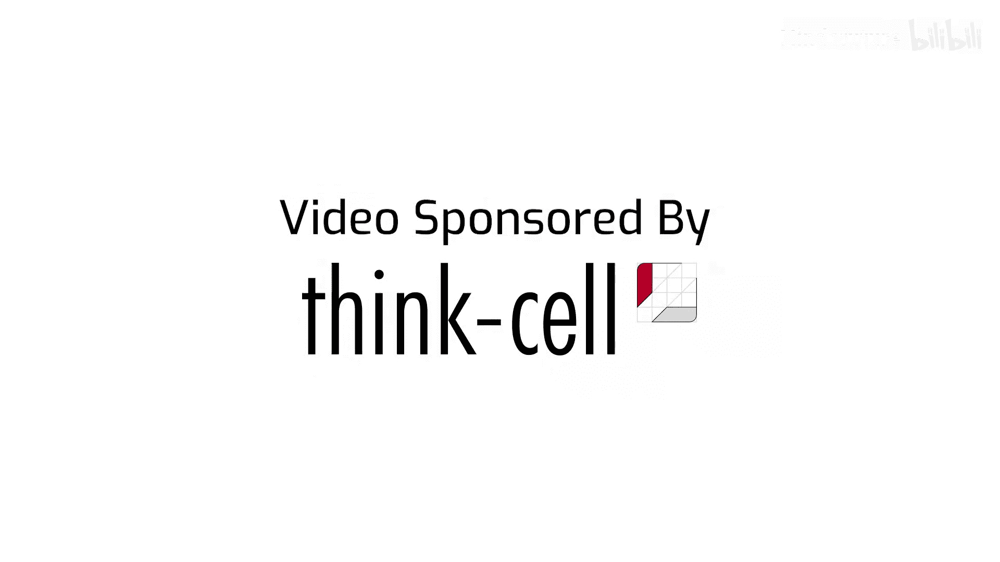

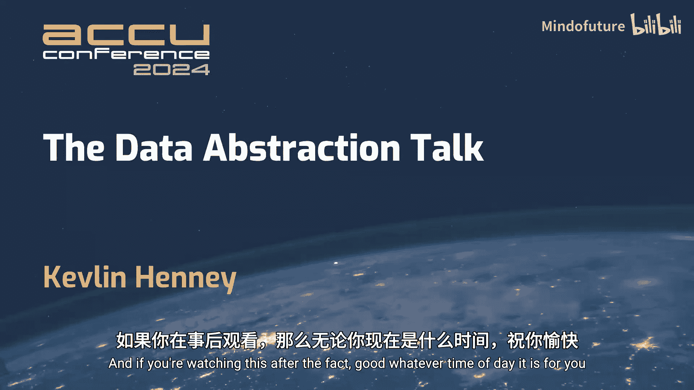

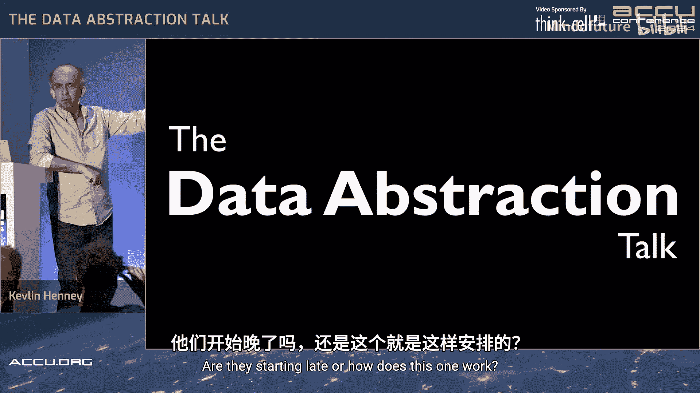

## 概述

在本节课中，我们将学习软件工程中的一个核心概念：**数据抽象**。我们将探讨什么是数据抽象、为什么它如此重要、它如何帮助我们构建更健壮、更易维护的软件，以及如何在实践中应用它。我们将从历史背景出发，理解其基本原理，并通过具体的代码示例来展示其价值。

## 历史背景与核心概念

上一节我们介绍了本课程的主题。本节中，我们来看看数据抽象这一概念的起源和重要性。

数据抽象并非新概念。早在1970年代，软件工程的先驱们就已经认识到其价值。例如，火星好奇号探测器的软件开发团队就采用了基于**清晰关注点分离、数据隐藏、模块化、定义良好的接口**的架构原则。这些原则中，除了强故障保护机制是针对特定任务外，其余都是通用且久经考验的软件工程实践。

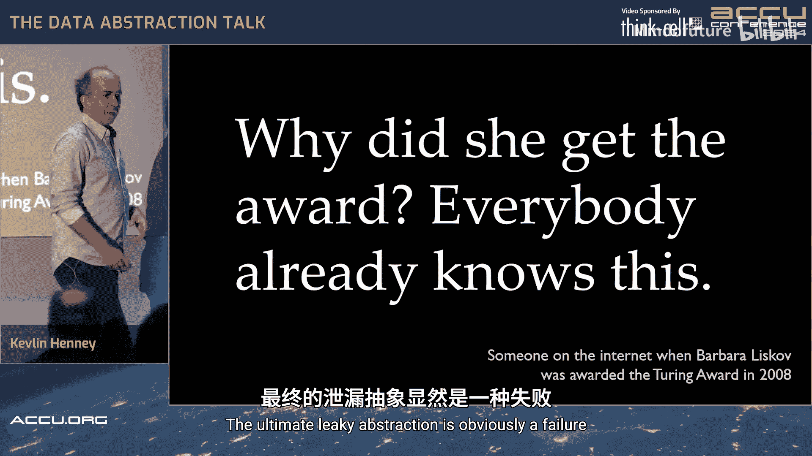

David Musser 和 Alexander Stepanov 在1987年关于Ada泛型算法的论文中指出：“众所周知，数据抽象对于良好的软件工程实践至关重要。” Barbara Liskov 因其在数据抽象和编程语言设计方面的贡献获得了2008年图灵奖，她的工作如此成功，以至于后来的学生认为这些概念理所当然，而不知道它们被提出之前的样子。

软件本质上是一系列精心构建的**幻觉**。我们通过代码创造有用的模型和视图。当这些抽象成功时，它们是不可见的；只有当它们失败时（例如，程序崩溃并显示底层错误信息），我们才会注意到其背后的具体实现细节。这种“抽象泄漏”揭示了系统的内部结构。

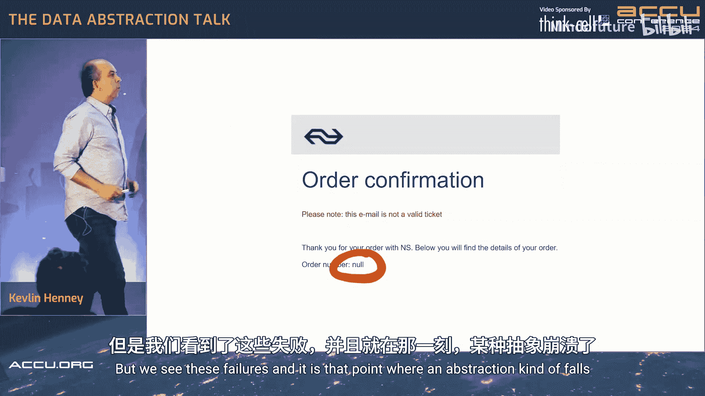

## 抽象的本质与方向

上一节我们提到了抽象作为“幻觉”的概念。本节中，我们来深入探讨抽象的本质和我们描述它时的固有偏见。

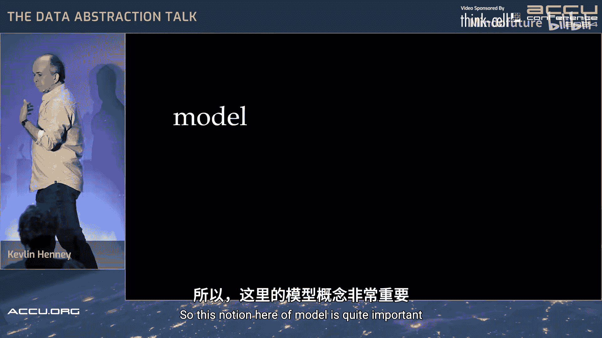

根据《牛津英语词典》，**抽象**（abstraction）是“抽离出某物概念的结果，该物没有独立存在，只存在于观念中”。动词“抽象”（to abstract）字面意思是“移除”，源自拉丁语“abstrahere”，意为“抽离”。

在软件开发中，我们习惯于谈论“高层次”和“低层次”抽象。我们通常认为接近机器细节（如汇编代码）是“低层次”，而接近问题领域（如“信用卡号”）是“高层次”。然而，这种观点带有**开发者偏见**。对于领域专家（用户）而言，用他们熟悉的术语（如“信用卡号”）交谈，他们并不觉得抽象；相反，当我们谈论代码和实现细节时，他们才会觉得“非常抽象”。因此，重要的是认识到我们谈论的是**相对于解决方案领域（机器）的抽象**，而用户则从问题领域来看待它。

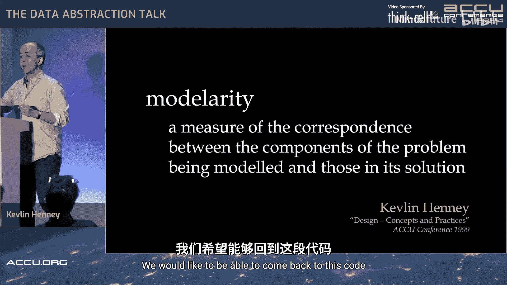

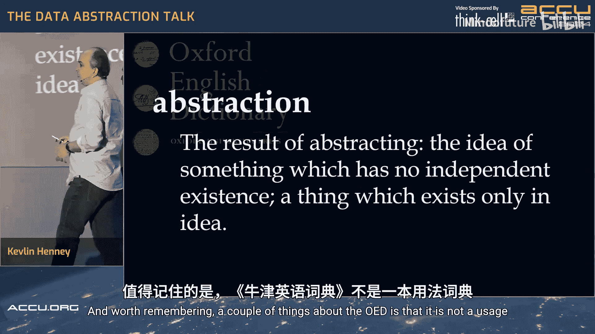

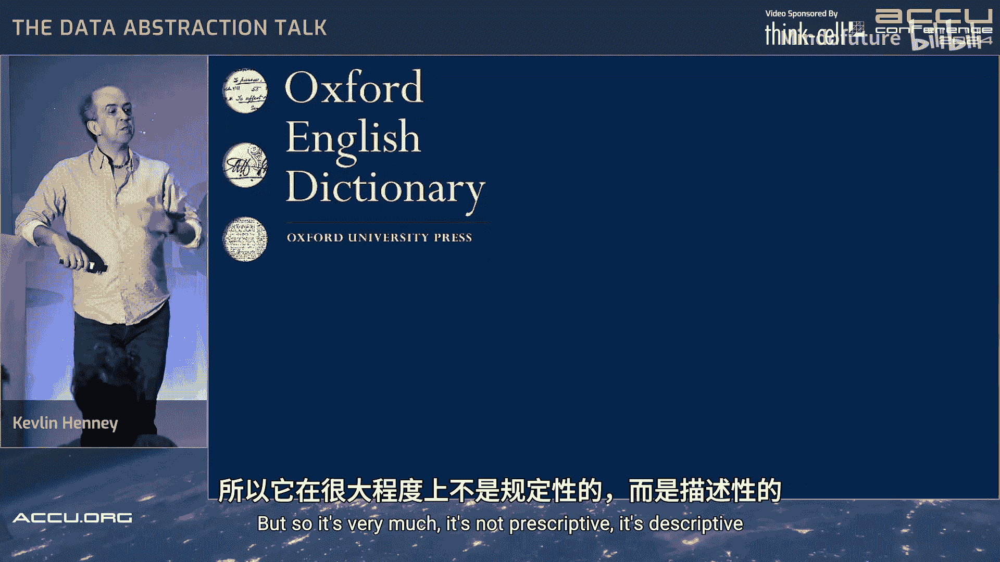

## 领域建模与“强类型字符串”问题

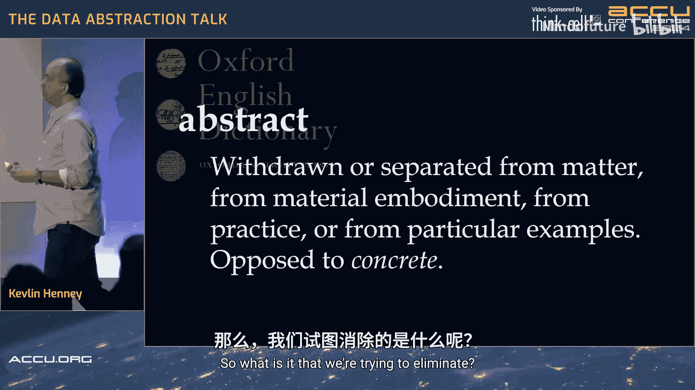

理解了抽象的方向后，我们来看看一个常见的反面模式：“强类型字符串”（Stringly Typed）系统。

以下是开发中常见的一个问题：我们经常用基本类型（如字符串）来表示领域概念，但这会带来麻烦。

例如，处理信用卡号时，许多开发者会直接使用字符串（`string`）或尝试用大整数（`long`）来存储。但这存在几个问题：
1.  **信用卡号不是数字**：它不支持算术运算，并且可以有前导零。
2.  **信用卡号也不仅仅是字符串**：它有一系列业务规则（如长度8-19位、发卡行标识、校验码等）。

如果我们简单使用 `string`，这些约束就会散布在代码各处，无法集中表达和维护。这导致了“强类型字符串”系统——即用字符串承载一切，但缺乏对数据含义和约束的明确表达。

解决方案是创建**领域值对象**。这个概念在 Ward Cunningham 的“整体值”（Whole Value）模式（1990年代）和 Eric Evans 的“领域驱动设计”（2003年）中都有阐述。其核心思想是：**创建专门的对象来表示领域中有意义的量，并封装其所有相关行为和约束**。

对于信用卡号，我们应该定义一个 `PaymentCardNumber` 类。这个类：
*   **封装内部表示**：可以用 `string`、`long` 或任何优化后的结构存储。
*   **暴露清晰的接口**：提供验证、获取发卡行信息、格式化输出等方法。
*   **隐藏实现细节**：外部代码无法直接操作内部数据，只能通过定义好的接口交互。

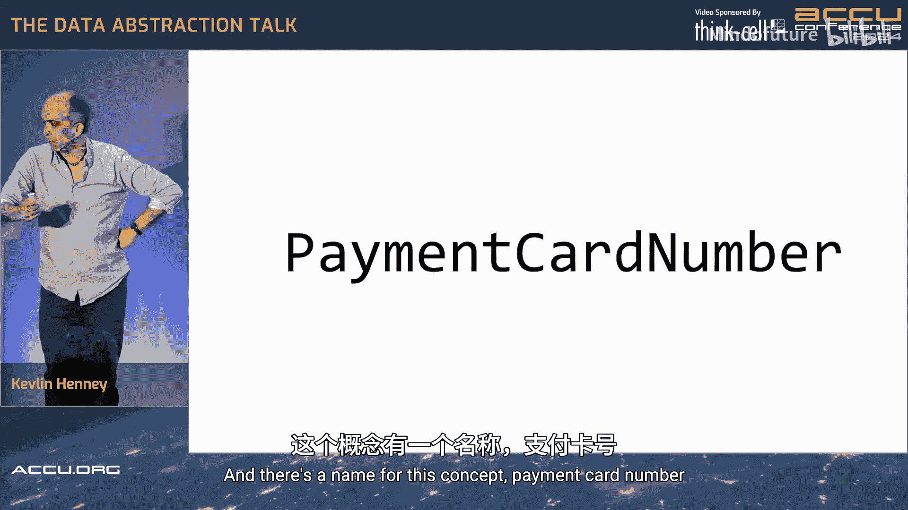

这样，我们就把“信用卡号”这个概念提升为代码中的一等公民，提高了代码的表达力和可维护性。

## 封装、接口与实现分离

上一节我们强调了为领域概念创建专门类型的重要性。本节中，我们来看看支撑这一实践的更基础原则：封装与接口分离。

**封装**的字面意思是“装入胶囊”，即创建一个有明确边界的东西，内部和外部被隔开。在软件中，封装意味着将数据和对数据的操作捆绑在一起，并隐藏内部实现细节。

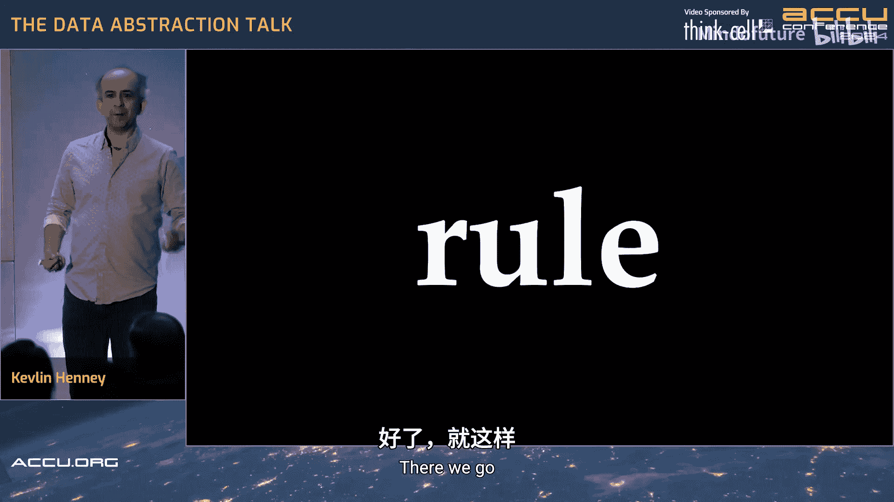

**接口**是模块对外提供的契约，定义了如何使用它。Butler Lampson 在1983年指出：“接口是提供一定数量服务的契约。” 客户端代码依赖于这个契约。

一个关键的设计原则是：**针对接口编程，而非针对实现编程**（出自《设计模式》）。这意味着客户端代码应该只依赖模块公开的稳定接口，而不应该依赖其易变的内部实现细节。

让我们通过一个栈（Stack）的例子来说明。以下是一个初始的Python实现，它暴露了内部实现：

```python
class Stack:
    def __init__(self):
        self.items = []  # 公共属性！这是一个问题。

    def push(self, item):
        self.items.append(item)

    def pop(self):
        if not self.is_empty():
            return self.items.pop()

    def depth(self):
        return len(self.items)

    def top(self):
        if not self.is_empty():
            return self.items[-1]

    def is_empty(self):
        return len(self.items) == 0
```

这里的问题是 `self.items` 是公共的。其他代码可以直接操作这个列表，例如清空它（`stack.items = []`）或直接修改其内容。这破坏了栈的抽象。更隐蔽的是，如果我们将内部实现从列表（在尾部追加）改为在头部插入，所有依赖 `items[-1]` 来获取栈顶的客户端代码都会在语义上出错，尽管语法上可能不会报错。

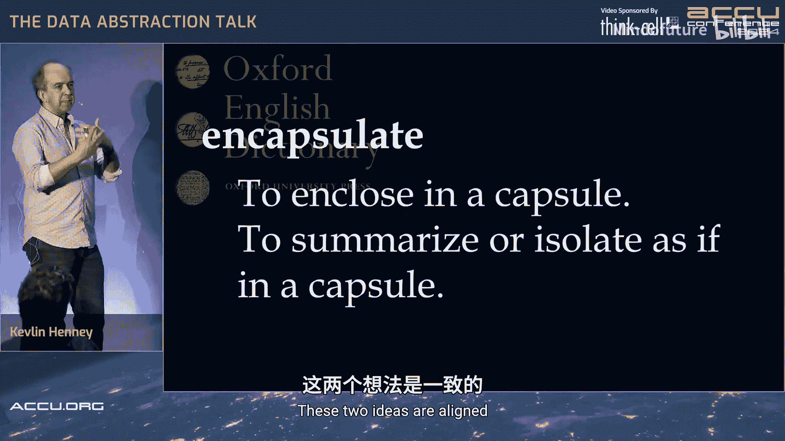

正确的做法是隐藏内部表示：

```python
class Stack:
    def __init__(self):
        self.__items = []  # 使用双下划线进行名称修饰，使其成为“私有”成员。

    def push(self, item):
        self.__items.append(item)
    # ... 其他方法操作 self.__items ...
```

在C++或C#等语言中，我们使用 `private` 访问修饰符来达到同样的目的。封装允许我们自由更改实现（例如，将底层容器从 `vector` 改为 `deque` 或链表），而不会影响依赖于公共接口的客户端代码。这是**模块化**的核心好处：减少变更带来的连锁反应。

## 不变性与契约

上一节我们讨论了通过封装来保护内部状态。本节中，我们来看看如何利用**不变性**来定义和维持数据抽象的**契约**。

**不变性**是指某物不发生变化。在软件设计中，它通常指一个对象在创建后其状态就不能再改变（不可变对象），或者指一个在对象生命周期内必须始终为真的条件（类不变式）。

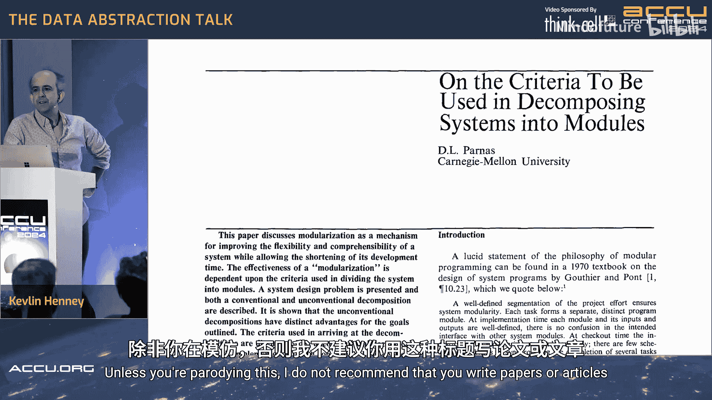

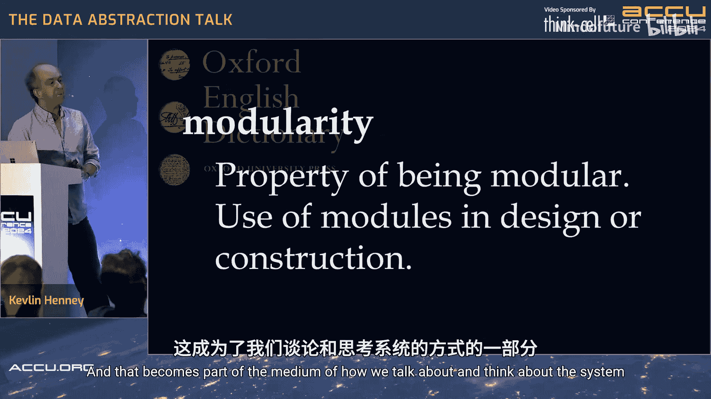

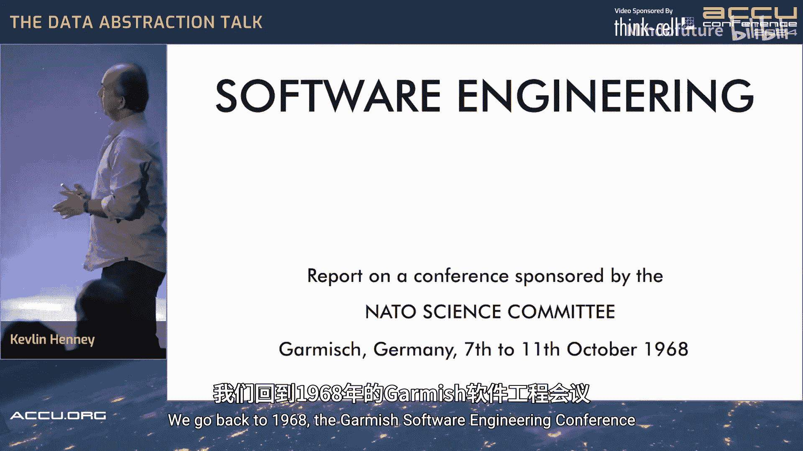

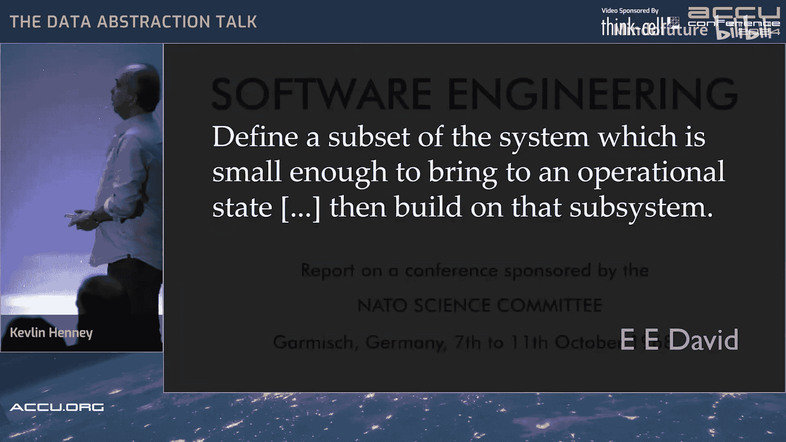

**类不变式**是数据抽象契约的一部分。例如，对于我们的 `Stack` 类，一个不变式可能是：“栈中存储的元素不能为 `null`”。如果我们允许客户端代码直接操作内部数组，这个不变式就无法保证。通过封装，并在 `push` 等方法中加入验证逻辑，我们就能在公共接口的边界上强制执行这些规则。

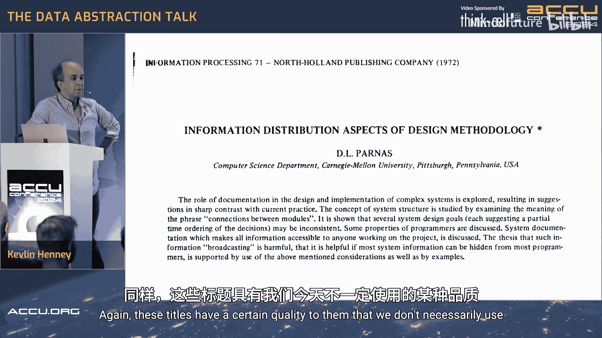

考虑一个C#的栈，我们试图维护“无空元素”不变式：

```csharp
public class Stack<T>
{
    private List<T> _items = new List<T>();

    public void Push(T item)
    {
        if (item == null) throw new ArgumentNullException(nameof(item));
        _items.Add(item);
    }

    // 假设我们提供了一个公共的Items属性用于只读访问
    public IReadOnlyList<T> Items => _items.AsReadOnly();

    // 一个检查不变式的方法（可用于调试或测试）
    private bool InvariantHold()
    {
        return _items.All(item => item != null);
    }
}
```

通过将 `_items` 设为私有，并只提供一个只读的视图 (`IReadOnlyList<T>`)，我们防止了外部代码直接插入 `null`，从而维护了不变式。如果我们错误地将 `_items` 本身公开为公共属性或公共字段，不变式就会被破坏。

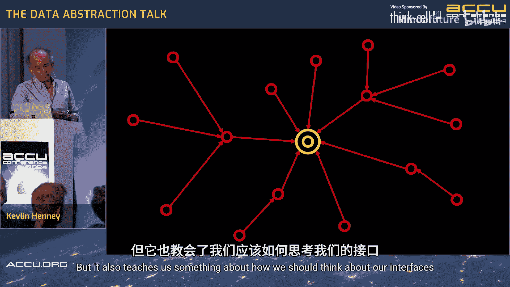

**数据抽象的目的不是模糊，而是创建一个新的语义层次，在这个层次上我们可以绝对精确。** 不变式就是这个精确语义的核心部分。

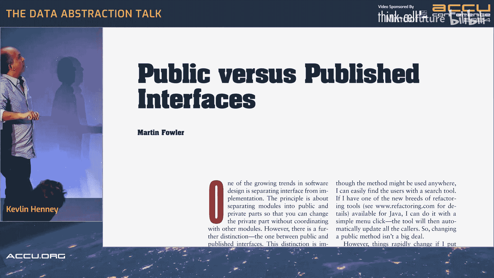

## 模块化与信息隐藏

我们一直在讨论封装和接口，这些概念都源于一个更宏大的思想：**模块化**。本节中，我们来追溯模块化和信息隐藏的历史。

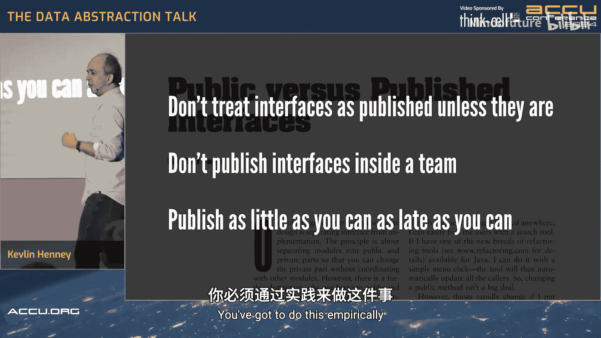

David Parnas 在1972年的经典论文《将系统分解为模块的准则》中，奠定了现代模块化思想的基础。他提出了**信息隐藏**原则：每个模块的特征在于它隐藏了一个设计决策，该决策对其他所有模块保密。其接口或定义被选择为尽可能少地透露其内部工作原理。

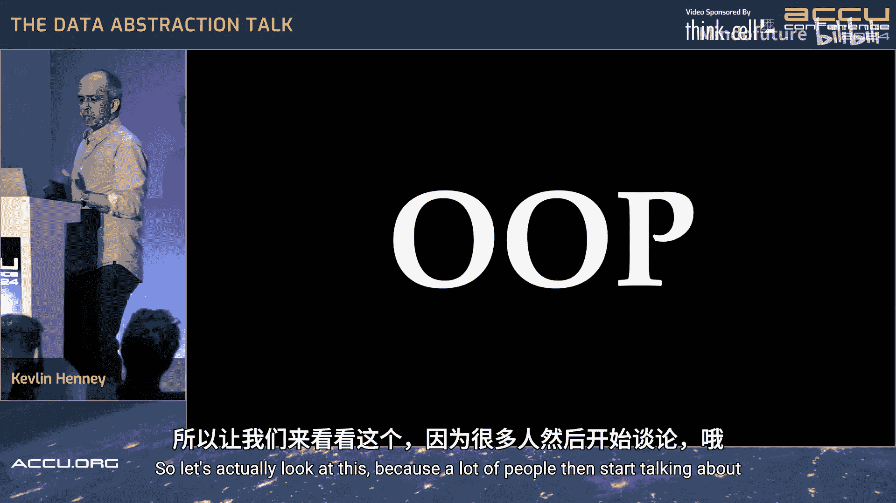

模块化的预期好处包括：
*   **缩短开发时间**：不同小组可以在不同模块上工作，只需少量沟通。
*   **提高产品灵活性**：可以对一个模块进行重大更改，而无需更改其他模块。
*   **增强可理解性**：可以一次只研究系统的一个模块。

Parnas 还指出，模块之间的连接是它们彼此做出的**假设**。这些假设不仅仅是显式的导入/包含依赖，还包括隐式的约定，例如线程安全假设、性能特征假设等。良好的模块化通过明确的接口来减少和固化这些假设，使系统更易于推理。

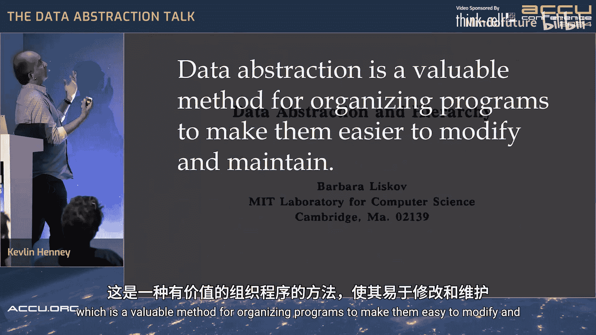

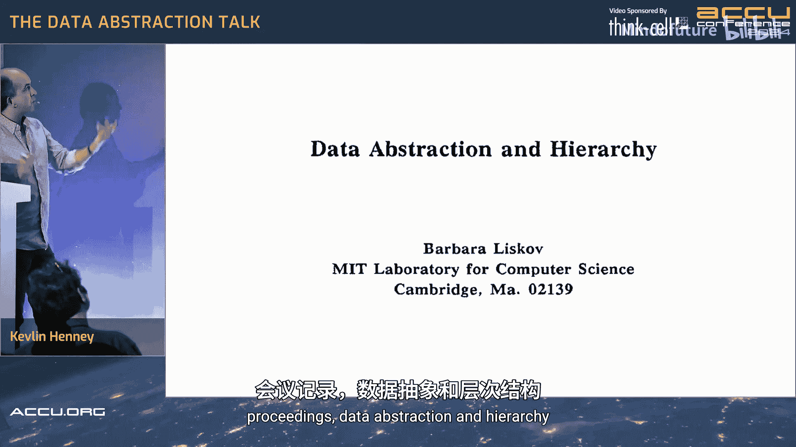

## 数据抽象与面向对象编程的关系

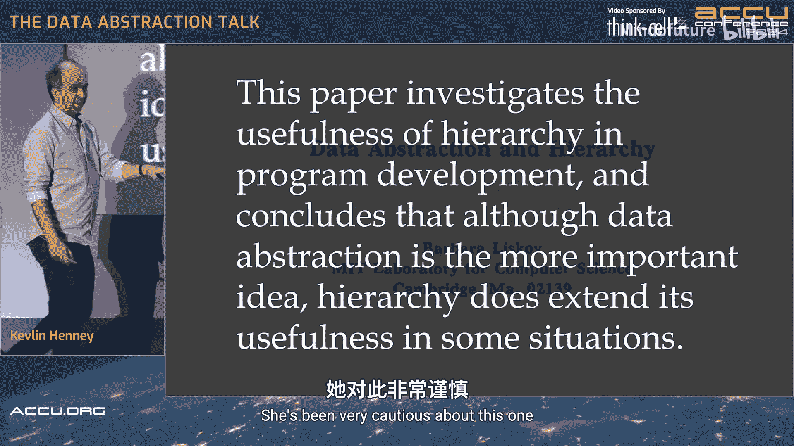

在讨论了模块化之后，一个常见的问题浮现出来：数据抽象和面向对象编程（OOP）是一回事吗？本节中我们来澄清这一点。

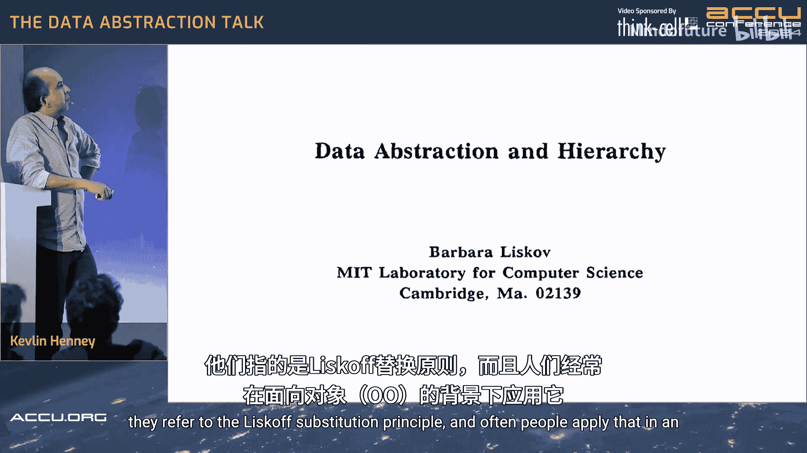

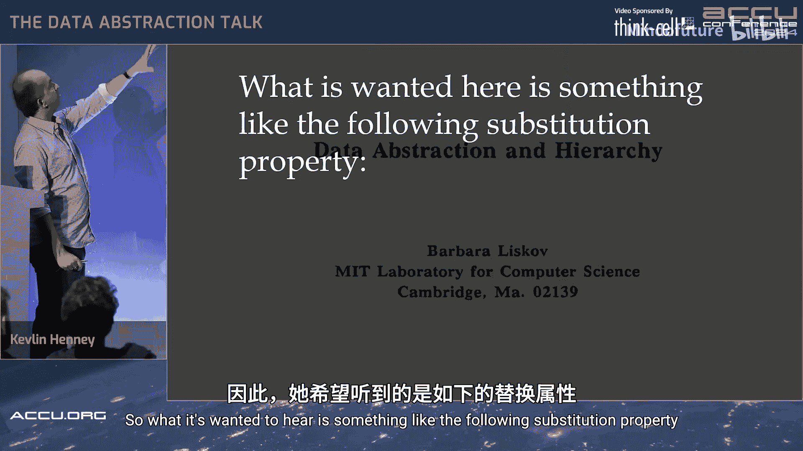

**不，它们不是一回事。** 数据抽象是一种更基础、更广泛适用的思想。

面向对象编程通常包含三个主要概念：封装、继承和多态。其中，**封装**（即数据抽象）是基础。然而，许多被称为“面向对象”的代码实际上只包含了“贫血”的数据对象（只有getter和setter）和庞大的“管理器”类，这恰恰是糟糕的数据抽象。

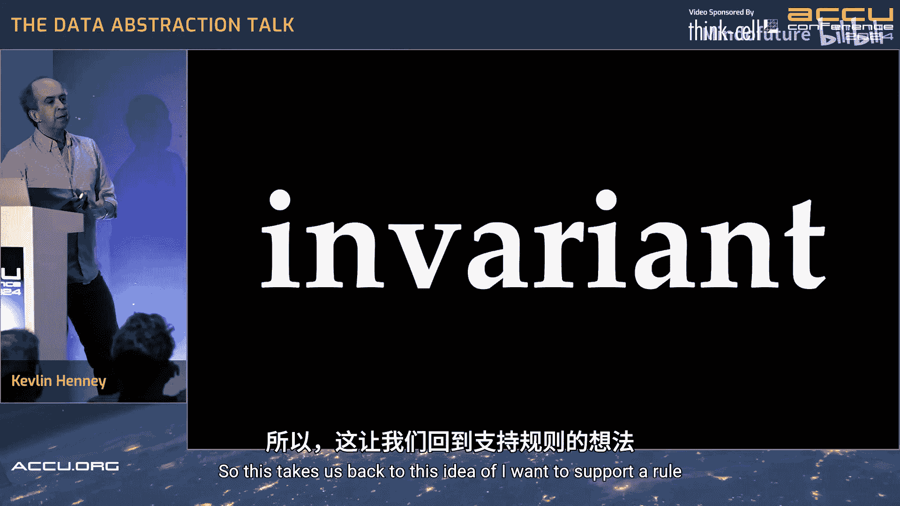

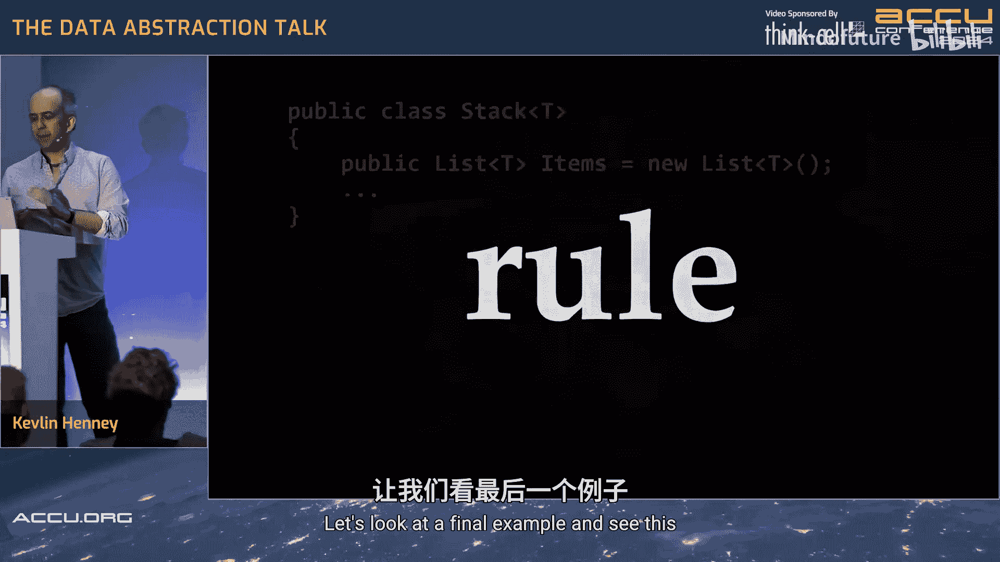

正如 Abadi 和 Cardelli 在《对象理论》中所言：“面向对象编程并不独占我们描述的所有这些优良特性……程序的弹性同样可以通过围绕抽象数据类型组织程序来实现，独立于分类学。” 这里的关键是，**抽象数据类型**是实现弹性的核心。

Barbara Liskov 在她1987年的著名论文《数据抽象与层次结构》中也指出：“尽管数据抽象是更重要的思想，但层次结构确实在某些情况下扩展了它的有用性。” 她所说的层次结构主要指继承。她的观点是，**数据抽象（通过抽象数据类型）比继承更重要、更基础**。

面向对象编程中的**继承**（特别是实现继承）只是实现代码复用和建立类型关系的一种机制，而**数据抽象**是关于如何组织数据和行为的根本方法，它适用于函数式编程、过程式编程等多种范式。

## 实践总结与核心思想

在本节课中，我们一起学习了数据抽象的核心思想。让我们回顾并总结关键点：

1.  **数据抽象是构建健壮软件的基石**：它通过创建定义良好的接口来隐藏实现细节，允许我们构建易于理解、修改和维护的系统。
2.  **创建领域值对象**：不要用原始类型（如 `string`, `int`）表示领域概念。应创建专门的类型（如 `PaymentCardNumber`, `EmailAddress`）来封装数据和相关行为。
3.  **封装与信息隐藏**：将数据和操作捆绑在一起，并严格限制对内部状态的访问。使用语言的访问控制机制（如 `private`, `protected`, Python的双下划线）。
4.  **针对接口编程**：客户端代码应依赖于稳定的抽象接口，而不是易变的具体实现。这降低了耦合度。
5.  **定义并维护不变式**：明确你的数据对象必须遵守的规则（契约），并在接口边界上强制执行它们。
6.  **区分公开接口与已发布接口**：在团队内部，可以保持接口的灵活性以便重构。只有对那些你承诺长期稳定支持的、对外部团队或系统暴露的接口，才将其视为“已发布”接口并谨慎对待。
7.  **数据抽象独立于范式**：它是比面向对象更基础的概念，在函数式、过程式等编程风格中同样重要。

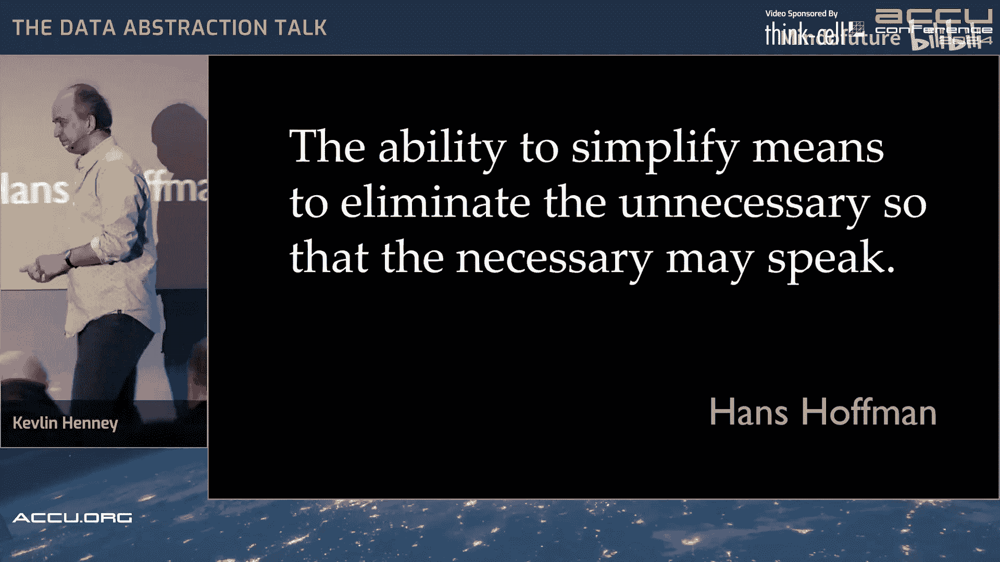


最后，引用艺术家 Hans Hoffman 的话：“简化的能力意味着消除不必要的东西，以便必要的东西可以发声。” 数据抽象正是我们用来分离关注点、消除不必要的实现细节、让领域逻辑清晰发声的核心工具。它不是银弹，但它是我们应对软件复杂性的最强大工具之一。