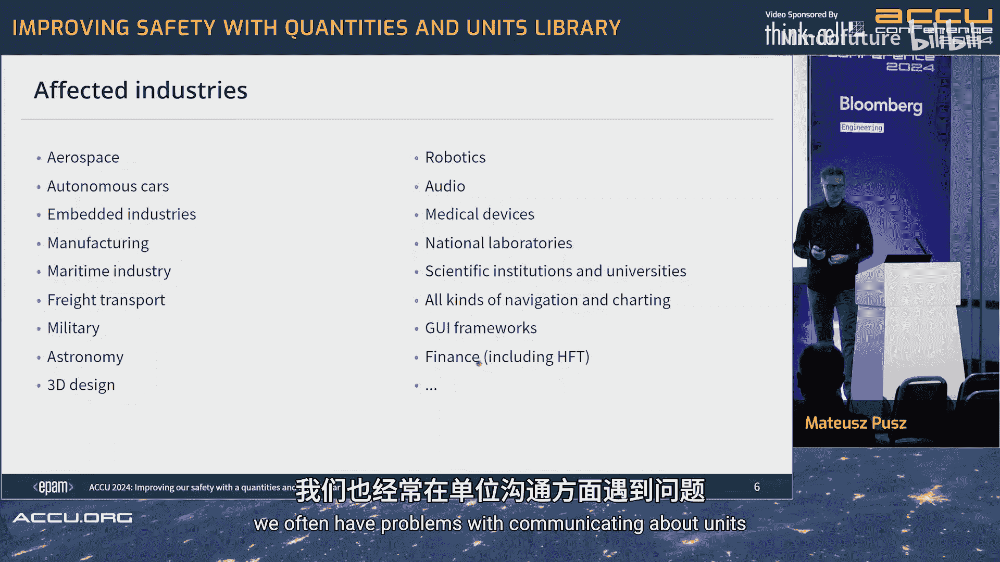
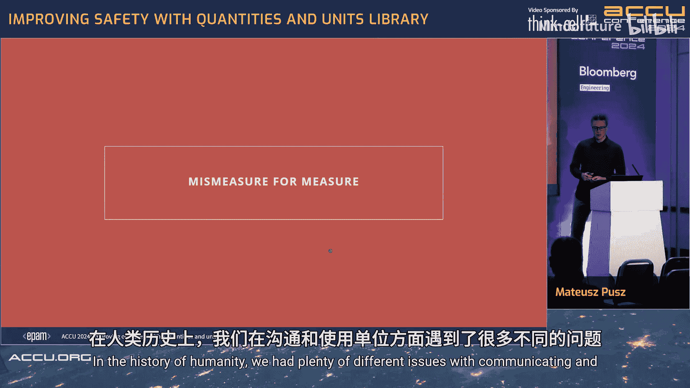
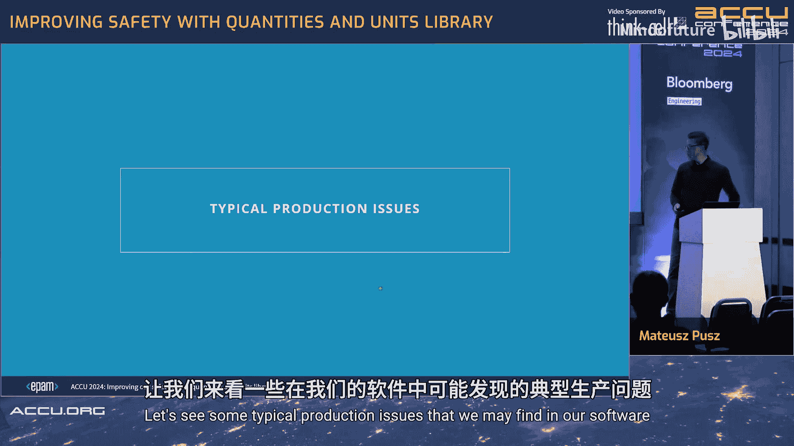
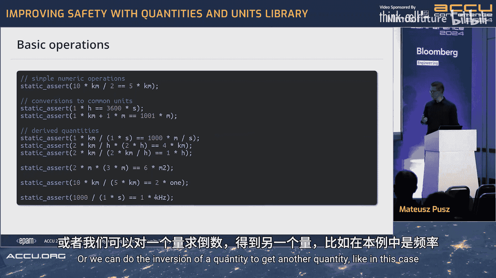
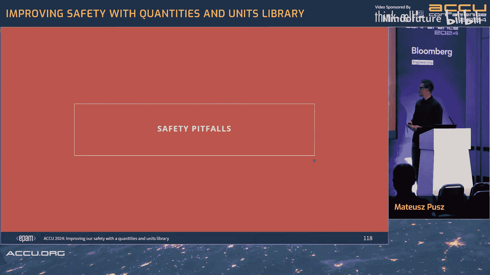
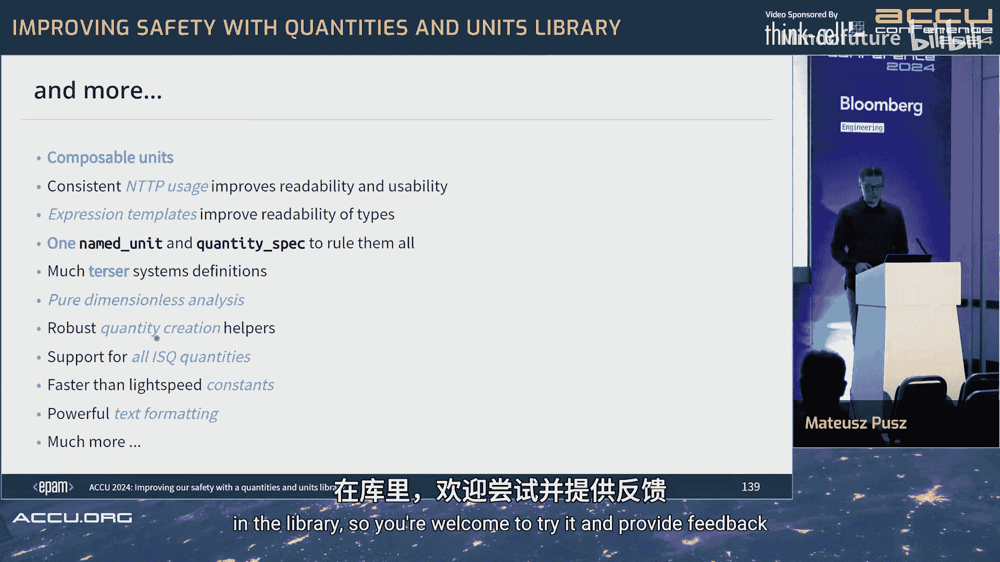

# 032：提升C++代码安全性

## 概述

在本教程中，我们将学习如何使用现代C++物理量和单位库来显著提升代码的安全性。我们将探讨为何类型安全在工程和编程中至关重要，并通过具体的历史案例和代码示例，展示如何利用库的特性来避免常见的单位混淆和计算错误。

---

## 第1.1节：安全性的重要性

在当今时代，软件安全性是一个至关重要的方面。特别是当一些观点认为C++并非一种安全的语言时，我们更需要展示C++如何能够实现比其他语言更高的安全性。

上一节我们提到了安全性的宏观背景，本节中我们来看看一个具体的工具——物理量和单位库，如何帮助我们提升软件乃至日常生活的安全性。

---

## 第1.2节：现实世界对机器的依赖

自动驾驶汽车曾经是科幻电影中遥远未来的事物。然而，这个“遥远的未来”正在我们的道路上成为现实。当自动驾驶汽车载着我们前往目的地时，我们希望能够在途中休息、工作或睡眠，信任机器能完成它的工作。

不仅仅是自动驾驶汽车，在我们的日常生活中，我们越来越依赖机器。我们拥有手术机器人、飞机、火箭以及许多其他让生活更便利的设备。但如果这些设备编程不当，它们也可能让生活变得不安全。在不久的将来，我们将依赖更多这样的设备。

---

## 第1.3节：C++社区的安全关切

C++的安全性近年来一直是C++社区关注的主要问题。我们讨论了潜在的低层基础类型改进，例如安全整数类型，以检测溢出和截断等问题。我们也希望更新一些核心语言规则，使其更安全。

此外，我们还可以通过库来提供更安全的高层结构。本教程讨论的库就是这样一个例子。

C++开发者在这方面需要帮助。这不仅关乎培训，因为我们的行业缺乏大量培训来让工程师成长，而且安全领域是C++编程中的一个特殊领域，拥有相关经验的人并不多，而这种经验很难获得。

---

## 第1.4节：受影响的行业

以下是受此类库影响的众多行业：

*   自动驾驶汽车
*   航空航天
*   嵌入式系统
*   制造业
*   海事
*   军事
*   天文学
*   图形用户界面设计
*   音频处理
*   金融（包括高频交易）

这并非小众领域，实际上非常普遍且需求巨大。

---

## 第1.5节：单位问题的历史案例

使用C++在许多情况下确实很困难，但单位和量纲问题本身就是一个固有的复杂问题。即使在日常生活中，不涉及编程时，我们也经常在单位沟通上遇到问题。

在人类历史上，我们曾遇到过许多与单位使用和沟通相关的问题。

以下是历史上一些著名的单位错误案例：

*   **克里斯托弗·哥伦布（1492年）**：在前往日本和印度的航行中意外发现了美洲。他幸存下来是因为他犯了几个错误。他使用了不同的“英里”长度进行计算，因此认为世界要小得多。当他到达巴哈马时，他以为已经到了日本或印度。
*   **瓦萨号战舰（1628年）**：在处女航中航行不到一英里就沉没了，导致30名水手不幸身亡。原因是船体一侧比另一侧厚。据称，这是因为两个不同的团队在两侧工作，一个团队使用以瑞典英尺（12英寸）校准的尺子，另一个团队使用较短的阿姆斯特丹英尺。
*   **加拿大航空143号航班（1983年）**：在12,000米高空耗尽燃油。原因是燃油是以磅为单位计算的，而不是公斤，导致燃油不足以抵达机场。幸运的是，飞机滑翔到最近的机场并成功迫降，无人死亡。
*   **英国摇滚乐队黑色安息日（1983年）**：在“生而疯狂”巡演中，订购了巨石阵的复制品作为舞台道具。不幸的是，经理在提交订单时，将尺寸单位从英尺误写为米。结果，他们建造了巨大的复制品，成本高昂，且几乎无法放入任何演出场馆。
*   **大韩航空货运6316号航班（1999年）**：因副机长和机长之间的沟通失误而坠毁。副机长将1500米误读为1500英尺，并命令下降。机长服从了命令。机上三名机组人员和地面上五名无辜者全部遇难。
*   **火星气候轨道器（1999年）**：可能是工程史上最著名的事故。它未能进入火星轨道，在进入大气层时坠毁。原因是美国国家航空航天局使用国际单位制，而洛克希德·马丁公司使用美制单位，他们在太空探测器的不同模块接口之间没有良好沟通。
*   **乌龟克拉伦斯（2001年）**：从一个动物园转移到另一个动物园。月亮公园学院动物园的工作人员根据从来源地通过电话获得的信息为它建造了围栏，信息称乌龟重“250”。结果发现是250公斤，而不是磅。因此，克拉伦斯在第一个晚上就破坏了整个围栏，第二天早上被发现正在花园里吃蔬菜。
*   **迪士尼乐园太空山过山车（2003年）**：因车轴断裂而延迟。断裂是由于将轴承规格从英制单位转换为公制单位时产生混淆造成的。
*   **瑞士与德国之间的莱茵河大桥**：由两个不同的团队从两岸开始建造，预计在河中央汇合。不幸的是，瑞士和德国使用不同的海拔基准面：德国使用北海海平面，而瑞士使用地中海海平面，两者相差27厘米。但实际上，由于其中一个团队在计算时犯了符号错误（本应减去该值却加了该值），导致差异完全不同。
*   **一家美国公司向日本客户销售野生大米**：报价为每磅39美分，而客户认为是每公斤39美分，导致交易过程中需要解决问题。
*   **《卫报》文章（2023年10月17日）**：称马拉维遭遇了“比平均气温高出近68华氏度”的极端高温。实际的温升仅为52华氏度。原因是他们在转换数据时，误用了差异和点值，在将原本为欧洲市场准备的标题转换到美国市场时使用了不正确的计算。

此外，还有许多有记录的医疗剂量错误，因为医疗剂量和单位非常奇怪且难以沟通。

**以上所有问题的根源都不是C++**。C++只是增加了另一层，使这个问题更加复杂。

---

## 第1.6节：典型的生产代码问题

让我们看一些在软件中可能发现的典型生产问题。

这是一段我曾贡献过的开源软件的代码。其Windows接口非常令人担忧，这实际上促使我开始研究物理量库。

如你所见，`double` 类型被到处使用。很难记住参数的数量，也很难通过改变参数顺序或在中途添加新参数来重构这个函数。基本上，维护这样的软件极其困难。

另一个函数充满了魔数。我不敢碰它，没人知道它是做什么的。

这类软件使用大量宏来进行单位转换。当然，并非所有转换都定义了，因此你必须分步进行，这是软件的另一个低效之处。但事实证明，即使采用这种方法，仍然可能出错。当我在同一个代码库中查找相同的宏时，我发现了至少四种不同的结果。

这是一个头文件，这些函数彼此相邻。我们有 `distanceSphLatLon` 和 `distanceLatLon`。为了保持一致，或者“一致地不一致”，同样的情况也适用于这里的 `distanceAndBearing`。

如果接口是这样，如何使其正确工作？如何操作软件？如何重构？你可能会认为这只是糟糕的开源软件，没有任何标准和规则。

我从事这项工作七年了，当我开始谈论这个问题时，很多人联系我说：“我不能分享我的源代码，但我们生产环境中的源代码比你演示的还要糟糕得多。” 我猜你在这里是因为你已经对此有所了解。这就是为什么我们想要改进。

---

## 第1.7节：MP Units 库的目标

大约七年前，我开始编写MP Units库，并且它已被提议进行标准化。当然，标准化并非该库的最终目标，但如果可能，将其纳入标准会很好。

首先，我们希望通过正确处理物理量、单位和数值，在编译时提供安全性，并且性能必须与使用基本类型（如 `double`）一样快甚至更快。不应该有运行时开销和空间大小开销。

C++是一门很棒的语言，可能是唯一允许以我们这种方式实现该库所有功能的语言。

通常，我们的用户不是C++专家工程师，他们只是将其作为完成工作的工具。他们不理解复杂的模板错误信息。我们希望提供尽可能易于阅读和使用的东西，同时也易于扩展，因为用户需要根据自己的需求进行扩展。

我们应该能够提供任何单位量级，无论是巨大的还是微小的浮点数。我们应该对量制、单位制、仿射空间抽象进行建模。当然，我们还应该提供文本输出以进行调试和打印。

我们希望支持标量、矢量和张量。有些用户希望将其与自然单位一起使用，如果你了解这个领域，就知道这相当棘手。当然，它应该易于扩展。

目前，MP Units库在两大主流编译器（GCC和Clang）上兼容C++20。Apple Clang也以某种方式支持，因为它总是比Clang晚一个版本。不幸的是，MSVC完全不支持编译。我尝试修复，但MSVC编译器在C++20支持方面存在太多问题。希望MSVC能尽快赶上，但目前我不得不处理GCC和Clang。

除了C++20，我们尝试从语言的最新扩展中获益，以提供未来可能标准化所需的最佳API。目前，我们考虑的是C++29。因此，它不应局限于C++20，因为到那时C++20已经过时了。我们应该尽可能利用最新特性，为用户提供最佳体验。这就是为什么我们也受益于C++20的 `std::format` 和 `std::chrono`，以及C++23的附加抽象，如果可能，还会使用C++26的抽象来改进库。C++26有一些非常好的特性可以改进这个库。但我们始终尝试与C++20兼容。所有新特性都带有通过编译预处理宏提供的工作区，以便能够与C++20兼容工作。所以不用担心，C++20将在较长时间内足够支持该库。只有当你拥有更好的、更新的编译器时，你才能从简化的接口或可能更快的编译时间中受益。

该库可在GitHub和Conan上找到，你也可以在Compiler Explorer上找到它。

关于标准化，我大约在四五年前（至少在五年前）提交了这份论文。当时我分析了市场现状，并询问委员会我们是否想走这条路。答案是肯定的，于是我开始了标准化工作。不幸的是，COVID-19在中期发生，一切都放缓了。但还有更多的准备工作在进行中。在C++29周期，我提供了物理量的动机、范围和计划。在C++30/31周期，我详细描述了设计和所有方面。

还有一些相关的提案，是该库的依赖项。我们也希望拥有数字概念库，这将允许我们为接口提供更好的约束。我实现了基本的固定字符串，并提交了一份论文，这将使我们拥有一种标准化的方式将文本传递给模板的NTTP参数。此外，我们还可以从编译时质数中受益。似乎ISO委员会和C++社区都对将其标准化有很高的兴趣。

标准化的重要方面首先是安全性，其次，标准化很重要，因为这关乎所谓的“词汇类型”。词汇类型是用于在不同供应商接口之间进行通信的类型。这正是我们这里讨论的情况。以火星气候轨道器为例，美国国家航空航天局和洛克希德·马丁公司应该有一种共同的语言来沟通他们的接口。否则，我们将一直犯这样的错误。

---

## 第1.8节：领域基础概念介绍

在深入C++代码接口之前，让我们先谈谈这个领域本身。我们来做一些简单的介绍。

我们有一个**量制**。量制是几个**单位制**的基础。这是该库与市场上所有其他库略有不同的地方，因为大多数库只关注一个或多个单位制，但没有一个库尝试正确地将量作为正交维度进行建模。但官方定义就是如此。

一个**量制**是一组量以及一组将这些量联系在一起的方程。我们有一个由ISO提供的大型量制，它基于七个基本量，你可能已经知道，我将在下一屏展示。

一个**单位制**是一组基本单位和导出单位以及词头，基于给定的量制。因此，单位制总是基于量制，而由国际计量大会提供的国际单位制基于国际量制，并在其文档中正式声明。

这些是该领域涉及的主要实体。

**量纲**可以是基本量纲或导出量的量纲。在国际量制中有七个基本量：长度、质量、时间、电流、热力学温度、物质的量和发光强度。每个都有唯一的符号。我们也可以讨论导出量的量纲，例如，力表示为 `L M T^-2`。但请注意，力本身没有关联的符号。它没有独立的“力的量纲”。力具有基于基本量纲乘积的导出量纲。但它本身不是导出量纲。大多数市场开发者错误地定义了诸如“速度量纲”之类的东西，但实际上在理论和领域中并没有这样的东西。因为速度或力的量纲只是基本量纲的乘积，而不是独立的事物。

事实证明，仅靠量纲不足以描述一个量。存在不同量纲的量，如长度、时间、速度、功率。但也存在**量纲相同但种类不同**的量。例如功与力矩，频率与放射性活度，甚至面积与燃油消耗量。燃油消耗量是升每公里。升是体积。如果将体积除以长度，得到面积。但我不希望将足球场的面积与我的汽车燃油消耗量相加，这很荒谬。至少在某些领域中不允许这样的计算，因为也许你有一个领域，这并不重要。

同样，可能存在**量纲和种类都相同但仍截然不同**的量。半径和高度是不同的量，势能、动能和热力学能也是如此。有时你不想在接口中混合这些。

国际标准文档指出，存在称为“量参考”的东西，量参考可以是一个单位。这是一个奇怪的术语，尤其是在C++中，它已经相当重载。所以我不知道这个术语是否会保留，但我们目前至少尝试与官方规范兼容，并说在这种情况下，单位基本上是由官方指定的名称和符号。

国际单位制为所有国际量制量纲提供了基本单位。我们也有一些导出单位，它们可能在不同量之间共享，例如热容和熵都使用焦耳每开尔文。但事实证明，有些量即使意义完全相同，也有其专用的单位。例如，每秒是一个单位，但在许多领域中，如果涉及频率，则应使用赫兹；如果涉及放射性核素的活度，则应使用贝克勒尔。尽管两者在技术上都是“每秒”。你不应该说活度以赫兹为单位，或频率以贝克勒尔为单位，因为这是不正确的。

此外，量差是一种可测量的过程或参考材料，但这不在C++的覆盖范围内。根据定义，量就是数字和参考。这些数字可以是标量、矢量或张量。这在涉及线性库使用时也很重要。你希望也能处理这些用例，而目前市场上没有C++库能做到。在C++行业中，据我所知，唯一能做到的是Python中的Pint库，因为它基于NumPy。

我们在库中进行的基本操作当然是简单的算术运算，如除以或乘以标量。我们当然可以在转换过程中转换一些单位并找到一些共同单位，这是 `std::chrono` 所做的。但该库带来的新功能是将不同的量相除或相乘，从而得到新的量，例如速度乘以时间得到长度，等等。我们也可以将相同的量相乘得到另一个量，如面积；可以将两个量相除得到一个无量纲量；或者可以对一个量求逆得到另一个量，例如在这种情况下得到频率。

---

## 第1.9节：代码示例对比

那么，让我们看看在实践中使用物理量库的代码是什么样子。

这是没有使用任何库的遗留代码。这里重要的是，每个标识符都跟踪了所使用的单位。如果你现在没有使用这个，可能很难理解或维护你的代码。我们有以米为单位的距离，以英里每小时为单位的速度。然后你提供了一些比率来进行转换。实际上，我认为这里是以米每小时为单位，而那里是英里每小时。甚至很难弄清楚这些后缀是什么意思。为了得到结果，你可能需要提供魔数。但我们不喜欢魔数，这就是为什么在库中，我们通常提供一些转换宏，就像你已经看到的那样。如果有人认为宏是错误的，那么人们会提供漂亮的转换因子。是的，我很好，我使用概念。

在许多情况下，使用单位库时，你不必在参数或变量名称中拼写任何单位，因为这已嵌入到类型中。在这种情况下，我们使用CTAD（类模板参数推导）来避免拼写，因为它总是根据右侧初始化器推导出正确的类型。我只对这里的抽象感兴趣，并说我在这里处理的是量。这总是比使用 `auto` 更好。使用 `quantity`，你知道你在处理什么；有时你可能会感到困惑，但 `quantity` 足以表达，你不必拼写整个类型。你在这里使用米、英里每小时，并且可以轻松地取值（以秒为单位）并得到结果，而不需要像这里那样的中间值。在两种情况下你得到完全相同的结果。不需要跟踪单位。库本身知道所有转换因子，你不需要提供任何魔数、宏、常量或比率。用户不需要这些，因为库会在需要时为你完成所有这些步骤。

这样一个库的主要目标是生成错误。如果你的软件不会犯任何错误，就不需要这个库。如果你完美无瑕，为什么要费心使用强类型而不仅仅是 `double` 呢？所以，如果我在计算中犯了错误，比如在两种情况下都做乘法，这段代码将愉快地提供结果，无论它意味着什么。如果你使用安全的库，你会得到一个编译错误，提示“没有名为 `to` 的魔术成员函数”或“约束不满足，因为秒的单位不是长度的平方除以时间的单位”。

你也可以使用这些接口提供函数。如果你没有库，你必须使用相同的后缀语法指定参数，而且函数也应该有后缀来说明其结果是什么。所以这是以秒为单位的运行时间，然后你实现函数的逻辑。使用强类型，你确切地知道类型中的单位是什么，因此不必在变量名中编码这些信息。使用C++20，我们可以有这种很棒的语法，使用实体占位符。这真的很容易阅读和理解。这在C++20之前是不可能的，这就是为什么该库至少需要C++20才能工作。在早期版本中，提供这些接口非常非常困难。

如果你想调用这个函数，你必须再次提供所有带后缀的变量，并得到一些结果。在这种情况下，你不必使用后缀。我只是提供了它们，因为我特意想在这里有两个不同的对象，我稍后会展示原因。这就是我创建实体的方式，10公里，公里每小时。然后调用它，在两种情况下得到完全相同的结果。

如果我在这里使用公里，这段代码将愉快地编译并提供一些结果。当然，这是不正确的，因为这不是米。转换没有应用。在这种情况下，当然，如果它是非截断转换，那么库将自动进行转换，你仍然会得到400秒，和之前一样，因为这是相同的值，只是转换到了不同的单位。

如果你以不同的顺序提供参数，在两种情况下你都会得到另一个不正确的结果。在遗留代码中，你会得到另一个错误，提示“无法将速度从公里每小时转换为米”。如果你在实现中犯了其他错误，比如乘法，这段代码会编译，而这里我们会得到另一个编译错误，提示“无法将公里每小时的结果转换为秒”。

那么性能如何呢？你有左边的代码和右边的代码。左边代码的汇编，右边代码的汇编。完全相同的指令，在这种情况下它们被重新排序了，因为我以另一种顺序进行计算，但那些是完全相同的指令。但这通常要求我们将输入和输出转换到某个特定单位，然后从某个特定单位转换到你正在使用的单位。

使用强类型，我们可以提供更好的抽象，我们可以提供通用接口。我们可以说我们在这里使用长度量、速度量和时间量。但我们不具体说明使用了什么单位，使用了什么表示类型。如果不需要，我们不必为这些转换付出代价。如果没有概念，这就不可能实现。如果接口只是基于 `double`，就没有办法使其类型安全。如果没有概念，就很难做到正确。在旧的语言版本中，你也许可以在叶子上约束参数，但约束返回类型相当棘手。

所以让我们看看，我可以提供英尺和英里每小时作为参数并得到结果，将其转换为秒，并找出在十字路口右转之前需要多少时间。我可以使用不同的单位。假设这是从我家到花园湖的转弯，我预测的速度，并找出到达目的地的时间（以小时为单位）。我们付出的唯一代价是除法的成本。你不必为输入和输出的任何中间转换付费，因为通常如果用户提供公里和小时，我们也希望结果以小时为单位。因此，强迫用户将其转换为米每秒、米，然后再转换回来，只是为不必要的计算付出代价，并且可能导致截断错误和一些精度错误。

如果我想跑半程马拉松距离，我可以提供距离（公里）、配速（秒每公里），并将其提供给同一个函数。我会得到一个错误，因为配速不是速度。但我们经常忘记这一点，至少非专家在使用手表时会忘记。配速不是速度。我总是要向我的妈妈或女朋友解释，拥有这个值的配速意味着什么。你会得到信息：“秒每公里的量不是速度。”如果你做对了，提供了配速的倒数，那么当然，你可以找出比赛的预计时间是1小时38分27秒。顺便说一下，请注意该库与 `std::chrono` 的协作是多么容易。它只是隐式转换为 `chrono` 类型，你可以用 `chrono` 辅助工具打印它。

此外，如果你将仿射空间抽象与点量一起使用，你可以有两个点，云底高度、滑翔高度。热气流强度为4.5米每秒，这是你在云下上升的速度。然后找出，通过减去这两个点，找出在云将你吸入之前还剩多少时间，所以你必须在之前退出。

这些只是展示使用此类API工作方式的一些例子。

---

## 第1.10节：库的安全特性

但让我们专注于该库提供的安全特性。

首先，我们有安全的单位转换。我们提供某个量，可以将其转换为不同单位的量，并得到结果。你可以使用成员函数或转换构造函数进行转换。源和目标单位的量级在编译时已知，并由库自动应用，因为你不需要担心转换因子。库使用该信息自动为你计算结果。

我们不能使用 `std::ratio`。我们继续使用 `std::chrono::duration` 中使用的比率，因为它有一些限制。对于通用的物理单位库来说，它不够用。`std::ratio` 是用 `std::intmax_t` 实现的，它很大，但不够大。不可能定义具有巨大或微小量级的单位，如电子伏特、道尔顿等。实际上，`std::ratio` 无法覆盖标准中指定的六个SI词头。因为没有库、没有编译器会支持它们，因为 `intmax_t` 实际上不是你平台上最大整数的大小，它是64位，永远不会改变。你知道为什么吗？答案是ABI。所以如果 `long long` 类型变长，`intmax_t` 不会改变。这很糟糕。所以 `std::ratio` 将永远无法覆盖标准中指定的那些词头（目前有六个）。

除了具有巨大和微小的比率外，有时我们还需要两个不同单位之间的比率为无理数，例如弧度和度。你根本无法用 `ratio` 来表达这一点。那么我们如何定义单位呢？我们提供了自己的抽象，如 `mag_power` 来指定词头，它是10的幂。所以我们提供 `kilo` 作为类模板，然后是变量模板，用于动态构建事物。我们提供米，我们提供秒。你在指定的命名空间中提供唯一的符号。为短符号设置了独立的命名空间，并且它们是选择加入的，因为这些短符号很容易与你库中现有的符号冲突。我们不想用所有这些短名称污染你的命名空间或作用域，所以你必须选择加入才能获得它们。你可以使用 `using` 指令或 `using` 声明，以适合你的方式为准。

此外，并非所有单位都只是另一个单位加词头。有时你必须使用不同于词头的转换因子，所以你用这种语法指定分钟为60秒，或小时为60分钟。或者有时你必须使用比率作为因子，比如码是米的某个比率，然后还有英里。

该库的另一个特性是防止数据截断。你可能会笑，但你知道我在这样的库中已经遇到过多少次结果为0的情况吗？因为我只是在整数类型上进行除法。在高速公路上看到这样的标志，所有汽车都停下来，会非常令人惊讶。所以，如果我们使用整数类型，就有可能发生截断。如果你有米，并想将其转换为公里，当然，截断的结果会是0，所有汽车都必须停下来。这就是为什么你会得到编译时错误，无论是使用这个成员函数还是使用转换构造函数。

浮点类型目前至少被认为是值保持的。我们在这里遵循 `std::chrono::duration` 的提议，因为我们没有更好的方法来声明什么是值保持的，什么不是。我们遵循 `std::chrono::duration` 的抽象。希望我们能够改进。有一些类型特性提案正在进行中，可能会使这变得更好。但目前，我们假设浮点数是值保持的。我们知道事实并非如此，但我们假设如此。在这种情况下，我们可以用函数或转换构造函数将米转换为公里，并且它能编译。

我们也可以在这里使用整数类型，并在转换前显式地将其强制转换为特定类型，然后它就能工作。这里也很好，它也能工作，因为默认使用 `double`。这里我们使用 `int`，默认情况下量中使用 `double`，所以它也能转换。

如果你的代码中有整数，你也可以强制进行显式转换。我知道 `force_in` 读起来很长，而且在这里读起来很奇怪，因为在量的上下文中，“force in kilometers”似乎不对。如果你有更好的名字建议，请告诉我们。我们争论过几次如何表达强制转换。目前，我们使用 `force_in`，并且正在寻找更好的名字。或者你可以在这里使用 `value_cast`。

此外，从浮点表示转换为整数表示被认为是截断的。所以你也可以使用 `value_cast`，但这次不是带单位，而是带类型，表示我想强制从 `float` 转换为 `int`，然后它就能编译。

---

## 第1.11节：实践案例：哥伦布的错误

所有这些对你来说可能相当明显，因为你可能已经知道 `std::chrono::duration`。所以这并不奇怪，但让我们看看这些特性在实践中是如何工作的。让我们找出为什么哥伦布认为他到达了印度。

他从欧洲出发，前往加那利群岛，然后从加那利群岛到达巴哈马。他是如何认为自己到了印度，并且实际上没有死在海洋上的呢？当时，有一位著名的制图师叫阿布·阿巴斯·艾哈迈德·伊本·穆罕默德·伊本·卡提尔·阿尔-法加尼·阿尔-法里斯。这位制图师来自波斯。哥伦布从他那里学到了估计的纬度跨度：56.67英里。所以他以为，好的，赤道上的经度应该大致相当。这就是在地球上旅行一度所需的距离：56.67英里。

当时欧洲使用的土地系统是罗马系统。罗马系统基于罗马尺。现在官方测量的脚的长度是根据科苏图斯雕像上这只脚的长度来测量的。如果你看不到，它是229.6毫米。这是罗马尺或罗马英尺的官方来源。罗马步是罗马军团士兵每隔一步的长度，等于5罗马英尺。罗马英里是罗马军团士兵左脚着地1000次的总距离。易于实施的系统，对吧？基于那个时代的实际现实。

所以我们有一个估计的度数：56.67罗马英里。我们有罗马英尺：296毫米。我们有罗马步，是英尺的5倍。我们有罗马英里，是1000罗马步。再次注意，实体占位符使这个库易于定义事物。同样，在C++20之前是不可能的。在C++20之前，使用解释参数非常棘手，现在使用起来相当容易。

然而，事实证明，波斯地理学家在交流他的测量结果时，使用的不是欧洲罗马系统，而是阿拉伯英里。阿拉伯英里的长度与罗马英里不同。我还提供了目前通过卫星和所有现代技术测量的赤道英里长度。

我们可以在这里创建哥伦布度、阿尔-法加尼度和赤道度的长度。我们可以定义一个测量误差的函数，它接受近似值和精确值，我们只是约束它，看看是否能相减。我们抽象化，取绝对值，除以，得到误差。我可以将罗马英里、阿拉伯英里都放入误差中。用米表示它们，我们会发现哥伦布的假设和阿尔-法加尼的陈述之间的差异已经相当显著：计算过程中已有31%的差异。

让我们进一步看。将这个度数乘以360度，找出赤道长度。根据哥伦布、阿尔-法加尼和实际情况。赤道长度。如果你再次打印出来，这次以海里为单位，我们会发现哥伦布的赤道长度是16,000海里，阿尔-法加尼声称是23,000，而实际是21,000。所以真相介于两者之间。实际上，这使得哥伦布的错误稍小一些。所以对他来说很幸运。但这是他旅行准备过程中的一个错误。

第二个错误是基于一本启示录书籍，出现在圣经的一些英文版本中。这本书《以斯拉二书》说，六部分是可居住的，第七部分被水覆盖。他为一生一次的旅行冒险做准备。为什么不相信圣经呢，对吧？如果陆地是地球的六部分，而水只是七分之一，那么让我们出发吧。所以哥伦布估计从加那利群岛到日本的纬度距离是68度。如果我们了解当前的地理，这是非常乐观的。因为，嗯，根据圣经，地球上能有多少水呢？不多。巴哈马的距离接近6,000公里，而到日本的真实距离是10,000海里。

如果我将它们全部以相同的单位（海里）打印出来，找出误差，我们会发现哥伦布计划旅行的距离是3,000海里。到目标的实际距离是三倍多。他在估算中犯了一个巨大的错误。现在他准备好了所有的储备、食物、水，然后出发去旅行。他非常幸运，在途中发现了陆地，否则我们永远不会再听说哥伦布了。因为特内里费岛和巴哈马之间的实际距离只有3,200海里。所以他们只是在没有食物的情况下多忍受了200海里。当然，他可能还多准备了一些作为备用，所以他们可能还好，但了解这个故事后，我知道他为什么到达那里并幸存下来时那么高兴了。

好的。请注意，我提供给你的代码在构造时就是正确的，这要归功于物理量库的使用。我们可以专注于应用程序的业务逻辑。可能你们中没有人需要跟踪或进行代码审查，看我是否正确处理了量。我们使用了非常不同的奇怪量，如罗马英里、英尺、阿拉伯英里、海里、米、公里等等。而这只是正常工作。这只是自解释的、易于使用的代码。我们不必关注这些，我们只需要关注程序本身的逻辑。

想象一下，你必须用转换宏来实现这个。在这些幻灯片中，这不会那么有趣和容易理解。

---

## 第1.12节：实现物理量库的挑战

但这些特性对你来说可能很明显。然而，在一个新库中实现物理量比最初看起来要困难得多。很多人尝试过，因为“能有多难呢？”很多人中途放弃了，因为它通常比看起来要困难得多。

我们甚至只谈论安全性。我还没有谈到正确性或其他一些边界情况。还有其他不那么明显的方面，我想在接下来的幻灯片中解释它们。

例如，让我们谈谈标准中已有十多年的 `duration`。我们这里有一个结构体 `X`，它有一个 `std::chrono::seconds` 的向量。我们用 `emplace_back(42)` 初始化它。你能看出一些问题吗？如果明天我重构这段代码，使用微秒，代码会继续正常编译，但内部的值大错特错。这不安全，对吧？这是一个我们当时没有想到的缺陷。我们认为 `duration` 是一个非常好的类型。它确实是，在标准化时是革命性的。当时没有人想到这样的问题。但正如我们所知，它在今天本质上是不安全的，并且已经发生了许多因此导致的问题。

对于使用物理量库的用户来说，这些问题不是问题，因为这永远不会编译。在MP Units库中，不可能仅从一个值创建一个量。你总是必须指定一个单位。如果单位不匹配，它要么进行转换，要么在编译时因截断而失败，就像你之前看到的那样。你可以使用乘法语法，也可以使用双参数构造函数，取决于你喜欢什么，但你总是必须提供两个实体，而不是一个。

另一个问题，可能你也意识到了，但也是问题的根源，那就是如果你想使用某个接受秒的遗留函数。对于 `std::chrono::duration`，有一个名为 `count()` 的函数。我有 `emplace_back` 42秒。函数接受秒。所以我取 `count()` 没问题，对吧？单位匹配，对吧？秒，秒的计数。但告诉我你存储的类型。是微秒。所以对微秒调用 `count()`，返回的不是秒，即使你放入了秒。结果将是错误的，差异巨大。当然，标准中有一个叫做 `duration_cast` 的工具来强制转换，但你必须每次都应用它并记住它。事实证明，用户不记得，也不想关心，因为今天它工作正常，类型匹配。但它们明天可能就不匹配了。所以这不是库设计所强制要求的。

对于我们的需求，我们知道它需要更多变量，但我们希望站在安全的一边。你总是必须拼写数值并提供单位，即使你使用的是相同的单位，你也必须拼写它。如果转换是非截断的，它将始终为你提供正确的值；否则，再次出现编译时错误。所以在这种情况下，你输入秒，它被转换为微秒，然后再转换回秒。一切正常。

所以数值获取器视图总是需要一个单位和参数，以提供类型安全。

---

## 第1.13节：量种类与量规格

你还记得克拉伦斯那个太小的围栏吗？让我们尝试为克拉伦斯建造一个围栏。你想实现一个盒子。这是在没有单位库的情况下如何做的：长、宽、高，都是 `double`。你有面积。长乘以宽，在 `double` 上运算。有效。

使用市场上的库。这是你如何实现长、宽、高、面积的。更安全吗？可能不，对吧？但这就是目前市场上所有库的现状。市场上几乎没有一个库尝试解决这个问题。正如诺曼会告诉你的，不同长度之间的区别很重要，对吧？你想为这个宠物提供一个垂直的笼子，而不是水平的。这就是为什么我们引入了一个新的抽象，叫做**量规格**，因为量纲不足以指定量的所有属性。

对于相同的量纲，可能有多个量。我们可能有不同种类的量，如频率、调制率、放射性活度，仍然具有相同的量纲。或者甚至是相同种类的量，如长度、宽度、高度、距离、半径、位置矢量、波长等等。量可以有不同的特征：标量、矢量、张量。其中一些还被定义为非负的。你希望表达所有这些，并从这些抽象带来的安全性中受益。

国际量制将所有这些都是为长度量。它们形成了一棵树，一个层次结构。有很多这样的量，你希望从这样的抽象中受益。用户也可以轻松地用自己的类型扩展这些树。

所以让我们添加一些像“水平长度”的东西。我们声明它是长度量的一个叶子。你有“水平面积”，构建为面积的一个叶子，其方程为水平长乘以宽。所以它是水平面积。我们可以检查水平长度是长度，但并非每个长度都是水平长度。每个水平面积都是面积，但反之则不然。然后我们也可以将长度乘以长度转换为面积。但我们不能将长度乘以长度转换为水平面积，因为并非每个长度乘以长度都是水平面积。但水平长度乘以宽度是水平面积。所以所有逻辑都有效，并提供额外的类型安全。

这就是你如何使用MP Units实现这个：指定水平长度的量、宽度的量、高度的量，提供构造函数，并提供地板作为水平面积。由用户指定他们希望如何初始化它。用户可能完全忽略我们正在使用强类型量这一事实，而只是提供这些东西，这再次不安全，但更容易。用户可能决定他们不想关心。但如果用户关心，那么他们可以提供这种语法或那种语法。这将创建适当类型的强类型量。在底层实现方式上有一个小差异，但结果完全相同。所以由用户决定他们是否希望在所有这些方面都安全。但作为供应商，你可以提供始终类型安全的库。用户可以根据具体情况决定是选择安全性，还是在不关心的情况下使用最简单的做法。

如果你重新排列参数，提供一个错误，你会得到一个很好的错误信息，提示“无法从高度的量转换为水平长度的量”。这正是我们在这里的意图。然后诺曼会很高兴。

---

## 第1.14节：量种类的重要性

另一个可能的问题是，这个计算的结果是什么：1赫兹 + 1贝克勒尔 + 1波特？赫兹是频率的单位，贝克勒尔是放射性活度的单位，波特是调制率的单位。它们都是量纲为 `T^-1` 的量。

我问了市场上几个不同的库。这个库没有波特，所以我只用了赫兹和贝克勒尔。它声称结果是2赫兹。我想，好吧。它总是取左边的单位，对吧？让我们试试另一个。结果是什么？2每秒。我问了市场上另一个最受欢迎的库，也是一个非常好的库。答案是2秒^-1，稍微好一点，因为它是共同单位。但仍然允许了加法。我问了Pint。Pint有波特。3赫兹。我再次尝试了音频反转版本。3贝克勒尔。我问了Java。他们怎么做。别笑。这就是Java中人们必须做算术的方式。他们得到一个错误。

你认为这些答案中哪个是正确的？Java是正确的。这不应该编译。实际上，这个编译错误非常好。真的非常好。整个错误信息。没有像C++那样长达10页。这是运行时错误，但有些问题在编译时也能检测到。我认为，我认为它可以在编译时被捕获。我现在不确定，但我在其他演讲中已经证明了这一点。Java有些东西在编译时发现，有些在运行时发现。Pint总是在运行时发现，因为在Python中没有编译时。但Java有些东西在编译时发现，结果真的非常好。我真的很高兴看到这些错误信息。我希望在某个时候，C++能够有类似的东西，但我们会看到，有一份C++26的论文提案，允许我们提供更好的文本，更好的错误信息追踪。希望它将能够提供类似的东西。

为什么Java在这里是正确的？因为ISO 80000说有一种叫做“量种类”的东西。它说量可以分组到相互可比较的量类别中。相互可比较的量称为同种量。两个或更多的量不能相加或相减，除非它们属于同一类相互可比较的量。给定量制中同种的量具有相同的量纲，但具有相同量纲的量不一定是同种的。这些是ISO 80000的官方定义。而Java是这里唯一正确的。

如果你查看国际量制定义，有很多量纲为 `T^-1` 的量定义：角速度、频率、旋转频率、角频率、放射性活度、传输速率等等。为了表达这里指定的种类，我们引入了**种类修饰符**。它表示属于同一种类、同一量树的量族，就像你之前看到的长度量一样。