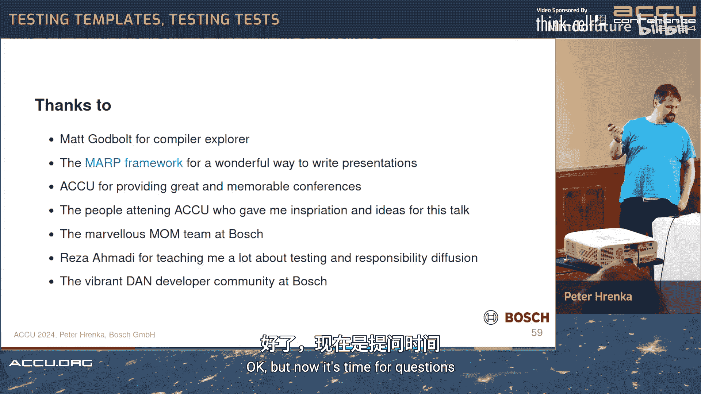

# 034：使用对抗性方法测试C++模板


在本教程中，我们将学习如何逐步改进C++模板的测试方法。我们将探讨如何以结构化的方式测试模板函数和类模板，并引入一种名为“对抗性测试”的新方法，以增强测试的可靠性。内容涵盖编译器运行时变化、测试数据管理以及如何确保测试本身的质量。

## 1：引言与背景

上一节我们概述了本课程的目标。本节中，我们将介绍演讲者的背景和本次讨论的上下文。

我同时学习过数学和计算机科学，并在职业生涯中不断切换这两个领域。目前，我在博世公司工作，这是一家技术公司，主要从事汽车雷达和视频传感开发。我们使用一种基于C++模板的库，其中包含特殊的容器和数学函数。

本次演讲将重点讨论单元测试，并使用Google Test框架作为示例。我将分享一些来自实际工作的主题和案例，这些概念可能也适用于其他测试场景。

## 2：基础模板测试方法及其局限性

上一节我们介绍了讨论的背景。本节中，我们来看看测试模板函数和类模板的基础方法及其存在的问题。

假设我们想测试一个简单的模板函数，例如计算平方的函数 `square`。

```cpp
template <typename T>
T square(T x) { return x * x; }
```

使用Google Test，我们可以这样编写测试：

```cpp
TEST(SquareTest, NonZero) {
    EXPECT_EQ(square(1), 1);
    EXPECT_EQ(square(2), 4);
    EXPECT_EQ(square(10), 100);
}

TEST(SquareTest, Zero) {
    EXPECT_EQ(square(0), 0);
}
```

编译并运行测试，一切正常。但仔细看，这些测试非常表面。整数通常有32位，仅测试几个案例可能不够。对于模板函数，我们还需要考虑所有可能的数据类型，甚至是用户自定义的类型。

对于类模板，例如一个自定义的 `Vector`，测试可能如下：

```cpp
TEST(VectorTest, BasicOperations) {
    Vector<int> v;
    EXPECT_TRUE(v.empty());
    EXPECT_EQ(v.size(), 0);

    v.push_back(1);
    EXPECT_FALSE(v.empty());
    EXPECT_EQ(v.size(), 1);
    EXPECT_EQ(v.front(), 1);
    EXPECT_EQ(v.back(), 1);

    v.pop_front();
    EXPECT_TRUE(v.empty());
    EXPECT_EQ(v.size(), 0);
}
```

测试通过了，但我们需要思考：我们到底测试了哪些方法？构造函数？`empty`？`size`？`push_back`？此外，我们只测试了 `int` 类型，其他类型呢？随着方法增多，测试代码会变得冗长，这不是一个好的扩展方式。

另一个关键点是测试的**依据**。考虑以下函数：

```cpp
template <typename Iter>
void sort_sequence(Iter begin, Iter end) {
    if (begin == end) return;
    auto val = *begin;
    for (auto it = begin; it != end; ++it) {
        *it = val++;
    }
}
```

如果我们编写测试：

```cpp
TEST(SortTest, SortsVector) {
    std::vector<int> v = {5, 3, 1, 4, 2};
    sort_sequence(v.begin(), v.end());
    EXPECT_TRUE(std::is_sorted(v.begin(), v.end()));
}
```

测试可能会通过，但函数名 `sort_sequence` 具有误导性。它并没有排序，而是用递增序列填充范围。这里的问题在于，我们测试所依据的**需求**不明确。函数名隐含了“排序”的需求，但实际代码实现的是“生成序列”。没有明确的规范，我们就无法判断代码是否正确。

**核心要点**：每个程序都是针对某个规范正确的。如果没有规范，就无法进行有效的测试。

## 3：改进测试结构：分离编译时与运行时变化

上一节我们看到了基础方法的局限性。本节中，我们探讨如何通过改进测试结构来更好地管理类型（编译时）和数据（运行时）的变化。

Google Test 提供了模板化测试的方法：

```cpp
template <typename T>
class VectorTest : public ::testing::Test {};
TYPED_TEST_SUITE(VectorTest, MyTypes);

TYPED_TEST(VectorTest, Initialization) {
    using VectorType = Vector<TypeParam>;
    VectorType v(3);
    EXPECT_EQ(v.size(), 3);
}
```

这种方法允许我们为类型列表中的每种类型实例化测试。但它存在一些问题：宏的使用复杂、难以定制、不支持多个模板参数、难以模块化扩展，并且要求预先知道所有要测试的类型。

我们决定放弃宏，直接使用纯C++类来实现：

```cpp
namespace my_test {
    template <typename T>
    class VectorTest : public ::testing::Test {
    protected:
        void TestBody() override {
            Vector<T> v(3);
            EXPECT_EQ(v.size(), 3);
        }
    };
}

// 手动实例化
using MyTestTypes = ::testing::Types<int, float, double>;
INSTANTIATE_TYPED_TEST_SUITE_P(MyPrefix, my_test::VectorTest, MyTestTypes);
```

这种方法给了我们完全的控制权：可以使用命名空间、支持多个模板参数、可以自由分组和分离测试代码，并且便于用户使用自己的类型来运行我们的测试。

接下来，我们处理**运行时数据变化**。传统方法是使用**Fixture**（夹具）：

```cpp
template <typename T>
class VectorFixture : public ::testing::Test {
protected:
    std::vector<Vector<T>> test_vectors = {
        Vector<T>(),                     // 空向量
        Vector<T>(1, T{1}),              // 一个元素
        Vector<T>(100, T{1}),            // 100个相同元素
        Vector<T>({T{2}, T{3}, T{5}, T{7}}) // 几个不同的质数
    };
};
```

夹具在很多情况下有效，但在测试复制构造函数、移动构造函数或二元操作符时，需要测试对象之间的所有组合，使用夹具会变得笨拙，并且测试数据和测试逻辑耦合紧密。

我们的解决方案是引入**等价类**概念，将数据生成与测试基础设施分离：

```cpp
template <typename T>
struct VectorEquivalenceClasses {
    std::vector<Vector<T>> classes;

    VectorEquivalenceClasses() {
        classes.emplace_back(); // 空
        classes.emplace_back(1, T{1}); // 一个元素
        classes.emplace_back(100, T{1}); // 100个元素
        classes.emplace_back(std::initializer_list<T>{T{2}, T{3}, T{5}, T{7}});
    }
};
```

在测试中，我们遍历这些等价类：

```cpp
TYPED_TEST(VectorTest, CopyAssignment) {
    VectorEquivalenceClasses<TypeParam> eq_classes_src;
    for (const auto& src : eq_classes_src.classes) {
        VectorEquivalenceClasses<TypeParam> eq_classes_dst;
        for (auto& dst : eq_classes_dst.classes) {
            dst = src; // 测试赋值操作符
            EXPECT_EQ(dst.size(), src.size());
            EXPECT_EQ(dst, src);
        }
    }
}
```

**这种方法的优势**：
*   清晰分离了测试数据和测试逻辑。
*   易于扩展，添加新的等价类会自动纳入所有相关测试。
*   可以轻松实例化多个副本（例如用于测试const方法）。
*   测试代码更抽象、更通用。

**潜在的缺点**：
*   增加了一层间接性，代码稍多。
*   有时需要在测试中进行运行时判断（例如，检查容器是否为空）。
*   对于不熟悉此模式的人来说，可能不够直观。

## 4：测试的局限性：穷举测试的不可能

上一节我们建立了更好的测试结构。本节中，我们正视一个根本性限制：我们无法测试所有情况。

考虑测试一个简单的加法函数：

```cpp
template <typename T>
T add(T a, T b) { return a + b; }

TEST(AddTest, Exhaustive) {
    using T = uint32_t;
    for (T a = 0; a < std::numeric_limits<T>::max(); ++a) {
        for (T b = 0; b < std::numeric_limits<T>::max(); ++b) {
            EXPECT_EQ(add(a, b), a + b);
        }
    }
}
```

对于32位整数，这有约40亿种组合，测试永远无法完成。即使有无限的计算资源，为如此简单的操作进行穷举测试也是浪费且不环保的。

因此，我们必须接受**测试是不完整的**。我们无法证明代码绝对正确，只能尽可能提高信心。这就需要我们**明智地选择测试数据**。

**如何选择等价类？**
对于容器：
*   空状态
*   单元素状态
*   多元素状态（选择一个有代表性的“大”小）
对于算法参数（如迭代器）：
*   `begin()` 迭代器
*   中间位置的迭代器
*   `end()` 迭代器
我们可以组合容器状态和迭代器状态进行测试。

对于数学函数，特别是浮点数：
*   需要包含特殊值：正负零、无穷大、NaN（非数字）。
*   测试不同的数值类型（`float`, `double`, `long double`）。
*   对于非基本类型的数学对象（如向量、矩阵），如果模板支持，也应测试。

**关于对齐类型的测试**：在不同平台上，对齐规则可能不同，可能导致问题。因此，测试具有不同对齐要求的类型很重要。

**核心挑战**：我们拥有强大的方法（类型参数化 x 运行时等价类）来生成大量测试，但必须谨慎使用，避免测试过多无意义的组合。重点应放在测试那些**可能出错**的复杂逻辑上，而不是编译器和硬件已经保证正确的简单操作上。

## 5：超越代码覆盖率：对抗性测试

上一节我们认识到测试必然是不完整的，并讨论了如何选择测试数据。本节中，我们提出一个关键问题：如何知道我们的测试本身是有效的？

通常，人们依赖**代码覆盖率**工具。达到100%的覆盖率常被视为测试充分的标志。但覆盖率存在严重问题：
1.  **对于模板**：一行模板代码可能被某些类型实例化覆盖，但未被其他类型覆盖。覆盖率工具难以完美处理这种情况。
2.  **根本性缺陷**：覆盖率只表明代码被执行了，但**不检查执行结果是否正确**。
    ```cpp
    TEST(SquareTest, CoverageTrick) {
        square(5); // 这行代码被覆盖了
        // 但没有进行任何断言(EXPECT)！
    }
    ```
    这个测试能达到100%行覆盖，但完全没有验证功能。

因此，**覆盖率是必要的，但绝不是充分的**。

我们需要一种方法来测试我们的测试。我们可以将测试视为一个**过滤器**：好的输入应该通过（测试成功），坏的输入应该被拒绝（测试失败）。传统上，我们只测试“好的输入”能通过。

**对抗性测试**的核心思想是：**将待测函数本身也作为测试的一个输入参数**。然后，我们不仅传入正确的实现（应通过测试），还传入一些我们知道**不正确**的实现（**应使测试失败**）。

**如何构建“坏的”实现？**
*   空函数（什么都不做）。
*   返回固定值的函数。
*   行为与规范相反的函数（例如，对排序函数传入一个“反排序”函数）。
*   旧版本中已知有缺陷的实现。
*   移除或增加参数的函数。

我们需要修改测试基础设施来支持这种“期望失败”的模式。在Google Test中，可以创建一个包装器：

```cpp
template <bool ShouldSucceed>
struct AdversarialGuard {
    int failure_count = 0;
    ~AdversarialGuard() {
        if (!ShouldSucceed) {
            EXPECT_GT(failure_count, 0) << "Adversarial test should have detected a failure!";
        }
    }
};

#define ADVERSARIAL_EXPECT_EQ(guard, a, b) \
    do { \
        if ((guard).ShouldSucceed) { \
            EXPECT_EQ(a, b); \
        } else { \
            if ((a) != (b)) (guard).failure_count++; \
        } \
    } while(0)
```

现在，我们可以编写一个同时测试正确和错误排序函数的测试：

```cpp
template <typename SortAlgo, bool IsCorrectAlgo>
void TestSortAlgorithm() {
    AdversarialGuard<IsCorrectAlgo> guard;
    VectorEquivalenceClasses<int> eq_classes;
    for (auto& vec : eq_classes.classes) {
        auto original = vec;
        SortAlgo sorter;
        sorter(vec.begin(), vec.end());
        // 检查1: 序列应已排序
        ADVERSARIAL_EXPECT_EQ(guard, std::is_sorted(vec.begin(), vec.end()), true);
        // 检查2: 新序列应包含原序列的所有元素（对于排序是必须的）
        // ... 实现元素存在性检查 ...
    }
}

// 测试正确的排序算法（如std::sort）
TEST(SortTest, CorrectAlgorithm) {
    TestSortAlgorithm<std::sort, true>();
}

// 测试错误的“算法”（如什么都不做的函数）
struct DoNothingSorter {
    template <typename Iter>
    void operator()(Iter, Iter) {}
};
TEST(SortTest, AdversarialDoNothing) {
    TestSortAlgorithm<DoNothingSorter, false>();
}
```

通过运行对抗性测试，我们可以发现测试用例本身的缺陷。例如，如果测试数据原本就是有序的，那么一个“什么都不做”的错误排序函数也可能通过“序列已排序”的检查。对抗性测试会失败，从而提醒我们需要加强测试断言（例如，增加“结果包含原所有元素”的检查）。

**对抗性测试的优势**：
*   **提升测试质量**：迫使测试必须能区分正确和错误的实现。
*   **使测试更通用**：待测算法成为参数，测试逻辑可复用。
*   **提供具体反馈**：测试失败直接指出测试用例的不足，避免了“测试是否足够”的哲学争论。
*   **适用于AI生成的代码**：可以用简单的对抗性样本来验证AI生成的测试是否有效。

**需要避免的对抗性示例**：
*   产生随机行为的函数（难以稳定检测）。
*   故意引发未定义行为的函数。
*   实际上满足规范但实现不同的函数（例如，用稳定的排序测试不稳定的排序）。

## 6：总结与展望

在本教程中，我们一起学习了如何系统化地测试C++模板。

我们首先分析了基础测试方法的局限性，特别是对编译时类型变化和运行时数据变化管理的不足。接着，我们提出了改进方案：
1.  **使用纯C++类而非宏**来构建类型参数化测试，以获得更好的控制力和模块化。
2.  **引入“等价类”概念**，将测试数据生成与测试基础设施清晰分离，使测试更易于扩展和维护。
3.  **认识到穷举测试的不可能性**，强调需要明智地选择测试数据和类型组合。

最后，我们引入了核心创新——**对抗性测试**。这种方法通过将待测函数作为参数，并同时测试已知的正确和错误实现，来验证测试用例本身的有效性。它超越了代码覆盖率的局限，为我们提供了一种切实可行的手段来评估和提升测试质量，并在AI辅助编程的时代，为验证AI生成的测试代码提供了新思路。

**最终结论**：通过清晰分离测试结构、精心选择测试数据、并运用对抗性方法来验证测试的有效性，我们可以显著提升C++模板代码的测试质量和最终的产品可靠性。




