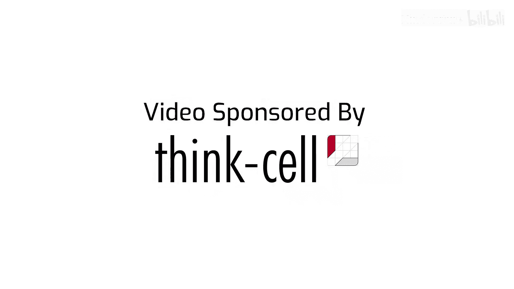
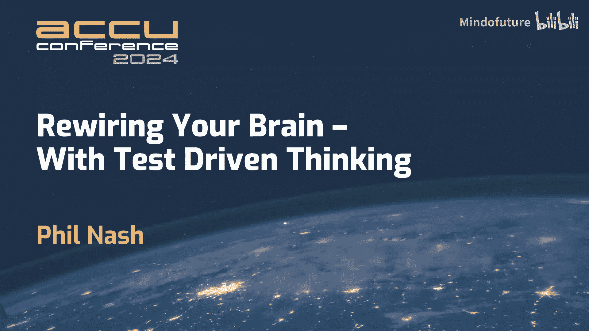
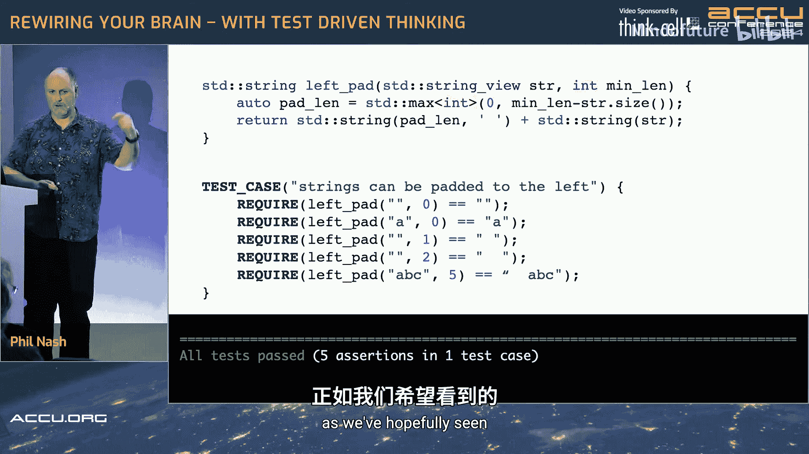
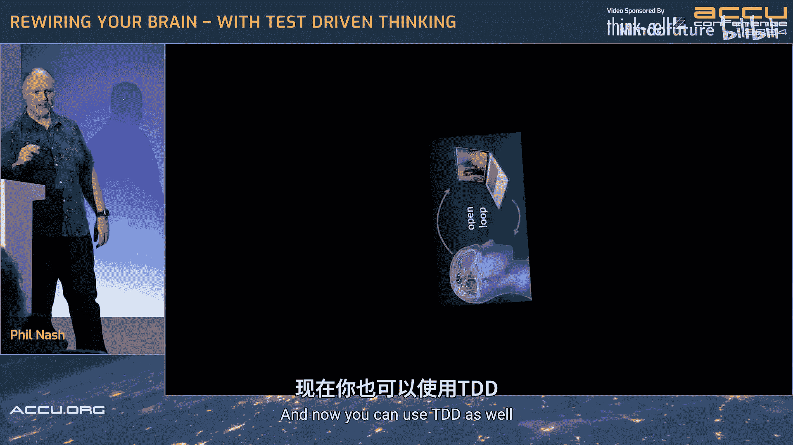
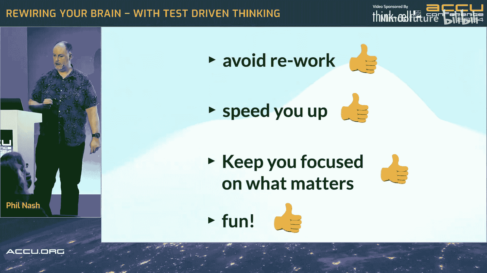

# 035：用测试驱动思维重塑大脑，提升C++生产力 🧠





在本节课中，我们将要学习如何将心理学、神经科学与测试驱动开发相结合，以更高效、更愉悦的方式编写C++代码。我们将探讨习惯形成、多巴胺触发以及如何通过TDD“外化”你的大脑，从而提升专注度和生产力。

## 概述

我们常常认为编写测试是额外的工作，会拖慢开发速度，并且枯燥乏味。然而，通过测试驱动开发的思维模式，我们可以将这些障碍转化为优势。本节将引导你理解TDD的核心循环，并揭示其背后如何与大脑的工作机制协同，从而改变你对编码的认知。

## TDD基础：两个循环的故事 🔄

上一节我们介绍了课程的目标，本节中我们来看看测试驱动开发的核心过程。首先，我们需要确保我们对TDD是什么有共同的理解。

TDD本身非常简单，其核心是“红-绿-重构”循环。这个循环不仅关乎代码，更关乎一种思维方式。

### TDD循环详解

以下是TDD循环的各个阶段：

1.  **红（编写一个失败的测试）**：你总是从一个失败的测试开始。关键词是“开始”和“失败”。这个“测试”可以是一个正式的单元测试断言，也可以是一个编译器错误（例如，调用了一个尚未存在的函数）。其核心是设定一个明确的、可验证的期望。

2.  **绿（编写恰好使测试通过的代码）**：只有当测试失败后，你才编写**恰好足够**的代码使其通过。此阶段的目标不是设计优雅的代码，而是用最简单、最直接的方式满足测试要求。这有点像回归最初的“黑客”编程乐趣。

3.  **重构（改进代码设计）**：在所有测试通过（绿色）后，你才能进入重构阶段。在此阶段，你可以安全地应用设计原则、清理代码、提高可读性，而无需担心破坏功能，因为测试会保护你。

4.  **完成？（决定下一步）**：重构完成后，问自己：“我们完成了吗？” 这是一个有意识的决策点，决定是开始下一个功能（写下一个失败测试）还是结束。这个步骤有助于你在不同的思维模式间清晰切换。

### 一个简单的C++代码示例

为了具体说明，让我们通过C++和Catch2测试框架来实现一个简单的`leftPad`函数。

```cpp
#include <catch2/catch_test_macros.hpp>
#include <string>

// 1. 从最简单的失败测试开始
TEST_CASE("Strings can be padded to the left") {
    REQUIRE(leftPad("", 0) == "");
}
```
此时编译会失败，因为`leftPad`函数未定义。这是一个“红”状态。

```cpp
// 2. 编写恰好通过的代码（绿）
std::string leftPad(const std::string& str, int len) {
    return "X"; // 故意返回错误值，以看到测试失败
}
```
运行测试，会看到期望`""`但得到`"X"`的失败信息。然后修正：
```cpp
std::string leftPad(const std::string& str, int len) {
    return ""; // 使第一个测试通过
}
```

```cpp
// 3. 添加更多测试，驱动实现
TEST_CASE("Strings can be padded to the left") {
    REQUIRE(leftPad("", 0) == "");
    REQUIRE(leftPad("hello", 0) == "hello"); // 新测试，会失败
}
```
为了让新测试通过，需要修改实现：
```cpp
std::string leftPad(const std::string& str, int len) {
    return str; // 现在两个测试都通过了
}
```
通过这种小步快跑的方式，逐步增加测试的复杂性（如非零填充长度、填充字符等），最终驱动出完整且正确的实现。每一步都确保有从红到绿的明确反馈。

## 习惯形成：将TDD变为本能 🏃

理解了TDD的机制后，如何让它成为日常开发中自然而然的习惯呢？这需要了解习惯形成的心理学模型。

习惯由三个部分组成：**暗示**、**例行程序**和**奖励**。一旦习惯建立，大脑会沿着建立好的神经通路自动执行例行程序，几乎不需要意志力。

对于编程，旧习惯可能是：
*   **暗示**：需要实现一个新功能。
*   **例行程序**：直接开始编写实现代码，直到“看起来能工作”。
*   **奖励**：看到代码运行成功带来的即时满足感。

要将例行程序改为TDD，关键是**将奖励与TDD循环绑定**。在TDD中，奖励变得更加频繁和即时：
*   每次看到测试从**红变绿**，都是一次小的胜利和积极反馈。
*   完成一个功能后，看到清晰、少Bug的代码，是更大的满足。
*   项目长期维护性提高、缺陷率降低，是终极奖励。

**核心策略**：有意识地关注并享受TDD循环中的这些积极时刻。通过反复将“暗示”（要写代码）与新的“例行程序”（TDD）和强化后的“奖励”（频繁的红绿转换、更好的代码）关联，你的大脑会建立新的、强大的神经通路。最终，不写测试反而会让你感到不适应。



## 多巴胺触发：让编码变得有趣且高效 🎯

我们常认为多巴胺是“快乐化学物质”，但实际上它更关乎“动机显著性”——它促使我们寻找模式、关注重要信息并期待奖励。

在TDD循环中，充满了这种“不可预测的奖励”，从而持续触发多巴胺分泌：
*   **预期的红变绿**：大部分时间如预期发生，带来小确幸。
*   **意外的失败**：当你认为测试该过却失败了，或该失败却过了时，打破了预期模式。这时多巴胺水平升高，使你进入高度专注和好奇的状态，迫切想找出原因——这正是深度学习和解决问题的理想心态。
*   **重构挑战**：安全地改进代码而不破坏测试，本身就像一个游戏。

这种将工作“游戏化”的机制，使得TDD过程变得引人入胜，同时极大地提升了发现问题和学习代码行为的效率。

## 外化你的大脑：专注的力量 🧩

人类大脑是“开环系统”，善于通过外部工具（如书写、计算机）扩展思维。TDD正是这样一个强大的外部化工具。

TDD循环的三个阶段对应三种截然不同的思维模式，测试充当了思维的“外部存储”：

1.  **写失败测试时（红）**：你扮演**设计师/用户**，思考接口、需求和高级行为。你将期望“外化”为可执行的测试代码。

2.  **写实现代码时（绿）**：你切换为**实现者/黑客**。目标单一——让测试变绿。无需记挂设计细节，因为它们已保存在测试中。你可以全心投入解决问题的乐趣。

3.  **重构时**：你切换为**代码工匠**。唯一目标是改善设计并保持行为不变。测试网保障了你的安全，让你可以大胆改进。



这种**通过外部工具（测试）在不同思维模式间无缝、无负担切换**的能力，就是“外化大脑”。它让你一次只专注于一件事，避免了上下文切换的认知损耗，从而大幅提升专注度和生产力。

## 总结：重塑思维，加速开发 🚀

本节课中我们一起学习了如何用测试驱动思维重塑你的C++开发方式。

我们首先剖析了TDD的“红-绿-重构”核心循环，并通过`leftPad`示例展示了其小步快跑、反馈即时的特点。接着，我们从心理学角度探讨了如何通过**习惯循环**将TDD变为本能，通过**多巴胺触发**机制让编码过程充满乐趣和高效学习。最后，我们了解了TDD如何作为**外化大脑**的工具，让你在不同角色间清晰切换，保持极致专注。

回顾最初的偏见：
*   **测试不是额外工作**，它通过左移缺陷发现时间、避免返工和重构出更易修改的代码，从长期看**减少了总工作量**。
*   **测试不会拖慢速度**，就像汽车的刹车是为了让你开得更快一样，测试提供的安全网让你能**更有信心地快速前进**。
*   **测试不再枯燥**，它融入了游戏化的挑战、即时的正面反馈和深度的学习时刻。
*   **测试不会让你分心**，它通过外化思维，帮助你**更专注在当前最重要的任务上**。




通过实践测试驱动**思维**，你不仅能写出更健壮的C++代码，还能重塑你的大脑工作方式，成为一名更高效、更快乐的开发者。