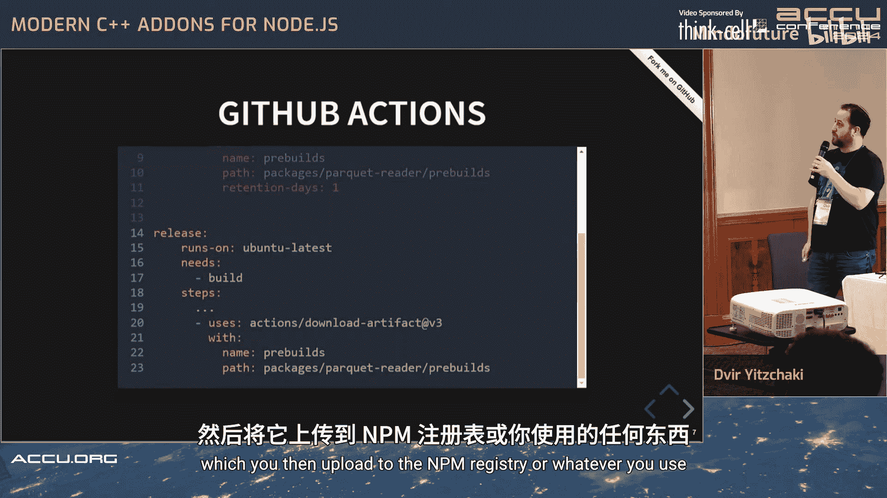

# 036：概述与动机


在本教程中，我们将学习如何为Node.js编写现代C++插件。我们将从一个实际需求出发，逐步构建一个能够生成日历的Electron应用程序，并深入探讨如何将高性能的C++代码集成到JavaScript生态系统中。


## 动机：从实际问题到技术方案

上一节我们介绍了本教程的目标，本节中我们来看看驱动我们学习这项技术的实际场景。

我并非专业的JavaScript开发者，而是一名C++程序员。在工作中，我们使用一种名为Parquet的Apache标准大数据文件格式。为了查看这种文件，我们需要运行一个特定的应用程序。在开发过程中，我使用VS Code，但每次查看文件时都必须跳出编辑器去运行那个应用，这非常低效。

因此，我编写了一个VS Code扩展来直接调用那个应用程序。然而，该应用后来被弃用，不再支持新版本的Parquet格式。我找到了一个功能类似的JavaScript库，但它也很快被弃用。于是，我查看了该协议参考实现的源代码，发现它是用C++编写的。我想到，为什么不直接使用原始的实现呢？这就需要从Node.js调用C++代码，而这正是本次讨论的主题。

为了更直观地演示，我决定不展示那个VS Code扩展，而是构建一个更可见的示例：一个用Electron编写的日历应用程序。

## 项目目标：构建一个日历应用

上一节我们了解了项目的由来，本节中我们来看看要构建的具体应用。

这个应用的目标是允许用户输入想要查看的年份，并选择一周是从周日还是周一开始，然后应用会显示该年的日历。

我已经写好了所需的HTML和JavaScript部分。但接下来，如何生成日历本身呢？幸运的是，去年在ACCU大会上，我使用C++20的Ranges库，借鉴了Eric Niebler的想法，实现了一个生成日历的C++库。这次，我决定直接使用那个库。

## Node.js插件基础：什么是N-API？

在深入代码之前，我们需要理解Node.js插件的基本概念。

Node.js插件本质上是共享库或动态链接库，你可以从Node.js应用程序中加载它们，并像导入其他Node.js模块一样导入。它们使用一个名为N-API的C语言API。在此之上，还有一个C++包装器，称为Node-API或Node Addon API。

## 构建工具链：告别node-gyp，拥抱CMake

上一节我们介绍了插件的基本概念，本节中我们来看看如何构建它们。

最初，Node.js插件使用`node-gyp`作为构建系统，它基于Python。这意味着你需要安装Python才能使用它。作为一个C++程序员，我个人更喜欢在项目中使用CMake。此外，我还想使用C++ Modules，目前只有CMake等少数构建系统能较好地支持，而`node-gyp`并不支持。

我发现有一个名为`cmake-js`的JavaScript库可以帮助解决这个问题，它能为Node.js后端调用CMake。既然使用`node-gyp`也需要Python，我想，那不如也用Python来安装CMake。

我使用`pipx`作为Python虚拟环境管理器，其主要优势是我不需要激活虚拟环境就能使用安装的工具，只需运行`pipx run`命令即可。

以下是`pyproject.toml`文件的内容，用于描述Python依赖：

```toml
[project]
name = "calendar-addon-builder"
dependencies = ["cmake-js"]
```

## 配置Node.js项目：package.json

每个Node.js包都有一个`package.json`文件来描述它。

以下是我的`package.json`文件的关键部分：

```json
{
  "name": "calendar-addon",
  "version": "1.0.0",
  "scripts": {
    "install": "pipx run cmake-js compile",
    "build": "pipx run cmake-js build"
  },
  "dependencies": {
    "node-addon-api": "^5.0.0"
  },
  "devDependencies": {
    "cmake-js": "^7.0.0"
  }
}
```

我在这里请求了`node-addon-api`，这是Node.js插件的C++ API包装器。以及`cmake-js`。当有人安装这个包时，`install`脚本会请求`cmake-js`进行编译。

每个Node.js API都有一个版本号，这基本上决定了哪些Node.js版本能够使用这个插件。Node.js文档中有一个很好的表格，例如，如果你使用版本7（就像我正在用的），你将支持所有你想要的Node.js版本。

## 配置CMake：CMakeLists.txt

要配置`cmake-js`，你可以通过命令行传递参数，或者将它们放在`npm`配置中。`npm`是Node.js的包管理器，它会查看这个配置。

我在`npm`配置中告诉CMake我的源代码在哪里，我希望构建文件夹在哪里，并且可以设置任何CMake变量。例如，我要求使用C++23标准。

现在来看我的`CMakeLists.txt`文件。它看起来是相当标准的CMake文件，但我需要做一些额外的工作。

以下是`CMakeLists.txt`的核心部分：

```cmake
cmake_minimum_required(VERSION 3.26)
project(calendar_addon LANGUAGES CXX)

set(CMAKE_CXX_STANDARD 23)
set(CMAKE_CXX_STANDARD_REQUIRED ON)

# 查找node-addon-api头文件
find_package(NodeAddonAPI REQUIRED)

# 创建一个共享库
add_library(calendar_addon SHARED)
target_sources(calendar_addon
    PUBLIC FILE_SET HEADERS
    BASE_DIRS ${CMAKE_CURRENT_SOURCE_DIR}
    FILES src/calendar_module.cpp
)
target_include_directories(calendar_addon PRIVATE ${NODE_ADDON_API_INCLUDE_DIRS})
target_link_libraries(calendar_addon PRIVATE ${NODE_ADDON_API_LIBRARIES})

# 设置插件版本等信息（从package.json获取）
configure_file(${CMAKE_CURRENT_SOURCE_DIR}/package.json ${CMAKE_CURRENT_BINARY_DIR}/package.json COPYONLY)
```

我在这里查找`cmake-js`插件的头文件位置以便包含它们。同时，我需要告诉CMake以我使用的适当API版本来构建插件。这里我传递了`package.json`以避免重复自己。然后，我创建一个共享库，告诉CMake`cmake-js`包含文件和API的位置，传递版本号，并且还需要链接到`node`库。

## 插件接口：连接C++与JavaScript

上一节我们配置好了构建系统，本节中我们来看看如何定义插件的接口。

现在，我进入插件的接口部分。我包含了Node-API头文件。每个插件都应该使用`NODE_API_MODULE`宏在最后一行声明自身，然后传递一个名为`init`的初始化函数。

`init`函数的任务是声明你将暴露的接口。这里我们只有一个名为`generate_calendar`的函数，它基本上会转发给这里定义的`generate_calendar`函数。

每个函数基本上都有这个签名：你会得到一个上下文信息参数，并且应该返回一个`napi_value`。

以下是`src/calendar_module.cpp`的接口部分：

```cpp
#include <napi.h>
#include "calendar.h" // 假设这是你的C++日历生成库头文件

Napi::Value GenerateCalendar(const Napi::CallbackInfo& info) {
    Napi::Env env = info.Env();

    // 检查参数数量
    if (info.Length() < 2) {
        Napi::TypeError::New(env, "需要两个参数：年份和起始星期几").ThrowAsJavaScriptException();
        return env.Null();
    }

    // 提取并验证参数
    if (!info[0].IsNumber() || !info[1].IsNumber()) {
        Napi::TypeError::New(env, "参数必须为数字").ThrowAsJavaScriptException();
        return env.Null();
    }

    int year = info[0].As<Napi::Number>().Int32Value();
    int week_start = info[1].As<Napi::Number>().Int32Value();

    // 调用C++库函数生成日历
    // 假设 `generate_calendar` 返回一个 std::vector<std::string>
    auto calendar_lines = generate_calendar(year, week_start);

    // 将结果转换为JavaScript数组
    Napi::Array result = Napi::Array::New(env, calendar_lines.size());
    for (size_t i = 0; i < calendar_lines.size(); ++i) {
        result[i] = Napi::String::New(env, calendar_lines[i]);
    }
    return result;
}

Napi::Object Init(Napi::Env env, Napi::Object exports) {
    exports.Set(Napi::String::New(env, "generateCalendar"),
                Napi::Function::New(env, GenerateCalendar));
    return exports;
}

NODE_API_MODULE(calendar_addon, Init)
```

由于JavaScript是动态类型的，我需要显式检查从JavaScript端获取的参数。我检查是否获得了生成日历所需的年份和一周起始日。否则，我会抛出异常。请注意，即使我抛出了异常，这里仍然有`return`语句，因为有可能客户端是在禁用异常的情况下编译的，我不希望我的函数继续执行，所以在这里返回一个`undefined`值。

验证参数后，我可以提取它们，然后使用另一个模块生成日历，该模块将返回一个字符串范围。最后，我创建一个JavaScript数组并将范围复制到其中。由于JavaScript数组没有范围接口，我不能使用`std::copy`，所以只能使用一个简单的循环。

## C++模块：使用现代C++特性

上一节我们定义了插件的JavaScript接口，本节中我们来看看背后真正的C++实现模块。

正如我所说，实际生成日历的实现是在另一个模块中。这是我第一次使用`import`语句，对我来说非常兴奋。

如果你在模块中使用头文件，你应该先有`module;`声明，然后可以包含一些头文件，接着用`export module calendar;`开始你的模块，之后你还可以导入依赖的其他模块。

以下是C++日历模块`src/calendar.ixx`的示例结构：

```cpp
module;
#include <vector>
#include <string>
#include <range/v3/view/concat.hpp> // 使用range-v3库

export module calendar;

import <chrono>; // 导入其他模块（假设存在）
import <format>;

export std::vector<std::string> generate_calendar(int year, int week_start_day) {
    // 使用C++20/23 Ranges和 Chrono 库生成日历的逻辑
    // 返回一个字符串向量，每个元素代表日历的一行
    std::vector<std::string> lines;
    // ... 具体的日历生成算法 ...
    return lines;
}
```

我不会详细介绍如何实际生成日历的所有细节。正如我提到的，我去年在会议上做过。我这个模块只导出两个函数：第一个函数接收一个年份，返回一个日期范围；第二个函数用于格式化日历，同样使用范围适配器。

在这个模块中，有一个函数需要`concat_view`，它在C++23中还没有，可能要到C++26。在去年的演讲中，我使用`std::generator`实现了它，但这次我决定使用一个外部库`range-v3`。我在这里包含了它，然后通过委托给`range-v3`来实现`concat`功能。

## 依赖管理：使用Conan

要安装`range-v3`，你可以直接下载头文件，或者使用包管理器。就个人而言，我更喜欢使用包管理器，所以我在这里使用Conan。由于我已经在Python环境中，我可以直接用`pip`安装Conan。

为了将Conan与CMake集成，你可以使用一个支持Conan的CMake模块。这相当新。你只需传递一个CMake变量来包含这个模块，它会在生成项目之前自动包含，这基本上告诉CMake在哪里找到你的依赖项。

然后，我就可以在CMake中声明我的日历模块依赖于`range-v3`。

你还可以看到编译模块的相同语法：你需要用`FILE_SET CXX_MODULES`声明`target_sources`，并传递你所有的模块源文件。

## 部署与分发：跨平台预构建

上一节我们完成了代码开发，本节中我们来看看如何将插件部署给用户。

你如何部署这个东西呢？有几个JavaScript包可以用于此。基本上，除非你希望用户也为他们自己的平台构建C++代码，并强迫他们下载GCC等工具，否则，你通常希望为你想要支持的每个平台预构建插件。

这就是那些包为你做的事情。问题在于把这些预构建的共享库放在哪里。你可以将它们上传到像S3这样的Web服务，从那里下载，或者上传到Git Releases，或者直接放在NPM包内部。这就是`prebuild`包所做的，也是我所使用的。

要使用`prebuild`包，你需要再次提供一些描述文件。你需要使用API版本（比如7）。我只是再次包含`package.json`并在这里传递它和你的包名。

如果你记得我们最初忽略的那一行，基本上，当有人安装你的包时，它会运行这个`prebuild-install`验证，检查是否有所需的预构建库，否则它将调用构建系统，当然，除非他们有工具，否则会失败。

在CMake中，我添加了一个自定义步骤，将我刚刚构建的内容复制到`prebuild`能够找到的适当目录。

如果你使用CI/CD管道或GitHub Actions，基本上，正如我所说，你只需运行一个构建阶段来构建所有你想要支持的平台。顺便说一下，GitHub Actions现在免费支持Mac M1处理器，这很好。然后，你可以在特定的操作系统构建期间上传构件，之后下载它们，并将它们合并到一个包中，然后上传到NPM注册表或你使用的任何地方。

## 总结

在本教程中，我们一起学习了为Node.js编写现代C++插件的完整流程。



我们从解决一个实际开发效率问题出发，明确了通过C++插件提升Node.js应用性能的需求。接着，我们规划了一个日历应用作为示例项目。然后，我们深入了解了Node.js插件（N-API）的基础。在构建环节，我们选择了CMake替代传统的node-gyp，并配置了项目文件。我们定义了清晰的JavaScript-C++接口，并利用现代C++模块和Ranges库实现了核心逻辑。通过Conan管理了C++依赖。最后，我们探讨了如何使用预构建工具实现跨平台部署。


这就是为Node.js编写现代C++插件的基本方法。整个过程结合了JavaScript的灵活性与C++的高性能，为构建复杂应用提供了强大的解决方案。