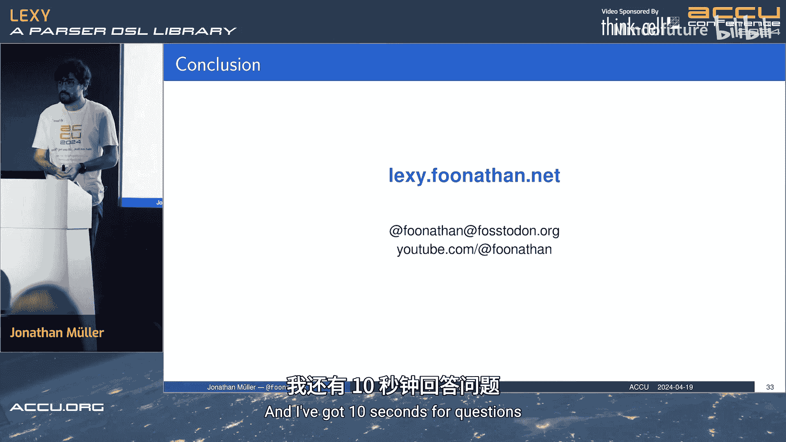

# 037：Lexy - 用于C++解析的DSL库


## 概述

在本教程中，我们将学习Lexy，一个用于C++的领域特定语言（DSL）库。Lexy本质上是对递归下降解析器的语法糖，它允许你编写解析器，同时保持对分支决策和回溯的完全控制。我们将从基本概念开始，逐步深入到其高级特性和内部实现。

## 语法定义与解析流程

上一节我们介绍了Lexy的基本概念，本节中我们来看看如何使用Lexy进行解析。使用Lexy需要三个步骤：首先定义语法，然后创建输入，最后调用解析函数。

以下是使用Lexy解析CSS颜色值的示例步骤：

1.  **定义语法**：语法由产生式（productions）和规则（rules）组成。规则使用DSL定义如何解析输入。
    ```cpp
    struct Color {
        static constexpr auto rule = dsl::hash_sign + dsl::times<3>(dsl::hex_digit);
        static constexpr auto value = lexy::construct<Color>;
    };
    ```

2.  **创建输入**：输入可以是字符串字面量、文件内容或命令行参数等。
    ```cpp
    auto input = lexy::zstring_input("#FF00FF");
    ```

3.  **调用解析**：调用解析函数，传入语法的入口产生式、输入和错误处理器。
    ```cpp
    auto result = lexy::parse<Color>(input, lexy::collect<std::string>);
    if (result.has_value()) {
        // 使用解析结果
    }
    ```

## 核心特性：非声明式与回溯控制

上一节我们介绍了基本的解析流程，本节中我们来看看Lexy的一个核心特性：它是非声明式的，并且需要显式控制回溯。

在声明式解析器中，规则 `A* A` 可以匹配一个或多个`A`。但在Lexy中，等效的代码可能无法匹配任何内容，因为Lexy是手写递归下降解析器的语法糖。代码 `while (a) {}` 后接 `a` 将永远不会匹配，因为在消耗完所有`A`后，无法再匹配一个`A`。

类似地，对于分支选择，规则 `A | A B` 可以匹配`A`或`A B`。但在Lexy中，如果第一个分支`A`匹配成功，它将永远不会考虑第二个分支`A B`。

这是因为Lexy默认不会回溯，除非你明确告诉它。决策通过分支条件（branch conditions）做出。分支条件可以是单个标记（如数字或字符类），本质上是单字符前瞻（LALR(1) lookahead）。当你需要进行回溯时，必须使用`dsl::peek`等操作显式指定。

以下是使用分支条件解析函数调用语法的示例：
```cpp
struct FunctionCall {
    static constexpr auto rule = dsl::identifier + dsl::parenthesized(dsl::list(dsl::integer));
    static constexpr auto value = lexy::construct<FunctionCall>;
};
```

## 高级功能与应用场景

上一节我们探讨了Lexy的非声明式特性，本节中我们来看看它提供的一些高级功能和适用场景。

Lexy支持解析文本，包括Unicode，并能编译时访问字符属性数据库。它提供了解析嵌套结构、引号和转义序列等的基本规则，并支持自动空白字符跳过。

你可以使用Lexy来解析编程语言，作者本人已在Lexy之上编写了三个编译器。它支持关键字和标识符解析，允许指定运算符优先级，并能自动进行错误恢复。此外，Lexy还可以解析二进制输入。

## 实现原理：解析器组合子与值传递

上一节我们了解了Lexy的高级功能，本节中我们将深入探讨其实现原理。Lexy建立在解析器组合子（parser combinators）之上。

一个解析器本质上是一个函数，它接受一个读取器（reader）并返回布尔值，表示解析是否成功。多个解析器可以通过组合子函数组合在一起，例如按顺序解析。

在传统实现中，这通常使用Lambda和高阶函数完成。但在C++中，这会带来开销。因此，在Lexy中，作者使用了空类型（empty types），整个语法规范都在类型系统中组合。例如，解析单个字面字符的规则就是一个空类型，所有规范都体现在类型上。

一个关键问题是：如何产生和传递值？例如，解析整数时，我们消耗数字后需要返回一个整数值。最初的解决方案是让每个解析器返回一个`std::optional<T>`，但这会导致复杂的类型组合（如元组的变体的元组），难以使用且会产生不必要的拷贝。

Lexy的解决方案借鉴了用于异步编程的发送者-接收者（senders-receivers）模式。在这个模式中，发送者描述要完成的工作，接收者是接收结果的回调。通过连接发送者和接收者，工作被执行，结果传递给回调。

这种将工作描述（发送者）与结果处理（接收者）分离的思想巧妙地解决了值传递问题。回调（continuation）可以很容易地表示`void`（不传递值）、元组（传递多个参数）和选择（通过重载传递不同类型），而无需创建实际的元组或变体类型。

在Lexy中，规则本身知道如何解析，但它需要与一个续延（continuation）连接。这是通过实例化一个包含下一个解析器的结构体`P`来完成的。`P`的解析函数接受一个上下文和所有先前的参数，执行自己的匹配，成功后调用下一个解析器的解析函数，并传递所有先前的参数及当前值。通过这种方式，值被链式传递，最终调用在语法中指定的回调，产生最终结果。

## 输入处理：读取器模型 vs 迭代器模型

上一节我们探讨了Lexy的值传递机制，本节中我们来看看它为什么选择自定义的读取器（Reader）模型，而不是标准的C++迭代器。

作者希望支持动态请求输入的场景，例如交互式地从控制台读取多行输入。初始时提示用户输入一行，开始解析，当到达该行末尾时，需要请求更多输入（再次提示用户输入下一行）。只有当用户不想再输入任何内容时，才视为文件结束（EOF）。

如果使用标准的输入迭代器，其操作包括`operator*`（解引用）、`operator++`（递增）和`operator==`（相等比较）。我们需要在某个操作中检查并提示下一行。

*   如果在`operator++`中提示，那么即使解析成功完成，也可能不必要地提示用户输入下一行。
*   如果在`operator*`中提示，那么在某些解析模式（如跳过所有字符）下可能无法正确工作，因为`operator*`可能不会被调用。
*   如果在`operator==`（相等比较）中实现主要逻辑，虽然可行，但显得非常奇怪，不符合迭代器的惯用语义。

因此，标准的迭代器模型并不适合这种动态输入需求。Lexy引入了`Reader`结构，它包含`peek()`和`bump()`方法。`peek()`方法可以安全地请求更多输入，这个模型更清晰地表达了“前瞻可能需要更多数据”的意图。

## 总结




在本教程中，我们一起学习了Lexy这个用于C++的解析器DSL库。我们了解了它的基本使用流程：定义语法、创建输入和调用解析。我们深入探讨了其非声明式的核心特性，明白了它需要显式控制回溯，并通过分支条件做出决策。我们还列举了Lexy支持的一系列高级功能，如Unicode支持和错误恢复。最后，我们剖析了其基于解析器组合子和发送者-接收者模式的实现原理，理解了它如何高效地组合和传递值，以及为什么它采用自定义的读取器模型来处理动态输入。Lexy为C++开发者提供了一种在保持手写解析器般的控制力和灵活性的同时，又能享受声明式语法便利的解析方案。