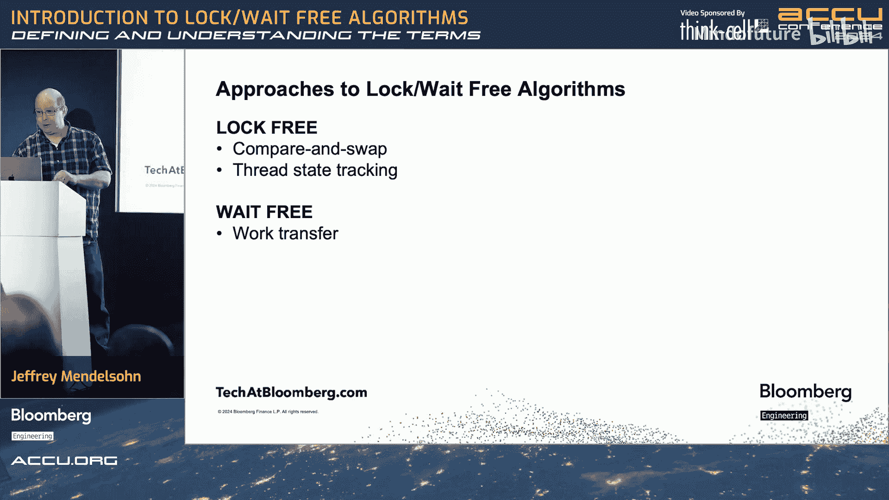

# 038：无锁与无等待算法——定义与理解

在本节课中，我们将要学习并发编程中的两个核心概念：**无锁**与**无等待**算法。我们将从历史背景出发，探讨为何需要这些概念，理解同步原语及其存在的问题，并给出清晰的定义。最后，我们会简要讨论这些算法的价值与实现思路。

---

## 历史背景与需求演变

上一节我们介绍了课程目标，本节中我们来看看这些概念是如何产生的。

计算机硬件的发展经历了从单核到多核的演变。起初，我们通过提高单核速度来提升性能。当物理极限来临时，我们转向了增加处理器核心数量。软件层面也随之发展，从单任务到多任务，再到需要跨多个核心并行执行计算。

将计算任务拆分到多个核心上执行后，必然需要在某个点重新组合结果，这就引入了**同步**的需求。同步是协调多个执行单元（如线程）在时间上保持一致的过程。

## 什么是同步原语？

同步原语是用于实现同步的底层工具。它们将不同的事物在时间上汇聚到同一点。

以下是几种常见的同步原语：
*   **互斥锁**：确保同一时间只有一个线程能访问共享资源。
*   **屏障**：要求一组（N个）线程都到达某一点后，才能继续执行。
*   **信号量**：控制同时访问某个资源的线程数量。

同步原语虽然有用，但也带来了问题。我们制造了强大的多核硬件，却又通过锁限制同一时间只能有一个线程执行，这与降低延迟、提高吞吐量的目标背道而驰。

## 同步的常见问题

除了性能限制，同步还可能引入其他复杂问题，例如死锁和优先级反转。但本节课的核心焦点是**缺乏进展**的问题：当使用互斥锁时，所有线程被串行化，只有一个能继续执行，系统整体无法充分利用硬件资源向前推进。

这正是**无锁**和**无等待**算法要解决的问题：它们旨在确保系统始终保有某种程度的进展。

## 定义无锁与无等待算法

接下来，我们为无锁和无等待算法提出一个工作定义。请注意，业界存在多种定义，这里的定义旨在帮助理解核心思想。

**无锁**：对于线程的任意子集，其中至少有一个线程能够取得进展。
*   这意味着即使部分线程被挂起或执行缓慢，系统整体也不会完全停滞。
*   例如，一个使用“读写锁”的数据结构，当写锁持有时，所有读者线程都会被阻塞。如果只考虑读者线程这个子集，它们无法取得进展，因此该结构不是无锁的。

**无等待**：所有活跃的线程都能在有限步数内完成其操作。
*   “有限步数”是关键，它可能依赖于线程数量（例如，步数上界是线程数的线性函数），但必须是可确定的。
*   这提供了最强的进度保证，但实现也最复杂。

## 其他常见定义对比

为了更全面地理解，这里列出其他常见的定义方式：

*   **最简定义**：
    *   无锁：不存在锁。
    *   无等待：不存在等待。
    *   *问题在于“锁”和“等待”的定义本身可能模糊。*
*   **Just Software Solutions 博客的定义**：
    *   无锁：如果任何线程被挂起，其他线程必须仍能完成它们的任务。
*   **《C++ Concurrency in Action》中的定义**：
    *   无锁：如果多个线程在一个数据结构上操作，在有限步数内，其中一个将完成其操作。
    *   无等待：每个针对该数据结构的操作都在有限步数内完成。

虽然细节有差异，但核心理念一致：**无锁保证“某事”总会前进；无等待保证“所有事”都会前进**。

## 我们需要无锁/无等待算法吗？

上一节我们比较了各种定义，本节中我们来看看这些算法是否真的必要。

*   **无等待算法的价值**：
    *   它提供了严格的运行时保证（有限步内完成），适用于对延迟有极端要求的场景（如自动驾驶系统、生命攸关的系统）。如果需要这种保证，无等待至关重要。
    *   缺点是实现极其复杂，且通常较慢。

*   **无锁算法的价值**：
    *   它保证程序最终会完成，这是一个良好的属性。
    *   然而，其真正价值往往体现在**实现无锁的过程中**：为了移除锁，我们通常需要设计更低开销、性能更高的代码。最终得到的**高性能**才是更普遍的目标。
    *   无锁代码比传统加锁代码更复杂，但遵循一些常见模式。

需要注意的是，当我们说一个数据结构“无锁”时，通常指的是它的**核心操作路径**是无锁的。例如，一个队列的入队操作可能是无锁的，但当队列满时，它仍然可能选择阻塞调用者，这并不矛盾。

## 实现技术概览

最后，我们简要了解实现无锁/无等待算法的一些常见技术背景。

*   **原子操作与CAS**：无锁算法广泛依赖原子操作，尤其是**比较并交换**（Compare-And-Swap， CAS）。
    *   **公式/伪代码**：`CAS(addr, expected, new_value)`：如果 `*addr` 的值等于 `expected`，则将其设置为 `new_value` 并返回成功；否则返回失败。
    *   这是实现无锁链表、队列等数据结构的基础。线程通过CAS不断重试来更新共享指针，每次失败都意味着另一个线程成功并取得了进展，从而满足无锁要求。

*   **无等待算法技术**：
    *   常采用**工作转移** 策略。当一个线程因冲突无法继续时，它会将未完成的操作“转移”给造成冲突的线程去完成。由于步数上界允许依赖于线程数，这种协作方式可以满足无等待的条件。

---

本节课中我们一起学习了无锁与无等待算法的基本定义、它们产生的背景、核心价值以及实现基础。记住，无锁关乎系统整体进展，而无等待则提供最强的个体进度保证。追求这些特性，尤其是无锁，往往是优化并发性能、降低同步开销的重要旅程。