# 001：课程介绍与概述

在本节课中，我们将学习《UNIX环境高级编程》这门课程的整体框架、学习目标、评估方式以及所需资源。我们将明确课程定位，了解学习内容，并做好充分的学习准备。

## 课程概述与定位

大家好，欢迎来到CS 631课程：UNIX环境高级编程。

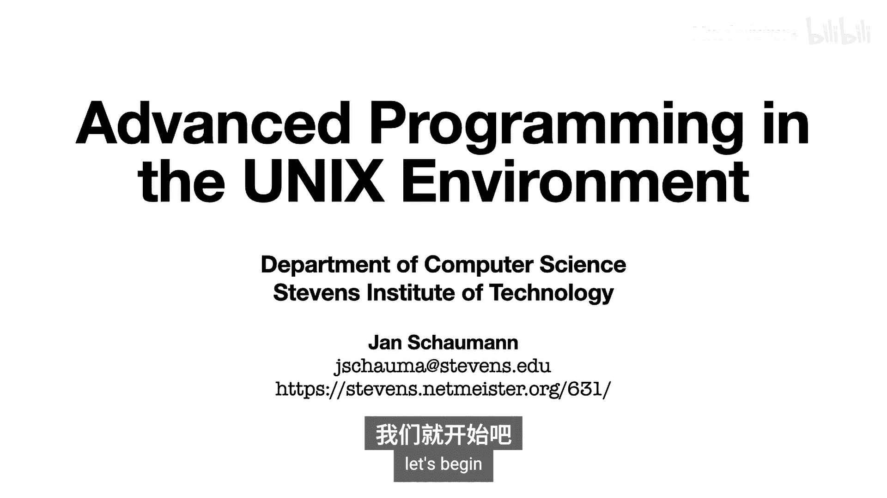

我是Janan Shaoman，自2005年左右起在史蒂文斯理工学院担任兼职教授，教授本课程以及CS 615系统管理课程。此外，我在Verizon Media担任首席基础设施与安全架构师。

您可以通过电子邮件 `jasalmer@stevens.edu` 联系我。课程网站链接显示在幻灯片中。

尽管我已经教授这门课程近15年，但这是第一次完全在线授课。我们将把讲座分解成更小的片段，供您异步学习。预定的课堂时间将用于互动讨论和解答问题。

今天的讲座是对课程的总结。我们将讨论课程内容、学习方式、教学大纲以及您应该收藏的资源。在第二部分，我们将回顾UNIX操作系统的历史，并快速浏览UNIX编程环境和C语言的一些特性。

由于这是我们第一次翻转课堂并将所有内容移至线上，我将依赖您在整个学期的反馈，以帮助您从这门课程中获得最大收益，并帮助我成为一名更高效的教师。

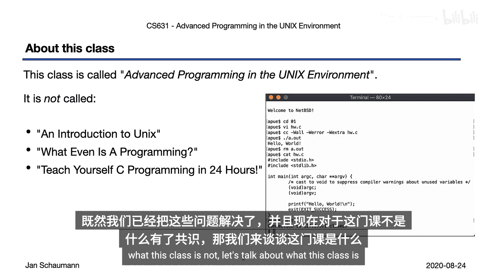

## 课程内容与目标

这门课程名为“UNIX环境高级编程”。每个词都经过精心挑选，明确这门课程“不是什么”同样重要。

具体来说，这门课程不是UNIX使用入门。所有学生都应能熟练地**仅通过命令行**使用类UNIX操作系统。我假设您能够使用常见的UNIX文本编辑器，知道如何查找、搜索和管理文件，如何使用Shell和各种常用工具，以及如何编译和运行程序。

其次，这门课程不是编程入门课。您应具备编写大型程序的经验，并熟悉编写和调试代码所涉及的常见实践范式。

最后，在本课程中，我们将使用C编程语言，您也应熟悉它。请注意，C和C++是有区别的。C编程语言与UNIX操作系统紧密相连。在本课程中，我们只编写纯C语言。

总而言之，如果您对屏幕上终端里显示的任何内容感到陌生或奇怪，那么这门课程可能不适合您。它被称为“UNIX环境高级编程”是有原因的，而这正是我们将要做的。

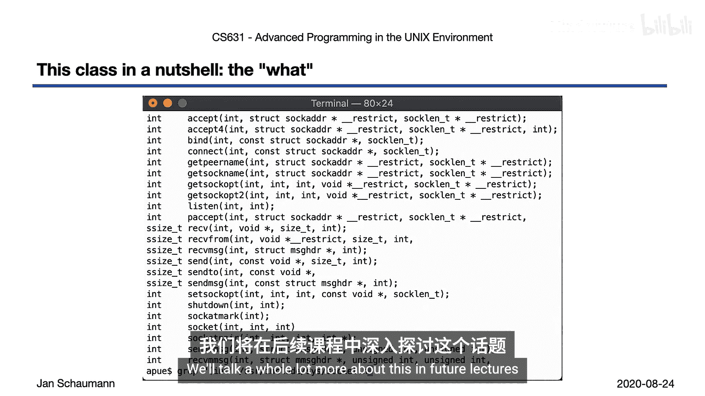

## UNIX环境概览

既然我们已经明确了课程定位，现在让我们谈谈这门课程具体是什么。

当我们谈论UNIX环境高级编程时，让我们快速了解一下这个环境。如您所知，系统在 `/bin` 目录下提供了许多标准工具。到本课程结束时，您应该能够实现这些工具中的任何一个。

您应该能够查看给定工具的手册页，并从中确定如何编写代码来提供给定功能，了解可能遇到的一些边界情况和隐藏要求。

事实上，到第一周结束时，我们已经研究了如何从最基本的层面实现一个交互式Shell、`ls`命令以及`cat`实用程序。因此，您已经熟悉的一些最基本命令，我们将在第一讲中在一定程度上涵盖。

看看您在 `/bin` 目录中找到的命令。想一想所有这些程序是做什么的，以及您将如何实现它们。您能为其中三四个命令写下伪代码吗？

但本课程不仅仅局限于我们日常使用的命令和实用程序。此外，我们还将研究进程间通信，甚至是在客户端-服务器模型下的网络编程。

屏幕上显示的是实现跨互联网主机通信、监听套接字、接受连接、发送和接收数据所需的大部分网络库函数。请注意，所有这些函数都在一个**整数文件描述符**上操作，从而提供了一个简单、灵活且一致的API。

我们将在未来的讲座中详细讨论这一点。

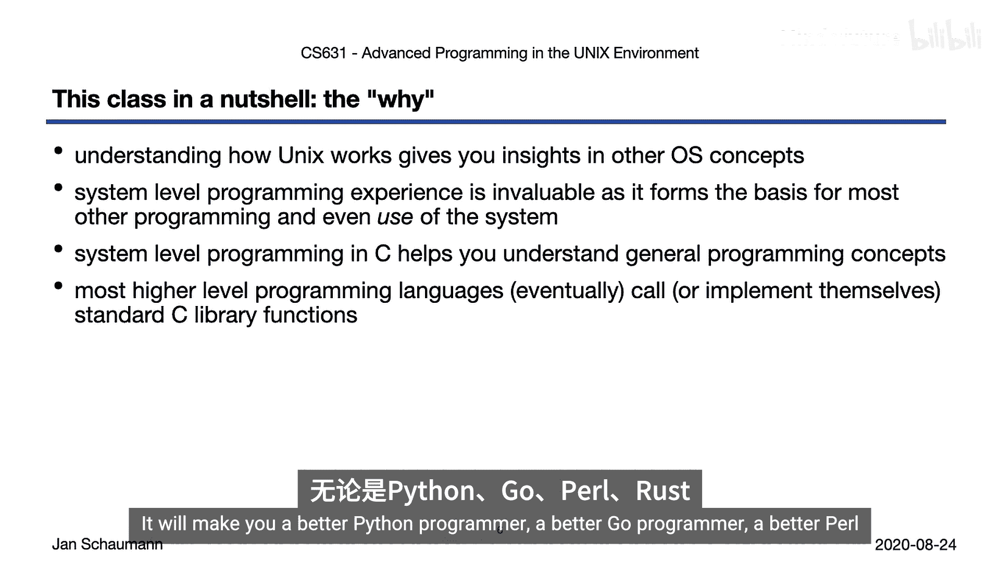

## 学习目标与意义

那么，我们在这门课程中要做什么？显然，我们将在UNIX环境中进行编程，正如课程名称所示。但正如学术界常见的那样，一门课程的成果和教训远远超出了实际执行的任务。

也就是说，我们将从程序员的角度深入了解UNIX操作系统。我们还将获得系统编程经验。系统级编程与内核级编程、嵌入式环境编程、移动应用或数据库编程等有所不同。

我们将使用UNIX环境，并理解它是如何实现的，以及我们如何为UNIX环境编写工具。在此过程中，我们将进一步加深对许多基本操作系统概念的理解。即使我们专注于UNIX家族，这些概念也适用于其他操作系统家族。

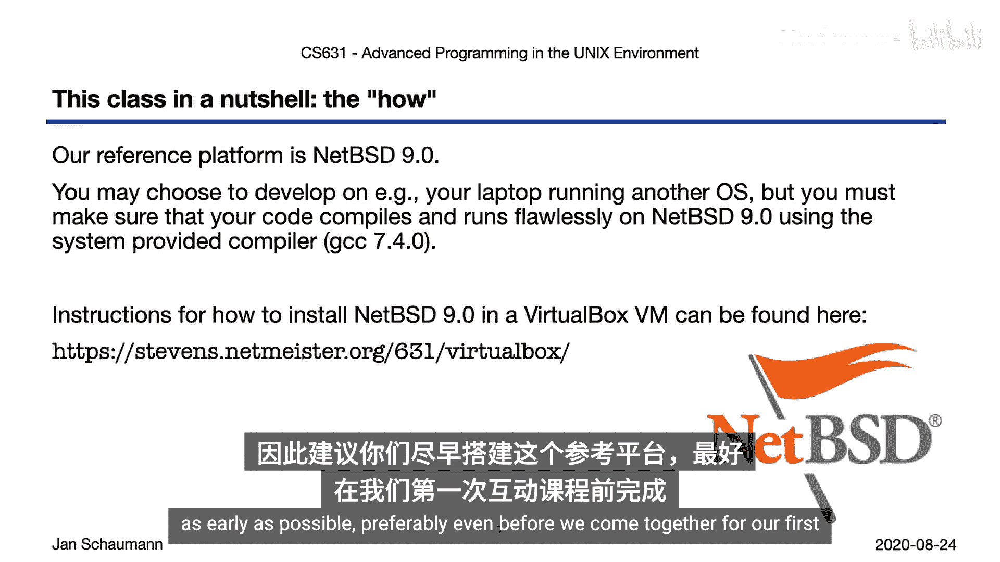

你们中的许多人可能已经对这些概念有所了解，但我相信，在课堂上重新审视这些概念将巩固您的理解并加深您的知识。

这些概念包括：
*   **多用户概念**：一个必须同时容纳多个用户的操作系统将如何运作及其影响。
*   **基本和高级文件I/O**。
*   **进程关系**。
*   **进程间通信**。
*   如前所述，我们将讨论使用**客户端-服务器模型**进行基本网络编程，这似乎是任何程序员发展的良好基础。

学习所有这些听起来很棒，但我们为什么要这样做呢？当然，您这样做可能是为了获得好成绩并能够毕业，但我天真地希望我们在学习这门课程时有额外的目标。

首先，理解UNIX操作系统家族能让您更好地理解其他操作系统概念。我们在本课程中获得的系统级经验将使我们成为更好、更高级的系统用户，让我们更好地理解所遇到的所有程序和应用程序的局限性。

其次，如前所述，我们使用C语言编程。如今，C语言通常被认为是一种低级编程语言。使用像C这样的语言进行现代编程任务存在许多问题。然而，理解C的工作原理及其局限性将帮助我们更好地理解许多通用编程和操作系统概念。

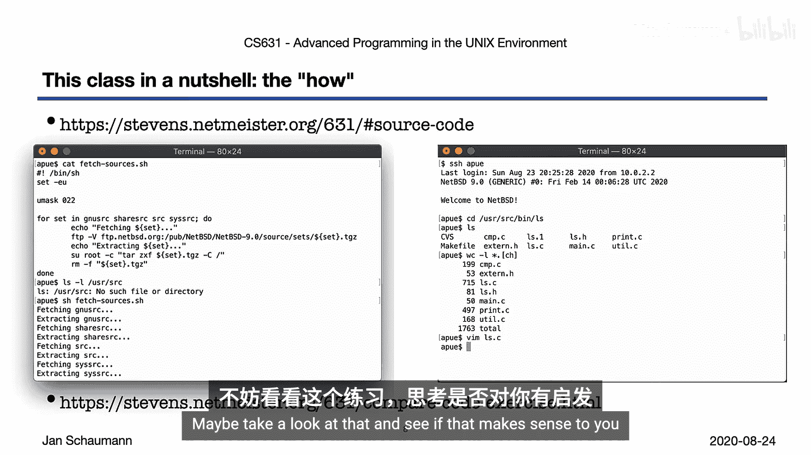

最后，C语言远未过时，事实上，它仍然无处不在。当我们查看标准库的不同API和接口时，会发现许多（如果不是大多数）高级编程语言最终都依赖于这些标准库。从系统角度来看，C语言仍然是事实上的标准。理解如何在UNIX环境中编写C语言将使您成为一名更全面的程序员。

## 学习环境与工具

现在我们知道要做什么以及为什么做，让我们看看如何去做。正如我们将在下一部分讨论的，UNIX操作系统家族的历史悠久而复杂，随着时间的推移出现了不同的变体。

在本课程中，我们需要一个单一的参考平台，以确保所有学生在相同的环境中工作，并且我可以在该平台上对您的作业进行评分。因此，我们将使用**NetBSD**操作系统作为我们的参考平台。

当然，您可以在您的macOS系统或Linux VPS上开发和运行代码，但最终，您的代码需要在NetBSD 9.0系统上编译和运行，我将在该系统上测试和评分。为了让您更容易上手，我整理了如何在VirtualBox虚拟机中安装NetBSD的分步说明。

这是我在整个课程中将使用的环境，这些幻灯片、讨论或邮件列表中显示的所有代码和终端示例或片段，除非另有说明，均来自NetBSD 9.0虚拟机。因此，尽早设置好这个参考平台符合您的利益。

## 代码阅读与风格

编程的另一个重要方面是能够阅读代码。事实上，阅读代码是一项关键技能，在编程或计算机科学教育中并不总是得到足够重视。

在本课程中，您应该养成大量阅读代码的习惯。幸运的是，如今许多流行的UNIX变体都是开源的，我们可以轻松浏览它们的源代码。能够驾驭整个操作系统源代码树并识别在哪里找到您要找的代码片段，是一项非常重要的技能。

NetBSD操作系统也是一个开源操作系统。因此，我建议您获取并解压源代码，熟悉代码库，浏览源代码树，打开几个源文件，看看不同的工具是如何实现的，以及如何跳转到C库等。

浏览源代码树，找到我们之前提到的实用程序，看看您是否能找到源代码，然后看看您是否能理解。另一个有趣的事情是比较不同系统如何实现相同的工具。

现在，显然阅读代码只是一部分。当人们听到“UNIX环境高级编程”时，想到的更明显的部分是，我们将在这门课程中编写大量代码，并且我将对您的代码质量非常挑剔。

代码是沟通。代码不仅对现在的作者来说需要易于阅读，对其他人也是如此。原因是，您将花费不成比例的大量时间来阅读和调试代码，而不是实际编写代码。

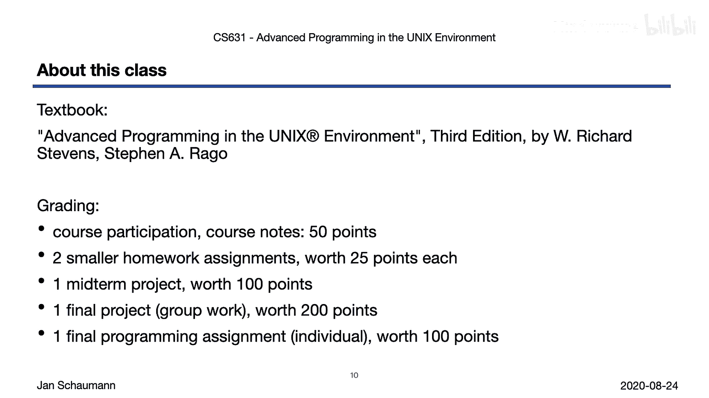

因此，对于本课程中的每一项作业和所有代码，请确保：
*   **结构清晰**：您的代码应被良好地分离、模块化，拆分为函数和不同的模块，以提供易于辨别的合理结构。
*   **格式规范**：代码需要格式良好，使用适当的换行和空格，并保持一致。
*   **风格一致**：我们将使用特定的编码风格，我将在所有作业中强制执行。
*   **命名有意义**：确保您在声明变量、使用函数或对象时，使用描述性和直观的名称。
*   **注释得当**：我们只在必要时提供注释。注释应解释**为什么**做某事，而不是**如何**做。

我们有一个编码风格指南链接在本幻灯片的底部。

## 课程评估与要求

现在谈更实际的事情。这是一门大学课程，您支付了高昂的学费。我们必须在学期末给您一个成绩。

即使这门课程是在线的，我们仍希望有互动交流。您的参与很重要。我期待您发言、贡献、提问、跟进讲座，并在精神上全程参与。

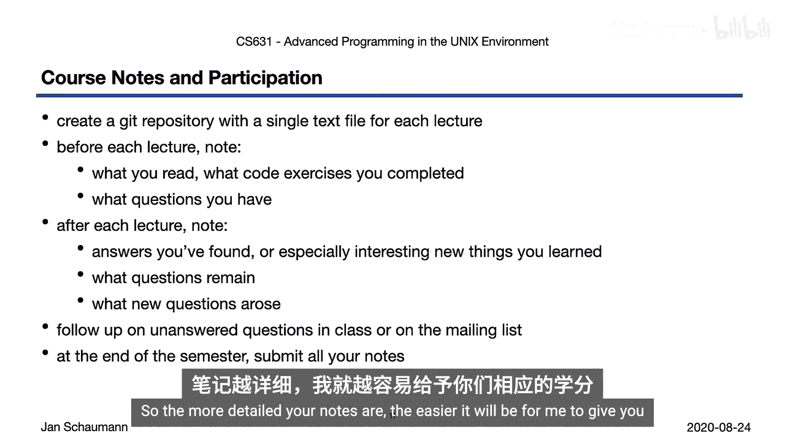

因此，课程参与以及每周以课程笔记形式进行的准备（我们稍后会详细讨论）将占50分。

将有两个较小的编程作业，代码量可能在200行左右。然后会有一个更重要的期中项目，在第二周后布置，代码量可能达到几百行，甚至多达2000行。之后会有一个由两到三人团队完成的大型项目，最后在学期末还有一个个人项目。

所有这些分数加起来总共500分。字母成绩的评定方式在课程网站上有说明。

## 课程笔记与作业提交

如前所述，您的课程参与将部分根据您所做的课程笔记进行评估。我发现这有助于学生为上课做好准备，并引导他们度过整个学期。

具体做法如下：您应该创建一个Git仓库，为每次讲座准备一个单独的文本文件。在每次讲座之前，在该文本文件中记录您阅读的内容、完成的代码练习以及您的问题。这应该能帮助您为课堂做好准备，然后在课堂或邮件列表中提出这些问题。

每次讲座后，我希望您回去写下您是否找到了问题的答案，或者记录下您学到的特别感兴趣的内容。当然，讲座中经常会出现新的问题，您可能也想记下来。

学期结束时，您将所有笔记提交给我。这样做的目的是让您有一种方式来回顾整个学期的进展。

我们布置的编码作业将发布到课程邮件列表，并在视频讲座中宣布。您有责任注意截止日期并按时提交代码。如果发生特殊情况，请立即联系我。如果情况需要，我可以批准延期。

考虑到当前情况并适应新的在线教学大纲，我还改变了本课程的另一个重要方面：将没有补考作业或学期末的额外学分。但是，如果您提交的作业没有获得A，您可以在一周后根据我的反馈重新提交改进后的代码，以提高成绩。

最后，我必须明确指出，您对自己的作业负责。每个学期，至少有一名学生提交非自己编写的代码。这构成抄袭，将立即导致不及格。即使我们使用的UNIX系统代码是公开可用的开源代码，您也不能将其作为自己的作业提交。

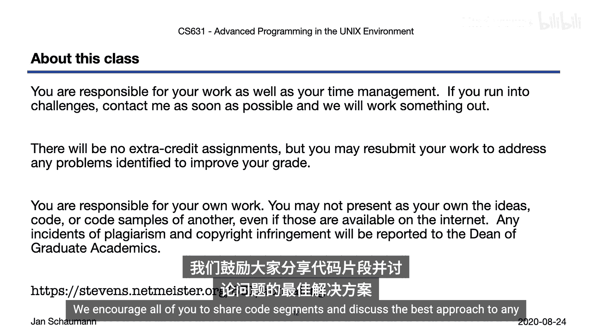

避免任何问题的最佳方法是坐下来自己编写所有提交的代码。如果您遇到问题或有疑问，请通过课程邮件列表联系，我们鼓励大家分享代码片段或讨论最佳方法。

## 教学大纲与资源

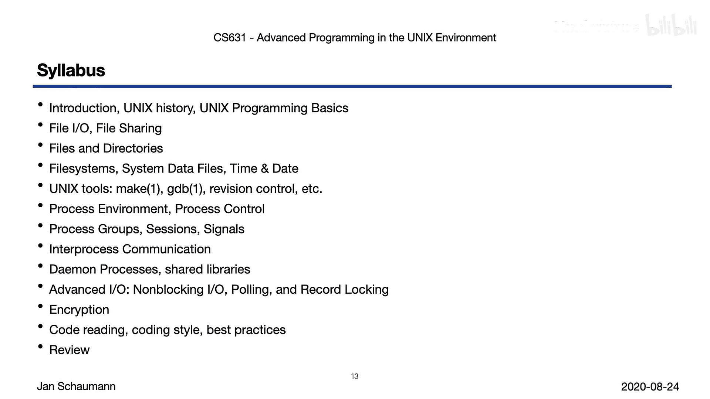

现在我们已经处理完所有这些形式上的事情，让我们看看我们的教学大纲。它将大致遵循教科书的提纲，尽管我们也会加入关于高效使用UNIX环境的讲座。

除此之外，我希望您能发现我们所涵盖主题的某种递进关系。我们将从本地文件I/O和文件系统开始，然后研究进程关系，接着是进程间通信和网络编程，最后通过一些混合和高级主题来完善我们对系统的理解。讲座的顺序可能会有所变化。

在这张幻灯片上，我整理了最重要的课程资源，您现在应该已经收藏了。

最关键的是课程网站链接，它是本课程的权威信息来源。请确保您参考课程网站获取所有材料。

第二重要的是课程邮件列表，这将是我们主要的沟通方式。我已订阅所有当前注册的学生。如果您没有订阅，请使用您的 `stevens.edu` 邮箱地址自行订阅。邮件列表是一个讨论列表，而不仅仅是公告列表。我期望您参与列表上的讨论。

我还为这门课程设置了一个Slack频道，并邀请了所有注册学生加入。Slack频道旨在让我们进行半同步的讨论，您可以随时分享链接、提问或进行代码分析。然而，虽然邮件列表是必读的，但Slack频道对您是可选的。

最后，这里链接到课程的YouTube频道，我将在每周完成后上传这些视频讲座。

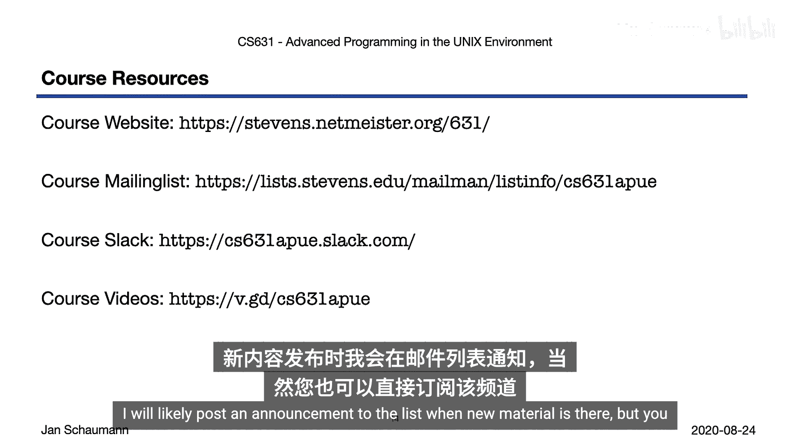

## 本周任务与总结

看起来我们即将到达第一部分的结尾，让我们回顾一下您需要完成的家庭作业，以便从这门课程中获得最大收益。我想强调的是，我期望您完成的家庭作业主要是为了引导您学习，并从这门课程中获得最佳和最多的经验。

对于每次讲座，您应该复习前一周的幻灯片和笔记，观看课程的视频讲座和幻灯片，跟进问题，关注课程网站上该周的链接，并完成推荐的练习。课程网站上有许多所谓的“推荐练习”，它们不是评分作业。我整理了一系列我认为能帮助您更好地理解该周主题的问题或任务，强烈建议您将其用作自学工具，以加深对主题的理解。

您还会注意到，我的讲座幻灯片包含大量代码片段。因此，我建议您在观看讲座后，花时间运行我们使用的命令和示例。这不仅能帮助您理解我们的目标，甚至可能教您一些UNIX环境中的技巧。

当然，您还应该按照我们的讨论更新您的课堂笔记。

对于本周，您的家庭作业基本上是为本课程做好准备：收藏所有资源、初始化您的课程笔记，并设置好您的NetBSD参考平台。如果您在这些任务中遇到任何问题，请发送邮件到邮件列表，我们将在那里讨论。

好了，这就结束了我们2020年秋季学期CS 631 UNIX环境高级编程第一周的第一个视频片段。我希望您能集中注意力，并发现这个视频讲座对您有帮助。本视频的幻灯片当然也可以从课程网站获取。

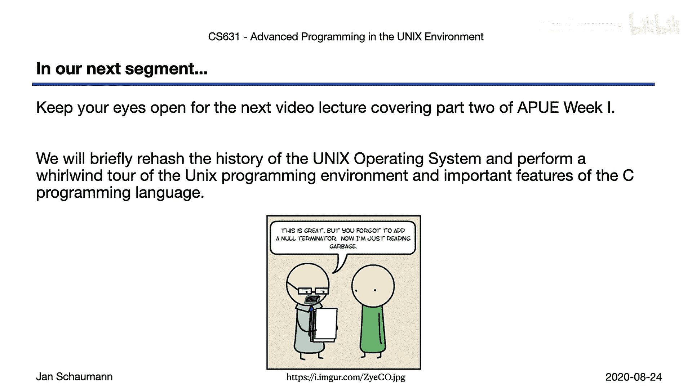

在我们的下一个视频片段中，我们将介绍UNIX的历史，并了解UNIX编程环境的一些基础知识以及C编程语言的重要特性。感谢观看，下次再见。