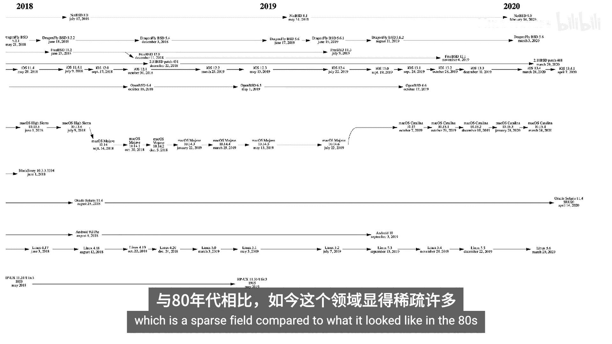
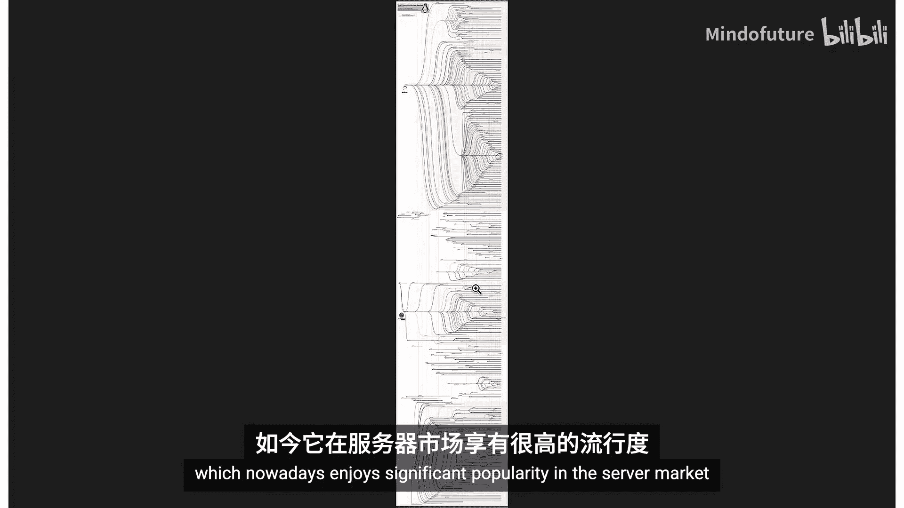
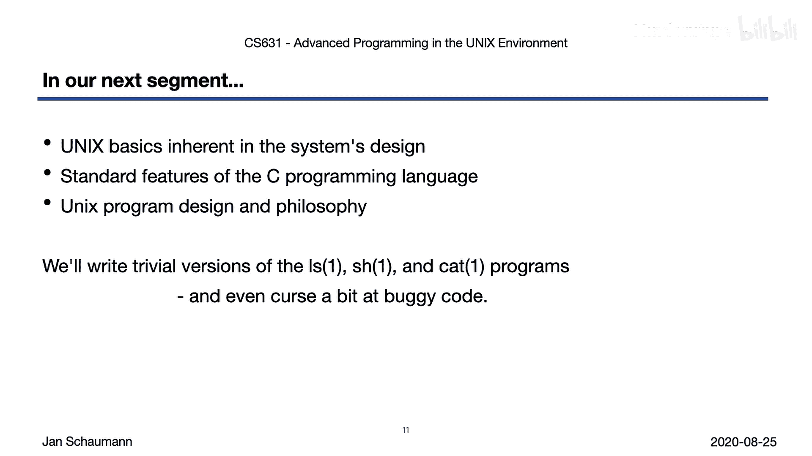

# 002：UNIX历史 🕰️

在本节课中，我们将简要回顾UNIX操作系统的历史。我们将了解其起源、发展过程中的关键事件、主要分支以及它如何演变成当今无处不在的操作系统家族。

## 概述

上一节我们介绍了课程大纲和整体安排。本节中，我们来看看UNIX操作系统的历史。这段历史充满了引人入胜的诉讼、观点分歧以及一场“圣战”（尽管我们避开了最敏感的政治争论，即`vi`与`emacs`的编辑器之争，以免冒犯任何人）。

## UNIX的起源

UNIX操作系统家族的发展历程漫长，从一个在PDP-7上运行的、用于测试和太空旅行游戏的平台，演变为如今使用最广泛的服务器操作系统。

它的历史始于新泽西州的AT&T贝尔实验室，由丹尼斯·里奇和肯·汤普森（如图中在PDP-11上工作的两位）与麦克罗伊博士、乔·奥桑纳等人共同开发，旨在替代Multics操作系统。

C编程语言是并行开发的，由丹尼斯·里奇在B语言（由肯·汤普森为编写的新操作系统开发）的基础上创造。里奇在幻灯片链接所示的文章中描述了该语言和操作系统的历史。

最终，大约在1973年左右，UNIX本身被用C语言重写了。

等一下，如果它是重写的，那最初是用什么写的？答案是：早期，UNIX是用特定目标平台和硬件的汇编语言编写的。只有当肯·汤普森和丹尼斯·里奇将C语言发展为系统编程语言后，他们才决定重写操作系统以利用这种新的高级编程语言。这样一来，操作系统变得可移植了，意味着它不再与特定硬件绑定，可以为其他平台重新编译。

## 传播与分支：BSD的诞生

1975年，肯·汤普森从贝尔实验室休假，前往加州大学伯克利分校担任客座教授。由于其母公司AT&T被禁止销售该操作系统，实验室将其连同完整的源代码一起授权给了学术机构和商业实体。

有人可能会认为，这最终直接导致了开源概念的产生。当时，加州大学伯克利分校的计算机系统研究小组通过他们的补丁集扩展了操作系统。研究生查克·哈利和比尔·乔伊（他于1982年共同创立了Sun Microsystems）添加了新的工具和其他软件，并最终开始将其作为伯克利软件发行版（BSD）进行分发。

在此期间，UNIX发展出了两个主要谱系：源自BSD或受其影响的系统，以及源自System V（最早的商业UNIX版本之一）的系统。

随着不同操作系统的持续开发，伯克利分校的人们在DARPA研究资助下编写了TCP/IP协议栈。这个协议栈至今仍是TCP/IP的默认实现，可以在许多其他操作系统中找到。

## 法律纠纷与开源演进

与此同时，一家名为BSDI的公司开始销售基于伯克利软件发行版的UNIX版本，称之为BSD/OS，并将其品牌化为UNIX。他们甚至有一个热线电话“1-800-ITS-UNIX”。贝尔实验室已将操作系统和源代码授权给伯克利，但BSDI销售的是基于此代码的产品，因此随后被UNIX系统实验室（USL，当时AT&T贝尔实验室的子公司）起诉。

BSDI声称他们不可能有过错，因为他们的代码来自加州大学伯克利分校。于是USL说，好吧，那我们也起诉加州大学伯克利分校。但事情变得有趣起来。

BSD补丁一直是在所谓的BSD许可证下授权的，简而言之，该许可证允许你随意使用这些代码，包括将其作为闭源产品销售，但你需要注明出处。听起来很简单，对吧？而且BSD补丁包含了许多很酷的东西：TCP/IP、NFS、vi等等。当时许多商业UNIX供应商已经将这些补丁整合到他们授权和销售的产品中。

只是USL似乎忘记了在他们的版权声明中包含免责声明，说明代码至少部分源自BSD——根据许可证条款，他们本应这样做。因此，当面临诉讼威胁时，加州大学伯克利分校那些“古怪的加州人”说：你知道吗，我们要起诉你。

一段时间后，案件达成和解。加州大学伯克利分校将重写那些受旧AT&T许可证限制的部分代码，从而形成一个没有任何专有代码的代码库，称为4.4BSD-Lite。当时，在18000个文件中，大约只有6个文件仍包含受限代码。最终，这些代码也被重写，4.4BSD-Lite版本的BSD成为了新的、无限制的版本。

## BSD的后裔与Linux的崛起

此时，BSD已经诞生了两个后代：NetBSD于1993年3月首次发布，侧重于可移植性和技术正确性；FreeBSD于1993年12月首次发布，侧重于新的i386平台。

与此同时，在芬兰，一位名叫林纳斯·托瓦兹的年轻计算机科学学生一直在研究Minix（由安德鲁·塔能鲍姆创建的类UNIX操作系统），并且刚刚完成了他自己的操作系统内核，称为Linux，于1991年在互联网上发布。

林纳斯为他的内核选择了GNU通用公共许可证。该许可证源自GNU项目，这是理查德·斯托曼在麻省理工学院于80年代初发起的一项努力，旨在开发一个完全自由的类UNIX操作系统。GNU项目已经编写了编译器、编辑器（当然是Emacs）、各种实用程序和其他所有东西，但直到此时他们一直缺少一个内核。没有内核的操作系统不是真正的操作系统，就像没有操作系统其余部分的内核也不是操作系统一样。因此，在GPL下发布Linux内核的公告使得GNU项目最终能够创建一个完整的操作系统：GNU/Linux。事实上，这才是如今每个人及其兄弟姐妹到处称之为“Linux”的操作系统的正确名称。

与BSD许可证相比，GPL对软件接收者施加了额外的限制。这似乎有违直觉，因为它是一个自由软件许可证，但它确实增加了一个重要的限制：你可以以任何你认为合适的方式自由使用代码，但如果你对代码进行了任何更改，这些更改必须在相同条款（即GPL）下发布。这与BSD许可证形成对比，BSD许可证仅声明你可以做任何你想做的事情，包括进行修改、保留这些修改，然后销售最终产品，只要你承认原始代码的来源。

这个新操作系统GNU/Linux的诞生，尽管许可证限制更多（通常可能使企业犹豫是否采用），但在USL诉加州大学伯克利分校/BSDI诉讼进行期间，可能直接导致了Linux比BSD变体获得更广泛的采用，并可能造成了Linux如今的市场主导地位。当然，我们无法确定，因为我们无法回到历史中去评估当时的“如果”。

## 市场演变与现状

无论如何，在整个90年代和21世纪初，许多商业UNIX版本失去了市场份额，但有趣的发展仍在继续。

以下是按年份列出的一些可能感兴趣的项目（当然，这不是一个详尽的列表）：
*   **2000年左右**：Darwin操作系统诞生，它源自NeXTSTEP，使用Mach微内核，用户空间代码来自FreeBSD和NetBSD。这并不奇怪，因为离开苹果后又在NeXT工作的史蒂夫·乔布斯一直在使用这个内核，并在重返苹果后开始开发这个后来演变为macOS 10的操作系统。
*   **Solaris**：继Sun Microsystems的SunOS之后的操作系统，在合并了许多BSD补丁和System V衍生功能后，开发了许多其他突破性功能，包括ZFS（一个具有新颖理念的非常先进的文件系统）、DTrace和容器（当时容器化尚未广泛使用）。
*   **Android**：Linux变体。
*   **iOS**：本质上是Darwin的一个版本，因此源自BSD。它们最终都运行在我们的移动设备上。

因此，在过去的50年里，我们看到了数量惊人的UNIX系统。其中一些是“正宗UNIX”系统，直接源自AT&T代码。一些是“商标UNIX”版本，意味着它们经过了认证以满足UNIX规范。这种商标认证费用昂贵，因此没有多少公司会这样做，而且每次进行更改都必须重新进行相同的认证。因此，许多操作系统供应商，尤其是开源项目，不会进行认证，也不会成为商标UNIX，即使它们是所谓的“类UNIX”系统。此外，还有所谓的“类UNIX”操作系统，意味着那些不共享任何代码行，但外观和行为都像UNIX系统的操作系统。

有趣的是，尽管这些不同的UNIX变体在很大程度上行为方式相同（意味着如果你会使用一个操作系统，你应该能够快速轻松地适应另一个；如果你能为一个操作系统编写代码，你应该能够快速为其他系统调整你的代码），但Linux与它们的区别在于，所有不同的Linux发行版只是Linux的发行版，是Linux的打包版本。而在所谓的“现实世界”中，你只会遇到这些不同操作系统中的一小部分。

以下是主要将它们分组为Linux、BSD和其他（尽管“其他”类别有重叠）的列表：
*   **Linux**：重要的是再次注意，Linux是一个类UNIX操作系统，只是恰好有数量惊人的发行版，不同的项目或公司将不同的软件捆绑在一起。
*   **BSD系统（如NetBSD, FreeBSD, OpenBSD, DragonFly BSD）**：它们是完整的、连贯的单元，不能拆分或重组。我们没有多个NetBSD发行版，只有一个NetBSD。

近年来，除了Linux、BSD和移动平台之外，商业UNIX平台的市场份额日益萎缩。因此，你不太可能遇到上一张幻灯片中展示的各种操作系统变体。尽管如此，其中一些仍然存在并努力工作中。

## 本课程的参考平台：NetBSD

我们本课程的参考平台是NetBSD。NetBSD是一个真正的、正宗的类UNIX系统，尽管它不持有UNIX商标。开源NetBSD基金会没有财力在每次发布新版本时都为其产品进行认证。但作为一个完整的操作系统，它不仅提供内核，还提供系统库和用户实用程序，所有这些都是一起开发的，提供了一个连贯的自包含的完整操作系统映像。

作为一个完整的操作系统，它还包含一些附加信息，例如与BSD相关的UNIX历史摘要。你可以在`/usr/share/misc`目录下找到这段历史，浏览这个目录树可能会很有趣。

为了真正理解“UNIX”一词的使用有多广泛、含义有多多样，让我们看一下完整的家族树。你可以看到从贝尔实验室原始系统分支出的大多数UNIX版本的时间线。

## Linux发行版的谱系

现在，以防你认为Linux本身的谱系不那么复杂，这里快速看一下不同的Linux发行版是如何随时间发展的。它看起来和常规的UNIX时间线图一样疯狂，不是吗？我们在这里也识别出几个主要谱系：Debian（导致Ubuntu及其所有变体）、Slackware（最古老的发行版之一）以及Red Hat Linux（现在以RHEL的形式在服务器市场享有很高的普及度）。

## 总结与影响

总之，正如我们所看到的，UNIX以及作为类UNIX操作系统一个版本的Linux的历史是多样化的。因此，如今我们发现UNIX几乎无处不在也就不足为奇了：它运行在你的台式机、笔记本电脑、服务器上；它为亚马逊和谷歌提供的公有云提供动力；它运行在你的电视、手机、手表、音响、汽车导航系统（意味着有时你可能需要靠边停车来安装软件更新）、恒温器、冰箱、烤面包机等等上。

这不仅令人着迷，也带来了一些影响。一方面，这意味着如果你理解UNIX，你将能更好地理解所有这些事物是如何工作的（这也是为什么本课程特别相关且希望对你感兴趣）。另一方面，这也意味着你的冰箱现在可能有一个CVE漏洞，你的恒温器运行着一个可能被黑客攻击的Web服务器。我们在物联网设备上运行通用操作系统，却没有充分考虑如何管理这些设备。

但请查看你一些设备的印刷手册，我相信你会发现许多版权声明，写着“本产品包含源自伯克利贡献的软件”或“本产品包含由加州大学董事会编写的软件”之类的话。

这是一个充满UNIX的世界，UNIX无处不在。

本节课中，我们一起学习了UNIX操作系统的简要历史，从其起源、关键的法律纠纷、BSD与Linux的分支发展，到其当前广泛的应用。在下一节中，我们将更仔细地研究系统的特性、C编程语言的特性，并讨论UNIX程序设计和哲学。我们最终也将开始编写一些代码来探索这些特性，请务必关注下一个视频讲座。