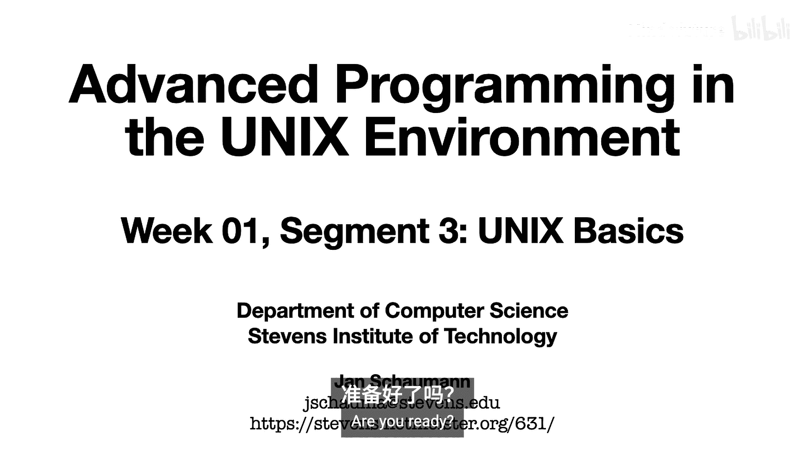
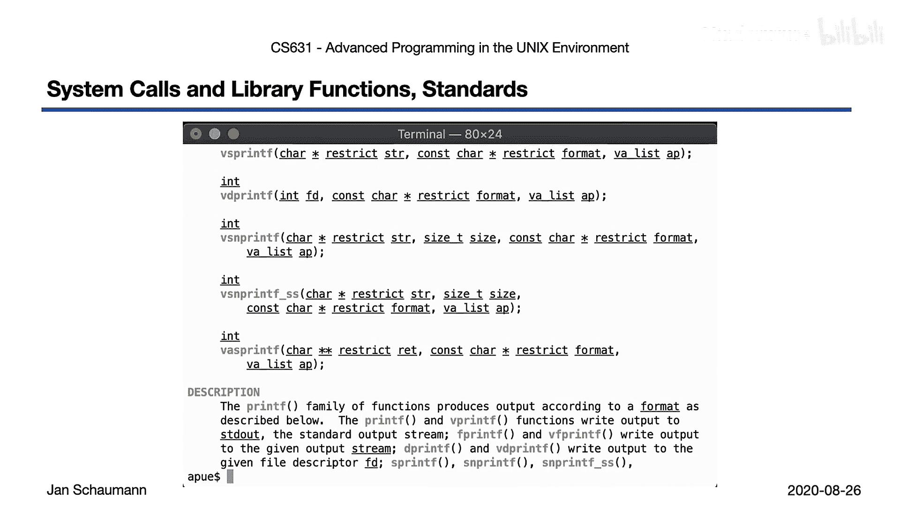
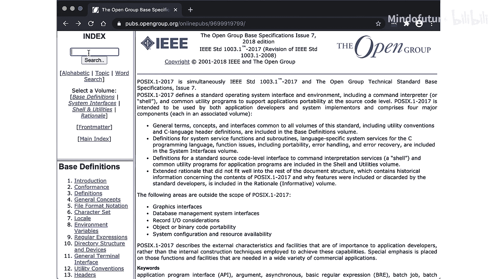
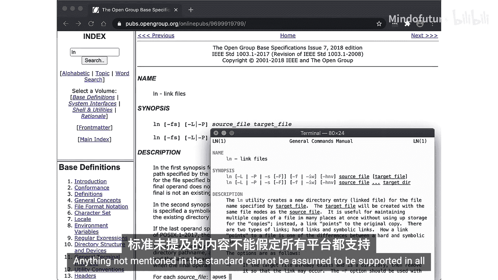
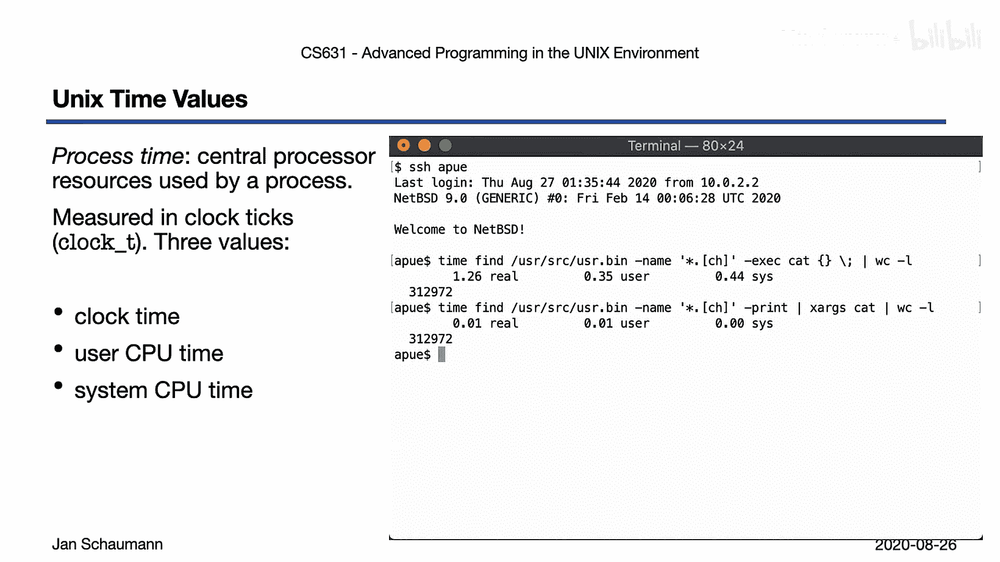
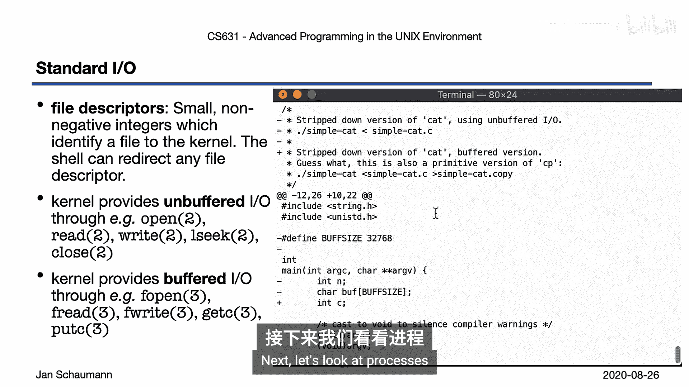
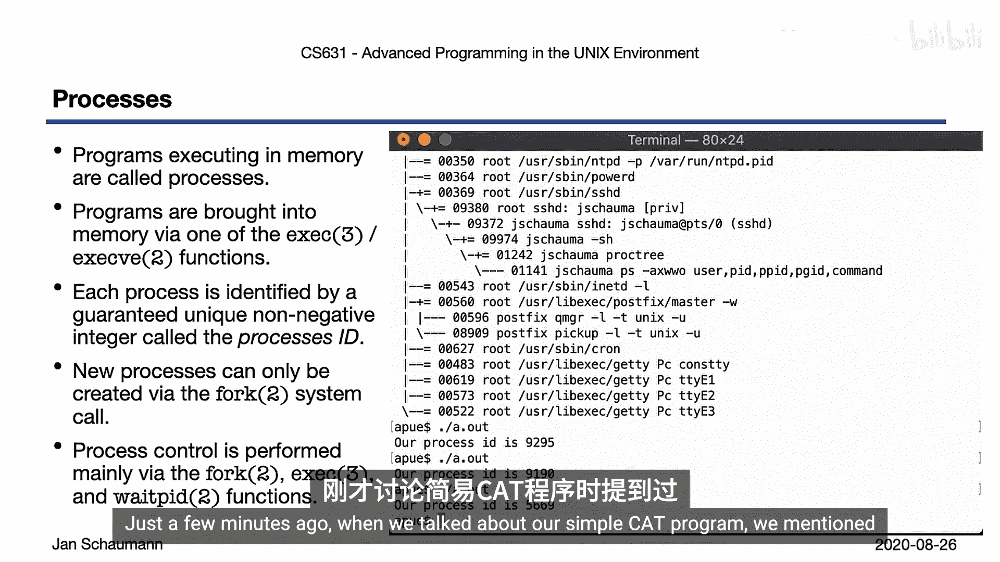
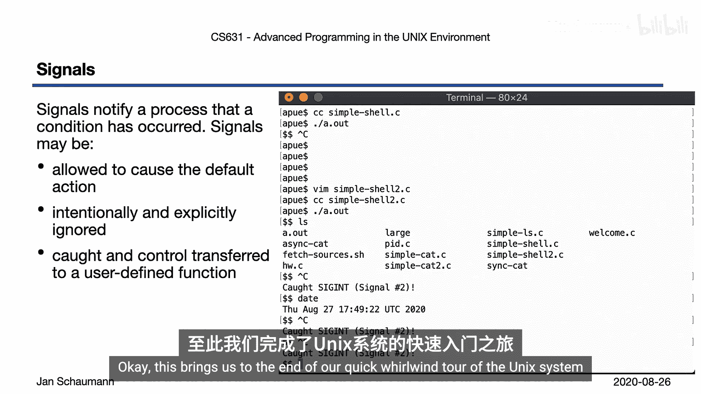
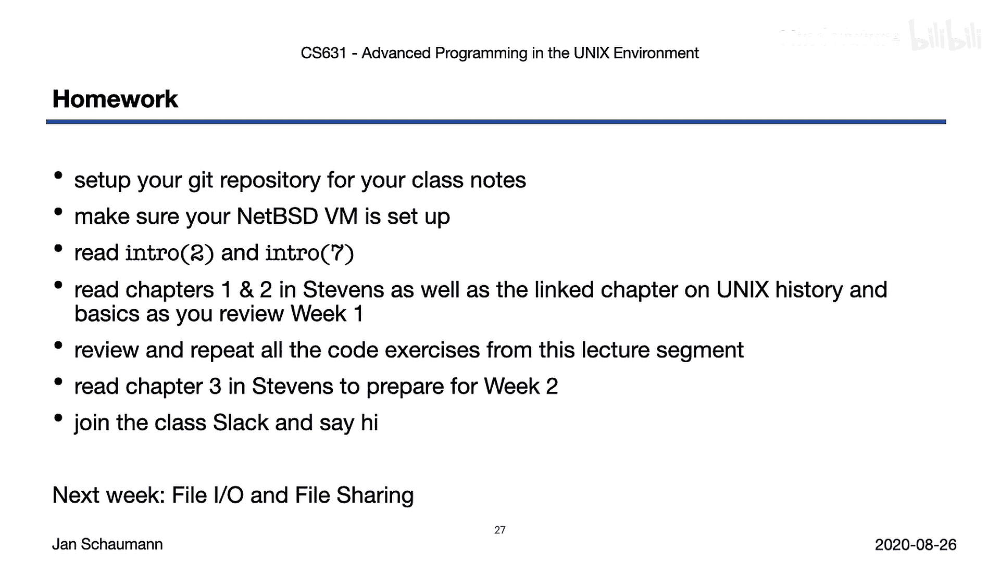

# 003：Unix基础

在本节课中，我们将学习Unix操作系统的基础知识，并运行一些重要的功能示例。我们还将开始编写代码，请确保准备好你的NePSDv环境并登录，以便跟随示例操作。

## Unix系统架构概述

上一节我们介绍了课程背景，本节中我们来看看Unix操作系统的基本设计。其核心是一个**单体内核**，负责所有繁重的工作，如初始化硬件、管理内存、任务调度、处理文件系统和进程间通信等。

大多数Unix版本使用这种单体内核。主要的例外是Linux（真正的微内核）和Darwin（Mac OS, iOS等使用的混合内核）。

操作系统提供少量称为**系统调用**的接口，它们是进入内核空间的钩子。系统调用可以被运行在用户空间的**库函数**包装。应用程序通常调用这些库函数，但也可以直接调用系统调用。

图中的Shell虽然被单独标出，但实际上只是一个常规应用程序。由于它提供了主要的用户界面，所以我们将其单独列出。稍后我们将更详细地了解Shell的功能和工作原理。

## 使用手册页

Unix系统提供了详细的手册页形式的文档。如果你不知道某个函数的作用或用法，无需依赖搜索引擎或Stack Overflow，只需查阅相关的手册页即可。

Unix系统的手册页分为多个部分。我们将使用括号内标明章节的标准表示法。例如，`write`系统调用在手册页的第2节，而`printf`库函数则记录在第3节。

## POSIX标准

考虑到Unix历史的多样性，我们需要就系统行为达成某种共识。正如之前讨论的，存在一个Unix认证，这意味着有一套规则必须遵守。

Unix系统的美国标准被称为**POSIX**（可移植操作系统接口），它定义了API、命令行工具和接口，以确保软件在不同Unix变体间的兼容性。该标准后来发展成为**单一Unix规范**。

在实践中，这意味着什么？让我们快速了解一下。

为了澄清术语的使用以及我们如何引用命令、库函数或系统调用，我们来查看几个手册页。

如果我们简单地输入`man printf`，我们会得到第1节（通用命令）的手册页。但通常我们需要的不是命令行工具，而是库函数。因此，我们必须明确指定章节：`man 3 printf`。这会显示我们想要的`printf`库函数的描述。

类似地，如果我们输入`man write`，会得到`write`命令的描述。但`write`是一个系统调用，因此它记录在手册页的第2节：`man 2 write`。

请注意，`man`命令总是会拉取找到的第一个页面。例如，输入`man fprintf`会直接显示第3节的手册页，因为不存在名为`fprintf`的命令或系统调用。

在本学期的电子邮件和书面作业中，我们将始终使用明确指定手册页章节的约定来引用命令或函数。

## 标准与现实

你可以在开放组织的网站上找到单一Unix规范，建议你收藏这个网站。该文档提供了许多定义和一个搜索索引。

如果我们搜索`ln`命令的POSIX定义，页面看起来很像手册页，提供了概要、描述、命令和选项定义，以及关于环境等的更多信息。特别有用的是“原理”部分，它解释了为什么选择某些行为。

现在，让我们将标准与我们感知到的现实进行比较。在标准中，我们看到一个工具为符合POSIX必须支持的命令和选项。

当我们在NePSSD系统上打开手册页时，会注意到我们的`ln`版本支持标准中未提及的额外标志。这没关系，标准只定义了最低要求。了解哪些选项是POSIX要求的，哪些不是，可以帮助你在编写可移植脚本或代码时更好地设定预期。标准中未提及的任何内容都不能假定在所有平台上都受支持。

## C编程语言

尽管C编程语言是在Unix系统上并为其开发的系统编程语言，但它是一种与操作系统无关的语言，因此拥有独立于Unix系统定义的标准。

C语言从早期的K&R C发展而来，于1989年正式标准化为ANSI C。此后，发布了多个新版本。你的编译器可能支持也可能不支持某个特定版本。如果代码依赖新版本的某些特性，你需要明确这一要求。然而，语言的变化远不如其他语言（如Python 2.x与3.x）那样剧烈。

ANSI C引入的重要特性包括：

*   **函数原型**：允许使用前向声明，意味着我们可以将编程接口与实现分离。
*   **通用指针（void指针）**：可用于引用未指定类型的对象，因此具有通用性。这提供了很大的灵活性，但也带来了一些风险，因为粗心的指针操作可能导致软件错误和漏洞。这个特性是C语言“给你足够长的绳子吊死自己”的例子之一。
*   **抽象数据类型**：使用C实现Unix使操作系统具有可移植性，抽象数据类型是提高可移植性的特性之一。我们只需将它们声明为指定类型，类型的实现则留给操作系统，对我们是不透明的。例如，`time_t`数据类型过去通常实现为32位整数。为了避免2038年问题，许多操作系统将其切换为64位整数。使用抽象类型的好处是，应用程序代码无需更改，只需在新平台上重新编译即可。

## 错误处理与errno

编写良好的C程序遵循Unix最佳实践，即返回有意义的值。程序总是通过返回一个数值来指示是否成功完成。如果该值为0，则程序成功终止；否则，表示发生错误。

更重要的是，错误类型通过返回码传达给用户。考虑到任何程序都可能因多种原因失败，让程序用户能够轻松识别失败原因而无需解析错误消息是很有用的。

这就是**errno**的用武之地。`errno`是C标准库的一部分，它是一个整数值，代表失败的原因。数字代码对计算机很好，但人类更喜欢文字。因此，我们有`strerror`和`perror`这两个有用的库函数，它们接受`errno`值并返回适合显示给用户的错误字符串表示。

在本课程中，我们将严格使用有意义的返回值以及`strerror`等来打印有意义的错误消息。“出错了”不是一个有用的错误消息。“无法打开文件：权限被拒绝”才是。将这些模式融入你的编程肌肉记忆是一个好主意。

## 第一个代码示例：welcome.c

好了，让我们终于开始写点代码吧。我已经将本课程使用的所有示例程序打包并放在网站上。建议你在B D VM上获取并解压。

解压后，进入lecture 1目录，你会找到一个名为`welcome.c`的文件，这是一个最简单的打印问候语的程序。

首先，我们获取源代码。使用`ftp`工具，因为NePSSD默认没有安装`curl`或`wget`。解压后，找到我们的`welcome.c`程序。在编译之前，先复制一份文件，以防我们想修改它并需要回退更改。

让我们编译它。编译器似乎在终端输出了一些垃圾信息，但那些应该无关紧要，直接运行`./a.out`。等等，没有`a.out`文件？这并不奇怪，因为编译器告诉我们有错误。欢迎来到C编程世界。

幸运的是，编译器准确地告诉我们错误是什么，以及在文件中的位置。让我们修复这个错误：有人忘了在语句末尾加分号。加上它，保存文件，再次编译。这次没有错误。我们可以通过运行`echo $?`来检查上一个命令的返回码，它显示0，表示编译器成功完成。

确认我们得到了可执行文件，忽略编译器打印的其他垃圾信息，直接运行`./a.out`。结果段错误了。我们在用C编程，但哪里出错了？

让我们再看一下编译器的输出。编译器给出了一个警告：关于`getlogin`的隐式函数声明。这是什么函数？别去谷歌这个错误。记得我说过你可以使用手册页来帮助你。试试`man getlogin`。`getlogin`返回一个`char *`。我们用了`%s`，这应该是对的。再编译一次？也许第一次有太阳黑子干扰，再做一次同样的事肯定会得到不同的结果，编程就是这样，对吧？同样的警告。

让我们仔细看看。“隐式函数声明”是什么意思？不出所料，它意味着没有该函数的前向声明，这是我们之前提到的ANSI C特性。我们从手册页知道了函数原型，为什么不直接加上它呢？在头文件下添加函数原型，保存，再次编译。太好了，没有警告了。编译器成功，可执行文件存在，运行它。成功了！程序成功完成，没有段错误，甚至做了我们想做的事。

但为什么我们必须自己添加函数原型？这似乎很繁琐。让我们再看一下手册页。注意在概要部分，手册页还告诉你应该包含哪个头文件。这个头文件包含了相关函数的前向声明。

编译器给了我们警告，但我们的程序却段错误了。这也不太好。让我们回退并重新开始。这次，我们将添加一些编译器标志，指示编译器启用更多警告，并且实际上不仅仅是警告，而是将所有警告视为错误，这样我们就不能盲目忽略它们。

现在我们的输出显示了之前关于缺少分号的相同错误，但有一个新的额外错误消息，并且将之前的警告改为了错误。这个额外的错误消息准确地告诉我们为什么会出现段错误：如果编译器不知道函数返回什么，它会假设返回一个整数。不幸的是，`printf`格式说明符`%s`期望一个字符串，但我们的编译器设置为整数，因此导致段错误。

让我们再次修复。首先，修复缺少的分号。和之前一样，这留下了另一个错误。但这次，有了我们额外的编译器标志，编译器不会成功，而是会中止。曾经是警告的内容现在变成了致命错误，以防止我们做傻事。

现在，从手册页我们也记得要包含正确的头文件，所以让我们添加它，而不是自己提供前向声明。再次编译，等等，要带上正确的编译器标志。成功了！

这是一个典型的C编程过程，一行代码首先无法编译，然后触发段错误。在本课程中你会看到很多这样的情况，但大多数时候，通过注意编译器告诉你的内容，你可以避免它们。

在Unix系统上，程序生成的消息是有意义的，不应被忽略。因此，我们将始终启用所有警告，并始终将警告视为错误。这有助于防止我们犯自己的错误。为了确保我们不会忘记启用这些标志，让我们将它们添加到shell启动文件中并创建一个别名。设置好后，你可以简单地调用`cc`，它将使用正确的标志。

关于可以启用的其他警告标志列表，请查看此链接。你也可以选择添加更严格的标志。但请记住，对于本课程，你的所有代码必须始终符合`-Wall -Werror -Wextra`标志。

## Shell的工作原理

回到我们简要介绍过的架构图，我们讨论了系统调用与库函数。接下来让我们看看Shell。

Shell到底做什么？简化到核心，Shell真的没做太多事。它永远循环，读取用户的命令，然后执行它们。所以我们可以用几行代码写一个非常简单的Shell，让我们开始吧。

再次，请考虑暂停视频，在继续之前阅读代码。但好吧，我们一起做。请注意，这里我们明确表示只尝试执行命令，并指出了几个限制。毕竟，这是世界上最简单的Shell。

我们的主循环很简单。如承诺的那样，我们永远循环，打印Shell提示符，然后从用户读取输入到缓冲区。一旦我们从用户那里获得输入，就`fork`一个新进程。如果这里出现任何问题，我们将遵循最佳实践，通过`strerror`函数生成有意义的错误消息。你总是可以从代码中查看手册页。否则，一切正常。

我们执行给定的命令。再次，如果发生任何意外，我们生成一个错误消息并以有意义的退出状态退出，而不是随机数字。最后，父进程等待子进程终止，然后循环回去再次读取输入。如果没有正常输入，我们成功退出。

你注意到我们使用的退出状态了吗？我们如何决定使用哪些，它们来自哪里？`sysexits`手册页包含了所有有用的信息。使用任意值调用`exit`不是一个好习惯。我们想要有意义的返回码。浏览手册页，你会发现许多错误场景的退出代码。适当地使用它们是一个好习惯。

让我们编译这段代码。快速提醒一下，我们设置了别名以使用正确的编译器标志。当我们运行`cc simpleshell.c`时，没有警告，没有错误，一切看起来都很好。

运行这个Shell。我们可以运行简单的命令，如`who am i`或`ls`或`date`或`cat`。等等，为什么我们的`cat`调用不起作用？或者`ll`？为什么如果之前的`ls`调用成功了，这个却失败了？

注意错误信息。它说“无法执行`ls -l`”，而不是“无法执行`ll`”。这是因为我们的Shell真的只处理单个单词。它执行我们给定的任何内容。

让我们退出Shell。等等，为什么我们甚至无法退出？我们的循环继续从用户读取输入，直到没有输入。所以现在我们必须以某种方式提供“无输入”，即，我们必须向程序发送一个文件结束字符。大多数终端设置为通过组合键`Ctrl+D`生成此文件结束字符以结束循环。试试看。成功了！

所以我们已经看到，世界上最简单的Shell确实有些限制，但尽管如此，最基本的“读取-执行”循环可以用几行代码完成。

## Unix哲学

在这个Shell和代码示例中，我们已经触及了一些核心的Unix编程最佳实践。Unix环境的一大优点是它行为一致。也就是说，基于标准，其上的工具在不同Unix版本间行为一致；而且，未包含在标准中的工具也以可预测的方式行为。

一致性是Unix哲学的重要组成部分，它规定了环境的行为，使得每个工具都能融入并与其他工具结合。这也将是我们为本课程编写的所有程序的目标。我们编写的程序不应看起来像明显的CS课程作业，而应看起来、感觉起来和行为起来就像是操作系统的一部分。如果你没听说过Fred Brooks，你应该查阅他的书《人月神话》，这是任何CS专业学生的必读材料。

Unix哲学简单而强大。简而言之，它规定程序应该简单。也就是说，它们不应试图在单个程序中解决所有问题。构建多个更小、更简单的工具比构建一个过于复杂的单一工具更可取。

你应该遵循“最小意外原则”。用户不应对工具的行为感到意外，无论是在成功用例中，更重要的是在出错时。当你编写工具并不确定应该以某种方式处理某个用例时，问问自己作为用户会期望什么。

我们应该接受标准输入并生成标准输出。这允许你避免文件I/O的复杂性（我们将在下一课中讨论），并确保你的程序可以与其他工具结合。

你应该生成有意义的错误消息到标准错误。将程序生成的正常输出与你产生的任何错误消息分开是很重要的。通过分离它们，你的工具在与其他工具结合的方式上变得更加灵活，用户可以选择将输出和错误消息重定向到不同的地方。

你的工具也应该有一个有意义的退出码。正如我们讨论的，我们希望能够在无需解析错误消息的情况下识别程序何时遇到问题。错误消息是给人类用户的，错误码是给计算机的，供其他工具检查和反应。这也有助于使你的工具成为更有用的构建块。

最后，你的Unix工具应该有一个手册页。手册页是环境的重要组成部分。它们记录了工具并为用户提供了参考，但作为程序员，编写手册页也是一个非常好的习惯，因为它有助于你澄清和定义用户界面。

## 管道的威力

应用Unix哲学的一个结果是，我们可以将小型工具（构建块）组合成更复杂的东西。这主要是通过管道将它们串联起来实现的。

Unix实践总是操作三个标准文件描述符：标准输入、标准输出和标准错误，这允许组合不同的工具，其中一个工具的输出用作另一个工具的输入。

Unix管道由Doug McIlroy发明。为了更好地说明Unix管道的威力，考虑如何组合小工具可以让你创造出原始工具作者无法预料的东西。

假设你想知道在10个最常访问的英文维基百科页面上找到的最长单词是什么。这里有一个实际完成此任务的管道。在家试试，看看你是否理解每一步的作用。当然，这是一个任意的例子，但我相信它说明了使用管道所带来的灵活性。

## 文件系统基础

我相信你们大多数人都知道，Unix文件系统是一个树形结构，所有分区都挂载在根目录（也称为`/`）下。文件名可以由除斜杠和空字符外的任何字符组成，因为路径名是由斜杠分隔的零个或多个文件名的序列，当然，空字符在C中终止字符串，因此不能包含在名称中。

我们将在未来的讲座中深入了解Unix文件系统的细节，但现在让我们快速了解目录。目录是一种文件类型。具体来说，它们提供了文件名与用于在文件系统本身中引用和查找文件的内部数据结构（inode）之间的映射。也就是说，文件名不是文件的属性，而是目录中的一个条目，一种查找文件对象的方式。将目录视为一个简单的查找表，它可以通过文件名的映射为我们提供与文件关联的数据，我们已经可以猜出像`ls`这样的工具可能如何工作。

是时候看另一个代码示例了。你知道该怎么做：暂停视频，阅读代码，运行此处显示的命令，然后回来。

`ls`命令的一个简单实现不必非常复杂。这个版本只有34行代码，包括注释和头文件。让我们看看。如果我们查看`main`函数，我们已经看到了完整的功能，尽管很简单。我们期望被给予一个参数，即要列出内容的目录。然后我们使用 aptly named `opendir`库函数打开目录，然后循环遍历通过`readdir`在目录中找到的所有条目，打印我们找到的目录条目的名称。完成后，我们关闭目录并返回。

运行它。如承诺的那样，我们需要给定一个目录名。让我们给它当前工作目录，也称为`.`。很好，目录中找到的所有条目都逐行打印出来。注意输出没有排序。系统`ls`命令的行为可能不同。如果我们给它另一个目录，比如我们的主目录，我们会看到更多文件，包括那些以点开头的文件。同样，系统的行为不同，因为它默认隐藏这些文件。但就文件系统而言，以点开头的文件并没有什么特别。默认不显示它们只是`ls`命令的一个约定。

到目前为止，我们已经写了一个简单的Shell和一个`ls`命令的版本。接下来看看还有什么。

## 用户、组与时间

在Unix系统上，所有用户都由一个数字值标识。计算机喜欢数字。但我们这些愚蠢的人类不喜欢被称为数字，所以我们想出了用户名。但就计算机而言，每个用户只是一个UID，并且可能属于多个组，这些组也由数字GID标识。

`who am i`命令打印有效用户的用户名，手册页告诉我们这个命令实际上已被弃用，推荐使用`id`命令。如果我们单独运行`id`命令，我们会得到数字UID以及符号用户名，以及组ID和组名。

Unix系统需要一种表示时间的方式，它通过计算自任意选择日期（1970年1月1日午夜，即Unix纪元）以来的秒数来实现。有趣的事实：Unix创建于1969年，早于Unix纪元。我知道，我知道，正是这种琐事让这门课值得一上。

所以，我们实际上有一个计数器，我们需要以某种方式表示这个数字。正如前面解释的，使用抽象数据类型（具体来说是`time_t`）是有用的，因为计算机系统上的任何资源都是有限的，不幸的是，时间有持续向前移动的明显趋势，所以这个值必须持续增加，可能导致回绕。具体来说，使用有符号32位整数可以存储的自1970年1月1日以来的最晚时间是2038年1月19日星期二03:14:07。那时，日历将回绕，日期将变为1901年12月13日，这对大多数应用程序来说可能不太好。幸运的是，大多数设计运行在64位硬件上的操作系统已经使用有符号64位`time_t`整数。通过使用`time_t`，即使是那些使用有符号32位整数的操作系统也可以更改为使用64位值，而无需修改所有应用程序，尽管它们需要在给定平台上重新构建。

这里的另一个重要教训是，每当你做出这样的改变时，我们实际上是在把问题往后推，因为即使是64位计数器最终也会回绕。然而，64位计数器能够表示的日期大约是宇宙估计年龄的200亿倍以上，所以64位计数器的新回绕日期大约是从现在起的2920亿年。大多数人认为这不是一个重大问题。

但除了计算自纪元以来的秒数之外，还有更多时间概念。有时我们想知道一个程序运行了多长时间。这个时间以三个不同的值衡量：**时钟时间**（总共经过的时间）、**用户CPU时间**（进程在用户空间花费的时间）和**系统CPU时间**（进程在内核空间花费的时间）。你可能会合理地认为系统时间加用户时间等于时钟时间，但不幸的是，情况并非如此。进程被阻塞时（例如，等待I/O）所经过的时间既不计入用户时间，也不计入系统时间。

这里有一个例子。让我们找出`/usr/bin`下所有工具的所有用户源文件中有多少行代码。我们运行`find`命令，找到所有相关文件，并通过管道传递给`wc`命令。我们看到大约有312,000行代码，该命令总共花费了约1.26秒，其中0.35秒花费在用户空间，0.44秒花费在内核空间。注意，缺失了0.47秒，这是实际I/O等待时间。

如果我们对`find`使用`-exec`标志，我们将为每个文件调用一次。我们能优化吗？让我们尝试首先生成文件列表，然后使用`xargs`来减少调用次数。现在快多了。文件系统可能通过缓冲区缓存进行了一些优化，我们将在下一课中更详细地讨论。现在，我们只需注意，我们可以使用这些时间测量作为优化程序的一种方式，也可以找出程序在哪里花费了最多时间。

## 文件描述符与I/O

如前所述，Unix工具操作标准输入、标准输出和标准错误。这些是默认连接到终端的文件流，分别由文件描述符0、1和2表示。但文件描述符的概念不仅限于这些数字。所有文件I/O都基于文件描述符，这些是表示所讨论文件的小型非负整数。

正如我们已经看到的，Shell可以重定向任何文件描述符。这方面的例子包括无处不在的管道，其中一个程序的标准输出成为另一个程序的标准输入；当然，你们也都已经使用过将输出重定向到文件或`/dev/null`等。

文件I/O通常有两种风格：**缓冲**和**无缓冲**。正如你可以通过查看此处引用的手册页看出的那样，无缓冲I/O由系统调用完成，发生在内核空间。相比之下，缓冲I/O由库函数实现，因此在用户空间执行。

简而言之，你的`printf`提供缓冲I/O，你要求系统打印某些内容，它会说“好的，我马上打印”，但实际上它对你撒谎了。相反，系统会缓冲输入，通常取决于或受输出连接到什么的影响。例如，输出到终端是行缓冲的，意味着库使用换行符来指示应该刷新其缓冲区。而无缓冲I/O将在系统调用完成时立即执行。

我们将在下一讲讨论所有（嗯，大部分）I/O内容，但根据我们在此总结的内容，我们已经可以用不到50行代码编写`cat`命令的简单实现。

在我们查看代码之前，让我们想想`cat`命令实际上做了什么。它从标准输入读取数据，然后写入标准输出。所以毫不奇怪，我们的简单`cat`将做同样的事情。让我们看看主循环。注意我们使用的是常量`STDIN_FILENO`和`STDOUT_FILENO`，而不是数字0和1。这是我们将在整个课程中遵循的通用实践。我们避免使用所谓的“魔数”，这些数字假定阅读代码的人知道它们的含义；相反，我们使用符号名称或适当的命名变量。为了保持一致性，即使几乎所有Unix系统确实将`STDIN_FILENO`定义为0，`STDOUT_FILENO`定义为1，我们也这样做。我们希望养成习惯，建立肌肉记忆，尽可能避免魔数。

同样，我们不使用任意整数初始化缓冲区，而是使用符号名称。我们如何选择这个数字，我们将在下一讲中讨论。

很简单，对吧？让我们看看它是否按预期运行。我们输入数据，程序完美地回显给我们，很好。由于我们的程序只要有标准输入数据就会循环，我们需要发送EOF（文件结束符）来指示输入结束。如前所述，我们可以在终端按`Ctrl+D`。现在让我们尝试获取一个文件。这似乎没有达到我们想要的效果。它只是停在那里。这是因为我们的程序根本没有编写来处理任何命令行参数。它总是从标准输入读取。

中止程序的另一种方式，你们可能都很熟悉，是按`Ctrl+C`，这会生成中断信号。这与生成EOF不同。在这种情况下，我们通过信号导致程序异常退出。

在我们的Shell中，我们注意到任何文件描述符都可以被Shell重定向，包括标准输入。Shell使用小于号`<`语法来实现。所以如果我们运行这个命令，我们会得到文件内容在标准输入上，我们的简单`cat`程序很好地打印到标准输出，正如我们预期的那样。

现在，如果我们将标准输出重定向到另一个文件会发生什么？比如说`/tmp/copy`。我们有效地复制了文件，这并不奇怪。毕竟，复制文件真的只意味着你必须打开一个文件，读取所有输入，将所有数据写入另一个文件，然后就完成了。通过使用Shell提供的重定向，我们避免了程序中处理打开文件的复杂性，我们40行的简单`cat`也有效地是`cp`程序的实现。

好了，我们的简单`cat`使用了`read`和`write`，这是无缓冲I/O。让我们看看如何使用缓冲I/O编写相同的工具。嗯，这里没有太大不同。唯一的区别是，我们使用`getc`和`putc`，而不是`read`和`write`。运行它。是的，和以前一样。这两个版本之间的代码差异真的很小。我们可以像以前一样复制文件，会发现已经创建了一个真正的副本。但在这个例子中，缓冲和无缓冲I/O确实没有太大区别。

## 进程与信号

任何在内存中执行的程序都称为**进程**。进程由一个小型非负整数标识，称为**进程ID**或**PID**。你只能通过`fork`系统调用来创建新进程，运行另一个程序的一般流程是`fork`，然后`exec`可执行文件，并等待它。正如我们之前编写最简单的Shell时看到的那样。

我们当然会在未来的讲座中讨论进程的所有细节。让我们先玩一下，热热身。首先，安装一个名为`pstree`（有时称为`proctree`）的工具，它将帮助我们说明进程关系。

当我们运行`proctree`时，我们看到系统如何创建不同的进程。它启动了`sshd`，为我的用户创建了一个会话，该会话运行一个登录Shell，现在运行`proctree`命令，该命令本身似乎使用此处显示的标志调用`ps`命令。

我们如何知道当前的PID？我们可以使用`getpid`。运行这个命令。这是当我们运行打印`getpid`的程序的`./a.out`时创建的进程的进程ID。Shell本身有不同的进程ID，我们可以通过让它回显`$$`变量来打印它。与`proctree`的输出进行比较，我们可以确认Shell没有对我们撒谎，它的PID确实是9974。

注意，如果我们运行打印PID的程序，我们总是会得到一个不可预测顺序的不同数字。这也意味着，如果你查看进程表，现在看到一个PID为1234的进程，五分钟后再次查看并看到一个PID为1234的进程，你无法保证那仍然是同一个进程。PID可以被重用。所以如果一个进程终止，下一个启动的进程可能会得到那个PID。

最后，快速提一下信号。就在几分钟前，当我们讨论简单`cat`程序时，我们提到你可以使用`Ctrl+C`中断程序。这个按键组合按照惯例生成中断信号，进程接收中断信号的默认操作是异常终止。

所以我们已经看到了信号的作用。更一般地说，信号是通知进程某种条件已发生的简单方式。作为程序员，你可以选择对此信息执行以下操作之一：

*   你可以什么都不做，意味着你允许默认操作发生。这就是我们在简单`cat`示例中所做的。
*   你可以有意且明确地忽略信号。这是说，每当这种情况发生时，我不在乎，我不会对此做任何事情，但我也不会允许默认操作发生。
*   最后，你可以选择每当此事件发生时执行自定义操作。

信号处理涉及许多复杂性，我们将在本学期晚些时候介绍。让我们简要回到我们之前的最简单Shell。当我们运行简单`cat`并按`Ctrl+C`时，简单`cat`终止了。这正是我们想要的。

但现在考虑一下，当你运行的程序是一个Shell时会发生什么。如果我们在这里按`Ctrl+C`，Shell退出了。这真的不奇怪。但另一方面，这真的不是我们想要的，对吧？想象一下，如果你登录到一个系统，每次你不小心按了`Ctrl+C`，Shell就退出，你就会被锁在系统外。

那么当我们在常规登录Shell中按`Ctrl+C`时会发生什么？按一次，两次，三次。看起来Shell只是再次打印提示符，它没有退出。

所以让我们改变我们的简单Shell，使其行为类似。注意，在我们的`main`函数正上方，我们定义了一个名为`sighandler`的函数，它仅仅打印出我们已经捕获了中断信号。为了确保安装这个信号处理函数，我们在开始主循环之前调用`signal`函数。这实际上是在说，嘿，每当用户碰巧生成中断信号时，不要只是中止，而是跳入我为你编写的`sighandler`函数。其余部分与我们的原始Shell完全相同。

运行这个新Shell，看看是否有效。命令执行仍然有效，按`Ctrl+C`。嘿，看，它起作用了，很好。

## 总结

本节课我们一起学习了Unix系统的基础知识和编程环境。我们已经编写了许多程序：首先我们调试了愚蠢的`welcome`程序，并讨论了正确编译器标志的重要性；然后我们编写了一个简单的Shell，并刚刚扩展它以添加信号处理程序；我们编写了一个简单的`ls`克隆，并编写了两个版本的`cat`。对于我们第一周来说，这还不错。

请务必仔细阅读这些代码示例，并在以后自己重复它们，确保你为本课程设置好了环境并初始化了课程笔记。如果你有任何问题或任何困难，请通过课程邮件列表发送或发布在Slack上，我们可以在那里以及我们周一的第一次Zoom同步课上讨论。

为下一周做准备，请确保阅读Stevens书中的第3章。我将在下周某个时间发布该材料的视频讲座。感谢观看，再见。