# 004：在Apple M1的UTM中安装NetBSD evbarm教程 🖥️

## 概述

在本节课中，我们将学习如何在搭载Apple M1芯片（基于ARM架构）的Mac电脑上，使用UTM虚拟机软件安装NetBSD操作系统的evbarm移植版本。我们还将配置SSH连接，并创建自动化脚本以简化虚拟机的启动和关闭过程。

---

## 为什么选择UTM？🤔

上一节我们介绍了课程将使用NetBSD作为参考平台。如果你没有将NetBSD作为主操作系统，创建一个虚拟机来完成课程作业会很有用。本视频将帮助你完成设置。

课程网站也提供了使用Oracle VirtualBox虚拟机的说明。但如果你尝试在最新的Apple硬件上安装VirtualBox，会发现它仅支持Intel芯片。因此，如果你的系统搭载Apple M1芯片（基于ARM的处理器），那么VirtualBox将无法使用。

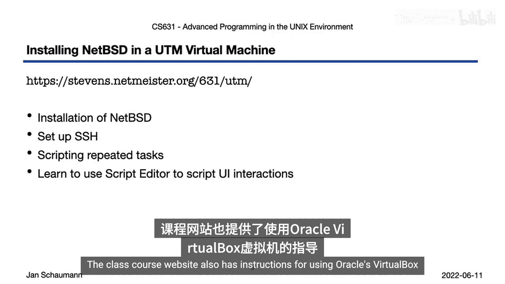

所以，我们转而使用UTM。让我们前往 `mac.getutm.app` 下载UTM。下载后，安装过程很简单，只需将应用图标拖入“应用程序”文件夹即可。

---

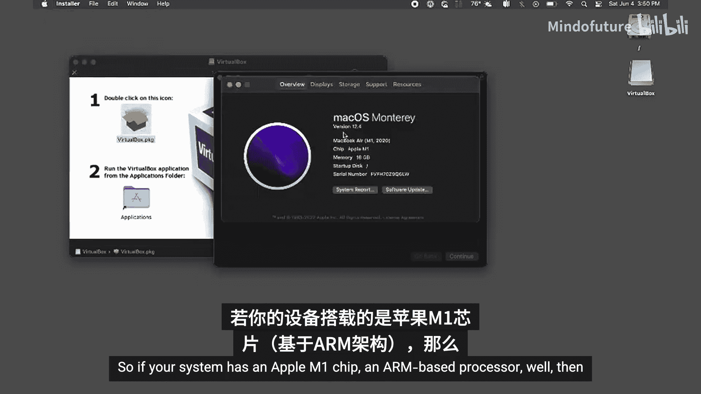

## 获取NetBSD安装镜像 📥

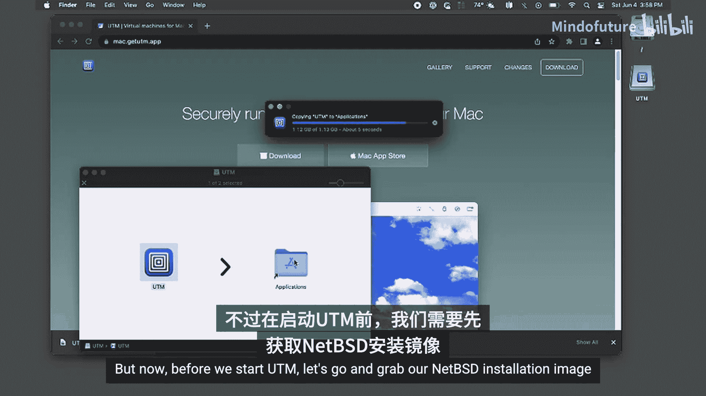

在开始UTM之前，我们需要获取NetBSD的安装镜像。

访问NetBSD项目网站，可以看到截至2022年6月，最新版本是NetBSD 9.2。不幸的是，该版本无法在M1芯片的UTM上运行。因此，我们需要获取NetBSD的最新开发版本，即NetBSD-current。

前往 `www.netbsd.org/releases/current.html`。NetBSD-current是每日开发快照，让你可以试用推送到代码仓库的所有最新代码。

你可以自己从源代码构建整个系统，也可以从这个URL下载预构建的快照镜像。我们点击进入最新构建，然后搜索安装镜像。

在这里，我们可以看到针对不同NetBSD移植版本的许多ISO镜像。我们需要寻找 `evbarm-aarch64` 镜像，然后将其下载到桌面。

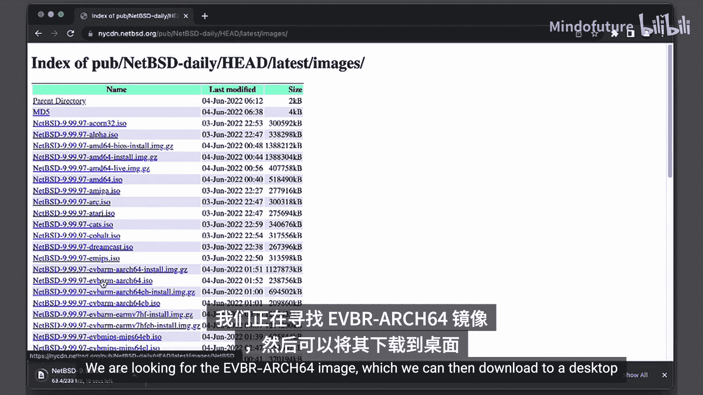

---

## 创建并配置UTM虚拟机 ⚙️

现在，我们有了NetBSD的ISO镜像。接下来启动UTM，并选择“创建新的虚拟机”。

系统会询问我们是要模拟不同的硬件，还是虚拟化当前硬件。我们选择“虚拟化”，然后在操作系统屏幕中选择“其他”。

接着，加载我们之前下载的ISO镜像，然后继续。

在接下来的几个屏幕上，我们基本上可以接受默认选项，但可以将存储空间调整为16GB（甚至更少也可以）。最后，我们将虚拟机命名为 `APUE` 并保存。

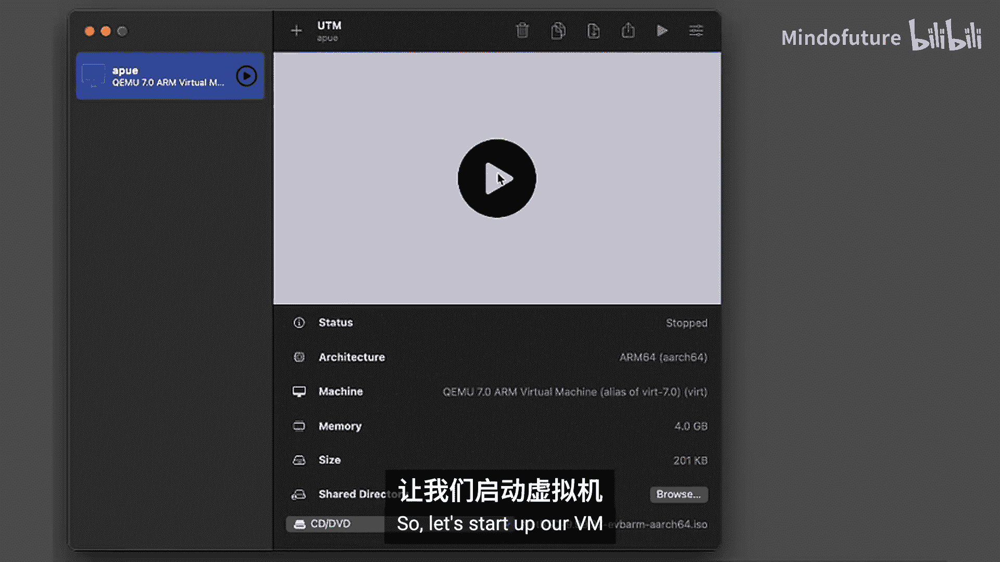

在启动之前，让我们快速进入虚拟机偏好设置。在这里，我们可以看到关于虚拟机的信息。UTM基于开源的QEMU，你可以看到传递给QEMU的所有不同选项。你甚至可以在这里添加额外选项，例如添加第二个网络接口。

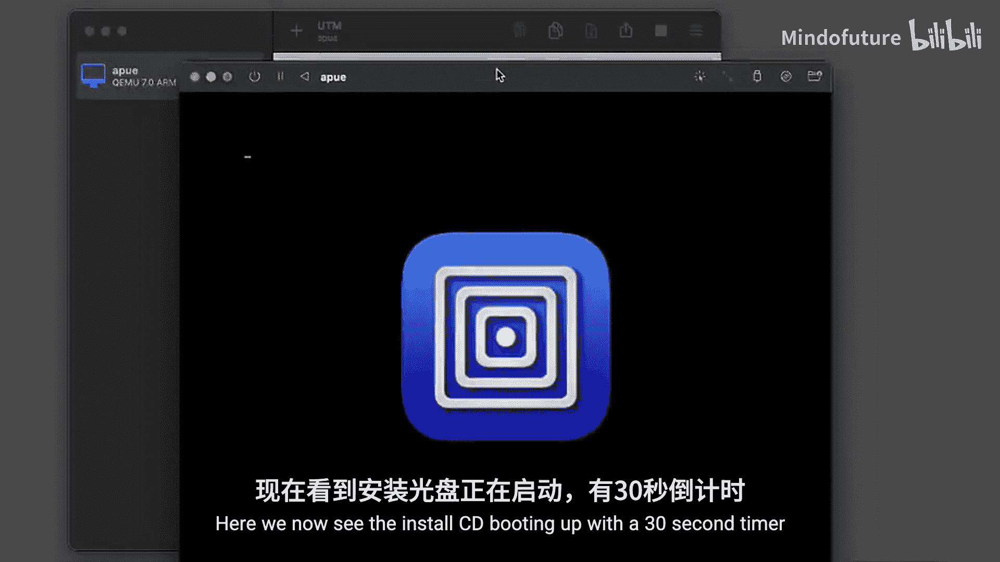

谈到网络，让我们查看一下。将其更改为“桥接”接口，以允许虚拟机获得完整的网络功能。

现在，我们准备启动并安装NetBSD。

---

## 安装NetBSD系统 🚀

启动虚拟机后，我们会看到安装程序启动，并有一个30秒的倒计时。你可以等待倒计时结束，或者直接按回车键启动。

启动后，将进入菜单驱动的安装程序。我们选择英语安装消息，然后选择第一个选项，将NetBSD安装到硬盘。

我们选择“是”以继续。安装程序检查磁盘，由于只有一个，我们选择它（例如 `ld0`）。我们使用GPT分区表来分区磁盘，然后使用默认的NetBSD分区方案，这会给我们一个小型引导分区、一个大型根分区和一些交换空间。

现在，准备将此信息写入磁盘并创建文件系统。这是一个破坏性操作，无法撤销，因此安装程序要求我们确认。

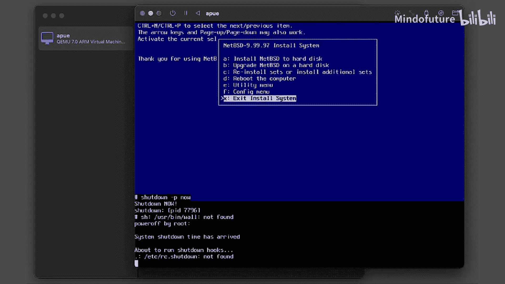

文件系统创建完成后，我们选择安装类型。我们进行完整安装，但不需要X11窗口系统，因此选择选项B。我们从CD获取软件包，然后继续。

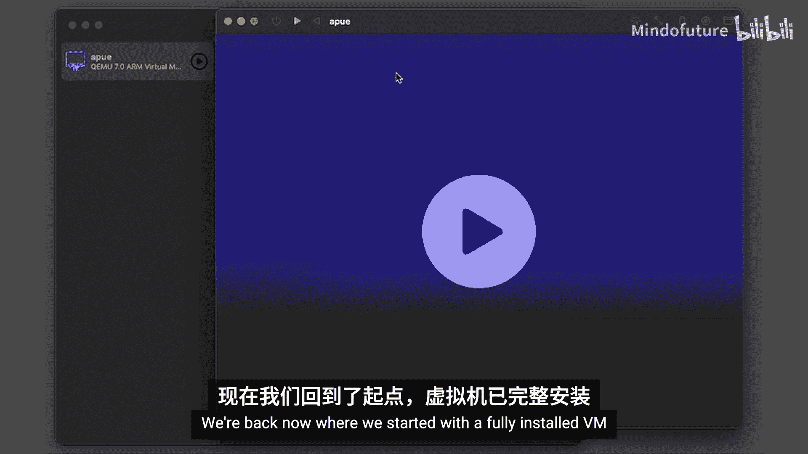

软件包解压后，我们可以执行一些配置步骤。首先设置root密码，然后进入配置菜单。

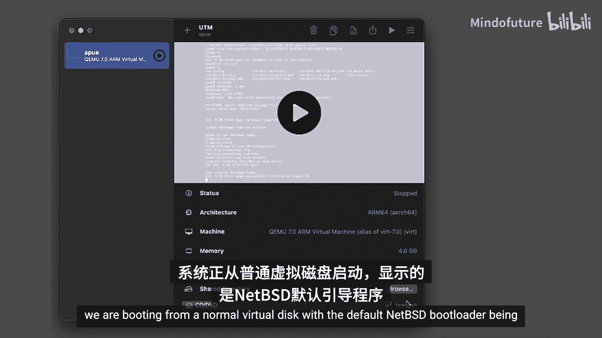

以下是配置步骤：
1.  从配置网络开始，选择 `a` 并按回车。我们接受默认值，让DHCP自动配置。
2.  将虚拟机命名为 `APUE`，域名留空，然后接受此系统配置。
3.  返回配置屏幕，向下滚动，启用SSHD。
4.  启用NTPD和NTP日期同步。
5.  最后，添加一个普通用户。选择一个你喜欢的用户名，并将其添加到 `wheel` 组，以便可以切换到root。选择你的shell并设置密码。

现在，我们完成了系统配置，返回到主安装菜单。完成后，退出安装程序并完全关闭虚拟机。

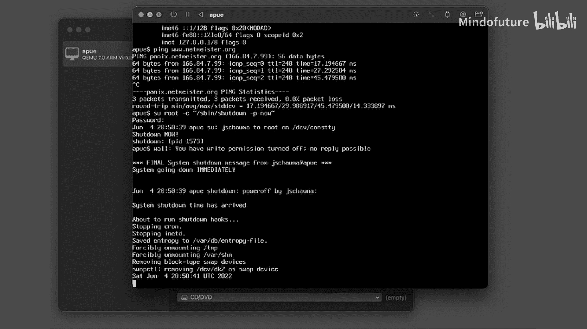

---

## 首次启动与基础配置 🔧

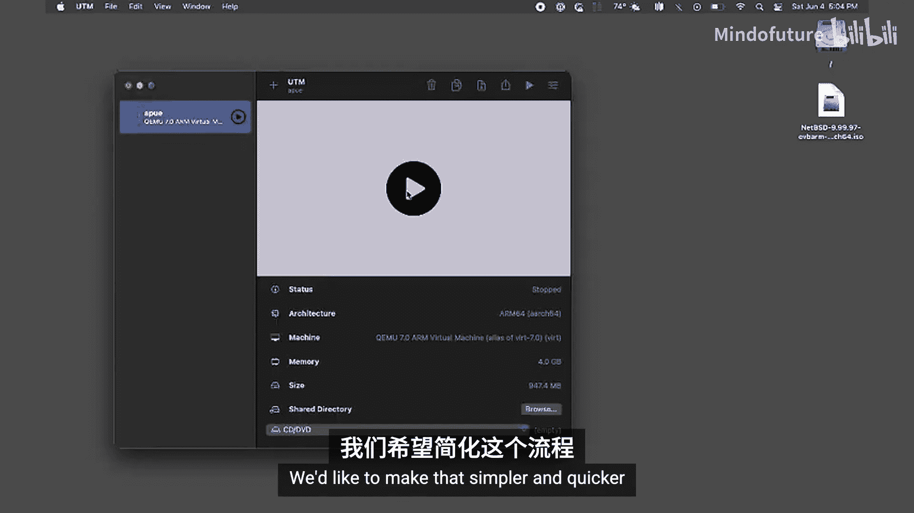

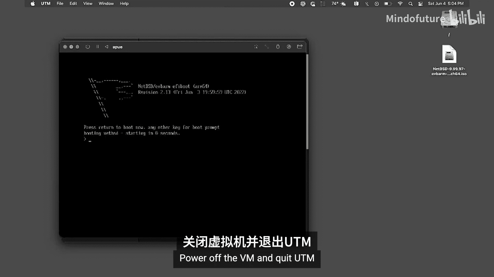

我们回到了起点，但现在拥有了一个完全安装好的虚拟机。在底部，我们清除CD驱动器以移除安装镜像，这样下次启动时就会启动实际的虚拟机。

现在，如果我们启动虚拟机，会看到从普通虚拟磁盘启动，并显示默认的NetBSD引导加载程序。默认5秒超时后，内核启动，初始化各种服务，然后我们就可以登录了。使用我们创建的用户账户登录。

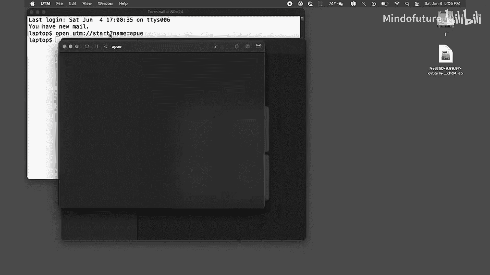

让我们查看网络配置，确保可以访问互联网。一切正常。

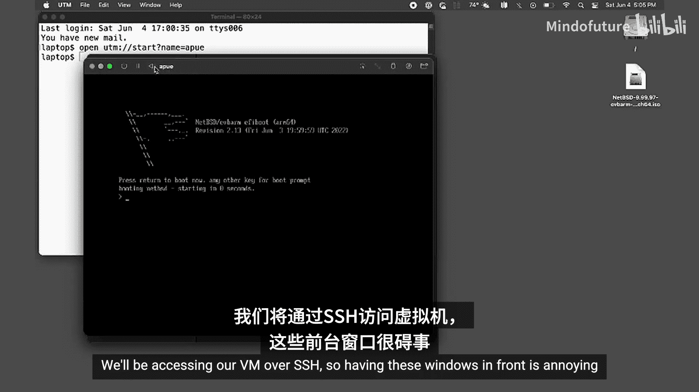

要关闭虚拟机，我们可以切换到root用户并运行关机命令，如下所示：
```bash
sudo shutdown -p now
```

---

## 自动化虚拟机启动 🚀

现在，我们的虚拟机已设置完毕。但让我们看看是否能简化启动过程。目前，每次运行虚拟机时，我们必须启动UTM，选择正确的虚拟机，点击启动等，这有点烦人。我们希望使其更简单、更快捷。

因此，让我们暂停一下，关闭虚拟机并退出UTM。

由于我们几乎所有的操作都在命令行中进行，我们也希望有一种从终端启动虚拟机的方法。让我们打开终端并尝试以下命令：
```bash
open utm://start?name=APUE
```
UTM应用注册了 `utm://` URL协议，因此调用 `open` 命令现在将启动我们的虚拟机。

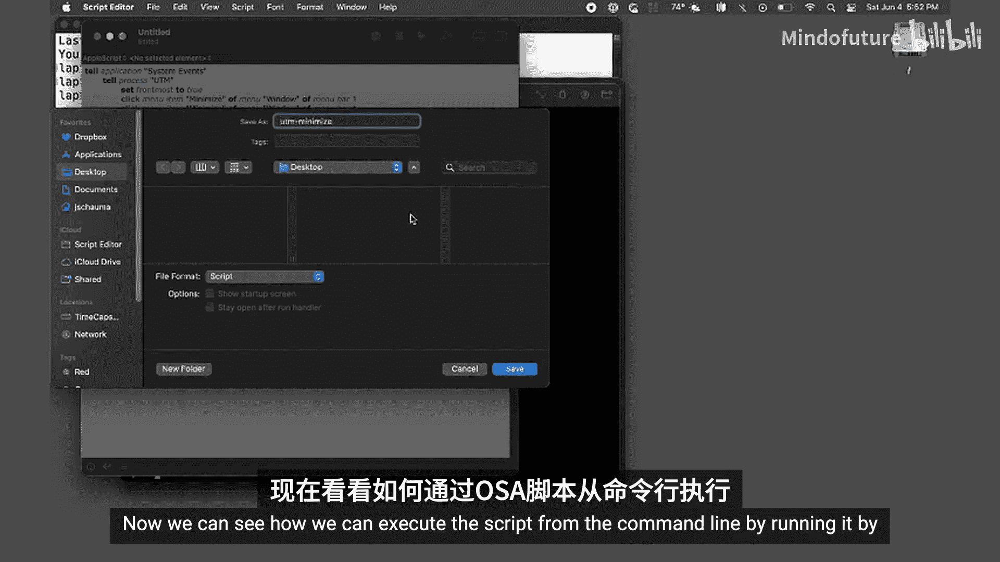

但这仍然会让两个UTM窗口显示在前台。我们将通过SSH访问虚拟机，因此这些窗口在前台很烦人。

让我们再次停止，看看是否能找到一种方法让这些窗口不碍事。在VirtualBox中，有一种以无头模式运行虚拟机的方法，但UTM似乎不支持。因此，我们必须发挥创意。

我们不能在没有UTM运行的情况下启动虚拟机，但我们不需要它在前台。幸运的是，在macOS中，你可以使用“脚本编辑器”应用来编写与UI交互的脚本。让我们打开它，创建一个新文档，并放入以下脚本：
```applescript
tell application "System Events"
    tell process "UTM"
        set frontmost to true
        click menu item "Minimize" of menu "Window" of menu bar 1
    end tell
end tell
```
编译后，脚本显示它所做的只是将UTM窗口带到前台，然后选择前台菜单中的“最小化”选项。我们有两个窗口，所以需要执行两次。

让我们测试一下。首先，需要再次启动虚拟机。现在，随着虚拟机启动，我们测试脚本。点击播放按钮，UTM窗口被最小化了。

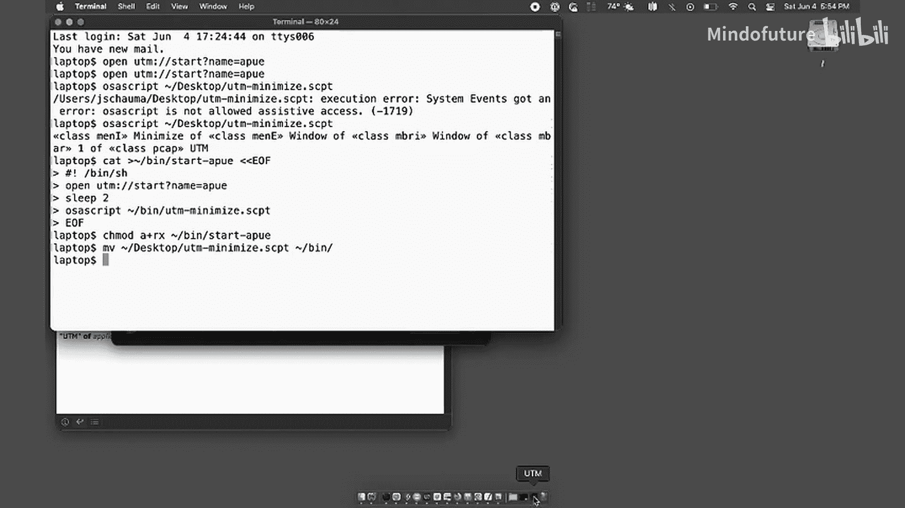

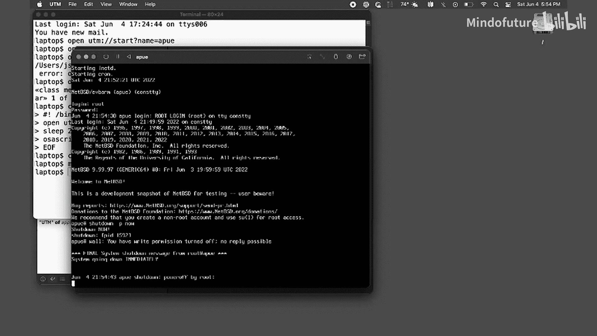

现在，我们可以从命令行通过运行 `osascript` 来执行脚本。但第一次尝试可能会失败，并提示 `osascript` 没有辅助功能权限，需要显式启用。

为此，打开“系统偏好设置”，进入“安全性与隐私”，选择“辅助功能”，验证后添加“终端”应用。现在再试一次，应该可以了。

现在，我们可以将这两个步骤（打开UTM并启动虚拟机，以及最小化窗口）结合到一个简单的shell脚本中。我们会在命令之间加入短暂的休眠，以确保在尝试最小化之前UTM确实已经启动。

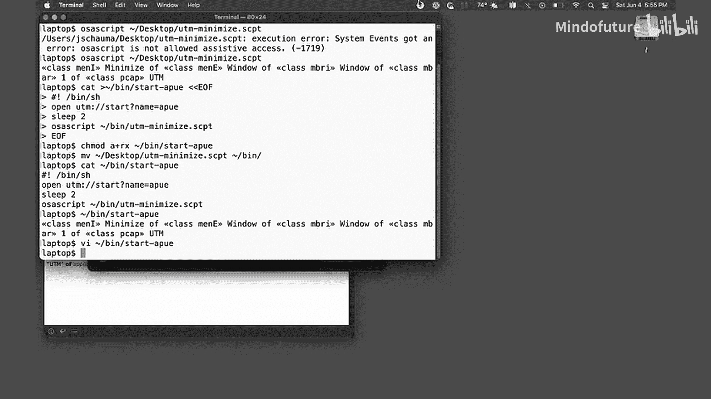

然后，我们将UTM最小化脚本移动到一个合理的位置，并给新脚本执行权限。现在，我们应该可以运行它了。

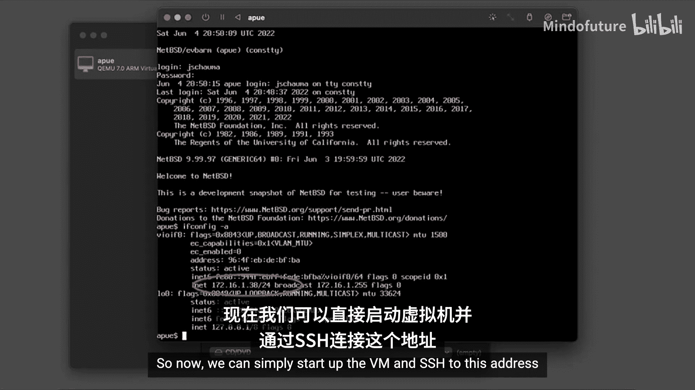

---

## 配置SSH免密登录与自动化关机 🔑

现在，我们已经有了轻松启动虚拟机的方法。让我们思考如何同样轻松地关闭它。为此，我们需要能够登录到虚拟机，将其关闭，然后终止UTM。但为了使用SSH，我们需要知道IP地址并设置SSH，这样就不必每次都输入密码。

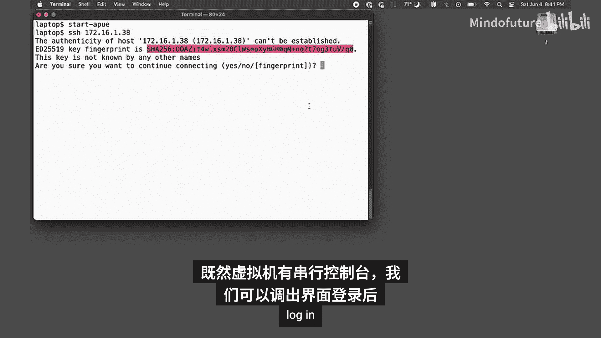

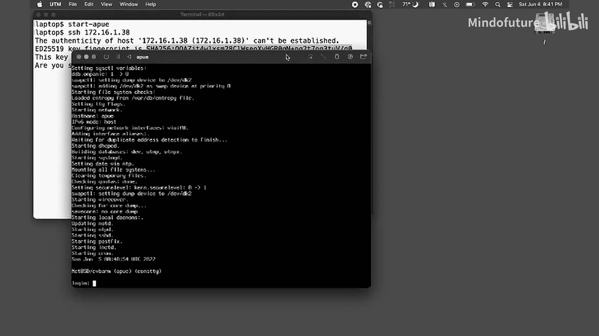

还记得我们第一次登录虚拟机时，运行了 `ifconfig`，它显示了分配给虚拟机的IP地址。因此，我们可以简单地启动虚拟机并通过SSH连接到这个地址（例如 `172.16.1.38`）。

这是我们第一次连接到虚拟机，所以会收到关于未知主机密钥指纹的警告。与互联网上100%的用户不同，我们实际上关心真实性，并且会在发送密码之前检查这个指纹是否正确。

由于我们在终端上有一个串行控制台，我们可以在这里登录，然后运行以下命令来获取主机密钥指纹：
```bash
ssh-keygen -l -f /etc/ssh/ssh_host_ed25519_key.pub
```
然后比较两个指纹。如果一致，就可以连接。

但我们希望能够在不需要输入密码的情况下进行SSH。因此，让我们设置一个SSH密钥。首先，在虚拟机上创建 `.ssh` 目录。然后在父系统上生成一个新的SSH密钥对，我们将其命名为 `APUE`。接着，将公钥复制到虚拟机作为授权密钥。

接下来，我们在 `~/.ssh/config` 文件中创建一个简单的条目，添加正确的地址和我们刚刚生成的SSH密钥路径。这样，我们现在只需输入 `ssh apue` 就可以登录了。

最后，拼图的最后一部分是自动化虚拟机的终止。首先，让我们简化操作，移除root账户的密码。我知道这听起来是个糟糕的主意，但在这种情况下，实际上是可以的。你马上就会明白为什么。

请记住，我们的虚拟机只能通过笔记本电脑的虚拟控制台访问，这需要控制UI或通过SSH。空密码是不允许的。默认情况下，`PermitEmptyPasswords` 指令是注释掉的，但默认值为 `no`。

通常我们使用 `passwd` 工具更改密码，但将其设置为空密码实际上是不允许的。因此，我们将直接编辑密码数据库文件。别担心，我们将在第4周详细讨论这个文件。但现在，只需知道我们可以移除密码哈希字段，为root设置空密码，这样在切换到root时就不再需要提供密码。

为了能够以root身份运行，用户需要属于 `wheel` 组，我们在虚拟机安装早期已将我们的用户添加到了该组。没有其他用户在该组中，因此只有我们的账户能够切换到root。

现在，让我们注销并验证我们是否可以在没有密码的情况下以root身份SSH。我们会收到密码提示，如果直接按回车，仍然会被阻止，很好。

现在，我们可以创建脚本来终止虚拟机。我们将其命名为 `stop-apue`。在其中，首先通过SSH连接到虚拟机，以root身份运行关机命令。然后，给它几秒钟时间完全关闭。之后，我们简单地终止UTM进程。给脚本执行权限并运行它。你可以看到虚拟机正在关闭，UTM被终止。完成。

---

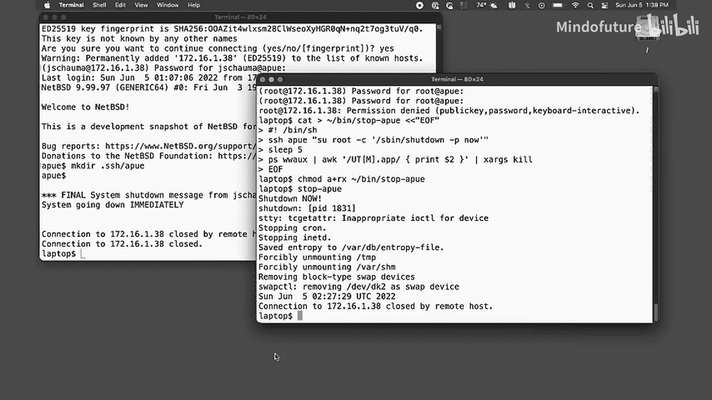

## 总结 📝

本节课中，我们一起学习了如何在Apple M1的UTM中安装NetBSD evbarm。安装过程相当直接：首先下载UTM，然后下载NetBSD-current的evbarm-aarch64镜像，并简单地遵循默认安装过程，没有任何特别之处。

之后，我们使用脚本编辑器应用编写了虚拟机启动和最小化的脚本，设置了SSH免密登录，并创建了简单的脚本来终止虚拟机。这就是全部内容。

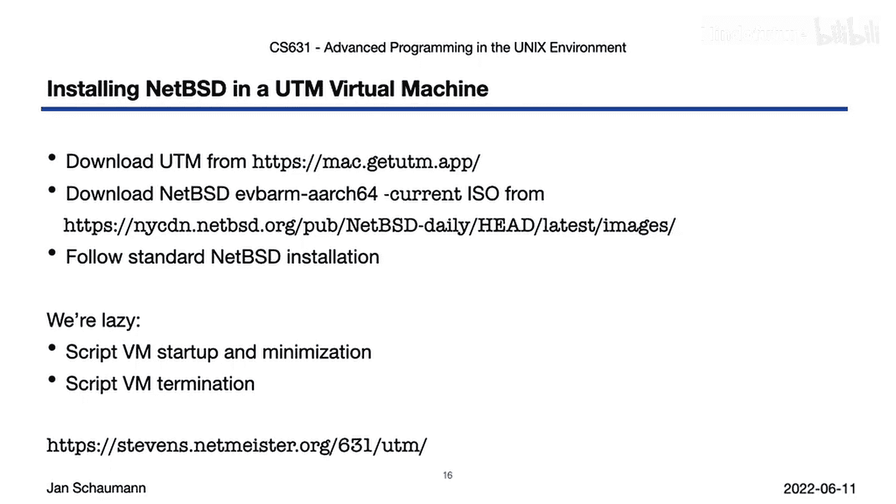

如果你在跟随视频时遇到困难，可以在我们的课程网站上找到这里涵盖的所有内容的逐步说明。希望本教程对你有用，如果有任何问题，请告诉我。下次见。