# 005：工具提示 - ctags 🧰

## 概述

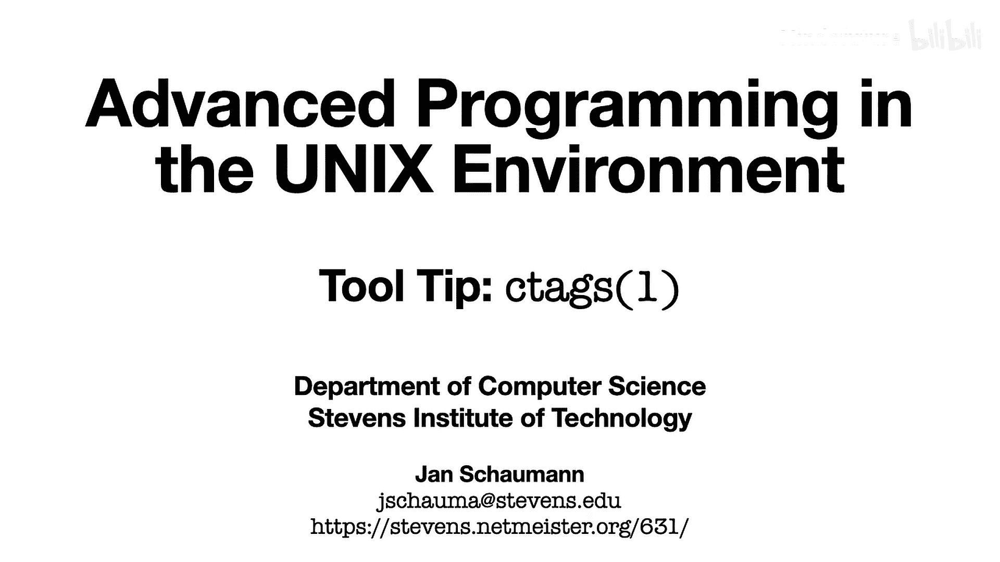

在本节课中，我们将学习如何使用 `ctags` 工具来高效地浏览和管理代码库。`ctags` 能够为代码库建立索引，允许我们在编辑器内快速跳转到函数定义，并返回原处，从而显著提升代码阅读和开发的效率。

---

## 代码组织与浏览挑战

在之前的课程中，我们经常查看大量代码示例。当所有代码都位于单个源文件中时，我们可以通过简单的文本搜索来查找函数定义。例如，在 `main` 函数中调用 `get_input` 时，可以通过搜索 `^get_input` 来快速定位其定义。

然而，在实际项目中，为了保持代码的清晰和可读性，我们通常会将不同功能的代码拆分到多个文件中。例如，将 `get_input` 函数放入单独的 `.c` 文件，并将相关函数原型声明在对应的 `.h` 头文件中。

这种组织方式带来了新的挑战：当我们在 `main.c` 中看到 `get_input` 调用，并想查看其实现时，需要手动找到并打开 `get_input.c` 文件，查看后再返回原文件。在拥有数十甚至数百个源文件的大型项目中，这种方法效率极低。

---

## 引入 ctags 工具

幸运的是，UNIX 环境提供了 `ctags` 工具来解决这个问题。`ctags` 可以为你的代码库建立索引，创建一个映射文件（tags 文件），记录每个标识符（如函数名）在哪个文件的哪一行定义。编辑器可以利用这个文件，实现一键跳转。

### 生成 tags 文件

在项目根目录下运行 `ctags` 命令，即可为当前目录下的所有源文件生成索引：

```bash
ctags *.c *.h
```

执行后，会生成一个名为 `tags` 的文件。其内容格式如下：

```
get_input    get_input.c    /^get_input() {$/
```

它包含三列：**标签名**、**文件名**和用于定位的**正则表达式**。

---

## 在编辑器中使用 tags

大多数 UNIX 编辑器（如 `vi` 或 `vim`）都内置了对 tags 文件的支持。当 `tags` 文件存在于当前工作目录时，编辑器会自动识别并使用它。

以下是核心操作：

1.  **跳转到定义**：将光标置于某个标识符（如函数名）上，按下 `Ctrl + ]`。
2.  **返回原处**：跳转后，按下 `Ctrl + t` 即可返回之前的位置。

你还可以使用 `:ta <tagname>` 命令直接跳转到指定的标签，无需将光标置于其上。

---

## 为系统库创建全局 tags

上一节我们介绍了如何为本地项目创建 tags。本节中，我们来看看如何将标准 C 库的源代码也加入索引，这样我们就能一键跳转到 `printf`、`fopen` 等系统函数的实现了。

这需要使用功能更强大的 `exuberant-ctags` 版本。首先确保已安装：

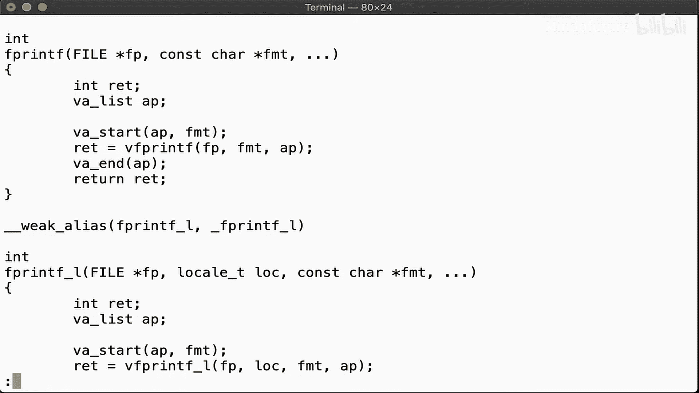

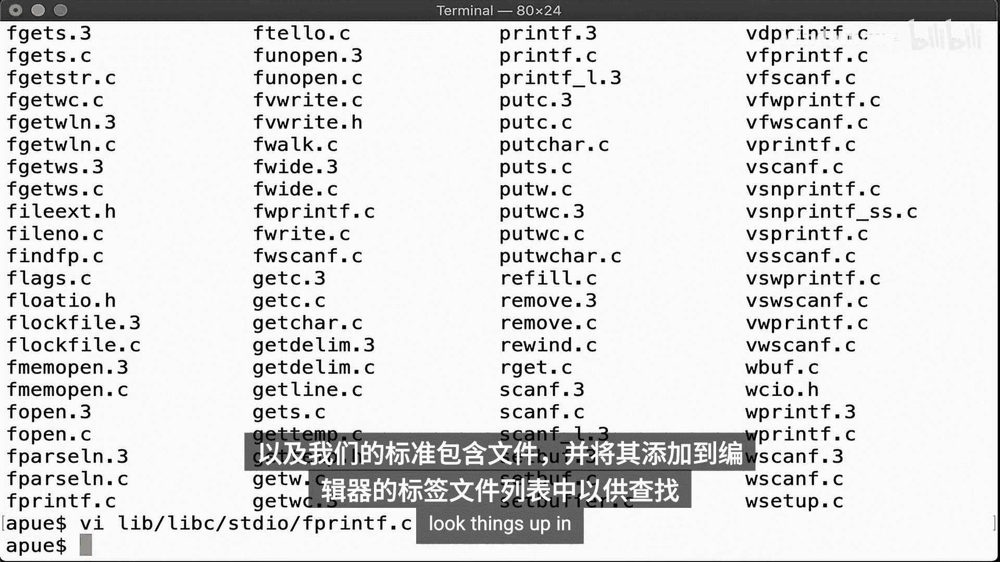

```bash
# 例如在基于 Debian 的系统上
sudo apt-get install exuberant-ctags
```

然后，我们可以递归地为系统头文件目录和库源代码目录建立索引：

```bash
ctags -R --c-kinds=+p --fields=+iaS --extra=+q -f ~/global_tags /usr/include /usr/src
```

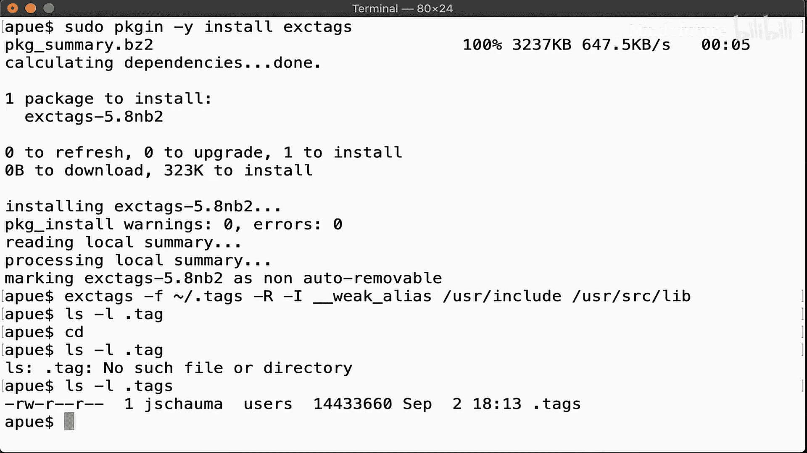

这个命令会：
*   `-R`：递归处理目录。
*   `--c-kinds=+p`：为函数原型也生成标签。
*   `-f ~/global_tags`：将输出的 tags 文件保存到主目录下的 `global_tags`。
*   最后指定要索引的目录路径。

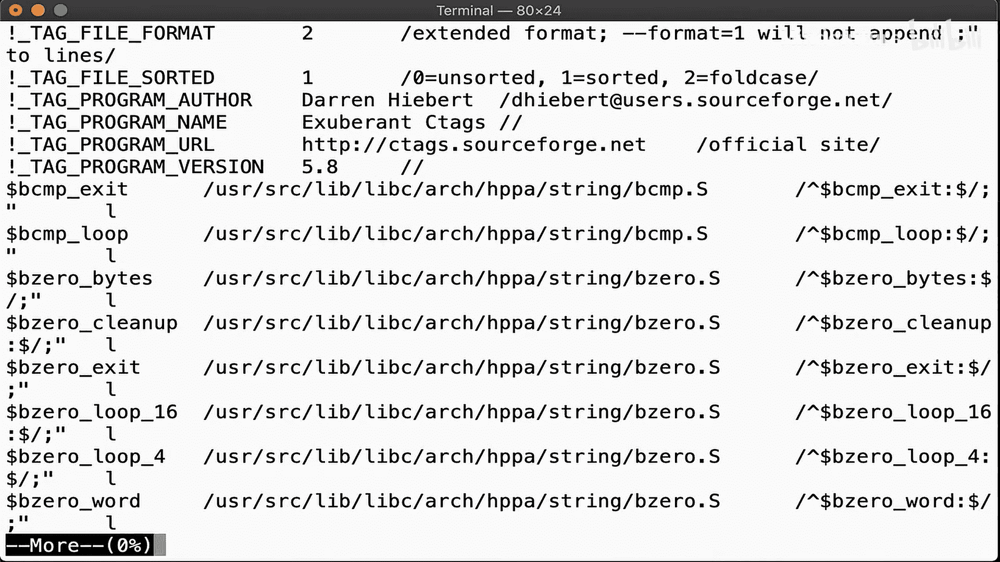

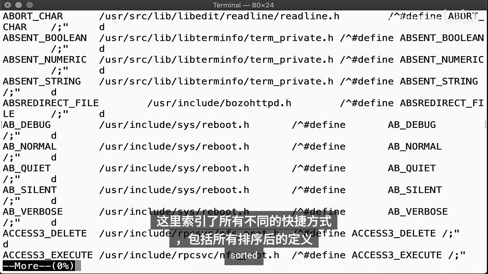

---

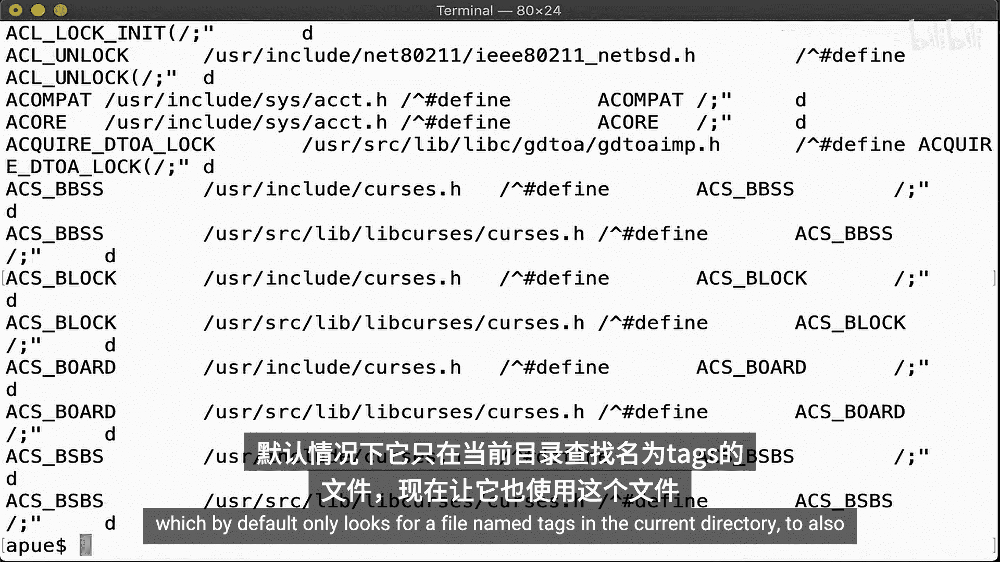

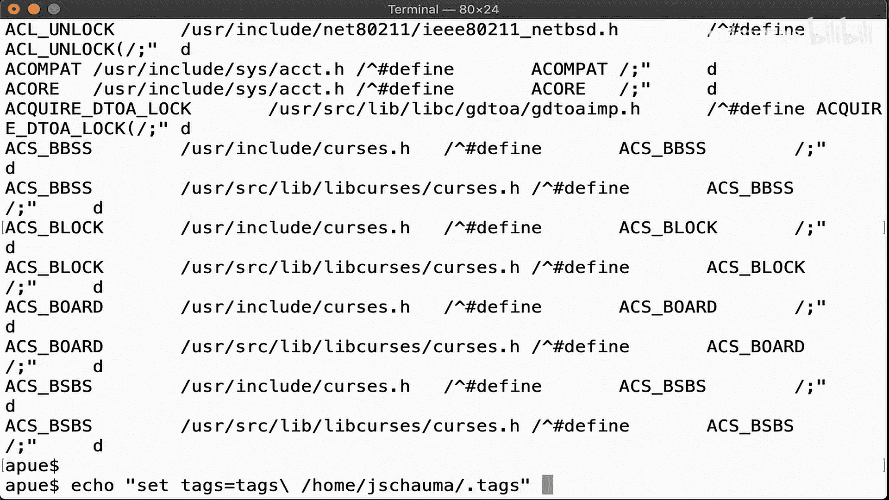

## 配置编辑器使用多个 tags 文件

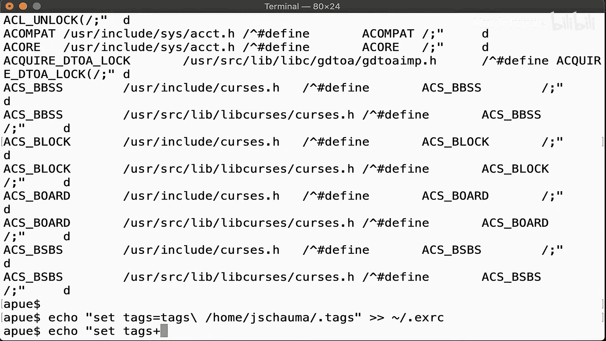

为了让编辑器同时使用本地项目的 `tags` 文件和全局的 `global_tags` 文件，需要在编辑器配置中设置 `tags` 路径。

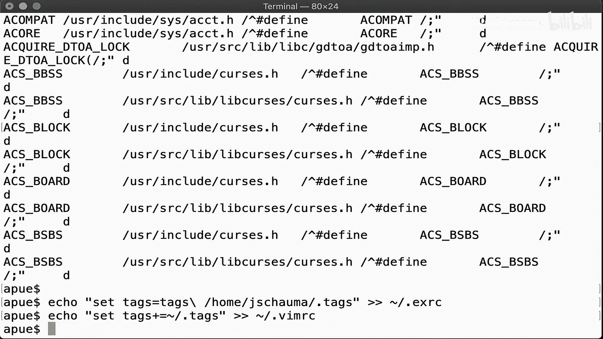

对于 `vim`，可以在 `~/.vimrc` 文件中添加：

```vim
set tags=./tags,./TAGS,tags,TAGS,~/global_tags
```

这样，编辑器会按顺序在这些位置查找 tags 文件。

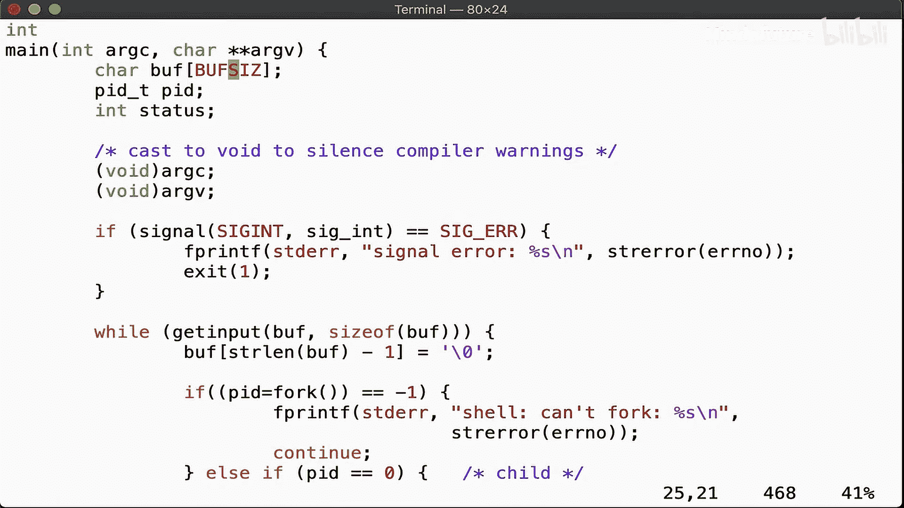

配置完成后，你就可以在代码中自由跳转了：
*   从项目代码跳转到本地函数定义。
*   从项目代码跳转到标准库函数（如 `fprintf`）的源代码定义。
*   甚至可以从宏或常量的使用处跳转到其定义（如 `BUFSIZ`）。

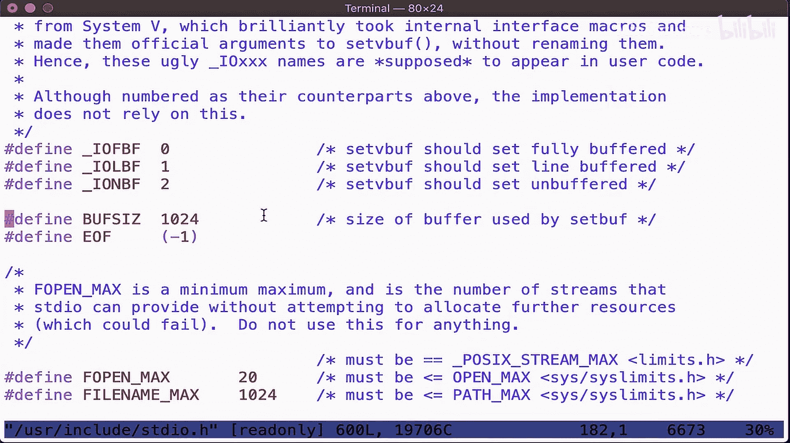

每次跳转都会形成一个栈，连续按 `Ctrl + t` 可以按跳转顺序逐级返回。

---

## 相关技巧：快速查看手册

除了跳转到定义，UNIX 编辑器还提供了一个便捷功能：快速查看系统函数的手册页。将光标置于函数名上，按下 `Shift + k`，即可直接打开该函数的 `man` 页面。阅读完毕后，关闭手册页即可回到代码编辑界面。这在编写代码时快速查询函数用法非常有用。

---

## 总结

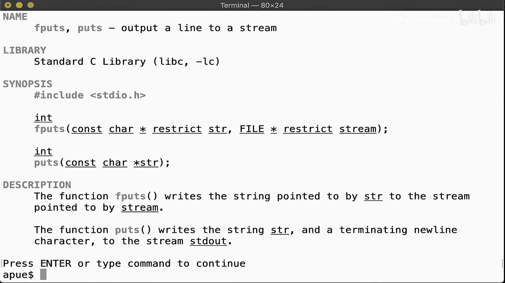

本节课中，我们一起学习了 `ctags` 这个强大的代码浏览工具。我们掌握了：
1.  使用 `ctags` 为本地项目生成索引。
2.  在编辑器中使用 `Ctrl + ]` 和 `Ctrl + t` 进行跳转与返回。
3.  使用 `exuberant-ctags` 为系统库生成全局 tags 文件。
4.  配置编辑器以支持多 tags 文件，实现从项目代码到库源码的无缝跳转。
5.  使用 `Shift + k` 快速查看函数手册页。

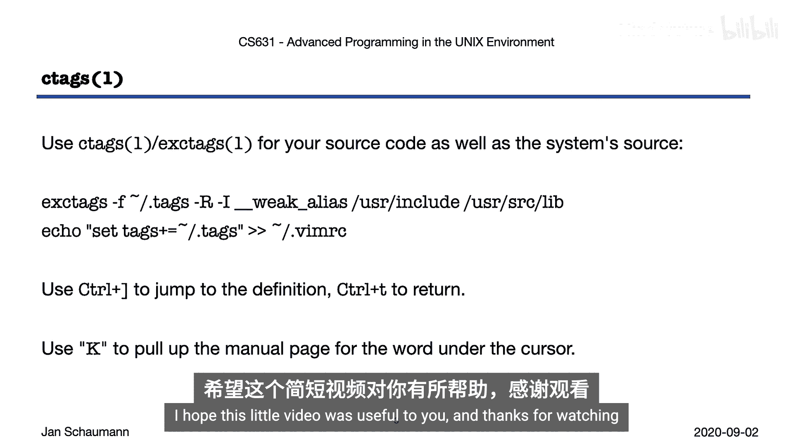

熟练使用 `ctags` 可以让你在复杂的代码库中轻松导航，极大地提升阅读和编写代码的效率。建议你立即为自己的开发环境配置好这个工具。