# 006：文件描述符与资源限制 🖥️

在本节课中，我们将学习UNIX系统中文件描述符（File Descriptors）的核心概念，并通过一个实际程序来探究进程可打开文件描述符的数量限制。我们将了解如何通过系统调用和编程方式获取这一限制，并理解其在不同UNIX系统间的差异。

## 概述

文件描述符是UNIX系统中进行输入输出（I/O）操作的关键抽象。几乎所有I/O操作都通过文件描述符完成，它们被实现为小的非负整数。标准输入（stdin）、标准输出（stdout）和标准错误（stderr）通常分别对应文件描述符0、1和2。这种设计使得程序无需关心底层是文件、管道还是网络套接字，提供了统一的接口。

然而，文件描述符是一种有限的系统资源。内核需要跟踪每个整数所代表的资源，因此不能允许进程无限制地打开文件。在多用户、多进程的UNIX环境中，必须谨慎管理资源，以防止单个进程耗尽系统资源。

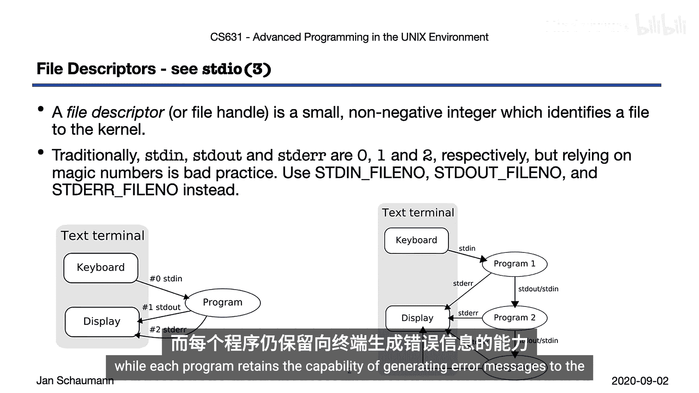

## 探究文件描述符数量限制

为了回答“一个进程最多能打开多少个文件？”这个问题，我们编写了一个名为 `openmax.c` 的程序。该程序尝试通过多种方式来确定每个进程可打开文件描述符的最大数量。

以下是程序中使用的主要方法：

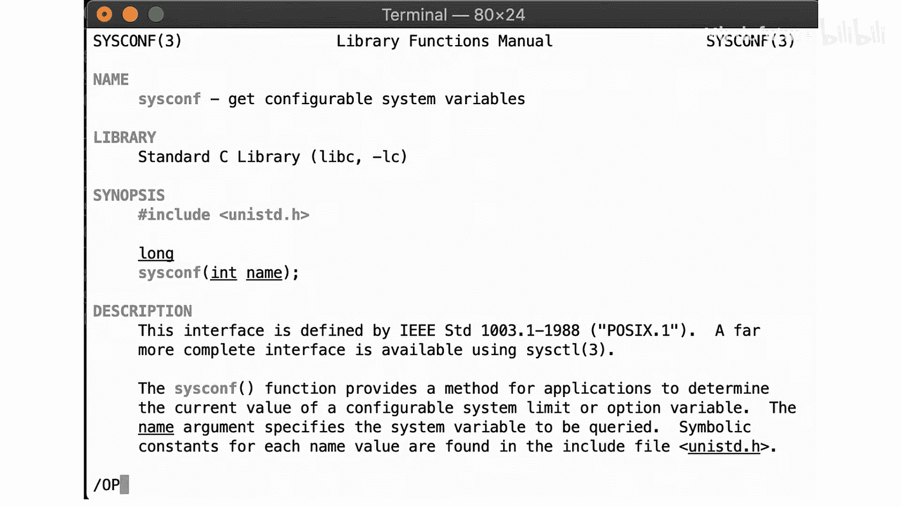

1.  **检查 `OPEN_MAX` 常量**：首先检查系统头文件中是否预定义了 `OPEN_MAX` 常量。
    ```c
    #ifdef OPEN_MAX
        printf("OPEN_MAX is defined to be %d\n", OPEN_MAX);
    #else
        printf("OPEN_MAX is not defined\n");
    #endif
    ```

2.  **使用 `sysconf` 函数**：通过 `sysconf(_SC_OPEN_MAX)` 调用获取系统运行时配置的可打开文件描述符数量。这是一个更动态、更可靠的方法。
    ```c
    long sc_open_max = sysconf(_SC_OPEN_MAX);
    if (sc_open_max < 0) {
        if (errno == 0) {
            printf("sysconf(_SC_OPEN_MAX) indicates no limit\n");
        } else {
            err_sys("sysconf error for _SC_OPEN_MAX");
        }
    } else {
        printf("sysconf(_SC_OPEN_MAX) = %ld\n", sc_open_max);
    }
    ```

3.  **使用 `getrlimit` 函数**：通过 `getrlimit(RLIMIT_NOFILE, ...)` 获取进程级别的资源限制，即最大文件描述符数。
    ```c
    struct rlimit rl;
    if (getrlimit(RLIMIT_NOFILE, &rl) < 0) {
        err_sys("can‘t get file limit");
    }
    printf("getrlimit(RLIMIT_NOFILE) -> rlim_cur = %ld\n", (long)rl.rlim_cur);
    ```

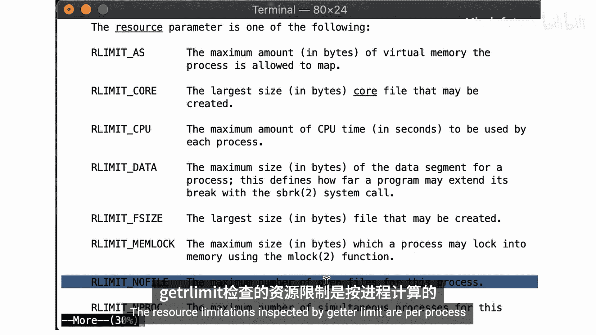

## 程序运行与结果分析

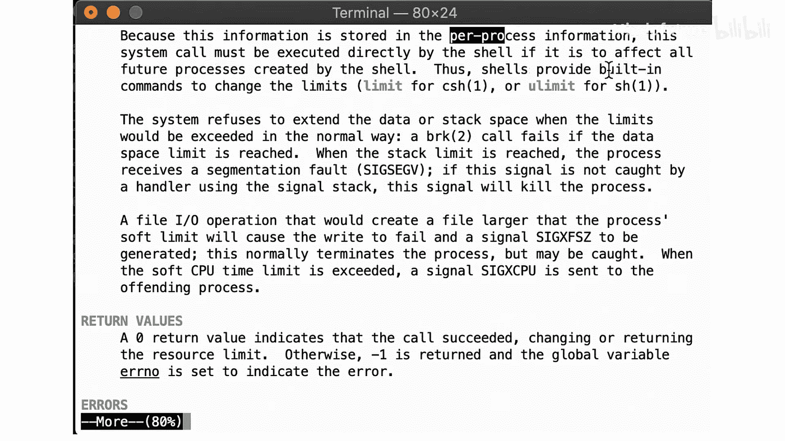

编译并运行 `openmax.c` 程序后，我们可能会得到看似矛盾的结果。例如，在一个系统上：
*   `OPEN_MAX` 常量可能被定义为 128。
*   `sysconf(_SC_OPEN_MAX)` 和 `getrlimit` 可能都返回 1024。

通过实验（程序会循环打开文件直到失败），我们验证了实际可打开的文件数量与 `sysconf` 和 `getrlimit` 返回的值（1024）一致，而不是头文件中的常量（128）。这包括默认已打开的3个文件描述符（0, 1, 2）以及额外打开的1021个文件。

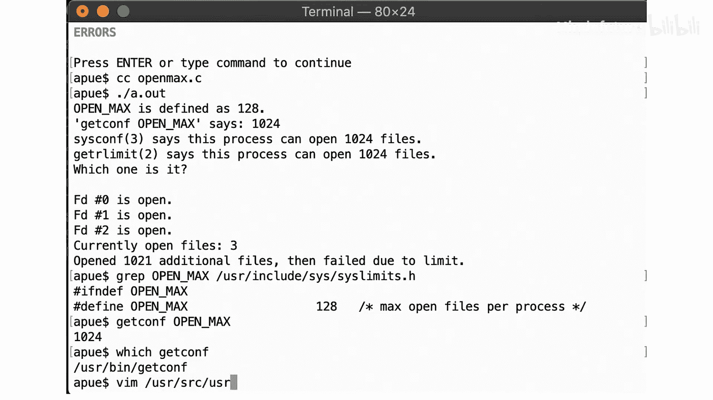

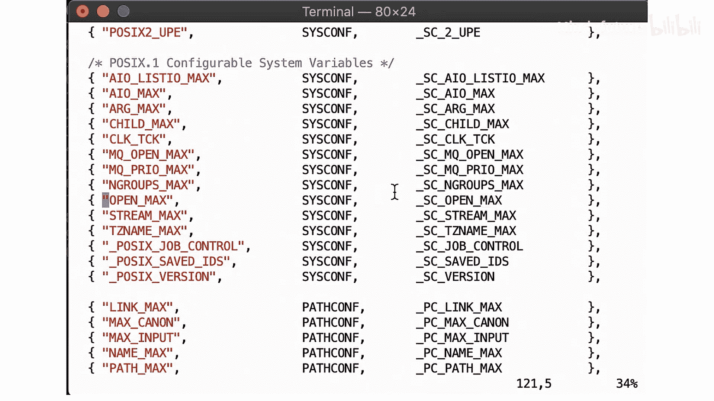

这个差异说明，每个进程可打开文件的最大数量是一个**运行时可配置**的值，可以通过 shell 的 `ulimit` 命令或编程接口进行修改。因此，依赖编译时常量 `OPEN_MAX` 并不可靠，而应该使用 `sysconf(_SC_OPEN_MAX)` 在运行时查询当前限制。

## 跨平台差异

为了加深理解，我们在不同UNIX系统上运行了该程序：

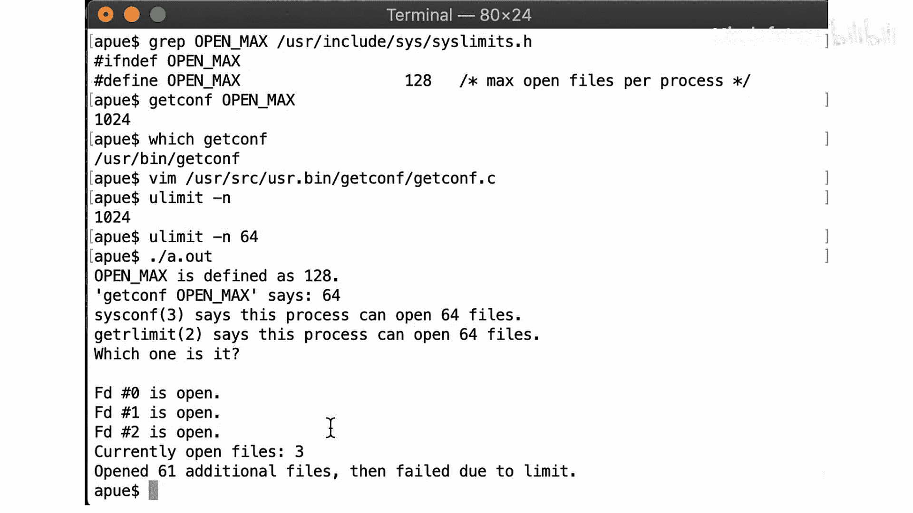

*   **NetBSD/参考系统**：`OPEN_MAX` 为128，但运行时限制为1024。
*   **macOS (BSD衍生系统)**：`OPEN_MAX` 可能定义为10240，但 `sysconf` 返回2560。
*   **Linux (Ubuntu)**：`OPEN_MAX` 可能未定义，`sysconf` 返回1024。

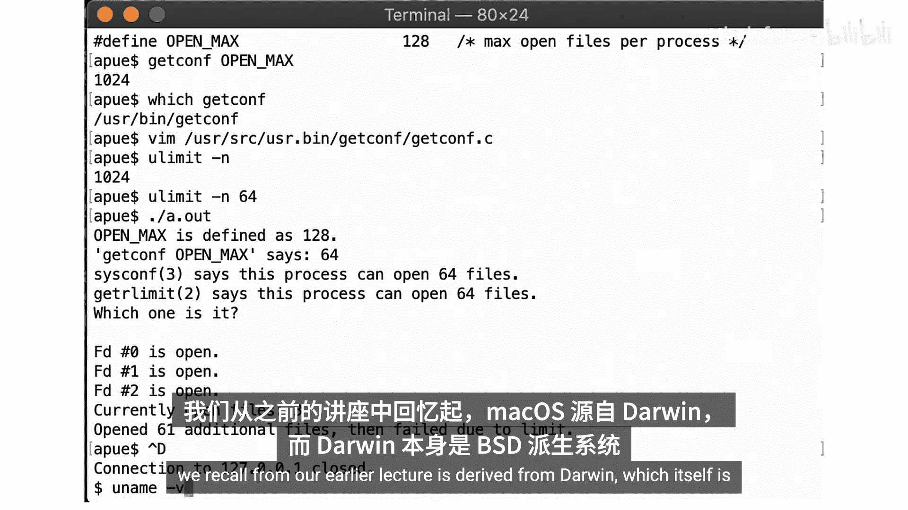

这些结果证实了“它取决于具体系统和配置”的结论。`OPEN_MAX` 常量可能不存在、存在但已过时、或者与运行时实际情况不符。`sysconf` 和 `getrlimit` 是获取此信息的推荐方法。

## 核心要点与总结

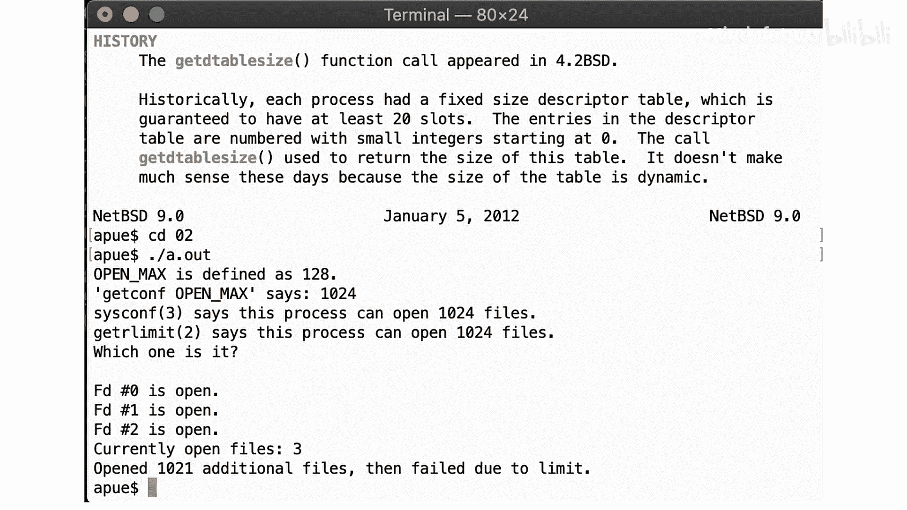

本节课中我们一起学习了文件描述符的基本概念及其资源限制。我们通过编写和运行 `openmax.c` 程序，实践了探究系统行为的方法：

1.  **文件描述符**是UNIX I/O的通用抽象，表现为非负整数。
2.  进程可打开的文件描述符数量存在**软性限制**，可通过 `ulimit -n` 或 `setrlimit` 调整。
3.  获取此限制的**可靠方法**是使用 `sysconf(_SC_OPEN_MAX)` 或 `getrlimit(RLIMIT_NOFILE)`，而非依赖可能过时的 `OPEN_MAX` 编译时常量。
4.  不同UNIX系统（如BSD、Linux、macOS）对此限制的默认值和定义方式可能不同。
5.  **动手编写测试代码**是验证理解和探索系统行为的有效途径。

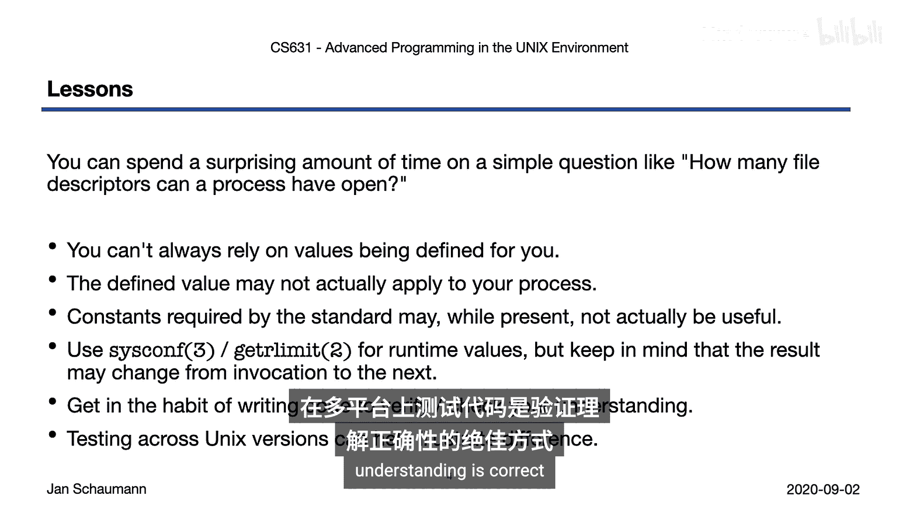

## 延伸思考与预习

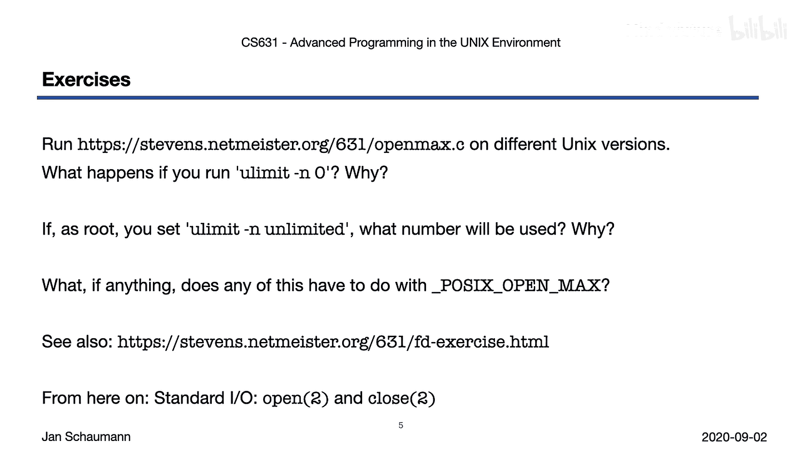

本节内容引出了更多值得探究的问题：
*   如果将 `ulimit` 设置为 `unlimited`，实际限制是多少？它可能是无限的吗？
*   `_POSIX_OPEN_MAX` 这个常量有什么意义？
*   在接下来的视频章节中，我们将详细学习 `open` 和 `close` 系统调用。请提前思考：打开和关闭文件描述符时，内核内部发生了什么？