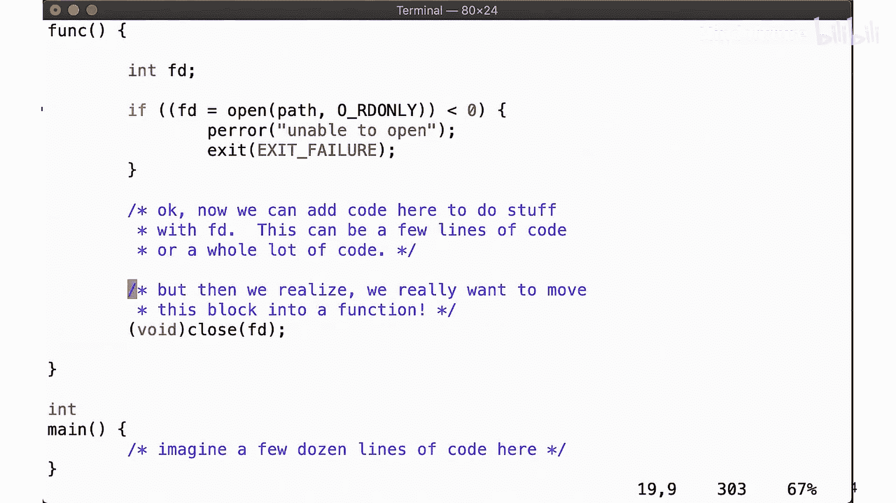
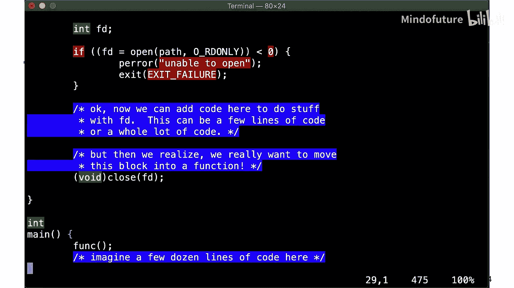
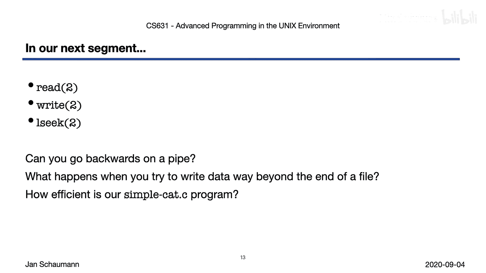

# 007：Week 02 - open(2) 与 close(2) 🖥️

## 概述
在本节课中，我们将学习UNIX环境中两个核心的系统调用：`open` 和 `close`。它们是进行文件输入/输出操作的基础。我们将了解如何使用它们来创建、打开和关闭文件，并探讨相关的标志和常见错误。

---

## 系统调用概览
在上一节中我们提到，几乎所有的文件I/O操作都可以通过五个系统调用来完成。本节我们将介绍其中的两个：`open` 和 `close`。其余的三个——`read`、`write` 和 `lseek`——将在下一节中介绍。这些是底层的系统调用，许多库函数都是为了方便或提供额外功能而对其进行的封装。

## 创建文件：`creat` 系统调用
在进行任何文件I/O之前，我们首先需要一个文件。我们可以使用 `creat` 系统调用来创建文件。

以下是 `creat` 系统调用的基本用法：
```c
int creat(const char *pathname, mode_t mode);
```
这个调用以路径名作为第一个参数，以访问权限描述作为第二个参数。它会创建一个新文件，以写入模式打开它，并返回一个代表该新文件的文件描述符。

然而，`creat` 并不在我们之前提到的五个核心系统调用之列。原因是，`creat` 返回的文件描述符仅以只写模式打开。有时，我们希望创建一个新文件并获得一个允许读写操作的文件句柄。在早期UNIX中，`open` 无法创建文件，因此必须先用 `creat` 创建文件，然后关闭它，再用 `open` 重新打开。这引入了竞态条件，可能导致意外结果。因此，`creat` 已被带有特定标志的 `open` 调用所取代。

## 打开文件：`open` 系统调用
`open` 系统调用是打开（或创建）文件的主要方式。

以下是 `open` 系统调用的基本形式：
```c
int open(const char *pathname, int flags, ... /* mode_t mode */);
```
它接受一个路径名、一个指示 `open` 如何行为的标志位掩码，以及一个可选的第三个参数——创建文件时的权限模式（会受到进程umask的影响，我们将在后续课程中讨论）。`open` 是这组系统调用中唯一一个不接收文件描述符作为参数的，这很合理，因为它是返回文件描述符的调用。

路径名参数的含义不言自明，让我们重点看看 `flags` 参数。

### 打开模式标志
打开文件时，需要指定文件是以只读、只写还是读写模式打开。这是一种有效的自我保护机制。

以下是基本模式标志：
*   `O_RDONLY`: 只读模式
*   `O_WRONLY`: 只写模式
*   `O_RDWR`: 读写模式

### 其他行为标志
除了基本模式，还可以通过“或”操作添加其他标志来改变 `open` 的行为。

以下是几个重要的标志：
*   `O_APPEND`: 以追加模式打开文件。
*   `O_CREAT`: 如果文件不存在则创建它。如果指定了此标志，则必须提供第三个参数 `mode`。
*   `O_EXCL`: 与 `O_CREAT` 结合使用，确保原子性地独占创建文件。如果文件已存在，则 `open` 会失败。这可以避免“检查时间与使用时间”的竞态条件漏洞。
*   `O_TRUNC`: 如果文件已存在且成功以写入模式打开，则将其长度截断为0。

请注意，不同平台支持的 `open` 标志可能有所不同，并且可能超出POSIX标准的要求。你应该查阅本地系统的手册页以了解具体支持哪些标志。

### `openat` 系统调用
许多现代UNIX版本还支持 `openat` 系统调用。它用于原子性地处理来自不同工作目录的相对路径名。考虑一个场景：你改变了工作目录，但希望相对于原始目录来解析一个路径，而不必切换回去或手动构造相对路径。`openat` 可以帮助防止“检查时间与使用时间”的竞态条件。你可以将此作为一个练习，思考具体场景并编写代码验证。

## 处理 `open` 的错误
`open` 调用成功时返回一个文件描述符，失败时返回-1并设置 `errno`。

以下是 `open` 可能失败的一些常见原因：
*   `EEXIST`: 当指定了 `O_CREAT | O_EXCL` 而文件已存在时。
*   `EMFILE`: 进程打开的文件描述符数量已达到上限。
*   `ENOENT`: 文件不存在，且未指定 `O_CREAT` 标志。
*   `EACCES`: 对文件没有所请求的访问权限（例如，对只读打开需要读权限，对写或读写打开需要写权限）。

由于 `open` 可能因多种原因失败，**必须**在尝试使用其返回的文件描述符之前检查其返回值。永远不要像下面这样写代码：
```c
int fd = open(“file.txt”, O_RDONLY);
read(fd, …); // 危险！如果 open 失败，fd 为 -1
```
而应该总是这样写：
```c
int fd = open(“file.txt”, O_RDONLY);
if (fd < 0) {
    // 处理错误
} else {
    // 使用 fd
    read(fd, …);
}
```

## 关闭文件：`close` 系统调用
关闭文件相对简单。

以下是 `close` 系统调用的用法：
```c
int close(int fd);
```
你只需传递文件描述符即可。关闭文件描述符会释放对该文件的所有记录锁（我们将在学期后期讨论文件记录锁的概念）。





在一个简单的程序中，当进程退出时，内核会自动关闭所有打开的文件描述符，因此你甚至可以不自己调用 `close`。但这是一种草率的编程习惯，很容易导致在重构代码（例如，将打开操作移入循环中）时泄露文件描述符。为了防止这种情况，你应该养成习惯，总是在 `open` 调用的同一作用域内显式关闭文件描述符。

### 作用域管理示例
为了说明在同一作用域内打开和关闭文件的概念，请看一个简单的例子。假设我们有一段代码，需要在其中添加新的文件操作逻辑。

1.  我们首先在此处添加 `open` 调用（当然要仔细检查返回值）。
2.  **紧接着**，在同一代码块内，我们立即添加 `close` 调用。
3.  然后，我们再回到 `open` 和 `close` 调用之间，插入实际操作文件描述符的代码。

这种方式可以确保我们不会忘记稍后添加 `close` 调用。一个简单的记忆方法是检查缩进级别：确保 `open` 和 `close` 处于相同的缩进层级。

更好的做法是，如果这段逻辑可以独立出来，就将其封装成一个函数。这样，整个打开、操作、关闭的流程都在函数内部完成，资源管理更加清晰和安全。

### 检查 `close` 的返回值
你可能注意到，在我们的代码示例中，并没有检查 `close` 的返回值，尽管我们强调应该检查所有函数的返回值。这是为什么呢？`close` 难道不会失败吗？

查阅手册页会发现，`close` 确实可能失败，例如当传入的参数不是有效的文件描述符，或者调用被硬件中断打断时。那么，如果 `close` 调用失败，你该怎么办？既然你打算关闭文件描述符，那么在 `close` 调用之后你也不会再使用它了，因此在大多数情况下，即使 `close` 失败，继续执行也是可以接受的。

然而，作为严谨的程序员，我们希望确保代码读者明白我们并非盲目地忽略返回值。因此，我们可以显式地将 `close` 的返回值转换为 `void`，以表明我们有意忽略它，如下所示：
```c
(void)close(fd);
```

## 代码示例分析
现在，让我们通过一个代码示例 `openex.c` 来具体看看如何打开文件。该示例演示了以下场景：
1.  创建一个新文件。
2.  尝试创建已存在的文件（不使用 `O_EXCL`）。
3.  尝试独占创建已存在的文件（使用 `O_EXCL`，预期失败）。
4.  打开一个已存在的文件。
5.  尝试打开一个不存在的文件（预期失败）。
6.  以截断模式打开一个已存在的文件。

示例中定义了几个函数来演示这些操作。请注意，在第一个创建文件的函数中，我们故意没有在同一个函数内关闭文件描述符，这是为了展示多次打开文件时，文件描述符号会顺序递增。

运行这个程序，我们可以观察到：
*   成功创建新文件时，返回的文件描述符是3（因为0、1、2已被标准输入、输出、错误占用）。
*   再次尝试创建同一文件（无 `O_EXCL`）会成功，并返回新的描述符4。
*   尝试用 `O_CREAT | O_EXCL` 创建已存在文件会失败。
*   成功打开源文件本身。
*   尝试打开不存在的文件会失败。
*   以 `O_TRUNC` 模式打开文件会成功，并且文件内容被清空。

通过这个例子，我们看到了 `open` 调用成功和失败的各种情况，并注意到文件描述符似乎是从当前可用的最小数字开始顺序分配的。

---

## 总结
本节课我们一起学习了UNIX文件I/O的基础：`open` 和 `close` 系统调用。我们了解了如何使用 `open` 及其各种标志来创建和打开文件，如何正确处理错误，以及为什么要在同一作用域内管理文件的打开和关闭。我们还通过示例代码观察了这些调用的实际行为。



请务必自己运行代码示例，如果仍有不清楚的地方，请在课程邮件列表中提问。在下一节中，我们将学习更令人兴奋的内容：使用 `read`、`write` 和 `lseek` 来实际读写和操作文件数据。