# 009：文件共享与高级文件I/O

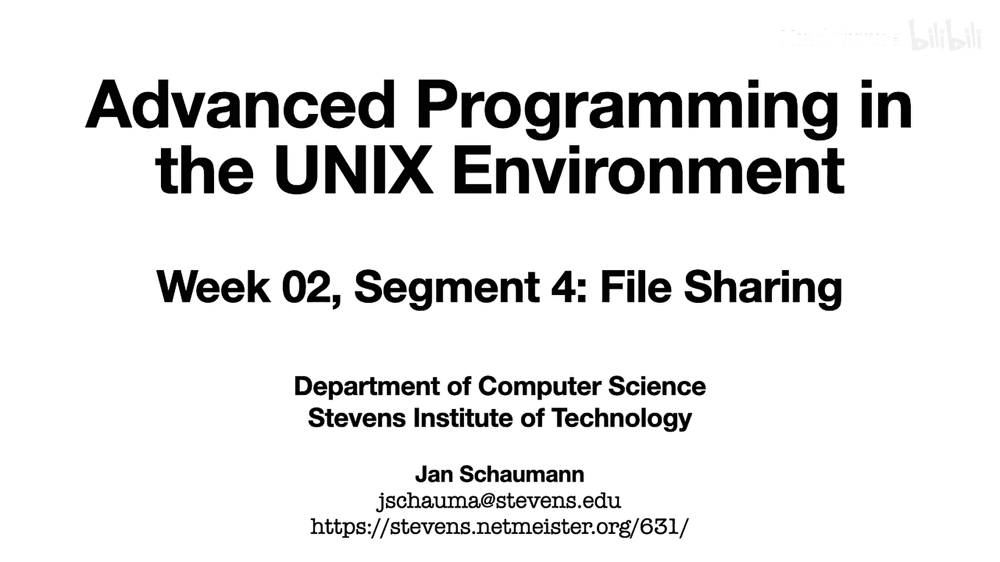

在本节课中，我们将学习当多个进程访问同一文件时的含义及其对已知系统调用的影响。我们还将探讨一些与文件I/O和文件描述符相关的附加函数。掌握这些知识后，你将能够完成第一份作业，并有效运用目前所学内容。

## 概述

UNIX自诞生之初就是一个多用户、多进程的操作系统。这意味着多个进程可能同时访问相同的资源，例如文件。为了深入理解其机制，我们需要了解内核中实现这些概念的相关数据结构。

## 内核数据结构

上一节我们介绍了五个基本的文件I/O系统调用。本节中，我们来看看内核如何管理进程与文件的关系。

内核维护一个进程表，每个进程表条目包含一个文件描述符表。文件描述符表中包含文件描述符标志（我们尚未详细讨论）以及一个指向文件表条目的指针。

除了进程表，内核还维护一个文件表。每个文件表条目包含文件状态标志（例如我们已见过的 `O_APPEND`）、当前文件偏移量以及一个指向v节点表的指针。

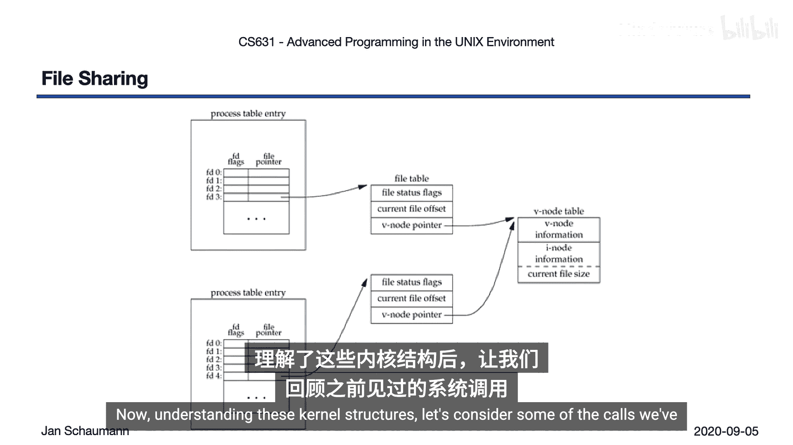

遵循计算机科学中“所有问题都可以通过增加一个间接层来解决”的理念，我们并不直接实现文件系统逻辑，而是通过V节点来抽象文件系统API。不同的文件系统在V节点表条目中包含不同的元信息，但为了与传统UNIX文件系统兼容，它们都实现了i节点信息的接口。

以下是这些数据结构关系的示意图：


如果一个进程两次打开同一个文件，数据结构将如上图所示。注意，中间的文件表条目是独立的，但都指向右侧同一个v节点表条目。

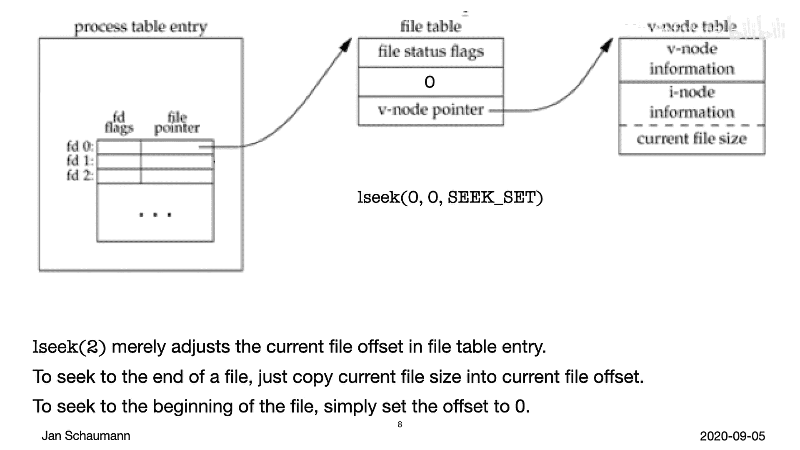

类似地，如果两个不同的进程打开同一个文件，情况可能如下图所示：


## 文件偏移量与操作

理解了这些内核结构后，让我们回顾一下之前讨论过的系统调用。

`read` 和 `write` 系统调用从当前偏移量开始，并在完成后将偏移量增加已读取或写入的字节数。如果我们写入数据，并且结果偏移量大于文件大小（即我们向文件添加数据），那么只需将当前偏移量复制到i节点的文件大小字段中。

如果我们使用 `O_APPEND` 标志打开文件，所有写入操作都将在文件末尾进行。其工作原理是：以 `O_APPEND` 模式打开文件时，文件状态标志会相应设置。每当调用 `write` 时，它会首先将当前偏移量设置为当前文件大小，然后更新当前偏移量。由于根据定义，当前偏移量大于文件大小，因此也会更新i节点中的文件大小。

`lseek` 系统调用仅操作文件状态表中的当前偏移量。要定位到文件末尾，`lseek` 会将当前文件大小复制到偏移量中。要定位到文件开头，只需将当前偏移量设置为0。注意，`lseek` 完全独立于文件大小，它不需要访问磁盘获取信息，而是完全在元信息上操作。

## 原子操作与竞争条件

但是，如果多个进程可能同时访问同一个文件呢？这时我们很快需要原子操作。原子操作是指保证完全执行而不会被另一个进程干扰的操作。

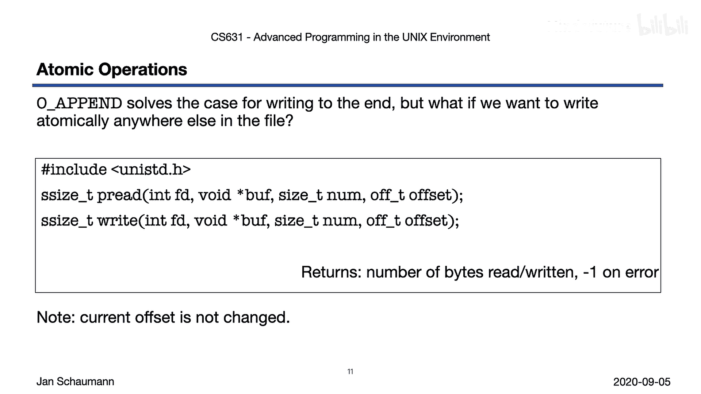

让我们通过一个例子说明这种操作的必要性。早期UNIX版本没有 `O_APPEND` 标志。如果你想追加到文件，必须先 `lseek` 到文件末尾，然后执行 `write`。这需要完成两个操作。如果另一个进程同时做同样的事情会发生什么？

假设有两个进程，都试图将各自的缓冲区内容追加到同一个文件。进程1想追加“P1”，进程2想追加“P2”。如果进程1先获得CPU并调用 `lseek(0, SEEK_END)`，这将把当前文件大小复制到进程1的文件表条目的当前偏移量中。但此时调度器决定让进程2运行，进程2也调用 `lseek(0, SEEK_END)`，将当前文件大小（例如128）复制到进程2的文件表条目的当前偏移量中。进程2然后发出 `write`，成功将数据追加到末尾。新偏移量变为173，由于大于128，它将173复制到i节点的文件大小中。进程2写入数据后退出。现在，进程1再次获得CPU，从它离开的地方继续，即在调用 `lseek` 之后。此时它的当前偏移量仍为128。它将在位置128写入缓冲区1的内容，覆盖了进程2之前写入的字节。它调整了自己的偏移量然后退出。最终，文件末尾的数据被损坏。

这说明了追加数据需要原子操作的必要性，而文件状态标志 `O_APPEND` 解决了这个问题。

但有时我们想写入文件末尾以外的不同位置，并且希望避免刚才解释的竞争条件，这同样适用于多个进程同时尝试写入的情况。

为了解决这个问题，除了标准的 `read` 和 `write` 系统调用外，我们还有 `pread` 和 `pwrite` 函数。它们的工作原理与普通的 `read` 和 `write` 调用类似，但接受一个额外的参数——偏移量。它们会在发出读/写操作之前原子性地定位到该偏移量。调用这些函数后，当前文件偏移量不会改变，意味着你在文件中的当前位置与调用前相同。与往常一样，如果遇到错误，这些函数返回-1并设置 `errno`。

## Shell中的文件状态标志

让我们看看各种文件状态标志在Shell中运行命令时的实际含义。

我们知道，在Shell中使用 `>` 符号将输出重定向到文件时，如果文件不存在则会创建它并写入数据。如果文件存在，则会被截断。这意味着Shell在此处使用的打开标志是 `O_CREAT` 和 `O_TRUNC`。因此，文件内容将被覆盖。

如果我们想追加到文件，Shell允许我们通过 `>>` 符号来实现，将 `O_TRUNC` 改为 `O_APPEND`。但请注意，即使在追加模式下，如果文件不存在，我们仍然会创建它，因此 `O_CREAT` 标志仍然有效。追加到现有文件按预期工作，不会截断文件。

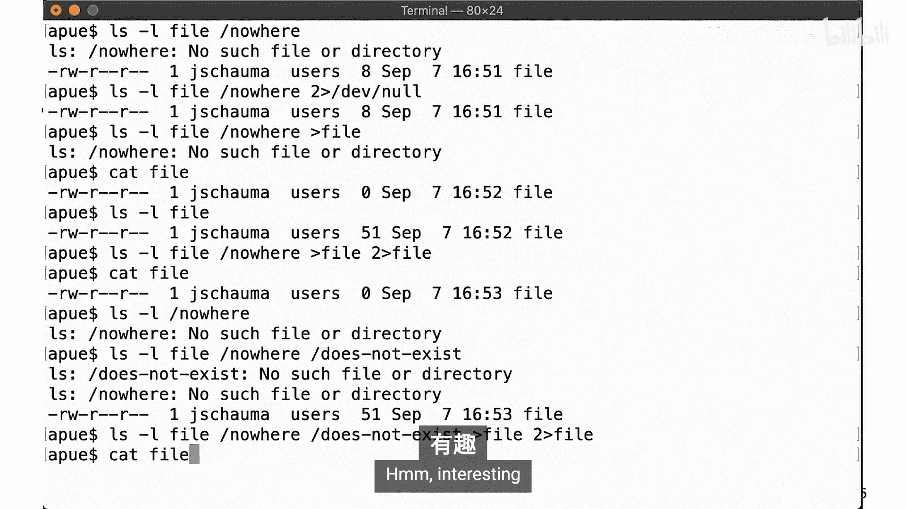

现在，让我们看看多个流的输出重定向。当我们运行一个程序时，我们知道标准输出和标准错误都连接到终端。我们会在终端上收到错误消息和命令的输出。

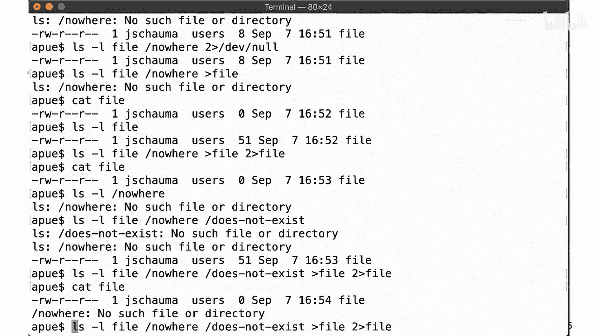

如果我们想抑制错误消息，可以将另一个文件描述符2重定向到另一个文件。使用特殊设备 `/dev/null`，我们可以完全丢弃标准错误的输出，但这里的重定向仍然是通过打开文件来完成的。

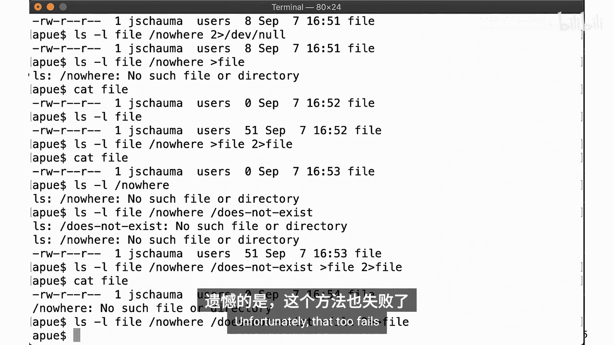

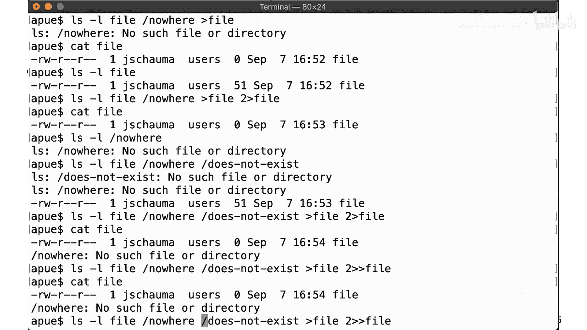

如果我们把文件描述符2重定向到文件描述符1（标准输出），我们不需要指定文件描述符，Shell单独使用 `>` 时默认重定向标准输出。标准错误仍将按预期连接到终端。

但看看文件的内容。注意，`ls` 告诉我们文件大小为0字节。让我们比较一下。文件实际上是51字节大小。为什么重定向输出时它写入了0字节？原因正如一分钟前指出的，输出重定向以 `O_TRUNC` 模式打开文件。输出重定向在 `ls` 命令执行之前在Shell中发生，因此Shell截断了文件。当 `ls` 查看它时，发现它的大小为0字节。

现在，尝试将标准错误捕获到同一个文件中。我们只需使用这种语法在这里重定向它。运行命令时，由于我们将标准输出和标准错误都重定向到了文件，终端上没有输出。但文件只包含命令的标准输出。标准错误的输出去哪了？让我们看看错误消息。它比标准输出的消息短。我们重新生成并比较一下。这是错误消息，这是我们期望显示在文件中的内容（标准输出），这个更长。所以看起来可能是标准错误先被写入文件，然后标准输出覆盖了它的输出，就像我们几分钟前关于 `O_APPEND` 是原子性的说明一样。

为了验证这个假设，让我们尝试生成一个更长的错误消息。如果我们尝试 `ls` 两个不存在的目录，那么我们的错误消息将比命令的成功输出更长。让我们试试看。这证实了我们的假设：标准输出和标准错误的重定向都以 `O_TRUNC` 模式打开文件，因此它们都将文件大小和当前偏移量设置为0。错误消息被写入，然后当标准输出写入时，它覆盖了标准错误的部分字节，标准错误剩余的字节留在了后面。

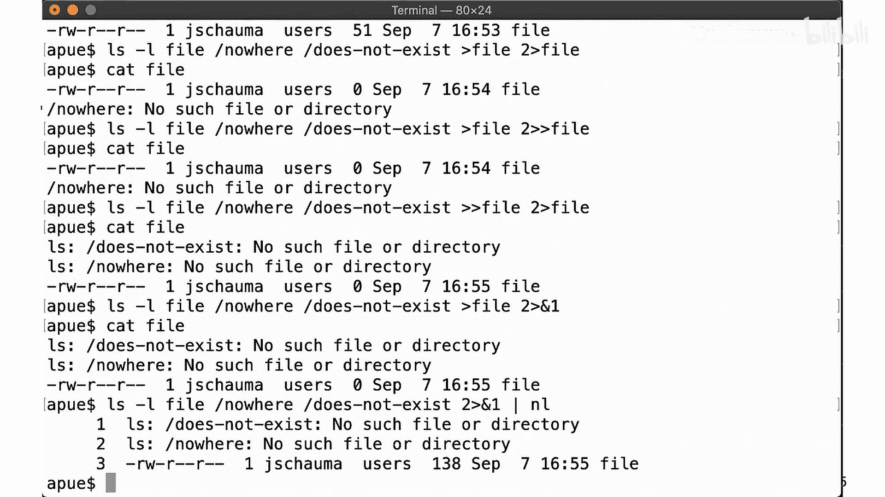

那么，让我们尝试通过要求标准错误使用 `O_APPEND` 模式来修复这个问题。不幸的是，这也失败了。标准输出重定向以 `O_TRUNC` 模式打开文件，标准错误以 `O_APPEND` 模式打开它，但如果标准错误先写入数据，那么 `O_APPEND` 也帮不了我们。

让我们试试反过来。这样看起来好多了。所以我们观察到了之前说明的完全相同的竞争条件，并且我们观察到错误似乎总是在标准输出之前完成。情况总是这样吗？一般来说，到标准错误的消息是无缓冲的，而到标准输出的I/O很可能被缓冲，这就是为什么当两者都连接到终端时，你可能会先看到错误消息，然后才是正常输出。

当然，有更好的方法来确保标准错误和标准输出去往同一个地方。我相信你们很多人都用过。更简单的方法不是告诉Shell将标准输出放入文件并将标准错误放入文件，而是将标准输出放入文件，并将标准错误重定向到标准输出当前指向的地方。这是常见的语法。这样做的优点是，我们可以告诉Shell将标准错误重定向到标准输出所指向的任何地方，无论标准输出去哪里。最常见的用例是告诉Shell确保将标准输出和标准错误都写入管道。正如我们讨论的，并且根据设计，当你将输出管道传输到另一个命令时，标准错误仍然连接到终端。所以这个语法是说：打开管道并将第一个命令的标准输出连接到第二个命令的标准输入，然后将第一个命令的标准错误重定向到标准输出所指向的地方（即进入管道），这样标准错误也进入了管道。

但我们如何做到这一点呢？通过 `>` 和 `>>` 的重定向使用 `open` 系统调用。但我们如何“打开”标准输出当前指向的东西呢？

## `dup` 与 `dup2` 系统调用

答案是 `dup`。`dup` 系统调用复制一个现有的文件描述符，你会得到第二个文件句柄，指向与第一个相同的文件表条目。让我们再次看看涉及的内核结构。注意左侧进程表中文件描述符标志和中间文件表中文件状态标志的范围差异。

与进程多次调用 `open` 打开同一文件并获得指向不同文件表条目（这些条目又指向同一个v节点表条目）的文件描述符的情况不同，这里我们有重复的文件描述符指向同一个文件表条目，意味着两者共享偏移量、文件状态标志等。新的文件描述符确实是原始描述符的副本。

现在，为了允许重定向现有的文件描述符，我们可以使用 `dup2`。现有的文件描述符将被关闭，并改为指向原始的文件表条目。

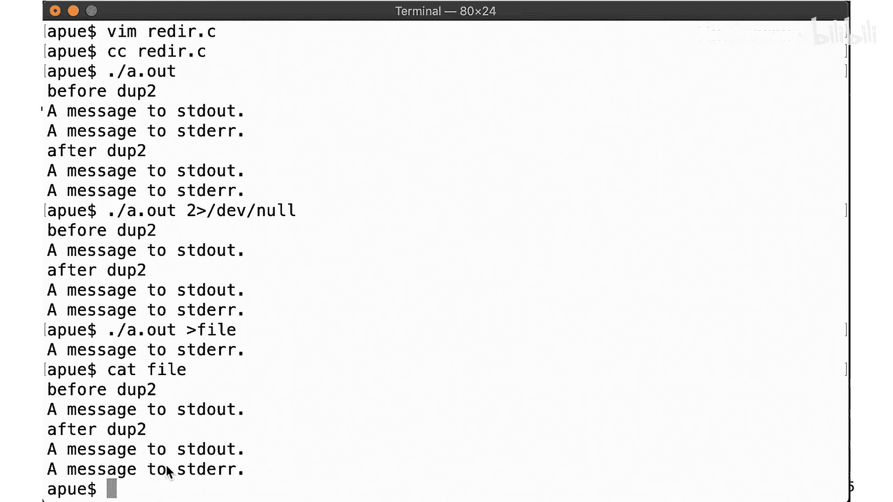

在代码中，它看起来像这样：
```c
// 示例代码：使用 dup2 重定向标准错误到标准输出
dup2(1, 2); // 将文件描述符2（标准错误）重定向到文件描述符1（标准输出）所指向的地方
```

让我们运行一个示例程序来演示。我们定义两个消息，一个用于标准输出，一个用于标准错误。`write_both` 函数会将给定的标记写入标准输出，然后将标准输出消息写入标准输出文件描述符，将标准错误消息写入标准错误文件描述符。在 `main` 中，我们调用 `write_both`，然后执行“标准错误到标准输出”的重定向（即我们将任何要发送到标准错误的消息重定向到标准输出当前指向的地方），然后再次调用 `write_both`。

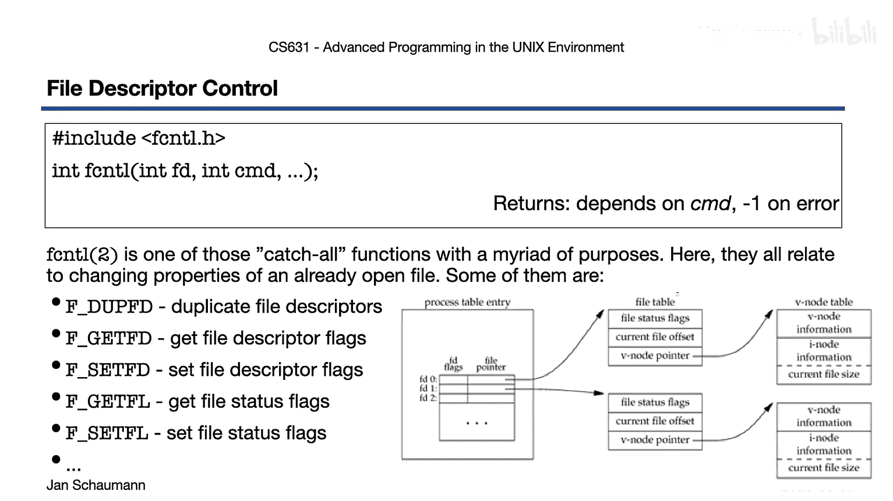

运行它。第一次调用时，标准输出和标准错误都连接到终端，因此输出是顺序的，完全符合预期。现在，让我们通过将其重定向到 `/dev/null` 来抑制标准错误。注意，在我们的第一次调用中，标准错误被抑制了，因为我们的Shell已将其重定向到 `/dev/null`。但随后我们将标准错误从它指向的任何地方重定向到标准输出当前指向的地方（终端）。因此，第二次调用 `write_both` 时的错误消息显示在终端上。

反过来呢？让我们将标准输出重定向到一个文件。现在我们看到终端上有一条错误消息，而文件内容显示，该错误消息来自第一次调用 `write_both`，当时标准错误默认仍连接到终端。在我们重定向标准错误到标准输出之后，对标准错误的写入最终进入了文件。

这说明了Shell如何使用 `dup2` 来执行输出重定向，并且是另一个例子，说明我们可以通过编写几行代码来轻松确认我们的理解。

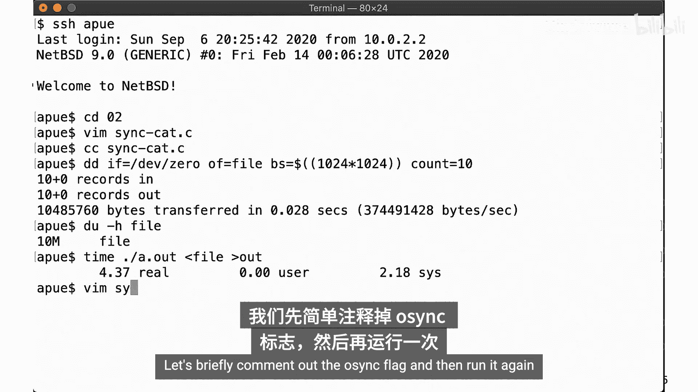

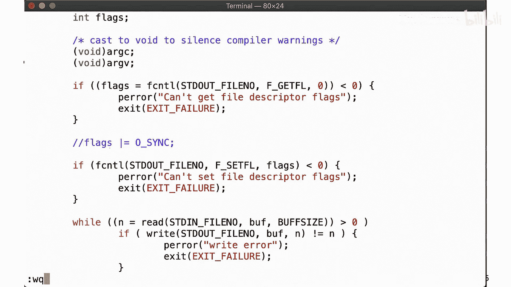

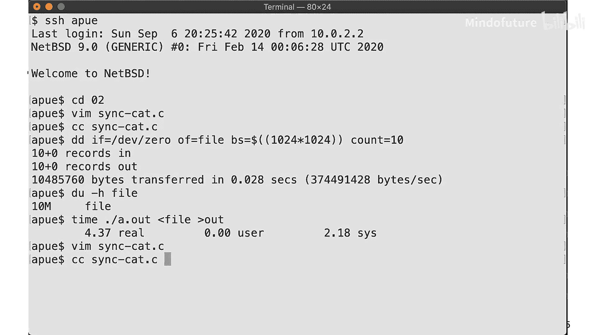

## `fcntl` 函数

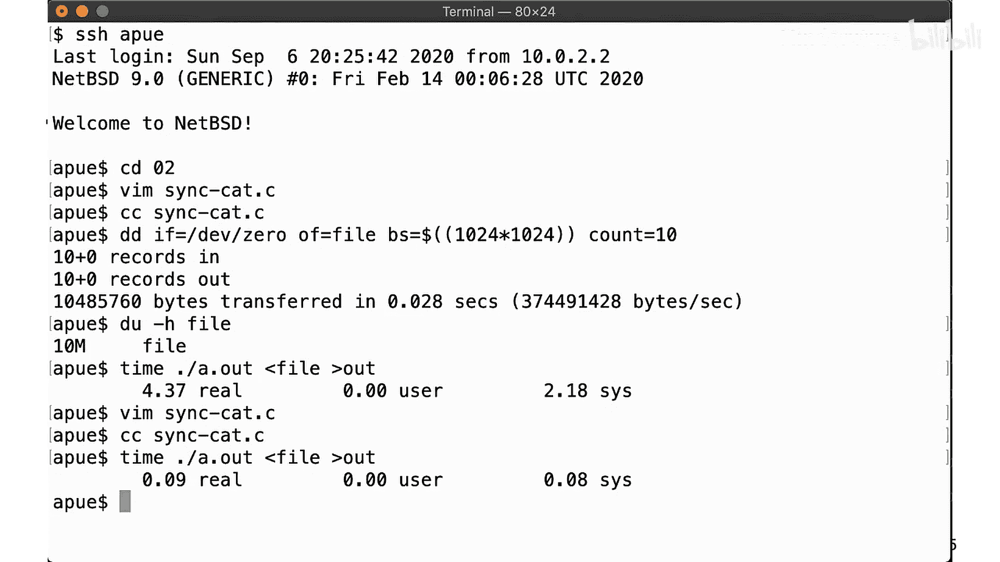

通过内核对象的可视化表示，我们看到文件描述符标志位于进程表条目中，而文件状态标志位于文件表中。这些通常在调用 `open` 时设置。但是，如果我们想在我们自己没有调用 `open` 的情况下（即当我们只有文件描述符时）检查或更改它们呢？

这就需要 `fcntl`。`fcntl` 是那种可以完成一大堆事情的“全能”函数之一。例如，你可以获取或设置这些标志，也可以通过 `fcntl` 复制文件描述符，以及执行许多操作系统特定的操作。请照常查阅手册页。

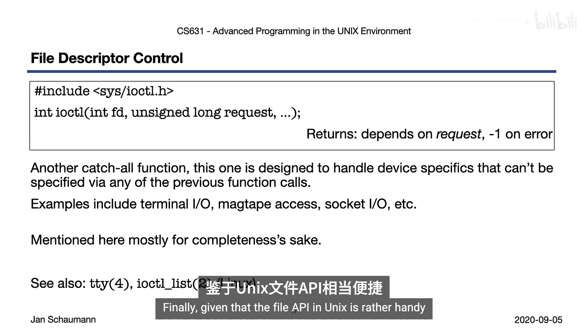

让我们看一个使用 `fcntl` 的例子。这里是我们简单 `cat` 程序的另一个版本。只是在这个版本中，我们希望确保I/O是同步完成的。提醒一下，同步输出将在每次调用后等待I/O刷新到磁盘，而异步输出允许I/O处理程序更高效地缓存I/O。由于我们简单的 `cat` 在标准输入上运行，我们不能用 `O_SYNC` 调用 `open` 来打开同步模式（就像对普通文件所做的那样），所以这里我们改用 `fcntl`。

要设置特定标志，我们必须首先获取现有标志，然后打开或关闭我们想要的标志，最后再设置标志。程序的其余部分与之前相同。

在运行之前，我们将创建一个足够大的文件来说明同步和异步模式之间的性能差异。现在，当我们运行同步 `cat` 时，我们观察到它需要一些时间才能完成。现在，它与异步模式相比如何？让我们暂时注释掉 `O_SYNC` 标志，然后再运行一次。同步模式保证I/O总是立即刷新，但显然会带来性能损失。我们可以使用 `fcntl` 设置适当的文件标志来打开同步模式。

## `ioctl` 与文件描述符作为文件

接下来是 `ioctl`。`ioctl` 是UNIX上另一个“全能”函数。许多接口都被硬塞进文件描述符API中，根本不是文件的东西也可能有某些标志或其他类型的设备特定设置。`ioctl` 系统调用通常用于为终端I/O、磁带机等设置这些标志。这里我们仅为了完整性而提及它，但鼓励你阅读各种手册页，因为当你进行更高级的系统编程时，会遇到 `ioctl`。

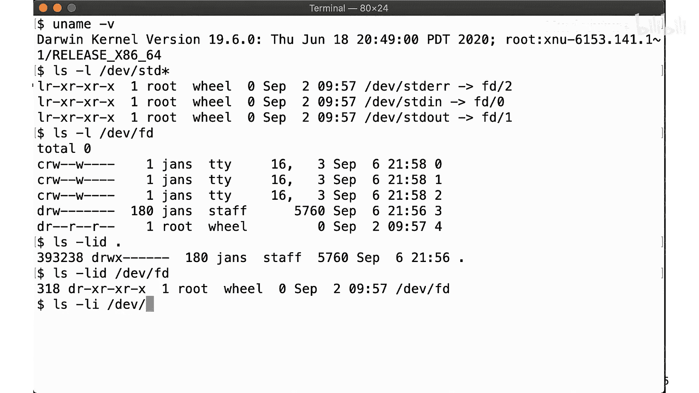

最后，鉴于UNIX中的文件API相当方便，让我们看看文件描述符如何被表示为文件。

我知道这听起来有点像“盗梦空间”，对吧？无论如何，许多UNIX版本在文件系统中支持 `/dev/stdin`、`/dev/stdout` 和 `/dev/stderr` 设备，让你可以分别访问标准输入、标准输出和标准错误。在我们的参考平台上，这些被表示为字符设备，可以代替常规文件使用。这允许你编写一个处理文件以及标准输入的程序，例如，通过将 `/dev/stdin` 指定为 `open` 的路径名。

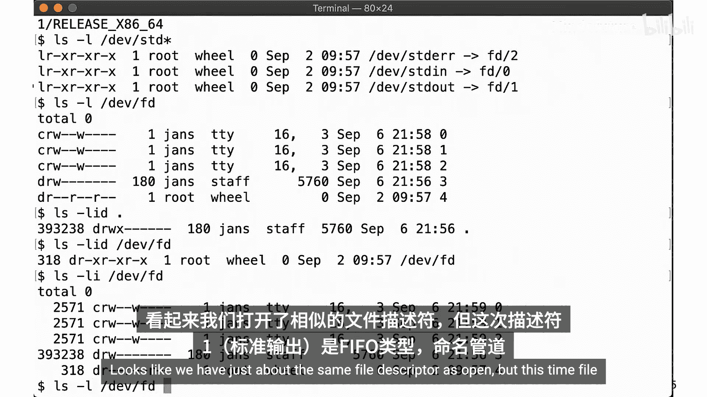

为了说明这一点，让我们创建两个文件，并在它们之间通过管道输入一些内容。这里我们看到 `cat` 按从左到右的顺序处理文件：首先显示第一个文件的内容，然后是 `/dev/stdin` 的内容（现在它从管道获取），接着是第三个文件的内容。

引用标准输入的另一种路径名方式可能是使用 `/dev/fd/0`。这是文件描述符0的另一种路径名表示。这些东西看起来像什么？让我们看看 `/dev/fd`。类似于 `/dev/stdin`，有连接到你的终端的字符设备。到目前为止还好。

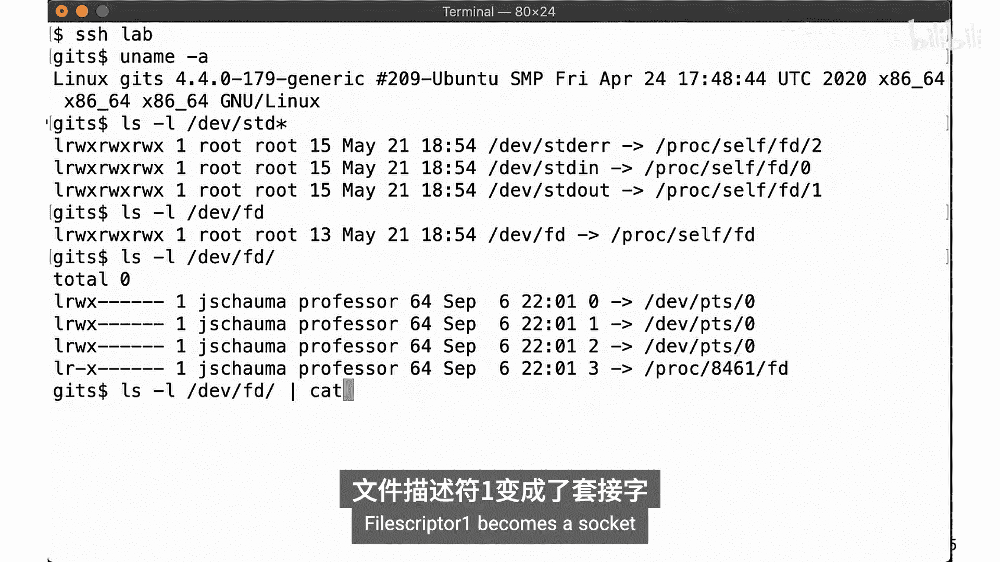

让我们再比较两个其他UNIX版本。首先，再次是macOS。在这个系统上，`/dev/stdin` 等分别是 `/dev/fd/0`、`1` 和 `2` 的符号链接。但是 `/dev/fd/0` 看起来像什么？在这里，`/dev/fd` 表示当前进程的打开文件描述符，所以我们当然期望看到文件描述符0、1和2连接到终端。但我们也看到两个额外的文件描述符，类型为目录。让我们找出它们是什么。让我们看看当前工作目录的i节点号，以及 `/dev/fd` 的i节点号。然后再看看 `/dev/fd/0` 的内容，但这次也显示那里显示的文件i节点号。注意，文件描述符0、1和2都是相同的i节点——它们连接到同一个东西，即我们的终端。文件描述符3连接到i节点号393238，这似乎是当前工作目录。文件描述符4，i节点号318，是目录 `/dev/fd`。所有这些都有道理，因为每个进程都有一个当前工作目录，它有一个句柄。我们要求 `ls` 命令列出 `/dev/fd` 的内容，所以它当然也有一个文件句柄。

现在，当我们创建一个管道时会发生什么？看起来我们打开了几乎相同的文件描述符，但这次文件描述符1（标准输出）的类型是54，一个名为“pipe”的命名文件。如果我们也将标准错误重定向到管道中，那么看到文件描述符2也变成FIFO就不足为奇了。这似乎是这个操作系统实现Shell管道的方式。

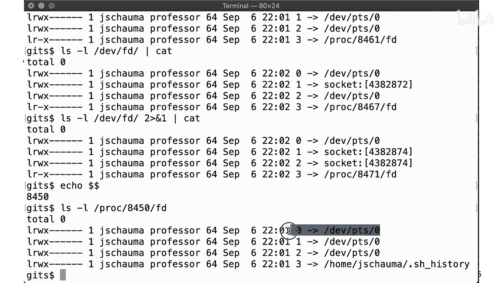

接下来，让我们再看看Linux。在这里，`/dev/stdin` 等也是一些符号链接，但指向 `/proc/self/fd`。`/proc` 是ProcFS的挂载点，ProcFS是一个伪文件系统，允许许多进程特定属性在文件系统中体现。确认 `/dev/fd` 也指向 `/proc/self/fd`。在其中，我们找到文件描述符。当我们列出它们时，在其中找到指向终端的文件描述符0、1和2，以及另一个指向 `/proc/8461/fd` 的条目，其中8461是 `ls` 命令的进程ID。

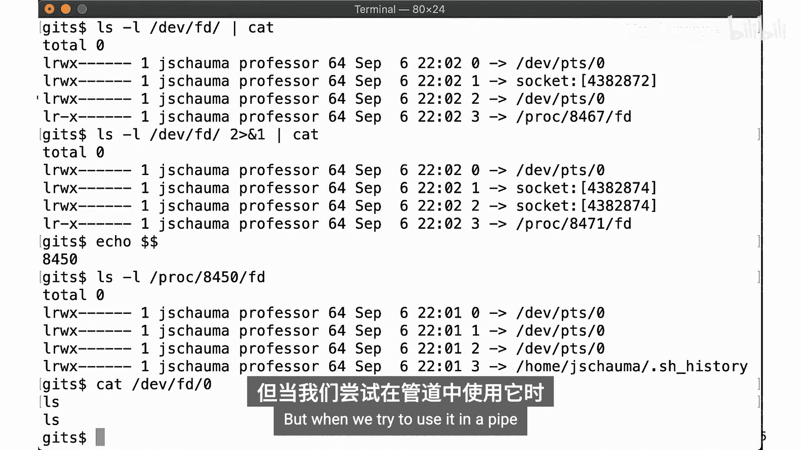

如果我们在这里使用管道会发生什么？看，文件描述符1变成了一个套接字。看起来这个操作系统将Shell管道实现为套接字或套接字对。我们将在以后更详细地讨论这些，以及FIFO管道和进程间通信。

现在注意，进程确实在两次调用之间发生了变化，这是预期的，因为每个命令都有自己的进程。我们当前Shell的进程ID是什么？8450。所以让我们看看这个Shell当前打开的文件描述符。和之前一样，文件描述符0、1和2连接到终端。然后，看起来这个Shell有一个指向Shell历史文件的文件句柄。默认情况下，许多Shell将所有输入的命令记录到历史文件中，所以Shell打开那个文件句柄并不奇怪。

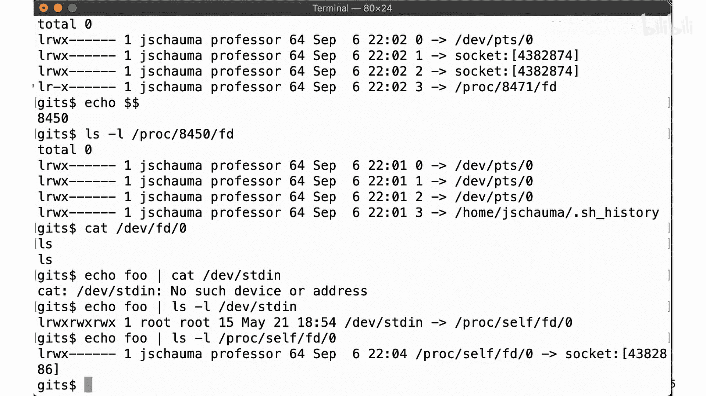

最后，让我们看看Shell如何实现管道为什么可能很重要。之前，我们能够使用路径名 `/dev/stdin` 在管道中处理文件时进行填充。`/dev/fd/0`（即 `/dev/stdin` 的端点）在连接到终端时按预期工作。但当我们尝试在管道中使用它时，我们得到一个奇怪的错误：“/dev/stdin: No such device or address”。这是因为，正如我们上面看到的，Linux似乎使用套接字实现管道。但你不能打开一个套接字。我们有其他系统调用来处理套接字。但 `cat` 命令对套接字一无所知。它被给定了一个路径名 `/dev/stdin`，并尝试打开该路径名，现在失败了。这提醒我们，即使不同的UNIX系统行为相似并且应该遵循相同的语义，但有时基于某人选择实现某个特性的方式，事情可能会中断或以意想不到的方式运行。

## 总结

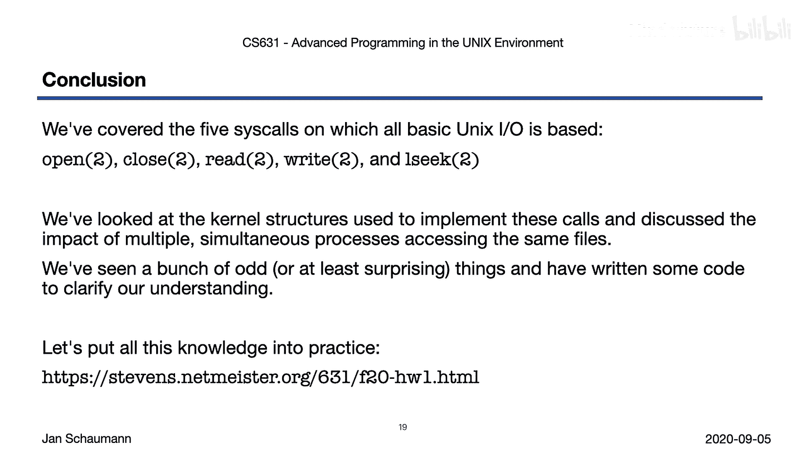

在本节课中，我们详细介绍了用于几乎所有UNIX文件I/O的五个基本系统调用。我们运行了许多代码示例来澄清我们的理解，并说明了一些可能令人惊讶的方面。幻灯片PDF中还有一些额外的链接，请务必查看。掌握了所有这些知识，你现在已经完全可以开始将你的知识付诸实践了。我已经发布了第一份作业的链接。我们将在课堂上更详细地讨论作业。在下一讲中，我们将继续讨论文件和目录，并将花大量时间与我们的新朋友——`stat` 结构体——相处。届时，感谢观看。再见。