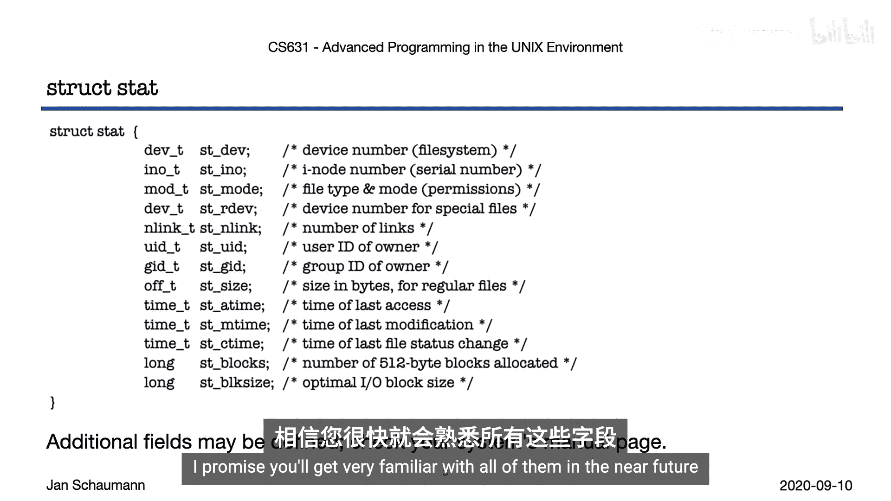
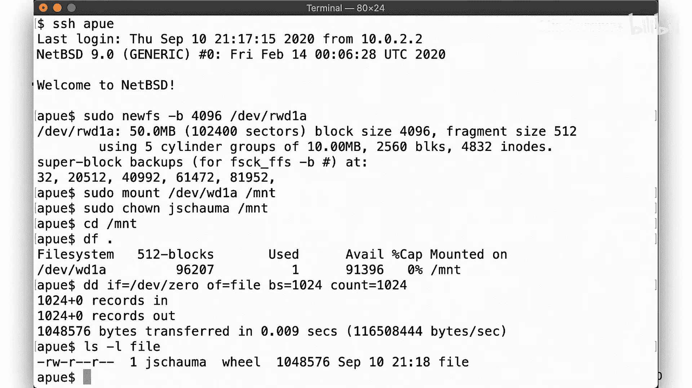
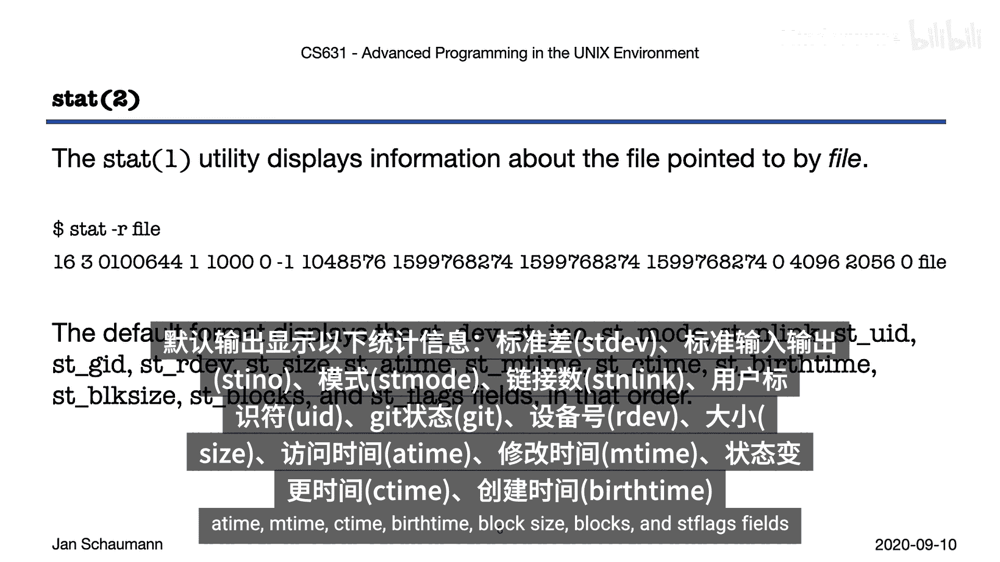
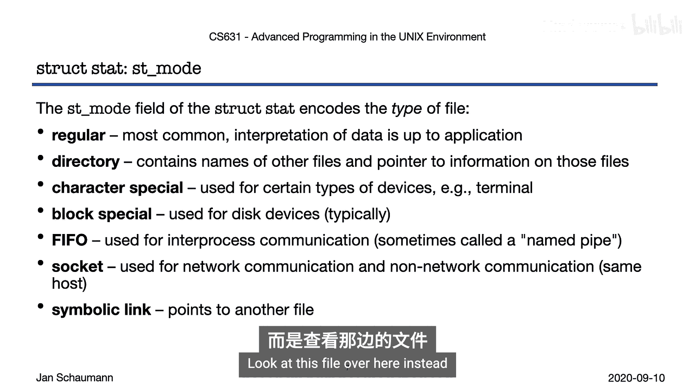
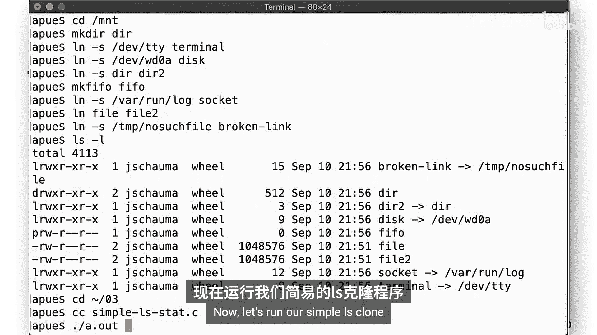
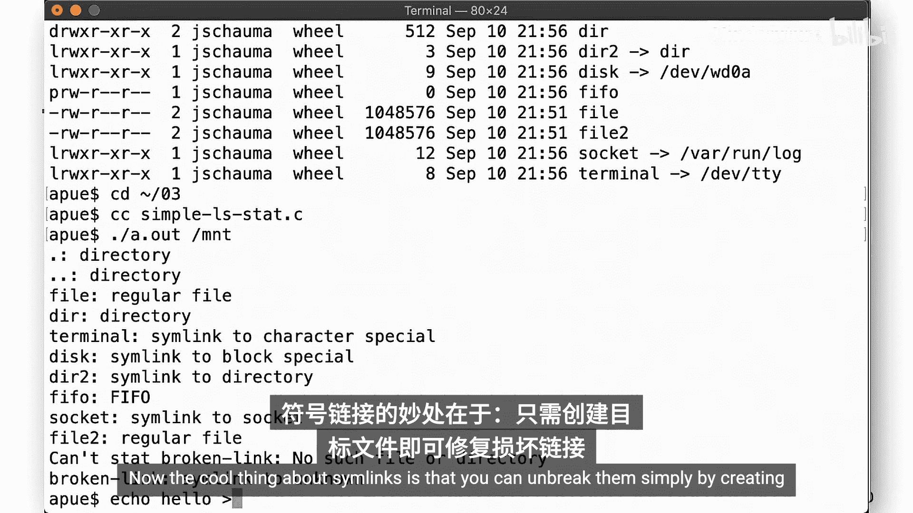
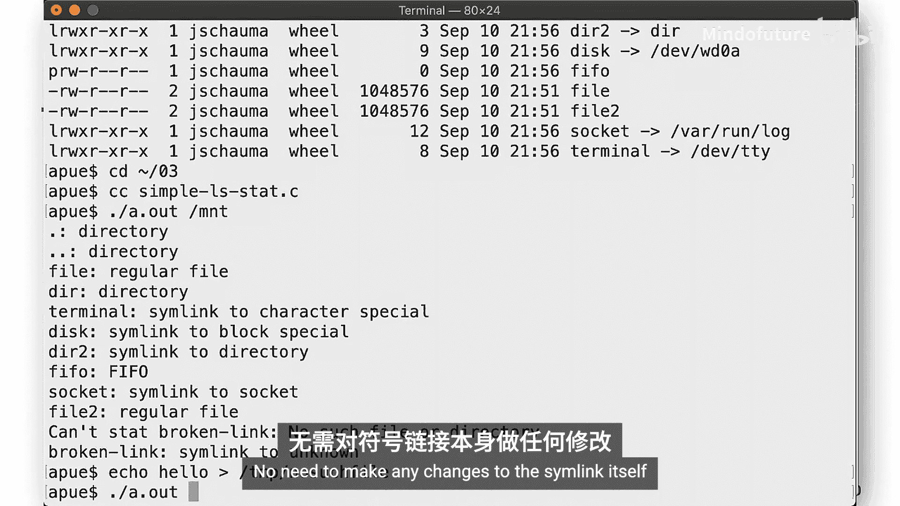
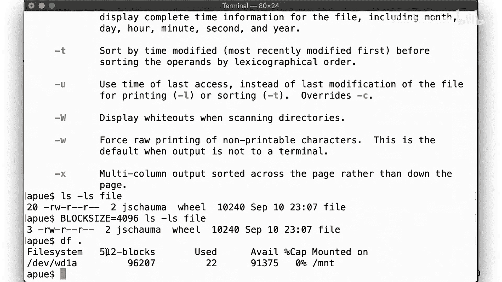
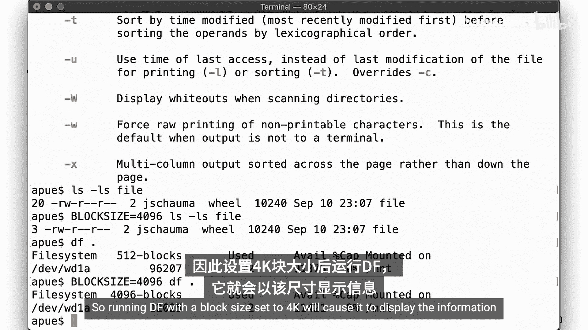
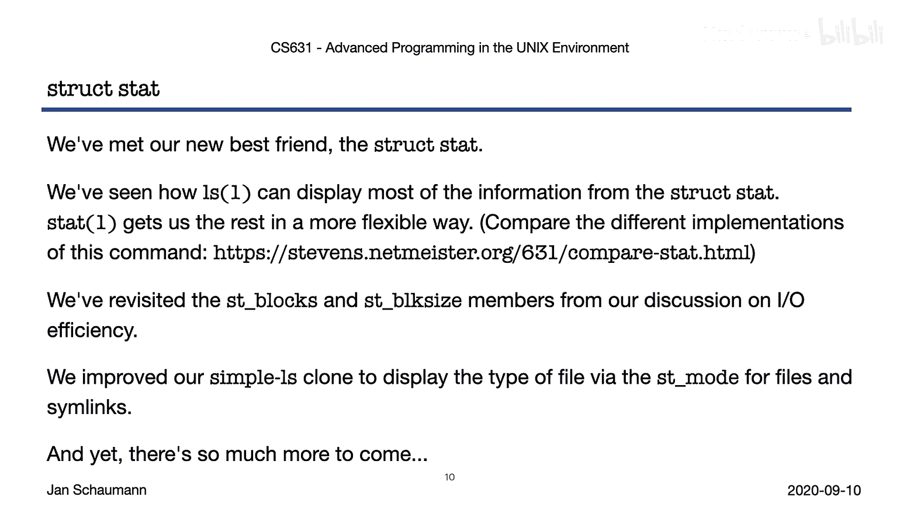

# 010：Week 03 - 关于 stat(2) 的一切 😊

在本节课中，我们将要学习如何获取文件的元数据信息。我们将深入探讨 `stat` 系统调用家族，了解其返回的数据结构 `struct stat`，并学习如何利用这些信息来识别文件类型、权限、大小等属性。


## 概述

在之前的课程中，我们重点讨论了文件描述符。但在过程中，我们遇到了文件的许多属性，例如在提升一个简单 `cat` 命令克隆的效率时，我们看到了最佳文件 I/O 块大小。在本节及接下来的课程中，我们将更详细地重新审视这些不同的属性。

## 获取文件信息：stat 系统调用

为了获取关于文件的信息（即所有元信息，而非文件内容），我们引入了 `stat` 系列系统调用。与文件和目录上下文中将涵盖的 `fstat` 相关调用一样，`stat` 有三种形式：`stat`、`lstat` 和 `fstat`。

`fstat` 版本与其他版本的不同之处在于它接受一个文件描述符作为参数，这与我们之前讨论的大多数 I/O 操作应在文件描述符上进行是一致的。但是，为了获得文件描述符，首先必须打开一个文件。正如我们将在未来的课程中看到的，在标准的 Unix 文件系统中，文件数据和文件元数据是明确分离的。通常，能够在不打开文件的情况下获取其信息是非常有用的。

因此，为了获取文件信息，我们向 `stat` 传递一个路径名，以及一个指向 `struct stat` 的指针，该系统调用将填充这个结构体。正如我们在讨论 `open` 系统调用时所见，也存在允许原子地访问当前工作目录之外的相对路径名的需求。因此，`fstatat` 系统调用满足了这一需求，类似于 `openat`，它接受一个引用目录的额外文件描述符作为参数。

通常，`stat` 的返回码在成功时为 0，在错误时为 -1，并设置 `errno` 以指示错误性质。

## 理解 struct stat 数据结构



我们感兴趣的是获取文件的所有元信息。函数高效地提供复杂信息并遵循简单、有意义的错误代码约定的惯用方法是，接受一个指向数据结构的指针作为输入，然后由调用填充该数据结构。在本例中，该数据结构就是 `struct stat`。

`struct stat` 的细节通常是特定于版本的，其最低共同标准是由 POSIX 定义的字段，如本幻灯片所示。当然，您特定的 Unix 版本可能支持额外的字段，因此请务必查阅您的手册页以获取详细信息。

POSIX 要求的字段都帮助详细描述文件，并暴露了许多工具使用的重要信息，最著名的当然是 `ls` 命令。您很快就会非常熟悉它们。

## 实践：创建测试环境

在我们查看 `struct stat` 信息之前，让我们为我们的虚拟机创建一个小的第二块磁盘来操作。我们在接下来的几个视频片段中使用这个磁盘来更好地理解文件系统。当然，您可以使用 VirtualBox UI 添加新磁盘，但那样有什么乐趣呢？我们想使用命令行。



以下是创建和挂载新磁盘的步骤：

1.  创建一个新的 VMDK 格式磁盘，大小为 50 MB。
    ```
    VBoxManage createmedium disk --filename disk2.vmdk --size 50 --format VMDK
    ```
2.  将新磁盘作为 IDE 驱动器附加到虚拟机。
    ```
    VBoxManage storageattach CS631 --storagectl IDE --port 0 --device 1 --type hdd --medium disk2.vmdk
    ```
3.  启动虚拟机并登录。
4.  在新磁盘上创建文件系统（块大小为 4096 字节）。
    ```
    newfs -b 4096 /dev/ada1
    ```
5.  将新磁盘挂载到 `/mnt`。
    ```
    mount /dev/ada1 /mnt
    ```
6.  将 `/mnt` 的所有权更改为当前用户，以便无需超级用户权限即可写入数据。
    ```
    chown $USER /mnt
    ```
7.  查看可用空间。
    ```
    df -h /mnt
    ```
8.  创建一个简单的 1 MB 文件。
    ```
    dd if=/dev/zero of=/mnt/file bs=1M count=1
    ```
9.  使用 `ls -l` 显示文件。

## 解析 ls -l 的输出

现在，让我们仔细看看 `ls -l` 的输出。输出中的每个字段都源自我们之前看到的 `struct stat` 中的信息。`ls` 调用 `stat`，然后以给定格式显示数据。

以下是 `ls -l` 输出与 `struct stat` 字段的对应关系：
*   左侧的权限字符串源自 `st_mode` 字段。
*   下一个是此文件的链接数，即与此特定 inode 关联的文件名数量。
*   之后是文件的所有者。这里显示的符号用户名源自 `st_uid` 字段。
*   同样，组所有者名称源自 `st_gid` 字段。
*   接下来，`ls` 显示以字节为单位的文件大小，来自 `st_size` 字段。
*   右侧显示的数据是最后修改时间戳，由 `ls` 根据 `st_mtime` 字段以便于人类阅读的格式方便地格式化。
*   最右边当然是文件名，它根本不在 `struct stat` 中。我们将在下一讲中回到这一点，但现在请记住，文件名不是文件的属性，而是目录中找到的映射。

## 使用 stat 命令

正如我们所见，`ls` 命令的输出包含了许多来自 `struct stat` 的信息。但通常，有不止一种方法可以做到这一点。具体来说，现在大多数 Unix 版本都有一个 `stat` 命令，允许您检索和检查完整的 `struct stat`，包括 `ls` 未暴露的字段。不过我们应该提到，这个 `stat` 命令不是 POSIX 的一部分。因此，不同 Unix 版本之间 `stat` 命令的输出和用法差异很大。

以下是之前显示的文件上调用 `stat` 的示例输出。默认情况下，`stat` 以人类友好的输出显示信息。`-r` 标志将显示更改为显示实际值。



具体来说，默认输出显示以下字段：`st_dev`、`st_ino`、`st_mode`、`st_nlink`、`st_uid`、`st_gid`、`st_rdev`、`st_size`、`st_atime`、`st_mtime`、`st_ctime`、`st_birthtime`、`st_blksize`、`st_blocks` 和 `st_flags`。

## 深入 struct stat 字段

以下是 `struct stat` 中关键字段的详细说明：

*   **`st_dev`**：标识文件所在的设备 ID（例如磁盘）。与 inode 号一起，这在文件系统的所有挂载点中唯一标识一个文件。
*   **`st_ino`**：文件的 inode 号。
*   **`st_mode`**：编码文件类型以及权限，您可能在这里熟悉的八进制显示中认出它。
*   **`st_nlink`**：链接计数。
*   **`st_uid`**：数字用户 ID。
*   **`st_gid`**：数字组 ID。
*   **`st_rdev`**：仅用于某些设备，这就是为什么我们看到对于常规文件（如本例）它被设置为 -1。
*   **`st_size`**：文件大小（字节），不言自明。
*   **`st_atime`**、**`st_mtime`**、**`st_ctime`**：分别表示文件的最后访问时间、修改时间和文件状态更改时间。正如我们在早期课程中描述的，此类时间以自纪元以来的秒数保存。我们将在未来的视频片段中回到这三个时间戳的含义。
*   **`st_birthtime`**：另一个时间戳，不是 POSIX 要求的，可能并非所有 Unix 或文件系统版本都支持，它表示 inode 创建时间。在本例中，我们在额外磁盘上创建并挂载在 `/mnt` 下的文件系统类型是 FFSv1，它不支持 inode 创建时间。如果您在 VM 中对根文件系统上的文件运行 `stat` 命令（根文件系统是使用系统默认的 FFSv2 文件系统创建的），您应该在这里看到一个实际的时间戳。
*   **`st_blksize`** 和 **`st_blocks`**：我们已经见过。`st_blksize` 是文件系统 I/O 的首选块大小。`st_blocks` 是分配给文件的 512 字节块的数量。
*   **`st_flags`**：编码额外的文件标志，我们将在未来看到，尽管如果您好奇，可以 already 查看 `chflags` 手册页和 `ls` 的 `-O` 标志。

## 文件类型

正如我们提到的，`st_mode` 不仅包含文件权限，还包含文件类型。让我们仔细看看我们可能遇到的文件类型。

以下是主要的文件类型：

1.  **常规文件**：当我们说“文件”时，大多数人真正指的是这个。文件仅仅是将一堆字节存储到磁盘的一种方式。重要的是要记住，内核不关心你用这些字节做什么。也就是说，二进制文件、图像文件、电子表格、电子邮件附件或共享库之间没有区别。就文件系统而言，它们都是没有任何特定含义的常规文件。由应用程序来解释在磁盘上找到的字节序列。
2.  **目录**：是的，目录是一种特殊类型的文件，它将符号名称（字符串，人类往往觉得非常方便）映射到 inode 号，允许文件系统找到与该字符串关联的文件元信息和数据块。任何这样的目录条目，即 inode 和字符串之间的映射，被称为链接或硬链接。在任何文件系统上，甚至在一个目录内，可能有许多这样的字符串到特定 inode 的映射。我们将在后面的部分中了解更多关于目录的信息，并在下周的主题中查看一些文件系统实现方面。
3.  **设备文件**：通常表示为根文件系统中 `/dev` 目录下的文件。这些设备分为字符特殊设备（例如终端）和块设备（例如磁盘）。
4.  **命名管道（FIFO）**：简而言之，这是一个进程间通信端点，类似于 shell 管道，但具体化在文件系统中，允许不相关的进程相互通信。
5.  **套接字文件**：同样用作同一系统上不相关进程进行进程间通信的集合点。请注意，这些套接字类型的文件与网络套接字不同，尽管这里使用的通信 API 是相同的。我们将在未来的课程中重新讨论这两者。
6.  **符号链接**：有趣的是，这些文件的内容就是另一个文件的路径名，当访问时，它们只是说：“哦，别看我，去看那边的那个文件。”

## 实践：识别文件类型

让我们看看在文件系统上遇到的一些不同的文件类型。还记得我们第一周的简单 `ls` 克隆吗？它所做的只是打开目录，遍历条目，并打印出遇到的文件的名称。

让我们改进这个程序，让它告诉我们它遇到的是什么类型的文件。为此，我们进行以下更改：

1.  首先，我们将当前工作目录更改为目标目录，这样我们就可以通过传递文件名来简单地调用 `stat`，从而避免了构造绝对路径名的需要。
2.  然后，当我们遍历目录条目时，我们调用 `stat` 并让它填充这里的 `struct stat` 缓冲区。
3.  根据 `struct stat` 中的信息，我们确定文件类型。我们的 `get_type` 函数使用 `st_mode` 字段上的 `S_IS*` 宏来识别文件类型，为每种文件类型返回一个描述性字符串，包括处理未知文件类型，因为嘿，你永远不知道，我们希望编写防御性强、健壮的代码。
4.  在识别出文件类型后，我们调用 `lstat`。`lstat` 的行为与 `stat` 类似，但如果所讨论的文件是符号链接类型，我们会获取关于符号链接本身的信息。请记住，符号链接是一个说“不，去看那边的那个文件”的文件。所以当我们调用 `stat` 时，它会去看那边的那个文件，即符号链接指向的任何文件。因此，如果我们想识别符号链接并确定符号链接本身的文件所有权等，我们需要 `lstat`。

在运行此程序之前，让我们创建一堆不同类型的文件。

以下是创建各种类型文件的命令示例：
```
# 创建一个目录
mkdir mydir

# 创建指向字符特殊设备的符号链接
ln -s /dev/tty link_to_char



# 创建指向块特殊设备的符号链接
ln -s /dev/ada0 link_to_block

# 创建指向目录的符号链接
ln -s mydir link_to_dir

# 创建一个命名管道 (FIFO)
mkfifo myfifo

# 创建一个指向套接字文件的符号链接 (假设 /var/run/log 是一个套接字)
ln -s /var/run/log link_to_socket

# 创建一个常规文件
touch file

# 为文件创建第二个硬链接
ln file file2

# 创建一个指向不存在的文件的符号链接
ln -s /nonexistent broken_link
```

现在，让我们看看 `ls -l` 的输出是什么样子。我们看到文件类型由左侧的第一个字符标识：`l` 表示符号链接，`d` 表示目录，`p` 表示 FIFO（命名管道），常规文件没有字符。我们观察到 `file` 和 `file2` 大小相同，并且具有相同的最后修改时间戳。

现在，让我们运行我们简单的改进版 `ls` 程序。正如预期的那样，我们正确识别了文件类型：目录、常规文件，以及那些指向其他内容的符号链接被 `lstat` 识别为符号链接，而被常规 `stat` 识别为符号链接指向的任何文件。我们注意到可能存在损坏的符号链接，即指向不存在的路径名的符号链接。在这种情况下，`stat` 失败，但 `lstat` 成功，这就是为什么我们得到“slink to unknown”的输出。



关于符号链接很酷的一点是，您可以通过创建目标来简单地修复它们，无需对符号链接本身进行任何更改。一旦目标存在，程序就能够通过符号链接对其进行 `stat`。

## 硬链接与文件数据



现在让我们回到另一种类型的链接：硬链接。正如我们一分钟前所示，`file` 和 `file2` 看起来完全相同。我们操作一个文件，例如通过截断它，然后将字符串“foo”写入其中。然后 `file2` 也发生了变化。我们注意到 `file` 和 `file2` 的链接数显示为 2。也就是说，有两个东西指向现在包含“foo”的单个文件。



让我们让 `ls` 显示文件的 inode 号。我们看到两个文件的 inode 号都是 3，这意味着它们实际上不是两个文件，而是同一个文件。

让我们向文件读入一些数据，也许 10K 就足够了。如果我们想尽可能高效地读取文件，我们希望以 4K 块读取，如 `struct stat` 的 `st_blksize` 成员所示。请记住，当我们创建文件系统时，我们明确指定了 4K 的块大小，所以这个数字在这里不应该让人感到意外。

我们还可以通过 `ls` 的 `-s` 标志查看这个 10K 文件实际使用了多少个磁盘块。在这种情况下，我们看到文件使用了 20 个块。但是等等，20 个块，块大小为 4K？这超过了 10K 的总数据。让我们快速查看 `man ls` 对块大小有什么说明。好的，我们在这里。`-s` 以 512 字节块或环境中的块大小为单位显示块。也就是说，这里报告的 20 个块是 20 个 512 字节的块。这正好加起来是 10K。

但我们的文件系统使用 4K 块。那么文件占用了多少个这样的块呢？让我们快速设置块大小环境变量，以便 `ls` 可以告诉我们。我们得到了，3 个块。嗯，严格来说，10K 需要 2.5 个块，但我们不能使用半个块，所以我们的 10K 需要 3 个 4K 块。

请注意，以 512 字节块显示信息的默认设置在整个系统中都很常见，例如运行 `df` 命令时。但一致性是 Unix 环境的关键部分，这些工具通常也可以考虑相同的环境变量。因此，将块大小设置为 4K 运行 `df` 将导致它以这些大小的块显示信息。

关于磁盘上的块大小与文件系统中的块大小，未来课程中还有更多内容。你很幸运。

## 总结

好了，让我们在此告一段落。我们已经涵盖了很多内容。我们遇到了我们的新朋友 `struct stat`。相信我，在不久的将来，您会非常熟悉它和所有其他字段。





我们还看到了 `ls` 命令如何利用 `struct stat` 信息，以及 `stat` 命令如何提供剩余的字段。比较这些命令的实现是一个有用的练习。

我们重新审视了关于 I/O 效率讨论中的 `st_blocks` 和 `st_blksize` 成员。

我们改进了我们简单的 `ls` 克隆，以显示它遇到的文件类型，包括处理符号链接。

对于我们的第一个片段来说还不错，但正如经常发生的那样，我们只是触及了表面，还有更多内容即将到来。所以请继续关注我们的下一节，我们将深入探讨文件所有权和权限。



感谢观看，请确保在您自己的系统上重现此处显示的所有命令练习。下次见。